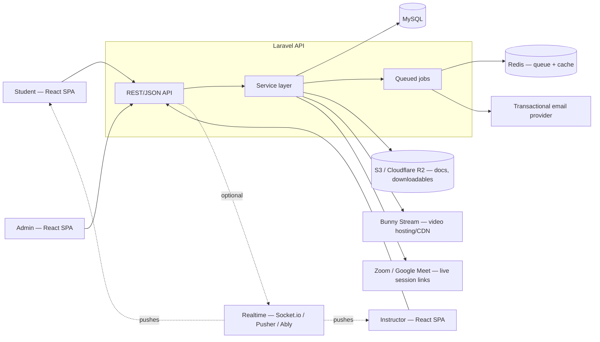
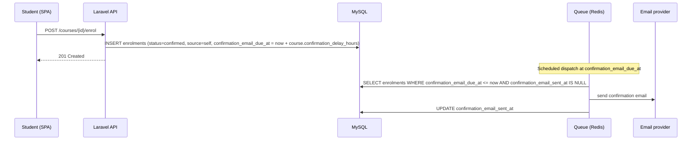
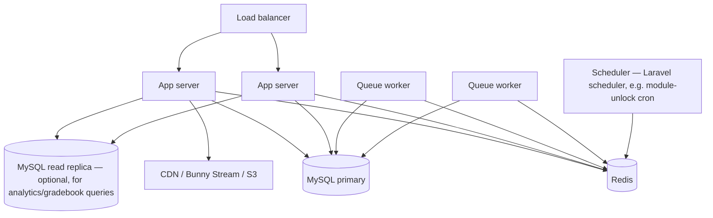

# Architecture — Resnet LMS

Companion to `schema.sql`/`erd.md` (data layer) and `ai-workflow-rules.md` (working
conventions). This document covers system structure: how the pieces fit together and how data
moves through them.

---

## 1. System context

**Shape:** a single Laravel API backend serving a React SPA, with MySQL as the system of record.
Not microservices — the domain is small enough that a modular monolith is the right call for
MVP; service boundaries below are logical (folders/namespaces), not separate deployables.

---

## 2. Tech stack

| Layer | Choice | Why |
|---|---|---|
| Backend | Laravel (PHP) | Batteries-included: queues, auth, migrations, policies — matches the PRD's stack decision |
| Database | MySQL 8 | Matches `schema.sql`; JSON columns used sparingly for genuinely variable data (event metadata, quiz answer arrays) |
| Queue/jobs | Redis + Laravel Queues | Delayed confirmation emails, unlock checks, notification fan-out |
| Frontend | React (SPA) | Consumes the API over JSON; no server-rendered Blade views for the app itself |
| Video | Bunny Stream | Adaptive streaming + CDN without building video infra |
| File storage | S3-compatible object storage | Documents, downloadables, SCORM packages — never local disk |
| Email | Resend | Transactional email (confirmation, notifications) |
| Real-time (optional) | Socket.io or Pusher/Ably | Live message delivery, forum reply pushes — not required for MVP correctness, only responsiveness |
| Auth | Laravel Breeze (`api` stack) + Sanctum + Socialite | Breeze scaffolds token-auth endpoints fast; Socialite layers Google on top |

---

## 3. Logical service boundaries

Each of these is a namespace/folder (`app/Services/...`), not a separate service:

- **Catalogue & Enrolment** — course/category CRUD, applying/enrolling, bulk CSV import,
  confirmation-email scheduling.
- **Course Structure** — modules, groups/cohorts, module-group scoping, module items ordering.
- **Content Delivery** — resource CRUD per type, SCORM/xAPI handling, video upload orchestration
  (talks to Bunny Stream), live-session scheduling.
- **Assessment** — assignments, rubrics, submissions, late-penalty calculation, question banks,
  evaluations, attempts, auto-grading of objective questions.
- **Progress Engine** — the one place that decides "is this module complete / unlocked". Every
  other service reports a signal (video ping, submission, quiz pass) into this engine; nothing
  else computes lock state independently. See §5 for the algorithm.
- **Certification** — triggers on course completion, generates/issues certificates.
- **Payments** — order creation/status (gateway integration deferred).
- **Communication** — conversations/messages, tickets, announcements, forums + moderation,
  notification dispatch.
- **Analytics & Audit** — engagement event ingestion, dashboard queries, audit log writes.

Keeping the Progress Engine as a single owner matters: video-watch tracking, mark-as-read,
assignment submission, and quiz pass-checks all originate in different services but must agree
on one definition of "module complete" — that logic lives in one place, not duplicated per
resource type.

---

## 4. API design

- REST/JSON, versioned under `/api/v1`.
- Auth: - Auth: scaffolded with **Laravel Breeze (`api` stack)** on top of **Sanctum** — Breeze wires up
  register/login/logout/password-reset/email-verification against Sanctum tokens with no
  Blade/Inertia views, matching a standalone React SPA calling a JSON API. **Primary login is
  email + password** (Breeze's default flow); **Google OAuth (Laravel Socialite) is layered on
  top as a linked, non-primary login method** — a non-negotiable requirement, not the default
  signup path. Both paths converge on the same Sanctum token, so Policies/audit logging/every
  downstream check are auth-method agnostic. Linked Google accounts are stored in
  `oauth_accounts` (see `schema.sql`), keyed by provider + provider user ID, matched to an
  existing `users` row by verified email to avoid duplicate accounts when someone uses both
  methods. Students self-register (either method); instructors and admins are
  invite-provisioned rather than open self-signup. Admin/instructor accounts are the strongest
  2FA (TOTP) candidates given their grading/audit-sensitive permissions — flagged as a
  fast-follow, not required for MVP.
- Authorization: Laravel Policies per resource, checked against `users.role` and, where relevant,
  `course_instructors` / `enrolments` / `group_members` membership (e.g. an instructor can only
  grade submissions for courses they're assigned to).
- Pagination: cursor or offset pagination on all list endpoints (catalogue, forum threads,
  gradebook) — never return unbounded collections.
- Errors: consistent JSON error shape (`{ "error": { "code", "message", "fields": {} } }`) so the
  React client can handle validation errors generically.

---

## 5. Key workflows

### 5.1 Enrolment → delayed confirmation

No approval step — FR-3 removes the eligibility gate entirely, so the only asynchronous part is
the delay itself.

### 5.2 Module unlock evaluation

Run both on-demand (when a student opens a course) and on a schedule (cron, catches
time-based unlocks even if nobody's browsing):

1. For each module in order, check: is `scheduled_start_at` (if set) in the past?
2. Is the previous module's `module_progress.status = 'completed'` for this student (skip for
   module 1)?
3. If both true and current status is `locked` → flip to `not_started`, set `unlocked_at`, queue
   a "module unlocked" notification.

### 5.3 Module completion rollup

Fired whenever a `resource_progress`, `assignment_submissions`, or `evaluation_attempts` row
changes to a completing state:

1. Load all `module_items` for the module where `is_required = true`.
2. For each, check its completion source (resource type's own signal / submission exists /
   attempt passed).
3. If all required items are complete → set `module_progress.status = 'completed'`,
   `completed_at = now`, then trigger §5.2 for the *next* module.
4. If this was the last module in the course → trigger certificate issuance (§5.4).

### 5.4 Certificate issuance

Triggered when the last module in a course completes for a student: generate the certificate
(PDF, off the request cycle via a queued job), store `certificate_url`, write to
`certificates`, send a notification.

---

## 6. Deployment topology (indicative)

- App servers are stateless — sessions/tokens don't pin a user to a server.
- Queue workers scale independently of web servers (email/notification volume grows with
  enrolment, not with page views).
- Read replica is optional at MVP scale; called out because analytics/gradebook queries are the
  first thing likely to need it once course volume grows.

---

## 7. Security & compliance

- RBAC enforced server-side (Policies), never trust a frontend role check.
- Data protection: personal data handling aligned with applicable local law (e.g. Uganda's Data
  Protection and Privacy Act) — data minimization in `engagement_events.event_meta`, and export/
  delete-on-request capability should exist even though the PRD doesn't detail it yet.
- Audit logging (`audit_logs`) on: enrolment status changes, grade changes, user
  suspension/role changes.
- File uploads validated server-side by type/size before hitting object storage.
- Secrets (DB credentials, email provider keys, Bunny Stream keys) via environment config, never
  committed.

---

## 8. Non-functional considerations carried into architecture

- **Accessibility (WCAG 2.1 AA):** video resources carry `caption_url`; frontend components must
  support keyboard navigation and screen readers — an architectural constraint on the React
  component library choice, not just a content requirement.
- **Mobile responsiveness:** SPA must work down to mobile viewport widths; no desktop-only
  interaction patterns (e.g. hover-only menus) in shared components.
- **Video at scale:** deliberately offloaded to Bunny Stream rather than self-hosted — keeps the
  app tier stateless and avoids storing/transcoding large media in the primary stack.
