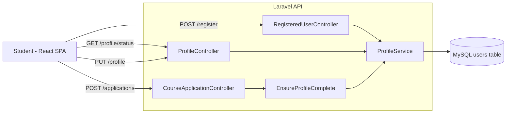
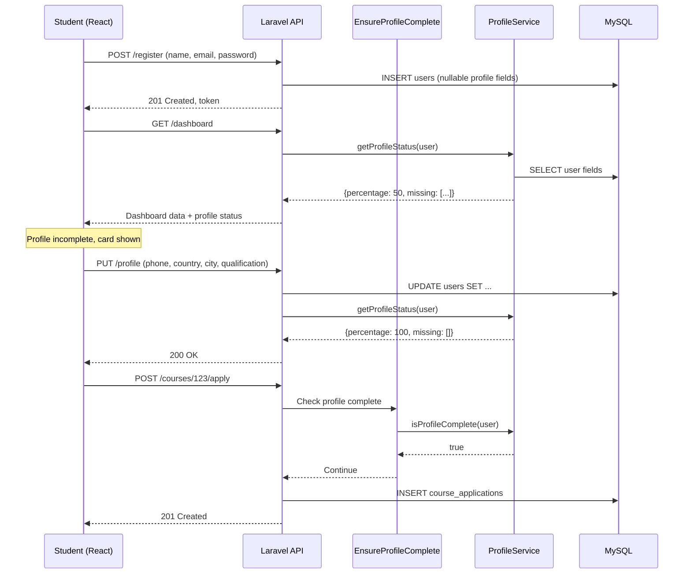

# Technical Design Document
## Progressive Student Profile Completion

## Overview

The Progressive Student Profile Completion feature introduces a non-intrusive user onboarding experience that allows students to register with minimal information (Name, Email, Password) and complete their profile progressively. The system tracks profile completeness, displays a completion dashboard card, and enforces profile completion before students can apply for courses.

This design builds upon the existing Laravel Breeze + Sanctum authentication system and reuses the `users` table with minimal schema changes. The frontend React SPA will consume new API endpoints to display profile status and provide a seamless completion workflow.

**Key Design Principles:**
- Minimize friction at registration (only 3 fields required)
- Progressive disclosure (show profile completion prompts contextually)
- Single source of truth for required fields (centralized service)
- Graceful handling of existing users (nullable new columns)
- Reusable middleware for enforcement


## Architecture

### System Context




### Component Interaction Flow




## Components and Interfaces

### Backend Components

#### 1. ProfileService

**Location:** `app/Services/Profile/ProfileService.php`

**Responsibilities:**
- Define and manage the list of required profile fields
- Calculate profile completion percentage
- Identify missing required fields
- Validate profile completeness

**Public Methods:**

```php
class ProfileService
{
    /**
     * Get list of required profile field names
     * @return array<string>
     */
    public function getRequiredFields(): array;
    
    /**
     * Calculate profile completion percentage (0-100)
     * @param User $user
     * @return float
     */
    public function getCompletionPercentage(User $user): float;
    
    /**
     * Get list of missing required field names
     * @param User $user
     * @return array<string>
     */
    public function getMissingFields(User $user): array;
    
    /**
     * Check if profile is 100% complete
     * @param User $user
     * @return bool
     */
    public function isProfileComplete(User $user): bool;
    
    /**
     * Get detailed profile status with field completion state
     * @param User $user
     * @return array{percentage: float, missing: array<string>, completed: array<string>}
     */
    public function getProfileStatus(User $user): array;
}
```


#### 2. EnsureProfileComplete Middleware

**Location:** `app/Http/Middleware/EnsureProfileComplete.php`

**Purpose:** Protect routes that require a complete profile (e.g., course applications)

**Implementation:**

```php
class EnsureProfileComplete
{
    public function __construct(private readonly ProfileService $profileService) {}
    
    public function handle(Request $request, Closure $next): Response
    {
        $user = $request->user();
        
        if (!$this->profileService->isProfileComplete($user)) {
            return response()->json([
                'error' => [
                    'code' => 'profile_incomplete',
                    'message' => 'Please complete your profile before applying for this course.',
                    'missing_fields' => $this->profileService->getMissingFields($user),
                ]
            ], 403);
        }
        
        return $next($request);
    }
}
```

**Route Registration:** Applied to `POST /api/v1/courses/{course}/apply` endpoint


#### 3. ProfileController

**Location:** `app/Http/Controllers/Api/V1/ProfileController.php`

**Endpoints:**

```php
class ProfileController extends Controller
{
    public function __construct(private readonly ProfileService $profileService) {}
    
    /**
     * GET /api/v1/profile/status
     * Returns profile completion status for the authenticated user
     */
    public function status(Request $request): JsonResponse
    {
        return response()->json($this->profileService->getProfileStatus($request->user()));
    }
    
    /**
     * PUT /api/v1/profile
     * Update profile fields (reuses existing AccountController::updateProfile pattern)
     */
    public function update(UpdateProfileRequest $request): UserResource
    {
        // Delegates to existing AccountController logic
        // Validation in UpdateProfileRequest handles new fields
    }
}
```


#### 4. UpdateProfileRequest

**Location:** `app/Http/Requests/Api/V1/UpdateProfileRequest.php`

**Extended Validation Rules:**

```php
class UpdateProfileRequest extends FormRequest
{
    public function rules(): array
    {
        return [
            // Existing fields
            'first_name' => ['sometimes', 'string', 'max:150'],
            'last_name' => ['sometimes', 'string', 'max:150'],
            
            // New required profile fields
            'phone' => ['sometimes', 'string', 'regex:/^[0-9\s\-\+]+$/', 'min:8', 'max:20'],
            'country' => ['sometimes', 'string', 'max:100'],
            'city' => ['sometimes', 'string', 'max:100'],
            'highest_qualification' => [
                'sometimes',
                'string',
                'in:High School,Diploma,Bachelor\'s Degree,Master\'s Degree,Doctorate,Other'
            ],
            
            // Optional profile fields
            'bio' => ['sometimes', 'string', 'max:1000'],
            'occupation' => ['sometimes', 'string', 'max:150'],
            'linkedin_profile' => ['sometimes', 'url', 'max:500'],
            'portfolio_website' => ['sometimes', 'url', 'max:500'],
        ];
    }
}
```


### Frontend Components (React + TypeScript)

#### 1. ProfileCompletionCard

**Location:** `frontend/src/features/profile/ProfileCompletionCard.tsx`

**Purpose:** Dashboard widget showing profile completion status

**Props:**
```typescript
interface ProfileCompletionCardProps {
  percentage: number;
  missingFields: string[];
  completedFields: string[];
}
```

**Behavior:**
- Only renders when `percentage < 100`
- Shows progress bar with percentage
- Lists missing required fields with checkmarks for completed ones
- "Complete Profile" button navigating to `/profile/complete`


#### 2. ProfileCompletionPage

**Location:** `frontend/src/features/profile/ProfileCompletionPage.tsx`

**Purpose:** Dedicated page for profile editing (serves as both completion and edit page)

**Features:**
- Form with all required and optional profile fields
- Real-time client-side validation (on blur)
- Progress indicator showing completion percentage
- Visual distinction between required and optional fields
- File upload for profile picture
- Dynamic submit button state (disabled until required fields valid)
- Return-to-context redirect after successful save

**State Management:**
```typescript
interface ProfileFormState {
  first_name: string;
  last_name: string;
  phone: string;
  country: string;
  city: string;
  highest_qualification: string;
  bio?: string;
  occupation?: string;
  linkedin_profile?: string;
  portfolio_website?: string;
  avatar?: File;
}

interface ValidationErrors {
  [key: string]: string[];
}
```


#### 3. ApplicationGuard Component

**Location:** Integrated into course application flow

**Purpose:** Intercept application attempts when profile is incomplete

**Behavior:**
```typescript
// In CourseApplicationPage or modal
const handleApply = async () => {
  try {
    await applyForCourse(courseId);
  } catch (error) {
    if (error.response?.data?.error?.code === 'profile_incomplete') {
      // Store return URL for later redirect
      sessionStorage.setItem('returnUrl', window.location.pathname);
      
      // Show modal or redirect to profile completion
      showProfileIncompleteModal({
        message: error.response.data.error.message,
        missingFields: error.response.data.error.missing_fields,
        onComplete: () => navigate('/profile/complete')
      });
    }
  }
};
```


#### 4. Profile API Client

**Location:** `frontend/src/api/profileApi.ts`

```typescript
export interface ProfileStatus {
  percentage: number;
  missing: string[];
  completed: string[];
}

export const profileApi = {
  async getStatus(): Promise<ProfileStatus> {
    const response = await apiClient.get('/profile/status');
    return response.data;
  },
  
  async updateProfile(data: ProfileFormState): Promise<User> {
    const response = await apiClient.put('/profile', data);
    return response.data;
  },
  
  async uploadAvatar(file: File): Promise<User> {
    const formData = new FormData();
    formData.append('avatar', file);
    const response = await apiClient.post('/account/avatar', formData);
    return response.data;
  }
};
```


## Data Models

### Database Schema Changes

**Migration:** `xxxx_xx_xx_add_profile_fields_to_users_table.php`

```php
Schema::table('users', function (Blueprint $table) {
    $table->string('phone', 30)->nullable()->after('email');
    $table->string('country', 100)->nullable()->after('avatar_url');
    $table->string('city', 100)->nullable()->after('country');
    $table->string('highest_qualification', 100)->nullable()->after('city');
    
    // Optional fields (for future use)
    $table->text('bio')->nullable()->after('highest_qualification');
    $table->string('occupation', 150)->nullable()->after('bio');
    $table->string('linkedin_profile', 500)->nullable()->after('occupation');
    $table->string('portfolio_website', 500)->nullable()->after('linkedin_profile');
    
    // Split name into components (supports existing AccountController pattern)
    $table->string('first_name', 150)->nullable()->after('name');
    $table->string('last_name', 150)->nullable()->after('first_name');
    
    $table->index(['phone']);
});
```

**Notes:**
- All new columns are `nullable` to support existing users
- Reuses existing `avatar_url` column for profile pictures
- `first_name` and `last_name` support the existing `updateProfile` pattern in `AccountController`


### User Model Extension

**Location:** `app/Models/User.php`

```php
// Add to $fillable array
protected $fillable = [
    // Existing fields...
    'phone',
    'country',
    'city',
    'highest_qualification',
    'bio',
    'occupation',
    'linkedin_profile',
    'portfolio_website',
    'first_name',
    'last_name',
];

// Add to $casts array (if needed for validation)
protected $casts = [
    // Existing casts...
];

// Optional helper methods
public function getProfileCompletionPercentageAttribute(): float
{
    return app(ProfileService::class)->getCompletionPercentage($this);
}

public function isProfileCompleteAttribute(): bool
{
    return app(ProfileService::class)->isProfileComplete($this);
}
```


### API Response Formats

#### Profile Status Response

```json
{
  "percentage": 66.67,
  "missing": ["phone", "country"],
  "completed": ["name", "email", "city", "highest_qualification"]
}
```

#### Profile Incomplete Error Response (403)

```json
{
  "error": {
    "code": "profile_incomplete",
    "message": "Please complete your profile before applying for this course.",
    "missing_fields": ["phone", "country", "city", "highest_qualification"]
  }
}
```

#### Validation Error Response (422)

```json
{
  "message": "The given data was invalid.",
  "errors": {
    "phone": ["The phone format is invalid."],
    "linkedin_profile": ["The linkedin profile must be a valid URL."]
  }
}
```


## Correctness Properties

*A property is a characteristic or behavior that should hold true across all valid executions of a system—essentially, a formal statement about what the system should do. Properties serve as the bridge between human-readable specifications and machine-verifiable correctness guarantees.*

### Property Reflection

After analyzing the acceptance criteria, I identified the following properties suitable for property-based testing. I've eliminated redundancy by combining related properties:

**Redundancy Analysis:**
- Properties 2.1, 6.2, and 6.3 all test ProfileService calculation methods - these share the same underlying logic and can be tested together
- Properties 5.1, 5.2, and 5.6 test the application guard's blocking/allowing behavior - combined into one comprehensive property
- Properties 8.1 and 8.2 both test phone validation rules - combined into one phone validation property
- Properties 8.3 and 8.4 test identical non-empty validation - combined into one property
- Properties 8.6 and 8.7 test identical URL validation - combined into one property
- Properties 14.4 and 14.5 test opposite sides of button state logic - combined into one property about button state determination


### Property 1: Profile Completion Percentage Calculation Accuracy

*For any* user object with a given set of required profile fields, the calculated Profile_Completion_Percentage SHALL equal (number of non-null non-empty required fields / total required fields) × 100, and the result SHALL be independent of optional field values.

**Validates: Requirements 2.1, 2.3, 2.6**

### Property 2: Missing Fields Detection Accuracy

*For any* user object, the ProfileService SHALL return a missing fields list that contains exactly those required fields that are null or empty, and SHALL NOT include any field that has a valid non-empty value.

**Validates: Requirements 6.3**

### Property 3: Profile Completeness Boolean Consistency

*For any* user object, the ProfileService.isProfileComplete() SHALL return true if and only if Profile_Completion_Percentage equals 100, ensuring boolean completeness status is consistent with calculated percentage.

**Validates: Requirements 6.4**


### Property 4: Application Guard Enforcement

*For any* user attempting to submit a course application, the Application_Guard middleware SHALL block the request and return HTTP 403 if Profile_Completion_Percentage < 100, and SHALL allow the request to proceed if Profile_Completion_Percentage equals 100.

**Validates: Requirements 5.1, 5.2, 5.6**

### Property 5: Profile Form Pre-population Correctness

*For any* user with existing profile data, the Profile_Completion_Page form initialization SHALL correctly populate all form fields with the user's current data values, including handling of null values as empty form fields.

**Validates: Requirements 4.3**

### Property 6: Profile Form Validation Completeness

*For any* profile form submission, validation SHALL reject the submission if any required field is missing or invalid, and SHALL accept the submission if all required fields contain valid values, with validation rules correctly enforced for each field type.

**Validates: Requirements 4.4, 4.6**


### Property 7: Profile Update Persistence

*For any* valid profile data submitted through the Profile_Completion_Page, the system SHALL persist all provided field values to the users table, and subsequent queries SHALL retrieve the exact values that were submitted.

**Validates: Requirements 4.5**

### Property 8: Phone Number Validation Rules

*For any* string input in the phone field, validation SHALL reject inputs containing characters other than digits, spaces, hyphens, and plus signs, and SHALL reject inputs shorter than 8 characters or longer than 20 characters, while accepting all inputs that meet both criteria.

**Validates: Requirements 8.1, 8.2**

### Property 9: Text Field Non-Empty Validation

*For any* string input in Country or City fields, validation SHALL reject empty strings and whitespace-only strings, while accepting any string containing at least one non-whitespace character.

**Validates: Requirements 8.3, 8.4**


### Property 10: Qualification Enum Validation

*For any* string input in the highest_qualification field, validation SHALL reject any value not in the set {"High School", "Diploma", "Bachelor's Degree", "Master's Degree", "Doctorate", "Other"}, and SHALL accept any value that exactly matches one of these predefined options.

**Validates: Requirements 8.5**

### Property 11: URL Format Validation

*For any* string input in linkedin_profile or portfolio_website fields, validation SHALL reject strings that do not conform to valid URL format (including protocol, domain, and optional path), and SHALL accept all strings that are well-formed URLs.

**Validates: Requirements 8.6, 8.7**

### Property 12: Validation Error Message Specificity

*For any* form submission with validation failures, the system SHALL return specific error messages that identify each invalid field and describe the validation rule that failed, ensuring developers and users can distinguish between different types of validation errors.

**Validates: Requirements 8.8, 4.6**


### Property 13: Authentication Requirement Enforcement

*For any* request to profile completeness endpoints (/profile/status, /profile), the API SHALL return HTTP 401 when no valid authentication token is provided, and SHALL process the request successfully when a valid token for an authenticated user is provided.

**Validates: Requirements 9.5, 9.6**

### Property 14: Profile Picture File Type Validation

*For any* file upload to the profile picture endpoint, validation SHALL reject files that are not image types (JPEG, PNG, GIF, WEBP) based on MIME type, and SHALL accept all files with valid image MIME types that are under 5MB in size.

**Validates: Requirements 10.2, 10.3**

### Property 15: Profile Picture URL Persistence

*For any* valid profile picture upload, the system SHALL store the image in cloud storage and SHALL update the users.avatar_url field with the storage URL, such that subsequent profile queries return the correct image URL.

**Validates: Requirements 10.5**


### Property 16: Invalid Upload Error Messaging

*For any* invalid file upload (wrong type or exceeding size limit), the system SHALL return a specific error message that identifies whether the failure was due to file type or file size constraints, enabling users to understand and correct the issue.

**Validates: Requirements 10.6**

### Property 17: Submit Button State Determination

*For any* profile form state, the submit button SHALL be disabled if and only if at least one required field is missing or contains an invalid value, and SHALL be enabled when all required fields contain valid values, regardless of optional field state.

**Validates: Requirements 14.4, 14.5**

### Property 18: Configuration-Driven Field Management

*For any* modification to the required fields configuration in ProfileService, all dependent behaviors (completion percentage calculation, missing fields identification, application guard enforcement, and form validation) SHALL automatically reflect the updated field list without requiring code changes in controllers or middleware.

**Validates: Requirements 15.2, 15.3, 15.4**


## Error Handling

### Validation Errors (HTTP 422)

**Scenario:** User submits profile form with invalid or missing required fields

**Response Format:**
```json
{
  "message": "The given data was invalid.",
  "errors": {
    "phone": ["The phone format is invalid.", "The phone must be between 8 and 20 characters."],
    "country": ["The country field is required."],
    "linkedin_profile": ["The linkedin profile must be a valid URL."]
  }
}
```

**Frontend Handling:**
- Display field-level errors below each input
- Apply error styling (red borders, error icons)
- Keep submit button disabled until errors are resolved


### Profile Incomplete Error (HTTP 403)

**Scenario:** User attempts course application with incomplete profile

**Response Format:**
```json
{
  "error": {
    "code": "profile_incomplete",
    "message": "Please complete your profile before applying for this course.",
    "missing_fields": ["phone", "country", "city"]
  }
}
```

**Frontend Handling:**
- Intercept 403 errors with `profile_incomplete` code
- Display modal or inline message with completion prompt
- Store current URL in sessionStorage for return-to-context
- Navigate to `/profile/complete` on user action
- Redirect back after profile completion


### Authentication Errors (HTTP 401)

**Scenario:** Unauthenticated request to profile endpoints

**Response:** Standard Laravel 401 response

**Frontend Handling:**
- Redirect to login page
- Store intended URL for post-login redirect
- Clear any stale authentication tokens

### File Upload Errors (HTTP 422)

**Scenario:** Invalid profile picture upload (wrong type or too large)

**Response Format:**
```json
{
  "message": "The given data was invalid.",
  "errors": {
    "avatar": ["The avatar must be a file of type: jpeg, png, gif, webp.", "The avatar must not be greater than 5120 kilobytes."]
  }
}
```

**Frontend Handling:**
- Display error near file upload field
- Show human-readable file size (e.g., "5 MB")
- Allow user to select different file


### Graceful Degradation

**Scenario:** Profile status API call fails

**Frontend Behavior:**
- Do not block dashboard rendering
- Hide profile completion card or show generic message
- Log error for monitoring
- Retry on next navigation/page refresh

**Scenario:** Cloud storage unavailable during avatar upload

**Backend Behavior:**
- Return 503 Service Unavailable
- Log storage service error
- Frontend shows user-friendly "Please try again later" message

**Scenario:** Existing users with null profile fields

**Backend Behavior:**
- All new columns are nullable by design
- ProfileService treats null as incomplete
- No migration errors for existing users
- Backward compatible with pre-feature data


## Testing Strategy

### Dual Testing Approach

This feature requires both **unit tests** for specific scenarios and **property-based tests** for universal correctness guarantees. Together, they provide comprehensive coverage:

- **Unit tests** verify specific examples, API contracts, UI rendering, and integration points
- **Property tests** verify universal behaviors across many generated inputs (validation rules, calculations, guard enforcement)

### Property-Based Testing Configuration

**Library:** [Pest Property Testing](https://pestphp.com/docs/plugins/pest-plugin-property-testing) for Laravel backend

**Configuration:**
- Minimum **100 iterations** per property test (due to randomization)
- Each property test must reference its design document property via comment tag
- Tag format: `// Feature: progressive-student-profile-completion, Property {number}: {property_text}`

**Example:**
```php
// Feature: progressive-student-profile-completion, Property 1: Profile Completion Percentage Calculation Accuracy
test('profile completion percentage calculated correctly', function () {
    // Generate random user with various field combinations
    // Verify percentage = (completed required fields / total required fields) * 100
})->repeat(100);
```


### Backend Testing (Laravel + Pest)

#### Unit Tests

**ProfileService Tests** (`tests/Unit/Services/Profile/ProfileServiceTest.php`)
- ✓ getRequiredFields() returns correct field list (Example test)
- ✓ Service can be instantiated and injected (Example test)
- Property tests for calculation accuracy, missing fields detection, boolean consistency (Properties 1, 2, 3)

**EnsureProfileComplete Middleware Tests** (`tests/Unit/Http/Middleware/EnsureProfileCompleteTest.php`)
- ✓ Middleware class exists and implements interface (Example test)
- ✓ Returns 403 with correct error structure for incomplete profile (Example test)
- ✓ Passes request through for complete profile (Example test)
- Property test for guard enforcement across various completion states (Property 4)

**UpdateProfileRequest Validation Tests** (`tests/Unit/Http/Requests/UpdateProfileRequestTest.php`)
- Property tests for phone validation, text field validation, qualification enum, URL validation (Properties 8, 9, 10, 11)
- Property test for error message specificity (Property 12)


#### Integration Tests

**ProfileController Tests** (`tests/Feature/Api/V1/ProfileControllerTest.php`)
- ✓ GET /profile/status returns correct structure (Example test)
- ✓ GET /profile/status requires authentication - returns 401 when unauthenticated (Example test)
- ✓ PUT /profile updates user record (Example test)
- Property tests for form pre-population, validation completeness, update persistence (Properties 5, 6, 7)
- Property test for authentication enforcement (Property 13)

**Avatar Upload Tests** (`tests/Feature/Api/V1/AccountControllerTest.php`)
- Property tests for file type validation, size validation, URL persistence, error messaging (Properties 14, 15, 16)
- Integration test with mocked storage service for upload flow

**CourseApplicationController Tests** (`tests/Feature/Api/V1/CourseApplicationControllerTest.php`)
- ✓ Application blocked when profile incomplete (integration with middleware)
- ✓ Application proceeds when profile complete
- ✓ Error response includes missing_fields array

**Configuration-Driven Behavior Tests** (`tests/Feature/Services/Profile/ConfigurationTest.php`)
- Property test for configuration-driven field management (Property 18)
- Test modifying required fields config and verifying all behaviors update


### Frontend Testing (React + Vitest + React Testing Library)

**Library:** [@fast-check/vitest](https://fast-check.dev/docs/integrations/vitest/) for property-based testing in TypeScript

#### Unit Tests

**ProfileCompletionCard Tests** (`src/features/profile/ProfileCompletionCard.test.tsx`)
- ✓ Renders when percentage < 100 (Example test)
- ✓ Does not render when percentage = 100 (Example test)
- ✓ Displays correct percentage value (Example test)
- ✓ Shows checklist with correct completed/missing states (Example test)
- ✓ "Complete Profile" button navigates correctly (Example test)

**ProfileCompletionPage Tests** (`src/features/profile/ProfileCompletionPage.test.tsx`)
- ✓ Renders all required field inputs (Example test)
- ✓ Renders all optional field inputs (Example test)
- ✓ Displays progress bar with percentage (Example test)
- ✓ Validates on blur for required fields (Example test)
- ✓ Validates URLs in real-time (Example test)
- ✓ Displays inline error messages (Example test)
- ✓ Visual distinction between required/optional fields (Example test)
- Property test for form pre-population (Property 5)
- Property test for submit button state determination (Property 17)


**Application Guard Integration Tests** (`src/features/courses/ApplicationFlow.test.tsx`)
- ✓ Displays error modal when 403 profile_incomplete received (Example test)
- ✓ Stores returnUrl in sessionStorage (Example test)
- ✓ Navigates to profile completion on user action (Example test)

**Profile API Client Tests** (`src/api/profileApi.test.ts`)
- ✓ getStatus() calls correct endpoint (Example test)
- ✓ updateProfile() sends correct payload (Example test)
- ✓ uploadAvatar() sends FormData correctly (Example test)

#### E2E Tests (Playwright)

**Profile Completion Flow** (`e2e/profile-completion.spec.ts`)
- ✓ New user sees profile completion card on dashboard
- ✓ Clicking "Complete Profile" navigates to form
- ✓ Form validation shows errors for invalid inputs
- ✓ Successful submission updates profile and redirects
- ✓ Completed profile hides dashboard card
- ✓ Application guard blocks incomplete profile, allows complete profile
- ✓ Return-to-context flow: blocked application → complete profile → return to application


### Database Testing

**Migration Tests** (`tests/Unit/Database/Migrations/ProfileFieldsMigrationTest.php`)
- ✓ Migration adds all expected columns
- ✓ All new columns are nullable
- ✓ Migration is reversible (rollback works)
- ✓ Migration can run on database with existing users without errors

### Test Data Generators (for Property Tests)

**Backend (PHP)**
```php
// Generate random user with various profile field combinations
function generateUserWithProfile(array $overrides = []): User
{
    $faker = Faker\Factory::create();
    return User::factory()->create(array_merge([
        'phone' => $faker->optional()->phoneNumber,
        'country' => $faker->optional()->country,
        'city' => $faker->optional()->city,
        'highest_qualification' => $faker->optional()->randomElement([
            'High School', 'Diploma', "Bachelor's Degree", 
            "Master's Degree", 'Doctorate', 'Other'
        ]),
    ], $overrides));
}
```

**Frontend (TypeScript + fast-check)**
```typescript
// Generate random profile form state
const profileFormArbitrary = fc.record({
  first_name: fc.string({ minLength: 1, maxLength: 150 }),
  last_name: fc.string({ minLength: 1, maxLength: 150 }),
  phone: fc.option(fc.string({ minLength: 8, maxLength: 20 })),
  country: fc.option(fc.string({ minLength: 1, maxLength: 100 })),
  city: fc.option(fc.string({ minLength: 1, maxLength: 100 })),
  highest_qualification: fc.option(fc.constantFrom(
    'High School', 'Diploma', "Bachelor's Degree", 
    "Master's Degree", 'Doctorate', 'Other'
  )),
});
```

