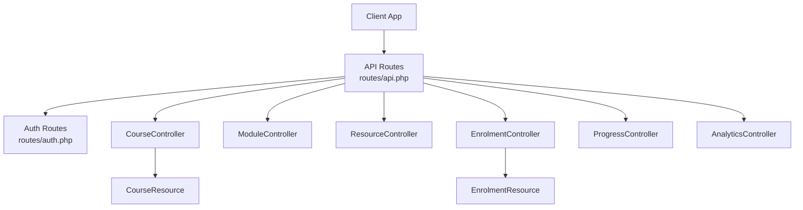
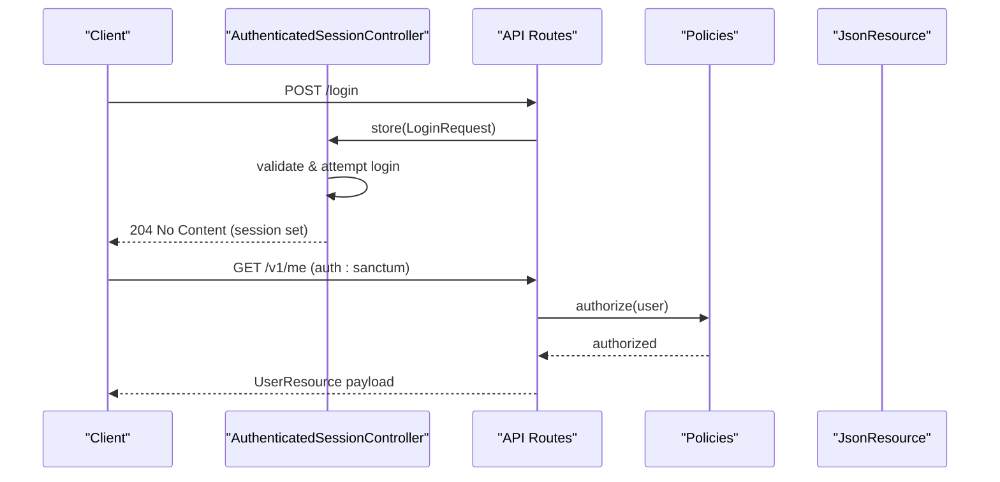
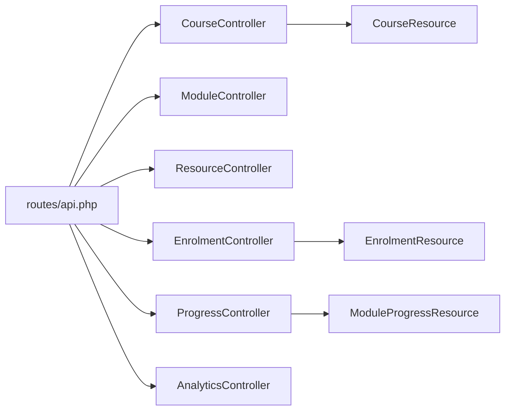

# API Reference

<cite>
**Referenced Files in This Document**
- [routes/api.php](file://routes/api.php)
- [routes/auth.php](file://routes/auth.php)
- [config/sanctum.php](file://config/sanctum.php)
- [config/cors.php](file://config/cors.php)
- [app/Http/Controllers/Auth/AuthenticatedSessionController.php](file://app/Http/Controllers/Auth/AuthenticatedSessionController.php)
- [app/Http/Requests/Auth/LoginRequest.php](file://app/Http/Requests/Auth/LoginRequest.php)
- [app/Http/Controllers/Api/V1/CourseController.php](file://app/Http/Controllers/Api/V1/CourseController.php)
- [app/Http/Controllers/Api/V1/ModuleController.php](file://app/Http/Controllers/Api/V1/ModuleController.php)
- [app/Http/Controllers/Api/V1/ResourceController.php](file://app/Http/Controllers/Api/V1/ResourceController.php)
- [app/Http/Controllers/Api/V1/EnrolmentController.php](file://app/Http/Controllers/Api/V1/EnrolmentController.php)
- [app/Http/Controllers/Api/V1/ProgressController.php](file://app/Http/Controllers/Api/V1/ProgressController.php)
- [app/Http/Controllers/Api/V1/AnalyticsController.php](file://app/Http/Controllers/Api/V1/AnalyticsController.php)
- [app/Http/Resources/CourseResource.php](file://app/Http/Resources/CourseResource.php)
- [app/Http/Resources/EnrolmentResource.php](file://app/Http/Resources/EnrolmentResource.php)
</cite>

## Table of Contents
1. [Introduction](#introduction)
2. [Project Structure](#project-structure)
3. [Core Components](#core-components)
4. [Architecture Overview](#architecture-overview)
5. [Detailed Component Analysis](#detailed-component-analysis)
6. [Dependency Analysis](#dependency-analysis)
7. [Performance Considerations](#performance-considerations)
8. [Troubleshooting Guide](#troubleshooting-guide)
9. [Conclusion](#conclusion)
10. [Appendices](#appendices)

## Introduction
This document provides a comprehensive RESTful API reference for ResNet Academy (Laravel-based backend). It covers authentication, versioning, endpoint groups, request/response schemas, error handling, rate limiting guidance, and client integration tips. The API is versioned under /v1 and uses Laravel Sanctum for session-based authentication with CORS support for first-party SPAs.

## Project Structure
The API is defined in routes/api.php under the v1 prefix. Authentication endpoints are in routes/auth.php. Controllers live under app/Http/Controllers/Api/V1 and handle domain features such as courses, modules, resources, enrolments, progress tracking, assessments, communication, and analytics. Request validation is centralized in app/Http/Requests, and response payloads are normalized via JsonResource classes in app/Http/Resources.

**Diagram sources**
- [routes/api.php:49-241](file://routes/api.php#L49-L241)
- [routes/auth.php:11-37](file://routes/auth.php#L11-L37)
- [app/Http/Controllers/Api/V1/CourseController.php:23-146](file://app/Http/Controllers/Api/V1/CourseController.php#L23-L146)
- [app/Http/Controllers/Api/V1/ModuleController.php:18-120](file://app/Http/Controllers/Api/V1/ModuleController.php#L18-L120)
- [app/Http/Controllers/Api/V1/ResourceController.php:18-85](file://app/Http/Controllers/Api/V1/ResourceController.php#L18-L85)
- [app/Http/Controllers/Api/V1/EnrolmentController.php:20-75](file://app/Http/Controllers/Api/V1/EnrolmentController.php#L20-L75)
- [app/Http/Controllers/Api/V1/ProgressController.php:32-182](file://app/Http/Controllers/Api/V1/ProgressController.php#L32-L182)
- [app/Http/Controllers/Api/V1/AnalyticsController.php:13-38](file://app/Http/Controllers/Api/V1/AnalyticsController.php#L13-L38)
- [app/Http/Resources/CourseResource.php:11-44](file://app/Http/Resources/CourseResource.php#L11-L44)
- [app/Http/Resources/EnrolmentResource.php:10-28](file://app/Http/Resources/EnrolmentResource.php#L10-L28)

**Section sources**
- [routes/api.php:49-241](file://routes/api.php#L49-L241)
- [routes/auth.php:11-37](file://routes/auth.php#L11-L37)

## Core Components
- Versioning: All API endpoints are prefixed with /v1.
- Authentication: Session-based auth via Laravel Sanctum; protected routes use the auth:sanctum middleware.
- Authorization: Policies enforce role-based access on sensitive operations (e.g., course deletion, module management, analytics).
- Validation: Strong input validation using FormRequest classes (e.g., LoginRequest, StoreCourseRequest, UpdateCourseRequest).
- Response formatting: Consistent JSON responses via JsonResource classes (e.g., CourseResource, EnrolmentResource).
- Cross-Origin: CORS configured to allow credentials from configured origins.

Key behaviors:
- Public read endpoints exist for catalogue browsing and certificate verification.
- Protected endpoints require an authenticated user and may be further restricted by policies.
- Some endpoints return no content (204) for successful mutations.

**Section sources**
- [routes/api.php:49-241](file://routes/api.php#L49-L241)
- [config/sanctum.php:21-40](file://config/sanctum.php#L21-L40)
- [config/cors.php:18-36](file://config/cors.php#L18-L36)
- [app/Http/Requests/Auth/LoginRequest.php:30-87](file://app/Http/Requests/Auth/LoginRequest.php#L30-L87)
- [app/Http/Resources/CourseResource.php:16-43](file://app/Http/Resources/CourseResource.php#L16-L43)
- [app/Http/Resources/EnrolmentResource.php:15-27](file://app/Http/Resources/EnrolmentResource.php#L15-L27)

## Architecture Overview
Authentication flow for SPA clients:
- Clients authenticate via POST /login (session-based).
- Subsequent requests include cookies and are accepted by auth:sanctum middleware.
- Protected routes enforce user identity and policy checks.

**Diagram sources**
- [routes/auth.php:11-37](file://routes/auth.php#L11-L37)
- [app/Http/Controllers/Auth/AuthenticatedSessionController.php:13-41](file://app/Http/Controllers/Auth/AuthenticatedSessionController.php#L13-L41)
- [routes/api.php:49-50](file://routes/api.php#L49-L50)

**Section sources**
- [routes/auth.php:11-37](file://routes/auth.php#L11-L37)
- [app/Http/Controllers/Auth/AuthenticatedSessionController.php:13-41](file://app/Http/Controllers/Auth/AuthenticatedSessionController.php#L13-L41)
- [routes/api.php:49-50](file://routes/api.php#L49-L50)

## Detailed Component Analysis

### Authentication
- Endpoints:
  - POST /login — authenticates and starts a session.
  - POST /logout — destroys the session.
  - Password reset and email verification endpoints are also available.
- Authentication method: Session-based via Laravel Sanctum with CSRF protection for stateful requests.
- Rate limiting: Login attempts are rate-limited per email+IP.

Request schema (POST /login):
- email: string, required, valid email format
- password: string, required
- remember: boolean, optional

Response:
- 204 No Content on success
- 422 Unprocessable Entity on validation or authentication failure
- 429 Too Many Requests when rate limited

Error handling:
- Validation errors return field-specific messages.
- Throttling returns a message indicating retry window.

**Section sources**
- [routes/auth.php:11-37](file://routes/auth.php#L11-L37)
- [app/Http/Controllers/Auth/AuthenticatedSessionController.php:13-41](file://app/Http/Controllers/Auth/AuthenticatedSessionController.php#L13-L41)
- [app/Http/Requests/Auth/LoginRequest.php:30-87](file://app/Http/Requests/Auth/LoginRequest.php#L30-L87)

### Courses
- Endpoints:
  - GET /v1/categories
  - GET /v1/courses
  - GET /v1/courses/{course}
  - POST /v1/courses (protected)
  - PATCH /v1/courses/{course} (protected)
  - DELETE /v1/courses/{course} (protected)
- Filters for listing: category_id, level, instructor_id, schedule_from, schedule_to, status (for non-student roles).
- Thumbnail upload supported via form data.

Request schemas:
- Create course: includes title, slug, description, level, enrolment_policy, advisory flags, application settings, sections_required, thumbnail file, prerequisites_text, price, currency, schedule_start_date, category_id, instructor_ids.
- Update course: same fields as create, plus change_summary for versioning.

Response schema (CourseResource):
- id, title, slug, description, level, enrolment_policy, advisory_require_attestation, application_questions, application_allow_alternative_proof, application_require_portfolio_url, sections_required, thumbnail_url, prerequisites_text, price, currency, status, current_version, confirmation_delay_hours, schedule_start_date, category, instructors, created_at, updated_at.

Behavior:
- Students see only published courses unless they have other roles.
- Updates can trigger notifications when change_summary is provided.

**Section sources**
- [routes/api.php:53-75](file://routes/api.php#L53-L75)
- [app/Http/Controllers/Api/V1/CourseController.php:30-146](file://app/Http/Controllers/Api/V1/CourseController.php#L30-L146)
- [app/Http/Resources/CourseResource.php:16-43](file://app/Http/Resources/CourseResource.php#L16-L43)

### Modules
- Endpoints:
  - GET /v1/courses/{course}/modules
  - POST /v1/courses/{course}/modules (protected)
  - PATCH /v1/modules/{module} (protected)
  - DELETE /v1/modules/{module} (protected)
  - GET /v1/courses/{course}/modules/trashed (protected)
  - POST /v1/modules/{module}/restore (protected)

Request schemas:
- Create module: includes group_ids and ordering; order_index defaults if not provided.
- Update module: supports updating group associations.

Response schema:
- ModuleResource includes related groups and resources.

Behavior:
- Soft delete with restore capability; deletions are audited.

**Section sources**
- [routes/api.php:126-130](file://routes/api.php#L126-L130)
- [app/Http/Controllers/Api/V1/ModuleController.php:22-119](file://app/Http/Controllers/Api/V1/ModuleController.php#L22-L119)

### Resources
- Endpoints:
  - GET /v1/resources/{resource}
  - POST /v1/modules/{module}/resources (protected)
  - PATCH /v1/resources/{resource} (protected)
  - DELETE /v1/resources/{resource} (protected)

Request schemas:
- Create/update resource: supports file uploads for documents/downloadable files and SCORM packages.

Response schema:
- ResourceItemResource includes all resource type details (video, document, reading, external link, scorm package, live session, downloadable file).

Behavior:
- Media storage handled via service; old files are replaced on update.

**Section sources**
- [routes/api.php:139-142](file://routes/api.php#L139-L142)
- [app/Http/Controllers/Api/V1/ResourceController.php:25-85](file://app/Http/Controllers/Api/V1/ResourceController.php#L25-L85)

### Enrolments
- Endpoints:
  - GET /v1/enrolments (protected)
  - POST /v1/enrolments (protected)
  - POST /v1/enrolments/import (protected)
  - POST /v1/enrolments/{enrolment}/withdraw (protected)

Request schemas:
- Self-enrolment: course_id and optional section_id.
- Import enrolments: CSV upload via import controller.

Response schema (EnrolmentResource):
- id, status, source, course, applied_at, confirmation_email_due_at, confirmation_email_sent_at, order.

Behavior:
- Application-policy courses must go through course applications instead of direct self-enrolment.
- Withdrawal requires authorization.

**Section sources**
- [routes/api.php:94-97](file://routes/api.php#L94-L97)
- [app/Http/Controllers/Api/V1/EnrolmentController.php:24-75](file://app/Http/Controllers/Api/V1/EnrolmentController.php#L24-L75)
- [app/Http/Resources/EnrolmentResource.php:15-27](file://app/Http/Resources/EnrolmentResource.php#L15-L27)

### Assessments
- Assignments:
  - POST /v1/modules/{module}/assignments (protected)
  - GET /v1/assignments/{assignment}
  - PATCH /v1/assignments/{assignment} (protected)
  - DELETE /v1/assignments/{assignment} (protected)
  - GET /v1/assignments/{assignment}/submissions
  - POST /v1/assignments/{assignment}/submissions
  - POST /v1/submissions/{submission}/grade (protected)
- Evaluations:
  - POST /v1/modules/{module}/evaluations (protected)
  - GET /v1/evaluations/{evaluation}
  - PATCH /v1/evaluations/{evaluation} (protected)
  - DELETE /v1/evaluations/{evaluation} (protected)
  - GET /v1/evaluations/{evaluation}/attempts
  - POST /v1/evaluations/{evaluation}/attempts
  - GET /v1/attempts/{attempt}
  - POST /v1/attempts/{attempt}/submit
  - POST /v1/attempts/{attempt}/grade (protected)
- Gradebook:
  - GET /v1/courses/{course}/gradebook (protected)

Notes:
- Assignment submissions and evaluation attempts expose answer-key-free shapes for students.
- Grading endpoints are protected and typically instructor/admin only.

**Section sources**
- [routes/api.php:159-191](file://routes/api.php#L159-L191)

### Progress Tracking
- Endpoints:
  - GET /v1/me/progress (protected)
  - GET /v1/courses/{course}/progress (protected)
  - POST /v1/resources/{resource}/progress/watch (protected)
  - POST /v1/resources/{resource}/progress/mark-read (protected)
  - POST /v1/resources/{resource}/progress/mark-opened (protected)
  - POST /v1/resources/{resource}/progress/attendance (protected)
  - GET /v1/resources/{resource}/attendance (protected)

Behavior:
- Progress writes delegate to ProgressEngine for consistent unlock/completion logic.
- Attendance roster is available for live session resources and restricted to authorized roles.

**Section sources**
- [routes/api.php:146-153](file://routes/api.php#L146-L153)
- [app/Http/Controllers/Api/V1/ProgressController.php:39-182](file://app/Http/Controllers/Api/V1/ProgressController.php#L39-L182)

### Communication
- Conversations and Messages:
  - GET /v1/conversations
  - GET /v1/conversations/contactable
  - POST /v1/conversations
  - GET /v1/conversations/{conversation}
  - POST /v1/conversations/{conversation}/messages
- Tickets:
  - GET /v1/tickets
  - POST /v1/tickets
  - GET /v1/tickets/{ticket}
  - PATCH /v1/tickets/{ticket}
  - POST /v1/tickets/{ticket}/messages
- Forums:
  - GET /v1/forums
  - GET /v1/courses/{course}/forum/threads
  - POST /v1/courses/{course}/forum/threads
  - GET /v1/forum-threads/{thread}
  - PATCH /v1/forum-threads/{thread}
  - GET /v1/forum-threads/{thread}/posts
  - POST /v1/forum-threads/{thread}/posts
  - PATCH /v1/forum-posts/{post}
  - DELETE /v1/forum-posts/{post}
  - POST /v1/forum-posts/{post}/reports
  - GET /v1/courses/{course}/forum/reports
  - PATCH /v1/forum-post-reports/{report}
  - GET /v1/forum-tags
- Announcements:
  - GET /v1/courses/{course}/announcements
  - POST /v1/courses/{course}/announcements
  - DELETE /v1/announcements/{announcement}
- Notifications:
  - GET /v1/notifications
  - POST /v1/notifications/{notification}/read
  - POST /v1/notifications/read-all

Notes:
- Messaging supports multiple relationship types (admin/instructor/student).
- Forum threads/posts support tagging, reporting, and moderation actions.

**Section sources**
- [routes/api.php:198-239](file://routes/api.php#L198-L239)

### Analytics
- Endpoints:
  - GET /v1/courses/{course}/analytics (protected)
  - POST /v1/courses/{course}/at-risk-notice (protected)

Behavior:
- Requires viewAnalytics authorization (admin or teaching instructor).
- At-risk notice optionally accepts a message payload.

**Section sources**
- [routes/api.php:193-196](file://routes/api.php#L193-L196)
- [app/Http/Controllers/Api/V1/AnalyticsController.php:17-38](file://app/Http/Controllers/Api/V1/AnalyticsController.php#L17-L38)

## Dependency Analysis
The API routes map directly to controllers, which rely on services and policies for business logic and authorization. Responses are standardized via JsonResource classes.

**Diagram sources**
- [routes/api.php:49-241](file://routes/api.php#L49-L241)
- [app/Http/Controllers/Api/V1/CourseController.php:23-146](file://app/Http/Controllers/Api/V1/CourseController.php#L23-L146)
- [app/Http/Controllers/Api/V1/ModuleController.php:18-120](file://app/Http/Controllers/Api/V1/ModuleController.php#L18-L120)
- [app/Http/Controllers/Api/V1/ResourceController.php:18-85](file://app/Http/Controllers/Api/V1/ResourceController.php#L18-L85)
- [app/Http/Controllers/Api/V1/EnrolmentController.php:20-75](file://app/Http/Controllers/Api/V1/EnrolmentController.php#L20-L75)
- [app/Http/Controllers/Api/V1/ProgressController.php:32-182](file://app/Http/Controllers/Api/V1/ProgressController.php#L32-L182)
- [app/Http/Controllers/Api/V1/AnalyticsController.php:13-38](file://app/Http/Controllers/Api/V1/AnalyticsController.php#L13-L38)
- [app/Http/Resources/CourseResource.php:16-43](file://app/Http/Resources/CourseResource.php#L16-L43)
- [app/Http/Resources/EnrolmentResource.php:15-27](file://app/Http/Resources/EnrolmentResource.php#L15-L27)

**Section sources**
- [routes/api.php:49-241](file://routes/api.php#L49-L241)

## Performance Considerations
- Pagination: Catalogue and list endpoints paginate results (e.g., courses, enrolments). Use pagination parameters to limit payload size.
- Selective loading: Resources load relations conditionally; avoid requesting unnecessary nested data.
- File uploads: Large media should be chunked or uploaded via appropriate storage services; ensure proper timeouts.
- Queues: Background jobs exist for tasks like certificate generation and enrolment imports; ensure queue workers are running.
- Database backends: Cache/session/queue currently share database; consider Redis for production to reduce contention.

[No sources needed since this section provides general guidance]

## Troubleshooting Guide
Common issues and resolutions:
- Authentication failures:
  - Ensure CORS allows credentials and configured origins.
  - Verify session cookie settings and stateful domains for Sanctum.
- Validation errors:
  - Check request payloads against documented schemas; server returns 422 with field-specific messages.
- Rate limiting:
  - Login attempts are throttled; respect retry windows indicated in error responses.
- Authorization errors:
  - Some endpoints require specific roles; verify user permissions and policies.

**Section sources**
- [config/cors.php:18-36](file://config/cors.php#L18-L36)
- [config/sanctum.php:21-40](file://config/sanctum.php#L21-L40)
- [app/Http/Requests/Auth/LoginRequest.php:63-87](file://app/Http/Requests/Auth/LoginRequest.php#L63-L87)

## Conclusion
ResNet Academy’s API provides a robust, versioned, and secure interface for managing courses, modules, resources, enrolments, assessments, progress, communication, and analytics. Authentication is handled via Laravel Sanctum with session-based flows, and responses are consistently formatted using JsonResource classes. Follow the documented schemas and error handling patterns to integrate clients effectively.

[No sources needed since this section summarizes without analyzing specific files]

## Appendices

### Protocol-Specific Examples
- Authentication:
  - POST /login with email/password; expect 204 on success.
  - Subsequent requests include cookies; protected endpoints will accept them via auth:sanctum.
- Error responses:
  - 422 Unprocessable Entity for validation failures.
  - 401 Unauthorized for missing or invalid sessions.
  - 403 Forbidden for insufficient permissions.
  - 404 Not Found for missing resources.
  - 429 Too Many Requests when rate limited.

[No sources needed since this section provides general guidance]

### Client Implementation Guidelines
- Always send credentials with cross-origin requests when using Sanctum stateful mode.
- Handle pagination for list endpoints and cache stable identifiers.
- Respect rate limits and implement retries with exponential backoff.
- Validate inputs on the client side to reduce 422 errors.

[No sources needed since this section provides general guidance]

### Versioning Information
- Base path: /v1
- Future changes should maintain backward compatibility where possible; introduce new versions via new prefixes if breaking changes are necessary.

[No sources needed since this section provides general guidance]