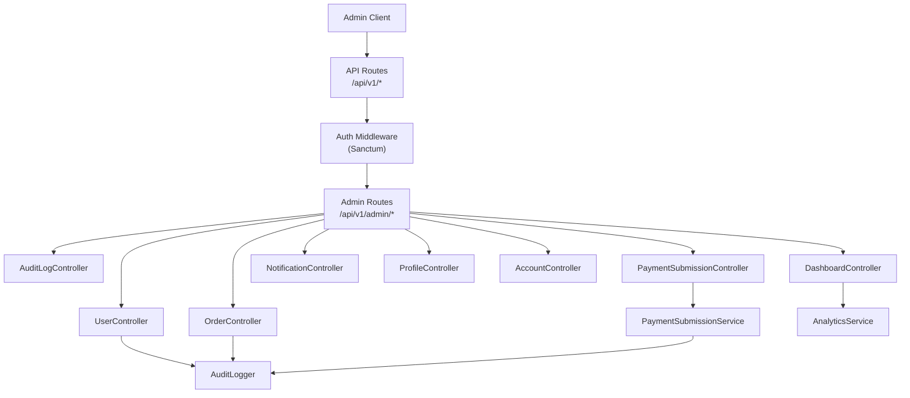
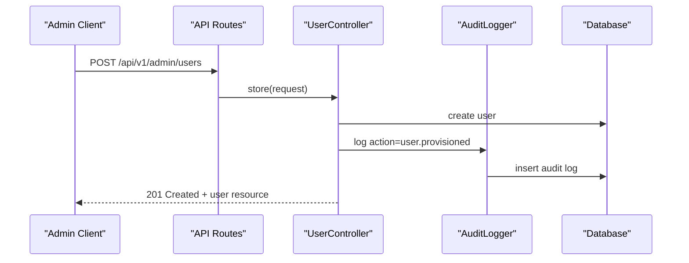
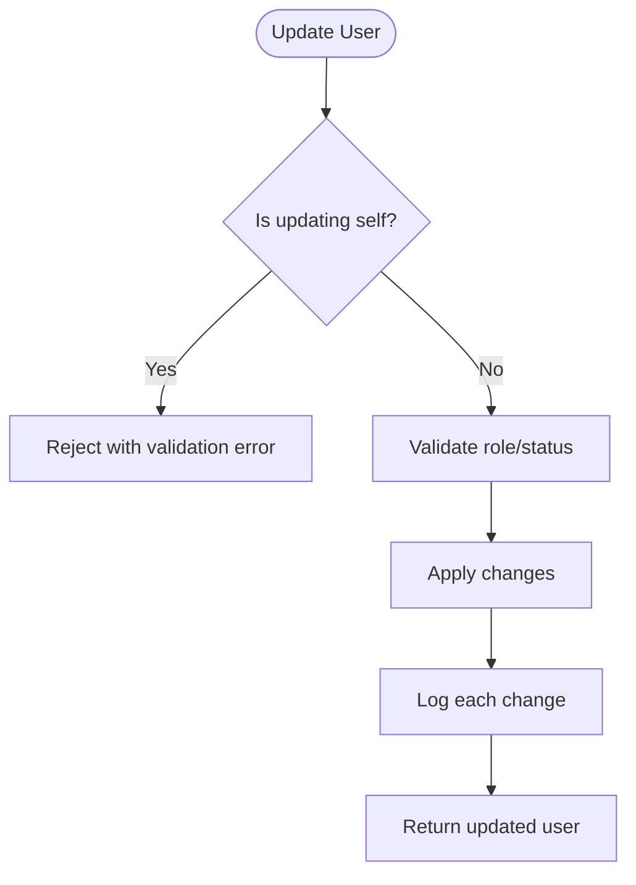
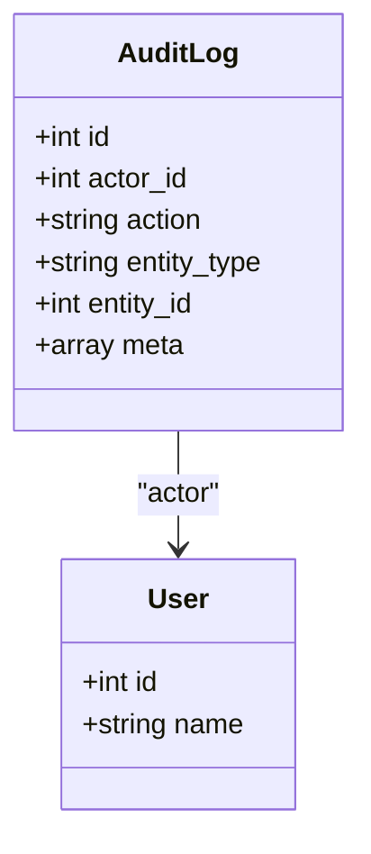
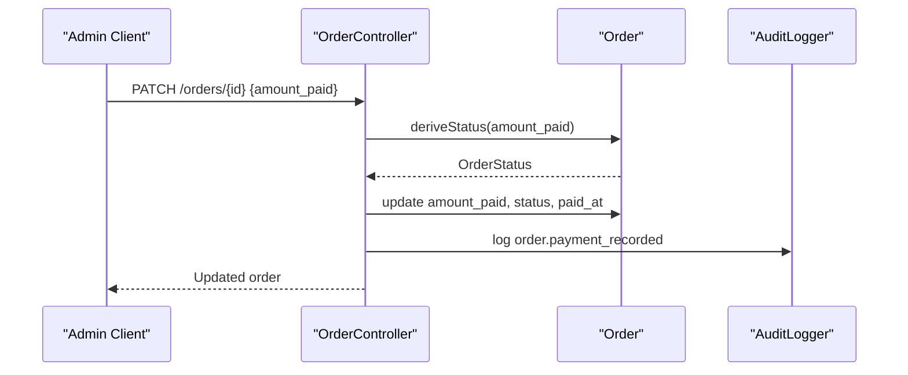
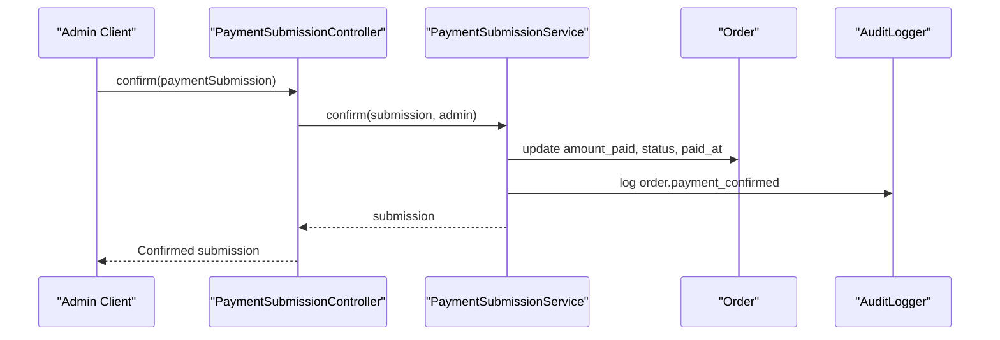
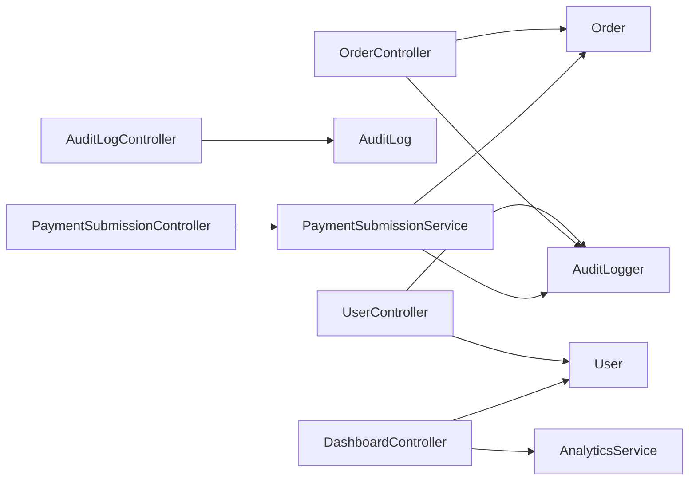
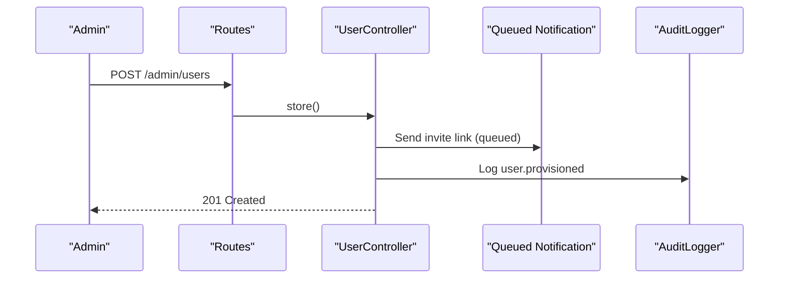
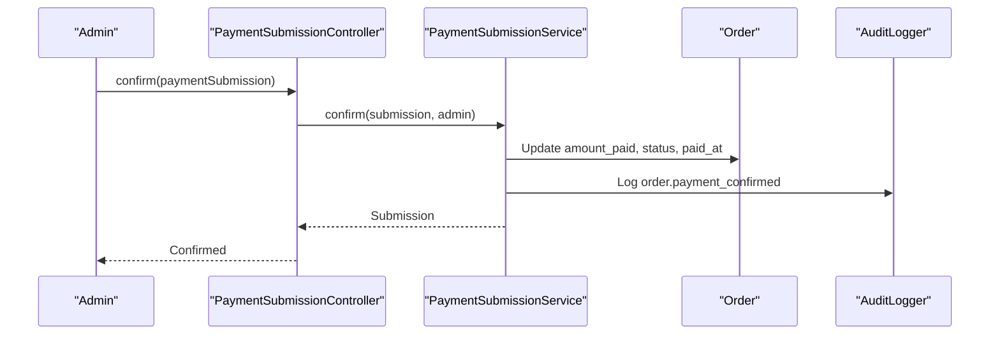

# Admin & System APIs

<cite>
**Referenced Files in This Document**
- [api.php](file://routes/api.php)
- [UserController.php](file://app/Http/Controllers/Api/V1/Admin/UserController.php)
- [AuditLogController.php](file://app/Http/Controllers/Api/V1/Admin/AuditLogController.php)
- [DashboardController.php](file://app/Http/Controllers/Api/V1/Admin/DashboardController.php)
- [OrderController.php](file://app/Http/Controllers/Api/V1/Admin/OrderController.php)
- [PaymentSubmissionController.php](file://app/Http/Controllers/Api/V1/Admin/PaymentSubmissionController.php)
- [NotificationController.php](file://app/Http/Controllers/Api/V1/NotificationController.php)
- [ProfileController.php](file://app/Http/Controllers/Api/V1/ProfileController.php)
- [AccountController.php](file://app/Http/Controllers/Api/V1/AccountController.php)
- [AuditLogger.php](file://app/Services/Audit/AuditLogger.php)
- [PaymentSubmissionService.php](file://app/Services/Payments/PaymentSubmissionService.php)
- [User.php](file://app/Models/User.php)
- [Order.php](file://app/Models/Order.php)
- [AuditLog.php](file://app/Models/AuditLog.php)
</cite>

## Table of Contents
1. [Introduction](#introduction)
2. [Project Structure](#project-structure)
3. [Core Components](#core-components)
4. [Architecture Overview](#architecture-overview)
5. [Detailed Component Analysis](#detailed-component-analysis)
6. [Dependency Analysis](#dependency-analysis)
7. [Performance Considerations](#performance-considerations)
8. [Troubleshooting Guide](#troubleshooting-guide)
9. [Conclusion](#conclusion)
10. [Appendices](#appendices)

## Introduction
This document provides API documentation for administrative and system management endpoints. It covers user management, audit logging, system notifications, account administration, order management, payment processing, profile management, data export, and system monitoring. It also includes examples of administrative workflows and system maintenance tasks. All admin endpoints are protected by authentication and authorization policies scoped to privileged roles.

## Project Structure
Administrative endpoints are grouped under the authenticated routes and prefixed with /admin. The routing layer wires controllers to HTTP methods, while services encapsulate business logic (audit logging, payments). Models represent core entities such as users, orders, and audit logs.

**Diagram sources**
- [api.php:115-123](file://routes/api.php#L115-L123)
- [UserController.php:25-107](file://app/Http/Controllers/Api/V1/Admin/UserController.php#L25-L107)
- [AuditLogController.php:18-33](file://app/Http/Controllers/Api/V1/Admin/AuditLogController.php#L18-L33)
- [DashboardController.php:17-29](file://app/Http/Controllers/Api/V1/Admin/DashboardController.php#L17-L29)
- [OrderController.php:23-89](file://app/Http/Controllers/Api/V1/Admin/OrderController.php#L23-L89)
- [PaymentSubmissionController.php:18-39](file://app/Http/Controllers/Api/V1/Admin/PaymentSubmissionController.php#L18-L39)
- [NotificationController.php:19-53](file://app/Http/Controllers/Api/V1/NotificationController.php#L19-L53)
- [ProfileController.php:21-72](file://app/Http/Controllers/Api/V1/ProfileController.php#L21-L72)
- [AccountController.php:39-208](file://app/Http/Controllers/Api/V1/AccountController.php#L39-L208)
- [AuditLogger.php:13-28](file://app/Services/Audit/AuditLogger.php#L13-L28)
- [PaymentSubmissionService.php:20-108](file://app/Services/Payments/PaymentSubmissionService.php#L20-L108)

**Section sources**
- [api.php:49-241](file://routes/api.php#L49-L241)

## Core Components
- User Management: List, provision, and update users; role/status changes are audited.
- Audit Logging: Read-only listing of audit events with filters and pagination.
- Dashboard: Aggregated system summary including recent audit logs.
- Order Management: List orders with status filtering; record payments and derive order status.
- Payment Processing: Confirm or reject student payment submissions; updates orders accordingly.
- Notifications: Read inbox and mark notifications as read.
- Profile Management: View completion status and update profile fields.
- Account Administration: Change password, upload avatar, export personal data, deactivate account.

**Section sources**
- [UserController.php:25-107](file://app/Http/Controllers/Api/V1/Admin/UserController.php#L25-L107)
- [AuditLogController.php:18-33](file://app/Http/Controllers/Api/V1/Admin/AuditLogController.php#L18-L33)
- [DashboardController.php:17-29](file://app/Http/Controllers/Api/V1/Admin/DashboardController.php#L17-L29)
- [OrderController.php:23-89](file://app/Http/Controllers/Api/V1/Admin/OrderController.php#L23-L89)
- [PaymentSubmissionController.php:18-39](file://app/Http/Controllers/Api/V1/Admin/PaymentSubmissionController.php#L18-L39)
- [NotificationController.php:19-53](file://app/Http/Controllers/Api/V1/NotificationController.php#L19-L53)
- [ProfileController.php:21-72](file://app/Http/Controllers/Api/V1/ProfileController.php#L21-L72)
- [AccountController.php:39-208](file://app/Http/Controllers/Api/V1/AccountController.php#L39-L208)

## Architecture Overview
The admin API follows a layered design:
- Routing: Centralized route definitions under /api/v1 with auth middleware.
- Controllers: Thin request handling, policy checks, and delegation to services.
- Services: Business rules for payments and audit logging.
- Models: Data access and relationships for users, orders, and audit logs.

**Diagram sources**
- [api.php:115-117](file://routes/api.php#L115-L117)
- [UserController.php:45-72](file://app/Http/Controllers/Api/V1/Admin/UserController.php#L45-L72)
- [AuditLogger.php:18-28](file://app/Services/Audit/AuditLogger.php#L18-L28)

## Detailed Component Analysis

### User Management
- GET /api/v1/admin/users
  - Purpose: List users with optional role filter; paginated.
  - Authorization: Requires privilege to view any user.
  - Query params: role (optional).
  - Response: Paginated user collection.
- POST /api/v1/admin/users
  - Purpose: Provision a new user without setting a password; invite email sent via queued notification.
  - Request body: role, name, email.
  - Side effects: Creates user, generates reset token, sends invitation, logs audit event.
  - Response: 201 Created with user resource.
- PATCH /api/v1/admin/users/{user}
  - Purpose: Update user role or status; prevents self-modification.
  - Request body: role, status (validated).
  - Side effects: Audits each changed field.
  - Response: Updated user resource.

**Diagram sources**
- [UserController.php:74-106](file://app/Http/Controllers/Api/V1/Admin/UserController.php#L74-L106)

**Section sources**
- [api.php:115-118](file://routes/api.php#L115-L118)
- [UserController.php:25-107](file://app/Http/Controllers/Api/V1/Admin/UserController.php#L25-L107)

### Audit Logging
- GET /api/v1/admin/audit-logs
  - Purpose: Read-only audit trail with filters and pagination.
  - Query params: entity_type, entity_id, action (all optional).
  - Response: Paginated audit log collection including actor details.

**Diagram sources**
- [AuditLog.php:12-38](file://app/Models/AuditLog.php#L12-L38)
- [User.php:19-99](file://app/Models/User.php#L19-L99)

**Section sources**
- [api.php:118](file://routes/api.php#L118)
- [AuditLogController.php:18-33](file://app/Http/Controllers/Api/V1/Admin/AuditLogController.php#L18-L33)
- [AuditLog.php:12-38](file://app/Models/AuditLog.php#L12-L38)

### System Monitoring (Dashboard)
- GET /api/v1/admin/dashboard-summary
  - Purpose: System-wide summary including recent audit logs.
  - Authorization: Requires privilege to view any user.
  - Response: JSON object containing aggregated metrics and recent audit logs.

**Section sources**
- [api.php:119](file://routes/api.php#L119)
- [DashboardController.php:17-29](file://app/Http/Controllers/Api/V1/Admin/DashboardController.php#L17-L29)

### Order Management
- GET /api/v1/admin/orders
  - Purpose: List all orders with status filtering that accounts for pending payment submissions.
  - Query params: status (pending, partial, paid).
  - Response: Paginated order collection with related student, course, and payment submissions.
- PATCH /api/v1/admin/orders/{order}
  - Purpose: Record manual payment against an order; amount_paid is clamped to order amount; status derived from amounts.
  - Request body: amount_paid, optional payment_method.
  - Side effects: Updates order, sets paid_at when fully paid, audits payment recording.
  - Response: Updated order resource.

**Diagram sources**
- [OrderController.php:56-89](file://app/Http/Controllers/Api/V1/Admin/OrderController.php#L56-L89)
- [Order.php:87-99](file://app/Models/Order.php#L87-L99)
- [AuditLogger.php:18-28](file://app/Services/Audit/AuditLogger.php#L18-L28)

**Section sources**
- [api.php:120-121](file://routes/api.php#L120-L121)
- [OrderController.php:23-89](file://app/Http/Controllers/Api/V1/Admin/OrderController.php#L23-L89)
- [Order.php:16-100](file://app/Models/Order.php#L16-L100)

### Payment Processing
- PATCH /api/v1/admin/payment-submissions/{paymentSubmission}/confirm
  - Purpose: Confirm a student’s submitted payment; applies amount to order and marks submission confirmed.
  - Authorization: Requires privilege to update users (policy-gated).
  - Response: Updated payment submission resource.
- PATCH /api/v1/admin/payment-submissions/{paymentSubmission}/reject
  - Purpose: Reject a pending payment submission; leaves order unchanged.
  - Authorization: Requires privilege to update users (policy-gated).
  - Response: Updated payment submission resource.

**Diagram sources**
- [PaymentSubmissionController.php:22-39](file://app/Http/Controllers/Api/V1/Admin/PaymentSubmissionController.php#L22-L39)
- [PaymentSubmissionService.php:56-86](file://app/Services/Payments/PaymentSubmissionService.php#L56-L86)
- [AuditLogger.php:18-28](file://app/Services/Audit/AuditLogger.php#L18-L28)

**Section sources**
- [api.php:122-123](file://routes/api.php#L122-L123)
- [PaymentSubmissionController.php:18-39](file://app/Http/Controllers/Api/V1/Admin/PaymentSubmissionController.php#L18-L39)
- [PaymentSubmissionService.php:20-108](file://app/Services/Payments/PaymentSubmissionService.php#L20-L108)

### Notifications
- GET /api/v1/notifications
  - Purpose: Retrieve the authenticated user’s notification inbox with unread count metadata.
  - Response: Paginated notifications with meta including current_page, last_page, unread_count.
- POST /api/v1/notifications/{notification}/read
  - Purpose: Mark a specific notification as read (ownership enforced).
  - Response: No Content on success.
- POST /api/v1/notifications/read-all
  - Purpose: Mark all of the authenticated user’s notifications as read.
  - Response: No Content on success.

**Section sources**
- [api.php:236-240](file://routes/api.php#L236-L240)
- [NotificationController.php:19-53](file://app/Http/Controllers/Api/V1/NotificationController.php#L19-L53)

### Profile Management
- GET /api/v1/profile/status
  - Purpose: Get profile completion percentage, missing required fields, and completed fields for the authenticated user.
  - Response: JSON with percentage, missing, and completed arrays.
- PUT /api/v1/profile
  - Purpose: Update profile fields; recomputes display name from first/last names.
  - Request body: Validated profile fields.
  - Response: Updated user resource.

**Section sources**
- [api.php:91-92](file://routes/api.php#L91-L92)
- [ProfileController.php:21-72](file://app/Http/Controllers/Api/V1/ProfileController.php#L21-L72)

### Account Administration
- GET /api/v1/me/data-export
  - Purpose: Export all personal data owned by the authenticated user into a downloadable JSON file.
  - Response: JSON attachment with profile, enrolments, certificates, submissions, attempts, messages, forum posts, tickets, notifications, engagement events.
- POST /api/v1/me/avatar
  - Purpose: Upload/update avatar image; storage path depends on caller’s role.
  - Request: Multipart file avatar.
  - Response: Updated user resource.
- PATCH /api/v1/me/profile
  - Purpose: Update profile fields; recomputes display name.
  - Request body: Validated profile fields.
  - Response: Updated user resource.
- POST /api/v1/me/change-password
  - Purpose: Change password after verifying current password; audited.
  - Request body: current_password, password.
  - Response: No Content on success.
- POST /api/v1/me/logout-other-sessions
  - Purpose: Terminate other active sessions for the user; audited.
  - Response: No Content on success.
- POST /api/v1/me/request-deactivation
  - Purpose: Soft deactivation of the user account; logs out and invalidates session; audited.
  - Response: No Content on success.

**Section sources**
- [api.php:84-88](file://routes/api.php#L84-L88)
- [AccountController.php:39-208](file://app/Http/Controllers/Api/V1/AccountController.php#L39-L208)

## Dependency Analysis
- Controllers depend on models for data access and on services for cross-cutting concerns (audit logging, payments).
- Authorization is enforced via policies before controller actions execute.
- Audit logging is centralized through a single service to ensure consistent tracking of sensitive mutations.

**Diagram sources**
- [UserController.php:25-107](file://app/Http/Controllers/Api/V1/Admin/UserController.php#L25-L107)
- [AuditLogController.php:18-33](file://app/Http/Controllers/Api/V1/Admin/AuditLogController.php#L18-L33)
- [DashboardController.php:17-29](file://app/Http/Controllers/Api/V1/Admin/DashboardController.php#L17-L29)
- [OrderController.php:23-89](file://app/Http/Controllers/Api/V1/Admin/OrderController.php#L23-L89)
- [PaymentSubmissionController.php:18-39](file://app/Http/Controllers/Api/V1/Admin/PaymentSubmissionController.php#L18-L39)
- [AuditLogger.php:13-28](file://app/Services/Audit/AuditLogger.php#L13-L28)
- [PaymentSubmissionService.php:20-108](file://app/Services/Payments/PaymentSubmissionService.php#L20-L108)
- [User.php:19-99](file://app/Models/User.php#L19-L99)
- [Order.php:16-100](file://app/Models/Order.php#L16-L100)
- [AuditLog.php:12-38](file://app/Models/AuditLog.php#L12-L38)

**Section sources**
- [api.php:115-123](file://routes/api.php#L115-L123)

## Performance Considerations
- Pagination: Most list endpoints paginate results to limit payload size and database load.
- Eager loading: Related entities (e.g., student, course, paymentSubmissions) are loaded where needed to avoid N+1 queries.
- Filtering: Query parameters allow server-side filtering to reduce client-side processing.
- Audit logging: Centralized logging minimizes duplication and ensures consistency.

[No sources needed since this section provides general guidance]

## Troubleshooting Guide
- Authentication failures: Ensure a valid Sanctum token is included; admin endpoints require appropriate privileges.
- Authorization errors: Some actions require policy checks; verify the caller has sufficient permissions.
- Validation errors: Requests return structured validation errors when inputs are invalid (e.g., self-update prevention, payment constraints).
- Payment constraints:
  - Cannot submit multiple pending payments for the same order.
  - Cannot pay more than the remaining balance.
  - Status is derived from amounts; do not set status directly.
- Audit visibility: Use audit log filters to trace who performed actions and when.

**Section sources**
- [PaymentSubmissionService.php:27-54](file://app/Services/Payments/PaymentSubmissionService.php#L27-L54)
- [OrderController.php:63-89](file://app/Http/Controllers/Api/V1/Admin/OrderController.php#L63-L89)
- [UserController.php:74-106](file://app/Http/Controllers/Api/V1/Admin/UserController.php#L74-L106)

## Conclusion
The admin and system APIs provide comprehensive capabilities for managing users, auditing actions, monitoring system health, handling orders and payments, and administering accounts. Endpoints are secured, audited, and designed for scalability with pagination and efficient querying. Administrative workflows are supported by clear sequences and robust validation.

[No sources needed since this section summarizes without analyzing specific files]

## Appendices

### Administrative Workflows

#### User Provisioning Workflow

**Diagram sources**
- [api.php:115-117](file://routes/api.php#L115-L117)
- [UserController.php:45-72](file://app/Http/Controllers/Api/V1/Admin/UserController.php#L45-L72)

#### Payment Confirmation Workflow

**Diagram sources**
- [PaymentSubmissionController.php:22-39](file://app/Http/Controllers/Api/V1/Admin/PaymentSubmissionController.php#L22-L39)
- [PaymentSubmissionService.php:56-86](file://app/Services/Payments/PaymentSubmissionService.php#L56-L86)
- [AuditLogger.php:18-28](file://app/Services/Audit/AuditLogger.php#L18-L28)

### Endpoint Reference Summary
- User Management
  - GET /api/v1/admin/users
  - POST /api/v1/admin/users
  - PATCH /api/v1/admin/users/{user}
- Audit Logging
  - GET /api/v1/admin/audit-logs
- Dashboard
  - GET /api/v1/admin/dashboard-summary
- Orders
  - GET /api/v1/admin/orders
  - PATCH /api/v1/admin/orders/{order}
- Payments
  - PATCH /api/v1/admin/payment-submissions/{paymentSubmission}/confirm
  - PATCH /api/v1/admin/payment-submissions/{paymentSubmission}/reject
- Notifications
  - GET /api/v1/notifications
  - POST /api/v1/notifications/{notification}/read
  - POST /api/v1/notifications/read-all
- Profile
  - GET /api/v1/profile/status
  - PUT /api/v1/profile
- Account
  - GET /api/v1/me/data-export
  - POST /api/v1/me/avatar
  - PATCH /api/v1/me/profile
  - POST /api/v1/me/change-password
  - POST /api/v1/me/logout-other-sessions
  - POST /api/v1/me/request-deactivation

**Section sources**
- [api.php:84-123](file://routes/api.php#L84-L123)
- [api.php:236-240](file://routes/api.php#L236-L240)