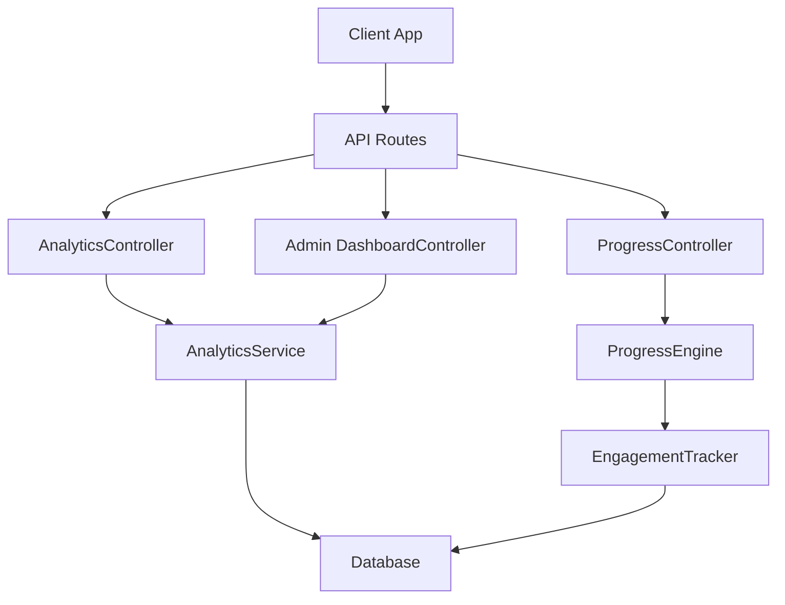
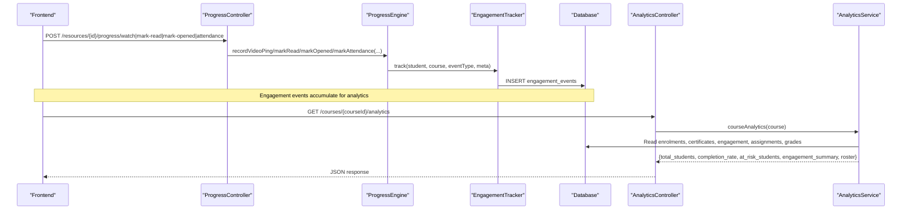
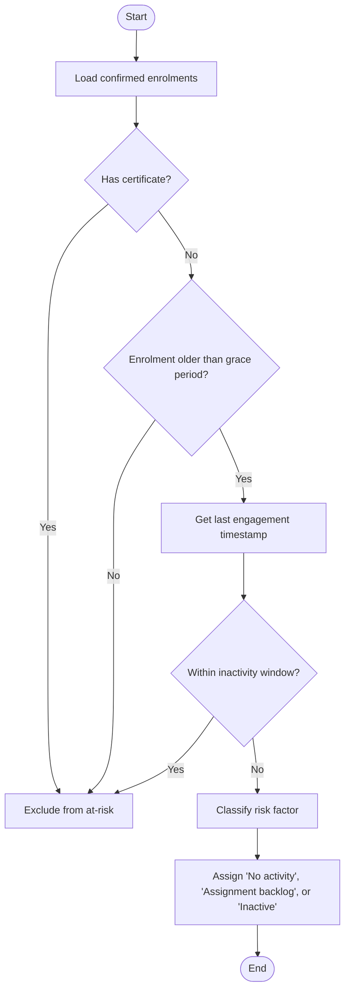
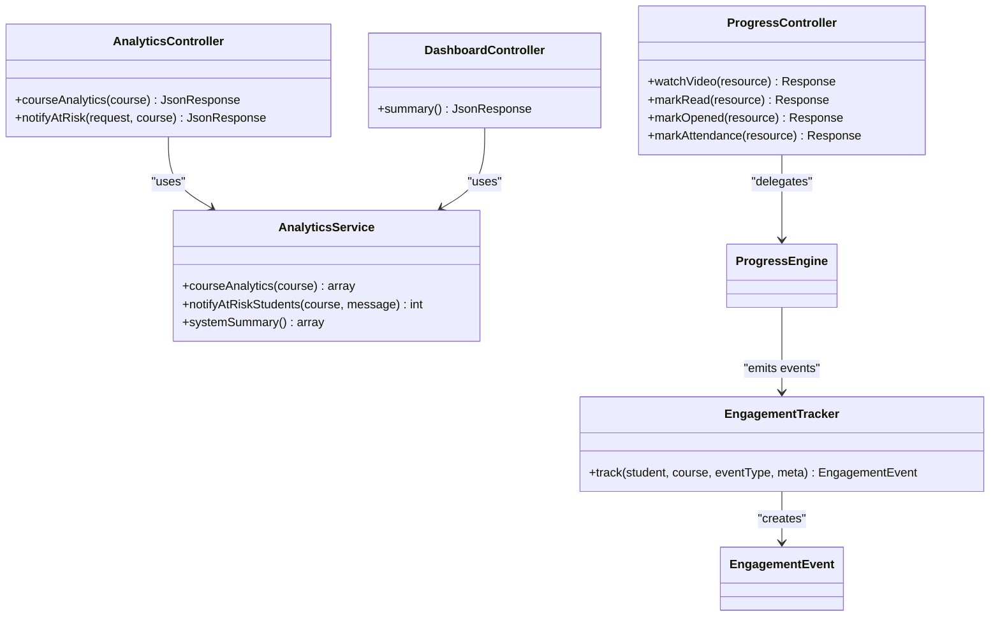

# Analytics & Reporting APIs

<cite>
**Referenced Files in This Document**
- [AnalyticsController.php](file://app/Http/Controllers/Api/V1/AnalyticsController.php)
- [AnalyticsService.php](file://app/Services/Analytics/AnalyticsService.php)
- [EngagementTracker.php](file://app/Services/Analytics/EngagementTracker.php)
- [DashboardController.php](file://app/Http/Controllers/Api/V1/Admin/DashboardController.php)
- [ProgressController.php](file://app/Http/Controllers/Api/V1/ProgressController.php)
- [api.php](file://routes/api.php)
- [EngagementEvent.php](file://app/Models/EngagementEvent.php)
- [2024_01_01_000190_create_engagement_events_table.php](file://database/migrations/2024_01_01_000190_create_engagement_events_table.php)
- [CourseAnalyticsTest.php](file://tests/Feature/Analytics/CourseAnalyticsTest.php)
- [EngagementTrackingTest.php](file://tests/Feature/Analytics/EngagementTrackingTest.php)
- [AdminDashboardSummaryTest.php](file://tests/Feature/Analytics/AdminDashboardSummaryTest.php)
</cite>

## Table of Contents
1. [Introduction](#introduction)
2. [Project Structure](#project-structure)
3. [Core Components](#core-components)
4. [Architecture Overview](#architecture-overview)
5. [Detailed Component Analysis](#detailed-component-analysis)
6. [Dependency Analysis](#dependency-analysis)
7. [Performance Considerations](#performance-considerations)
8. [Troubleshooting Guide](#troubleshooting-guide)
9. [Conclusion](#conclusion)
10. [Appendices](#appendices)

## Introduction
This document describes the analytics and reporting APIs for engagement tracking, student analytics, at-risk detection, and administrative dashboards. It covers how engagement data is collected, processed, and exposed via endpoints for course analytics, completion rates, engagement metrics, performance indicators, and admin summaries. It also provides example workflows for querying analytics and generating reports.

## Project Structure
The analytics feature spans controllers, services, models, routes, and tests:
- Controllers expose REST endpoints under authenticated routes.
- Services implement business logic for analytics calculations and notifications.
- Models define data structures and relationships (e.g., EngagementEvent).
- Routes register API endpoints for analytics and progress signals that feed analytics.
- Tests validate behavior and response shapes.

**Diagram sources**
- [api.php:193-196](file://routes/api.php#L193-L196)
- [AnalyticsController.php:13-37](file://app/Http/Controllers/Api/V1/AnalyticsController.php#L13-L37)
- [DashboardController.php:17-29](file://app/Http/Controllers/Api/V1/Admin/DashboardController.php#L17-L29)
- [ProgressController.php:32-183](file://app/Http/Controllers/Api/V1/ProgressController.php#L32-L183)
- [AnalyticsService.php:39-305](file://app/Services/Analytics/AnalyticsService.php#L39-L305)
- [EngagementTracker.php:21-35](file://app/Services/Analytics/EngagementTracker.php#L21-L35)

**Section sources**
- [api.php:193-196](file://routes/api.php#L193-L196)
- [AnalyticsController.php:13-37](file://app/Http/Controllers/Api/V1/AnalyticsController.php#L13-L37)
- [DashboardController.php:17-29](file://app/Http/Controllers/Api/V1/Admin/DashboardController.php#L17-L29)
- [ProgressController.php:32-183](file://app/Http/Controllers/Api/V1/ProgressController.php#L32-L183)

## Core Components
- AnalyticsController: Provides course-level analytics and at-risk notice endpoints.
- AnalyticsService: Computes completion rates, at-risk flags, engagement summaries, roster, and system-wide summary; sends at-risk reminders.
- EngagementTracker: Single write path for engagement events used by analytics.
- ProgressController: Exposes progress signals (video watch, mark-read, mark-opened, attendance) that generate engagement events consumed by analytics.
- Admin DashboardController: Provides system-wide summary for administrators.

Key responsibilities:
- Data collection: Progress signals trigger engagement events.
- Processing: AnalyticsService aggregates engagement, completion, grades, and risk factors.
- Reporting: Endpoints return structured JSON for dashboards and integrations.

**Section sources**
- [AnalyticsController.php:13-37](file://app/Http/Controllers/Api/V1/AnalyticsController.php#L13-L37)
- [AnalyticsService.php:39-305](file://app/Services/Analytics/AnalyticsService.php#L39-L305)
- [EngagementTracker.php:21-35](file://app/Services/Analytics/EngagementTracker.php#L21-L35)
- [ProgressController.php:32-183](file://app/Http/Controllers/Api/V1/ProgressController.php#L32-L183)
- [DashboardController.php:17-29](file://app/Http/Controllers/Api/V1/Admin/DashboardController.php#L17-L29)

## Architecture Overview
The analytics pipeline integrates three layers:
- Ingestion: ProgressController exposes endpoints to record learning actions. These calls update progress and emit engagement events through EngagementTracker.
- Computation: AnalyticsService reads engagement, certificates, enrolments, assignments, and gradebook data to compute metrics and flag at-risk students.
- Exposure: AnalyticsController and Admin DashboardController expose read-only endpoints for course analytics and system-wide summaries.

**Diagram sources**
- [ProgressController.php:123-149](file://app/Http/Controllers/Api/V1/ProgressController.php#L123-L149)
- [EngagementTracker.php:26-34](file://app/Services/Analytics/EngagementTracker.php#L26-L34)
- [AnalyticsController.php:17-22](file://app/Http/Controllers/Api/V1/AnalyticsController.php#L17-L22)
- [AnalyticsService.php:56-117](file://app/Services/Analytics/AnalyticsService.php#L56-L117)

## Detailed Component Analysis

### Course Analytics Endpoint
- Method: GET
- Path: /api/v1/courses/{course}/analytics
- Authorization: Requires authentication and authorization to view analytics for the course (admin or teaching instructor).
- Response includes:
  - total_students: Count of confirmed enrolments.
  - completed_students: Number of enrolled students who have a certificate for the course.
  - completion_rate: Percentage of completed students among confirmed enrolments.
  - at_risk_students: Array of at-risk students with identifiers, enrollment date, last engaged timestamp, final grade percent, and risk factor.
  - engagement_summary: Counts per event_type within a rolling window.
  - roster: Per-student progress rows including percent_complete and status (active/graduated).

Processing highlights:
- Completion rate derived from certificates vs confirmed enrolments.
- At-risk detection uses two thresholds:
  - Grace period: Enrolment must be older than a configured number of days before a student can be flagged.
  - Inactivity window: No engagement events within a configured number of days triggers a flag.
- Risk factor classification:
  - No activity: No engagement events recorded.
  - Assignment backlog: Overdue assignments exist without corresponding submissions.
  - Inactive: Engaged but not meeting activity thresholds.
- Roster uses applicable modules per student and module progress to compute percent_complete and status.

Example query workflow:
- Authenticate as admin or course instructor.
- Call GET /api/v1/courses/{courseId}/analytics.
- Parse JSON to render dashboard widgets: completion rate, at-risk list, engagement chart, roster table.

**Section sources**
- [api.php:193-196](file://routes/api.php#L193-L196)
- [AnalyticsController.php:17-22](file://app/Http/Controllers/Api/V1/AnalyticsController.php#L17-L22)
- [AnalyticsService.php:56-117](file://app/Services/Analytics/AnalyticsService.php#L56-L117)
- [CourseAnalyticsTest.php:29-47](file://tests/Feature/Analytics/CourseAnalyticsTest.php#L29-L47)
- [CourseAnalyticsTest.php:49-88](file://tests/Feature/Analytics/CourseAnalyticsTest.php#L49-L88)
- [CourseAnalyticsTest.php:99-133](file://tests/Feature/Analytics/CourseAnalyticsTest.php#L99-L133)
- [CourseAnalyticsTest.php:135-157](file://tests/Feature/Analytics/CourseAnalyticsTest.php#L135-L157)
- [CourseAnalyticsTest.php:159-188](file://tests/Feature/Analytics/CourseAnalyticsTest.php#L159-L188)

### At-Risk Notice Endpoint
- Method: POST
- Path: /api/v1/courses/{course}/at-risk-notice
- Authorization: Same gate as course analytics (admin or teaching instructor).
- Request body: Optional message string (validated if present).
- Response: Notified count of currently at-risk students.

Behavior:
- Identifies at-risk students using the same rules as course analytics.
- Sends an in-app reminder notification to each at-risk student via NotificationDispatcher.
- Honors optional custom message payload.

Example workflow:
- Admin opens course analytics page.
- Clicks “Send Mass Notice”.
- System computes at-risk set and dispatches notifications.
- Frontend displays confirmation with notified count.

**Section sources**
- [api.php:193-196](file://routes/api.php#L193-L196)
- [AnalyticsController.php:28-37](file://app/Http/Controllers/Api/V1/AnalyticsController.php#L28-L37)
- [AnalyticsService.php:124-142](file://app/Services/Analytics/AnalyticsService.php#L124-L142)
- [CourseAnalyticsTest.php:190-217](file://tests/Feature/Analytics/CourseAnalyticsTest.php#L190-L217)

### Admin Dashboard Summary Endpoint
- Method: GET
- Path: /api/v1/admin/dashboard-summary
- Authorization: Admin only.
- Response includes:
  - students: Total student count.
  - instructors: Total instructor count.
  - courses_by_status: Counts grouped by course status.
  - confirmed_enrolments: Confirmed enrolment count.
  - certificates_issued: Total certificates issued.
  - revenue_by_currency: Aggregated paid order totals by currency.
  - open_tickets: Count of open or in-progress tickets.
  - pending_reviews: Count of pending course reviews.
  - at_risk_students: System-wide at-risk student count using the same grace/inactivity rules.
  - recent_audit_logs: Recent audit log entries (wrapped in resource collection).

Use cases:
- High-level operational overview for admins.
- Monitoring platform health, adoption, and support load.

**Section sources**
- [api.php:115-123](file://routes/api.php#L115-L123)
- [DashboardController.php:17-29](file://app/Http/Controllers/Api/V1/Admin/DashboardController.php#L17-L29)
- [AnalyticsService.php:253-304](file://app/Services/Analytics/AnalyticsService.php#L253-L304)
- [AdminDashboardSummaryTest.php:21-59](file://tests/Feature/Analytics/AdminDashboardSummaryTest.php#L21-L59)
- [AdminDashboardSummaryTest.php:61-67](file://tests/Feature/Analytics/AdminDashboardSummaryTest.php#L61-L67)

### Engagement Tracking Signals
These endpoints record learning actions that feed analytics:
- Video watch: POST /api/v1/resources/{resource}/progress/watch
- Mark read: POST /api/v1/resources/{resource}/progress/mark-read
- Mark opened: POST /api/v1/resources/{resource}/progress/mark-opened
- Attendance: POST /api/v1/resources/{resource}/progress/attendance

Each call delegates to ProgressEngine, which updates progress state and emits engagement events via EngagementTracker. Event types include resource_viewed, assignment_submitted, quiz_attempted.

Notes:
- Login events are intentionally not recorded here because engagement_events require a course context.
- Events are indexed by course_id and event_type for efficient aggregation.

**Section sources**
- [api.php:146-153](file://routes/api.php#L146-L153)
- [ProgressController.php:123-149](file://app/Http/Controllers/Api/V1/ProgressController.php#L123-L149)
- [EngagementTracker.php:21-35](file://app/Services/Analytics/EngagementTracker.php#L21-L35)
- [EngagementEvent.php:12-45](file://app/Models/EngagementEvent.php#L12-L45)
- [2024_01_01_000190_create_engagement_events_table.php:11-23](file://database/migrations/2024_01_01_000190_create_engagement_events_table.php#L11-L23)
- [EngagementTrackingTest.php:21-36](file://tests/Feature/Analytics/EngagementTrackingTest.php#L21-L36)
- [EngagementTrackingTest.php:38-52](file://tests/Feature/Analytics/EngagementTrackingTest.php#L38-L52)

### At-Risk Detection Logic
At-risk determination combines:
- Enrolment age: Must exceed a grace period threshold.
- Inactivity: No engagement events within a defined window.
- Completion: Students with a certificate are never flagged as at-risk.
- Risk factor classification:
  - No activity: No engagement events.
  - Assignment backlog: Overdue assignments without submission.
  - Inactive: Meets inactivity criteria but has some engagement.

**Diagram sources**
- [AnalyticsService.php:166-188](file://app/Services/Analytics/AnalyticsService.php#L166-L188)
- [AnalyticsService.php:195-213](file://app/Services/Analytics/AnalyticsService.php#L195-L213)
- [CourseAnalyticsTest.php:49-88](file://tests/Feature/Analytics/CourseAnalyticsTest.php#L49-L88)
- [CourseAnalyticsTest.php:99-133](file://tests/Feature/Analytics/CourseAnalyticsTest.php#L99-L133)

## Dependency Analysis
- AnalyticsController depends on AnalyticsService for all analytics computations and notifications.
- AnalyticsService depends on:
  - GradebookService for final grades.
  - ProgressEngine for applicable modules and progress state.
  - NotificationDispatcher to send at-risk reminders.
  - Database queries across Enrolment, Certificate, EngagementEvent, Assignment, AssignmentSubmission, Ticket, Order, CourseReview, AuditLog.
- ProgressController depends on ProgressEngine to record progress and emit engagement events.
- EngagementTracker writes to EngagementEvent model, which references User and Course.

**Diagram sources**
- [AnalyticsController.php:13-37](file://app/Http/Controllers/Api/V1/AnalyticsController.php#L13-L37)
- [AnalyticsService.php:39-305](file://app/Services/Analytics/AnalyticsService.php#L39-L305)
- [ProgressController.php:32-183](file://app/Http/Controllers/Api/V1/ProgressController.php#L32-L183)
- [EngagementTracker.php:21-35](file://app/Services/Analytics/EngagementTracker.php#L21-L35)
- [EngagementEvent.php:12-45](file://app/Models/EngagementEvent.php#L12-L45)
- [DashboardController.php:17-29](file://app/Http/Controllers/Api/V1/Admin/DashboardController.php#L17-L29)

**Section sources**
- [AnalyticsController.php:13-37](file://app/Http/Controllers/Api/V1/AnalyticsController.php#L13-L37)
- [AnalyticsService.php:39-305](file://app/Services/Analytics/AnalyticsService.php#L39-L305)
- [ProgressController.php:32-183](file://app/Http/Controllers/Api/V1/ProgressController.php#L32-L183)
- [EngagementTracker.php:21-35](file://app/Services/Analytics/EngagementTracker.php#L21-L35)
- [EngagementEvent.php:12-45](file://app/Models/EngagementEvent.php#L12-L45)
- [DashboardController.php:17-29](file://app/Http/Controllers/Api/V1/Admin/DashboardController.php#L17-L29)

## Performance Considerations
- Engagement aggregation uses grouped queries with indexes on course_id and event_type to optimize counts.
- At-risk computation filters enrolments client-side after loading confirmed enrolments; consider pagination or server-side filtering for large cohorts.
- System summary aggregates multiple tables; ensure database indexes exist for frequently queried columns (e.g., orders.status, tickets.status, course status).
- Avoid excessive real-time recomputation; cache analytics responses where appropriate based on update frequency.

[No sources needed since this section provides general guidance]

## Troubleshooting Guide
Common issues and checks:
- Forbidden access to analytics:
  - Ensure the caller is authenticated and authorized to view analytics for the course (admin or teaching instructor).
  - Verify policies allow viewAnalytics for the course.
- Empty engagement_summary:
  - Confirm that progress endpoints are called during user interactions (video watch, mark-read, mark-opened, attendance).
  - Validate that engagement_events table contains records for the course and student.
- At-risk students not appearing:
  - Check enrolment applied_at is older than the grace period.
  - Ensure no engagement events within the inactivity window.
  - Confirm the student does not have a certificate for the course.
- Notifications not sent:
  - Verify NotificationDispatcher implementation supports at-risk reminders.
  - Check that the at-risk set is non-empty and messages are valid.

**Section sources**
- [CourseAnalyticsTest.php:90-97](file://tests/Feature/Analytics/CourseAnalyticsTest.php#L90-L97)
- [CourseAnalyticsTest.php:190-217](file://tests/Feature/Analytics/CourseAnalyticsTest.php#L190-L217)
- [EngagementTrackingTest.php:21-36](file://tests/Feature/Analytics/EngagementTrackingTest.php#L21-L36)
- [AdminDashboardSummaryTest.php:61-67](file://tests/Feature/Analytics/AdminDashboardSummaryTest.php#L61-L67)

## Conclusion
The analytics and reporting APIs provide robust capabilities for monitoring student engagement, computing completion rates, detecting at-risk students, and presenting administrative summaries. The design separates ingestion (ProgressController), processing (AnalyticsService), and exposure (AnalyticsController, DashboardController), ensuring clear responsibilities and scalable reporting.

[No sources needed since this section summarizes without analyzing specific files]

## Appendices

### API Reference Summary
- GET /api/v1/courses/{course}/analytics
  - Purpose: Course-level analytics including completion rate, at-risk students, engagement summary, and roster.
  - Auth: Sanctum + policy check for viewing analytics.
  - Response fields: total_students, completed_students, completion_rate, at_risk_students[], engagement_summary{}, roster[].
- POST /api/v1/courses/{course}/at-risk-notice
  - Purpose: Send mass at-risk reminder to currently at-risk students.
  - Auth: Same as course analytics.
  - Request: Optional message string.
  - Response: notified count.
- GET /api/v1/admin/dashboard-summary
  - Purpose: System-wide administrative summary.
  - Auth: Admin only.
  - Response fields: students, instructors, courses_by_status{}, confirmed_enrolments, certificates_issued, revenue_by_currency[], open_tickets, pending_reviews, at_risk_students, recent_audit_logs[].
- Progress signal endpoints (engagement ingestion):
  - POST /api/v1/resources/{resource}/progress/watch
  - POST /api/v1/resources/{resource}/progress/mark-read
  - POST /api/v1/resources/{resource}/progress/mark-opened
  - POST /api/v1/resources/{resource}/progress/attendance

**Section sources**
- [api.php:146-153](file://routes/api.php#L146-L153)
- [api.php:193-196](file://routes/api.php#L193-L196)
- [api.php:115-123](file://routes/api.php#L115-L123)
- [AnalyticsController.php:17-37](file://app/Http/Controllers/Api/V1/AnalyticsController.php#L17-L37)
- [DashboardController.php:21-29](file://app/Http/Controllers/Api/V1/Admin/DashboardController.php#L21-L29)
- [ProgressController.php:123-149](file://app/Http/Controllers/Api/V1/ProgressController.php#L123-L149)