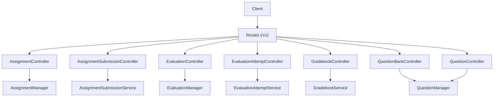
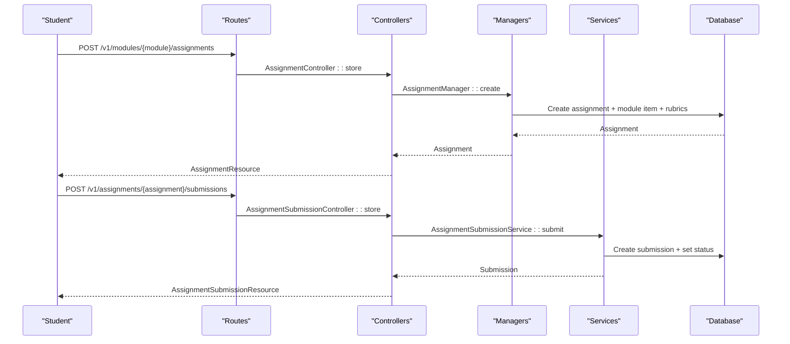
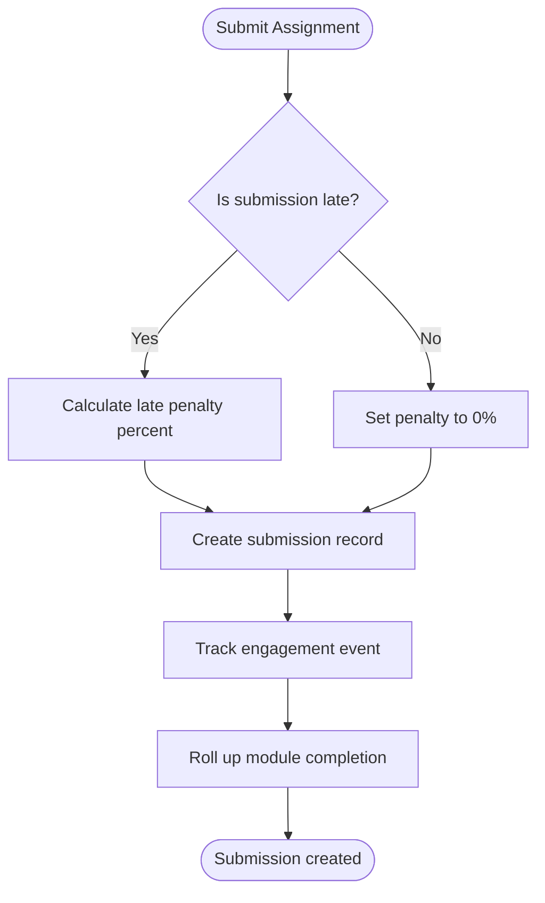
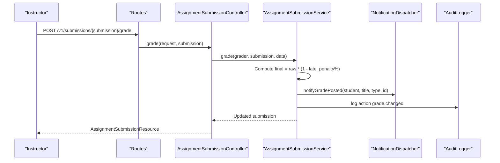
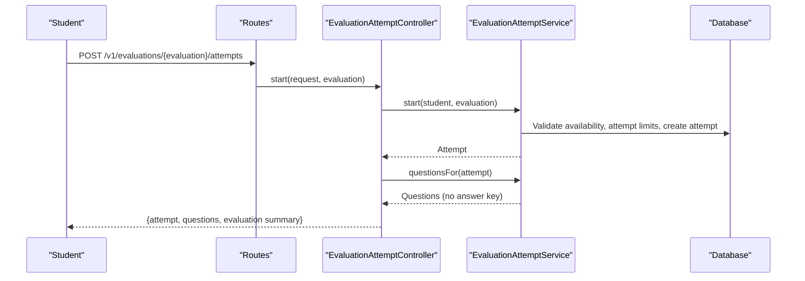
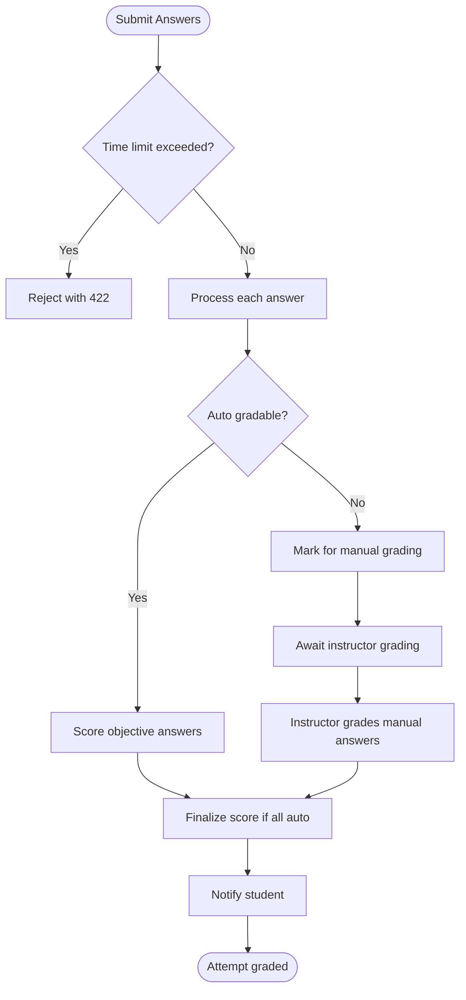
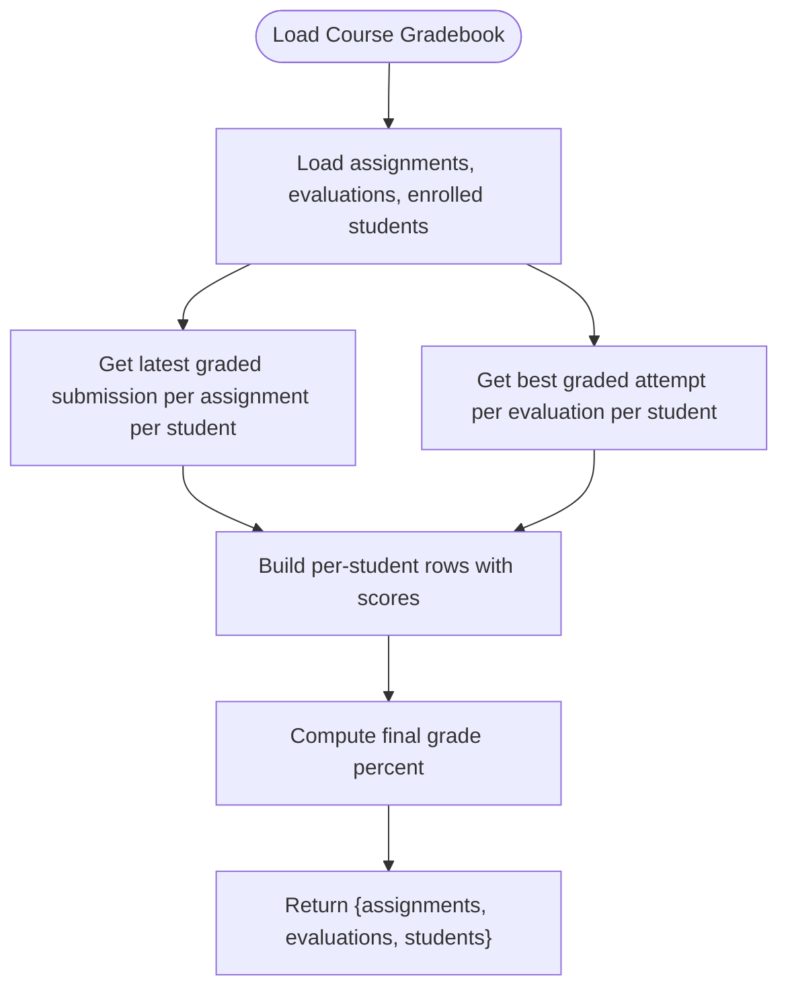
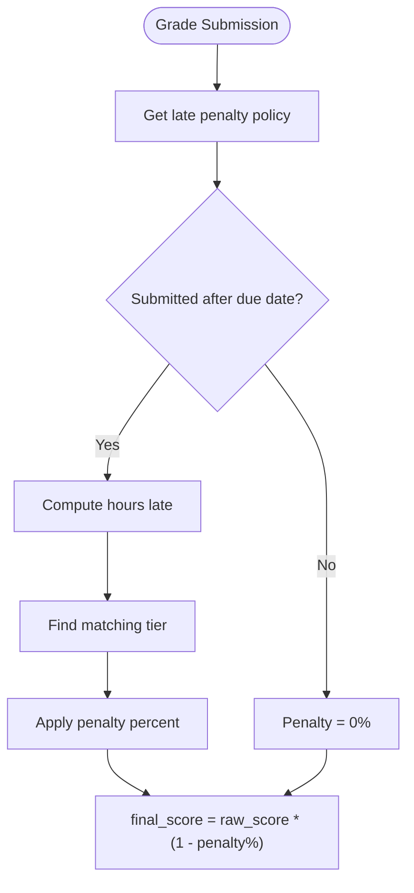
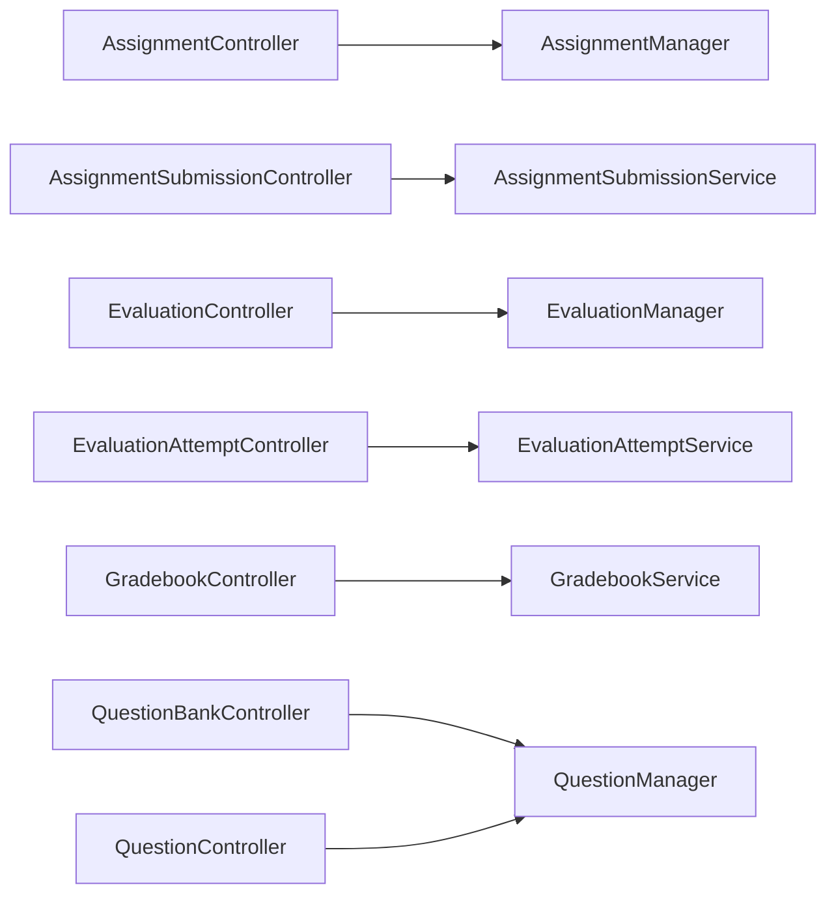

# Assessment & Evaluation APIs

<cite>
**Referenced Files in This Document**
- [routes/api.php](file://routes/api.php)
- [AssignmentController.php](file://app/Http/Controllers/Api/V1/AssignmentController.php)
- [AssignmentSubmissionController.php](file://app/Http/Controllers/Api/V1/AssignmentSubmissionController.php)
- [EvaluationController.php](file://app/Http/Controllers/Api/V1/EvaluationController.php)
- [EvaluationAttemptController.php](file://app/Http/Controllers/Api/V1/EvaluationAttemptController.php)
- [GradebookController.php](file://app/Http/Controllers/Api/V1/GradebookController.php)
- [QuestionBankController.php](file://app/Http/Controllers/Api/V1/QuestionBankController.php)
- [QuestionController.php](file://app/Http/Controllers/Api/V1/QuestionController.php)
- [AssignmentManager.php](file://app/Services/Assessment/AssignmentManager.php)
- [AssignmentSubmissionService.php](file://app/Services/Assessment/AssignmentSubmissionService.php)
- [EvaluationManager.php](file://app/Services/Assessment/EvaluationManager.php)
- [EvaluationAttemptService.php](file://app/Services/Assessment/EvaluationAttemptService.php)
- [GradebookService.php](file://app/Services/Assessment/GradebookService.php)
- [LatePenaltyCalculator.php](file://app/Services/Assessment/LatePenaltyCalculator.php)
- [QuestionManager.php](file://app/Services/Assessment/QuestionManager.php)
</cite>

## Table of Contents
1. Introduction
2. Project Structure
3. Core Components
4. Architecture Overview
5. Detailed Component Analysis
6. Dependency Analysis
7. Performance Considerations
8. Troubleshooting Guide
9. Conclusion

## Introduction
This document provides API documentation for assessment and evaluation features, including:
- Assignment management: creation, submission handling, grading workflows, and rubric-based evaluation
- Evaluations (quizzes): question bank management, attempt lifecycle, automated and manual grading
- Gradebook aggregation: per-course grade summaries with late penalty calculation
- Examples of typical workflows for instructors and students

All endpoints are under the v1 namespace and protected by authentication where required. Authorization is enforced via policies on controllers and services.

## Project Structure
The assessment and evaluation features follow a layered structure:
- Routes define RESTful endpoints grouped under /v1
- Controllers handle HTTP requests, enforce authorization, and delegate to services
- Services encapsulate business logic (creation, submission, grading, scoring, aggregation)
- Resources serialize models for consistent API responses

**Diagram sources**
- [routes/api.php:159-191](file://routes/api.php#L159-L191)
- [AssignmentController.php:16-47](file://app/Http/Controllers/Api/V1/AssignmentController.php#L16-L47)
- [AssignmentSubmissionController.php:19-58](file://app/Http/Controllers/Api/V1/AssignmentSubmissionController.php#L19-L58)
- [EvaluationController.php:16-49](file://app/Http/Controllers/Api/V1/EvaluationController.php#L16-L49)
- [EvaluationAttemptController.php:19-83](file://app/Http/Controllers/Api/V1/EvaluationAttemptController.php#L19-L83)
- [GradebookController.php:12-22](file://app/Http/Controllers/Api/V1/GradebookController.php#L12-L22)
- [QuestionBankController.php:15-39](file://app/Http/Controllers/Api/V1/QuestionBankController.php#L15-L39)
- [QuestionController.php:15-34](file://app/Http/Controllers/Api/V1/QuestionController.php#L15-L34)

**Section sources**
- [routes/api.php:159-191](file://routes/api.php#L159-L191)

## Core Components
- Assignments: CRUD for assignments within modules; rubrics define grading criteria; submissions support file or text content; grading applies late penalties and rubric scores
- Evaluations: CRUD for evaluations; questions managed via question banks; attempts track student progress with time limits, attempt limits, randomization/subsetting, auto-grading for objective questions, and manual grading for short-answer/essay
- Question Banks: instructor/admin-only management of reusable questions and options
- Gradebook: aggregated view of assignment scores and evaluation performance per student per course
- Late Penalty Calculator: tiered deduction based on policy-defined bands

Key responsibilities:
- Controllers: route handling, validation, authorization, resource serialization
- Managers: create/update/delete orchestration for assignments and evaluations
- Services: submission flow, attempt lifecycle, grading, scoring, notifications, audit logging, engagement tracking
- Gradebook Service: compute final grades across assignments and evaluations

**Section sources**
- [AssignmentManager.php:21-115](file://app/Services/Assessment/AssignmentManager.php#L21-L115)
- [AssignmentSubmissionService.php:24-117](file://app/Services/Assessment/AssignmentSubmissionService.php#L24-L117)
- [EvaluationManager.php:18-104](file://app/Services/Assessment/EvaluationManager.php#L18-L104)
- [EvaluationAttemptService.php:26-219](file://app/Services/Assessment/EvaluationAttemptService.php#L26-L219)
- [GradebookService.php:18-121](file://app/Services/Assessment/GradebookService.php#L18-L121)
- [LatePenaltyCalculator.php:15-36](file://app/Services/Assessment/LatePenaltyCalculator.php#L15-L36)
- [QuestionManager.php:17-55](file://app/Services/Assessment/QuestionManager.php#L17-L55)

## Architecture Overview
The system separates concerns between routing, controllers, and domain services. Business rules such as attempt limits, time windows, auto/manual grading, late penalties, and grade aggregation are centralized in services.

**Diagram sources**
- [routes/api.php:159-167](file://routes/api.php#L159-L167)
- [AssignmentController.php:25-30](file://app/Http/Controllers/Api/V1/AssignmentController.php#L25-L30)
- [AssignmentManager.php:26-49](file://app/Services/Assessment/AssignmentManager.php#L26-L49)
- [AssignmentSubmissionController.php:38-50](file://app/Http/Controllers/Api/V1/AssignmentSubmissionController.php#L38-L50)
- [AssignmentSubmissionService.php:37-67](file://app/Services/Assessment/AssignmentSubmissionService.php#L37-L67)

## Detailed Component Analysis

### Assignments
- Endpoints
  - Create assignment: POST /v1/modules/{module}/assignments
  - Show assignment: GET /v1/assignments/{assignment}
  - Update assignment: PATCH /v1/assignments/{assignment}
  - Delete assignment: DELETE /v1/assignments/{assignment}
- Behavior
  - Creation persists assignment fields, syncs rubrics, and registers a module item slot
  - Updates can modify core fields, rubrics, and module item properties
  - Deletion removes the module item association and deletes the assignment
- Rubrics
  - Rubrics are replaced atomically during create/update to ensure consistency
  - Grading uses rubric scores to compute final score after late penalty application

Example workflow: Instructor creates an assignment with due date, max score, and rubrics; students submit work; instructor grades using rubric scores and feedback.

**Section sources**
- [routes/api.php:159-163](file://routes/api.php#L159-L163)
- [AssignmentController.php:20-46](file://app/Http/Controllers/Api/V1/AssignmentController.php#L20-L46)
- [AssignmentManager.php:26-115](file://app/Services/Assessment/AssignmentManager.php#L26-L115)

### Assignment Submissions and Grading
- Endpoints
  - List submissions: GET /v1/assignments/{assignment}/submissions
  - Submit assignment: POST /v1/assignments/{assignment}/submissions
  - Grade submission: POST /v1/submissions/{submission}/grade
- Behavior
  - Students submit files or text; submissions record attempt number, timestamps, and late status
  - Late penalty percentage is calculated at submission time and applied when grading
  - Grading sets raw/final scores, rubric scores, feedback, and notifies the student
  - Progress engine updates module completion upon submission

**Diagram sources**
- [AssignmentSubmissionService.php:37-67](file://app/Services/Assessment/AssignmentSubmissionService.php#L37-L67)
- [LatePenaltyCalculator.php:17-34](file://app/Services/Assessment/LatePenaltyCalculator.php#L17-L34)

Grading sequence:

**Diagram sources**
- [AssignmentSubmissionController.php:52-57](file://app/Http/Controllers/Api/V1/AssignmentSubmissionController.php#L52-L57)
- [AssignmentSubmissionService.php:72-115](file://app/Services/Assessment/AssignmentSubmissionService.php#L72-L115)

**Section sources**
- [routes/api.php:165-167](file://routes/api.php#L165-L167)
- [AssignmentSubmissionController.php:26-57](file://app/Http/Controllers/Api/V1/AssignmentSubmissionController.php#L26-L57)
- [AssignmentSubmissionService.php:37-115](file://app/Services/Assessment/AssignmentSubmissionService.php#L37-L115)
- [LatePenaltyCalculator.php:17-34](file://app/Services/Assessment/LatePenaltyCalculator.php#L17-L34)

### Evaluations (Quizzes)
- Endpoints
  - Create evaluation: POST /v1/modules/{module}/evaluations
  - Show evaluation: GET /v1/evaluations/{evaluation}
  - Update evaluation: PATCH /v1/evaluations/{evaluation}
  - Delete evaluation: DELETE /v1/evaluations/{evaluation}
- Behavior
  - Creation persists evaluation settings and syncs selected questions into the evaluation
  - Showing an evaluation returns questions with options (answer key only visible to authorized roles)
  - Attempt lifecycle includes start, show, submit, and grade endpoints

**Diagram sources**
- [routes/api.php:179-188](file://routes/api.php#L179-L188)
- [EvaluationAttemptController.php:40-61](file://app/Http/Controllers/Api/V1/EvaluationAttemptController.php#L40-L61)
- [EvaluationAttemptService.php:35-97](file://app/Services/Assessment/EvaluationAttemptService.php#L35-L97)

Submission and grading:

**Diagram sources**
- [EvaluationAttemptService.php:102-206](file://app/Services/Assessment/EvaluationAttemptService.php#L102-L206)

**Section sources**
- [routes/api.php:179-188](file://routes/api.php#L179-L188)
- [EvaluationController.php:20-49](file://app/Http/Controllers/Api/V1/EvaluationController.php#L20-L49)
- [EvaluationManager.php:28-104](file://app/Services/Assessment/EvaluationManager.php#L28-L104)
- [EvaluationAttemptController.php:27-83](file://app/Http/Controllers/Api/V1/EvaluationAttemptController.php#L27-L83)
- [EvaluationAttemptService.php:35-219](file://app/Services/Assessment/EvaluationAttemptService.php#L35-L219)

### Question Bank Management
- Endpoints
  - List question banks: GET /v1/courses/{course}/question-banks
  - Create question bank: POST /v1/courses/{course}/question-banks
  - Delete question bank: DELETE /v1/question-banks/{bank}
  - Add question: POST /v1/question-banks/{bank}/questions
  - Delete question: DELETE /v1/questions/{question}
- Behavior
  - Instructors/admins manage question banks per course
  - Questions include type, points, and options; auto_gradable is derived from type
  - Deleting a question removes it from the bank

**Section sources**
- [routes/api.php:169-175](file://routes/api.php#L169-L175)
- [QuestionBankController.php:17-39](file://app/Http/Controllers/Api/V1/QuestionBankController.php#L17-L39)
- [QuestionController.php:19-34](file://app/Http/Controllers/Api/V1/QuestionController.php#L19-L34)
- [QuestionManager.php:24-55](file://app/Services/Assessment/QuestionManager.php#L24-L55)

### Gradebook Aggregation
- Endpoint
  - Get course gradebook: GET /v1/courses/{course}/gradebook
- Behavior
  - Aggregates latest graded assignment submissions and best evaluation attempts per student
  - Computes per-student final grade percent using assignment max scores and equal-weighted evaluation percentages
  - Returns structured data with assignments, evaluations, and student rows

**Diagram sources**
- [GradebookController.php:16-21](file://app/Http/Controllers/Api/V1/GradebookController.php#L16-L21)
- [GradebookService.php:31-119](file://app/Services/Assessment/GradebookService.php#L31-L119)

**Section sources**
- [routes/api.php:191](file://routes/api.php#L191)
- [GradebookController.php:16-21](file://app/Http/Controllers/Api/V1/GradebookController.php#L16-L21)
- [GradebookService.php:31-119](file://app/Services/Assessment/GradebookService.php#L31-L119)

### Late Penalty Calculation
- Logic
  - Late penalty percentage is determined by the assignment’s policy tiers based on hours late
  - If no policy or not late, penalty is zero
  - Final score is computed as raw score adjusted by late penalty percent

**Diagram sources**
- [LatePenaltyCalculator.php:17-34](file://app/Services/Assessment/LatePenaltyCalculator.php#L17-L34)
- [AssignmentSubmissionService.php:72-85](file://app/Services/Assessment/AssignmentSubmissionService.php#L72-L85)

**Section sources**
- [LatePenaltyCalculator.php:17-34](file://app/Services/Assessment/LatePenaltyCalculator.php#L17-L34)
- [AssignmentSubmissionService.php:72-85](file://app/Services/Assessment/AssignmentSubmissionService.php#L72-L85)

## Dependency Analysis
- Controllers depend on managers and services for business logic
- Managers coordinate model persistence and related entities (e.g., module items, rubrics, questions)
- Services encapsulate complex flows: submission lifecycle, attempt management, grading, notifications, audit logs, engagement tracking
- Gradebook service depends on enrollment status and aggregated data from assignments and evaluations

**Diagram sources**
- [AssignmentController.php:16-47](file://app/Http/Controllers/Api/V1/AssignmentController.php#L16-L47)
- [AssignmentSubmissionController.php:19-58](file://app/Http/Controllers/Api/V1/AssignmentSubmissionController.php#L19-L58)
- [EvaluationController.php:16-49](file://app/Http/Controllers/Api/V1/EvaluationController.php#L16-L49)
- [EvaluationAttemptController.php:19-83](file://app/Http/Controllers/Api/V1/EvaluationAttemptController.php#L19-L83)
- [GradebookController.php:12-22](file://app/Http/Controllers/Api/V1/GradebookController.php#L12-L22)
- [QuestionBankController.php:15-39](file://app/Http/Controllers/Api/V1/QuestionBankController.php#L15-L39)
- [QuestionController.php:15-34](file://app/Http/Controllers/Api/V1/QuestionController.php#L15-L34)

**Section sources**
- [AssignmentManager.php:21-115](file://app/Services/Assessment/AssignmentManager.php#L21-L115)
- [AssignmentSubmissionService.php:24-117](file://app/Services/Assessment/AssignmentSubmissionService.php#L24-L117)
- [EvaluationManager.php:18-104](file://app/Services/Assessment/EvaluationManager.php#L18-L104)
- [EvaluationAttemptService.php:26-219](file://app/Services/Assessment/EvaluationAttemptService.php#L26-L219)
- [GradebookService.php:18-121](file://app/Services/Assessment/GradebookService.php#L18-L121)
- [QuestionManager.php:17-55](file://app/Services/Assessment/QuestionManager.php#L17-L55)

## Performance Considerations
- Use pagination for listing submissions and attempts to avoid large payloads
- Prefer eager loading of related data in controllers to reduce N+1 queries
- Batch operations in managers/services use database transactions to maintain consistency
- Avoid unnecessary recalculations; rely on persisted scores and statuses
- For gradebook aggregation, query only necessary fields and filter by confirmed enrolments

[No sources needed since this section provides general guidance]

## Troubleshooting Guide
Common issues and resolutions:
- Attempt not allowed
  - Causes: evaluation not open yet, closed, or max attempts reached
  - Resolution: check evaluation availability window and attempt limits
- Time limit exceeded
  - Cause: submitting after time limit elapsed
  - Resolution: ensure submission occurs within the allowed window
- Manual grading required
  - Cause: non-auto gradable questions require instructor review
  - Resolution: use the grade endpoint to provide per-answer grades
- Late penalty not applied
  - Cause: missing or misconfigured late penalty policy/tiers
  - Resolution: verify policy and tiers; confirm due_at vs submitted_at timestamps
- Gradebook shows null scores
  - Cause: no graded submissions or attempts recorded
  - Resolution: ensure submissions are graded and attempts are finalized

**Section sources**
- [EvaluationAttemptService.php:35-78](file://app/Services/Assessment/EvaluationAttemptService.php#L35-L78)
- [EvaluationAttemptService.php:102-149](file://app/Services/Assessment/EvaluationAttemptService.php#L102-L149)
- [AssignmentSubmissionService.php:37-67](file://app/Services/Assessment/AssignmentSubmissionService.php#L37-L67)
- [LatePenaltyCalculator.php:17-34](file://app/Services/Assessment/LatePenaltyCalculator.php#L17-L34)

## Conclusion
The assessment and evaluation APIs provide a robust framework for managing assignments and quizzes, supporting flexible grading workflows, automated and manual scoring, and comprehensive grade aggregation. The separation of concerns between routes, controllers, managers, and services ensures maintainability and clarity. Late penalty policies and progress integration further align assessments with learning outcomes.

[No sources needed since this section summarizes without analyzing specific files]