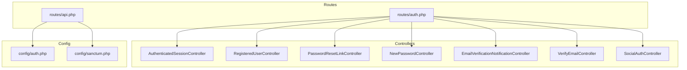
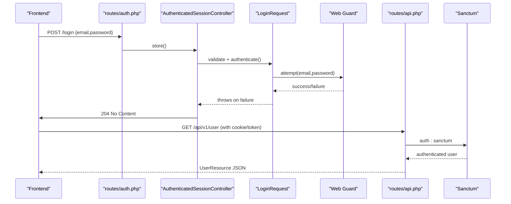
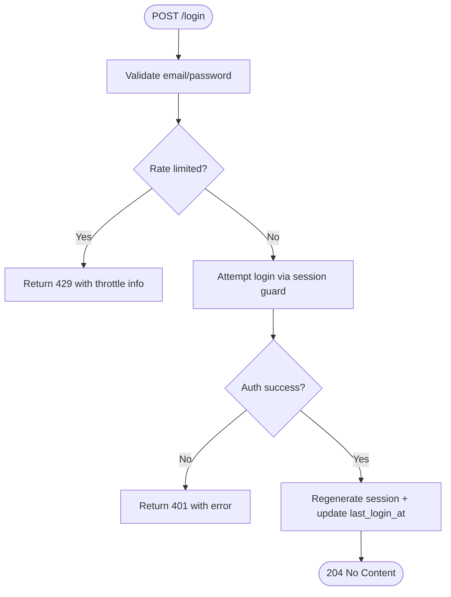
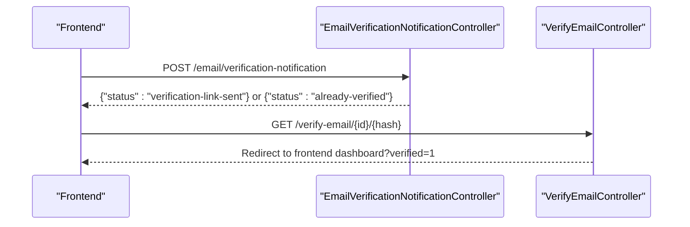
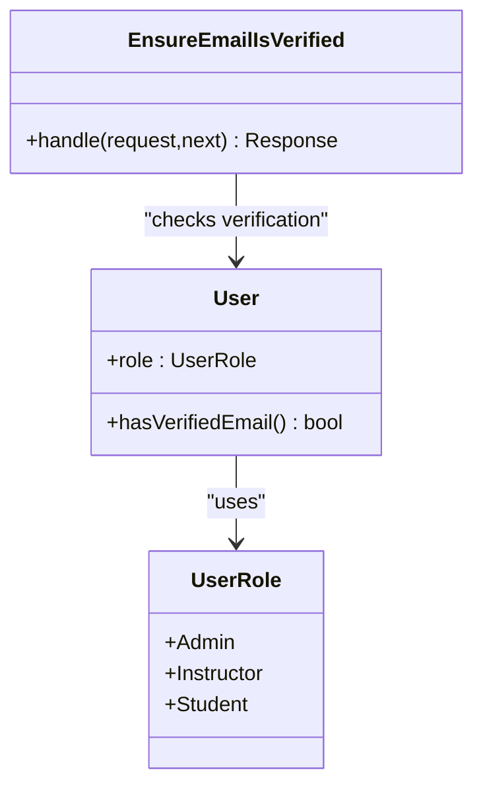
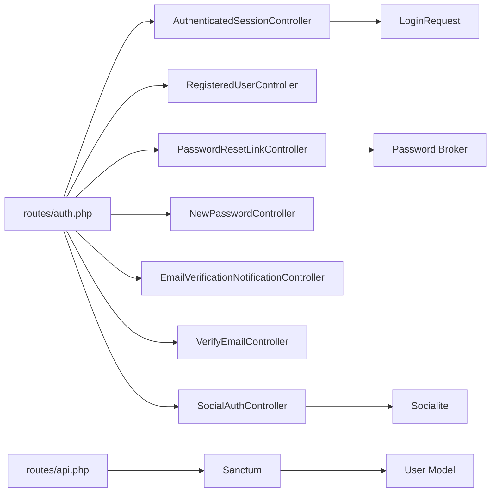

# Authentication & Authorization

<cite>
**Referenced Files in This Document**
- [routes/auth.php](file://routes/auth.php)
- [routes/api.php](file://routes/api.php)
- [config/sanctum.php](file://config/sanctum.php)
- [config/auth.php](file://config/auth.php)
- [app/Http/Controllers/Auth/AuthenticatedSessionController.php](file://app/Http/Controllers/Auth/AuthenticatedSessionController.php)
- [app/Http/Controllers/Auth/RegisteredUserController.php](file://app/Http/Controllers/Auth/RegisteredUserController.php)
- [app/Http/Controllers/Auth/PasswordResetLinkController.php](file://app/Http/Controllers/Auth/PasswordResetLinkController.php)
- [app/Http/Controllers/Auth/NewPasswordController.php](file://app/Http/Controllers/Auth/NewPasswordController.php)
- [app/Http/Controllers/Auth/EmailVerificationNotificationController.php](file://app/Http/Controllers/Auth/EmailVerificationNotificationController.php)
- [app/Http/Controllers/Auth/VerifyEmailController.php](file://app/Http/Controllers/Auth/VerifyEmailController.php)
- [app/Http/Controllers/Auth/SocialAuthController.php](file://app/Http/Controllers/Auth/SocialAuthController.php)
- [app/Http/Requests/Auth/LoginRequest.php](file://app/Http/Requests/Auth/LoginRequest.php)
- [app/Models/User.php](file://app/Models/User.php)
- [app/Enums/UserRole.php](file://app/Enums/UserRole.php)
- [app/Http/Middleware/EnsureEmailIsVerified.php](file://app/Http/Middleware/EnsureEmailIsVerified.php)
</cite>

## Table of Contents
1. Introduction
2. Project Structure
3. Core Components
4. Architecture Overview
5. Detailed Component Analysis
6. Dependency Analysis
7. Performance Considerations
8. Troubleshooting Guide
9. Conclusion

## Introduction
This document provides API documentation for authentication and authorization endpoints implemented with Laravel Sanctum and session-based auth. It covers registration, login, logout, email verification, password reset, and social authentication flows. It also details request/response schemas, token management, session handling, and role-based access control (RBAC) using policies and middleware.

## Project Structure
Authentication routes are defined under the application’s route files:
- Web authentication routes (register, login, forgot/reset password, verify email, logout) are registered in a dedicated auth route file.
- API v1 routes use Sanctum middleware to protect endpoints and expose a current user endpoint.

**Diagram sources**
- [routes/auth.php:11-37](file://routes/auth.php#L11-L37)
- [routes/api.php:49-50](file://routes/api.php#L49-L50)
- [config/auth.php:18-45](file://config/auth.php#L18-L45)
- [config/sanctum.php:21-40](file://config/sanctum.php#L21-L40)

**Section sources**
- [routes/auth.php:11-37](file://routes/auth.php#L11-L37)
- [routes/api.php:49-50](file://routes/api.php#L49-L50)
- [config/auth.php:18-45](file://config/auth.php#L18-L45)
- [config/sanctum.php:21-40](file://config/sanctum.php#L21-L40)

## Core Components
- Session-based authentication via the web guard for SPA stateful requests.
- Sanctum configured for stateful domains and optional bearer tokens.
- Controllers handle registration, login/logout, email verification, password reset, and social login.
- Request validation and rate limiting for login attempts.
- RBAC through roles and policies applied on protected API routes.

Key implementation references:
- Login flow uses a custom FormRequest that validates credentials, enforces rate limits, and authenticates via the session guard.
- Registration creates a student user, triggers events, and logs them in.
- Password reset uses Laravel’s broker to send links and reset passwords.
- Email verification supports resending notifications and verifying via signed link.
- Social authentication redirects to Google and resolves or creates users by verified email.

**Section sources**
- [app/Http/Requests/Auth/LoginRequest.php:30-56](file://app/Http/Requests/Auth/LoginRequest.php#L30-L56)
- [app/Http/Controllers/Auth/AuthenticatedSessionController.php:18-41](file://app/Http/Controllers/Auth/AuthenticatedSessionController.php#L18-L41)
- [app/Http/Controllers/Auth/RegisteredUserController.php:26-45](file://app/Http/Controllers/Auth/RegisteredUserController.php#L26-L45)
- [app/Http/Controllers/Auth/PasswordResetLinkController.php:20-40](file://app/Http/Controllers/Auth/PasswordResetLinkController.php#L20-L40)
- [app/Http/Controllers/Auth/NewPasswordController.php:21-54](file://app/Http/Controllers/Auth/NewPasswordController.php#L21-L54)
- [app/Http/Controllers/Auth/EmailVerificationNotificationController.php:13-22](file://app/Http/Controllers/Auth/EmailVerificationNotificationController.php#L13-L22)
- [app/Http/Controllers/Auth/VerifyEmailController.php:18-33](file://app/Http/Controllers/Auth/VerifyEmailController.php#L18-L33)
- [app/Http/Controllers/Auth/SocialAuthController.php:27-48](file://app/Http/Controllers/Auth/SocialAuthController.php#L27-L48)

## Architecture Overview
The system combines session-based authentication for SPAs with Sanctum for API protection. The frontend communicates over stateful domains where cookies are accepted; Sanctum can also authenticate API requests via bearer tokens when configured.

**Diagram sources**
- [routes/auth.php:15-17](file://routes/auth.php#L15-L17)
- [app/Http/Controllers/Auth/AuthenticatedSessionController.php:18-27](file://app/Http/Controllers/Auth/AuthenticatedSessionController.php#L18-L27)
- [app/Http/Requests/Auth/LoginRequest.php:30-56](file://app/Http/Requests/Auth/LoginRequest.php#L30-L56)
- [routes/api.php:49-50](file://routes/api.php#L49-L50)
- [config/sanctum.php:21-40](file://config/sanctum.php#L21-L40)

## Detailed Component Analysis

### Login
- Endpoint: POST /login
- Middleware: guest
- Request body fields:
  - email: string, required, valid email
  - password: string, required
  - remember: boolean, optional
- Behavior:
  - Validates input and enforces rate limiting per email+IP.
  - Authenticates via session guard; regenerates session ID.
  - Updates last login timestamp.
  - Returns 204 No Content on success.
- Error responses:
  - 422 Unprocessable Entity with field errors on validation failure.
  - 429 Too Many Requests with throttle message after too many attempts.
  - 401 Unauthorized if credentials are invalid.

**Diagram sources**
- [app/Http/Requests/Auth/LoginRequest.php:30-87](file://app/Http/Requests/Auth/LoginRequest.php#L30-L87)
- [app/Http/Controllers/Auth/AuthenticatedSessionController.php:18-27](file://app/Http/Controllers/Auth/AuthenticatedSessionController.php#L18-L27)

**Section sources**
- [routes/auth.php:15-17](file://routes/auth.php#L15-L17)
- [app/Http/Requests/Auth/LoginRequest.php:30-87](file://app/Http/Requests/Auth/LoginRequest.php#L30-L87)
- [app/Http/Controllers/Auth/AuthenticatedSessionController.php:18-27](file://app/Http/Controllers/Auth/AuthenticatedSessionController.php#L18-L27)

### Logout
- Endpoint: POST /logout
- Middleware: auth
- Behavior:
  - Logs out the current user via the web guard.
  - Invalidates session and regenerates CSRF token.
  - Returns 204 No Content.

**Section sources**
- [routes/auth.php:35-37](file://routes/auth.php#L35-L37)
- [app/Http/Controllers/Auth/AuthenticatedSessionController.php:32-41](file://app/Http/Controllers/Auth/AuthenticatedSessionController.php#L32-L41)

### Registration
- Endpoint: POST /register
- Middleware: guest
- Request body fields:
  - name: string, required, max length
  - email: string, required, lowercase, unique
  - password: string, required, confirmed
- Behavior:
  - Creates a new user with student role.
  - Hashes password and stores it.
  - Fires Registered event and logs the user in.
  - Returns 204 No Content.

**Section sources**
- [routes/auth.php:11-13](file://routes/auth.php#L11-L13)
- [app/Http/Controllers/Auth/RegisteredUserController.php:26-45](file://app/Http/Controllers/Auth/RegisteredUserController.php#L26-L45)
- [app/Enums/UserRole.php:7-12](file://app/Enums/UserRole.php#L7-L12)

### Email Verification
- Resend notification:
  - Endpoint: POST /email/verification-notification
  - Middleware: auth, throttle
  - Response:
    - 200 OK with status indicating whether already verified or link sent.
- Verify email:
  - Endpoint: GET /verify-email/{id}/{hash}
  - Middleware: auth, signed, throttle
  - Behavior: Marks email verified and redirects to frontend dashboard with a verified flag.

**Diagram sources**
- [app/Http/Controllers/Auth/EmailVerificationNotificationController.php:13-22](file://app/Http/Controllers/Auth/EmailVerificationNotificationController.php#L13-L22)
- [app/Http/Controllers/Auth/VerifyEmailController.php:18-33](file://app/Http/Controllers/Auth/VerifyEmailController.php#L18-L33)
- [routes/auth.php:27-33](file://routes/auth.php#L27-L33)

**Section sources**
- [routes/auth.php:27-33](file://routes/auth.php#L27-L33)
- [app/Http/Controllers/Auth/EmailVerificationNotificationController.php:13-22](file://app/Http/Controllers/Auth/EmailVerificationNotificationController.php#L13-L22)
- [app/Http/Controllers/Auth/VerifyEmailController.php:18-33](file://app/Http/Controllers/Auth/VerifyEmailController.php#L18-L33)

### Password Reset
- Forgot password:
  - Endpoint: POST /forgot-password
  - Request body: email (required, valid)
  - Behavior: Sends reset link; returns status message.
- Reset password:
  - Endpoint: POST /reset-password
  - Request body: token, email, password, password_confirmation
  - Behavior: Resets password and marks email verified if needed; returns status message.

**Section sources**
- [routes/auth.php:19-25](file://routes/auth.php#L19-L25)
- [app/Http/Controllers/Auth/PasswordResetLinkController.php:20-40](file://app/Http/Controllers/Auth/PasswordResetLinkController.php#L20-L40)
- [app/Http/Controllers/Auth/NewPasswordController.php:21-54](file://app/Http/Controllers/Auth/NewPasswordController.php#L21-L54)

### Social Authentication (Google)
- Redirect:
  - Endpoint: GET /social/redirect (driver: google)
  - Behavior: Redirects to Google OAuth consent screen.
- Callback:
  - Endpoint: GET /social/callback
  - Behavior: Retrieves socialite user, matches or creates account by verified email, logs user in, and redirects to frontend dashboard.

Note: These routes are not shown in the provided snippet but are handled by the controller methods referenced below.

**Section sources**
- [app/Http/Controllers/Auth/SocialAuthController.php:27-48](file://app/Http/Controllers/Auth/SocialAuthController.php#L27-L48)

### API Authentication and Current User
- Protected user info:
  - Endpoint: GET /api/v1/user
  - Middleware: auth:sanctum
  - Response: JSON representation of the authenticated user resource.

**Section sources**
- [routes/api.php:49-50](file://routes/api.php#L49-L50)

### Role-Based Access Control (RBAC)
- Roles:
  - Admin, Instructor, Student (enum).
- Policies:
  - Multiple domain-specific policies enforce permissions on resources (e.g., courses, modules, assignments).
- Middleware:
  - EnsureEmailIsVerified returns 409 Conflict if the user’s email is not verified.
- Sanctum:
  - Protects API routes via auth:sanctum middleware.

**Diagram sources**
- [app/Enums/UserRole.php:7-12](file://app/Enums/UserRole.php#L7-L12)
- [app/Models/User.php:49-55](file://app/Models/User.php#L49-L55)
- [app/Http/Middleware/EnsureEmailIsVerified.php:17-26](file://app/Http/Middleware/EnsureEmailIsVerified.php#L17-L26)

**Section sources**
- [app/Enums/UserRole.php:7-12](file://app/Enums/UserRole.php#L7-L12)
- [app/Models/User.php:49-55](file://app/Models/User.php#L49-L55)
- [app/Http/Middleware/EnsureEmailIsVerified.php:17-26](file://app/Http/Middleware/EnsureEmailIsVerified.php#L17-L26)

## Dependency Analysis
- Route definitions depend on controllers and middleware.
- Controllers rely on request validators, guards, and services (e.g., Socialite, Password broker).
- Sanctum configuration influences how API requests are authenticated (stateful domains, guards).
- User model integrates with Sanctum and email verification.

**Diagram sources**
- [routes/auth.php:11-37](file://routes/auth.php#L11-L37)
- [routes/api.php:49-50](file://routes/api.php#L49-L50)
- [app/Http/Requests/Auth/LoginRequest.php:30-56](file://app/Http/Requests/Auth/LoginRequest.php#L30-L56)
- [app/Http/Controllers/Auth/PasswordResetLinkController.php:20-40](file://app/Http/Controllers/Auth/PasswordResetLinkController.php#L20-L40)
- [app/Http/Controllers/Auth/SocialAuthController.php:27-48](file://app/Http/Controllers/Auth/SocialAuthController.php#L27-L48)
- [config/sanctum.php:21-40](file://config/sanctum.php#L21-L40)

**Section sources**
- [routes/auth.php:11-37](file://routes/auth.php#L11-L37)
- [routes/api.php:49-50](file://routes/api.php#L49-L50)
- [config/sanctum.php:21-40](file://config/sanctum.php#L21-L40)

## Performance Considerations
- Rate limiting on login prevents brute-force attacks; ensure appropriate thresholds for production.
- Use queued email verification to avoid blocking registration/login requests.
- Configure Sanctum stateful domains correctly to minimize unnecessary token checks.
- Keep sessions short-lived and rotate tokens on logout to mitigate session fixation risks.

[No sources needed since this section provides general guidance]

## Troubleshooting Guide
Common issues and resolutions:
- Validation errors:
  - Occur when request fields are missing or invalid; check request schema and return 422 with field messages.
- Throttling:
  - Excessive login attempts trigger throttling; wait for cooldown or adjust limits.
- Email not verified:
  - Some endpoints require verified email; resend verification link or complete verification flow.
- Social login mismatches:
  - Ensure provider accounts are linked to existing users by verified email to avoid duplicates.

**Section sources**
- [app/Http/Requests/Auth/LoginRequest.php:63-87](file://app/Http/Requests/Auth/LoginRequest.php#L63-L87)
- [app/Http/Middleware/EnsureEmailIsVerified.php:17-26](file://app/Http/Middleware/EnsureEmailIsVerified.php#L17-L26)
- [app/Http/Controllers/Auth/SocialAuthController.php:50-74](file://app/Http/Controllers/Auth/SocialAuthController.php#L50-L74)

## Conclusion
This authentication system combines session-based login for SPAs with Sanctum for API protection. It provides robust flows for registration, login/logout, email verification, password reset, and social authentication. RBAC is enforced via roles and policies, while middleware ensures critical preconditions like email verification. Follow the documented request/response schemas and security best practices to integrate clients securely and efficiently.

[No sources needed since this section summarizes without analyzing specific files]