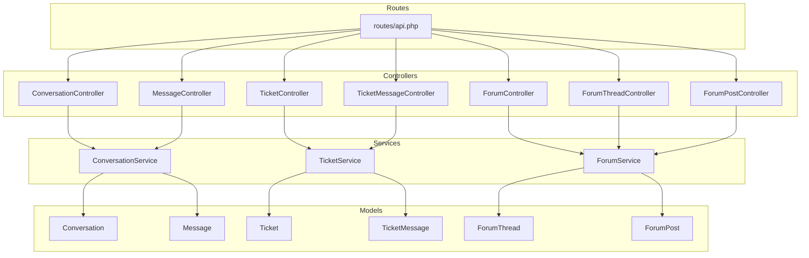
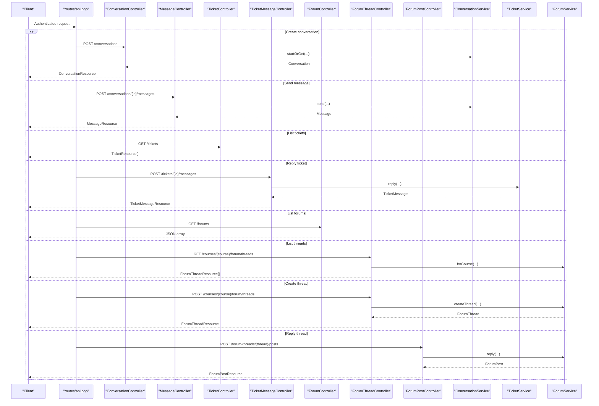
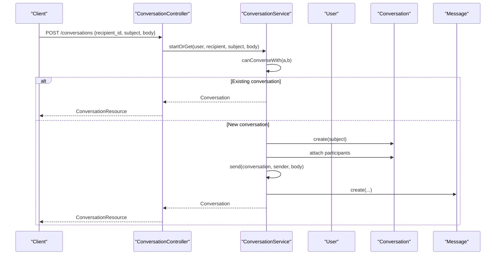
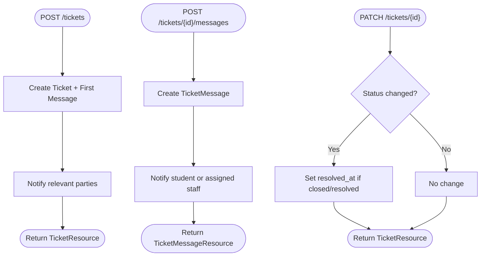
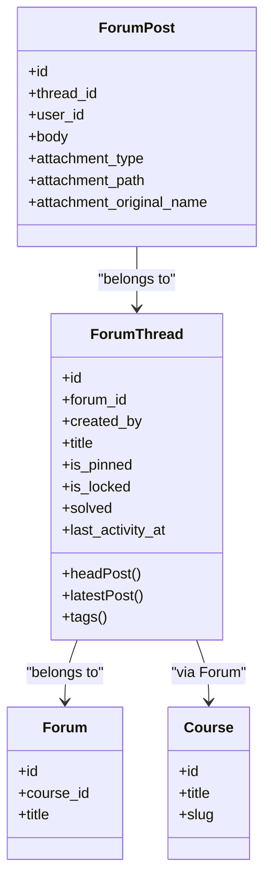
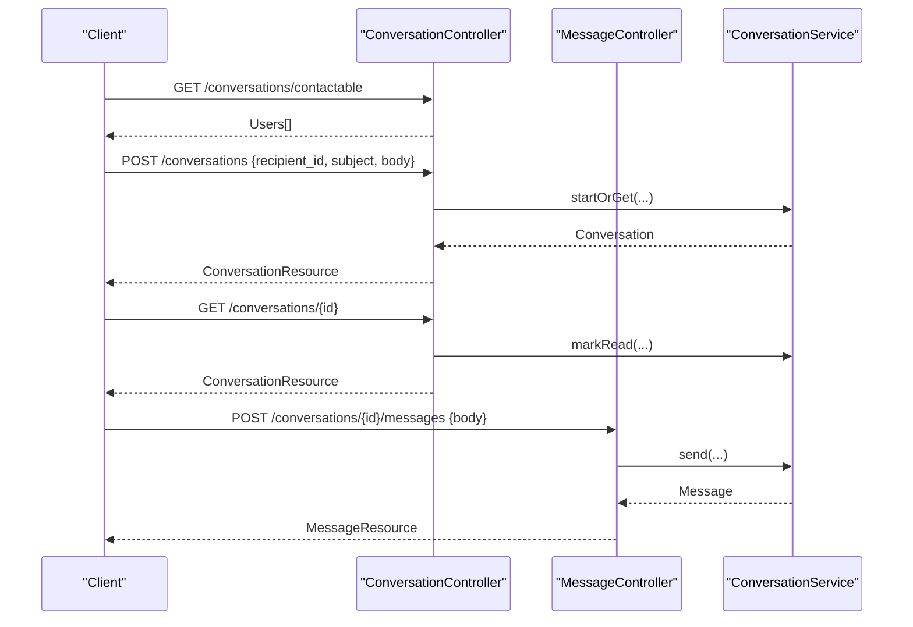
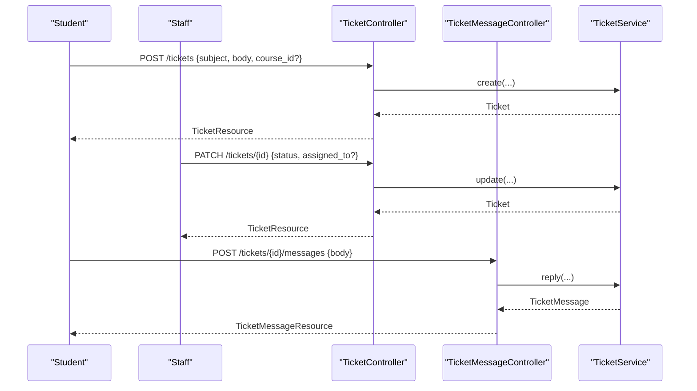
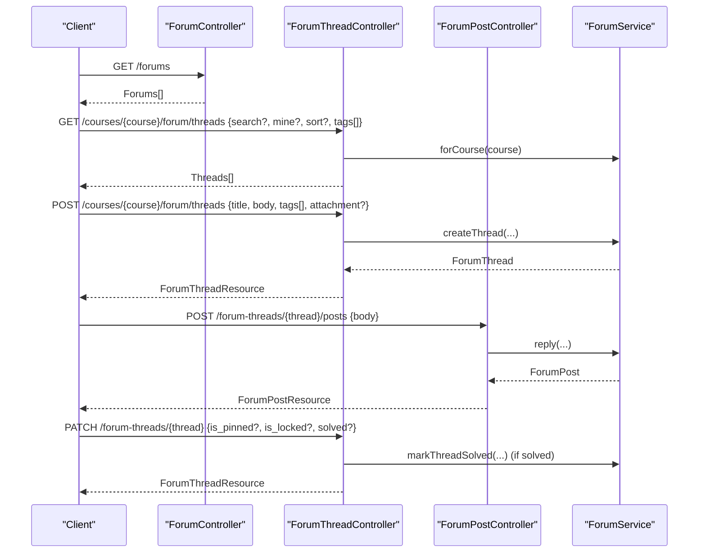
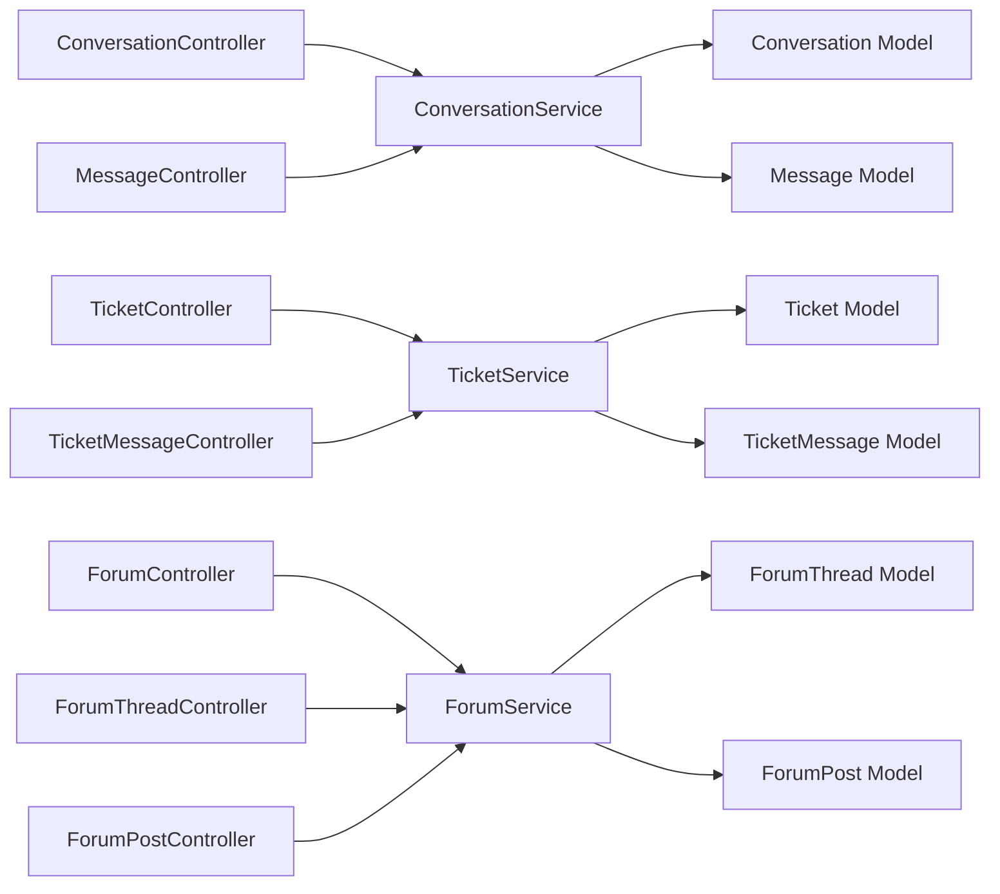

# Communication & Messaging APIs

<cite>
**Referenced Files in This Document**
- [routes/api.php](file://routes/api.php)
- [ConversationController.php](file://app/Http/Controllers/Api/V1/ConversationController.php)
- [MessageController.php](file://app/Http/Controllers/Api/V1/MessageController.php)
- [TicketController.php](file://app/Http/Controllers/Api/V1/TicketController.php)
- [TicketMessageController.php](file://app/Http/Controllers/Api/V1/TicketMessageController.php)
- [ForumController.php](file://app/Http/Controllers/Api/V1/ForumController.php)
- [ForumThreadController.php](file://app/Http/Controllers/Api/V1/ForumThreadController.php)
- [ForumPostController.php](file://app/Http/Controllers/Api/V1/ForumPostController.php)
- [ConversationService.php](file://app/Services/Communication/ConversationService.php)
- [TicketService.php](file://app/Services/Communication/TicketService.php)
- [ForumService.php](file://app/Services/Communication/ForumService.php)
- [Conversation.php](file://app/Models/Conversation.php)
- [Message.php](file://app/Models/Message.php)
- [Ticket.php](file://app/Models/Ticket.php)
- [TicketMessage.php](file://app/Models/TicketMessage.php)
- [ForumThread.php](file://app/Models/ForumThread.php)
- [ForumPost.php](file://app/Models/ForumPost.php)
</cite>

## Table of Contents
1. [Introduction](#introduction)
2. [Project Structure](#project-structure)
3. [Core Components](#core-components)
4. [Architecture Overview](#architecture-overview)
5. [Detailed Component Analysis](#detailed-component-analysis)
6. [Dependency Analysis](#dependency-analysis)
7. [Performance Considerations](#performance-considerations)
8. [Troubleshooting Guide](#troubleshooting-guide)
9. [Conclusion](#conclusion)

## Introduction
This document provides API documentation for the communication and messaging subsystem, covering:
- Direct messaging and contact discovery (one-to-one conversations with read receipts)
- Student support tickets (creation, message threading, status management)
- Forums (thread management, post creation, moderation, tags, attachments)
- Real-time messaging patterns and example workflows

All endpoints are under the authenticated group at /api/v1 unless otherwise noted.

## Project Structure
The communication features are implemented as controllers that delegate to domain services and persist data via Eloquent models. Routes are centralized under routes/api.php.

**Diagram sources**
- [routes/api.php:198-229](file://routes/api.php#L198-L229)
- [ConversationController.php:17-62](file://app/Http/Controllers/Api/V1/ConversationController.php#L17-L62)
- [MessageController.php:13-23](file://app/Http/Controllers/Api/V1/MessageController.php#L13-L23)
- [TicketController.php:17-62](file://app/Http/Controllers/Api/V1/TicketController.php#L17-L62)
- [TicketMessageController.php:13-23](file://app/Http/Controllers/Api/V1/TicketMessageController.php#L13-L23)
- [ForumController.php:18-98](file://app/Http/Controllers/Api/V1/ForumController.php#L18-L98)
- [ForumThreadController.php:19-114](file://app/Http/Controllers/Api/V1/ForumThreadController.php#L19-L114)
- [ForumPostController.php:18-69](file://app/Http/Controllers/Api/V1/ForumPostController.php#L18-L69)
- [ConversationService.php:23-163](file://app/Services/Communication/ConversationService.php#L23-L163)
- [TicketService.php:18-88](file://app/Services/Communication/TicketService.php#L18-L88)
- [ForumService.php:32-223](file://app/Services/Communication/ForumService.php#L32-L223)
- [Conversation.php:13-40](file://app/Models/Conversation.php#L13-L40)
- [Message.php:12-47](file://app/Models/Message.php#L12-L47)
- [Ticket.php:14-66](file://app/Models/Ticket.php#L14-L66)
- [TicketMessage.php:12-40](file://app/Models/TicketMessage.php#L12-L40)
- [ForumThread.php:15-93](file://app/Models/ForumThread.php#L15-L93)
- [ForumPost.php:14-55](file://app/Models/ForumPost.php#L14-L55)

**Section sources**
- [routes/api.php:198-229](file://routes/api.php#L198-L229)

## Core Components
- Conversations and Messages: One-to-one messaging between allowed role pairs with read receipts and contact discovery.
- Tickets: Student support workflow with message threads and status lifecycle.
- Forums: Course-scoped threaded discussions with search, tags, attachments, moderation, and read tracking.

Key responsibilities:
- Controllers handle HTTP requests, authorization, and resource serialization.
- Services encapsulate business rules (permissions, notifications, transactions).
- Models define relationships and attributes.

**Section sources**
- [ConversationController.php:17-62](file://app/Http/Controllers/Api/V1/ConversationController.php#L17-L62)
- [MessageController.php:13-23](file://app/Http/Controllers/Api/V1/MessageController.php#L13-L23)
- [TicketController.php:17-62](file://app/Http/Controllers/Api/V1/TicketController.php#L17-L62)
- [TicketMessageController.php:13-23](file://app/Http/Controllers/Api/V1/TicketMessageController.php#L13-L23)
- [ForumController.php:18-98](file://app/Http/Controllers/Api/V1/ForumController.php#L18-L98)
- [ForumThreadController.php:19-114](file://app/Http/Controllers/Api/V1/ForumThreadController.php#L19-L114)
- [ForumPostController.php:18-69](file://app/Http/Controllers/Api/V1/ForumPostController.php#L18-L69)
- [ConversationService.php:23-163](file://app/Services/Communication/ConversationService.php#L23-L163)
- [TicketService.php:18-88](file://app/Services/Communication/TicketService.php#L18-L88)
- [ForumService.php:32-223](file://app/Services/Communication/ForumService.php#L32-L223)

## Architecture Overview
The system separates concerns across layers:
- API layer: Route definitions and controller actions.
- Service layer: Business logic, permissions, notifications, storage integration.
- Data layer: Eloquent models and database relations.

**Diagram sources**
- [routes/api.php:198-229](file://routes/api.php#L198-L229)
- [ConversationController.php:17-62](file://app/Http/Controllers/Api/V1/ConversationController.php#L17-L62)
- [MessageController.php:13-23](file://app/Http/Controllers/Api/V1/MessageController.php#L13-L23)
- [TicketController.php:17-62](file://app/Http/Controllers/Api/V1/TicketController.php#L17-L62)
- [TicketMessageController.php:13-23](file://app/Http/Controllers/Api/V1/TicketMessageController.php#L13-L23)
- [ForumController.php:18-98](file://app/Http/Controllers/Api/V1/ForumController.php#L18-L98)
- [ForumThreadController.php:19-114](file://app/Http/Controllers/Api/V1/ForumThreadController.php#L19-L114)
- [ForumPostController.php:18-69](file://app/Http/Controllers/Api/V1/ForumPostController.php#L18-L69)
- [ConversationService.php:23-163](file://app/Services/Communication/ConversationService.php#L23-L163)
- [TicketService.php:18-88](file://app/Services/Communication/TicketService.php#L18-L88)
- [ForumService.php:32-223](file://app/Services/Communication/ForumService.php#L32-L223)

## Detailed Component Analysis

### Conversations and Direct Messages
- Endpoints:
  - GET /api/v1/conversations — list conversations for current user
  - GET /api/v1/conversations/contactable — discover users you can message
  - POST /api/v1/conversations — start or reuse a 1:1 conversation and send first message
  - GET /api/v1/conversations/{conversation} — show conversation and mark messages read
  - POST /api/v1/conversations/{conversation}/messages — send a message
- Behavior:
  - Contact discovery enforces role-based permissions; admins can message anyone; instructors can message their enrolled students; students can message admins/instructors from their courses.
  - Reuses existing 1:1 conversation if one exists between two users.
  - Read receipts: viewing a conversation marks unread messages from the other participant as read.
  - Notifications: sending a message triggers notifications to non-sender participants.

**Diagram sources**
- [ConversationController.php:40-52](file://app/Http/Controllers/Api/V1/ConversationController.php#L40-L52)
- [ConversationService.php:50-79](file://app/Services/Communication/ConversationService.php#L50-L79)
- [ConversationService.php:81-97](file://app/Services/Communication/ConversationService.php#L81-L97)
- [ConversationService.php:27-44](file://app/Services/Communication/ConversationService.php#L27-L44)

**Section sources**
- [routes/api.php:198-204](file://routes/api.php#L198-L204)
- [ConversationController.php:21-61](file://app/Http/Controllers/Api/V1/ConversationController.php#L21-L61)
- [MessageController.php:17-22](file://app/Http/Controllers/Api/V1/MessageController.php#L17-L22)
- [ConversationService.php:27-111](file://app/Services/Communication/ConversationService.php#L27-L111)
- [Conversation.php:13-40](file://app/Models/Conversation.php#L13-L40)
- [Message.php:12-47](file://app/Models/Message.php#L12-L47)

### Tickets and Ticket Messages
- Endpoints:
  - GET /api/v1/tickets — list tickets scoped by role (student own, instructor course/assigned, admin all)
  - POST /api/v1/tickets — create a ticket with initial message
  - GET /api/v1/tickets/{ticket} — show ticket details
  - PATCH /api/v1/tickets/{ticket} — update status or assignment
  - POST /api/v1/tickets/{ticket}/messages — add a message thread entry
- Behavior:
  - Creating a ticket starts it as open and attaches the first message.
  - Replies notify the appropriate party (student or assigned staff).
  - Updating to resolved/closed sets resolved timestamp.

**Diagram sources**
- [TicketController.php:25-61](file://app/Http/Controllers/Api/V1/TicketController.php#L25-L61)
- [TicketMessageController.php:17-22](file://app/Http/Controllers/Api/V1/TicketMessageController.php#L17-L22)
- [TicketService.php:25-86](file://app/Services/Communication/TicketService.php#L25-L86)

**Section sources**
- [routes/api.php:206-211](file://routes/api.php#L206-L211)
- [TicketController.php:17-62](file://app/Http/Controllers/Api/V1/TicketController.php#L17-L62)
- [TicketMessageController.php:13-23](file://app/Http/Controllers/Api/V1/TicketMessageController.php#L13-L23)
- [TicketService.php:18-88](file://app/Services/Communication/TicketService.php#L18-L88)
- [Ticket.php:14-66](file://app/Models/Ticket.php#L14-L66)
- [TicketMessage.php:12-40](file://app/Models/TicketMessage.php#L12-L40)

### Forums: Threads and Posts
- Endpoints:
  - GET /api/v1/forums — unified forum index for enrolled courses with unread counts
  - GET /api/v1/courses/{course}/forum/threads — list/search/sort/filter threads
  - POST /api/v1/courses/{course}/forum/threads — create a thread with optional attachment and tags
  - GET /api/v1/forum-threads/{thread} — show thread and mark read
  - PATCH /api/v1/forum-threads/{thread} — moderate (pin/lock/solve)
  - GET /api/v1/forum-threads/{thread}/posts — paginate replies (excluding head post)
  - POST /api/v1/forum-threads/{thread}/posts — reply to a thread
  - PATCH /api/v1/forum-posts/{post} — update post content and attachments
  - DELETE /api/v1/forum-posts/{post} — delete post or entire thread if head post
- Behavior:
  - Forums are per-course; created lazily on first access.
  - Search supports title and full-text body matching; filters by tags and ownership.
  - Sorting options include latest activity, newest, most replies; pinned threads sort first.
  - Moderation actions require appropriate roles; marking solved notifies thread author.
  - Attachments stored per course and managed via media service.

**Diagram sources**
- [ForumThread.php:15-93](file://app/Models/ForumThread.php#L15-L93)
- [ForumPost.php:14-55](file://app/Models/ForumPost.php#L14-L55)

**Section sources**
- [routes/api.php:213-229](file://routes/api.php#L213-L229)
- [ForumController.php:18-98](file://app/Http/Controllers/Api/V1/ForumController.php#L18-L98)
- [ForumThreadController.php:19-114](file://app/Http/Controllers/Api/V1/ForumThreadController.php#L19-L114)
- [ForumPostController.php:18-69](file://app/Http/Controllers/Api/V1/ForumPostController.php#L18-L69)
- [ForumService.php:32-223](file://app/Services/Communication/ForumService.php#L32-L223)
- [ForumThread.php:15-93](file://app/Models/ForumThread.php#L15-L93)
- [ForumPost.php:14-55](file://app/Models/ForumPost.php#L14-L55)

### Example Workflows

#### Direct Message Workflow
1. Discover contactable users.
2. Start or reuse a conversation and send the first message.
3. View conversation to mark messages read.
4. Send follow-up messages within the same conversation.

**Diagram sources**
- [ConversationController.php:21-61](file://app/Http/Controllers/Api/V1/ConversationController.php#L21-L61)
- [MessageController.php:17-22](file://app/Http/Controllers/Api/V1/MessageController.php#L17-L22)
- [ConversationService.php:50-111](file://app/Services/Communication/ConversationService.php#L50-L111)

#### Ticket Support Workflow
1. Student creates a ticket with an initial message.
2. Staff updates status or assigns the ticket.
3. Either party replies; notifications are sent appropriately.

**Diagram sources**
- [TicketController.php:25-61](file://app/Http/Controllers/Api/V1/TicketController.php#L25-L61)
- [TicketMessageController.php:17-22](file://app/Http/Controllers/Api/V1/TicketMessageController.php#L17-L22)
- [TicketService.php:25-86](file://app/Services/Communication/TicketService.php#L25-L86)

#### Forum Thread Workflow
1. List forums for enrolled courses.
2. List/search threads within a course forum.
3. Create a new thread with optional attachment and tags.
4. Reply to a thread and paginate replies.
5. Moderate threads (pin/lock/solve) as permitted.

**Diagram sources**
- [ForumController.php:32-97](file://app/Http/Controllers/Api/V1/ForumController.php#L32-L97)
- [ForumThreadController.php:30-113](file://app/Http/Controllers/Api/V1/ForumThreadController.php#L30-L113)
- [ForumPostController.php:26-67](file://app/Http/Controllers/Api/V1/ForumPostController.php#L26-L67)
- [ForumService.php:39-120](file://app/Services/Communication/ForumService.php#L39-L120)

## Dependency Analysis
- Controllers depend on services for business rules and side effects (notifications, storage).
- Services depend on models and external services (NotificationDispatcher, MediaStorageService).
- Models define relationships and attribute casts.

**Diagram sources**
- [routes/api.php:198-229](file://routes/api.php#L198-L229)
- [ConversationService.php:23-163](file://app/Services/Communication/ConversationService.php#L23-L163)
- [TicketService.php:18-88](file://app/Services/Communication/TicketService.php#L18-L88)
- [ForumService.php:32-223](file://app/Services/Communication/ForumService.php#L32-L223)
- [Conversation.php:13-40](file://app/Models/Conversation.php#L13-L40)
- [Message.php:12-47](file://app/Models/Message.php#L12-L47)
- [Ticket.php:14-66](file://app/Models/Ticket.php#L14-L66)
- [TicketMessage.php:12-40](file://app/Models/TicketMessage.php#L12-L40)
- [ForumThread.php:15-93](file://app/Models/ForumThread.php#L15-L93)
- [ForumPost.php:14-55](file://app/Models/ForumPost.php#L14-L55)

**Section sources**
- [ConversationService.php:23-163](file://app/Services/Communication/ConversationService.php#L23-L163)
- [TicketService.php:18-88](file://app/Services/Communication/TicketService.php#L18-L88)
- [ForumService.php:32-223](file://app/Services/Communication/ForumService.php#L32-L223)

## Performance Considerations
- Use pagination for large lists (threads, posts).
- Leverage full-text search on forum posts for efficient queries.
- Avoid N+1 queries by eager loading required relations (participants, messages, creator, headPost, latestPost).
- Mark reads efficiently using bulk updates where applicable.
- Store attachments outside the database and reference paths to reduce payload size.

[No sources needed since this section provides general guidance]

## Troubleshooting Guide
Common issues and resolutions:
- Permission denied when starting a conversation: ensure role pairing is allowed (admin/instructor/student rules).
- No contactable users returned: verify enrolment statuses and course associations.
- Forum thread not found: confirm user has access to the course forum.
- Attachment errors: check media storage configuration and file upload handling.
- Read receipts not updating: ensure show endpoint is called to mark messages read.

**Section sources**
- [ConversationService.php:27-44](file://app/Services/Communication/ConversationService.php#L27-L44)
- [ConversationService.php:119-148](file://app/Services/Communication/ConversationService.php#L119-L148)
- [ForumThreadController.php:30-69](file://app/Http/Controllers/Api/V1/ForumThreadController.php#L30-L69)
- [ForumService.php:207-221](file://app/Services/Communication/ForumService.php#L207-L221)

## Conclusion
The communication subsystem provides robust capabilities for direct messaging, structured support tickets, and collaborative forums. Controllers enforce routing and authorization, services encapsulate complex business logic, and models maintain clear relationships. The design supports scalable workflows, real-time patterns via notifications, and extensibility through tags, attachments, and moderation features.

[No sources needed since this section summarizes without analyzing specific files]