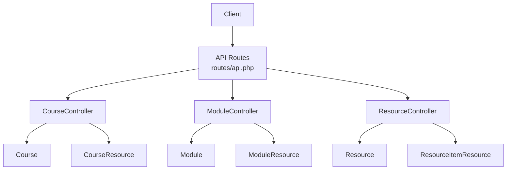
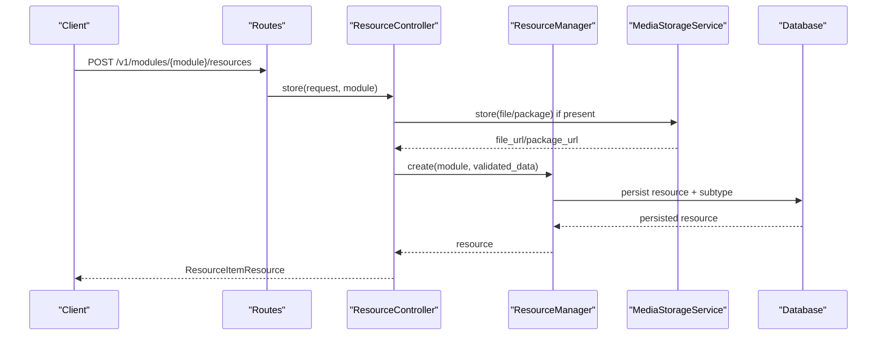
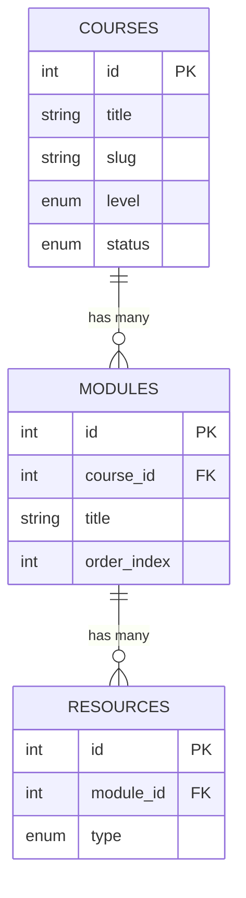
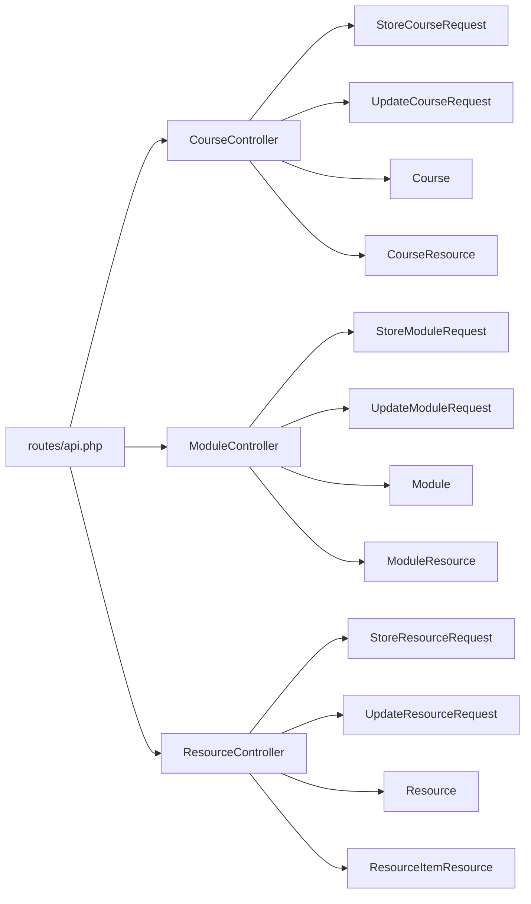

# Course Management APIs

<cite>
**Referenced Files in This Document**
- [api.php](file://routes/api.php)
- [CourseController.php](file://app/Http/Controllers/Api/V1/CourseController.php)
- [ModuleController.php](file://app/Http/Controllers/Api/V1/ModuleController.php)
- [ResourceController.php](file://app/Http/Controllers/Api/V1/ResourceController.php)
- [StoreCourseRequest.php](file://app/Http/Requests/Api/V1/StoreCourseRequest.php)
- [UpdateCourseRequest.php](file://app/Http/Requests/Api/V1/UpdateCourseRequest.php)
- [StoreModuleRequest.php](file://app/Http/Requests/Api/V1/StoreModuleRequest.php)
- [UpdateModuleRequest.php](file://app/Http/Requests/Api/V1/UpdateModuleRequest.php)
- [StoreResourceRequest.php](file://app/Http/Requests/Api/V1/StoreResourceRequest.php)
- [UpdateResourceRequest.php](file://app/Http/Requests/Api/V1/UpdateResourceRequest.php)
- [Course.php](file://app/Models/Course.php)
- [Module.php](file://app/Models/Module.php)
- [Resource.php](file://app/Models/Resource.php)
- [CourseResource.php](file://app/Http/Resources/CourseResource.php)
- [ModuleResource.php](file://app/Http/Resources/ModuleResource.php)
- [ResourceItemResource.php](file://app/Http/Resources/ResourceItemResource.php)
</cite>

## Table of Contents
1. Introduction
2. Project Structure
3. Core Components
4. Architecture Overview
5. Detailed Component Analysis
6. Dependency Analysis
7. Performance Considerations
8. Troubleshooting Guide
9. Conclusion

## Introduction
This document provides API documentation for course management endpoints that enable CRUD operations on courses, modules, and resources. It explains the hierarchical relationship between courses, modules, and resources; documents request/response schemas; details file upload handling for resources; and outlines supported content types (videos, documents, SCORM packages, readings, external links, live sessions, downloadable files). It also includes example workflows for creating a course structure and managing resources.

## Project Structure
The course management functionality is implemented as RESTful endpoints under versioned routes with authentication middleware. Controllers handle requests, validate inputs via FormRequest classes, persist data through Eloquent models, and return structured JSON responses using Resource classes.

**Diagram sources**
- [api.php:49-143](file://routes/api.php#L49-L143)
- [CourseController.php:23-146](file://app/Http/Controllers/Api/V1/CourseController.php#L23-L146)
- [ModuleController.php:18-120](file://app/Http/Controllers/Api/V1/ModuleController.php#L18-L120)
- [ResourceController.php:18-85](file://app/Http/Controllers/Api/V1/ResourceController.php#L18-L85)
- [Course.php:17-179](file://app/Models/Course.php#L17-L179)
- [Module.php:15-85](file://app/Models/Module.php#L15-L85)
- [Resource.php:15-102](file://app/Models/Resource.php#L15-L102)
- [CourseResource.php:11-44](file://app/Http/Resources/CourseResource.php#L11-L44)
- [ModuleResource.php:16-71](file://app/Http/Resources/ModuleResource.php#L16-L71)
- [ResourceItemResource.php:22-98](file://app/Http/Resources/ResourceItemResource.php#L22-L98)

**Section sources**
- [api.php:49-143](file://routes/api.php#L49-L143)

## Core Components
- Courses: Create, list, retrieve, update, delete. Supports thumbnail upload or URL, instructor assignment, status/versioning, and catalog filters.
- Modules: Create, list, update, soft-delete, restore within a course. Support ordering and group targeting.
- Resources: Create, retrieve, update, delete within a module. Unified endpoint for multiple resource types with type-specific fields and optional file uploads.

Authentication and authorization:
- Public read endpoints for catalogue browsing and certificate verification.
- Authenticated write endpoints protected by Sanctum middleware and policies.

**Section sources**
- [CourseController.php:30-146](file://app/Http/Controllers/Api/V1/CourseController.php#L30-L146)
- [ModuleController.php:22-119](file://app/Http/Controllers/Api/V1/ModuleController.php#L22-L119)
- [ResourceController.php:25-84](file://app/Http/Controllers/Api/V1/ResourceController.php#L25-L84)
- [api.php:49-143](file://routes/api.php#L49-L143)

## Architecture Overview
The system follows a layered architecture:
- Routes define HTTP endpoints and apply auth/policies.
- Controllers orchestrate validation, business logic, storage, and persistence.
- Models encapsulate domain entities and relationships.
- Resources normalize response payloads.

**Diagram sources**
- [api.php:139-142](file://routes/api.php#L139-L142)
- [ResourceController.php:30-46](file://app/Http/Controllers/Api/V1/ResourceController.php#L30-L46)
- [StoreResourceRequest.php:25-63](file://app/Http/Requests/Api/V1/StoreResourceRequest.php#L25-L63)
- [ResourceItemResource.php:27-53](file://app/Http/Resources/ResourceItemResource.php#L27-L53)

## Detailed Component Analysis

### Courses API
Endpoints:
- GET /v1/courses — List courses with filtering and pagination.
- GET /v1/courses/{course} — Retrieve a single course.
- POST /v1/courses — Create a course (auth required).
- PATCH /v1/courses/{course} — Update a course (auth required).
- DELETE /v1/courses/{course} — Delete a course (auth required).

Key behaviors:
- Thumbnail can be provided as an image upload or a URL; when both are present, the uploaded file takes precedence.
- Instructor assignment via instructor_ids array.
- Versioning: updates with change_summary increment current_version and log changes; notifications are dispatched.

Request schemas:
- Create course (POST /v1/courses):
  - category_id: integer, optional, must exist in categories table.
  - title: string, required, max 200.
  - slug: string, optional, unique, alpha_dash, max 220; auto-generated from title if omitted.
  - description: string, optional.
  - level: enum, required.
  - enrolment_policy: enum, optional; defaults based on level if omitted.
  - advisory_require_attestation: boolean, optional.
  - application_questions: array of strings, optional, max 10 items, each max 300.
  - application_allow_alternative_proof: boolean, optional.
  - application_require_portfolio_url: boolean, optional.
  - thumbnail_url: string URL, optional, max 500.
  - thumbnail: image file, optional; mimes jpg,jpeg,png,webp; max 5MB.
  - prerequisites_text: string, optional.
  - price: numeric, required, min 0.
  - currency: string, optional, length 3.
  - confirmation_delay_hours: integer, optional, min 0.
  - schedule_start_date: date, optional.
  - instructor_ids: array of user IDs with role instructor, optional.

- Update course (PATCH /v1/courses/{course}):
  - Same fields as create but most are optional and “sometimes” required when present.
  - status: enum, optional when present.
  - change_summary: string, optional, max 2000; triggers versioning and notification.

Response schema (CourseResource):
- id: integer
- title: string
- slug: string
- description: string
- level: string (enum value)
- enrolment_policy: string (enum value)
- advisory_require_attestation: boolean
- application_questions: array of strings
- application_allow_alternative_proof: boolean
- application_require_portfolio_url: boolean
- sections_required: boolean
- thumbnail_url: string (absolute URL)
- prerequisites_text: string
- price: decimal
- currency: string
- status: string (enum value)
- current_version: integer
- confirmation_delay_hours: integer
- schedule_start_date: date string (ISO)
- category: object (CategoryResource)
- instructors: array of UserResource
- created_at: ISO timestamp
- updated_at: ISO timestamp

Example workflow:
- Create a course with thumbnail upload and assign instructors.
- Update the course to change status and add a change_summary to trigger versioning.

**Section sources**
- [api.php:52-75](file://routes/api.php#L52-L75)
- [CourseController.php:30-146](file://app/Http/Controllers/Api/V1/CourseController.php#L30-L146)
- [StoreCourseRequest.php:17-58](file://app/Http/Requests/Api/V1/StoreCourseRequest.php#L17-L58)
- [UpdateCourseRequest.php:17-54](file://app/Http/Requests/Api/V1/UpdateCourseRequest.php#L17-L54)
- [CourseResource.php:16-43](file://app/Http/Resources/CourseResource.php#L16-L43)
- [Course.php:22-56](file://app/Models/Course.php#L22-L56)

### Modules API
Endpoints:
- GET /v1/courses/{course}/modules — List modules in order with related items.
- GET /v1/courses/{course}/modules/trashed — List soft-deleted modules for restore.
- POST /v1/courses/{course}/modules — Create a module (auth required).
- PATCH /v1/modules/{module} — Update a module (auth required).
- DELETE /v1/modules/{module} — Soft-delete a module (auth required).
- POST /v1/modules/{module}/restore — Restore a soft-deleted module (auth required).

Key behaviors:
- Modules belong to a course and are ordered by order_index.
- Group targeting via group_ids; empty means applies to all students.
- Soft-delete support with restore capability; audit logging on delete/restore.

Request schemas:
- Create module (POST /v1/courses/{course}/modules):
  - title: string, required, max 200.
  - description: string, optional.
  - order_index: integer, optional, min 0; defaults to next available index if omitted.
  - scheduled_start_at: date, optional.
  - group_ids: array of group IDs belonging to the same course, optional.

- Update module (PATCH /v1/modules/{module}):
  - Same fields as create but optional when present.

Response schema (ModuleResource):
- id: integer
- course_id: integer
- title: string
- description: string
- order_index: integer
- scheduled_start_at: ISO timestamp or null
- deleted_at: ISO timestamp or null
- group_ids: array of integers
- items: array of mixed item objects (resources, assignments, evaluations) sorted by order_index
- status: string (student progress status, e.g., locked/completed)

Example workflow:
- Create modules for a course with ordering and group targeting.
- Soft-delete a module and later restore it; check trashed list before restoring.

**Section sources**
- [api.php:125-130](file://routes/api.php#L125-L130)
- [ModuleController.php:22-119](file://app/Http/Controllers/Api/V1/ModuleController.php#L22-L119)
- [StoreModuleRequest.php:13-31](file://app/Http/Requests/Api/V1/StoreModuleRequest.php#L13-L31)
- [UpdateModuleRequest.php:12-30](file://app/Http/Requests/Api/V1/UpdateModuleRequest.php#L12-L30)
- [ModuleResource.php:21-71](file://app/Http/Resources/ModuleResource.php#L21-L71)
- [Module.php:22-85](file://app/Models/Module.php#L22-L85)

### Resources API
Endpoints:
- GET /v1/resources/{resource} — Retrieve a resource with flattened details.
- POST /v1/modules/{module}/resources — Create a resource (auth required).
- PATCH /v1/resources/{resource} — Update a resource (auth required).
- DELETE /v1/resources/{resource} — Delete a resource (auth required).

Supported resource types and fields:
- video:
  - bunny_stream_video_id: string, required when type=video.
  - duration_seconds: integer, optional, min 0.
  - caption_url: string URL, optional, max 500.
- document:
  - file_url: string URL, required if no file uploaded.
  - file: file upload, optional; mimes pdf,doc,docx,ppt,pptx,xls,xlsx,zip,csv,txt; max 20MB.
  - file_type: enum, required when type=document; values pdf, pptx, docx.
  - file_size_kb: integer, optional, min 0.
- reading:
  - content_html: string, required when type=reading.
- external_link:
  - url: string URL, required when type=external_link.
- scorm:
  - package_url: string URL, required if no package uploaded.
  - package: zip file upload, optional; max 50MB.
  - standard: enum, required when type=scorm; values scorm_1_2, scorm_2004, xapi.
- live_session:
  - provider: enum, required when type=live_session; values zoom, google_meet.
  - meeting_url: string URL, required when type=live_session.
  - scheduled_at: date, required when type=live_session.
  - duration_minutes: integer, required when type=live_session, min 1.
- downloadable_file:
  - file_url: string URL, required if no file uploaded.
  - file: file upload, optional; same mimes and size limits as document.
  - file_size_kb: integer, optional, min 0.

Common fields for all resource types:
- type: enum, required.
- title: string, required, max 200.
- description: string, optional.
- is_required: boolean, optional.
- order_index: integer, optional, min 0.

File upload handling:
- For document/downloadable_file: either file_url or file may be provided; file takes precedence when both are present.
- For scorm: either package_url or package may be provided; package takes precedence when both are present.
- On update, existing files are replaced and old files are deleted where applicable.

Response schema (ResourceItemResource):
- id: integer
- module_id: integer
- type: string (enum value)
- title: string
- description: string
- is_required: boolean
- order_index: integer
- is_complete: boolean|null (true for students when complete per Progress Engine)
- details: object containing type-specific fields:
  - video: { bunny_stream_video_id, duration_seconds, caption_url }
  - document: { file_url, file_type, file_size_kb }
  - reading: { content_html }
  - external_link: { url }
  - scorm: { package_url, standard }
  - live_session: { provider, meeting_url, scheduled_at, duration_minutes }
  - downloadable_file: { file_url, file_size_kb }

Example workflow:
- Create a module, then add a video resource with captions, a document resource with file upload, and a SCORM package with standard selection.
- Update a resource to replace its file or package while preserving metadata.

**Section sources**
- [api.php:139-142](file://routes/api.php#L139-L142)
- [ResourceController.php:25-84](file://app/Http/Controllers/Api/V1/ResourceController.php#L25-L84)
- [StoreResourceRequest.php:25-63](file://app/Http/Requests/Api/V1/StoreResourceRequest.php#L25-L63)
- [UpdateResourceRequest.php:21-54](file://app/Http/Requests/Api/V1/UpdateResourceRequest.php#L21-L54)
- [ResourceItemResource.php:27-98](file://app/Http/Resources/ResourceItemResource.php#L27-L98)
- [Resource.php:20-102](file://app/Models/Resource.php#L20-L102)

### Hierarchical Relationship
Courses contain modules; modules contain resources (and other items like assignments and evaluations). The ModuleResource aggregates these into a unified items list for UI consumption.

**Diagram sources**
- [Course.php:115-121](file://app/Models/Course.php#L115-L121)
- [Module.php:39-68](file://app/Models/Module.php#L39-L68)
- [Resource.php:31-93](file://app/Models/Resource.php#L31-L93)

## Dependency Analysis
- Route definitions bind HTTP methods to controller actions and enforce authentication.
- Controllers depend on:
  - Request validators for input rules and authorization checks.
  - Models for persistence and relationships.
  - Services for media storage and content management.
  - Resources for consistent response shapes.
- Policies gate write operations at controller entry points.

**Diagram sources**
- [api.php:49-143](file://routes/api.php#L49-L143)
- [CourseController.php:23-146](file://app/Http/Controllers/Api/V1/CourseController.php#L23-L146)
- [ModuleController.php:18-120](file://app/Http/Controllers/Api/V1/ModuleController.php#L18-L120)
- [ResourceController.php:18-85](file://app/Http/Controllers/Api/V1/ResourceController.php#L18-L85)
- [StoreCourseRequest.php:17-58](file://app/Http/Requests/Api/V1/StoreCourseRequest.php#L17-L58)
- [UpdateCourseRequest.php:17-54](file://app/Http/Requests/Api/V1/UpdateCourseRequest.php#L17-L54)
- [StoreModuleRequest.php:13-31](file://app/Http/Requests/Api/V1/StoreModuleRequest.php#L13-L31)
- [UpdateModuleRequest.php:12-30](file://app/Http/Requests/Api/V1/UpdateModuleRequest.php#L12-L30)
- [StoreResourceRequest.php:25-63](file://app/Http/Requests/Api/V1/StoreResourceRequest.php#L25-L63)
- [UpdateResourceRequest.php:21-54](file://app/Http/Requests/Api/V1/UpdateResourceRequest.php#L21-L54)
- [Course.php:17-179](file://app/Models/Course.php#L17-L179)
- [Module.php:15-85](file://app/Models/Module.php#L15-L85)
- [Resource.php:15-102](file://app/Models/Resource.php#L15-L102)
- [CourseResource.php:11-44](file://app/Http/Resources/CourseResource.php#L11-L44)
- [ModuleResource.php:16-71](file://app/Http/Resources/ModuleResource.php#L16-L71)
- [ResourceItemResource.php:22-98](file://app/Http/Resources/ResourceItemResource.php#L22-L98)

**Section sources**
- [api.php:49-143](file://routes/api.php#L49-L143)

## Performance Considerations
- Use query filters for course listing to reduce payload size and server load.
- Paginate course listings to avoid large responses.
- Prefer loading only necessary relations in controllers to minimize N+1 queries.
- For resource retrieval, ensure only needed subtype relations are loaded to keep responses lean.
- File uploads should respect size limits and use efficient storage backends.

[No sources needed since this section provides general guidance]

## Troubleshooting Guide
Common issues and resolutions:
- Validation errors: Ensure required fields match the request schemas; verify enums and constraints.
- Authorization failures: Confirm user has appropriate roles and permissions; policies protect writes.
- File upload failures: Check allowed MIME types and size limits; ensure storage configuration is correct.
- Soft-delete confusion: Deleted modules remain accessible via trashed endpoint; restore to recover.
- Versioning not applied: Include change_summary in course updates to trigger version increments and notifications.

**Section sources**
- [StoreCourseRequest.php:17-58](file://app/Http/Requests/Api/V1/StoreCourseRequest.php#L17-L58)
- [UpdateCourseRequest.php:17-54](file://app/Http/Requests/Api/V1/UpdateCourseRequest.php#L17-L54)
- [StoreResourceRequest.php:25-63](file://app/Http/Requests/Api/V1/StoreResourceRequest.php#L25-L63)
- [UpdateResourceRequest.php:21-54](file://app/Http/Requests/Api/V1/UpdateResourceRequest.php#L21-L54)
- [ModuleController.php:83-119](file://app/Http/Controllers/Api/V1/ModuleController.php#L83-L119)

## Conclusion
The course management APIs provide a robust, secure, and extensible interface for building learning experiences. They support full lifecycle management of courses, modules, and diverse resource types with clear schemas, file upload capabilities, and standardized responses. Following the documented workflows ensures reliable creation and maintenance of course structures and content.

[No sources needed since this section summarizes without analyzing specific files]