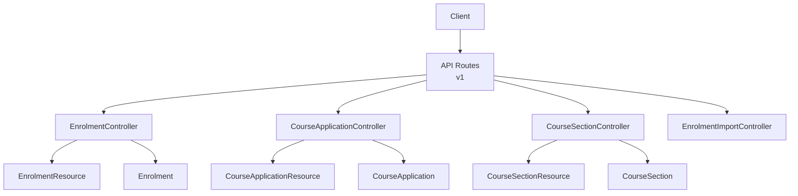
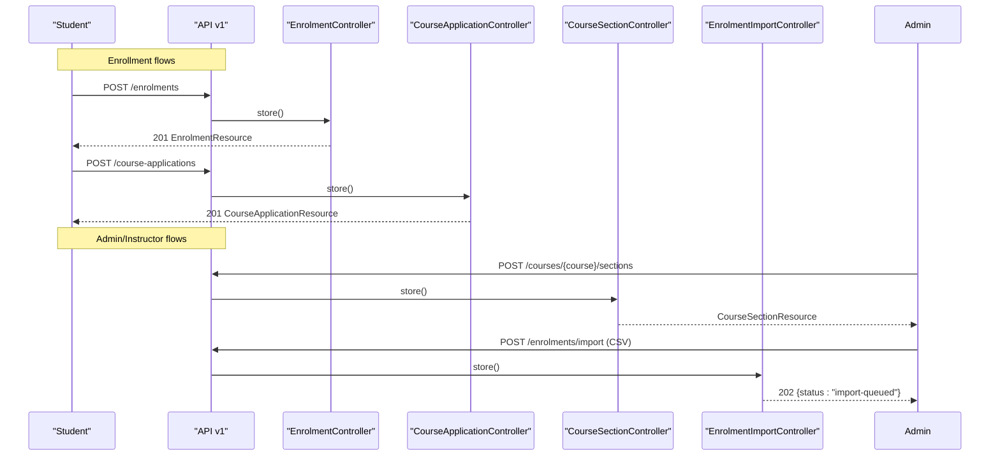
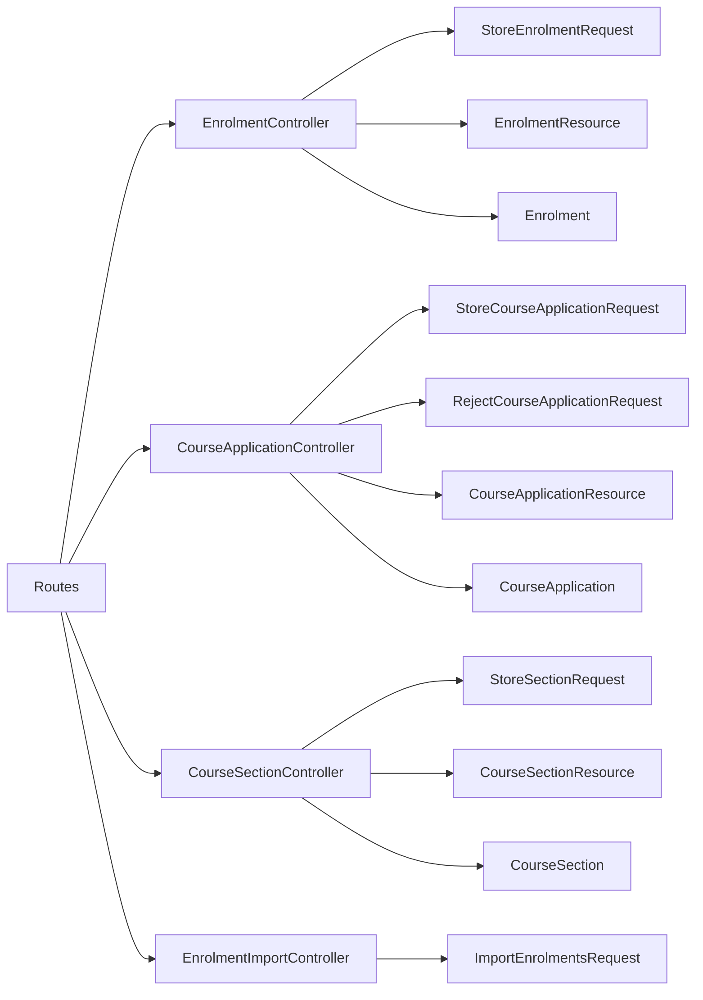

# Enrollment & Cohort APIs

<cite>
**Referenced Files in This Document**
- [routes/api.php](file://routes/api.php)
- [EnrolmentController.php](file://app/Http/Controllers/Api/V1/EnrolmentController.php)
- [CourseApplicationController.php](file://app/Http/Controllers/Api/V1/CourseApplicationController.php)
- [CourseSectionController.php](file://app/Http/Controllers/Api/V1/CourseSectionController.php)
- [EnrolmentImportController.php](file://app/Http/Controllers/Api/V1/EnrolmentImportController.php)
- [StoreEnrolmentRequest.php](file://app/Http/Requests/Api/V1/StoreEnrolmentRequest.php)
- [StoreCourseApplicationRequest.php](file://app/Http/Requests/Api/V1/StoreCourseApplicationRequest.php)
- [RejectCourseApplicationRequest.php](file://app/Http/Requests/Api/V1/RejectCourseApplicationRequest.php)
- [ImportEnrolmentsRequest.php](file://app/Http/Requests/Api/V1/ImportEnrolmentsRequest.php)
- [StoreSectionRequest.php](file://app/Http/Requests/Api/V1/StoreSectionRequest.php)
- [EnrolmentResource.php](file://app/Http/Resources/EnrolmentResource.php)
- [CourseApplicationResource.php](file://app/Http/Resources/CourseApplicationResource.php)
- [CourseSectionResource.php](file://app/Http/Resources/CourseSectionResource.php)
- [Enrolment.php](file://app/Models/Enrolment.php)
- [CourseApplication.php](file://app/Models/CourseApplication.php)
</cite>

## Table of Contents
1. Introduction
2. Project Structure
3. Core Components
4. Architecture Overview
5. Detailed Component Analysis
6. Dependency Analysis
7. Performance Considerations
8. Troubleshooting Guide
9. Conclusion

## Introduction
This document provides API documentation for enrollment and cohort management endpoints. It covers:
- Enrollment workflows: self-enrollment, application-based enrollment, approval/rejection, waitlist handling, and bulk import via CSV.
- Course section (cohort) management: creation, listing, updates, deletion, and member/status tracking.
- Request/response schemas for enrollment operations, application processing, and cohort administration.

Authentication is required for most write endpoints; some read endpoints are public or student-scoped as noted per endpoint.

## Project Structure
The enrollment and cohort features are implemented through:
- Controllers that expose REST endpoints under the v1 API namespace.
- Request classes that validate inputs and enforce authorization rules.
- Resource classes that shape JSON responses.
- Models representing core entities (enrollments, applications, sections).
- Route definitions that wire controllers to HTTP methods and paths.

**Diagram sources**
- [routes/api.php:49-104](file://routes/api.php#L49-L104)
- [EnrolmentController.php:20-75](file://app/Http/Controllers/Api/V1/EnrolmentController.php#L20-L75)
- [CourseApplicationController.php:19-103](file://app/Http/Controllers/Api/V1/CourseApplicationController.php#L19-L103)
- [CourseSectionController.php:17-147](file://app/Http/Controllers/Api/V1/CourseSectionController.php#L17-L147)
- [EnrolmentImportController.php:16-30](file://app/Http/Controllers/Api/V1/EnrolmentImportController.php#L16-L30)
- [EnrolmentResource.php:10-28](file://app/Http/Resources/EnrolmentResource.php#L10-L28)
- [CourseApplicationResource.php:14-42](file://app/Http/Resources/CourseApplicationResource.php#L14-L42)
- [CourseSectionResource.php:15-61](file://app/Http/Resources/CourseSectionResource.php#L15-L61)
- [Enrolment.php:15-75](file://app/Models/Enrolment.php#L15-L75)
- [CourseApplication.php:14-88](file://app/Models/CourseApplication.php#L14-L88)

**Section sources**
- [routes/api.php:49-104](file://routes/api.php#L49-L104)

## Core Components
- Enrollment endpoints: list, create (self-enroll), withdraw.
- Application endpoints: list review queue, list current student’s applications, submit application, approve, reject, dismiss.
- Section (cohort) endpoints: public listing, course-scoped listing, create, show, update, delete.
- Bulk import endpoint: accept CSV file and enqueue background job.

Key request validations:
- Self-enrollment requires a published course and optional section.
- Applications require student role and optional answers/portfolio fields.
- Rejection supports recommended courses and reason text.
- Import accepts CSV/TSV with size limits.
- Section creation validates dates, capacity, status enum, and instructor assignment.

Response shaping:
- EnrolmentResource returns enrollment identity, status/source enums, timestamps, and related course/order when loaded.
- CourseApplicationResource returns application identity, status, student/course/section references, answers, reviewer info, and recommended courses.
- CourseSectionResource returns cohort metadata, counts, availability flags, and instructor/course details when loaded.

**Section sources**
- [EnrolmentController.php:24-75](file://app/Http/Controllers/Api/V1/EnrolmentController.php#L24-L75)
- [CourseApplicationController.php:23-103](file://app/Http/Controllers/Api/V1/CourseApplicationController.php#L23-L103)
- [CourseSectionController.php:23-147](file://app/Http/Controllers/Api/V1/CourseSectionController.php#L23-L147)
- [EnrolmentImportController.php:16-30](file://app/Http/Controllers/Api/V1/EnrolmentImportController.php#L16-L30)
- [StoreEnrolmentRequest.php:11-29](file://app/Http/Requests/Api/V1/StoreEnrolmentRequest.php#L11-L29)
- [StoreCourseApplicationRequest.php:11-29](file://app/Http/Requests/Api/V1/StoreCourseApplicationRequest.php#L11-L29)
- [RejectCourseApplicationRequest.php:10-25](file://app/Http/Requests/Api/V1/RejectCourseApplicationRequest.php#L10-L25)
- [ImportEnrolmentsRequest.php:11-25](file://app/Http/Requests/Api/V1/ImportEnrolmentsRequest.php#L11-L25)
- [StoreSectionRequest.php:12-43](file://app/Http/Requests/Api/V1/StoreSectionRequest.php#L12-L43)
- [EnrolmentResource.php:10-28](file://app/Http/Resources/EnrolmentResource.php#L10-L28)
- [CourseApplicationResource.php:14-42](file://app/Http/Resources/CourseApplicationResource.php#L14-L42)
- [CourseSectionResource.php:15-61](file://app/Http/Resources/CourseSectionResource.php#L15-L61)

## Architecture Overview
High-level flow:
- Students self-enroll into non-application courses directly.
- For application-required courses, students submit applications which admins/instructors review and approve/reject/dismiss.
- Sections (cohorts) are managed by admins/instructors and influence where enrollments/applications are targeted.
- Bulk imports allow administrators to enroll many users at once via CSV, processed asynchronously.

**Diagram sources**
- [routes/api.php:94-104](file://routes/api.php#L94-L104)
- [EnrolmentController.php:43-61](file://app/Http/Controllers/Api/V1/EnrolmentController.php#L43-L61)
- [CourseApplicationController.php:56-72](file://app/Http/Controllers/Api/V1/CourseApplicationController.php#L56-L72)
- [CourseSectionController.php:87-98](file://app/Http/Controllers/Api/V1/CourseSectionController.php#L87-L98)
- [EnrolmentImportController.php:18-28](file://app/Http/Controllers/Api/V1/EnrolmentImportController.php#L18-L28)

## Detailed Component Analysis

### Enrollment Endpoints
- GET /v1/enrolments
  - Purpose: List authenticated student’s enrollments.
  - Auth: Required.
  - Response: Paginated collection of EnrolmentResource.
- POST /v1/enrolments
  - Purpose: Self-enroll into a published course (not application-policy). Optional section_id targets a cohort.
  - Auth: Required.
  - Request: course_id (required, published), section_id (optional, exists).
  - Response: 201 EnrolmentResource.
- POST /v1/enrolments/{enrolment}/withdraw
  - Purpose: Withdraw an enrollment (student or admin).
  - Auth: Required; policy-gated.
  - Response: Updated EnrolmentResource.

Request schema (POST /v1/enrolments)
- course_id: integer, required, must exist and be published.
- section_id: integer, optional, must exist in course_sections.

Response schema (EnrolmentResource)
- id: integer
- status: string (enum value)
- source: string (enum value)
- course: object (when loaded)
- applied_at: ISO 8601 datetime
- confirmation_email_due_at: ISO 8601 datetime
- confirmation_email_sent_at: ISO 8601 datetime or null
- order: object (when loaded)

Notes
- If the course uses an application policy, direct enrollment is rejected; use application workflow instead.
- Waitlisted behavior is modeled in enrollment status and section capacity calculations.

**Section sources**
- [routes/api.php:94-97](file://routes/api.php#L94-L97)
- [EnrolmentController.php:24-75](file://app/Http/Controllers/Api/V1/EnrolmentController.php#L24-L75)
- [StoreEnrolmentRequest.php:11-29](file://app/Http/Requests/Api/V1/StoreEnrolmentRequest.php#L11-L29)
- [EnrolmentResource.php:10-28](file://app/Http/Resources/EnrolmentResource.php#L10-L28)
- [Enrolment.php:15-75](file://app/Models/Enrolment.php#L15-L75)

### Course Application Endpoints
- GET /v1/course-applications
  - Purpose: Review queue (admin sees all; instructor sees their courses). Optional status filter.
  - Auth: Required; policy-gated.
  - Response: Collection of CourseApplicationResource.
- GET /v1/course-applications/me
  - Purpose: Current student’s visible applications.
  - Auth: Required.
  - Response: Collection of CourseApplicationResource.
- POST /v1/course-applications
  - Purpose: Submit application for an application-policy course. Optional section_id.
  - Auth: Required; profile completion middleware may apply.
  - Request: course_id (required, published), section_id (optional), answers (array of strings), portfolio_url (optional URL), alternative_proof_text (optional string).
  - Response: 201 CourseApplicationResource.
- POST /v1/course-applications/{application}/approve
  - Purpose: Approve an application.
  - Auth: Required; policy-gated.
  - Response: CourseApplicationResource.
- POST /v1/course-applications/{application}/reject
  - Purpose: Reject an application with optional recommended courses and reason.
  - Auth: Required; policy-gated.
  - Request: recommended_course_ids (array of existing course ids), rejection_reason (string up to limit).
  - Response: CourseApplicationResource.
- POST /v1/course-applications/{application}/dismiss
  - Purpose: Dismiss an application (e.g., expired or withdrawn).
  - Auth: Required; policy-gated.
  - Response: CourseApplicationResource.

Request schema (POST /v1/course-applications)
- course_id: integer, required, published course.
- section_id: integer, optional, valid section.
- answers: array of strings, each max length.
- portfolio_url: string, optional URL.
- alternative_proof_text: string, optional.

Request schema (POST /v1/course-applications/{application}/reject)
- recommended_course_ids: array of integers, each must exist.
- rejection_reason: string, optional, max length.

Response schema (CourseApplicationResource)
- id: integer
- status: string (enum value)
- student: object (when loaded)
- course: object (when loaded)
- section: object with id, name, status (when loaded)
- answers: array of strings
- portfolio_url: string or null
- alternative_proof_text: string or null
- rejection_reason: string or null
- dismissed_at: ISO 8601 datetime or null
- recommended_courses: collection of CourseResource
- reviewer: object with id, name, role (when loaded)
- applied_at: ISO 8601 datetime
- reviewed_at: ISO 8601 datetime or null

Workflow notes
- Application-policy courses cannot be self-enrolled; they must go through this workflow.
- Approved applications typically lead to enrollment creation downstream.
- Rejection can include recommended courses to guide students.

**Section sources**
- [routes/api.php:99-104](file://routes/api.php#L99-L104)
- [CourseApplicationController.php:23-103](file://app/Http/Controllers/Api/V1/CourseApplicationController.php#L23-L103)
- [StoreCourseApplicationRequest.php:11-29](file://app/Http/Requests/Api/V1/StoreCourseApplicationRequest.php#L11-L29)
- [RejectCourseApplicationRequest.php:10-25](file://app/Http/Requests/Api/V1/RejectCourseApplicationRequest.php#L10-L25)
- [CourseApplicationResource.php:14-42](file://app/Http/Resources/CourseApplicationResource.php#L14-L42)
- [CourseApplication.php:14-88](file://app/Models/CourseApplication.php#L14-L88)

### Course Section (Cohort) Endpoints
- GET /v1/sections/public
  - Purpose: Public listing of open/in-progress sections across courses.
  - Auth: Not required.
  - Response: Collection of CourseSectionResource.
- GET /v1/courses/{course}/sections
  - Purpose: List sections for a specific course. Public callers get limited fields; privileged callers get analytics-related counts.
  - Auth: Optional; if authenticated, privilege determines extra data.
  - Response: Collection of CourseSectionResource.
- POST /v1/courses/{course}/sections
  - Purpose: Create a new section for a course.
  - Auth: Required; policy-gated.
  - Request: name, start_date, end_date (after start), application_deadline (before start), capacity (min 1), status (enum), primary_instructor_id (optional, exists).
  - Response: CourseSectionResource.
- GET /v1/sections/{section}
  - Purpose: Show a single section with details.
  - Auth: Required; policy-gated.
  - Response: CourseSectionResource.
- PATCH /v1/sections/{section}
  - Purpose: Update a section.
  - Auth: Required; policy-gated.
  - Request: same fields as create (subset allowed).
  - Response: CourseSectionResource.
- DELETE /v1/sections/{section}
  - Purpose: Delete a section (only if no enrollments/applications).
  - Auth: Required; policy-gated.
  - Response: 204 No Content.

Request schema (POST/PATCH /v1/courses/{course}/sections)
- name: string, required, max length.
- start_date: date, required.
- end_date: date, required, after start_date.
- application_deadline: date, optional, before start_date.
- capacity: integer, optional, min 1.
- status: enum value.
- primary_instructor_id: integer, optional, must exist.

Response schema (CourseSectionResource)
- id: integer
- course_id: integer
- name: string
- start_date: date string or null
- end_date: date string or null
- application_deadline: date string or null
- capacity: integer or null
- seats_taken: integer or null
- enrolled_count: integer or null
- seats_available: integer or null
- status: string (enum value)
- primary_instructor_id: integer or null
- primary_instructor: object (when loaded)
- course: object (when loaded)
- waitlisted_count: integer (when relation loaded)
- applications_pending_count: integer (when relation loaded)
- is_full: boolean
- is_accepting_applications: boolean
- created_at: ISO 8601 datetime
- updated_at: ISO 8601 datetime

Member management and status tracking
- Member counts and availability are derived from enrollments and applications associated with the section.
- Status flags indicate whether the section is full and whether it is accepting applications based on deadlines and capacity.

**Section sources**
- [routes/api.php:57-82](file://routes/api.php#L57-L82)
- [CourseSectionController.php:23-147](file://app/Http/Controllers/Api/V1/CourseSectionController.php#L23-L147)
- [StoreSectionRequest.php:12-43](file://app/Http/Requests/Api/V1/StoreSectionRequest.php#L12-L43)
- [CourseSectionResource.php:15-61](file://app/Http/Resources/CourseSectionResource.php#L15-L61)

### Bulk Enrollment Import
- POST /v1/enrolments/import
  - Purpose: Upload a CSV/TSV file to import enrollments for a course.
  - Auth: Required; policy-gated.
  - Request: course_id (required), file (csv/txt, max size).
  - Response: 202 Accepted with {status: "import-queued"}.
  - Behavior: File stored and queued for background processing.

Request schema (POST /v1/enrolments/import)
- course_id: integer, required, must exist.
- file: file, required, csv or txt, max size.

Response schema
- status: string constant indicating queued import.

Notes
- Large imports do not block the request; processing occurs asynchronously.

**Section sources**
- [routes/api.php:96-96](file://routes/api.php#L96-L96)
- [EnrolmentImportController.php:16-30](file://app/Http/Controllers/Api/V1/EnrolmentImportController.php#L16-L30)
- [ImportEnrolmentsRequest.php:11-25](file://app/Http/Requests/Api/V1/ImportEnrolmentsRequest.php#L11-L25)

## Dependency Analysis
- Controllers depend on request validators for input validation and authorization checks.
- Controllers return resources that serialize models into consistent JSON shapes.
- Models define relationships used by resources and services (e.g., enrollments belong to courses and optionally sections).
- Routes map HTTP verbs and paths to controller actions.

**Diagram sources**
- [routes/api.php:94-104](file://routes/api.php#L94-L104)
- [StoreEnrolmentRequest.php:11-29](file://app/Http/Requests/Api/V1/StoreEnrolmentRequest.php#L11-L29)
- [StoreCourseApplicationRequest.php:11-29](file://app/Http/Requests/Api/V1/StoreCourseApplicationRequest.php#L11-L29)
- [RejectCourseApplicationRequest.php:10-25](file://app/Http/Requests/Api/V1/RejectCourseApplicationRequest.php#L10-L25)
- [ImportEnrolmentsRequest.php:11-25](file://app/Http/Requests/Api/V1/ImportEnrolmentsRequest.php#L11-L25)
- [StoreSectionRequest.php:12-43](file://app/Http/Requests/Api/V1/StoreSectionRequest.php#L12-L43)
- [EnrolmentController.php:20-75](file://app/Http/Controllers/Api/V1/EnrolmentController.php#L20-L75)
- [CourseApplicationController.php:19-103](file://app/Http/Controllers/Api/V1/CourseApplicationController.php#L19-L103)
- [CourseSectionController.php:17-147](file://app/Http/Controllers/Api/V1/CourseSectionController.php#L17-L147)
- [EnrolmentImportController.php:16-30](file://app/Http/Controllers/Api/V1/EnrolmentImportController.php#L16-L30)
- [EnrolmentResource.php:10-28](file://app/Http/Resources/EnrolmentResource.php#L10-L28)
- [CourseApplicationResource.php:14-42](file://app/Http/Resources/CourseApplicationResource.php#L14-L42)
- [CourseSectionResource.php:15-61](file://app/Http/Resources/CourseSectionResource.php#L15-L61)
- [Enrolment.php:15-75](file://app/Models/Enrolment.php#L15-L75)
- [CourseApplication.php:14-88](file://app/Models/CourseApplication.php#L14-L88)

**Section sources**
- [routes/api.php:94-104](file://routes/api.php#L94-L104)

## Performance Considerations
- Use pagination for large lists (e.g., enrollments index).
- Prefer server-side filtering and eager loading to avoid N+1 queries when returning related data.
- Bulk imports are queued to prevent request timeouts and keep the API responsive.
- Limit resource payloads by only including relations when needed (resources support conditional loading).

[No sources needed since this section provides general guidance]

## Troubleshooting Guide
Common issues and resolutions:
- Direct enrollment blocked for application-policy courses:
  - Cause: Course requires application workflow.
  - Resolution: Submit application via POST /v1/course-applications.
- Validation errors on requests:
  - Ensure course_id refers to a published course for enrollment/application submissions.
  - Dates must satisfy constraints (end_date after start_date, application_deadline before start_date).
  - Capacity must be at least 1 when provided.
- Authorization failures:
  - Ensure the user has appropriate role/policy permissions for admin/instructor endpoints.
- Bulk import not immediately reflected:
  - Imports are queued; check background job processing and logs for completion status.

**Section sources**
- [StoreEnrolmentRequest.php:11-29](file://app/Http/Requests/Api/V1/StoreEnrolmentRequest.php#L11-L29)
- [StoreCourseApplicationRequest.php:11-29](file://app/Http/Requests/Api/V1/StoreCourseApplicationRequest.php#L11-L29)
- [StoreSectionRequest.php:12-43](file://app/Http/Requests/Api/V1/StoreSectionRequest.php#L12-L43)
- [EnrolmentImportController.php:16-30](file://app/Http/Controllers/Api/V1/EnrolmentImportController.php#L16-L30)

## Conclusion
The enrollment and cohort APIs provide a comprehensive set of endpoints for managing student enrollments, application workflows, and cohort sections. They enforce clear policies for access control, validate inputs rigorously, and deliver consistent response schemas. The design separates concerns between routing, controllers, request validation, business logic (via services/jobs), and response serialization, enabling maintainable and scalable operations for both students and administrators.

[No sources needed since this section summarizes without analyzing specific files]