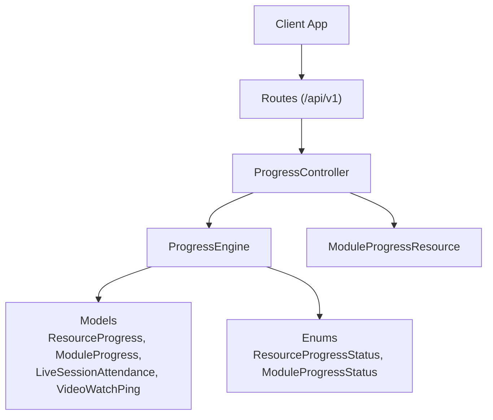
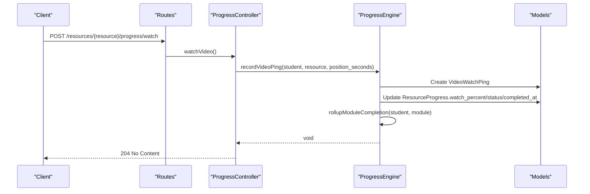
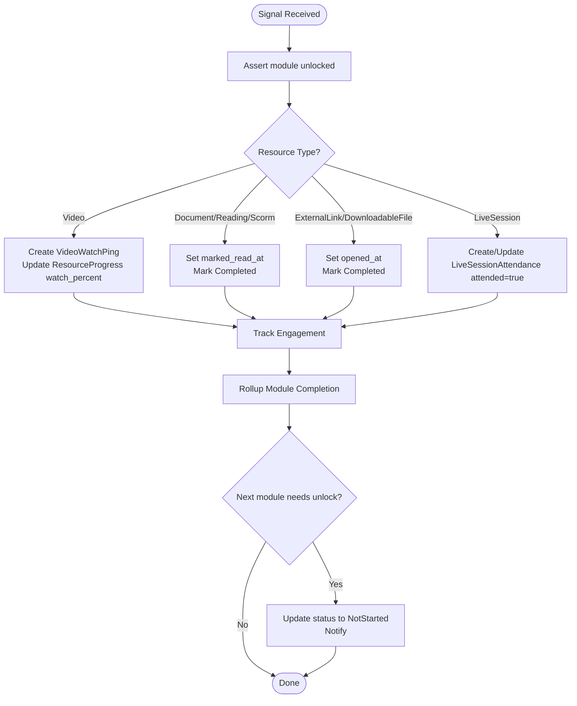
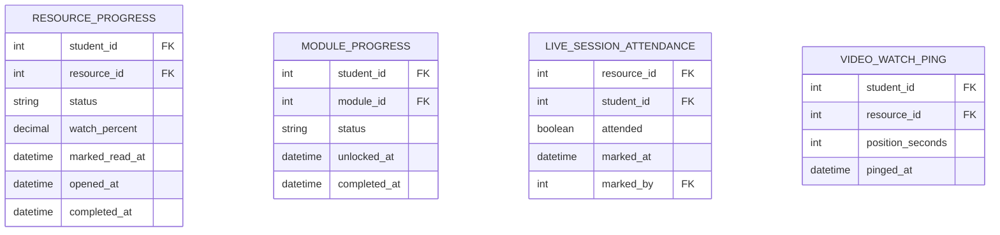
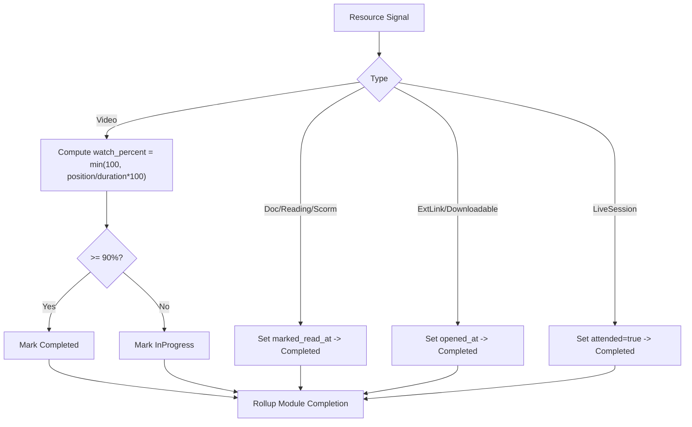
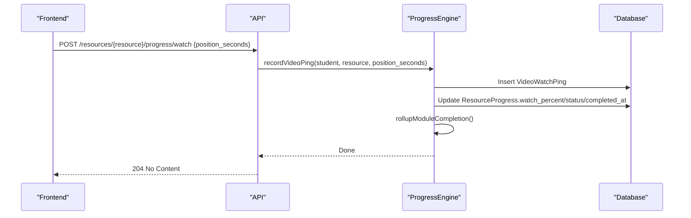
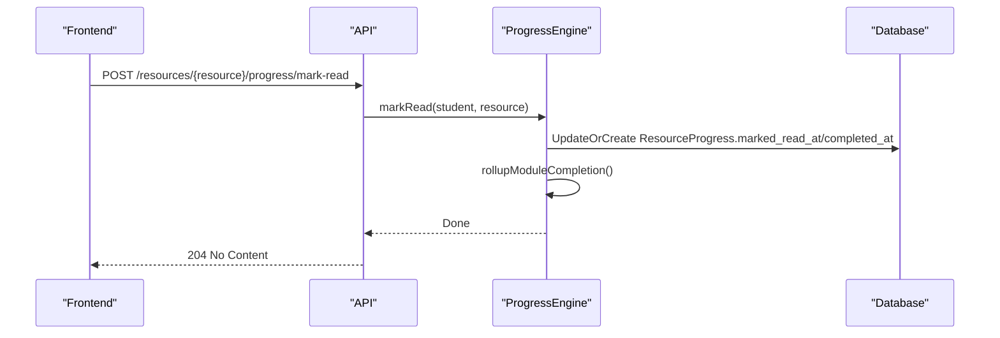
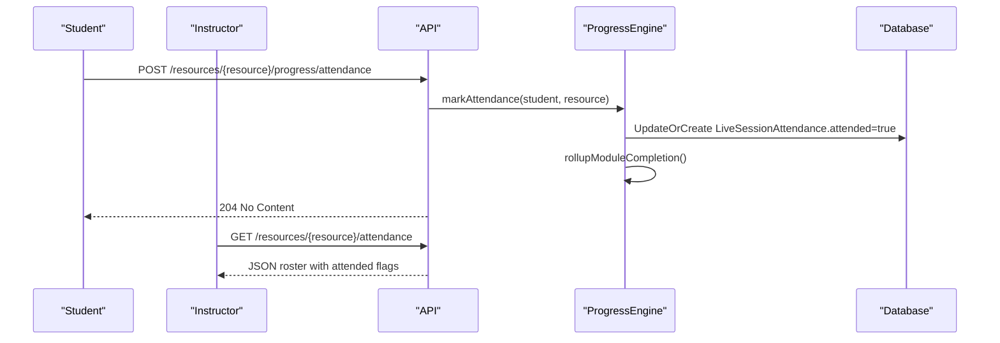
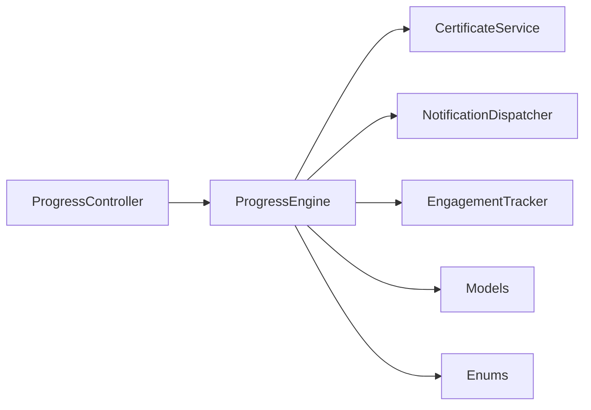

# Progress Tracking APIs

<cite>
**Referenced Files in This Document**
- [ProgressController.php](file://app/Http/Controllers/Api/V1/ProgressController.php)
- [ProgressEngine.php](file://app/Services/Progress/ProgressEngine.php)
- [api.php](file://routes/api.php)
- [ModuleProgressResource.php](file://app/Http/Resources/ModuleProgressResource.php)
- [ResourceProgress.php](file://app/Models/ResourceProgress.php)
- [ModuleProgress.php](file://app/Models/ModuleProgress.php)
- [LiveSessionAttendance.php](file://app/Models/LiveSessionAttendance.php)
- [VideoWatchPing.php](file://app/Models/VideoWatchPing.php)
- [RecordVideoProgressRequest.php](file://app/Http/Requests/Api/V1/RecordVideoProgressRequest.php)
- [ResourceProgressStatus.php](file://app/Enums/ResourceProgressStatus.php)
- [ModuleProgressStatus.php](file://app/Enums/ModuleProgressStatus.php)
- [CompletionTest.php](file://tests/Feature/Progress/CompletionTest.php)
- [ProgressDashboardTest.php](file://tests/Feature/Progress/ProgressDashboardTest.php)
- [AttendanceRosterTest.php](file://tests/Feature/Progress/AttendanceRosterTest.php)
</cite>

## Table of Contents
1. [Introduction](#introduction)
2. [Project Structure](#project-structure)
3. [Core Components](#core-components)
4. [Architecture Overview](#architecture-overview)
5. [Detailed Component Analysis](#detailed-component-analysis)
6. [Dependency Analysis](#dependency-analysis)
7. [Performance Considerations](#performance-considerations)
8. [Troubleshooting Guide](#troubleshooting-guide)
9. [Conclusion](#conclusion)
10. [Appendices](#appendices)

## Introduction
This document provides API documentation for progress tracking endpoints that record and report student learning progress across different resource types (video, reading/document, external link/downloadable file, live session). It also documents the progress engine architecture, how completion is calculated per resource type, and how module-level completion and unlocking work. Endpoints include:
- Progress dashboard for the authenticated student
- Course-specific progress overview
- Resource progress recording (watch video, mark as read, mark opened, mark attendance)
- Attendance roster for live sessions

The system enforces module unlocking rules based on schedule and prerequisite completion, and it rolls up resource-level signals into module completion and course certificates when applicable.

## Project Structure
Progress tracking spans controllers, services, models, enums, requests, resources, and routes:
- Routes define public and authenticated endpoints under /api/v1
- The controller handles HTTP requests and delegates business logic to the Progress Engine
- The Progress Engine computes completion/unlock state and persists progress records
- Models persist progress data and attendance
- Enums standardize status values
- Resources normalize responses
- Requests validate inputs

**Diagram sources**
- [api.php:146-153](file://routes/api.php#L146-L153)
- [ProgressController.php:32-182](file://app/Http/Controllers/Api/V1/ProgressController.php#L32-L182)
- [ProgressEngine.php:33-287](file://app/Services/Progress/ProgressEngine.php#L33-L287)
- [ModuleProgressResource.php:10-26](file://app/Http/Resources/ModuleProgressResource.php#L10-L26)
- [ResourceProgress.php:11-48](file://app/Models/ResourceProgress.php#L11-L48)
- [ModuleProgress.php:11-44](file://app/Models/ModuleProgress.php#L11-L44)
- [LiveSessionAttendance.php:12-57](file://app/Models/LiveSessionAttendance.php#L12-L57)
- [VideoWatchPing.php:10-35](file://app/Models/VideoWatchPing.php#L10-L35)
- [ResourceProgressStatus.php:7-12](file://app/Enums/ResourceProgressStatus.php#L7-L12)
- [ModuleProgressStatus.php:7-13](file://app/Enums/ModuleProgressStatus.php#L7-L13)

**Section sources**
- [api.php:146-153](file://routes/api.php#L146-L153)
- [ProgressController.php:32-182](file://app/Http/Controllers/Api/V1/ProgressController.php#L32-L182)
- [ProgressEngine.php:33-287](file://app/Services/Progress/ProgressEngine.php#L33-L287)

## Core Components
- ProgressController: Exposes REST endpoints for progress recording and dashboards; delegates all computation to ProgressEngine.
- ProgressEngine: Central authority for unlock and completion logic; updates ResourceProgress, ModuleProgress, LiveSessionAttendance, and VideoWatchPing; triggers rollups and notifications.
- Models: Persist progress states and attendance events.
- Enums: Standardize statuses for modules and resources.
- Resources: Normalize module progress responses.
- Requests: Validate input payloads.

Key responsibilities:
- Record video watch pings and compute watch percentage
- Mark readings and opened items complete
- Record live session attendance
- Evaluate module unlocks based on schedule and prerequisites
- Roll up required item completion to module completion
- Issue certificates upon final module completion

**Section sources**
- [ProgressController.php:32-182](file://app/Http/Controllers/Api/V1/ProgressController.php#L32-L182)
- [ProgressEngine.php:33-287](file://app/Services/Progress/ProgressEngine.php#L33-L287)
- [ResourceProgress.php:11-48](file://app/Models/ResourceProgress.php#L11-L48)
- [ModuleProgress.php:11-44](file://app/Models/ModuleProgress.php#L11-L44)
- [LiveSessionAttendance.php:12-57](file://app/Models/LiveSessionAttendance.php#L12-L57)
- [VideoWatchPing.php:10-35](file://app/Models/VideoWatchPing.php#L10-L35)
- [ModuleProgressResource.php:10-26](file://app/Http/Resources/ModuleProgressResource.php#L10-L26)
- [RecordVideoProgressRequest.php:9-22](file://app/Http/Requests/Api/V1/RecordVideoProgressRequest.php#L9-L22)
- [ResourceProgressStatus.php:7-12](file://app/Enums/ResourceProgressStatus.php#L7-L12)
- [ModuleProgressStatus.php:7-13](file://app/Enums/ModuleProgressStatus.php#L7-L13)

## Architecture Overview
The progress system follows a clear separation of concerns:
- Controllers handle HTTP I/O and authorization
- Services encapsulate domain logic (unlocking, completion, rollup)
- Models store state
- Enums enforce consistent status values
- Resources shape API responses

**Diagram sources**
- [api.php:149](file://routes/api.php#L149)
- [ProgressController.php:123-128](file://app/Http/Controllers/Api/V1/ProgressController.php#L123-L128)
- [ProgressEngine.php:218-244](file://app/Services/Progress/ProgressEngine.php#L218-L244)
- [VideoWatchPing.php:10-35](file://app/Models/VideoWatchPing.php#L10-L35)
- [ResourceProgress.php:11-48](file://app/Models/ResourceProgress.php#L11-L48)

## Detailed Component Analysis

### API Endpoints
All progress endpoints are under /api/v1 and require authentication unless otherwise noted.

- GET /me/progress
  - Purpose: Student dashboard showing each confirmed enrolment with course status, percent complete, modules, and certificate if issued.
  - Response fields: course (id, title), status (not_started, in_progress, completed), percent_complete, modules (array of module progress), certificate (optional).
  - Notes: Uses applicable modules to compute percent complete and status.

- GET /courses/{course}/progress
  - Purpose: Per-course module progress list for the authenticated student after evaluating unlocks.
  - Response: Array of module progress entries sorted by order_index.

- POST /resources/{resource}/progress/watch
  - Purpose: Record a video watch ping at a given position in seconds.
  - Request body: position_seconds (integer, >= 0).
  - Behavior: Creates a VideoWatchPing, updates ResourceProgress watch_percent and status, marks completion at 90% or more, tracks engagement, and rolls up module completion.

- POST /resources/{resource}/progress/mark-read
  - Purpose: Mark a document/reading/scorm resource as read and complete.
  - Behavior: Updates ResourceProgress marked_read_at and completed_at, tracks engagement, and rolls up module completion.

- POST /resources/{resource}/progress/mark-opened
  - Purpose: Mark an external link or downloadable file as opened and complete.
  - Behavior: Updates ResourceProgress opened_at and completed_at, tracks engagement, and rolls up module completion.

- POST /resources/{resource}/progress/attendance
  - Purpose: Record attendance for a live session resource.
  - Behavior: Creates/updates LiveSessionAttendance attended=true, tracks engagement, and rolls up module completion.

- GET /resources/{resource}/attendance
  - Purpose: Admin/instructor-only attendance roster for a live session resource.
  - Authorization: Requires policy check; only valid for live_session resources.
  - Response: Array of students with attended flag and marked_at timestamp.

Response shapes:
- Module progress entry includes module_id, module_title, order_index, status, unlocked_at, completed_at.
- Dashboard rows include course info, status, percent_complete, modules, and optional certificate details.

Error handling:
- Locked modules block progress recording (403).
- Invalid attendance roster target returns 422 if not a live session.
- Validation errors for request bodies return standard validation responses.

**Section sources**
- [api.php:146-153](file://routes/api.php#L146-L153)
- [ProgressController.php:44-181](file://app/Http/Controllers/Api/V1/ProgressController.php#L44-L181)
- [RecordVideoProgressRequest.php:16-21](file://app/Http/Requests/Api/V1/RecordVideoProgressRequest.php#L16-L21)
- [ModuleProgressResource.php:15-25](file://app/Http/Resources/ModuleProgressResource.php#L15-L25)

### Progress Engine Architecture
The ProgressEngine centralizes all progress-related business logic:
- evaluateCourseUnlocks: Ensures modules unlock based on schedule and previous module completion; supports section-based offsets.
- applicableModules: Filters modules visible to the student (group membership).
- rollupModuleCompletion: Marks module completed when all required items are done; triggers next module unlock and certificate issuance for final module.
- isModuleItemComplete: Determines completion for resource, assignment, or evaluation items.
- isResourceComplete: Defines per-resource-type completion thresholds:
  - Video: watch_percent >= 90%
  - Document/Reading/Scorm: marked_read_at present
  - ExternalLink/DownloadableFile: opened_at present
  - LiveSession: attended=true in attendance table
- assertModuleUnlocked: Prevents progress recording on locked modules.
- Recording methods:
  - recordVideoPing: Persists ping, updates watch_percent, sets completion at threshold, tracks engagement, rolls up.
  - markRead/markOpened: Sets timestamps and completion, tracks engagement, rolls up.
  - markAttendance: Records attendance, tracks engagement, rolls up.

**Diagram sources**
- [ProgressEngine.php:50-151](file://app/Services/Progress/ProgressEngine.php#L50-L151)
- [ProgressEngine.php:154-205](file://app/Services/Progress/ProgressEngine.php#L154-L205)
- [ProgressEngine.php:218-286](file://app/Services/Progress/ProgressEngine.php#L218-L286)

**Section sources**
- [ProgressEngine.php:50-286](file://app/Services/Progress/ProgressEngine.php#L50-L286)

### Data Models and Statuses
- ResourceProgress: Tracks per-student per-resource progress including watch_percent, marked_read_at, opened_at, completed_at, and status.
- ModuleProgress: Tracks per-student per-module status (locked, not_started, in_progress, completed) and timestamps.
- LiveSessionAttendance: Records attendance for live sessions with attended flag and marking metadata.
- VideoWatchPing: Stores granular watch events used to derive watch_percent.
- Enums:
  - ResourceProgressStatus: not_started, in_progress, completed
  - ModuleProgressStatus: locked, not_started, in_progress, completed

**Diagram sources**
- [ResourceProgress.php:11-48](file://app/Models/ResourceProgress.php#L11-L48)
- [ModuleProgress.php:11-44](file://app/Models/ModuleProgress.php#L11-L44)
- [LiveSessionAttendance.php:12-57](file://app/Models/LiveSessionAttendance.php#L12-L57)
- [VideoWatchPing.php:10-35](file://app/Models/VideoWatchPing.php#L10-L35)

**Section sources**
- [ResourceProgress.php:11-48](file://app/Models/ResourceProgress.php#L11-L48)
- [ModuleProgress.php:11-44](file://app/Models/ModuleProgress.php#L11-L44)
- [LiveSessionAttendance.php:12-57](file://app/Models/LiveSessionAttendance.php#L12-L57)
- [VideoWatchPing.php:10-35](file://app/Models/VideoWatchPing.php#L10-L35)
- [ResourceProgressStatus.php:7-12](file://app/Enums/ResourceProgressStatus.php#L7-L12)
- [ModuleProgressStatus.php:7-13](file://app/Enums/ModuleProgressStatus.php#L7-L13)

### Completion Calculations
- Video: Completion occurs when watch_percent reaches 90% or higher. Watch percent is derived from position_seconds relative to video duration.
- Documents/Readings/SCORM: Completion occurs when marked_read_at is set via mark-read.
- External Links/Downloadable Files: Completion occurs when opened_at is set via mark-opened.
- Live Sessions: Completion occurs when attended=true is recorded.
- Module completion requires all required items to be complete; optional items do not block completion.
- Final module completion triggers certificate issuance.

**Diagram sources**
- [ProgressEngine.php:180-205](file://app/Services/Progress/ProgressEngine.php#L180-L205)
- [ProgressEngine.php:218-244](file://app/Services/Progress/ProgressEngine.php#L218-L244)
- [ProgressEngine.php:246-286](file://app/Services/Progress/ProgressEngine.php#L246-L286)

**Section sources**
- [ProgressEngine.php:180-205](file://app/Services/Progress/ProgressEngine.php#L180-L205)
- [ProgressEngine.php:218-286](file://app/Services/Progress/ProgressEngine.php#L218-L286)

### Example Workflows

#### Workflow: Video Watch Tracking
- Client calls POST /resources/{resource}/progress/watch with position_seconds.
- Server creates a VideoWatchPing and updates ResourceProgress watch_percent.
- If watch_percent >= 90%, resource is marked completed and module may complete if all required items are done.
- Engagement is tracked and next module may unlock.

**Diagram sources**
- [api.php:149](file://routes/api.php#L149)
- [ProgressController.php:123-128](file://app/Http/Controllers/Api/V1/ProgressController.php#L123-L128)
- [ProgressEngine.php:218-244](file://app/Services/Progress/ProgressEngine.php#L218-L244)

#### Workflow: Reading Completion
- Client calls POST /resources/{resource}/progress/mark-read.
- Server sets marked_read_at and completed_at on ResourceProgress.
- Module completion is rolled up; next module may unlock.

**Diagram sources**
- [api.php:150](file://routes/api.php#L150)
- [ProgressController.php:130-135](file://app/Http/Controllers/Api/V1/ProgressController.php#L130-L135)
- [ProgressEngine.php:246-258](file://app/Services/Progress/ProgressEngine.php#L246-L258)

#### Workflow: Attendance Marking and Roster
- Student marks attendance via POST /resources/{resource}/progress/attendance.
- Instructor retrieves attendance roster via GET /resources/{resource}/attendance.

**Diagram sources**
- [api.php:151-153](file://routes/api.php#L151-L153)
- [ProgressController.php:144-181](file://app/Http/Controllers/Api/V1/ProgressController.php#L144-L181)
- [ProgressEngine.php:274-286](file://app/Services/Progress/ProgressEngine.php#L274-L286)

**Section sources**
- [ProgressController.php:123-181](file://app/Http/Controllers/Api/V1/ProgressController.php#L123-L181)
- [ProgressEngine.php:218-286](file://app/Services/Progress/ProgressEngine.php#L218-L286)

## Dependency Analysis
- ProgressController depends on ProgressEngine for all progress logic and on MediaStorageService for certificate URLs.
- ProgressEngine depends on:
  - CertificateService to issue certificates on final module completion
  - NotificationDispatcher to notify module unlocks
  - EngagementTracker to log resource_viewed events
  - Models for persistence
  - Enums for status values

**Diagram sources**
- [ProgressController.php:34-37](file://app/Http/Controllers/Api/V1/ProgressController.php#L34-L37)
- [ProgressEngine.php:35-39](file://app/Services/Progress/ProgressEngine.php#L35-L39)
- [ProgressEngine.php:147-151](file://app/Services/Progress/ProgressEngine.php#L147-L151)
- [ProgressEngine.php:241-243](file://app/Services/Progress/ProgressEngine.php#L241-L243)

**Section sources**
- [ProgressController.php:34-37](file://app/Http/Controllers/Api/V1/ProgressController.php#L34-L37)
- [ProgressEngine.php:35-39](file://app/Services/Progress/ProgressEngine.php#L35-L39)

## Performance Considerations
- Idempotency: Progress recording methods use updateOrCreate patterns to avoid duplicate records and ensure safe retries.
- Minimal queries: Dashboard and course progress queries filter by applicable modules and eager-load relationships to reduce N+1 issues.
- Batch operations: Rollup happens per signal; consider batching high-frequency video pings client-side to reduce server load.
- Indexing: Ensure indexes on foreign keys (student_id, resource_id, module_id) and status columns for efficient lookups.
- Caching: Consider caching dashboard aggregates for short periods if read-heavy.

[No sources needed since this section provides general guidance]

## Troubleshooting Guide
Common issues and resolutions:
- 403 Forbidden on progress recording: Indicates the module is locked. Verify unlock conditions (schedule and previous module completion).
- 422 Unprocessable Entity on attendance roster: Occurs when requesting attendance for a non-live-session resource.
- Validation errors on watch endpoint: Ensure position_seconds is a non-negative integer.
- Module not completing despite resource completion: Confirm the item is marked as required in the module structure.

Verification references:
- Video completion threshold behavior and module completion gating are validated by tests.
- Dashboard aggregation and certificate presence are validated by tests.
- Attendance roster access control and resource type checks are validated by tests.

**Section sources**
- [ProgressEngine.php:211-216](file://app/Services/Progress/ProgressEngine.php#L211-L216)
- [ProgressController.php:155-160](file://app/Http/Controllers/Api/V1/ProgressController.php#L155-L160)
- [RecordVideoProgressRequest.php:16-21](file://app/Http/Requests/Api/V1/RecordVideoProgressRequest.php#L16-L21)
- [CompletionTest.php:21-79](file://tests/Feature/Progress/CompletionTest.php#L21-L79)
- [ProgressDashboardTest.php:19-56](file://tests/Feature/Progress/ProgressDashboardTest.php#L19-L56)
- [AttendanceRosterTest.php:14-56](file://tests/Feature/Progress/AttendanceRosterTest.php#L14-L56)

## Conclusion
The progress tracking system provides a robust, extensible framework for recording and reporting learning progress across multiple resource types. The ProgressEngine centralizes completion and unlocking logic, ensuring consistency and correctness. Endpoints support both student-facing dashboards and instructor/admin tools like attendance rosters. Adhering to the documented workflows and constraints will enable reliable progress tracking and accurate completion calculations.

[No sources needed since this section summarizes without analyzing specific files]

## Appendices

### Endpoint Reference Summary
- GET /me/progress: Student dashboard with course-level status and modules
- GET /courses/{course}/progress: Per-course module progress list
- POST /resources/{resource}/progress/watch: Record video watch position
- POST /resources/{resource}/progress/mark-read: Mark document/reading/scorm as read
- POST /resources/{resource}/progress/mark-opened: Mark external link/downloadable file as opened
- POST /resources/{resource}/progress/attendance: Record live session attendance
- GET /resources/{resource}/attendance: Retrieve attendance roster (instructor/admin only)

**Section sources**
- [api.php:146-153](file://routes/api.php#L146-L153)