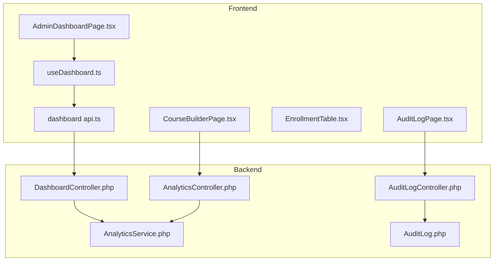
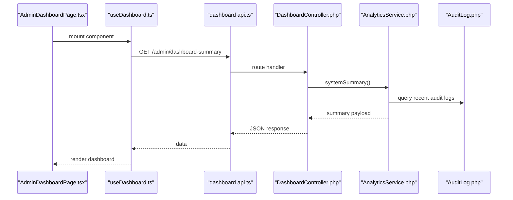
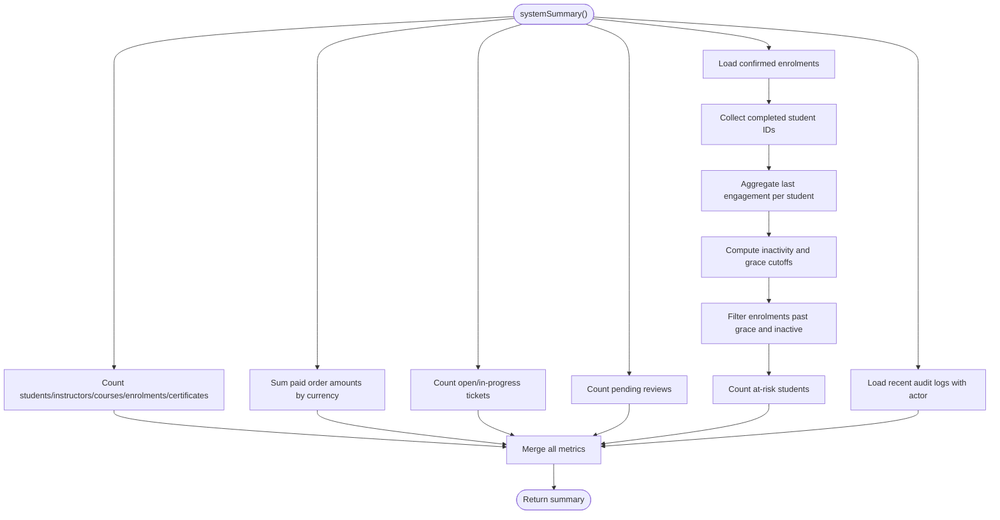
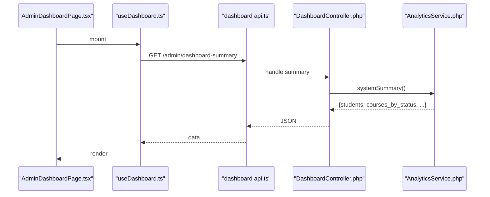
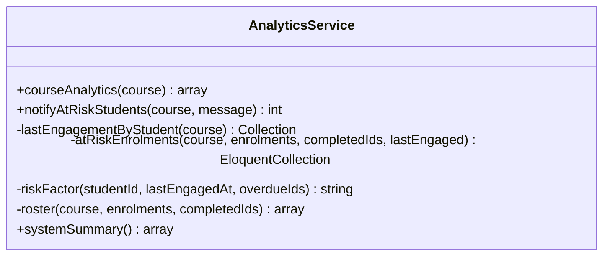
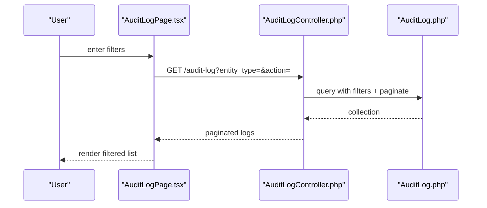
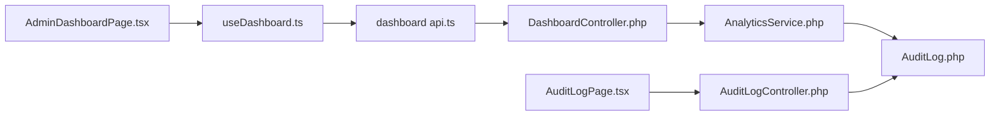

# Administrative Dashboards

<cite>
**Referenced Files in This Document**
- [AnalyticsController.php](file://app/Http/Controllers/Api/V1/AnalyticsController.php)
- [DashboardController.php](file://app/Http/Controllers/Api/V1/Admin/DashboardController.php)
- [AuditLogController.php](file://app/Http/Controllers/Api/V1/Admin/AuditLogController.php)
- [AnalyticsService.php](file://app/Services/Analytics/AnalyticsService.php)
- [AuditLog.php](file://app/Models/AuditLog.php)
- [AdminDashboardPage.tsx](file://frontend/src/features/admin/dashboard/AdminDashboardPage.tsx)
- [useDashboard.ts](file://frontend/src/features/admin/dashboard/useDashboard.ts)
- [api.ts](file://frontend/src/features/admin/dashboard/api.ts)
- [AuditLogPage.tsx](file://frontend/src/features/analytics/AuditLogPage.tsx)
- [EnrollmentTable.tsx](file://frontend/src/features/analytics/EnrollmentTable.tsx)
- [CourseBuilderPage.tsx](file://frontend/src/features/courseStructure/CourseBuilderPage.tsx)
- [schema.sql](file://.agents/context/schema.sql)
</cite>

## Table of Contents
1. Introduction
2. Project Structure
3. Core Components
4. Architecture Overview
5. Detailed Component Analysis
6. Dependency Analysis
7. Performance Considerations
8. Troubleshooting Guide
9. Conclusion

## Introduction
This document explains the Administrative Dashboards and reporting features that help administrators monitor platform health, track key performance indicators, and identify trends across courses and students. It focuses on:
- The systemSummary() method that provides system-wide metrics such as student counts, course status distributions, revenue tracking, and audit log monitoring.
- Dashboard components including enrollment tables, at-risk student identification, and audit log viewing.
- Real-time data updates via React Query caching, filtering capabilities, and export functionality for administrative reports.

Administrators can use these tools to quickly assess engagement, spot at-risk learners, review recent activity, and drill into detailed analytics per course or system-wide.

## Project Structure
The dashboard feature spans backend controllers, a central analytics service, models for audit logs, and frontend pages/hooks that fetch and render data.

**Diagram sources**
- [AdminDashboardPage.tsx:111-171](file://frontend/src/features/admin/dashboard/AdminDashboardPage.tsx#L111-L171)
- [useDashboard.ts:1-10](file://frontend/src/features/admin/dashboard/useDashboard.ts#L1-L10)
- [api.ts:1-8](file://frontend/src/features/admin/dashboard/api.ts#L1-L8)
- [DashboardController.php:17-30](file://app/Http/Controllers/Api/V1/Admin/DashboardController.php#L17-L30)
- [AnalyticsController.php:13-38](file://app/Http/Controllers/Api/V1/AnalyticsController.php#L13-L38)
- [AuditLogController.php:18-34](file://app/Http/Controllers/Api/V1/Admin/AuditLogController.php#L18-L34)
- [AnalyticsService.php:253-304](file://app/Services/Analytics/AnalyticsService.php#L253-L304)
- [AuditLog.php:12-38](file://app/Models/AuditLog.php#L12-L38)

**Section sources**
- [AdminDashboardPage.tsx:111-251](file://frontend/src/features/admin/dashboard/AdminDashboardPage.tsx#L111-L251)
- [DashboardController.php:17-30](file://app/Http/Controllers/Api/V1/Admin/DashboardController.php#L17-L30)
- [AnalyticsController.php:13-38](file://app/Http/Controllers/Api/V1/AnalyticsController.php#L13-L38)
- [AuditLogController.php:18-34](file://app/Http/Controllers/Api/V1/Admin/AuditLogController.php#L18-L34)
- [AnalyticsService.php:253-304](file://app/Services/Analytics/AnalyticsService.php#L253-L304)
- [AuditLog.php:12-38](file://app/Models/AuditLog.php#L12-L38)

## Core Components
- Admin Dashboard Page: Displays system-wide metrics, needs-action alerts, volume KPIs, recent activity, quick actions, and course breakdown.
- System Summary Endpoint: Returns aggregated metrics via AnalyticsService::systemSummary().
- Course Analytics: Provides per-course analytics including completion rate, at-risk students, engagement summary, and roster.
- Audit Log Viewer: Lists and filters audit entries with human-readable descriptions.
- Enrollment Table: Shows per-student progress and supports search and CSV export.

Key responsibilities:
- Aggregation and risk calculation live in AnalyticsService.
- Controllers enforce authorization and shape responses.
- Frontend uses React Query for caching and revalidation, and renders interactive dashboards.

**Section sources**
- [AdminDashboardPage.tsx:111-251](file://frontend/src/features/admin/dashboard/AdminDashboardPage.tsx#L111-L251)
- [DashboardController.php:17-30](file://app/Http/Controllers/Api/V1/Admin/DashboardController.php#L17-L30)
- [AnalyticsController.php:13-38](file://app/Http/Controllers/Api/V1/AnalyticsController.php#L13-L38)
- [AuditLogPage.tsx:14-83](file://frontend/src/features/analytics/AuditLogPage.tsx#L14-L83)
- [EnrollmentTable.tsx:10-37](file://frontend/src/features/analytics/EnrollmentTable.tsx#L10-L37)

## Architecture Overview
The admin dashboard follows a clear separation of concerns:
- Frontend pages call typed API endpoints and cache results with React Query.
- Backend controllers authorize access and delegate aggregation to services.
- Services perform efficient queries and apply business rules (e.g., at-risk thresholds).
- Models represent entities like AuditLog with relationships used by resources and queries.

**Diagram sources**
- [AdminDashboardPage.tsx:111-171](file://frontend/src/features/admin/dashboard/AdminDashboardPage.tsx#L111-L171)
- [useDashboard.ts:1-10](file://frontend/src/features/admin/dashboard/useDashboard.ts#L1-L10)
- [api.ts:1-8](file://frontend/src/features/admin/dashboard/api.ts#L1-L8)
- [DashboardController.php:17-30](file://app/Http/Controllers/Api/V1/Admin/DashboardController.php#L17-L30)
- [AnalyticsService.php:253-304](file://app/Services/Analytics/AnalyticsService.php#L253-L304)
- [AuditLog.php:12-38](file://app/Models/AuditLog.php#L12-L38)

## Detailed Component Analysis

### System Summary (systemSummary)
The systemSummary() method aggregates platform-wide metrics for the admin dashboard:
- Student and instructor counts by role.
- Course distribution by status.
- Confirmed enrolments count.
- Certificates issued count.
- Revenue by currency from paid orders.
- Open support tickets and pending reviews.
- At-risk student count using grace period and inactivity thresholds.
- Recent audit logs with actor information.

**Diagram sources**
- [AnalyticsService.php:253-304](file://app/Services/Analytics/AnalyticsService.php#L253-L304)

**Section sources**
- [AnalyticsService.php:253-304](file://app/Services/Analytics/AnalyticsService.php#L253-L304)
- [DashboardController.php:17-30](file://app/Http/Controllers/Api/V1/Admin/DashboardController.php#L17-L30)

### Admin Dashboard UI
The AdminDashboardPage renders:
- Needs-action cards: at-risk students, open tickets, pending reviews, applications.
- Volume metrics: total students, active enrolments, revenue (MTD), average completion.
- Recent activity feed linking to full audit log.
- Quick actions: create course, bulk import, provision user, view audit log.
- Course breakdown by status and certificates issued.

Data flow:
- useDashboardSummary triggers a cached query to fetch dashboard summary.
- The page formats currency and completion percentages and renders sections.

**Diagram sources**
- [AdminDashboardPage.tsx:111-251](file://frontend/src/features/admin/dashboard/AdminDashboardPage.tsx#L111-L251)
- [useDashboard.ts:1-10](file://frontend/src/features/admin/dashboard/useDashboard.ts#L1-L10)
- [api.ts:1-8](file://frontend/src/features/admin/dashboard/api.ts#L1-L8)
- [DashboardController.php:17-30](file://app/Http/Controllers/Api/V1/Admin/DashboardController.php#L17-L30)
- [AnalyticsService.php:253-304](file://app/Services/Analytics/AnalyticsService.php#L253-L304)

**Section sources**
- [AdminDashboardPage.tsx:111-251](file://frontend/src/features/admin/dashboard/AdminDashboardPage.tsx#L111-L251)
- [useDashboard.ts:1-10](file://frontend/src/features/admin/dashboard/useDashboard.ts#L1-L10)
- [api.ts:1-8](file://frontend/src/features/admin/dashboard/api.ts#L1-L8)

### Course Analytics and At-Risk Identification
Per-course analytics provide:
- Total enrolled students and completion rate based on certificates.
- Engagement summary over a rolling window.
- Roster with per-student progress and status.
- At-risk student list with risk factors derived from inactivity and overdue assignments.

**Diagram sources**
- [AnalyticsService.php:56-117](file://app/Services/Analytics/AnalyticsService.php#L56-L117)
- [AnalyticsService.php:124-142](file://app/Services/Analytics/AnalyticsService.php#L124-L142)
- [AnalyticsService.php:147-188](file://app/Services/Analytics/AnalyticsService.php#L147-L188)
- [AnalyticsService.php:195-213](file://app/Services/Analytics/AnalyticsService.php#L195-L213)
- [AnalyticsService.php:225-244](file://app/Services/Analytics/AnalyticsService.php#L225-L244)
- [AnalyticsService.php:253-304](file://app/Services/Analytics/AnalyticsService.php#L253-L304)

**Section sources**
- [AnalyticsController.php:13-38](file://app/Http/Controllers/Api/V1/AnalyticsController.php#L13-L38)
- [AnalyticsService.php:56-117](file://app/Services/Analytics/AnalyticsService.php#L56-L117)
- [CourseBuilderPage.tsx:96-118](file://frontend/src/features/courseStructure/CourseBuilderPage.tsx#L96-L118)

### Audit Log Viewing and Filtering
The AuditLogPage allows administrators to:
- Filter logs by entity type and action.
- View human-readable descriptions of events.
- See timestamps and context (entity type and ID).

Backend supports pagination and optional filters for entity_type, entity_id, and action.

**Diagram sources**
- [AuditLogPage.tsx:14-83](file://frontend/src/features/analytics/AuditLogPage.tsx#L14-L83)
- [AuditLogController.php:18-34](file://app/Http/Controllers/Api/V1/Admin/AuditLogController.php#L18-L34)
- [AuditLog.php:12-38](file://app/Models/AuditLog.php#L12-L38)

**Section sources**
- [AuditLogPage.tsx:14-83](file://frontend/src/features/analytics/AuditLogPage.tsx#L14-L83)
- [AuditLogController.php:18-34](file://app/Http/Controllers/Api/V1/Admin/AuditLogController.php#L18-L34)
- [AuditLog.php:12-38](file://app/Models/AuditLog.php#L12-L38)

### Enrollment Tables and Export
The EnrollmentTable displays:
- Student name, email, enrollment date, progress percentage, and status.
- Client-side search by name or email.
- CSV export for offline analysis.

This table is typically driven by course-level analytics roster data.

**Section sources**
- [EnrollmentTable.tsx:10-37](file://frontend/src/features/analytics/EnrollmentTable.tsx#L10-L37)
- [AnalyticsService.php:225-244](file://app/Services/Analytics/AnalyticsService.php#L225-L244)

## Dependency Analysis
- Controllers depend on services for business logic and on models/resources for data shaping.
- Frontend hooks encapsulate API calls and caching; pages consume hooks for rendering.
- Audit logging writes are isolated to dedicated services/controllers, while read paths expose filtered lists.

**Diagram sources**
- [AdminDashboardPage.tsx:111-171](file://frontend/src/features/admin/dashboard/AdminDashboardPage.tsx#L111-L171)
- [useDashboard.ts:1-10](file://frontend/src/features/admin/dashboard/useDashboard.ts#L1-L10)
- [api.ts:1-8](file://frontend/src/features/admin/dashboard/api.ts#L1-L8)
- [DashboardController.php:17-30](file://app/Http/Controllers/Api/V1/Admin/DashboardController.php#L17-L30)
- [AnalyticsService.php:253-304](file://app/Services/Analytics/AnalyticsService.php#L253-L304)
- [AuditLog.php:12-38](file://app/Models/AuditLog.php#L12-L38)
- [AuditLogPage.tsx:14-83](file://frontend/src/features/analytics/AuditLogPage.tsx#L14-L83)
- [AuditLogController.php:18-34](file://app/Http/Controllers/Api/V1/Admin/AuditLogController.php#L18-L34)

**Section sources**
- [DashboardController.php:17-30](file://app/Http/Controllers/Api/V1/Admin/DashboardController.php#L17-L30)
- [AnalyticsService.php:253-304](file://app/Services/Analytics/AnalyticsService.php#L253-L304)
- [AuditLogController.php:18-34](file://app/Http/Controllers/Api/V1/Admin/AuditLogController.php#L18-L34)

## Performance Considerations
- Aggregations are performed server-side to minimize payload size and client processing.
- Pagination is used for audit logs to keep lists responsive.
- At-risk calculations reuse shared constants for grace period and inactivity windows to ensure consistency and efficiency.
- Revenue totals are computed directly from orders with grouping by currency to avoid N+1 issues.
- Frontend uses React Query caching to reduce redundant network requests and enable fast re-renders.

[No sources needed since this section provides general guidance]

## Troubleshooting Guide
Common issues and resolutions:
- Empty dashboard metrics: verify roles and statuses of users and orders; check that confirmed enrolments exist and that revenue records are marked as paid.
- No recent audit logs: confirm that write operations are routed through the audit logger and that actors are associated with users.
- Filters not returning results: ensure filter parameters match exact entity types and actions stored in the database.
- At-risk count seems off: validate grace period and inactivity thresholds and confirm engagement events are being recorded for students.

Operational checks:
- Confirm database schema includes engagement_events and audit_logs tables with correct indexes.
- Ensure controllers enforce authorization so only authorized admins see sensitive data.

**Section sources**
- [AnalyticsService.php:253-304](file://app/Services/Analytics/AnalyticsService.php#L253-L304)
- [AuditLogController.php:18-34](file://app/Http/Controllers/Api/V1/Admin/AuditLogController.php#L18-L34)
- [schema.sql:751-779](file://.agents/context/schema.sql#L751-L779)

## Conclusion
The Administrative Dashboards provide a comprehensive view of platform health and performance:
- systemSummary() delivers essential KPIs including student counts, course status distributions, revenue by currency, and recent audit activity.
- Course analytics surface completion rates, engagement summaries, and at-risk student identification to guide interventions.
- Audit log viewing enables accountability and traceability for critical actions.
- Enrollment tables support filtering and export for deeper analysis.

Administrators can rely on these tools to monitor trends, act on at-risk students promptly, and maintain operational oversight across the academy.

[No sources needed since this section summarizes without analyzing specific files]