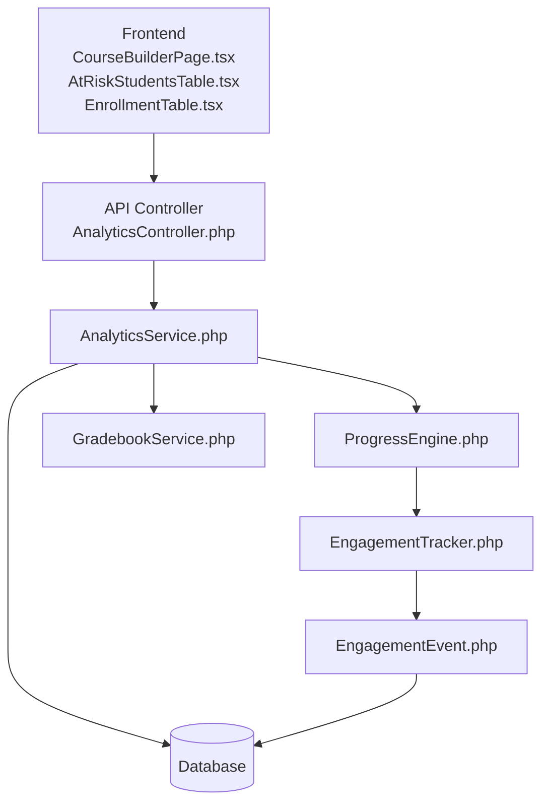
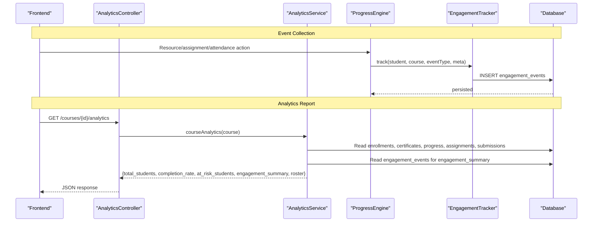
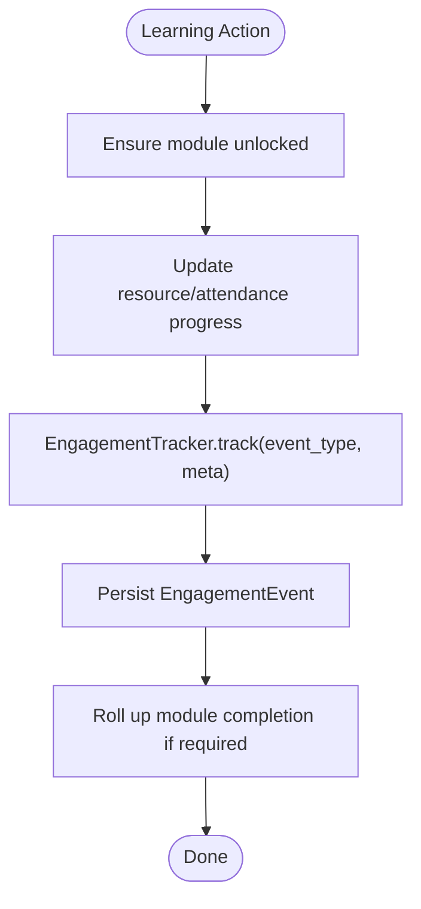
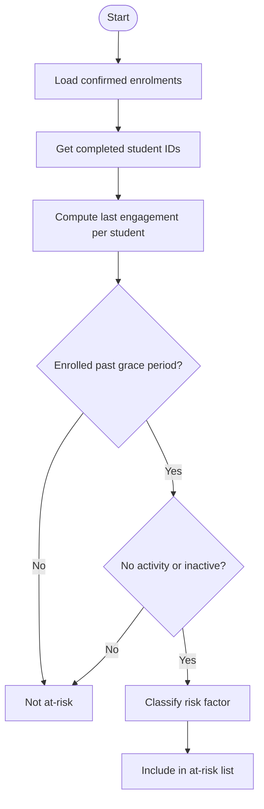
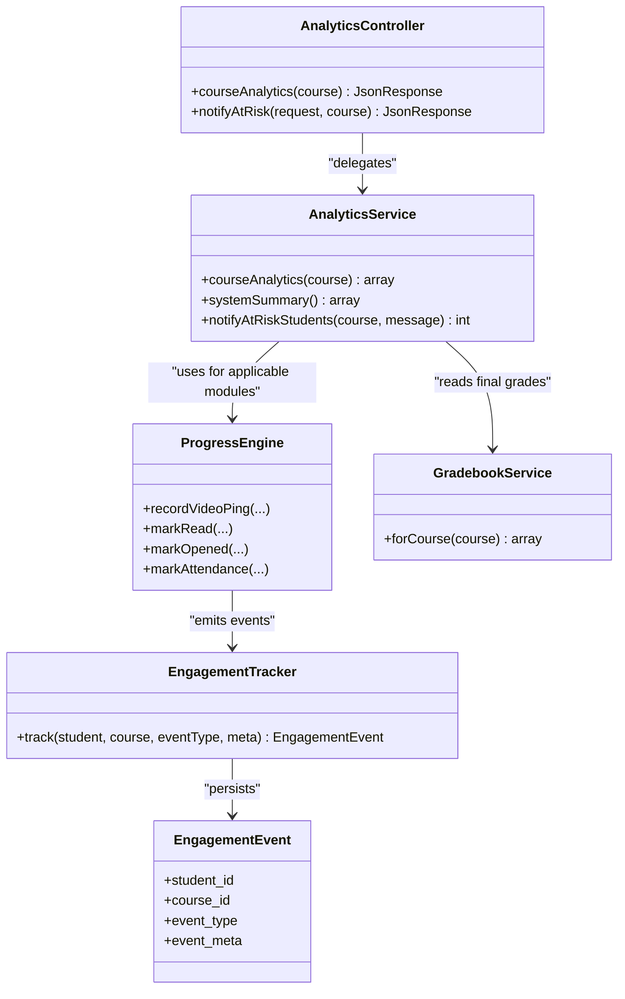
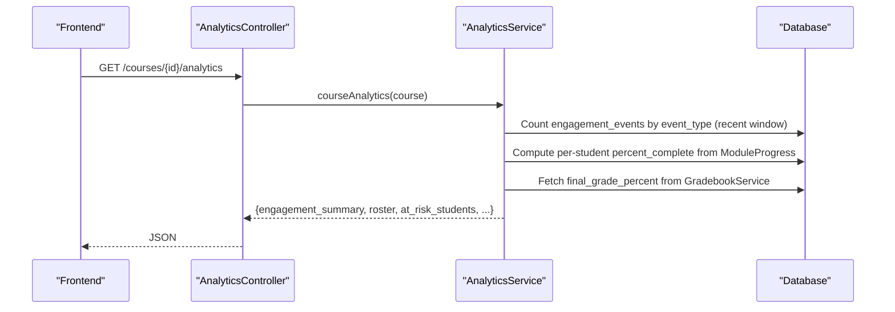
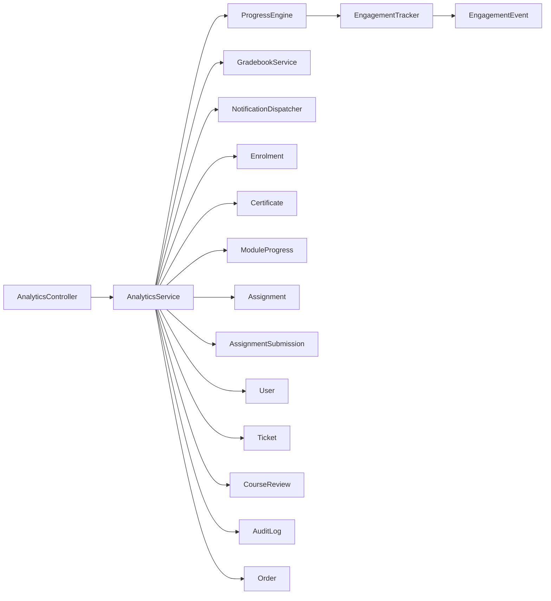

# Analytics & Reporting

<cite>
**Referenced Files in This Document**
- [AnalyticsService.php](file://app/Services/Analytics/AnalyticsService.php)
- [EngagementTracker.php](file://app/Services/Analytics/EngagementTracker.php)
- [AnalyticsController.php](file://app/Http/Controllers/Api/V1/AnalyticsController.php)
- [EngagementEvent.php](file://app/Models/EngagementEvent.php)
- [ProgressEngine.php](file://app/Services/Progress/ProgressEngine.php)
- [GradebookService.php](file://app/Services/Assessment/GradebookService.php)
- [AssignmentSubmissionService.php](file://app/Services/Assessment/AssignmentSubmissionService.php)
- [CourseBuilderPage.tsx](file://frontend/src/features/courseStructure/CourseBuilderPage.tsx)
- [AtRiskStudentsTable.tsx](file://frontend/src/features/analytics/AtRiskStudentsTable.tsx)
- [EnrollmentTable.tsx](file://frontend/src/features/analytics/EnrollmentTable.tsx)
- [EngagementTrackingTest.php](file://tests/Feature/Analytics/EngagementTrackingTest.php)
- [CourseAnalyticsTest.php](file://tests/Feature/Analytics/CourseAnalyticsTest.php)
</cite>

## Table of Contents
1. [Introduction](#introduction)
2. [Project Structure](#project-structure)
3. [Core Components](#core-components)
4. [Architecture Overview](#architecture-overview)
5. [Detailed Component Analysis](#detailed-component-analysis)
6. [Dependency Analysis](#dependency-analysis)
7. [Performance Considerations](#performance-considerations)
8. [Troubleshooting Guide](#troubleshooting-guide)
9. [Conclusion](#conclusion)

## Introduction
This document explains the Analytics & Reporting sub-feature with a focus on engagement tracking, student analytics, administrative dashboards, and at-risk student detection. It covers how engagement events are collected, how metrics are calculated, and how reports are presented to instructors and administrators. It also clarifies the relationship between analytics and progress tracking, enrollment data, and performance metrics.

## Project Structure
The analytics feature is implemented as a small set of services and models that read from existing learning data (progress, assessments, certificates, orders) and write engagement events through a single tracker. The API exposes course-level analytics and an action to notify at-risk students. Frontend components consume these endpoints to render dashboard widgets, at-risk tables, and enrollment rosters.

**Diagram sources**
- [AnalyticsController.php:17-36](file://app/Http/Controllers/Api/V1/AnalyticsController.php#L17-L36)
- [AnalyticsService.php:56-117](file://app/Services/Analytics/AnalyticsService.php#L56-L117)
- [ProgressEngine.php:218-286](file://app/Services/Progress/ProgressEngine.php#L218-L286)
- [EngagementTracker.php:26-34](file://app/Services/Analytics/EngagementTracker.php#L26-L34)
- [EngagementEvent.php:19-44](file://app/Models/EngagementEvent.php#L19-L44)
- [GradebookService.php:31-119](file://app/Services/Assessment/GradebookService.php#L31-L119)
- [CourseBuilderPage.tsx:96-118](file://frontend/src/features/courseStructure/CourseBuilderPage.tsx#L96-L118)
- [AtRiskStudentsTable.tsx:53-100](file://frontend/src/features/analytics/AtRiskStudentsTable.tsx#L53-L100)
- [EnrollmentTable.tsx:39-81](file://frontend/src/features/analytics/EnrollmentTable.tsx#L39-L81)

**Section sources**
- [AnalyticsController.php:17-36](file://app/Http/Controllers/Api/V1/AnalyticsController.php#L17-L36)
- [AnalyticsService.php:56-117](file://app/Services/Analytics/AnalyticsService.php#L56-L117)
- [ProgressEngine.php:218-286](file://app/Services/Progress/ProgressEngine.php#L218-L286)
- [EngagementTracker.php:26-34](file://app/Services/Analytics/EngagementTracker.php#L26-L34)
- [EngagementEvent.php:19-44](file://app/Models/EngagementEvent.php#L19-L44)
- [GradebookService.php:31-119](file://app/Services/Assessment/GradebookService.php#L31-L119)
- [CourseBuilderPage.tsx:96-118](file://frontend/src/features/courseStructure/CourseBuilderPage.tsx#L96-L118)
- [AtRiskStudentsTable.tsx:53-100](file://frontend/src/features/analytics/AtRiskStudentsTable.tsx#L53-L100)
- [EnrollmentTable.tsx:39-81](file://frontend/src/features/analytics/EnrollmentTable.tsx#L39-L81)

## Core Components
- EngagementTracker: Single write path for engagement events. Records course-scoped signals such as resource_viewed and assignment_submitted.
- AnalyticsService: Computes course analytics, at-risk flags, engagement summaries, roster progress, and system-wide summary. Also sends mass at-risk notifications.
- ProgressEngine: Central owner of module unlock and completion logic; emits engagement events when resources are consumed or attendance is recorded.
- GradebookService: Aggregates assignment scores and evaluation attempts into per-student final grades used by analytics.
- EngagementEvent model: Stores student_id, course_id, event_type, and event_meta.
- AnalyticsController: Exposes endpoints for course analytics and notifying at-risk students.
- Frontend components: Render enrolled count, completion rate, at-risk count, at-risk table, and enrollment roster.

**Section sources**
- [EngagementTracker.php:26-34](file://app/Services/Analytics/EngagementTracker.php#L26-L34)
- [AnalyticsService.php:56-117](file://app/Services/Analytics/AnalyticsService.php#L56-L117)
- [ProgressEngine.php:218-286](file://app/Services/Progress/ProgressEngine.php#L218-L286)
- [GradebookService.php:31-119](file://app/Services/Assessment/GradebookService.php#L31-L119)
- [EngagementEvent.php:19-44](file://app/Models/EngagementEvent.php#L19-L44)
- [AnalyticsController.php:17-36](file://app/Http/Controllers/Api/V1/AnalyticsController.php#L17-L36)
- [CourseBuilderPage.tsx:96-118](file://frontend/src/features/courseStructure/CourseBuilderPage.tsx#L96-L118)
- [AtRiskStudentsTable.tsx:53-100](file://frontend/src/features/analytics/AtRiskStudentsTable.tsx#L53-L100)
- [EnrollmentTable.tsx:39-81](file://frontend/src/features/analytics/EnrollmentTable.tsx#L39-L81)

## Architecture Overview
The analytics pipeline has two main flows:

1) Event collection flow:
- Learning actions (resource consumption, assignment submission, live session attendance) call ProgressEngine methods.
- ProgressEngine calls EngagementTracker.track to persist an EngagementEvent.
- AnalyticsService reads EngagementEvent rows to compute engagement summaries and last-engaged timestamps.

2) Analytics and reporting flow:
- AnalyticsController authorizes access and delegates to AnalyticsService.
- AnalyticsService computes completion rates, at-risk flags, engagement summaries, and roster progress using Enrollment, Certificate, ModuleProgress, Assignment, AssignmentSubmission, EvaluationAttempt, and Order data.
- Frontend displays aggregated metrics and lists.

**Diagram sources**
- [ProgressEngine.php:218-286](file://app/Services/Progress/ProgressEngine.php#L218-L286)
- [EngagementTracker.php:26-34](file://app/Services/Analytics/EngagementTracker.php#L26-L34)
- [AnalyticsController.php:17-36](file://app/Http/Controllers/Api/V1/AnalyticsController.php#L17-L36)
- [AnalyticsService.php:56-117](file://app/Services/Analytics/AnalyticsService.php#L56-L117)

## Detailed Component Analysis

### Engagement Tracking
- Purpose: Record meaningful, course-scoped learning interactions to power engagement metrics and at-risk detection.
- Events emitted:
  - resource_viewed: Emitted when a video reaches completion threshold, a reading/document is marked read, an external link/downloadable file is opened, or live session attendance is recorded.
  - assignment_submitted: Emitted when an assignment submission is created.
- Implementation highlights:
  - ProgressEngine records resource progress and then calls EngagementTracker.track with the appropriate event type and metadata.
  - AssignmentSubmissionService tracks assignment submissions via EngagementTracker.track.
  - EngagementTracker persists EngagementEvent with student_id, course_id, event_type, and event_meta.

**Diagram sources**
- [ProgressEngine.php:218-286](file://app/Services/Progress/ProgressEngine.php#L218-L286)
- [AssignmentSubmissionService.php:37-67](file://app/Services/Assessment/AssignmentSubmissionService.php#L37-L67)
- [EngagementTracker.php:26-34](file://app/Services/Analytics/EngagementTracker.php#L26-L34)

**Section sources**
- [ProgressEngine.php:218-286](file://app/Services/Progress/ProgressEngine.php#L218-L286)
- [AssignmentSubmissionService.php:37-67](file://app/Services/Assessment/AssignmentSubmissionService.php#L37-L67)
- [EngagementTracker.php:26-34](file://app/Services/Analytics/EngagementTracker.php#L26-L34)
- [EngagementEvent.php:19-44](file://app/Models/EngagementEvent.php#L19-L44)
- [EngagementTrackingTest.php:21-52](file://tests/Feature/Analytics/EngagementTrackingTest.php#L21-L52)

### Student Analytics and At-Risk Detection
- Completion rate: Computed from confirmed enrolments versus students who have received a certificate for the course.
- At-risk detection:
  - A student is considered at-risk if they are not completed, enrolled past a grace period, and either never engaged or inactive beyond a defined window.
  - Risk factor classification:
    - No activity: no engagement events found.
    - Assignment backlog: has some activity but has overdue assignments without submitted work.
    - Inactive: has activity but last engagement is older than the inactivity window.
- Data sources:
  - Enrolment status and applied_at dates.
  - Certificates issued.
  - EngagementEvent last timestamps per student.
  - Assignment due dates and submission status.
  - Final grade percent from GradebookService.

**Diagram sources**
- [AnalyticsService.php:56-117](file://app/Services/Analytics/AnalyticsService.php#L56-L117)
- [AnalyticsService.php:166-213](file://app/Services/Analytics/AnalyticsService.php#L166-L213)
- [GradebookService.php:31-119](file://app/Services/Assessment/GradebookService.php#L31-L119)

**Section sources**
- [AnalyticsService.php:56-117](file://app/Services/Analytics/AnalyticsService.php#L56-L117)
- [AnalyticsService.php:166-213](file://app/Services/Analytics/AnalyticsService.php#L166-L213)
- [GradebookService.php:31-119](file://app/Services/Assessment/GradebookService.php#L31-L119)
- [CourseAnalyticsTest.php:29-88](file://tests/Feature/Analytics/CourseAnalyticsTest.php#L29-L88)
- [CourseAnalyticsTest.php:99-157](file://tests/Feature/Analytics/CourseAnalyticsTest.php#L99-L157)

### Administrative Dashboards
- Course analytics endpoint returns:
  - total_students, completed_students, completion_rate
  - at_risk_students with student details, last_engaged_at, final_grade_percent, risk_factor
  - engagement_summary grouped by event_type within a recent window
  - roster with per-student percent_complete and graduated/active status
- System summary endpoint aggregates:
  - user counts by role
  - courses by status
  - confirmed enrolments
  - certificates issued
  - revenue by currency from paid orders
  - open tickets and pending reviews
  - at-risk student count
  - recent audit logs

**Diagram sources**
- [AnalyticsController.php:17-36](file://app/Http/Controllers/Api/V1/AnalyticsController.php#L17-L36)
- [AnalyticsService.php:56-117](file://app/Services/Analytics/AnalyticsService.php#L56-L117)
- [AnalyticsService.php:253-304](file://app/Services/Analytics/AnalyticsService.php#L253-L304)
- [ProgressEngine.php:218-286](file://app/Services/Progress/ProgressEngine.php#L218-L286)
- [GradebookService.php:31-119](file://app/Services/Assessment/GradebookService.php#L31-L119)
- [EngagementTracker.php:26-34](file://app/Services/Analytics/EngagementTracker.php#L26-L34)
- [EngagementEvent.php:19-44](file://app/Models/EngagementEvent.php#L19-L44)

**Section sources**
- [AnalyticsController.php:17-36](file://app/Http/Controllers/Api/V1/AnalyticsController.php#L17-L36)
- [AnalyticsService.php:56-117](file://app/Services/Analytics/AnalyticsService.php#L56-L117)
- [AnalyticsService.php:253-304](file://app/Services/Analytics/AnalyticsService.php#L253-L304)

### Engagement Metrics and Report Generation
- Engagement summary: Counts of event_type within a recent window for a course.
- Roster: For each confirmed enrolment, calculates percent_complete based on applicable modules and ModuleProgress statuses; marks graduated if a certificate exists.
- Final grade percent: Derived from assignment scores and evaluation attempts via GradebookService.

**Diagram sources**
- [AnalyticsController.php:17-36](file://app/Http/Controllers/Api/V1/AnalyticsController.php#L17-L36)
- [AnalyticsService.php:56-117](file://app/Services/Analytics/AnalyticsService.php#L56-L117)
- [AnalyticsService.php:225-244](file://app/Services/Analytics/AnalyticsService.php#L225-L244)
- [GradebookService.php:31-119](file://app/Services/Assessment/GradebookService.php#L31-L119)

**Section sources**
- [AnalyticsService.php:56-117](file://app/Services/Analytics/AnalyticsService.php#L56-L117)
- [AnalyticsService.php:225-244](file://app/Services/Analytics/AnalyticsService.php#L225-L244)
- [GradebookService.php:31-119](file://app/Services/Assessment/GradebookService.php#L31-L119)

### Relationship with Progress Tracking, Enrollment, and Performance Metrics
- Progress tracking:
  - ProgressEngine determines applicable modules and module completion; it triggers engagement events when resources are consumed or attendance is recorded.
  - AnalyticsService uses ProgressEngine.applicableModules to compute per-student percent_complete in the roster.
- Enrollment data:
  - Only confirmed enrolments are included in analytics.
  - Applied_at date controls grace period for at-risk detection.
- Performance metrics:
  - Final grade percent comes from GradebookService, combining assignment scores and evaluation attempts.
  - Overdue assignments influence risk_factor classification.

**Section sources**
- [ProgressEngine.php:109-118](file://app/Services/Progress/ProgressEngine.php#L109-L118)
- [ProgressEngine.php:126-152](file://app/Services/Progress/ProgressEngine.php#L126-L152)
- [AnalyticsService.php:56-117](file://app/Services/Analytics/AnalyticsService.php#L56-L117)
- [AnalyticsService.php:225-244](file://app/Services/Analytics/AnalyticsService.php#L225-L244)
- [GradebookService.php:31-119](file://app/Services/Assessment/GradebookService.php#L31-L119)

## Dependency Analysis
- AnalyticsController depends on AnalyticsService for all analytics logic and authorization.
- AnalyticsService depends on:
  - ProgressEngine for applicable modules and progress calculations.
  - GradebookService for final grades.
  - NotificationDispatcher for sending at-risk reminders.
  - Models: Enrolment, Certificate, EngagementEvent, ModuleProgress, Assignment, AssignmentSubmission, User, Ticket, CourseReview, AuditLog, Order.
- ProgressEngine depends on EngagementTracker to emit engagement events and on NotificationDispatcher and CertificateService for lifecycle events.
- AssignmentSubmissionService depends on EngagementTracker and ProgressEngine to record submissions and roll up completion.

**Diagram sources**
- [AnalyticsController.php:17-36](file://app/Http/Controllers/Api/V1/AnalyticsController.php#L17-L36)
- [AnalyticsService.php:56-117](file://app/Services/Analytics/AnalyticsService.php#L56-L117)
- [ProgressEngine.php:218-286](file://app/Services/Progress/ProgressEngine.php#L218-L286)
- [EngagementTracker.php:26-34](file://app/Services/Analytics/EngagementTracker.php#L26-L34)
- [EngagementEvent.php:19-44](file://app/Models/EngagementEvent.php#L19-L44)
- [GradebookService.php:31-119](file://app/Services/Assessment/GradebookService.php#L31-L119)

**Section sources**
- [AnalyticsController.php:17-36](file://app/Http/Controllers/Api/V1/AnalyticsController.php#L17-L36)
- [AnalyticsService.php:56-117](file://app/Services/Analytics/AnalyticsService.php#L56-L117)
- [ProgressEngine.php:218-286](file://app/Services/Progress/ProgressEngine.php#L218-L286)
- [EngagementTracker.php:26-34](file://app/Services/Analytics/EngagementTracker.php#L26-L34)
- [EngagementEvent.php:19-44](file://app/Models/EngagementEvent.php#L19-L44)
- [GradebookService.php:31-119](file://app/Services/Assessment/GradebookService.php#L31-L119)

## Performance Considerations
- Engagement queries use grouped aggregations and time-bounded filters to keep counts efficient.
- At-risk detection filters out completed students early and uses grace-period checks to reduce processing.
- Roster calculation reuses ProgressEngine.applicableModules to avoid redundant logic and ensures consistent progress computation.
- System summary aggregates across multiple tables; consider indexing columns used in where/groupBy clauses (e.g., status, course_id, student_id).

[No sources needed since this section provides general guidance]

## Troubleshooting Guide
- Missing engagement events:
  - Ensure resource actions go through ProgressEngine methods so EngagementTracker.track is invoked.
  - Verify assignment submissions call AssignmentSubmissionService.submit which emits assignment_submitted.
- Incorrect at-risk flags:
  - Confirm enrolment applied_at is backdated appropriately for tests or real scenarios.
  - Validate that certificates exist for completed students; otherwise they may be flagged incorrectly.
- Authorization errors:
  - Analytics endpoints require viewAnalytics permission; ensure the requester is admin or teaching instructor.
- Notifications not sent:
  - notifyAtRiskStudents only targets currently at-risk students; verify thresholds and last engagement timestamps.

**Section sources**
- [ProgressEngine.php:218-286](file://app/Services/Progress/ProgressEngine.php#L218-L286)
- [AssignmentSubmissionService.php:37-67](file://app/Services/Assessment/AssignmentSubmissionService.php#L37-L67)
- [AnalyticsController.php:17-36](file://app/Http/Controllers/Api/V1/AnalyticsController.php#L17-L36)
- [AnalyticsService.php:124-142](file://app/Services/Analytics/AnalyticsService.php#L124-L142)
- [CourseAnalyticsTest.php:190-226](file://tests/Feature/Analytics/CourseAnalyticsTest.php#L190-L226)

## Conclusion
The Analytics & Reporting sub-feature centralizes engagement tracking through a dedicated tracker and leverages existing progress and assessment data to deliver actionable insights. Instructors can view completion rates, engagement summaries, and at-risk student lists, while administrators get system-wide metrics. The design keeps analytics read-heavy with a single controlled write path for engagement events, ensuring consistency and maintainability.

[No sources needed since this section summarizes without analyzing specific files]