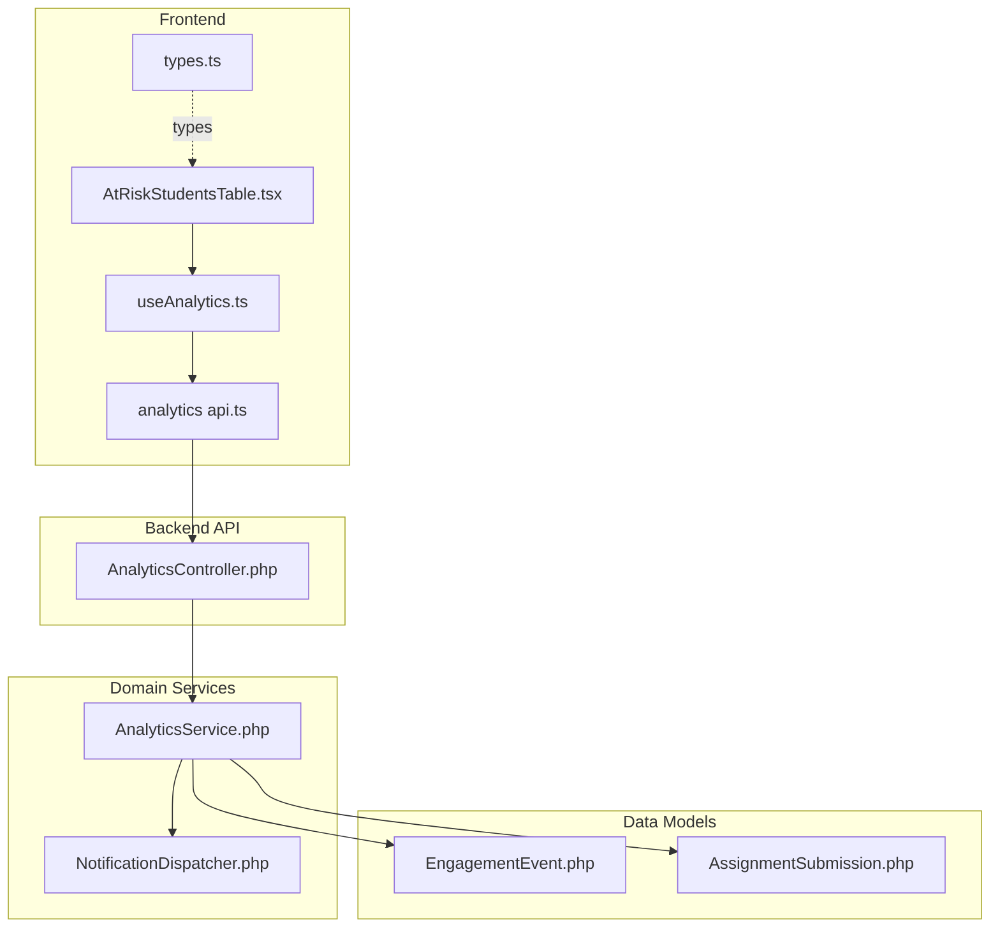
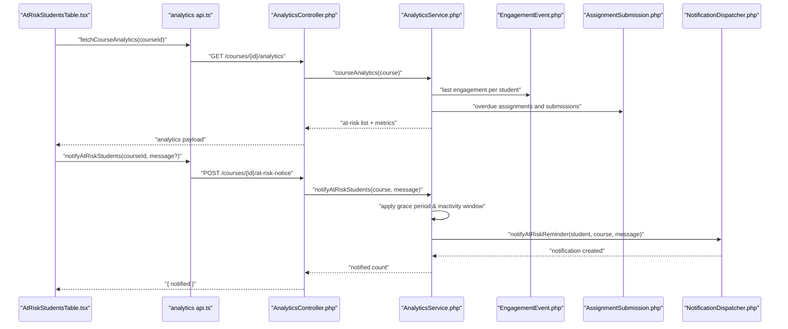
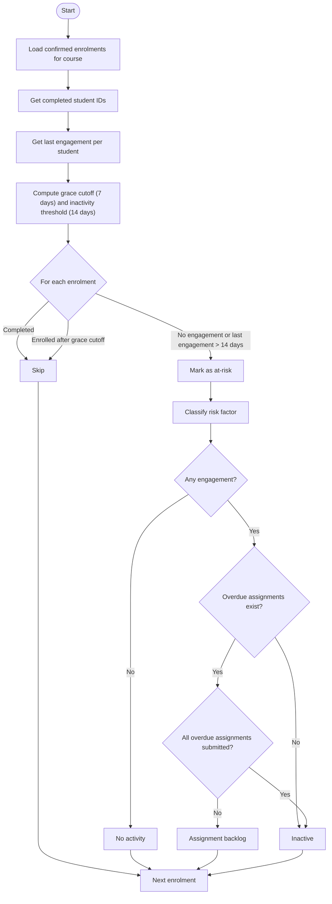
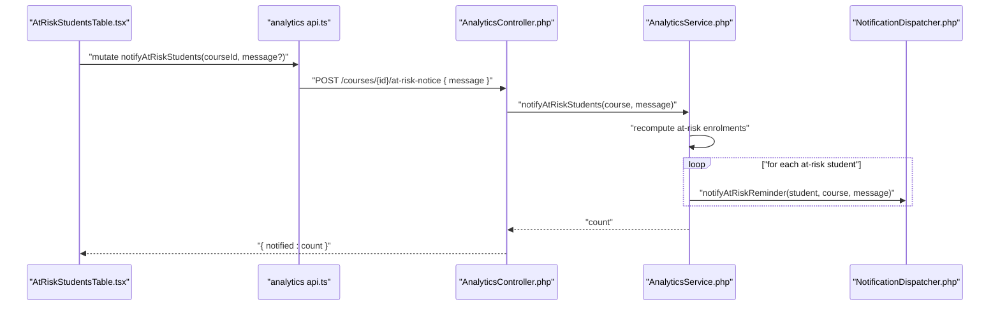
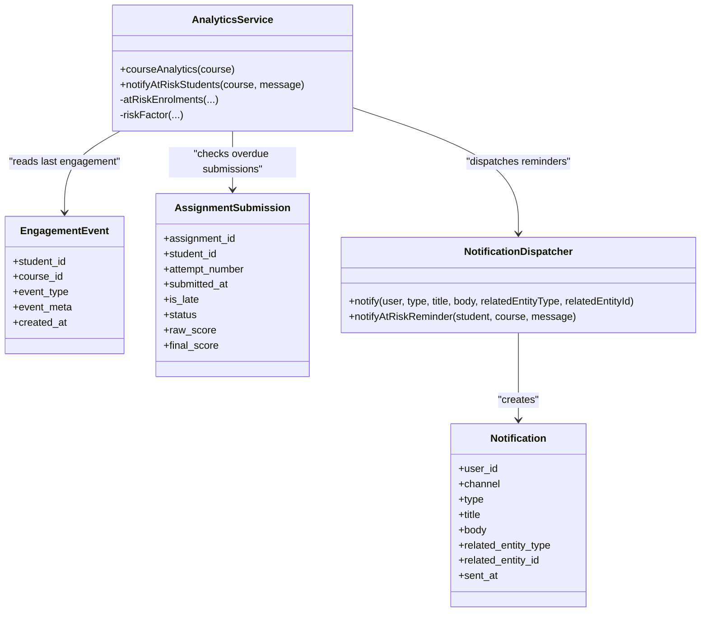
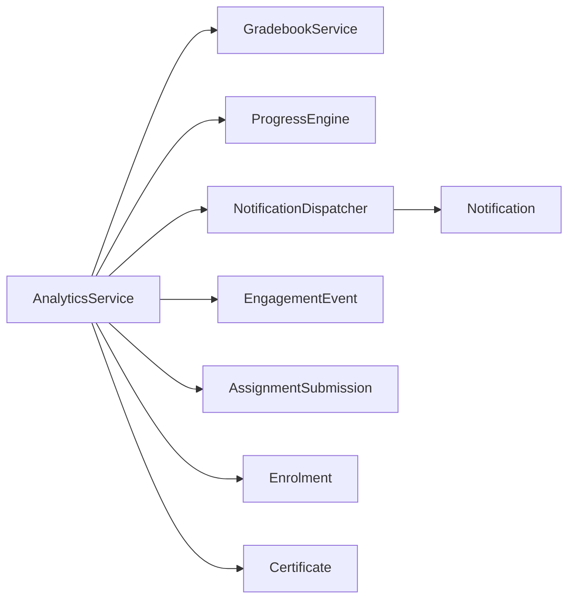

# At-Risk Student Detection

<cite>
**Referenced Files in This Document**
- [AnalyticsService.php](file://app/Services/Analytics/AnalyticsService.php)
- [NotificationDispatcher.php](file://app/Services/Notifications/NotificationDispatcher.php)
- [EngagementEvent.php](file://app/Models/EngagementEvent.php)
- [AssignmentSubmission.php](file://app/Models/AssignmentSubmission.php)
- [AnalyticsController.php](file://app/Http/Controllers/Api/V1/AnalyticsController.php)
- [AtRiskStudentsTable.tsx](file://frontend/src/features/analytics/AtRiskStudentsTable.tsx)
- [useAnalytics.ts](file://frontend/src/features/analytics/useAnalytics.ts)
- [api.ts (analytics)](file://frontend/src/features/analytics/api.ts)
- [types.ts](file://frontend/src/lib/api/types.ts)
</cite>

## Table of Contents
1. [Introduction](#introduction)
2. [Project Structure](#project-structure)
3. [Core Components](#core-components)
4. [Architecture Overview](#architecture-overview)
5. [Detailed Component Analysis](#detailed-component-analysis)
6. [Dependency Analysis](#dependency-analysis)
7. [Performance Considerations](#performance-considerations)
8. [Troubleshooting Guide](#troubleshooting-guide)
9. [Conclusion](#conclusion)

## Introduction
This document explains the At-Risk Student Detection and intervention system. It covers how the system identifies students at risk using enrollment timing, activity patterns, and assignment completion status; how grace period and inactivity window thresholds are applied; how risk categories are assigned; and how automated notifications are dispatched to at-risk students. It also documents the mass notification workflow that instructors can trigger from the analytics dashboard.

## Project Structure
The at-risk detection logic is implemented in a service layer with supporting models and a notification dispatcher. The frontend exposes an analytics view where instructors can see flagged students and send a mass notice.

**Diagram sources**
- [AtRiskStudentsTable.tsx:11-51](file://frontend/src/features/analytics/AtRiskStudentsTable.tsx#L11-L51)
- [useAnalytics.ts:1-27](file://frontend/src/features/analytics/useAnalytics.ts#L1-L27)
- [api.ts (analytics):1-24](file://frontend/src/features/analytics/api.ts#L1-L24)
- [AnalyticsController.php:13-38](file://app/Http/Controllers/Api/V1/AnalyticsController.php#L13-L38)
- [AnalyticsService.php:39-142](file://app/Services/Analytics/AnalyticsService.php#L39-L142)
- [NotificationDispatcher.php:25-205](file://app/Services/Notifications/NotificationDispatcher.php#L25-L205)
- [EngagementEvent.php:12-45](file://app/Models/EngagementEvent.php#L12-L45)
- [AssignmentSubmission.php:15-89](file://app/Models/AssignmentSubmission.php#L15-L89)

**Section sources**
- [AnalyticsService.php:39-142](file://app/Services/Analytics/AnalyticsService.php#L39-L142)
- [NotificationDispatcher.php:25-205](file://app/Services/Notifications/NotificationDispatcher.php#L25-L205)
- [AnalyticsController.php:13-38](file://app/Http/Controllers/Api/V1/AnalyticsController.php#L13-L38)
- [AtRiskStudentsTable.tsx:11-51](file://frontend/src/features/analytics/AtRiskStudentsTable.tsx#L11-L51)

## Core Components
- AnalyticsService: Implements the at-risk algorithm, computes risk factors, and triggers mass notifications.
- NotificationDispatcher: Writes in-app notifications for reminders and other events.
- EngagementEvent model: Stores per-student, per-course engagement timestamps used to determine last activity.
- AssignmentSubmission model: Used to check whether overdue assignments have been submitted when computing risk factors.
- AnalyticsController: Exposes endpoints for course analytics and sending mass notices to at-risk students.
- Frontend analytics UI: Displays at-risk students and allows instructors to send a mass notice.

Key behaviors:
- Grace period: Students enrolled within the last 7 days are not considered at-risk yet.
- Inactivity window: Students without any engagement in the last 14 days are considered inactive.
- Risk categories:
  - No activity: No recorded engagement for the student in the course.
  - Assignment backlog: Overdue assignments exist and at least one has no submission.
  - Inactive: Meets at-risk criteria but does not match the above two conditions.

**Section sources**
- [AnalyticsService.php:41-45](file://app/Services/Analytics/AnalyticsService.php#L41-L45)
- [AnalyticsService.php:166-213](file://app/Services/Analytics/AnalyticsService.php#L166-L213)
- [NotificationDispatcher.php:190-205](file://app/Services/Notifications/NotificationDispatcher.php#L190-L205)
- [EngagementEvent.php:12-45](file://app/Models/EngagementEvent.php#L12-L45)
- [AssignmentSubmission.php:15-89](file://app/Models/AssignmentSubmission.php#L15-L89)

## Architecture Overview
The system follows a layered architecture:
- Frontend analytics UI calls the backend API to fetch course analytics and to send mass notices.
- The controller authorizes access and delegates to the AnalyticsService.
- AnalyticsService applies the at-risk rules using engagement data and assignment submissions, then optionally dispatches notifications via NotificationDispatcher.
- Notifications are persisted as in-app messages for students to view later.

**Diagram sources**
- [AtRiskStudentsTable.tsx:11-51](file://frontend/src/features/analytics/AtRiskStudentsTable.tsx#L11-L51)
- [api.ts (analytics):1-24](file://frontend/src/features/analytics/api.ts#L1-L24)
- [AnalyticsController.php:17-38](file://app/Http/Controllers/Api/V1/AnalyticsController.php#L17-L38)
- [AnalyticsService.php:56-142](file://app/Services/Analytics/AnalyticsService.php#L56-L142)
- [EngagementEvent.php:12-45](file://app/Models/EngagementEvent.php#L12-L45)
- [AssignmentSubmission.php:15-89](file://app/Models/AssignmentSubmission.php#L15-L89)
- [NotificationDispatcher.php:190-205](file://app/Services/Notifications/NotificationDispatcher.php#L190-L205)

## Detailed Component Analysis

### At-Risk Algorithm and Risk Factors
The core decision logic determines whether a student is at-risk based on:
- Enrollment timing: If a student enrolled after the grace cutoff (7 days ago), they are not at-risk yet.
- Activity level: If there is no engagement event or the last engagement is older than 14 days, they meet the inactivity condition.
- Completion: Completed students (certificates issued) are excluded.

Risk factor classification:
- No activity: No engagement record exists for the student in the course.
- Assignment backlog: There are overdue assignments for the course, and the student has not submitted all of them.
- Inactive: The student meets at-risk criteria but does not fall into the previous two categories.

**Diagram sources**
- [AnalyticsService.php:166-213](file://app/Services/Analytics/AnalyticsService.php#L166-L213)

**Section sources**
- [AnalyticsService.php:166-213](file://app/Services/Analytics/AnalyticsService.php#L166-L213)

### Mass Notification Workflow
Instructors can send a mass notice to all currently at-risk students in a course. The flow:
1. Frontend component triggers mutation to notify at-risk students.
2. API endpoint validates and authorizes the request.
3. Service recomputes at-risk set using the same rule as analytics.
4. For each at-risk student, a reminder notification is dispatched.
5. Response returns the number of students notified.

**Diagram sources**
- [AtRiskStudentsTable.tsx:11-51](file://frontend/src/features/analytics/AtRiskStudentsTable.tsx#L11-L51)
- [api.ts (analytics):9-14](file://frontend/src/features/analytics/api.ts#L9-L14)
- [AnalyticsController.php:24-38](file://app/Http/Controllers/Api/V1/AnalyticsController.php#L24-L38)
- [AnalyticsService.php:119-142](file://app/Services/Analytics/AnalyticsService.php#L119-L142)
- [NotificationDispatcher.php:190-205](file://app/Services/Notifications/NotificationDispatcher.php#L190-L205)

**Section sources**
- [AnalyticsController.php:24-38](file://app/Http/Controllers/Api/V1/AnalyticsController.php#L24-L38)
- [AnalyticsService.php:119-142](file://app/Services/Analytics/AnalyticsService.php#L119-L142)
- [NotificationDispatcher.php:190-205](file://app/Services/Notifications/NotificationDispatcher.php#L190-L205)
- [AtRiskStudentsTable.tsx:11-51](file://frontend/src/features/analytics/AtRiskStudentsTable.tsx#L11-L51)

### Data Model Interactions
- EngagementEvent: Provides per-student last engagement timestamps per course.
- AssignmentSubmission: Used to determine if overdue assignments have been submitted by a student.
- Notification: Created by NotificationDispatcher for at-risk reminders and other system events.

**Diagram sources**
- [EngagementEvent.php:12-45](file://app/Models/EngagementEvent.php#L12-L45)
- [AssignmentSubmission.php:15-89](file://app/Models/AssignmentSubmission.php#L15-L89)
- [AnalyticsService.php:39-142](file://app/Services/Analytics/AnalyticsService.php#L39-L142)
- [NotificationDispatcher.php:25-205](file://app/Services/Notifications/NotificationDispatcher.php#L25-L205)

**Section sources**
- [EngagementEvent.php:12-45](file://app/Models/EngagementEvent.php#L12-L45)
- [AssignmentSubmission.php:15-89](file://app/Models/AssignmentSubmission.php#L15-L89)
- [NotificationDispatcher.php:25-205](file://app/Services/Notifications/NotificationDispatcher.php#L25-L205)

### Concrete Examples of Flagging and Intervention
- Example 1: A student enrolled more than 7 days ago with no engagement events will be flagged as at-risk with risk factor “No activity”.
- Example 2: A student with recent engagement but multiple overdue assignments, some unsubmitted, will be flagged with risk factor “Assignment backlog”.
- Example 3: A student with engagement within the last 14 days but still behind on work may be classified as “Inactive” if they do not meet the first two conditions.

Intervention:
- Instructors open the analytics page, review the at-risk list, and click “Send notice”.
- The system sends an in-app reminder to each at-risk student with a default or custom message.
- Students can later view these reminders in their in-app notification inbox.

**Section sources**
- [AnalyticsService.php:166-213](file://app/Services/Analytics/AnalyticsService.php#L166-L213)
- [AnalyticsService.php:119-142](file://app/Services/Analytics/AnalyticsService.php#L119-L142)
- [NotificationDispatcher.php:190-205](file://app/Services/Notifications/NotificationDispatcher.php#L190-L205)
- [AtRiskStudentsTable.tsx:11-51](file://frontend/src/features/analytics/AtRiskStudentsTable.tsx#L11-L51)

## Dependency Analysis
- AnalyticsService depends on:
  - GradebookService for final grades.
  - ProgressEngine for module applicability in roster calculations.
  - NotificationDispatcher for sending reminders.
  - Models: Enrolment, Certificate, EngagementEvent, Assignment, AssignmentSubmission.
- NotificationDispatcher writes to the Notification model and references related entities.
- Frontend components depend on typed responses for at-risk students and roster entries.

**Diagram sources**
- [AnalyticsService.php:39-142](file://app/Services/Analytics/AnalyticsService.php#L39-L142)
- [NotificationDispatcher.php:25-205](file://app/Services/Notifications/NotificationDispatcher.php#L25-L205)

**Section sources**
- [AnalyticsService.php:39-142](file://app/Services/Analytics/AnalyticsService.php#L39-L142)
- [NotificationDispatcher.php:25-205](file://app/Services/Notifications/NotificationDispatcher.php#L25-L205)

## Performance Considerations
- Queries are scoped to a single course to limit dataset size.
- Last engagement is aggregated per student using group-by to avoid N+1 queries.
- Overdue assignment IDs are fetched once and reused for risk factor computation.
- Mass notifications iterate only over the filtered at-risk set, minimizing unnecessary dispatches.

[No sources needed since this section provides general guidance]

## Troubleshooting Guide
- No at-risk students reported:
  - Verify that engagement events exist for active students.
  - Confirm that due dates for assignments are set and passed.
  - Ensure enrollments are confirmed and not within the 7-day grace period.
- Notifications not appearing:
  - Check that the notification channel is set to in-app.
  - Verify that the user’s notification inbox reads from the notifications table.
- Incorrect risk factor:
  - Inspect last engagement timestamps and overdue assignment lists.
  - Confirm whether submissions exist for overdue assignments.

**Section sources**
- [AnalyticsService.php:166-213](file://app/Services/Analytics/AnalyticsService.php#L166-L213)
- [NotificationDispatcher.php:25-39](file://app/Services/Notifications/NotificationDispatcher.php#L25-L39)

## Conclusion
The at-risk detection system combines enrollment timing, engagement history, and assignment status to identify students who need attention. With a clear 7-day grace period and a 14-day inactivity window, it categorizes risk precisely and enables instructors to intervene through targeted, in-app reminders. The design keeps analytics read-heavy and centralizes notification dispatching for maintainability and extensibility.