# Engagement Tracking

<cite>
**Referenced Files in This Document**
- [EngagementTracker.php](file://app/Services/Analytics/EngagementTracker.php)
- [EngagementEvent.php](file://app/Models/EngagementEvent.php)
- [2024_01_01_000190_create_engagement_events_table.php](file://database/migrations/2024_01_01_000190_create_engagement_events_table.php)
- [ProgressEngine.php](file://app/Services/Progress/ProgressEngine.php)
- [AssignmentSubmissionService.php](file://app/Services/Assessment/AssignmentSubmissionService.php)
- [EvaluationAttemptService.php](file://app/Services/Assessment/EvaluationAttemptService.php)
- [AnalyticsService.php](file://app\Services\Analytics\AnalyticsService.php)
- [AnalyticsController.php](file://app/Http/Controllers/Api/V1/AnalyticsController.php)
- [ProgressController.php](file://app/Http/Controllers/Api/V1/ProgressController.php)
- [RecordVideoProgressRequest.php](file://app/Http/Requests/Api/V1/RecordVideoProgressRequest.php)
- [api.php](file://routes/api.php)
- [ResourceViewerPage.tsx](file://frontend/src/features/learning/ResourceViewerPage.tsx)
- [api.ts (learning)](file://frontend/src/features/learning/api.ts)
- [useLearning.ts](file://frontend/src/features/learning/useLearning.ts)
- [VideoWatchPing.php](file://app/Models/VideoWatchPing.php)
- [2024_01_01_000152_create_video_watch_pings_table.php](file://database/migrations/2024_01_01_000152_create_video_watch_pings_table.php)
</cite>

## Table of Contents
1. Introduction
2. Project Structure
3. Core Components
4. Architecture Overview
5. Detailed Component Analysis
6. Dependency Analysis
7. Performance Considerations
8. Troubleshooting Guide
9. Conclusion

## Introduction
This document explains how the learning platform captures, stores, and processes student engagement events to power analytics and progress features. It focuses on the EngagementTracker service, the EngagementEvent model, and the integration points where video watch, resource access, assignment submissions, and quiz attempts are recorded. It also covers frontend triggers, backend processing, analytics queries, validation, batching considerations, and performance guidance for high-volume engagement data.

## Project Structure
The engagement tracking system spans several layers:
- Frontend components trigger progress actions (video playback, mark as read/opened, attendance).
- API routes expose endpoints that delegate to a controller.
- Controllers call domain services (ProgressEngine, Assessment services).
- Services record progress and emit engagement events via a single write path.
- Analytics reads from these signals to compute dashboards and at-risk flags.

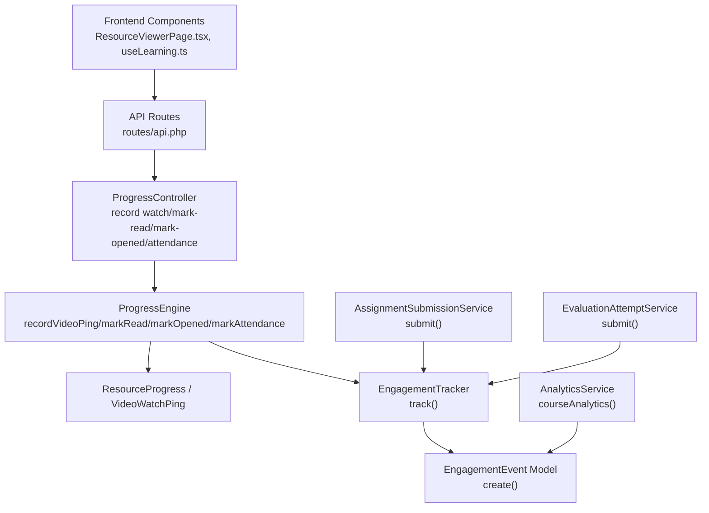

**Diagram sources**
- [api.php:146-153](file://routes/api.php#L146-L153)
- [ProgressController.php:123-149](file://app/Http/Controllers/Api/V1/ProgressController.php#L123-L149)
- [ProgressEngine.php:218-286](file://app/Services/Progress/ProgressEngine.php#L218-L286)
- [EngagementTracker.php:26-34](file://app/Services/Analytics/EngagementTracker.php#L26-L34)
- [EngagementEvent.php:19-28](file://app/Models/EngagementEvent.php#L19-L28)
- [AssignmentSubmissionService.php:37-67](file://app/Services/Assessment/AssignmentSubmissionService.php#L37-L67)
- [EvaluationAttemptService.php:102-149](file://app/Services/Assessment/EvaluationAttemptService.php#L102-L149)
- [AnalyticsService.php:56-117](file://app/Services/Analytics/AnalyticsService.php#L56-L117)

**Section sources**
- [api.php:146-153](file://routes/api.php#L146-L153)
- [ProgressController.php:123-149](file://app/Http/Controllers/Api/V1/ProgressController.php#L123-L149)
- [ProgressEngine.php:218-286](file://app/Services/Progress/ProgressEngine.php#L218-L286)
- [EngagementTracker.php:26-34](file://app/Services/Analytics/EngagementTracker.php#L26-L34)
- [EngagementEvent.php:19-28](file://app/Models/EngagementEvent.php#L19-L28)
- [AssignmentSubmissionService.php:37-67](file://app/Services/Assessment/AssignmentSubmissionService.php#L37-L67)
- [EvaluationAttemptService.php:102-149](file://app/Services/Assessment/EvaluationAttemptService.php#L102-L149)
- [AnalyticsService.php:56-117](file://app/Services/Analytics/AnalyticsService.php#L56-L117)

## Core Components
- EngagementTracker: Single write path for engagement events. Accepts student, course, event type, and metadata; persists an EngagementEvent row.
- EngagementEvent: Eloquent model with fillable fields and JSON casting for event_meta; relationships to User and Course.
- ProgressEngine: Central place for recording resource consumption signals and emitting resource_viewed engagement events; also updates ResourceProgress and VideoWatchPing.
- AssignmentSubmissionService: Emits assignment_submitted when a student submits an assignment.
- EvaluationAttemptService: Emits quiz_attempted when a student submits evaluation answers.
- AnalyticsService: Reads engagement events to compute engagement summaries and at-risk indicators.

Key responsibilities:
- Validation and authorization occur at request/controller boundaries before reaching services.
- ProgressEngine enforces module unlock state before recording any progress or engagement.
- EngagementTracker is intentionally minimal to keep the write path fast and consistent.

**Section sources**
- [EngagementTracker.php:26-34](file://app/Services/Analytics/EngagementTracker.php#L26-L34)
- [EngagementEvent.php:19-28](file://app/Models/EngagementEvent.php#L19-L28)
- [ProgressEngine.php:218-286](file://app/Services/Progress/ProgressEngine.php#L218-L286)
- [AssignmentSubmissionService.php:37-67](file://app/Services/Assessment/AssignmentSubmissionService.php#L37-L67)
- [EvaluationAttemptService.php:102-149](file://app/Services/Assessment/EvaluationAttemptService.php#L102-L149)
- [AnalyticsService.php:56-117](file://app/Services/Analytics/AnalyticsService.php#L56-L117)

## Architecture Overview
End-to-end flow for capturing and using engagement events:

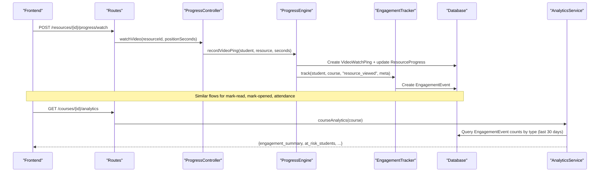

**Diagram sources**
- [api.php:146-153](file://routes/api.php#L146-L153)
- [ProgressController.php:123-149](file://app/Http/Controllers/Api/V1/ProgressController.php#L123-L149)
- [ProgressEngine.php:218-286](file://app/Services/Progress/ProgressEngine.php#L218-L286)
- [EngagementTracker.php:26-34](file://app/Services/Analytics/EngagementTracker.php#L26-L34)
- [AnalyticsService.php:56-117](file://app/Services/Analytics/AnalyticsService.php#L56-L117)

## Detailed Component Analysis

### EngagementTracker and EngagementEvent
- Purpose: Provide a single, consistent write path for engagement events used by analytics and dashboards.
- Inputs: Student, Course, eventType, optional metadata.
- Output: Persisted EngagementEvent row with timestamps.
- Event types documented in code comments: resource_viewed, assignment_submitted, quiz_attempted. Login is intentionally not tracked here due to schema constraints.

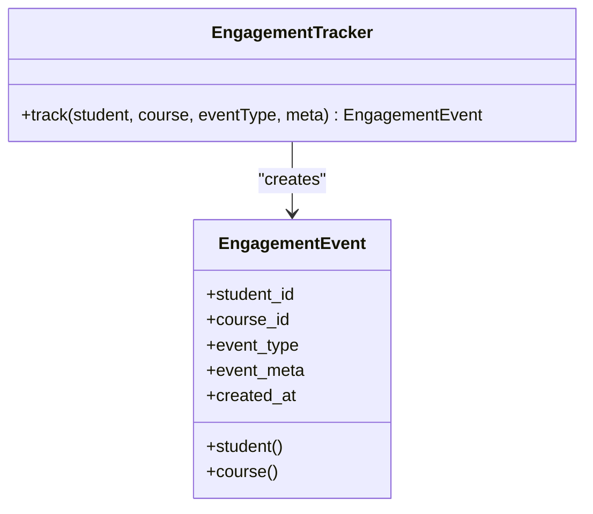

**Diagram sources**
- [EngagementTracker.php:26-34](file://app/Services/Analytics/EngagementTracker.php#L26-L34)
- [EngagementEvent.php:19-28](file://app/Models/EngagementEvent.php#L19-L28)

**Section sources**
- [EngagementTracker.php:26-34](file://app/Services/Analytics/EngagementTracker.php#L26-L34)
- [EngagementEvent.php:19-28](file://app/Models/EngagementEvent.php#L19-L28)
- [2024_01_01_000190_create_engagement_events_table.php:13-23](file://database/migrations/2024_01_01_000190_create_engagement_events_table.php#L13-L23)

### ProgressEngine: Resource Consumption Signals
- Enforces module unlock before recording any progress.
- For videos: records per-ping positions, computes watch percentage, updates ResourceProgress status/completed_at, and emits resource_viewed.
- For documents/readings: marks read and emits resource_viewed.
- For external links/downloadables: marks opened and emits resource_viewed.
- For live sessions: records attendance and emits resource_viewed.

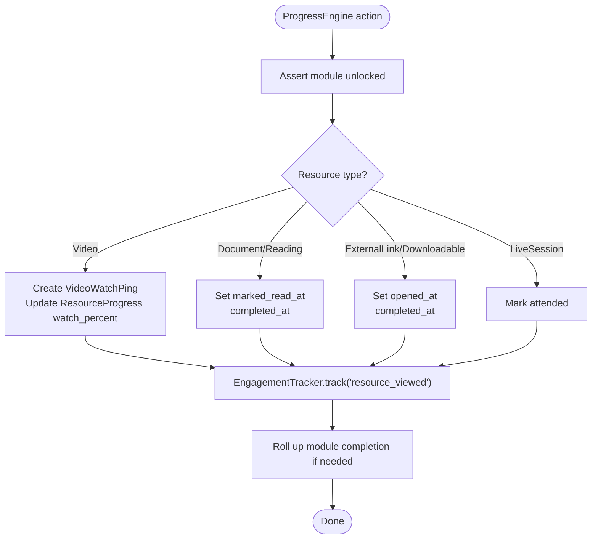

**Diagram sources**
- [ProgressEngine.php:218-286](file://app/Services/Progress/ProgressEngine.php#L218-L286)

**Section sources**
- [ProgressEngine.php:218-286](file://app/Services/Progress/ProgressEngine.php#L218-L286)
- [VideoWatchPing.php:14-24](file://app/Models/VideoWatchPing.php#L14-L24)
- [2024_01_01_000152_create_video_watch_pings_table.php:13-20](file://database/migrations/2024_01_01_000152_create_video_watch_pings_table.php#L13-L20)

### Assignment Submission: assignment_submitted
- When a student submits an assignment, the service creates the submission, calculates late penalties, then emits assignment_submitted with assignment context.
- After emission, it rolls up module completion.

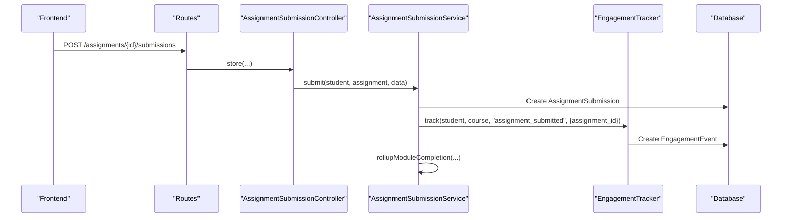

**Diagram sources**
- [api.php:159-167](file://routes/api.php#L159-L167)
- [AssignmentSubmissionService.php:37-67](file://app/Services/Assessment/AssignmentSubmissionService.php#L37-L67)
- [EngagementTracker.php:26-34](file://app/Services/Analytics/EngagementTracker.php#L26-L34)

**Section sources**
- [AssignmentSubmissionService.php:37-67](file://app/Services/Assessment/AssignmentSubmissionService.php#L37-L67)

### Evaluation Attempt: quiz_attempted
- On submitting answers, the service validates time limits, persists answers, emits quiz_attempted with evaluation and attempt context, then finalizes scoring and notifies.

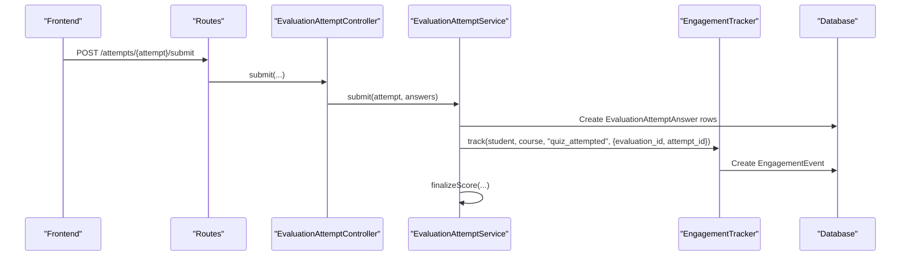

**Diagram sources**
- [api.php:184-188](file://routes/api.php#L184-L188)
- [EvaluationAttemptService.php:102-149](file://app/Services/Assessment/EvaluationAttemptService.php#L102-L149)
- [EngagementTracker.php:26-34](file://app/Services/Analytics/EngagementTracker.php#L26-L34)

**Section sources**
- [EvaluationAttemptService.php:102-149](file://app/Services/Assessment/EvaluationAttemptService.php#L102-L149)

### Frontend Triggers and Collection Patterns
- Video playback component periodically sends watch-progress pings while playing, aligning with backend behavior that completes resources at ≥90% watched.
- Dedicated hooks mutate progress via API calls for watch, mark-read, mark-opened, and attendance, invalidating local caches on success.

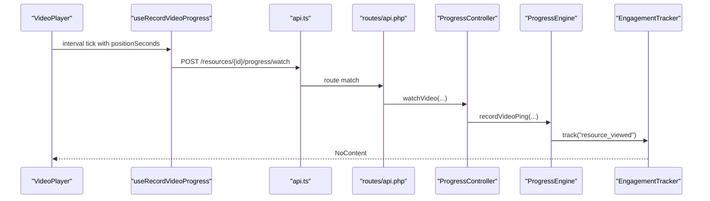

**Diagram sources**
- [ResourceViewerPage.tsx:65-108](file://frontend/src/features/learning/ResourceViewerPage.tsx#L65-L108)
- [api.ts (learning):14-16](file://frontend/src/features/learning/api.ts#L14-L16)
- [useLearning.ts:48-56](file://frontend/src/features/learning/useLearning.ts#L48-L56)
- [api.php:146-153](file://routes/api.php#L146-L153)
- [ProgressController.php:123-128](file://app/Http/Controllers/Api/V1/ProgressController.php#L123-L128)
- [ProgressEngine.php:218-244](file://app/Services/Progress/ProgressEngine.php#L218-L244)
- [EngagementTracker.php:26-34](file://app/Services/Analytics/EngagementTracker.php#L26-L34)

**Section sources**
- [ResourceViewerPage.tsx:65-108](file://frontend/src/features/learning/ResourceViewerPage.tsx#L65-L108)
- [api.ts (learning):14-16](file://frontend/src/features/learning/api.ts#L14-L16)
- [useLearning.ts:48-56](file://frontend/src/features/learning/useLearning.ts#L48-L56)

### Backend Processing and Validation
- Request-level validation ensures safe inputs (e.g., position_seconds must be a non-negative integer).
- Controllers authorize and delegate to services; services enforce business rules like module unlock checks.
- All resource consumption paths emit resource_viewed engagement events consistently.

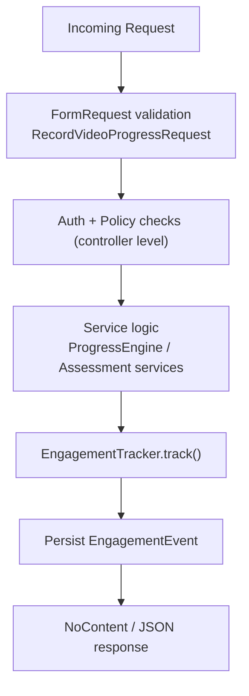

**Diagram sources**
- [RecordVideoProgressRequest.php:16-21](file://app/Http/Requests/Api/V1/RecordVideoProgressRequest.php#L16-L21)
- [ProgressController.php:123-149](file://app/Http/Controllers/Api/V1/ProgressController.php#L123-L149)
- [ProgressEngine.php:218-286](file://app/Services/Progress/ProgressEngine.php#L218-L286)
- [EngagementTracker.php:26-34](file://app/Services/Analytics/EngagementTracker.php#L26-L34)

**Section sources**
- [RecordVideoProgressRequest.php:16-21](file://app/Http/Requests/Api/V1/RecordVideoProgressRequest.php#L16-L21)
- [ProgressController.php:123-149](file://app/Http/Controllers/Api/V1/ProgressController.php#L123-L149)

### Data Storage Schema
- engagement_events: Stores student_id, course_id, event_type, event_meta, created_at; indexed for course+type and student_id queries.
- video_watch_pings: High-frequency per-second pings with student_id, resource_id, position_seconds, pinged_at; indexed for student+resource lookups.

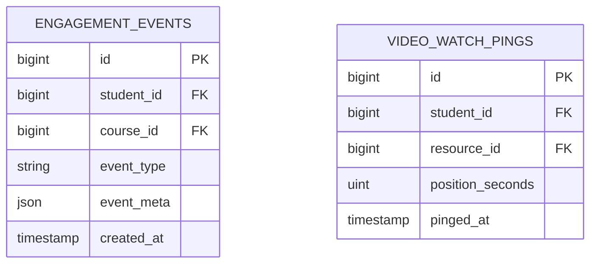

**Diagram sources**
- [2024_01_01_000190_create_engagement_events_table.php:13-23](file://database/migrations/2024_01_01_000190_create_engagement_events_table.php#L13-L23)
- [2024_01_01_000152_create_video_watch_pings_table.php:13-20](file://database/migrations/2024_01_01_000152_create_video_watch_pings_table.php#L13-L20)

**Section sources**
- [2024_01_01_000190_create_engagement_events_table.php:13-23](file://database/migrations/2024_01_01_000190_create_engagement_events_table.php#L13-L23)
- [2024_01_01_000152_create_video_watch_pings_table.php:13-20](file://database/migrations/2024_01_01_000152_create_video_watch_pings_table.php#L13-L20)

### Analytics Queries
- The analytics dashboard aggregates engagement events within a rolling window to compute counts by event_type.
- At-risk detection uses last engagement timestamps per student and enrollment grace/inactivity thresholds.

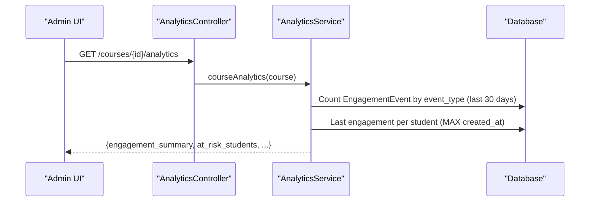

**Diagram sources**
- [AnalyticsController.php:17-22](file://app/Http/Controllers/Api/V1/AnalyticsController.php#L17-L22)
- [AnalyticsService.php:56-117](file://app/Services/Analytics/AnalyticsService.php#L56-L117)
- [AnalyticsService.php:147-154](file://app/Services/Analytics/AnalyticsService.php#L147-L154)

**Section sources**
- [AnalyticsController.php:17-22](file://app/Http/Controllers/Api/V1/AnalyticsController.php#L17-L22)
- [AnalyticsService.php:56-117](file://app/Services/Analytics/AnalyticsService.php#L56-L117)
- [AnalyticsService.php:147-154](file://app/Services/Analytics/AnalyticsService.php#L147-L154)

## Dependency Analysis
- Controllers depend on services; services depend on models and trackers.
- ProgressEngine depends on EngagementTracker to emit resource_viewed across all resource consumption paths.
- Assessment services depend on EngagementTracker to emit assignment_submitted and quiz_attempted.
- AnalyticsService reads EngagementEvent to produce metrics and at-risk flags.

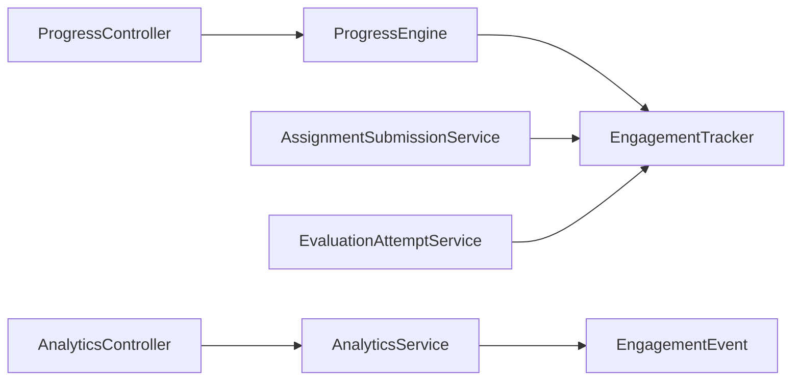

**Diagram sources**
- [ProgressController.php:123-149](file://app/Http/Controllers/Api/V1/ProgressController.php#L123-L149)
- [ProgressEngine.php:218-286](file://app/Services/Progress/ProgressEngine.php#L218-L286)
- [AssignmentSubmissionService.php:37-67](file://app/Services/Assessment/AssignmentSubmissionService.php#L37-L67)
- [EvaluationAttemptService.php:102-149](file://app/Services/Assessment/EvaluationAttemptService.php#L102-L149)
- [AnalyticsController.php:17-22](file://app/Http/Controllers/Api/V1/AnalyticsController.php#L17-L22)
- [AnalyticsService.php:56-117](file://app/Services/Analytics/AnalyticsService.php#L56-L117)

**Section sources**
- [ProgressController.php:123-149](file://app/Http/Controllers/Api/V1/ProgressController.php#L123-L149)
- [ProgressEngine.php:218-286](file://app/Services/Progress/ProgressEngine.php#L218-L286)
- [AssignmentSubmissionService.php:37-67](file://app/Services/Assessment/AssignmentSubmissionService.php#L37-L67)
- [EvaluationAttemptService.php:102-149](file://app/Services/Assessment/EvaluationAttemptService.php#L102-L149)
- [AnalyticsController.php:17-22](file://app/Http/Controllers/Api/V1/AnalyticsController.php#L17-L22)
- [AnalyticsService.php:56-117](file://app/Services/Analytics/AnalyticsService.php#L56-L117)

## Performance Considerations
- Write path simplicity: EngagementTracker performs a single create operation per event, minimizing overhead.
- Indexes: engagement_events indexes on course_id+event_type and student_id support efficient aggregation and last-engagement lookups.
- High-frequency pings: VideoWatchPing is designed for frequent writes; ensure database tuning and consider queueing or batching if traffic grows significantly.
- Batch processing opportunities:
  - Consider buffering multiple engagement events per request or per short time window and inserting in batches to reduce round trips.
  - For video pings, aggregate into periodic summaries (e.g., every N seconds) before persisting to lower write volume while preserving accuracy.
- Read optimization: AnalyticsService uses grouped queries and date filters to limit scan scope; ensure indexes remain effective as tables grow.
- Idempotency: ProgressEngine guards against progress on locked modules; ensure frontend retries do not duplicate critical side effects beyond harmless progress updates.

[No sources needed since this section provides general guidance]

## Troubleshooting Guide
- Module locked errors: If a student tries to record progress on a locked module, the system returns a forbidden error. Verify module unlock state and scheduling.
- Validation failures: Ensure position_seconds is a non-negative integer; other requests should conform to their respective FormRequest rules.
- Missing engagement events: Confirm that the correct service path is invoked (ProgressEngine for resource_viewed, assessment services for assignment_submitted/quiz_attempted).
- Analytics discrepancies: Check that events exist within the configured window and that course_id is correctly associated with each event.

**Section sources**
- [ProgressEngine.php:211-216](file://app/Services/Progress/ProgressEngine.php#L211-L216)
- [RecordVideoProgressRequest.php:16-21](file://app/Http/Requests/Api/V1/RecordVideoProgressRequest.php#L16-L21)
- [AnalyticsService.php:56-117](file://app/Services/Analytics/AnalyticsService.php#L56-L117)

## Conclusion
The Engagement Tracking system centralizes event capture through a minimal tracker and integrates tightly with progress and assessment services. Events are stored efficiently and consumed by analytics to provide actionable insights. With careful validation, clear ownership of write paths, and scalable storage patterns, the system supports high-volume engagement data while powering both real-time progress and long-term analytics.

[No sources needed since this section summarizes without analyzing specific files]