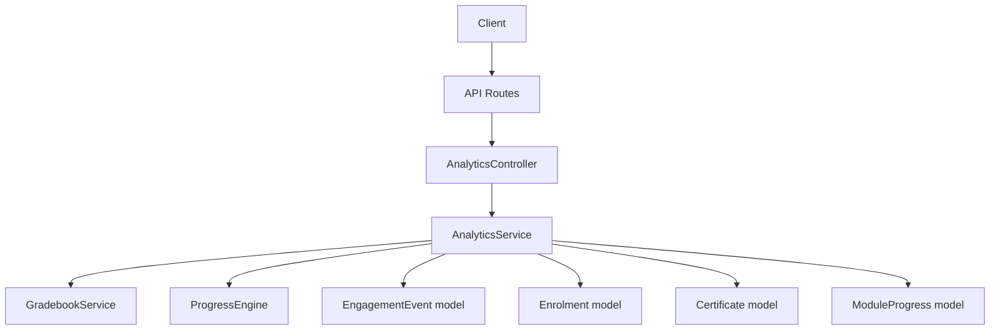
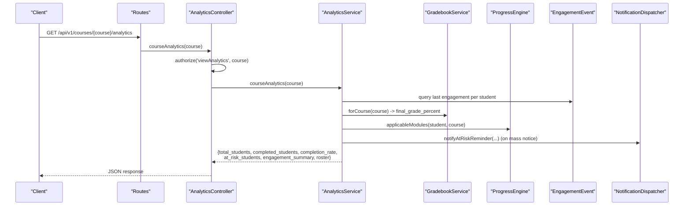
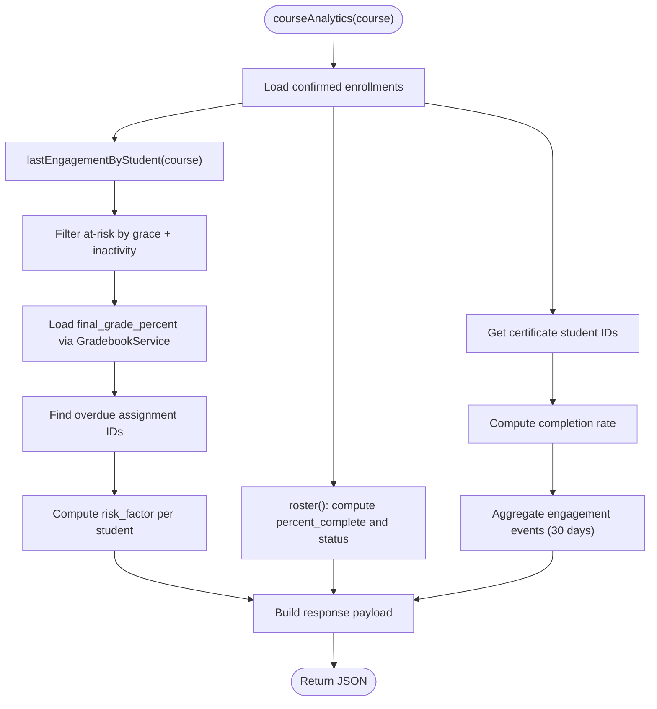
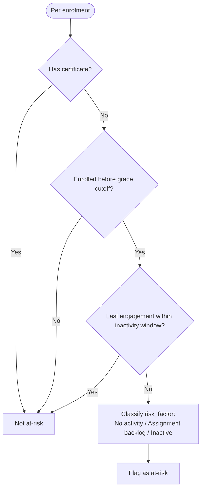
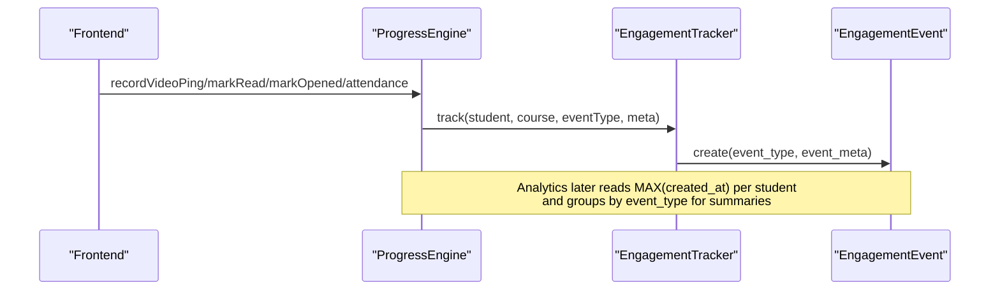
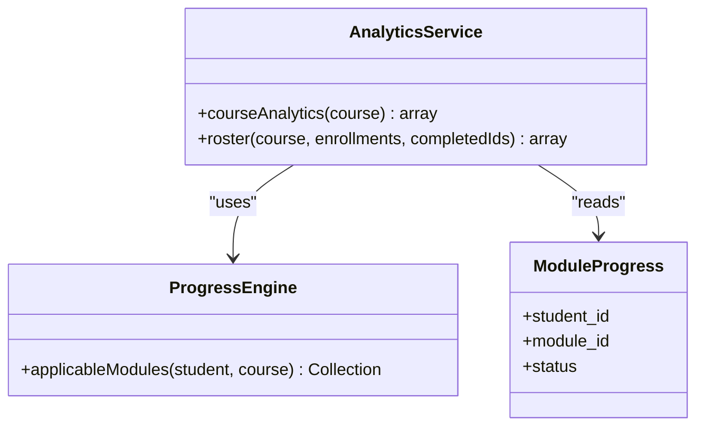
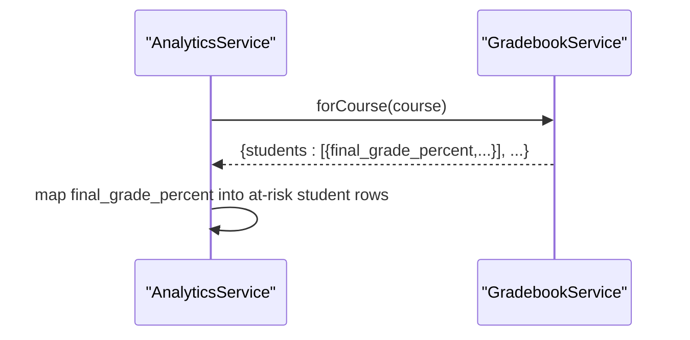
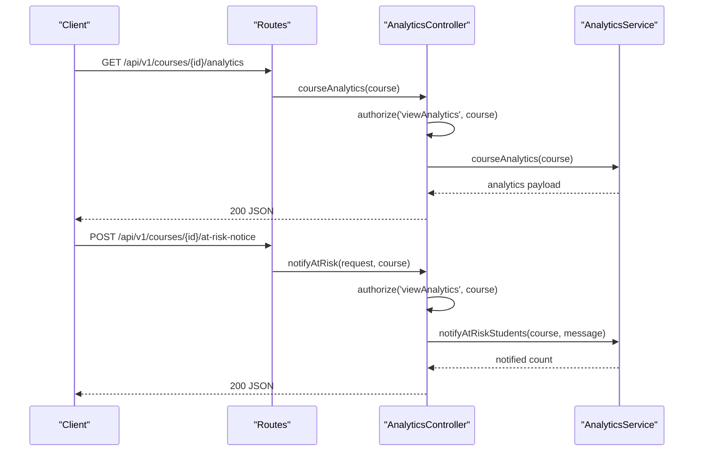
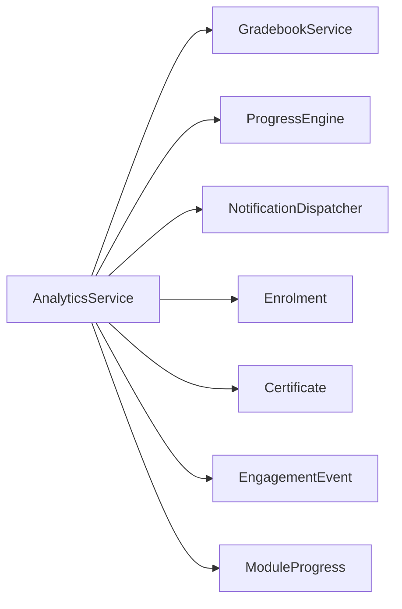

# Student Analytics

<cite>
**Referenced Files in This Document**
- [AnalyticsService.php](file://app/Services/Analytics/AnalyticsService.php)
- [EngagementTracker.php](file://app/Services/Analytics/EngagementTracker.php)
- [AnalyticsController.php](file://app/Http/Controllers/Api/V1/AnalyticsController.php)
- [api.php](file://routes/api.php)
- [ProgressEngine.php](file://app/Services/Progress/ProgressEngine.php)
- [GradebookService.php](file://app/Services/Assessment/GradebookService.php)
- [EngagementEvent.php](file://app/Models/EngagementEvent.php)
- [Enrolment.php](file://app/Models/Enrolment.php)
- [Certificate.php](file://app/Models/Certificate.php)
- [ModuleProgress.php](file://app/Models/ModuleProgress.php)
- [CourseAnalyticsTest.php](file://tests/Feature/Analytics/CourseAnalyticsTest.php)
- [AdminDashboardSummaryTest.php](file://tests/Feature/Analytics/AdminDashboardSummaryTest.php)
</cite>

## Table of Contents
1. [Introduction](#introduction)
2. [Project Structure](#project-structure)
3. [Core Components](#core-components)
4. [Architecture Overview](#architecture-overview)
5. [Detailed Component Analysis](#detailed-component-analysis)
6. [Dependency Analysis](#dependency-analysis)
7. [Performance Considerations](#performance-considerations)
8. [Troubleshooting Guide](#troubleshooting-guide)
9. [Conclusion](#conclusion)

## Introduction
This document explains the Student Analytics functionality that powers course-level insights: completion rates, engagement metrics, progress tracking, and at-risk student identification. It focuses on how analytics are computed by aggregating data from enrollment records, certificate issuance, module progress, and engagement events, and how these results are exposed through API endpoints. It also clarifies the relationship between analytics and other systems such as progress tracking and assessment grading.

## Project Structure
The analytics feature is implemented as a service layer with an API controller and supporting models/services:
- API routes expose analytics endpoints under authenticated middleware.
- The controller authorizes access and delegates to the analytics service.
- The analytics service aggregates data from multiple sources (enrollments, certificates, engagement events, gradebook, progress engine).
- Progress and assessment services feed signals into engagement events and module progress, which analytics reads.

**Diagram sources**
- [api.php:193-196](file://routes/api.php#L193-L196)
- [AnalyticsController.php:17-37](file://app/Http/Controllers/Api/V1/AnalyticsController.php#L17-L37)
- [AnalyticsService.php:56-117](file://app/Services/Analytics/AnalyticsService.php#L56-L117)

**Section sources**
- [api.php:193-196](file://routes/api.php#L193-L196)
- [AnalyticsController.php:17-37](file://app/Http/Controllers/Api/V1/AnalyticsController.php#L17-L37)

## Core Components
- AnalyticsService: Central aggregator for course analytics, at-risk detection, engagement summaries, roster, and system summary.
- EngagementTracker: Single write path for engagement events used by analytics.
- ProgressEngine: Computes module unlock/completion and emits engagement events when resources are consumed.
- GradebookService: Computes per-student final grades used in analytics.
- Models: Enrollment, Certificate, EngagementEvent, ModuleProgress provide the underlying data.

Key responsibilities:
- Completion rate: ratio of students who earned a certificate among confirmed enrollments.
- At-risk identification: based on grace period and inactivity window; enriched with assignment backlog signal.
- Engagement metrics: counts of event types within a rolling window.
- Roster: per-enrollment progress percentage and status (active or graduated).

**Section sources**
- [AnalyticsService.php:56-117](file://app/Services/Analytics/AnalyticsService.php#L56-L117)
- [AnalyticsService.php:166-213](file://app/Services/Analytics/AnalyticsService.php#L166-L213)
- [AnalyticsService.php:225-244](file://app/Services/Analytics/AnalyticsService.php#L225-L244)
- [EngagementTracker.php:26-34](file://app/Services/Analytics/EngagementTracker.php#L26-L34)
- [ProgressEngine.php:218-286](file://app/Services/Progress/ProgressEngine.php#L218-L286)
- [GradebookService.php:31-119](file://app/Services/Assessment/GradebookService.php#L31-L119)

## Architecture Overview
The analytics pipeline reads from several subsystems and returns structured responses:

**Diagram sources**
- [api.php:193-196](file://routes/api.php#L193-L196)
- [AnalyticsController.php:17-37](file://app/Http/Controllers/Api/V1/AnalyticsController.php#L17-L37)
- [AnalyticsService.php:56-117](file://app/Services/Analytics/AnalyticsService.php#L56-L117)
- [AnalyticsService.php:124-142](file://app/Services/Analytics/AnalyticsService.php#L124-L142)
- [ProgressEngine.php:109-118](file://app/Services/Progress/ProgressEngine.php#L109-L118)

## Detailed Component Analysis

### Course Analytics: completion rates, engagement, and roster
- Completion rate: calculated over confirmed enrollments using issued certificates for the course.
- At-risk students: filtered by grace period and inactivity window; enriched with risk_factor derived from overdue assignments and submission status.
- Engagement summary: aggregated event_type counts within a 30-day window.
- Roster: per enrolled student, computes percent_complete using applicable modules and ModuleProgress statuses; marks graduated if a certificate exists.

**Diagram sources**
- [AnalyticsService.php:56-117](file://app/Services/Analytics/AnalyticsService.php#L56-L117)
- [AnalyticsService.php:147-154](file://app/Services/Analytics/AnalyticsService.php#L147-L154)
- [AnalyticsService.php:166-213](file://app/Services/Analytics/AnalyticsService.php#L166-L213)
- [AnalyticsService.php:225-244](file://app/Services/Analytics/AnalyticsService.php#L225-L244)

**Section sources**
- [AnalyticsService.php:56-117](file://app/Services/Analytics/AnalyticsService.php#L56-L117)
- [AnalyticsService.php:147-154](file://app/Services/Analytics/AnalyticsService.php#L147-L154)
- [AnalyticsService.php:166-213](file://app/Services/Analytics/AnalyticsService.php#L166-L213)
- [AnalyticsService.php:225-244](file://app/Services/Analytics/AnalyticsService.php#L225-L244)

### At-Risk Identification Logic
- Grace period: students enrolled more than a configured number of days ago are eligible for at-risk consideration.
- Inactivity window: students without any engagement event within a configured number of days are considered inactive.
- Completed exclusion: students who have received a certificate are never flagged at-risk.
- Risk factor classification:
  - No activity: no engagement events recorded.
  - Assignment backlog: has overdue assignments not yet submitted.
  - Inactive: engaged but not meeting activity thresholds.

**Diagram sources**
- [AnalyticsService.php:166-213](file://app/Services/Analytics/AnalyticsService.php#L166-L213)

**Section sources**
- [AnalyticsService.php:166-213](file://app/Services/Analytics/AnalyticsService.php#L166-L213)

### Engagement Tracking and Metrics
- Engagement events are written only for course-scoped actions: resource_viewed, assignment_submitted, quiz_attempted.
- ProgressEngine triggers engagement events when video pings, mark-read, mark-opened, or attendance occur.
- Analytics aggregates event_type counts within a 30-day window for the course.

**Diagram sources**
- [ProgressEngine.php:218-286](file://app/Services/Progress/ProgressEngine.php#L218-L286)
- [EngagementTracker.php:26-34](file://app/Services/Analytics/EngagementTracker.php#L26-L34)
- [AnalyticsService.php:102-107](file://app/Services/Analytics/AnalyticsService.php#L102-L107)

**Section sources**
- [ProgressEngine.php:218-286](file://app/Services/Progress/ProgressEngine.php#L218-L286)
- [EngagementTracker.php:26-34](file://app/Services/Analytics/EngagementTracker.php#L26-L34)
- [AnalyticsService.php:102-107](file://app/Services/Analytics/AnalyticsService.php#L102-L107)

### Progress Integration and Roster Computation
- Applicable modules for a student are determined by group membership and ordering.
- Percent complete is computed by counting ModuleProgress rows marked completed against applicable module IDs.
- Status is set to graduated if a certificate exists; otherwise active.

**Diagram sources**
- [AnalyticsService.php:225-244](file://app/Services/Analytics/AnalyticsService.php#L225-L244)
- [ProgressEngine.php:109-118](file://app/Services/Progress/ProgressEngine.php#L109-L118)
- [ModuleProgress.php:15-27](file://app/Models/ModuleProgress.php#L15-L27)

**Section sources**
- [AnalyticsService.php:225-244](file://app/Services/Analytics/AnalyticsService.php#L225-L244)
- [ProgressEngine.php:109-118](file://app/Services/Progress/ProgressEngine.php#L109-L118)

### Assessment Grading Integration
- Final grade percent per student is sourced from GradebookService.forCourse(), which combines assignment scores and evaluation attempts.
- Analytics uses this value to surface final_grade_percent alongside at-risk student details.

**Diagram sources**
- [AnalyticsService.php:78-81](file://app/Services/Analytics/AnalyticsService.php#L78-L81)
- [GradebookService.php:31-119](file://app/Services/Assessment/GradebookService.php#L31-L119)

**Section sources**
- [AnalyticsService.php:78-81](file://app/Services/Analytics/AnalyticsService.php#L78-L81)
- [GradebookService.php:31-119](file://app/Services/Assessment/GradebookService.php#L31-L119)

### API Endpoints
- GET /api/v1/courses/{course}/analytics
  - Authorizes via policy viewAnalytics on the course.
  - Returns total_students, completed_students, completion_rate, at_risk_students, engagement_summary, roster.
- POST /api/v1/courses/{course}/at-risk-notice
  - Authorizes via policy viewAnalytics on the course.
  - Accepts optional message body.
  - Sends in-app reminders to all currently at-risk students and returns notified count.

**Diagram sources**
- [api.php:193-196](file://routes/api.php#L193-L196)
- [AnalyticsController.php:17-37](file://app/Http/Controllers/Api/V1/AnalyticsController.php#L17-L37)
- [AnalyticsService.php:124-142](file://app/Services/Analytics/AnalyticsService.php#L124-L142)

**Section sources**
- [api.php:193-196](file://routes/api.php#L193-L196)
- [AnalyticsController.php:17-37](file://app/Http/Controllers/Api/V1/AnalyticsController.php#L17-L37)
- [AnalyticsService.php:124-142](file://app/Services/Analytics/AnalyticsService.php#L124-L142)

### Concrete Examples
- Completion rate example:
  - Two confirmed enrollments; one student has a certificate. Completion rate is 50%.
  - Verified by test assertions on total_students, completed_students, and completion_rate.
- At-risk flags example:
  - Students enrolled long ago with no recent engagement are flagged at-risk.
  - Recently enrolled students are excluded due to grace period.
  - Completed students are never flagged even if quiet.
- Risk factor examples:
  - No activity: no engagement events.
  - Assignment backlog: overdue assignments exist and are not submitted.
  - Inactive: engagement exists but beyond inactivity window.
- Final grade integration:
  - For a graded assignment with final_score, final_grade_percent reflects the score relative to possible points.
- Roster example:
  - Active student with no completed modules shows percent_complete 0.0 and status active.
  - Student with all applicable modules completed shows percent_complete 100.0 and status active.
  - Student with a certificate shows status graduated regardless of module completion.

**Section sources**
- [CourseAnalyticsTest.php:29-47](file://tests/Feature/Analytics/CourseAnalyticsTest.php#L29-L47)
- [CourseAnalyticsTest.php:49-88](file://tests/Feature/Analytics/CourseAnalyticsTest.php#L49-L88)
- [CourseAnalyticsTest.php:99-133](file://tests/Feature/Analytics/CourseAnalyticsTest.php#L99-L133)
- [CourseAnalyticsTest.php:135-157](file://tests/Feature/Analytics/CourseAnalyticsTest.php#L135-L157)
- [CourseAnalyticsTest.php:159-188](file://tests/Feature/Analytics/CourseAnalyticsTest.php#L159-L188)

## Dependency Analysis
AnalyticsService depends on:
- GradebookService for final grades.
- ProgressEngine for applicable modules and module completion context.
- NotificationDispatcher for sending at-risk reminders.
- Models: Enrolment, Certificate, EngagementEvent, ModuleProgress for reading data.

**Diagram sources**
- [AnalyticsService.php:47-51](file://app/Services/Analytics/AnalyticsService.php#L47-L51)
- [AnalyticsService.php:56-117](file://app/Services/Analytics/AnalyticsService.php#L56-L117)

**Section sources**
- [AnalyticsService.php:47-51](file://app/Services/Analytics/AnalyticsService.php#L47-L51)
- [AnalyticsService.php:56-117](file://app/Services/Analytics/AnalyticsService.php#L56-L117)

## Performance Considerations
- Aggregations use grouped queries and pluck operations to minimize memory usage.
- Engagement summaries filter by a 30-day window to limit dataset size.
- Applicable modules are fetched per student only when building the roster; consider caching for large cohorts.
- At-risk filtering runs in-memory on loaded enrollments; for very large courses, consider database-side filters.

[No sources needed since this section provides general guidance]

## Troubleshooting Guide
Common issues and checks:
- Missing engagement events: ensure ProgressEngine methods are invoked for resource consumption actions; verify EngagementTracker writes events.
- Incorrect completion rate: confirm certificates are issued upon course completion and that enrollments are confirmed.
- At-risk misclassification: verify applied_at dates are backdated past grace period and that last engagement timestamps are older than inactivity window.
- Grade mismatch: check that submissions and evaluation attempts are graded and visible to GradebookService.

**Section sources**
- [ProgressEngine.php:218-286](file://app/Services/Progress/ProgressEngine.php#L218-L286)
- [EngagementTracker.php:26-34](file://app/Services/Analytics/EngagementTracker.php#L26-L34)
- [AnalyticsService.php:166-213](file://app/Services/Analytics/AnalyticsService.php#L166-L213)
- [GradebookService.php:31-119](file://app/Services/Assessment/GradebookService.php#L31-L119)

## Conclusion
Student Analytics consolidates enrollment, certification, engagement, and assessment data to deliver actionable insights. Completion rates reflect actual graduations, engagement metrics capture meaningful learning interactions, and at-risk identification leverages grace periods and inactivity windows to highlight students needing intervention. The API exposes these insights securely, enabling instructors and admins to monitor performance and take timely action.