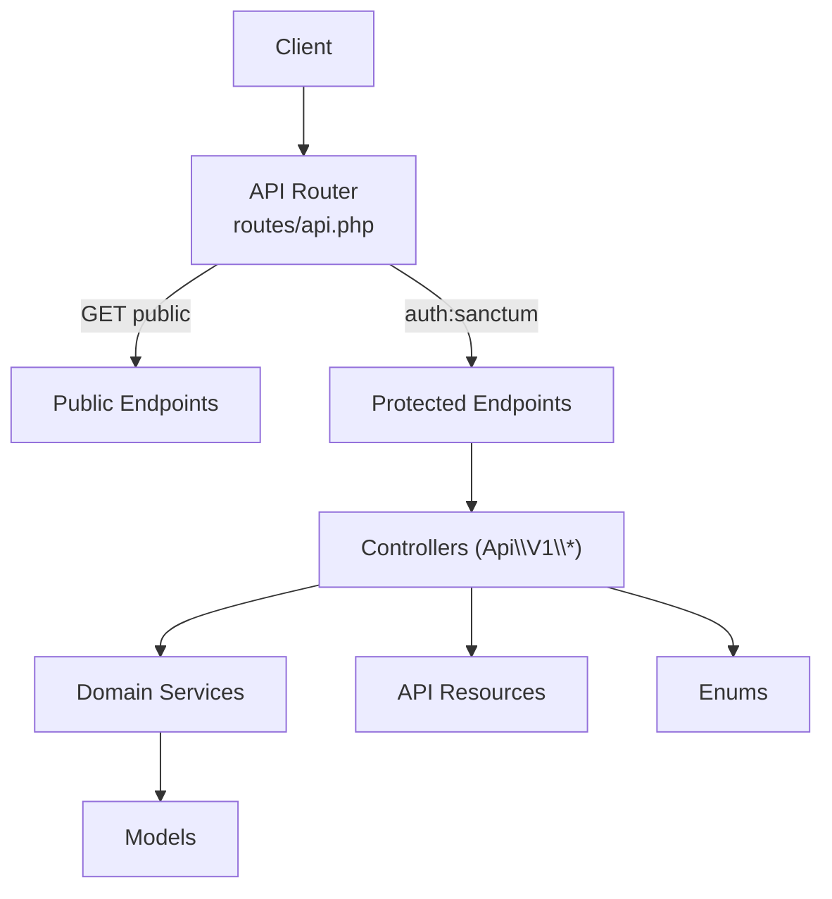
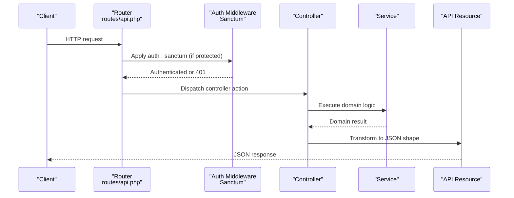
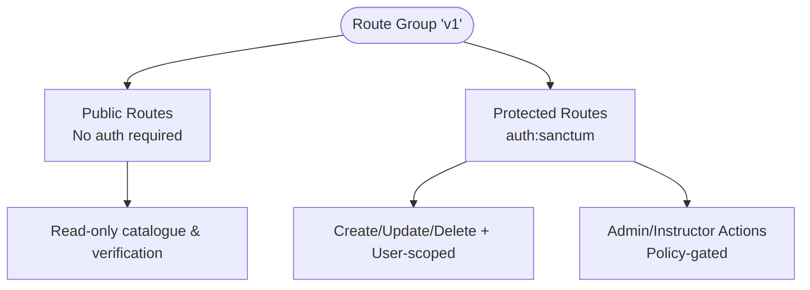
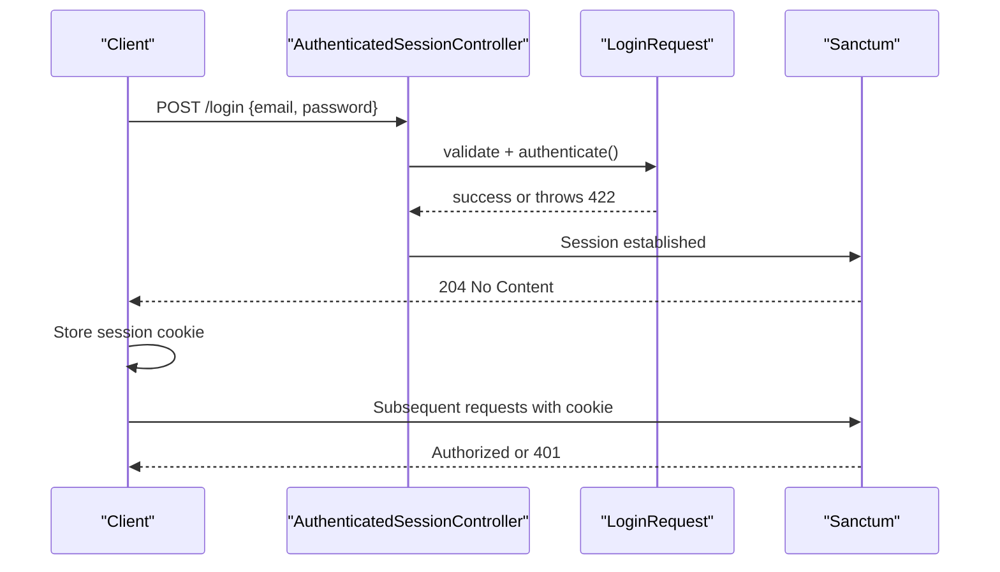
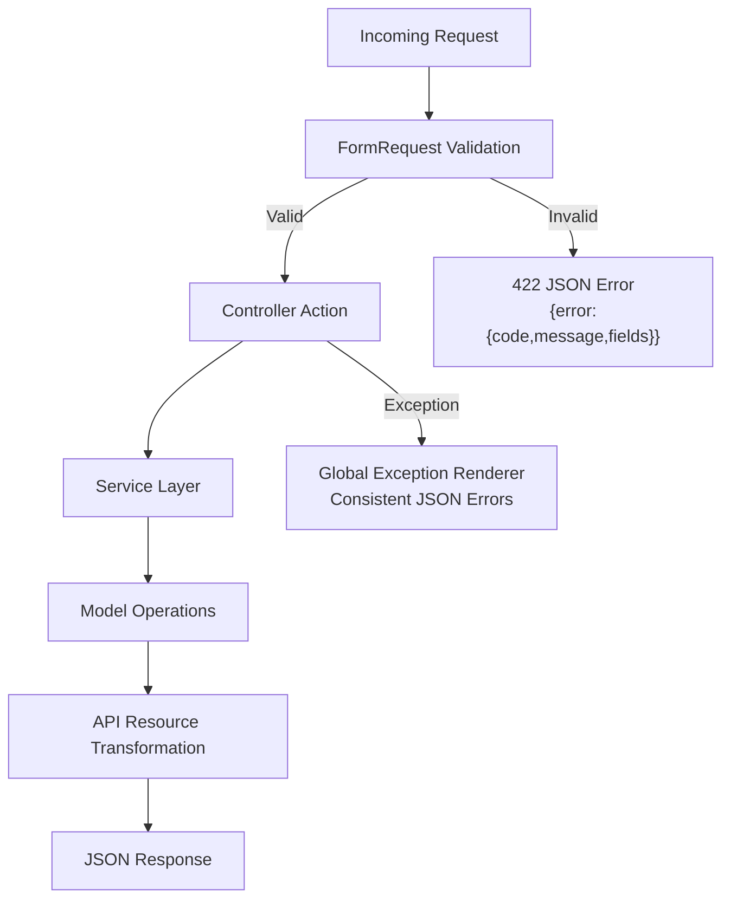
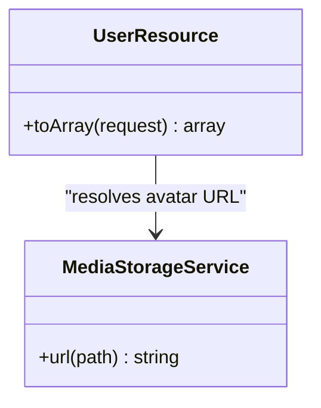
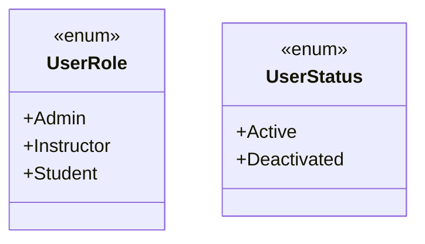
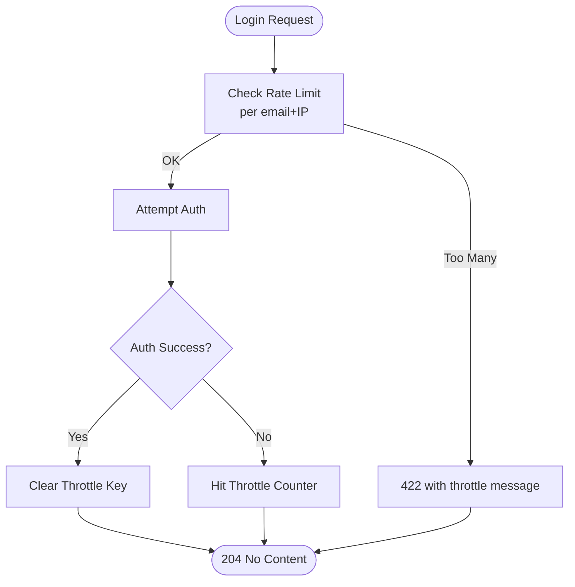
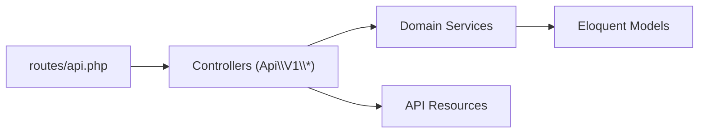
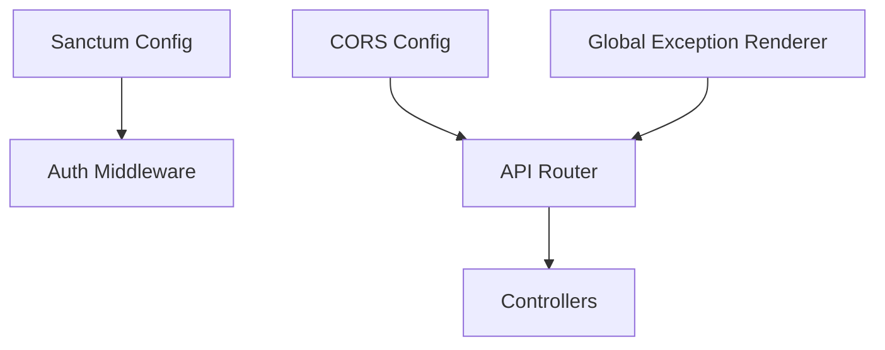

# API Design

<cite>
**Referenced Files in This Document**
- [routes/api.php](file://routes/api.php)
- [bootstrap/app.php](file://bootstrap/app.php)
- [config/sanctum.php](file://config/sanctum.php)
- [config/cors.php](file://config/cors.php)
- [app/Http/Controllers/Auth/AuthenticatedSessionController.php](file://app/Http/Controllers/Auth/AuthenticatedSessionController.php)
- [app/Http/Requests/Auth/LoginRequest.php](file://app/Http/Requests/Auth/LoginRequest.php)
- [app/Http/Resources/UserResource.php](file://app/Http/Resources/UserResource.php)
- [app/Enums/UserRole.php](file://app/Enums/UserRole.php)
- [app/Enums/UserStatus.php](file://app/Enums/UserStatus.php)
- [app/Services/Storage/MediaStorageService.php](file://app/Services/Storage/MediaStorageService.php)
</cite>

## Table of Contents
1. Introduction
2. Project Structure
3. Core Components
4. Architecture Overview
5. Detailed Component Analysis
6. Dependency Analysis
7. Performance Considerations
8. Troubleshooting Guide
9. Conclusion

## Introduction
This document describes the RESTful API design for versioned endpoints under /api/v1, including authentication with Laravel Sanctum, consistent JSON request/response formats, standardized error responses, resource transformation via API Resources, and the use of PHP enums for type safety. It also explains how endpoints map to the service layer and outlines patterns for input validation, rate limiting, and error handling.

## Project Structure
The API is organized by domain controllers under a single versioned prefix:
- Versioning: All public and protected routes are grouped under Route::prefix('v1').
- Public read endpoints: Catalogue browsing, certificate verification, and some progress reads do not require authentication.
- Protected endpoints: Mutations and user-scoped data are guarded by auth:sanctum middleware.
- Admin/instructor-only endpoints: Access is enforced via Policies within controllers; routes themselves are grouped under auth:sanctum.

**Diagram sources**
- [routes/api.php:49-242](file://routes/api.php#L49-L242)

**Section sources**
- [routes/api.php:49-242](file://routes/api.php#L49-L242)

## Core Components
- Authentication: Session-based login/logout flows using Laravel Sanctum for first-party SPAs.
- Authorization: Policy-driven access control on write endpoints.
- Request Validation: Strongly-typed FormRequest classes per endpoint group.
- Response Formatting: API Resources normalize model data into stable JSON shapes.
- Error Handling: Centralized exception rendering returns consistent JSON errors for JSON requests.
- Rate Limiting: Login attempts are throttled at the request level.

**Section sources**
- [config/sanctum.php:21-40](file://config/sanctum.php#L21-L40)
- [app/Http/Controllers/Auth/AuthenticatedSessionController.php:13-41](file://app/Http/Controllers/Auth/AuthenticatedSessionController.php#L13-L41)
- [app/Http/Requests/Auth/LoginRequest.php:30-87](file://app/Http/Requests/Auth/LoginRequest.php#L30-L87)
- [bootstrap/app.php:42-78](file://bootstrap/app.php#L42-L78)
- [app/Http/Resources/UserResource.php:11-38](file://app/Http/Resources/UserResource.php#L11-L38)

## Architecture Overview
The API follows a layered approach:
- Routing: Versioned routes define public vs. protected scopes.
- Controllers: Thin controllers delegate business logic to services and enforce authorization via policies.
- Services: Encapsulate domain operations (e.g., enrolment, assessment, communication).
- Data Layer: Eloquent models represent entities; API Resources transform them for clients.
- Cross-cutting: Sanctum handles authentication; CORS config supports credentials; exceptions render consistent JSON.

**Diagram sources**
- [routes/api.php:49-242](file://routes/api.php#L49-L242)
- [config/sanctum.php:21-40](file://config/sanctum.php#L21-L40)
- [app/Http/Resources/UserResource.php:11-38](file://app/Http/Resources/UserResource.php#L11-L38)

## Detailed Component Analysis

### API Versioning and Endpoint Naming
- Versioning: All routes are prefixed with v1.
- Naming conventions:
  - Resource-oriented paths: /categories, /courses, /modules, /assignments, etc.
  - Nested resources: /courses/{course}/modules, /assignments/{assignment}/submissions.
  - Action suffixes for non-CRUD operations: /enrolments/{id}/withdraw, /attempts/{attempt}/submit.
- Public vs. protected:
  - Public: GET /categories, GET /courses, GET /certificates/verify/{certificateNumber}.
  - Protected: Most POST/PATCH/DELETE and user-scoped GETs require auth:sanctum.

**Diagram sources**
- [routes/api.php:49-242](file://routes/api.php#L49-L242)

**Section sources**
- [routes/api.php:49-242](file://routes/api.php#L49-L242)

### Authentication with Laravel Sanctum
- Guard configuration: Sanctum uses the web guard for session-based auth.
- Stateful domains: Configured to allow cookies from SPA origins.
- Login flow:
  - POST /login authenticates via session and updates last_login_at.
  - Subsequent requests include session cookies; Sanctum validates the session.
- Logout flow:
  - Destroys session and regenerates CSRF token.

**Diagram sources**
- [app/Http/Controllers/Auth/AuthenticatedSessionController.php:13-41](file://app/Http/Controllers/Auth/AuthenticatedSessionController.php#L13-L41)
- [app/Http/Requests/Auth/LoginRequest.php:30-87](file://app/Http/Requests/Auth/LoginRequest.php#L30-L87)
- [config/sanctum.php:21-40](file://config/sanctum.php#L21-L40)

**Section sources**
- [config/sanctum.php:21-40](file://config/sanctum.php#L21-L40)
- [app/Http/Controllers/Auth/AuthenticatedSessionController.php:13-41](file://app/Http/Controllers/Auth/AuthenticatedSessionController.php#L13-L41)
- [app/Http/Requests/Auth/LoginRequest.php:30-87](file://app/Http/Requests/Auth/LoginRequest.php#L30-L87)

### Request and Response Format
- Requests:
  - JSON payloads validated by strongly-typed FormRequest classes per feature area.
  - File uploads handled via dedicated request classes where applicable.
- Responses:
  - Successful mutations return 204 No Content unless otherwise specified.
  - Data responses are transformed through API Resources to ensure stable schemas.
- Consistent JSON error envelope:
  - For JSON requests, exceptions are rendered as:
    - { error: { code, message, fields } }
  - Codes include validation_failed, unauthenticated, forbidden, not_found, http_error.

**Diagram sources**
- [bootstrap/app.php:42-78](file://bootstrap/app.php#L42-L78)
- [app/Http/Resources/UserResource.php:11-38](file://app/Http/Resources/UserResource.php#L11-L38)

**Section sources**
- [bootstrap/app.php:42-78](file://bootstrap/app.php#L42-L78)
- [app/Http/Resources/UserResource.php:11-38](file://app/Http/Resources/UserResource.php#L11-L38)

### Resource Transformation with API Resources
- Purpose: Normalize model attributes into client-friendly structures.
- Example: UserResource exposes role, name parts, email, avatar_url (resolved via storage), status, and timestamps in ISO-8601 format.
- Benefits:
  - Decouples internal model changes from API contracts.
  - Centralizes formatting rules (e.g., URLs, dates).

**Diagram sources**
- [app/Http/Resources/UserResource.php:11-38](file://app/Http/Resources/UserResource.php#L11-L38)
- [app/Services/Storage/MediaStorageService.php](file://app/Services/Storage/MediaStorageService.php)

**Section sources**
- [app/Http/Resources/UserResource.php:11-38](file://app/Http/Resources/UserResource.php#L11-L38)
- [app/Services/Storage/MediaStorageService.php](file://app/Services/Storage/MediaStorageService.php)

### Enum Usage for Type Safety and Status Codes
- Role and status values are represented by enums to avoid magic strings.
- Examples:
  - UserRole used to determine storage prefixes for avatars.
  - UserStatus used to mark account deactivation state.
- Advantages:
  - Compile-time safety and clear intent.
  - Stable serialized values in API responses.

**Diagram sources**
- [app/Enums/UserRole.php](file://app/Enums/UserRole.php)
- [app/Enums/UserStatus.php](file://app/Enums/UserStatus.php)

**Section sources**
- [app/Enums/UserRole.php](file://app/Enums/UserRole.php)
- [app/Enums/UserStatus.php](file://app/Enums/UserStatus.php)

### Input Validation and Rate Limiting
- Validation:
  - Each endpoint uses a dedicated FormRequest class defining rules and messages.
  - Validation failures produce 422 responses with field-level errors.
- Rate Limiting:
  - Login attempts are throttled per email+IP combination with lockout messaging.
  - Global API-wide throttling should be added for additional protection.

**Diagram sources**
- [app/Http/Requests/Auth/LoginRequest.php:30-87](file://app/Http/Requests/Auth/LoginRequest.php#L30-L87)

**Section sources**
- [app/Http/Requests/Auth/LoginRequest.php:30-87](file://app/Http/Requests/Auth/LoginRequest.php#L30-L87)

### Relationship Between API Endpoints and Service Layer
- Controllers act as entry points that:
  - Validate inputs via FormRequest.
  - Enforce authorization via Policies.
  - Delegate business logic to domain services.
- Services encapsulate complex workflows (e.g., enrolment, assessment, communication, progress tracking).
- This separation ensures:
  - Reusability across controllers and jobs.
  - Testable business logic independent of HTTP concerns.
  - Clear mapping from API surface to underlying capabilities.

**Diagram sources**
- [routes/api.php:49-242](file://routes/api.php#L49-L242)

**Section sources**
- [routes/api.php:49-242](file://routes/api.php#L49-L242)

## Dependency Analysis
- Authentication dependency:
  - Sanctum configured with web guard and stateful domains for SPA cookie support.
- CORS dependency:
  - Allowed origins include environment-driven frontend URL and local dev hosts; credentials supported.
- Error handling dependency:
  - Global exception renderer converts framework exceptions into consistent JSON for JSON requests.

**Diagram sources**
- [config/sanctum.php:21-40](file://config/sanctum.php#L21-L40)
- [config/cors.php:18-36](file://config/cors.php#L18-L36)
- [bootstrap/app.php:42-78](file://bootstrap/app.php#L42-L78)

**Section sources**
- [config/sanctum.php:21-40](file://config/sanctum.php#L21-L40)
- [config/cors.php:18-36](file://config/cors.php#L18-L36)
- [bootstrap/app.php:42-78](file://bootstrap/app.php#L42-L78)

## Performance Considerations
- Use API Resources to minimize payload size and avoid N+1 queries by eager loading related data in services/controllers before transformation.
- Prefer database-backed cache/session/queue stores in production for scalability and atomic locking.
- Add global API rate limiting to protect against abuse beyond login-specific throttling.
- Ensure CORS is explicitly configured for production origins to avoid unnecessary preflight overhead.

[No sources needed since this section provides general guidance]

## Troubleshooting Guide
- Authentication failures:
  - 401 responses indicate missing or invalid session; verify Sanctum stateful domains and CORS credentials.
- Authorization failures:
  - 403 responses mean the user lacks permission; check policy definitions and roles.
- Validation errors:
  - 422 responses include field-level errors; inspect FormRequest rules.
- Not found:
  - 404 responses indicate missing resources; verify route parameters and scoping.
- Network errors:
  - Non-JSON responses may bypass the global renderer; ensure requests expect JSON.

**Section sources**
- [bootstrap/app.php:42-78](file://bootstrap/app.php#L42-L78)

## Conclusion
The API provides a versioned, secure, and consistent interface built on Laravel best practices:
- Sanctum-based authentication with explicit CORS configuration.
- Strong input validation and centralized error handling producing uniform JSON responses.
- API Resources ensuring stable data contracts and clean serialization.
- Enums enforcing type safety across roles and statuses.
- Clear separation between controllers and services for maintainable, testable business logic.

[No sources needed since this section summarizes without analyzing specific files]