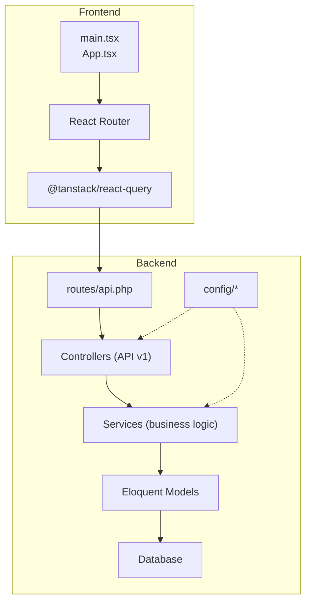
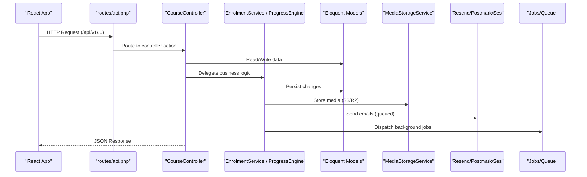
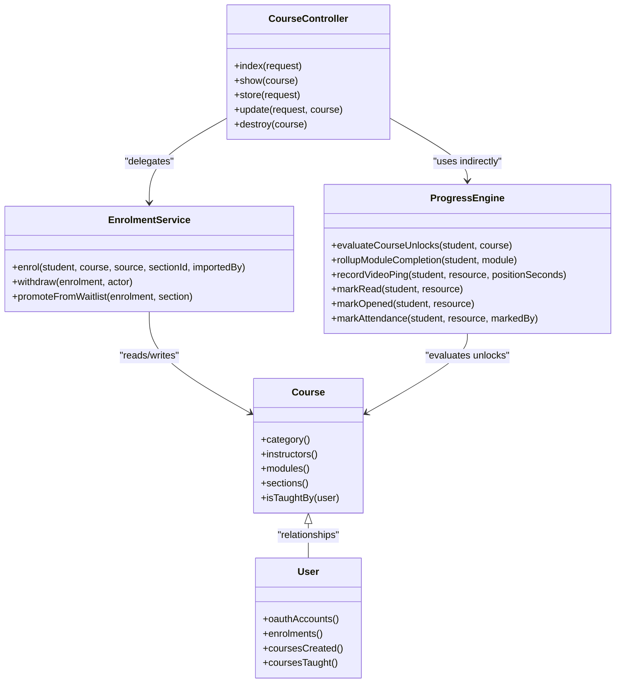
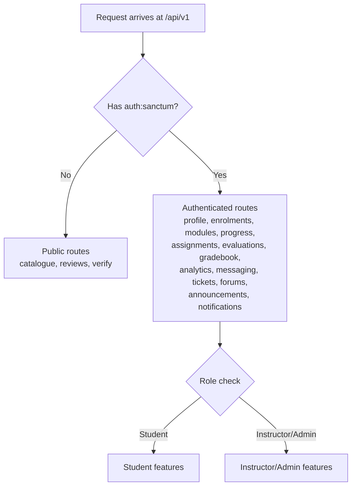
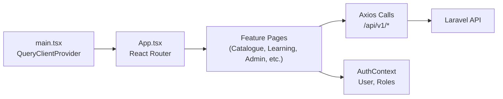
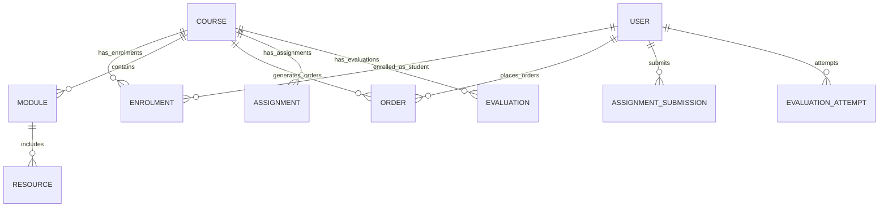
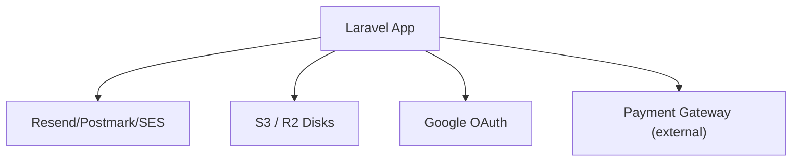
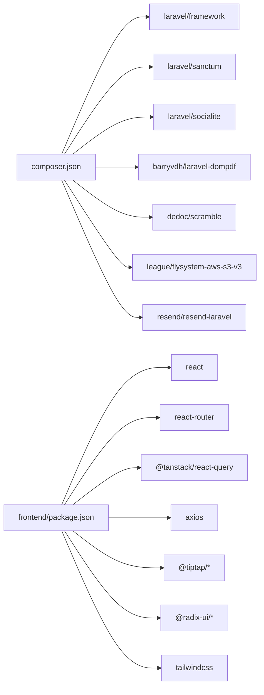

# Architecture & Design

<cite>
**Referenced Files in This Document**
- [composer.json](file://composer.json)
- [routes/api.php](file://routes/api.php)
- [config/app.php](file://config/app.php)
- [config/services.php](file://config/services.php)
- [config/filesystems.php](file://config/filesystems.php)
- [config/mail.php](file://config/mail.php)
- [app/Services/Enrolment/EnrolmentService.php](file://app/Services/Enrolment/EnrolmentService.php)
- [app/Services/Progress/ProgressEngine.php](file://app/Services/Progress/ProgressEngine.php)
- [app/Models/Course.php](file://app/Models/Course.php)
- [app/Models/User.php](file://app/Models/User.php)
- [app/Http/Controllers/Api/V1/CourseController.php](file://app/Http/Controllers/Api/V1/CourseController.php)
- [frontend/package.json](file://frontend/package.json)
- [frontend/src/main.tsx](file://frontend/src/main.tsx)
- [frontend/src/App.tsx](file://frontend/src/App.tsx)
</cite>

## Table of Contents
1. Introduction
2. Project Structure
3. Core Components
4. Architecture Overview
5. Detailed Component Analysis
6. Dependency Analysis
7. Performance Considerations
8. Troubleshooting Guide
9. Conclusion

## Introduction
This document describes the architecture and design of the ResNet Academy LMS system. It explains the service-oriented backend built on Laravel with a clear separation between controllers, services, models, and policies; the React frontend using component composition and React Query for state management; and the database design principles that support courses, modules, resources, assessments, progress tracking, communications, and payments. It also outlines system boundaries, integration points (AWS S3/R2, Resend email, payment gateways), and scalability considerations.

## Project Structure
The repository is split into two primary applications:
- Backend (Laravel): API-first application under app/, routes, config, database migrations, services, models, policies, jobs, mail, notifications, and console commands.
- Frontend (React + Vite): SPA under frontend/src with feature-based folders, shared UI components, routing, and React Query integration.

**Diagram sources**
- [frontend/src/main.tsx:1-61](file://frontend/src/main.tsx#L1-L61)
- [frontend/src/App.tsx:1-247](file://frontend/src/App.tsx#L1-L247)
- [routes/api.php:1-243](file://routes/api.php#L1-L243)
- [config/app.php:1-140](file://config/app.php#L1-L140)

**Section sources**
- [composer.json:1-98](file://composer.json#L1-L98)
- [frontend/package.json:1-91](file://frontend/package.json#L1-L91)
- [routes/api.php:1-243](file://routes/api.php#L1-L243)
- [config/app.php:1-140](file://config/app.php#L1-L140)

## Core Components
- Controllers: Thin HTTP layer handling request validation, authorization via policies, and delegating to services. Example: CourseController orchestrates catalog queries, media uploads, versioning, and notifications.
- Services: Encapsulate business rules and orchestrate cross-cutting concerns. Examples: EnrolmentService handles enrollment flows, waitlisting, orders, audit logging, emails, and progress initialization; ProgressEngine centralizes module unlocking and completion rollups.
- Models: Eloquent entities representing domain concepts (Course, User, Module, Resource, etc.) with relationships and casts.
- Policies: Authorization rules per model (e.g., CoursePolicy, ModulePolicy).
- Jobs/Notifications/Mail: Asynchronous tasks and queued notifications (e.g., SendEnrolmentConfirmationEmail, VerifyEmailQueued).
- Storage: MediaStorageService abstracts file storage via configured disks (local, S3, R2).
- Frontend: React app with feature-based structure, protected routes, and React Query for data fetching/caching.

**Section sources**
- [app/Http/Controllers/Api/V1/CourseController.php:1-147](file://app/Http/Controllers/Api/V1/CourseController.php#L1-L147)
- [app/Services/Enrolment/EnrolmentService.php:1-250](file://app/Services/Enrolment/EnrolmentService.php#L1-L250)
- [app/Services/Progress/ProgressEngine.php:1-288](file://app/Services/Progress/ProgressEngine.php#L1-L288)
- [app/Models/Course.php:1-180](file://app/Models/Course.php#L1-L180)
- [app/Models/User.php:1-100](file://app/Models/User.php#L1-L100)
- [config/filesystems.php:1-106](file://config/filesystems.php#L1-L106)
- [frontend/src/App.tsx:1-247](file://frontend/src/App.tsx#L1-L247)

## Architecture Overview
The system follows a service-oriented architecture with clear layering:
- API Routing: Centralized in routes/api.php, grouping public and authenticated endpoints under /api/v1.
- Controllers: Validate input, enforce authorization via policies, and delegate to services.
- Services: Implement core business logic, coordinate models, jobs, notifications, and external integrations.
- Models: Define data schema and relationships; encapsulate domain behavior where appropriate.
- External Integrations: Email via Resend/Postmark/Ses; object storage via AWS S3 or Cloudflare R2; OAuth via Google; payment gateway integration points through order/payment submission flows.

**Diagram sources**
- [routes/api.php:1-243](file://routes/api.php#L1-L243)
- [app/Http/Controllers/Api/V1/CourseController.php:1-147](file://app/Http/Controllers/Api/V1/CourseController.php#L1-L147)
- [app/Services/Enrolment/EnrolmentService.php:1-250](file://app/Services/Enrolment/EnrolmentService.php#L1-L250)
- [app/Services/Progress/ProgressEngine.php:1-288](file://app/Services/Progress/ProgressEngine.php#L1-L288)
- [config/filesystems.php:1-106](file://config/filesystems.php#L1-L106)
- [config/mail.php:1-119](file://config/mail.php#L1-L119)

## Detailed Component Analysis

### Backend MVC and Service Layer
- Controllers:
  - Thin HTTP handlers that validate requests, apply policies, and call services.
  - Example: CourseController filters catalogue results by role/status, handles thumbnail uploads via MediaStorageService, updates course versions, and notifies stakeholders.
- Services:
  - EnrolmentService: Orchestrates enrollment creation, waitlist handling, order creation, audit logging, confirmation emails, and progress initialization. Uses transactions and pessimistic locking for capacity checks.
  - ProgressEngine: Central authority for module unlock/completion logic, resource completion signals, video watch pings, attendance, and certificate issuance upon course completion.
- Models:
  - Course and User define relationships to enrolments, modules, instructors, orders, and more. Casts map enums and typed fields.
- Policies:
  - Per-model policies enforce access control for admin/instructor/student roles across CRUD operations.

**Diagram sources**
- [app/Http/Controllers/Api/V1/CourseController.php:1-147](file://app/Http/Controllers/Api/V1/CourseController.php#L1-L147)
- [app/Services/Enrolment/EnrolmentService.php:1-250](file://app/Services/Enrolment/EnrolmentService.php#L1-L250)
- [app/Services/Progress/ProgressEngine.php:1-288](file://app/Services/Progress/ProgressEngine.php#L1-L288)
- [app/Models/Course.php:1-180](file://app/Models/Course.php#L1-L180)
- [app/Models/User.php:1-100](file://app/Models/User.php#L1-L100)

**Section sources**
- [app/Http/Controllers/Api/V1/CourseController.php:1-147](file://app/Http/Controllers/Api/V1/CourseController.php#L1-L147)
- [app/Services/Enrolment/EnrolmentService.php:1-250](file://app/Services/Enrolment/EnrolmentService.php#L1-L250)
- [app/Services/Progress/ProgressEngine.php:1-288](file://app/Services/Progress/ProgressEngine.php#L1-L288)
- [app/Models/Course.php:1-180](file://app/Models/Course.php#L1-L180)
- [app/Models/User.php:1-100](file://app/Models/User.php#L1-L100)

### API Routing and Authentication
- Public endpoints: Catalogue browsing, reviews, certificate verification.
- Authenticated endpoints: Protected by Sanctum middleware; includes user profile, enrolments, course structure, progress, assignments, evaluations, gradebook, analytics, messaging, tickets, forums, announcements, and notifications.
- Role-based scoping: Controllers filter results based on user roles (student, instructor, admin).

**Diagram sources**
- [routes/api.php:1-243](file://routes/api.php#L1-L243)

**Section sources**
- [routes/api.php:1-243](file://routes/api.php#L1-L243)

### Frontend Architecture (React + React Query)
- Entry point: main.tsx initializes React Query client, error boundary, router, and auth context provider.
- Routing: App.tsx defines public and protected routes, role-gated pages, and feature areas (catalogue, learning, assessment, admin, communication).
- State Management: React Query manages server state caching, retries, and refetch strategies; local state handled within components.
- API Integration: Axios-based calls to Laravel API endpoints; authentication via Sanctum tokens managed in auth context.

**Diagram sources**
- [frontend/src/main.tsx:1-61](file://frontend/src/main.tsx#L1-L61)
- [frontend/src/App.tsx:1-247](file://frontend/src/App.tsx#L1-L247)

**Section sources**
- [frontend/src/main.tsx:1-61](file://frontend/src/main.tsx#L1-L61)
- [frontend/src/App.tsx:1-247](file://frontend/src/App.tsx#L1-L247)
- [frontend/package.json:1-91](file://frontend/package.json#L1-L91)

### Database Design Principles and Data Flow
- Entities: Users, Courses, Modules, Resources, Enrolments, Orders, Assignments, Evaluations, Attempts, Forums, Tickets, Notifications, Audit Logs.
- Relationships:
  - Course has many Modules, Enrolments, Orders, Applications, Reviews, Sections, QuestionBanks, Announcements, Tickets.
  - User has many Enrolments (as student), Orders (as student), CoursesCreated, CoursesTaught (via pivot).
- Data Flow:
  - Enrollment flow: EnrolmentService creates enrolment, optionally waitlists, creates Order, queues confirmation email, logs audit, triggers progress evaluation.
  - Progress flow: ProgressEngine evaluates unlocks based on schedule and previous completion; records resource progress signals; rolls up module completion; issues certificates on course completion.

**Diagram sources**
- [app/Models/Course.php:1-180](file://app/Models/Course.php#L1-L180)
- [app/Models/User.php:1-100](file://app/Models/User.php#L1-L100)
- [app/Services/Enrolment/EnrolmentService.php:1-250](file://app/Services/Enrolment/EnrolmentService.php#L1-L250)
- [app/Services/Progress/ProgressEngine.php:1-288](file://app/Services/Progress/ProgressEngine.php#L1-L288)

**Section sources**
- [app/Models/Course.php:1-180](file://app/Models/Course.php#L1-L180)
- [app/Models/User.php:1-100](file://app/Models/User.php#L1-L100)
- [app/Services/Enrolment/EnrolmentService.php:1-250](file://app/Services/Enrolment/EnrolmentService.php#L1-L250)
- [app/Services/Progress/ProgressEngine.php:1-288](file://app/Services/Progress/ProgressEngine.php#L1-L288)

### System Boundaries and External Integrations
- Email: Configured via Postmark, SES, Resend; default mailer selectable; queued notifications ensure resilience.
- Object Storage: Local disk for development; S3 and R2 disks configured for production media storage (thumbnails, attachments, receipts, certificates).
- OAuth: Google OAuth credentials configured for social login flows.
- Payments: Order and PaymentSubmission models/routes indicate integration points for payment gateways; admin confirms/rejects submissions.

**Diagram sources**
- [config/mail.php:1-119](file://config/mail.php#L1-L119)
- [config/filesystems.php:1-106](file://config/filesystems.php#L1-L106)
- [config/services.php:1-45](file://config/services.php#L1-L45)

**Section sources**
- [config/mail.php:1-119](file://config/mail.php#L1-L119)
- [config/filesystems.php:1-106](file://config/filesystems.php#L1-L106)
- [config/services.php:1-45](file://config/services.php#L1-L45)

## Dependency Analysis
- Backend Dependencies:
  - Laravel framework, Sanctum for API auth, Socialite for OAuth, DomPDF for certificates, Scramble for API docs, Flysystem S3 driver, Resend Laravel package.
- Frontend Dependencies:
  - React, React Router, React Query, Axios, TipTap editor, Radix UI primitives, Tailwind CSS, testing tools (Vitest, Playwright).

**Diagram sources**
- [composer.json:1-98](file://composer.json#L1-L98)
- [frontend/package.json:1-91](file://frontend/package.json#L1-L91)

**Section sources**
- [composer.json:1-98](file://composer.json#L1-L98)
- [frontend/package.json:1-91](file://frontend/package.json#L1-L91)

## Performance Considerations
- Database:
  - Use transactions and pessimistic locking for capacity-sensitive operations (e.g., seat counting during enrollment).
  - Index frequently queried columns (e.g., course_id, student_id, status) to optimize lookups.
- Queues:
  - Offload email sending and heavy processing to background jobs to keep API responses fast.
- Caching:
  - Leverage Laravel cache for read-heavy endpoints (e.g., catalogue listings) with appropriate invalidation strategies.
- Storage:
  - Use CDN-backed object storage (S3/R2) for static assets and media; configure proper cache headers.
- API:
  - Paginate large datasets; use selective field loading and eager loading to reduce N+1 queries.
- Frontend:
  - React Query caching and refetch strategies minimize redundant network calls; consider optimistic updates for better UX.

[No sources needed since this section provides general guidance]

## Troubleshooting Guide
- Authentication Issues:
  - Ensure Sanctum tokens are present and valid; verify CORS settings if frontend and backend are on different origins.
- Email Delivery Failures:
  - Check mailer configuration (Resend/Postmark/SES); confirm queue workers are running; inspect failed jobs table.
- File Upload Errors:
  - Validate storage disk configuration (S3/R2 keys, bucket, endpoint); ensure permissions and URLs are correctly set.
- Enrollment Race Conditions:
  - Confirm transactional enrollment logic and lockForUpdate usage; monitor for duplicate enrollments and waitlist promotions.
- Progress Not Updating:
  - Verify module unlock conditions and resource completion signals; check ProgressEngine methods and related events.

**Section sources**
- [config/mail.php:1-119](file://config/mail.php#L1-L119)
- [config/filesystems.php:1-106](file://config/filesystems.php#L1-L106)
- [app/Services/Enrolment/EnrolmentService.php:1-250](file://app/Services/Enrolment/EnrolmentService.php#L1-L250)
- [app/Services/Progress/ProgressEngine.php:1-288](file://app/Services/Progress/ProgressEngine.php#L1-L288)

## Conclusion
The ResNet Academy LMS employs a robust service-oriented architecture with clear separation of concerns across controllers, services, models, and policies. The backend leverages Laravel’s ecosystem for authentication, queuing, storage, and email, while the frontend uses React with React Query for efficient state management and API integration. The database design supports complex educational workflows including enrollment, progress tracking, assessments, and communications. External integrations are configured for scalability and reliability, and performance best practices are applied throughout the stack.

[No sources needed since this section summarizes without analyzing specific files]