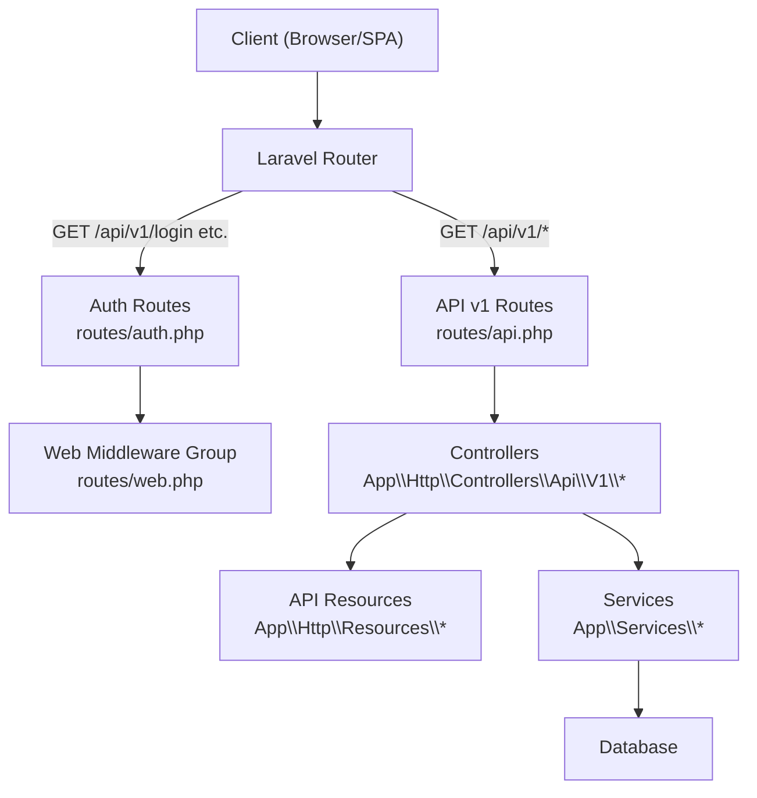
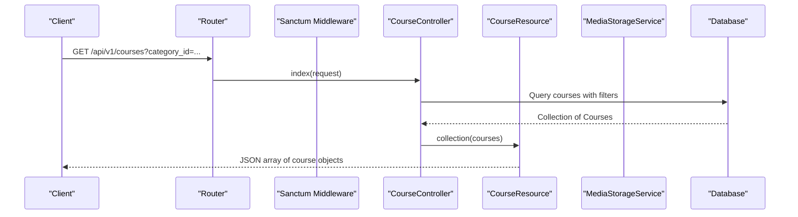
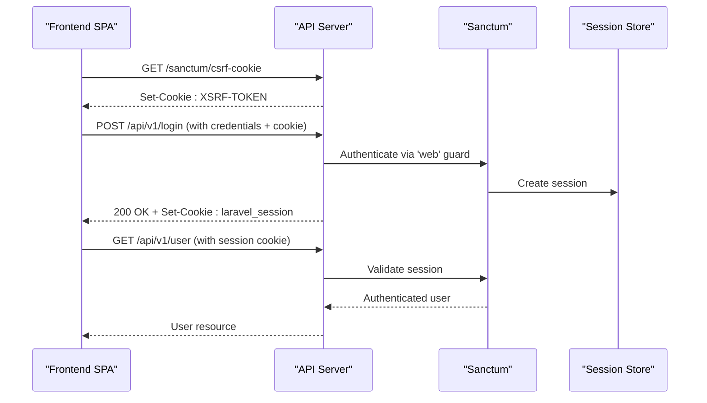
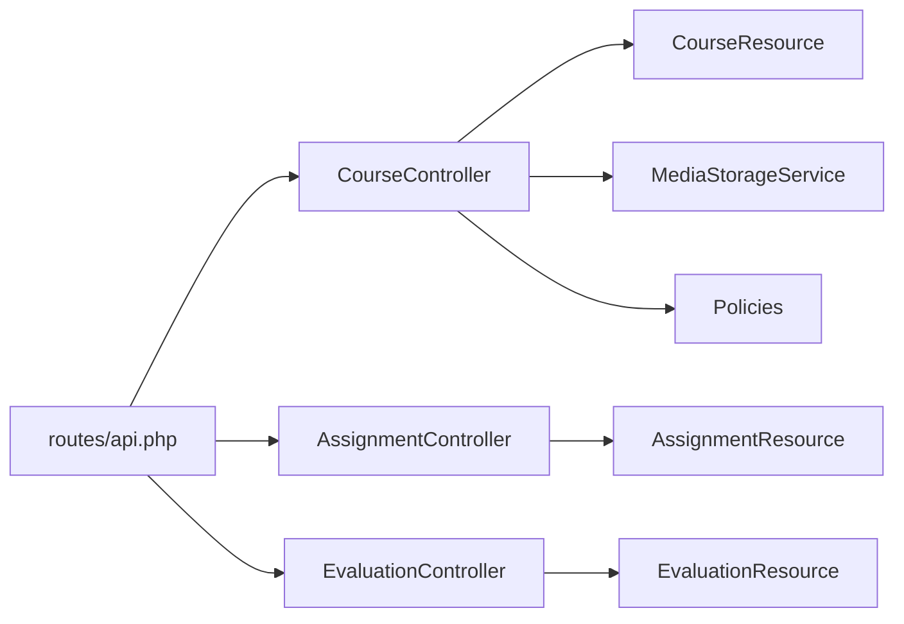

# API Design & Routing

<cite>
**Referenced Files in This Document**
- [routes/api.php](file://routes/api.php)
- [routes/web.php](file://routes/web.php)
- [routes/auth.php](file://routes/auth.php)
- [config/sanctum.php](file://config/sanctum.php)
- [config/cors.php](file://config/cors.php)
- [config/scramble.php](file://config/scramble.php)
- [app/Http/Controllers/Api/V1/CourseController.php](file://app/Http/Controllers/Api/V1/CourseController.php)
- [app/Http/Resources/CourseResource.php](file://app/Http/Resources/CourseResource.php)
- [app/Http/Middleware/EnsureProfileComplete.php](file://app/Http/Middleware/EnsureProfileComplete.php)
- [PRODUCTION_READINESS.md](file://PRODUCTION_READINESS.md)
</cite>

## Table of Contents
1. [Introduction](#introduction)
2. [Project Structure](#project-structure)
3. [Core Components](#core-components)
4. [Architecture Overview](#architecture-overview)
5. [Detailed Component Analysis](#detailed-component-analysis)
6. [Dependency Analysis](#dependency-analysis)
7. [Performance Considerations](#performance-considerations)
8. [Troubleshooting Guide](#troubleshooting-guide)
9. [Conclusion](#conclusion)
10. [Appendices](#appendices)

## Introduction
This document explains the API design and routing architecture for the application, focusing on:
- RESTful API structure under routes/api.php with a /api/v1 prefix
- Authentication using Laravel Sanctum (cookie-based session for SPA flows; bearer tokens supported via Sanctum guard)
- Request/response patterns, status codes, and error handling conventions
- Resource transformation through API Resources for consistent data formatting
- Web routes for server-side rendering and Blade templates
- Rate limiting, CORS configuration, and API security measures
- API documentation generation, testing strategies, and client integration guidelines
- Examples of common API operations and expected behaviors

## Project Structure
The API is organized by versioned routes under routes/api.php with a v1 prefix. Public read endpoints are exposed without authentication, while write endpoints require authentication via Sanctum. Web routes handle server-side rendering and SPA auth flows under a shared /api/v1 prefix for consistency.

**Diagram sources**
- [routes/api.php:49-241](file://routes/api.php#L49-L241)
- [routes/web.php:23-46](file://routes/web.php#L23-L46)
- [routes/auth.php:11-37](file://routes/auth.php#L11-L37)

**Section sources**
- [routes/api.php:49-241](file://routes/api.php#L49-L241)
- [routes/web.php:23-46](file://routes/web.php#L23-L46)
- [routes/auth.php:11-37](file://routes/auth.php#L11-L37)

## Core Components
- Versioned API routes: All API endpoints are grouped under a v1 prefix to support future evolution.
- Authentication: Sanctum is used for both cookie-based SPA sessions and token-based APIs. Protected routes use the auth:sanctum middleware.
- Authorization: Policies enforce role-based access (admin/instructor/student) on controllers.
- Data shaping: API Resources transform models into consistent JSON responses.
- Validation: Form Request classes validate input before reaching controllers.
- Error handling: Standardized error responses and status codes are returned from controllers and middleware.

Key examples:
- Course listing and detail endpoints demonstrate public reads and filtered queries.
- Profile completion middleware enforces business rules before allowing sensitive actions.

**Section sources**
- [routes/api.php:49-241](file://routes/api.php#L49-L241)
- [config/sanctum.php:21-40](file://config/sanctum.php#L21-L40)
- [app/Http/Controllers/Api/V1/CourseController.php:33-76](file://app/Http/Controllers/Api/V1/CourseController.php#L33-L76)
- [app/Http/Resources/CourseResource.php:16-43](file://app/Http/Resources/CourseResource.php#L16-L43)
- [app/Http/Middleware/EnsureProfileComplete.php:42-57](file://app/Http/Middleware/EnsureProfileComplete.php#L42-L57)

## Architecture Overview
The system separates concerns across routing, controllers, services, resources, and storage. Authentication and authorization are enforced at the route and controller levels. API Resources ensure consistent response shapes.

**Diagram sources**
- [routes/api.php:53-55](file://routes/api.php#L53-L55)
- [app/Http/Controllers/Api/V1/CourseController.php:33-71](file://app/Http/Controllers/Api/V1/CourseController.php#L33-L71)
- [app/Http/Resources/CourseResource.php:16-43](file://app/Http/Resources/CourseResource.php#L16-L43)

## Detailed Component Analysis

### API Routing and Versioning
- Base path: /api/v1
- Public endpoints: catalogue browsing, reviews, certificate verification
- Protected endpoints: user profile, enrolments, modules, assignments, evaluations, forums, tickets, notifications
- Grouping:
  - Public group: GET endpoints for catalogue and public resources
  - Authenticated group: POST/PATCH/DELETE for content management and user actions
  - Admin routes: admin-only endpoints under /admin/*

Example endpoints:
- GET /api/v1/categories
- GET /api/v1/courses/{course}
- POST /api/v1/courses (authenticated)
- PATCH /api/v1/courses/{course} (authenticated)
- DELETE /api/v1/courses/{course} (authenticated)

**Section sources**
- [routes/api.php:49-241](file://routes/api.php#L49-L241)

### Authentication with Laravel Sanctum
- SPA flows: Cookie-based authentication via web middleware group under /api/v1 (login/register/logout).
- Token flows: Bearer token authentication supported via Sanctum guard for stateless clients.
- Stateful domains: Configured via SANCTUM_STATEFUL_DOMAINS and FRONTEND_URL for cross-origin cookies.
- CSRF: For SPA cookie flows, obtain CSRF cookie first when making credentialed requests.

**Diagram sources**
- [routes/web.php:23-46](file://routes/web.php#L23-L46)
- [routes/auth.php:11-37](file://routes/auth.php#L11-L37)
- [config/sanctum.php:21-40](file://config/sanctum.php#L21-L40)

**Section sources**
- [config/sanctum.php:21-40](file://config/sanctum.php#L21-L40)
- [routes/web.php:23-46](file://routes/web.php#L23-L46)
- [routes/auth.php:11-37](file://routes/auth.php#L11-L37)

### Request/Response Patterns and Status Codes
- Success responses:
  - 200 OK for GET and successful updates
  - 201 Created for successful creation (e.g., store methods returning resources)
  - 204 No Content for successful deletions
- Errors:
  - 401 Unauthorized for missing or invalid authentication
  - 403 Forbidden for policy failures or incomplete profiles
  - 422 Unprocessable Entity for validation errors (via Form Requests)
  - 404 Not Found for missing resources
- Consistent shape:
  - Use API Resources to normalize payloads and include timestamps, relationships, and computed fields

Examples:
- Course deletion returns no content on success.
- Profile completion middleware returns 403 with structured error details when required fields are missing.

**Section sources**
- [app/Http/Controllers/Api/V1/CourseController.php:138-145](file://app/Http/Controllers/Api/V1/CourseController.php#L138-L145)
- [app/Http/Middleware/EnsureProfileComplete.php:42-57](file://app/Http/Middleware/EnsureProfileComplete.php#L42-L57)

### Resource Transformation with API Resources
- Purpose: Centralize response formatting, include related data conditionally, and convert enums/dates to stable formats.
- Example: CourseResource serializes model attributes, transforms enums to values, resolves media URLs, and includes nested category and instructors.

Benefits:
- Consistency across endpoints
- Decoupling of domain models from API contracts
- Easy pagination and relationship inclusion

**Section sources**
- [app/Http/Resources/CourseResource.php:16-43](file://app/Http/Resources/CourseResource.php#L16-L43)

### Web Routes and Blade Templates
- Web routes serve Blade views and SPA auth flows under /api/v1 for unified URL surface.
- Includes login/register/password reset/email verification/social auth callbacks.
- Session-based operations (logout, deactivation requests) run under web middleware to ensure reliable session handling.

**Section sources**
- [routes/web.php:9-46](file://routes/web.php#L9-L46)
- [routes/auth.php:11-37](file://routes/auth.php#L11-L37)

### Rate Limiting
- Current state: No explicit throttle middleware applied to API routes in routes/api.php.
- Recommendation: Add global rate limiting to the API middleware group and stricter limits for sensitive endpoints (login, registration, password reset, payment submissions).
- Implementation approach: Define named rate limiters in a service provider and apply via middleware groups.

Note: The repository’s production readiness notes highlight this gap and provide guidance.

**Section sources**
- [PRODUCTION_READINESS.md:98-108](file://PRODUCTION_READINESS.md#L98-L108)

### CORS Configuration
- Paths and methods: Allow all paths and methods for flexibility during development.
- Allowed origins: Configurable via environment variables and defaults for local dev.
- Credentials: Supports credentials for SPA cookie flows.

Recommendation: Pin allowed_origins to exact production frontend URLs and test cross-origin behavior in staging.

**Section sources**
- [config/cors.php:18-36](file://config/cors.php#L18-L36)
- [PRODUCTION_READINESS.md:110-124](file://PRODUCTION_READINESS.md#L110-L124)

### API Security Measures
- Authentication: Sanctum guards for both cookie and token flows.
- Authorization: Policies enforce role-based access per resource.
- Input validation: Form Request classes ensure safe inputs.
- Documentation: Scramble configured to generate OpenAPI docs with security schemes based on middleware.

**Section sources**
- [config/sanctum.php:21-40](file://config/sanctum.php#L21-L40)
- [config/scramble.php:151-186](file://config/scramble.php#L151-L186)

### API Documentation Generation
- Tool: Scramble generates interactive OpenAPI documentation.
- Coverage: API path set to api; security scheme derived from middleware (cookie-based for SPA flows).
- Access: Docs served under default UI path with restricted access middleware.

Usage:
- Browse generated docs to explore endpoints, schemas, and auth requirements.
- Export OpenAPI spec for external tooling.

**Section sources**
- [config/scramble.php:23-62](file://config/scramble.php#L23-L62)
- [config/scramble.php:151-186](file://config/scramble.php#L151-L186)

### Testing Strategies
- Feature tests cover authentication, enrolment, assessments, analytics, communication, and more.
- Focus areas:
  - Auth flows (register, login, email verification, password reset)
  - Catalogue endpoints (public reads)
  - Protected endpoints (auth required)
  - Policy enforcement (admin/instructor/student)
  - Resource serialization and pagination
- Recommendations:
  - Add contract tests for API Resources to ensure schema stability
  - Include rate-limiting tests once implemented
  - Test CORS behavior in cross-origin scenarios

**Section sources**
- [tests/Feature/Auth/AuthenticationTest.php](file://tests/Feature/Auth/AuthenticationTest.php)
- [tests/Feature/Catalogue/CourseCatalogueTest.php](file://tests/Feature/Catalogue/CourseCatalogueTest.php)

### Client Integration Guidelines
- SPA cookie flow:
  - Fetch CSRF cookie before authenticated requests
  - Send requests with credentials enabled
  - Handle redirects for email verification and OAuth callbacks
- Token flow:
  - Use bearer tokens where appropriate (stateless clients)
  - Respect rate limits and error responses
- Pagination and filtering:
  - Use query parameters for filtering (e.g., category_id, level, schedule dates)
  - Handle paginated collections in responses

**Section sources**
- [routes/web.php:23-46](file://routes/web.php#L23-L46)
- [routes/auth.php:11-37](file://routes/auth.php#L11-L37)
- [app/Http/Controllers/Api/V1/CourseController.php:33-71](file://app/Http/Controllers/Api/V1/CourseController.php#L33-L71)

## Dependency Analysis
The API depends on controllers, services, policies, and resources. Routes map to controllers, which delegate to services for complex logic and return resources for consistent responses.

**Diagram sources**
- [routes/api.php:49-241](file://routes/api.php#L49-L241)
- [app/Http/Controllers/Api/V1/CourseController.php:25-28](file://app/Http/Controllers/Api/V1/CourseController.php#L25-L28)
- [app/Http/Resources/CourseResource.php:16-43](file://app/Http/Resources/CourseResource.php#L16-L43)

**Section sources**
- [routes/api.php:49-241](file://routes/api.php#L49-L241)
- [app/Http/Controllers/Api/V1/CourseController.php:25-28](file://app/Http/Controllers/Api/V1/CourseController.php#L25-L28)

## Performance Considerations
- Eager loading: Controllers load necessary relationships to avoid N+1 queries.
- Pagination: List endpoints paginate results to reduce payload size.
- Media storage: Offload file operations to storage services to keep request cycles fast.
- Rate limiting: Implement to protect against abuse and stabilize performance under load.
- CORS: Ensure minimal overhead by restricting allowed origins in production.

[No sources needed since this section provides general guidance]

## Troubleshooting Guide
Common issues and resolutions:
- Authentication failures:
  - Verify CSRF cookie fetch for SPA flows
  - Check Sanctum stateful domains and CORS settings
- Authorization errors:
  - Review policies for role-based access
  - Ensure user roles are correctly assigned
- Validation errors:
  - Inspect Form Request rules and client payloads
- Profile completion blocks:
  - Use middleware error response to identify missing fields and guide users

**Section sources**
- [config/sanctum.php:21-40](file://config/sanctum.php#L21-L40)
- [config/cors.php:18-36](file://config/cors.php#L18-L36)
- [app/Http/Middleware/EnsureProfileComplete.php:42-57](file://app/Http/Middleware/EnsureProfileComplete.php#L42-L57)

## Conclusion
The API follows a clear, versioned RESTful structure with robust authentication via Sanctum, consistent resource transformation, and strong separation of concerns. While current implementation lacks explicit rate limiting, the foundation is solid for scaling and securing the API. Documentation generation via Scramble aids client integration, and comprehensive feature tests ensure reliability.

[No sources needed since this section summarizes without analyzing specific files]

## Appendices

### Common API Operations and Expected Behaviors
- List courses with filters:
  - GET /api/v1/courses?category_id=1&level=basic&schedule_from=2024-01-01&schedule_to=2024-12-31
  - Response: Paginated list of course resources
- Get course details:
  - GET /api/v1/courses/{course}
  - Response: Single course resource with category and instructors
- Create course (authenticated):
  - POST /api/v1/courses
  - Request: Validated course data with optional thumbnail
  - Response: Created course resource
- Update course (authenticated):
  - PATCH /api/v1/courses/{course}
  - Response: Updated course resource
- Delete course (authenticated):
  - DELETE /api/v1/courses/{course}
  - Response: 204 No Content

**Section sources**
- [routes/api.php:53-75](file://routes/api.php#L53-L75)
- [app/Http/Controllers/Api/V1/CourseController.php:33-145](file://app/Http/Controllers/Api/V1/CourseController.php#L33-L145)
- [app/Http/Resources/CourseResource.php:16-43](file://app/Http/Resources/CourseResource.php#L16-L43)