# Backend Architecture

<cite>
**Referenced Files in This Document**
- [routes/api.php](file://routes/api.php)
- [app/Http/Controllers/Controller.php](file://app/Http/Controllers/Controller.php)
- [app/Http/Controllers/Api/V1/CourseController.php](file://app/Http/Controllers/Api/V1/CourseController.php)
- [app/Services/Enrolment/EnrolmentService.php](file://app/Services/Enrolment/EnrolmentService.php)
- [app/Models/User.php](file://app/Models/User.php)
- [app/Policies/CoursePolicy.php](file://app/Policies/CoursePolicy.php)
- [app/Http/Resources/CourseResource.php](file://app/Http/Resources/CourseResource.php)
- [app/Http/Middleware/EnsureProfileComplete.php](file://app/Http/Middleware/EnsureProfileComplete.php)
- [app/Http/Requests/Api/V1/StoreCourseRequest.php](file://app/Http/Requests/Api/V1/StoreCourseRequest.php)
- [config/sanctum.php](file://config/sanctum.php)
</cite>

## Table of Contents
1. [Introduction](#introduction)
2. [Project Structure](#project-structure)
3. [Core Components](#core-components)
4. [Architecture Overview](#architecture-overview)
5. [Detailed Component Analysis](#detailed-component-analysis)
6. [Dependency Analysis](#dependency-analysis)
7. [Performance Considerations](#performance-considerations)
8. [Troubleshooting Guide](#troubleshooting-guide)
9. [Conclusion](#conclusion)

## Introduction
This document describes the Laravel backend architecture with a focus on MVC separation, service-oriented business logic, Eloquent models, policy-based authorization, API routing and versioning, middleware usage, request validation, and response transformation via resources. The system is organized around clear boundaries: controllers handle HTTP concerns, services encapsulate domain logic, models represent data and relationships, policies enforce fine-grained access control, and resources standardize API responses.

## Project Structure
The application follows a layered structure:
- Routing under routes/api.php defines versioned endpoints grouped by feature areas and protected by authentication and custom middleware.
- Controllers live under app/Http/Controllers/Api/V1 and delegate to services for business operations.
- Services are organized by domain (e.g., Enrolment, Assessment, Communication) under app/Services/.
- Models under app/Models/ use Eloquent ORM for database interactions and define relationships.
- Policies under app/Policies/ implement authorization rules per resource.
- Resources under app/Http/Resources/ transform model instances into consistent JSON responses.
- Middleware under app/Http/Middleware/ enforces cross-cutting requirements such as profile completion.
- Request classes under app/Http/Requests/ provide centralized validation and authorization for incoming requests.

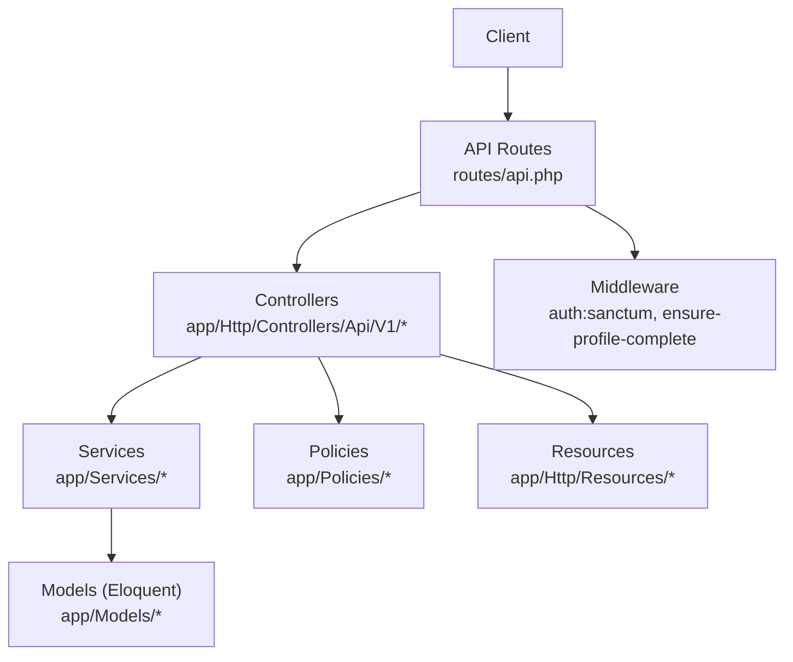

**Diagram sources**
- [routes/api.php:49-241](file://routes/api.php#L49-L241)
- [app/Http/Controllers/Api/V1/CourseController.php:23-146](file://app/Http/Controllers/Api/V1/CourseController.php#L23-L146)
- [app/Services/Enrolment/EnrolmentService.php:30-249](file://app/Services/Enrolment/EnrolmentService.php#L30-L249)
- [app/Models/User.php:19-99](file://app/Models/User.php#L19-L99)
- [app/Policies/CoursePolicy.php:11-49](file://app/Policies/CoursePolicy.php#L11-L49)
- [app/Http/Resources/CourseResource.php:11-43](file://app/Http/Resources/CourseResource.php#L11-L43)
- [app/Http/Middleware/EnsureProfileComplete.php:21-57](file://app/Http/Middleware/EnsureProfileComplete.php#L21-L57)

**Section sources**
- [routes/api.php:49-241](file://routes/api.php#L49-L241)

## Core Components
- Controllers: Thin layer that validates input via FormRequest, authorizes actions using policies, delegates to services, and returns resources.
- Services: Encapsulate business workflows, orchestrate models, jobs, notifications, audit logs, and progress engine calls.
- Models: Eloquent entities with relationships, casts, and helpers; User implements Sanctum tokens and email verification.
- Policies: Fine-grained authorization per resource based on user roles and ownership.
- Resources: Consistent JSON shape for API responses, including computed fields like thumbnail URLs.
- Middleware: Global and route-level checks such as Sanctum authentication and profile completion enforcement.
- Requests: Centralized validation and optional pre-validation transformations.

**Section sources**
- [app/Http/Controllers/Controller.php:9-12](file://app/Http/Controllers/Controller.php#L9-L12)
- [app/Http/Controllers/Api/V1/CourseController.php:23-146](file://app/Http/Controllers/Api/V1/CourseController.php#L23-L146)
- [app/Services/Enrolment/EnrolmentService.php:30-249](file://app/Services/Enrolment/EnrolmentService.php#L30-L249)
- [app/Models/User.php:19-99](file://app/Models/User.php#L19-L99)
- [app/Policies/CoursePolicy.php:11-49](file://app/Policies/CoursePolicy.php#L11-L49)
- [app/Http/Resources/CourseResource.php:11-43](file://app/Http/Resources/CourseResource.php#L11-L43)
- [app/Http/Middleware/EnsureProfileComplete.php:21-57](file://app/Http/Middleware/EnsureProfileComplete.php#L21-L57)
- [app/Http/Requests/Api/V1/StoreCourseRequest.php:15-58](file://app/Http/Requests/Api/V1/StoreCourseRequest.php#L15-L58)

## Architecture Overview
The API uses a versioned prefix v1. Public read endpoints are exposed without authentication; write endpoints require Sanctum authentication and may be further restricted by policies and middleware. Controllers coordinate with services, which perform domain logic and interact with models. Responses are serialized through resources. Authorization is enforced via policies and request-level authorize methods.

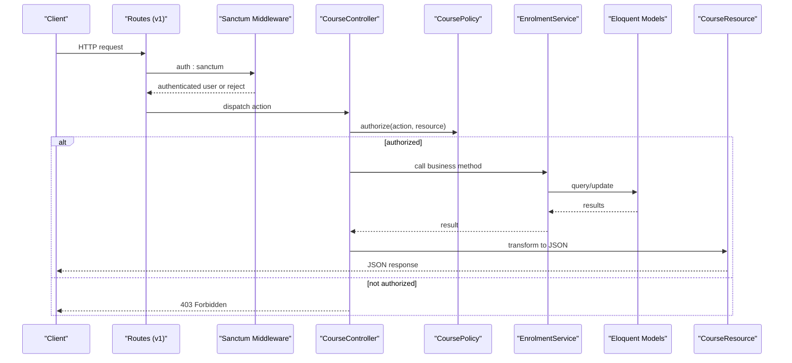

**Diagram sources**
- [routes/api.php:49-241](file://routes/api.php#L49-L241)
- [config/sanctum.php:21-40](file://config/sanctum.php#L21-L40)
- [app/Http/Controllers/Api/V1/CourseController.php:78-146](file://app/Http/Controllers/Api/V1/CourseController.php#L78-L146)
- [app/Policies/CoursePolicy.php:11-49](file://app/Policies/CoursePolicy.php#L11-L49)
- [app/Services/Enrolment/EnrolmentService.php:44-148](file://app/Services/Enrolment/EnrolmentService.php#L44-L148)
- [app/Http/Resources/CourseResource.php:16-43](file://app/Http/Resources/CourseResource.php#L16-L43)

## Detailed Component Analysis

### API Routing and Versioning
- All API endpoints are prefixed with /api/v1.
- Public endpoints include catalogue browsing, certificate verification, and public reviews.
- Protected endpoints are wrapped in an auth:sanctum group and include course management, enrolments, assignments, evaluations, messaging, forums, announcements, and notifications.
- Some endpoints apply additional middleware such as profile.complete to enforce profile completeness before allowing writes.

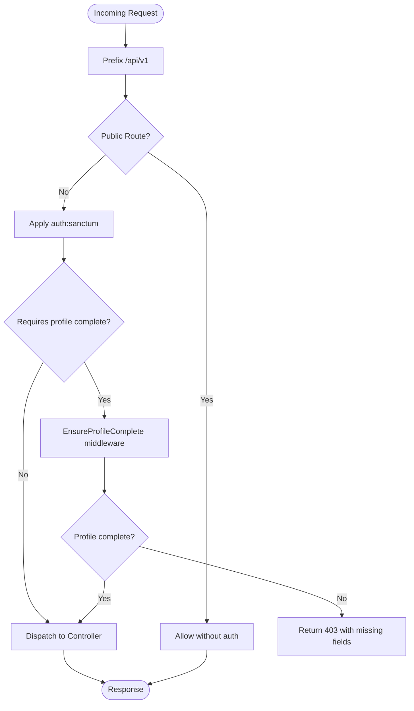

**Diagram sources**
- [routes/api.php:49-241](file://routes/api.php#L49-L241)
- [app/Http/Middleware/EnsureProfileComplete.php:21-57](file://app/Http/Middleware/EnsureProfileComplete.php#L21-L57)

**Section sources**
- [routes/api.php:49-241](file://routes/api.php#L49-L241)

### Controller Layer
- Controllers are thin and rely on:
  - FormRequest for validation and request-level authorization.
  - Policies for resource-level authorization.
  - Services for business logic.
  - Resources for response shaping.
- Example: CourseController handles listing, showing, creating, updating, and deleting courses, delegating storage and notifications to services and returning CourseResource.

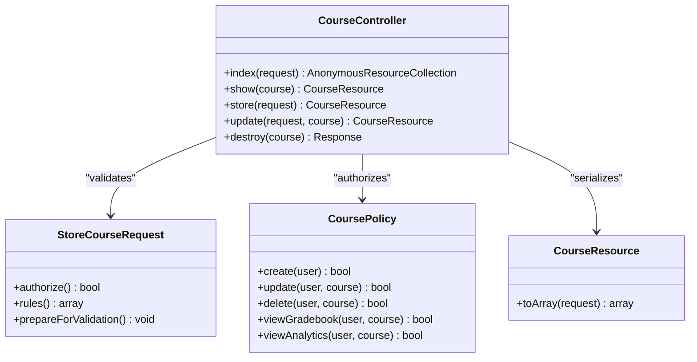

**Diagram sources**
- [app/Http/Controllers/Api/V1/CourseController.php:23-146](file://app/Http/Controllers/Api/V1/CourseController.php#L23-L146)
- [app/Http/Requests/Api/V1/StoreCourseRequest.php:15-58](file://app/Http/Requests/Api/V1/StoreCourseRequest.php#L15-L58)
- [app/Policies/CoursePolicy.php:11-49](file://app/Policies/CoursePolicy.php#L11-L49)
- [app/Http/Resources/CourseResource.php:11-43](file://app/Http/Resources/CourseResource.php#L11-L43)

**Section sources**
- [app/Http/Controllers/Api/V1/CourseController.php:23-146](file://app/Http/Controllers/Api/V1/CourseController.php#L23-L146)
- [app/Http/Requests/Api/V1/StoreCourseRequest.php:15-58](file://app/Http/Requests/Api/V1/StoreCourseRequest.php#L15-L58)
- [app/Http/Resources/CourseResource.php:11-43](file://app/Http/Resources/CourseResource.php#L11-L43)

### Service-Oriented Architecture
- Business logic is encapsulated in dedicated services under app/Services/.
- EnrolmentService orchestrates enrollment workflows, including capacity checks, waitlisting, order creation, auditing, notifications, and progress initialization.
- Services compose multiple concerns: transactions, locking, job dispatching, and integration with other services (audit, notifications, progress).

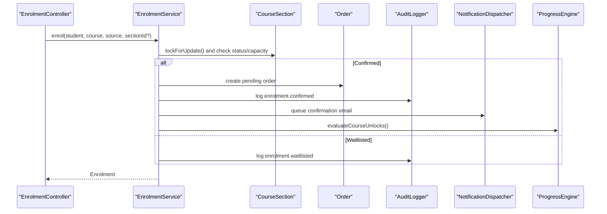

**Diagram sources**
- [app/Services/Enrolment/EnrolmentService.php:44-148](file://app/Services/Enrolment/EnrolmentService.php#L44-L148)

**Section sources**
- [app/Services/Enrolment/EnrolmentService.php:30-249](file://app/Services/Enrolment/EnrolmentService.php#L30-L249)

### Model Layer (Eloquent ORM)
- Models represent domain entities and relationships.
- User model integrates Sanctum tokens, email verification, and role/status enums. It also exposes relationships to enrolments, orders, and courses taught/created.
- Other models (e.g., Course, Enrolment, Module, Resource) follow similar patterns with relationships and casts.

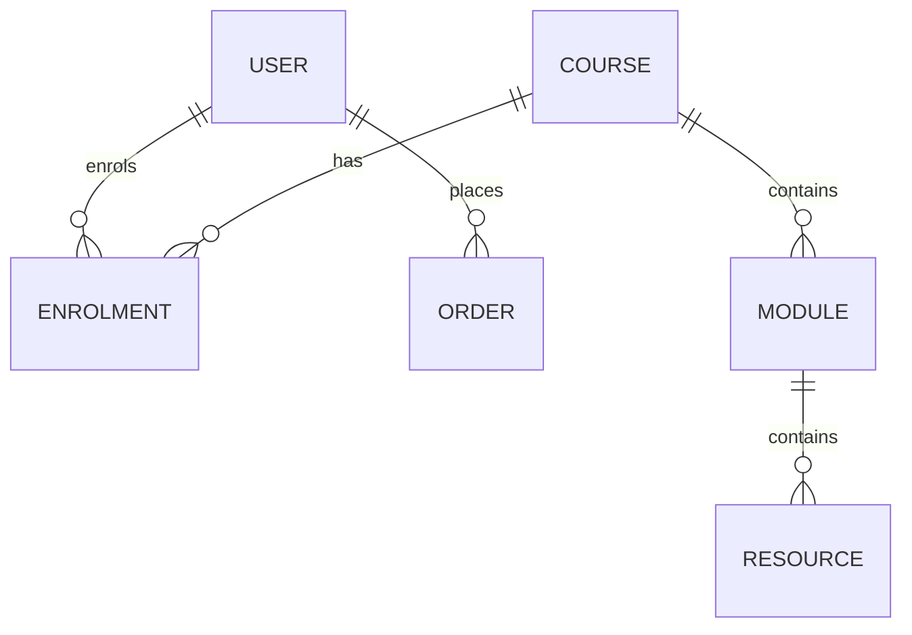

**Diagram sources**
- [app/Models/User.php:74-99](file://app/Models/User.php#L74-L99)

**Section sources**
- [app/Models/User.php:19-99](file://app/Models/User.php#L19-L99)

### Policy-Based Authorization
- Policies define fine-grained permissions per resource.
- CoursePolicy restricts creation to admins, updates to admins or instructors teaching the course, and deletes to admins. Additional methods protect gradebook and analytics views.
- Controllers invoke $this->authorize(...) to enforce these rules.

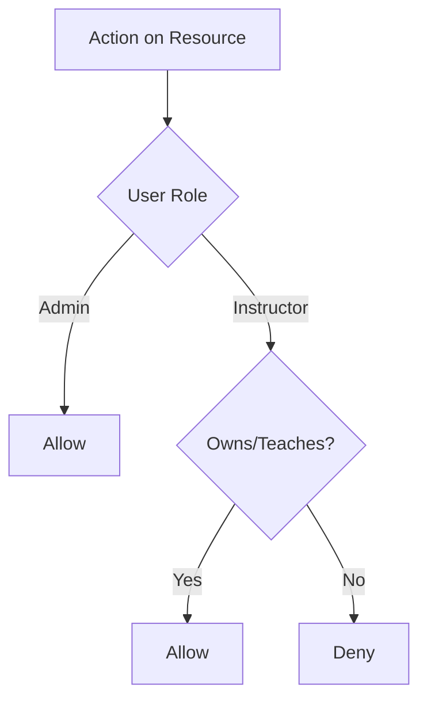

**Diagram sources**
- [app/Policies/CoursePolicy.php:11-49](file://app/Policies/CoursePolicy.php#L11-L49)
- [app/Http/Controllers/Api/V1/CourseController.php:138-145](file://app/Http/Controllers/Api/V1/CourseController.php#L138-L145)

**Section sources**
- [app/Policies/CoursePolicy.php:11-49](file://app/Policies/CoursePolicy.php#L11-L49)
- [app/Http/Controllers/Api/V1/CourseController.php:138-145](file://app/Http/Controllers/Api/V1/CourseController.php#L138-L145)

### Middleware Usage
- Authentication: auth:sanctum secures write endpoints and user-scoped reads.
- Custom middleware: EnsureProfileComplete blocks requests when required profile fields are missing, returning a structured 403 error with missing field details.

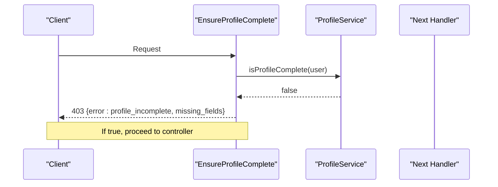

**Diagram sources**
- [app/Http/Middleware/EnsureProfileComplete.php:21-57](file://app/Http/Middleware/EnsureProfileComplete.php#L21-L57)

**Section sources**
- [app/Http/Middleware/EnsureProfileComplete.php:21-57](file://app/Http/Middleware/EnsureProfileComplete.php#L21-L57)

### Request Validation
- FormRequest classes centralize validation rules and optional pre-processing.
- StoreCourseRequest enforces presence, types, enum constraints, uniqueness, and file/image rules, and can generate slugs from titles during preparation.

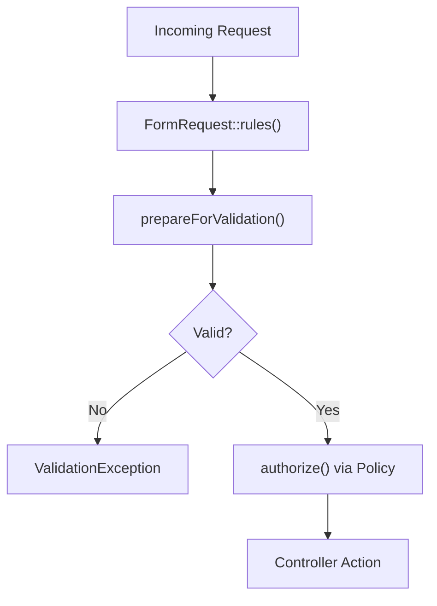

**Diagram sources**
- [app/Http/Requests/Api/V1/StoreCourseRequest.php:15-58](file://app/Http/Requests/Api/V1/StoreCourseRequest.php#L15-L58)

**Section sources**
- [app/Http/Requests/Api/V1/StoreCourseRequest.php:15-58](file://app/Http/Requests/Api/V1/StoreCourseRequest.php#L15-L58)

### Response Transformation via Resources
- Resources standardize API payloads and compute derived values (e.g., thumbnail URL resolution).
- CourseResource maps model attributes to a stable JSON structure, including nested collections and formatted dates.

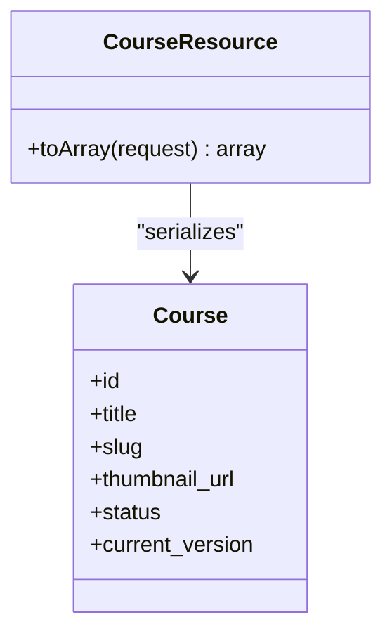

**Diagram sources**
- [app/Http/Resources/CourseResource.php:11-43](file://app/Http/Resources/CourseResource.php#L11-L43)

**Section sources**
- [app/Http/Resources/CourseResource.php:11-43](file://app/Http/Resources/CourseResource.php#L11-L43)

## Dependency Analysis
- Controllers depend on:
  - Requests for validation and authorization.
  - Policies for resource-level permissions.
  - Services for business logic.
  - Resources for response serialization.
- Services depend on:
  - Models for persistence.
  - Jobs, notifications, audit logging, and progress engines for side effects.
- Authentication depends on Sanctum configuration for stateful domains and guards.

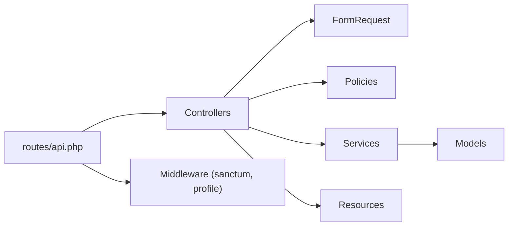

**Diagram sources**
- [routes/api.php:49-241](file://routes/api.php#L49-L241)
- [config/sanctum.php:21-40](file://config/sanctum.php#L21-L40)
- [app/Http/Controllers/Api/V1/CourseController.php:23-146](file://app/Http/Controllers/Api/V1/CourseController.php#L23-L146)
- [app/Services/Enrolment/EnrolmentService.php:30-249](file://app/Services/Enrolment/EnrolmentService.php#L30-L249)

**Section sources**
- [routes/api.php:49-241](file://routes/api.php#L49-L241)
- [config/sanctum.php:21-40](file://config/sanctum.php#L21-L40)

## Performance Considerations
- Use database transactions and pessimistic locking in services to prevent race conditions during capacity checks and seat promotions.
- Paginate large datasets in controllers to reduce payload size and improve response times.
- Defer heavy work (emails, notifications) to queued jobs to keep request latency low.
- Load only necessary relations in controllers and resources to avoid N+1 queries.

[No sources needed since this section provides general guidance]

## Troubleshooting Guide
- Authentication failures: Verify Sanctum stateful domains and token handling; ensure requests include proper cookies or bearer tokens as configured.
- Profile incomplete errors: When receiving a 403 with profile_incomplete, inspect missing_fields to guide users to complete required profile sections.
- Validation errors: Review FormRequest rules to understand why inputs were rejected; adjust client payloads accordingly.
- Authorization denials: Confirm user roles and ownership; verify policy logic matches expected permissions.

**Section sources**
- [config/sanctum.php:21-40](file://config/sanctum.php#L21-L40)
- [app/Http/Middleware/EnsureProfileComplete.php:42-57](file://app/Http/Middleware/EnsureProfileComplete.php#L42-L57)
- [app/Http/Requests/Api/V1/StoreCourseRequest.php:22-58](file://app/Http/Requests/Api/V1/StoreCourseRequest.php#L22-L58)
- [app/Policies/CoursePolicy.php:11-49](file://app/Policies/CoursePolicy.php#L11-L49)

## Conclusion
The backend employs a clean MVC architecture enhanced by a service-oriented design. Controllers remain focused on HTTP concerns, while services encapsulate complex workflows. Eloquent models manage persistence, policies enforce fine-grained access control, and resources ensure consistent API responses. Versioned routing under /api/v1 supports evolution, and middleware plus request validation provide robust security and data integrity.