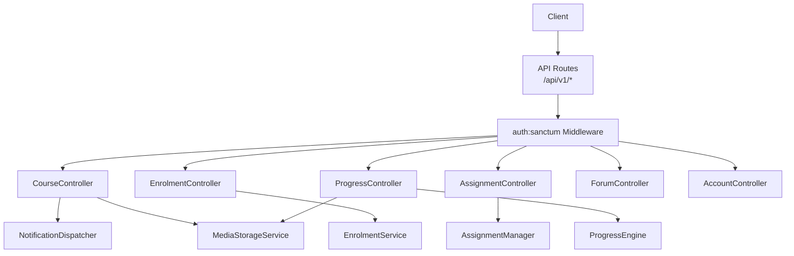
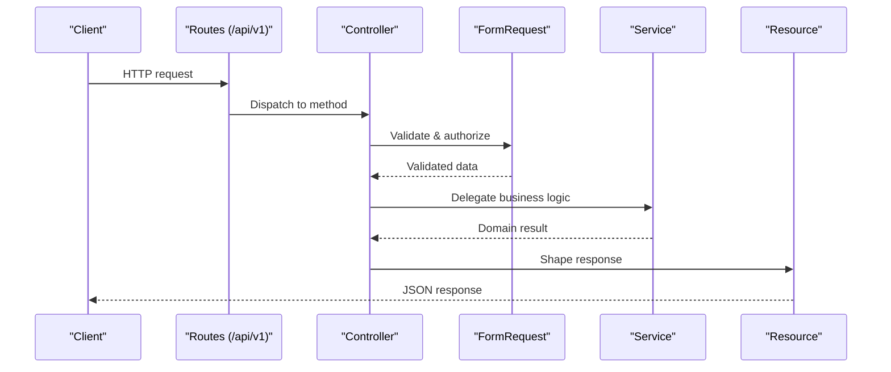
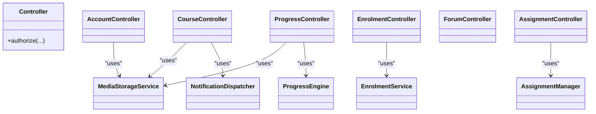

# API Controllers

<cite>
**Referenced Files in This Document**
- [routes/api.php](file://routes/api.php)
- [app/Http/Controllers/Controller.php](file://app/Http/Controllers/Controller.php)
- [app/Http/Controllers/Api/V1/CourseController.php](file://app/Http/Controllers/Api/V1/CourseController.php)
- [app/Http/Controllers/Api/V1/EnrolmentController.php](file://app/Http/Controllers/Api/V1/EnrolmentController.php)
- [app/Http/Controllers/Api/V1/AssignmentController.php](file://app/Http/Controllers/Api/V1/AssignmentController.php)
- [app/Http/Controllers/Api/V1/ProgressController.php](file://app/Http/Controllers/Api/V1/ProgressController.php)
- [app/Http/Controllers/Api/V1/ForumController.php](file://app/Http/Controllers/Api/V1/ForumController.php)
- [app/Http/Controllers/Api/V1/AccountController.php](file://app/Http/Controllers/Api/V1/AccountController.php)
- [app/Http/Requests/Api/V1/StoreCourseRequest.php](file://app/Http/Requests/Api/V1/StoreCourseRequest.php)
- [app/Http/Requests/Api/V1/UpdateCourseRequest.php](file://app/Http/Requests/Api/V1/UpdateCourseRequest.php)
- [config/sanctum.php](file://config/sanctum.php)
</cite>

## Table of Contents
1. Introduction
2. Project Structure
3. Core Components
4. Architecture Overview
5. Detailed Component Analysis
6. Dependency Analysis
7. Performance Considerations
8. Troubleshooting Guide
9. Conclusion

## Introduction
This document explains the RESTful API controllers under app/Http/Controllers/Api/V1/. It covers routing and versioning, how controllers handle HTTP requests, delegate business logic to services, validate inputs, enforce authorization, and return standardized responses. It also documents common patterns such as CRUD operations, filtering, pagination, error handling, authentication middleware integration, and controller-level authorization policies.

## Project Structure
The API is versioned under a single prefix group and split into public and authenticated routes. Authentication is handled by Sanctum’s auth:sanctum middleware. Controllers live under app/Http/Controllers/Api/V1/, with request validation classes under app/Http/Requests/Api/V1/ and response shaping via resources under app/Http/Resources/.

**Diagram sources**
- [routes/api.php:49-241](file://routes/api.php#L49-L241)
- [app/Http/Controllers/Api/V1/CourseController.php:23-28](file://app/Http/Controllers/Api/V1/CourseController.php#L23-L28)
- [app/Http/Controllers/Api/V1/EnrolmentController.php:20-22](file://app/Http/Controllers/Api/V1/EnrolmentController.php#L20-L22)
- [app/Http/Controllers/Api/V1/AssignmentController.php:16-18](file://app/Http/Controllers/Api/V1/AssignmentController.php#L16-L18)
- [app/Http/Controllers/Api/V1/ProgressController.php:32-37](file://app/Http/Controllers/Api/V1/ProgressController.php#L32-L37)

**Section sources**
- [routes/api.php:49-241](file://routes/api.php#L49-L241)
- [config/sanctum.php:21-40](file://config/sanctum.php#L21-L40)

## Core Components
- Base controller: All API controllers extend a base Controller that enables policy-based authorization through AuthorizesRequests.
- Routing and versioning: All endpoints are grouped under /api/v1. Public read endpoints are outside the auth group; write endpoints are inside an auth:sanctum group.
- Request validation: Each mutating endpoint uses a dedicated FormRequest class for rules and per-request authorization checks.
- Response formatting: Responses are returned as JSON resources or collections, ensuring consistent structure across the API.
- Business delegation: Controllers keep thin orchestration responsibilities and delegate domain logic to Services (e.g., EnrolmentService, AssignmentManager, ProgressEngine).
- Authorization: Controllers use $this->authorize() to enforce Policies on specific models or actions.

**Section sources**
- [app/Http/Controllers/Controller.php:7-12](file://app/Http/Controllers/Controller.php#L7-L12)
- [routes/api.php:49-241](file://routes/api.php#L49-L241)
- [app/Http/Requests/Api/V1/StoreCourseRequest.php:17-20](file://app/Http/Requests/Api/V1/StoreCourseRequest.php#L17-L20)
- [app/Http/Requests/Api/V1/UpdateCourseRequest.php:17-20](file://app/Http/Requests/Api/V1/UpdateCourseRequest.php#L17-L20)

## Architecture Overview
The API follows a layered approach:
- Route layer defines versioned endpoints and applies authentication middleware.
- Controller layer validates input via FormRequest, enforces authorization, and orchestrates service calls.
- Service layer encapsulates business rules and data mutations.
- Resource layer standardizes JSON responses.

**Diagram sources**
- [routes/api.php:49-241](file://routes/api.php#L49-L241)
- [app/Http/Controllers/Api/V1/CourseController.php:78-98](file://app/Http/Controllers/Api/V1/CourseController.php#L78-L98)
- [app/Http/Requests/Api/V1/StoreCourseRequest.php:22-50](file://app/Http/Requests/Api/V1/StoreCourseRequest.php#L22-L50)

## Detailed Component Analysis

### CourseController
Responsibilities:
- Catalogue listing with role-aware filtering and query parameters (category, level, instructor, schedule range).
- CRUD for courses with file upload handling and change logging.
- Policy-gated deletion.

Patterns:
- Filtering: Query builder conditions based on request parameters and user role.
- Pagination: Paginates results before returning a resource collection.
- File handling: Uses MediaStorageService to store/delete thumbnails.
- Change tracking: Increments version and logs changes when provided.

Example flows:
- Listing courses with filters and pagination.
- Creating a course with optional thumbnail and instructors.
- Updating a course with optional thumbnail replacement and change summary.
- Deleting a course after authorization.

**Section sources**
- [app/Http/Controllers/Api/V1/CourseController.php:30-71](file://app/Http/Controllers/Api/V1/CourseController.php#L30-L71)
- [app/Http/Controllers/Api/V1/CourseController.php:78-98](file://app/Http/Controllers/Api/V1/CourseController.php#L78-L98)
- [app/Http/Controllers/Api/V1/CourseController.php:104-136](file://app/Http/Controllers/Api/V1/CourseController.php#L104-L136)
- [app/Http/Controllers/Api/V1/CourseController.php:138-145](file://app/Http/Controllers/Api/V1/CourseController.php#L138-L145)

### EnrolmentController
Responsibilities:
- List authenticated student’s enrolments with related data.
- Self-enrolment with policy checks and service delegation.
- Withdraw enrolment with authorization.

Patterns:
- Validation via StoreEnrolmentRequest.
- Service delegation to EnrolmentService for enrol and withdraw workflows.
- Policy enforcement for withdrawal.

Example flows:
- Fetching current student’s enrolments with pagination.
- Enrolling in a course (rejects application-only courses at controller level).
- Withdrawing from a course after authorization.

**Section sources**
- [app/Http/Controllers/Api/V1/EnrolmentController.php:24-36](file://app/Http/Controllers/Api/V1/EnrolmentController.php#L24-L36)
- [app/Http/Controllers/Api/V1/EnrolmentController.php:38-61](file://app/Http/Controllers/Api/V1/EnrolmentController.php#L38-L61)
- [app/Http/Controllers/Api/V1/EnrolmentController.php:63-74](file://app/Http/Controllers/Api/V1/EnrolmentController.php#L63-L74)

### AssignmentController
Responsibilities:
- Show assignment details with rubrics.
- Create/update/delete assignments within a module context.

Patterns:
- Delegates create/update/delete to AssignmentManager.
- Returns AssignmentResource for consistent response shape.
- Uses Policy for delete authorization.

Example flows:
- Retrieving an assignment with its rubrics.
- Creating an assignment under a module.
- Updating an assignment’s properties.
- Deleting an assignment after authorization.

**Section sources**
- [app/Http/Controllers/Api/V1/AssignmentController.php:20-23](file://app/Http/Controllers/Api/V1/AssignmentController.php#L20-L23)
- [app/Http/Controllers/Api/V1/AssignmentController.php:25-30](file://app/Http/Controllers/Api/V1/AssignmentController.php#L25-L30)
- [app/Http/Controllers/Api/V1/AssignmentController.php:32-37](file://app/Http/Controllers/Api/V1/AssignmentController.php#L32-L37)
- [app/Http/Controllers/Api/V1/AssignmentController.php:39-46](file://app/Http/Controllers/Api/V1/AssignmentController.php#L39-L46)

### ProgressController
Responsibilities:
- Compute and expose per-course progress and dashboard summaries.
- Record engagement events (video watch pings, mark read/opened/attendance).
- Provide attendance roster for live session resources.

Patterns:
- Delegates all progress computations and state updates to ProgressEngine.
- Uses ModuleProgressResource for consistent module progress representation.
- Enforces authorization for sensitive operations like viewing attendance rosters.

Example flows:
- Evaluating unlocks and returning applicable modules with progress.
- Building dashboard rows per confirmed enrolment with completion percentages and certificates.
- Recording video progress and marking content interactions.
- Returning attendance roster for live sessions after authorization.

**Section sources**
- [app/Http/Controllers/Api/V1/ProgressController.php:39-60](file://app/Http/Controllers/Api/V1/ProgressController.php#L39-L60)
- [app/Http/Controllers/Api/V1/ProgressController.php:62-121](file://app/Http/Controllers/Api/V1/ProgressController.php#L62-L121)
- [app/Http/Controllers/Api/V1/ProgressController.php:123-149](file://app/Http/Controllers/Api/V1/ProgressController.php#L123-L149)
- [app/Http/Controllers/Api/V1/ProgressController.php:151-181](file://app/Http/Controllers/Api/V1/ProgressController.php#L151-L181)

### ForumController
Responsibilities:
- Provide a unified index of forums accessible to the authenticated user across enrolled courses.
- Include recent activity metadata and unread thread counts.

Patterns:
- Builds queries scoped to confirmed enrolments.
- Aggregates thread counts and latest activity using Eloquent relationships and subqueries.
- Returns plain JSON arrays tailored for the UI.

Example flows:
- Listing forums for enrolled courses with unread counts and latest thread info.

**Section sources**
- [app/Http/Controllers/Api/V1/ForumController.php:14-32](file://app/Http/Controllers/Api/V1/ForumController.php#L14-L32)
- [app/Http/Controllers/Api/V1/ForumController.php:32-97](file://app/Http/Controllers/Api/V1/ForumController.php#L32-L97)

### AccountController
Responsibilities:
- Self-service account management: avatar update, profile update, password change, logout other sessions, data export, deactivation request.
- Audits sensitive actions via AuditLogger.

Patterns:
- Uses MediaStorageService for avatar uploads and deletions.
- Validates inputs via dedicated FormRequest classes.
- Logs audit events for security-sensitive actions.
- Returns UserResource for profile-related responses.

Example flows:
- Uploading/updating avatar with role-based storage prefix.
- Updating profile fields and recomputing display name.
- Changing password with current password verification and audit logging.
- Exporting personal data as a downloadable JSON file.
- Soft-deactivating account and clearing sessions.

**Section sources**
- [app/Http/Controllers/Api/V1/AccountController.php:57-72](file://app/Http/Controllers/Api/V1/AccountController.php#L57-L72)
- [app/Http/Controllers/Api/V1/AccountController.php:74-92](file://app/Http/Controllers/Api/V1/AccountController.php#L74-L92)
- [app/Http/Controllers/Api/V1/AccountController.php:94-120](file://app/Http/Controllers/Api/V1/AccountController.php#L94-L120)
- [app/Http/Controllers/Api/V1/AccountController.php:122-144](file://app/Http/Controllers/Api/V1/AccountController.php#L122-L144)
- [app/Http/Controllers/Api/V1/AccountController.php:146-179](file://app/Http/Controllers/Api/V1/AccountController.php#L146-L179)
- [app/Http/Controllers/Api/V1/AccountController.php:181-207](file://app/Http/Controllers/Api/V1/AccountController.php#L181-L207)

## Dependency Analysis
Controllers depend on:
- Request validation classes for input rules and per-request authorization.
- Services for business logic (EnrolmentService, AssignmentManager, ProgressEngine, NotificationDispatcher, MediaStorageService).
- Models for data access and relationships.
- Resources for response shaping.
- Policies for authorization checks invoked via $this->authorize().

**Diagram sources**
- [app/Http/Controllers/Api/V1/CourseController.php:23-28](file://app/Http/Controllers/Api/V1/CourseController.php#L23-L28)
- [app/Http/Controllers/Api/V1/EnrolmentController.php:20-22](file://app/Http/Controllers/Api/V1/EnrolmentController.php#L20-L22)
- [app/Http/Controllers/Api/V1/AssignmentController.php:16-18](file://app/Http/Controllers/Api/V1/AssignmentController.php#L16-L18)
- [app/Http/Controllers/Api/V1/ProgressController.php:32-37](file://app/Http/Controllers/Api/V1/ProgressController.php#L32-L37)
- [app/Http/Controllers/Api/V1/AccountController.php:52-55](file://app/Http/Controllers/Api/V1/AccountController.php#L52-L55)

**Section sources**
- [app/Http/Controllers/Api/V1/CourseController.php:23-28](file://app/Http/Controllers/Api/V1/CourseController.php#L23-L28)
- [app/Http/Controllers/Api/V1/EnrolmentController.php:20-22](file://app/Http/Controllers/Api/V1/EnrolmentController.php#L20-L22)
- [app/Http/Controllers/Api/V1/AssignmentController.php:16-18](file://app/Http/Controllers/Api/V1/AssignmentController.php#L16-L18)
- [app/Http/Controllers/Api/V1/ProgressController.php:32-37](file://app/Http/Controllers/Api/V1/ProgressController.php#L32-L37)
- [app/Http/Controllers/Api/V1/AccountController.php:52-55](file://app/Http/Controllers/Api/V1/AccountController.php#L52-L55)

## Performance Considerations
- Use eager loading to avoid N+1 queries when returning related data (e.g., categories, instructors, sections, orders).
- Apply selective includes only for needed relations to reduce payload size.
- Paginate large lists consistently to limit memory usage and improve response times.
- Keep controllers thin; move heavy computations to services or background jobs where appropriate.
- Cache expensive read-only aggregations if they become bottlenecks (e.g., forum unread counts), ensuring invalidation strategies are in place.

[No sources needed since this section provides general guidance]

## Troubleshooting Guide
Common issues and resolutions:
- Authentication failures: Ensure the client sends valid Sanctum credentials or tokens and that stateful domains are configured correctly.
- Validation errors: Check FormRequest rules; ensure required fields are present and enums match allowed values.
- Authorization denials: Verify that the user has the necessary permissions via Policies; confirm route model binding resolves the correct entity.
- File upload problems: Confirm media storage configuration and that files meet size/type constraints defined in requests.
- Unexpected empty responses: Inspect query scopes and filters applied in controllers; verify user roles and enrolment statuses affect visibility.

**Section sources**
- [config/sanctum.php:21-40](file://config/sanctum.php#L21-L40)
- [app/Http/Requests/Api/V1/StoreCourseRequest.php:22-50](file://app/Http/Requests/Api/V1/StoreCourseRequest.php#L22-L50)
- [app/Http/Requests/Api/V1/UpdateCourseRequest.php:22-52](file://app/Http/Requests/Api/V1/UpdateCourseRequest.php#L22-L52)

## Conclusion
The V1 API controllers follow a consistent pattern: thin controllers that validate input, enforce authorization, delegate business logic to services, and return standardized JSON responses. Versioning is centralized under /api/v1 with clear separation between public and authenticated routes. The design promotes maintainability, testability, and scalability while keeping concerns well-separated across layers.

[No sources needed since this section summarizes without analyzing specific files]