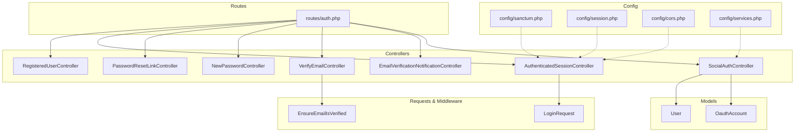
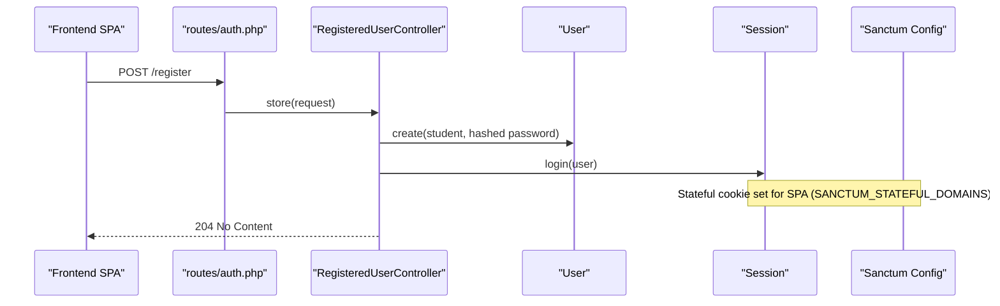
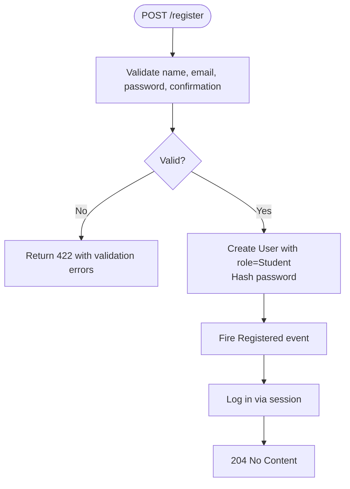
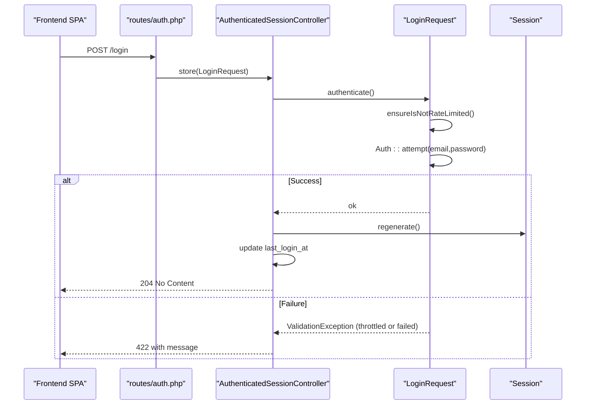
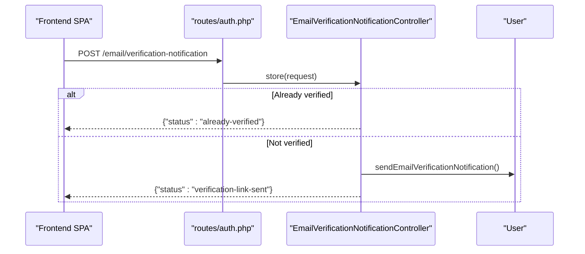
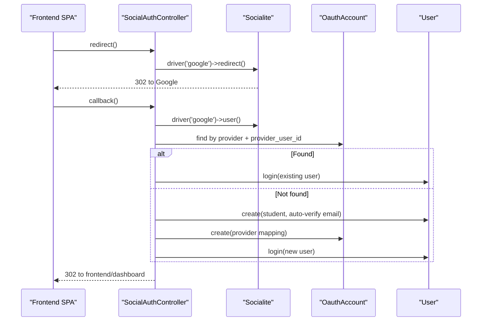
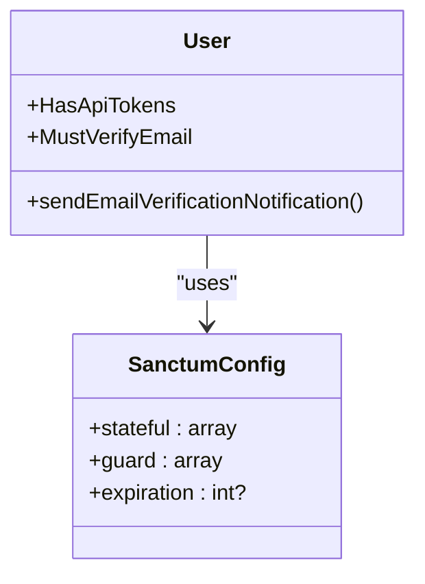
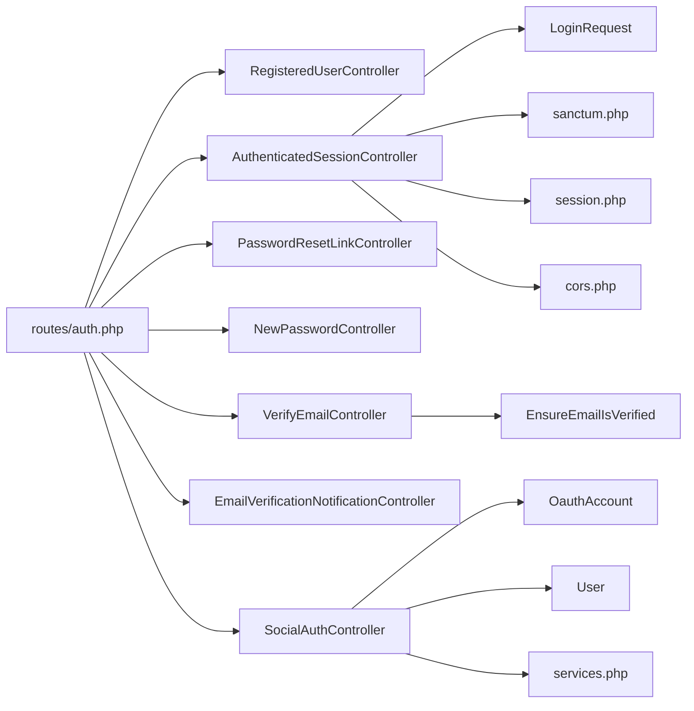

# Authentication Controllers

<cite>
**Referenced Files in This Document**
- [AuthenticatedSessionController.php](file://app/Http/Controllers/Auth/AuthenticatedSessionController.php)
- [RegisteredUserController.php](file://app/Http/Controllers/Auth/RegisteredUserController.php)
- [PasswordResetLinkController.php](file://app/Http/Controllers/Auth/PasswordResetLinkController.php)
- [NewPasswordController.php](file://app/Http/Controllers/Auth/NewPasswordController.php)
- [EmailVerificationNotificationController.php](file://app/Http/Controllers/Auth/EmailVerificationNotificationController.php)
- [VerifyEmailController.php](file://app/Http/Controllers/Auth/VerifyEmailController.php)
- [SocialAuthController.php](file://app/Http/Controllers/Auth/SocialAuthController.php)
- [LoginRequest.php](file://app/Http/Requests/Auth/LoginRequest.php)
- [EnsureEmailIsVerified.php](file://app/Http/Middleware/EnsureEmailIsVerified.php)
- [auth.php](file://routes/auth.php)
- [sanctum.php](file://config/sanctum.php)
- [session.php](file://config/session.php)
- [cors.php](file://config/cors.php)
- [User.php](file://app/Models/User.php)
- [OauthAccount.php](file://app/Models/OauthAccount.php)
- [services.php](file://config/services.php)
</cite>

## Table of Contents
1. Introduction
2. Project Structure
3. Core Components
4. Architecture Overview
5. Detailed Component Analysis
6. Dependency Analysis
7. Performance Considerations
8. Troubleshooting Guide
9. Conclusion

## Introduction
This document explains the authentication controllers under app/Http/Controllers/Auth/ and how they implement user registration, login, password reset, email verification, and social authentication flows. It also covers Laravel Sanctum integration for stateful SPA sessions, session management, token-based authentication via Sanctum API tokens, middleware usage, security considerations, and OAuth provider integration (Google). Where applicable, request/response formats and error handling patterns are described.

## Project Structure
The authentication feature is organized around dedicated controllers per flow, a shared LoginRequest for validation and rate limiting, route definitions, and configuration files for Sanctum, sessions, CORS, and third-party services.

**Diagram sources**
- [auth.php:11-37](file://routes/auth.php#L11-L37)
- [AuthenticatedSessionController.php:13-41](file://app/Http/Controllers/Auth/AuthenticatedSessionController.php#L13-L41)
- [RegisteredUserController.php:18-46](file://app/Http/Controllers/Auth/RegisteredUserController.php#L18-L46)
- [PasswordResetLinkController.php:13-40](file://app/Http/Controllers/Auth/PasswordResetLinkController.php#L13-L40)
- [NewPasswordController.php:16-54](file://app/Http/Controllers/Auth/NewPasswordController.php#L16-L54)
- [VerifyEmailController.php:13-33](file://app/Http/Controllers/Auth/VerifyEmailController.php#L13-L33)
- [EmailVerificationNotificationController.php:11-22](file://app/Http/Controllers/Auth/EmailVerificationNotificationController.php#L11-L22)
- [SocialAuthController.php:25-74](file://app/Http/Controllers/Auth/SocialAuthController.php#L25-L74)
- [LoginRequest.php:15-87](file://app/Http/Requests/Auth/LoginRequest.php#L15-L87)
- [EnsureEmailIsVerified.php:12-26](file://app/Http/Middleware/EnsureEmailIsVerified.php#L12-L26)
- [sanctum.php:8-85](file://config/sanctum.php#L8-L85)
- [session.php:21-215](file://config/session.php#L21-L215)
- [cors.php:18-36](file://config/cors.php#L18-L36)
- [services.php:38-42](file://config/services.php#L38-L42)

**Section sources**
- [auth.php:11-37](file://routes/auth.php#L11-L37)
- [sanctum.php:8-85](file://config/sanctum.php#L8-L85)
- [session.php:21-215](file://config/session.php#L21-L215)
- [cors.php:18-36](file://config/cors.php#L18-L36)

## Core Components
- Registration: Creates a student account, hashes the password, fires a Registered event, and logs the user in.
- Login: Validates credentials with rate limiting, authenticates via session, updates last login timestamp, and returns a no-content response.
- Password Reset: Sends a reset link; resets password using a one-time token and marks email as verified if needed.
- Email Verification: Resends verification emails and verifies email addresses via signed links.
- Social Auth: Redirects to Google, handles callback, matches or creates users by email, links OAuth accounts, and logs the user in.

Key supporting elements:
- LoginRequest enforces input validation and rate limiting for login attempts.
- EnsureEmailIsVerified middleware protects routes that require a verified email.
- Sanctum config enables stateful cookie-based auth for SPAs and supports API tokens via HasApiTokens on User.
- Session and CORS configs secure cross-origin requests and manage session cookies.

**Section sources**
- [RegisteredUserController.php:18-46](file://app/Http/Controllers/Auth/RegisteredUserController.php#L18-L46)
- [AuthenticatedSessionController.php:13-41](file://app/Http/Controllers/Auth/AuthenticatedSessionController.php#L13-L41)
- [PasswordResetLinkController.php:13-40](file://app/Http/Controllers/Auth/PasswordResetLinkController.php#L13-L40)
- [NewPasswordController.php:16-54](file://app/Http/Controllers/Auth/NewPasswordController.php#L16-L54)
- [EmailVerificationNotificationController.php:11-22](file://app/Http/Controllers/Auth/EmailVerificationNotificationController.php#L11-L22)
- [VerifyEmailController.php:13-33](file://app/Http/Controllers/Auth/VerifyEmailController.php#L13-L33)
- [SocialAuthController.php:25-74](file://app/Http/Controllers/Auth/SocialAuthController.php#L25-L74)
- [LoginRequest.php:15-87](file://app/Http/Requests/Auth/LoginRequest.php#L15-L87)
- [EnsureEmailIsVerified.php:12-26](file://app/Http/Middleware/EnsureEmailIsVerified.php#L12-L26)
- [User.php:19-77](file://app/Models/User.php#L19-L77)
- [sanctum.php:8-85](file://config/sanctum.php#L8-L85)
- [session.php:21-215](file://config/session.php#L21-L215)
- [cors.php:18-36](file://config/cors.php#L18-L36)

## Architecture Overview
The authentication architecture combines session-based web auth for SPAs (via Sanctum stateful cookies) and optional API token auth through Sanctum’s HasApiTokens trait. Routes enforce guest/auth policies and throttling where appropriate. Social login integrates via Laravel Socialite and persists provider mappings.

**Diagram sources**
- [auth.php:11-17](file://routes/auth.php#L11-L17)
- [RegisteredUserController.php:26-45](file://app/Http/Controllers/Auth/RegisteredUserController.php#L26-L45)
- [User.php:24-55](file://app/Models/User.php#L24-L55)
- [sanctum.php:21-26](file://config/sanctum.php#L21-L26)

## Detailed Component Analysis

### Registration Flow
- Endpoint: POST /register
- Request body fields: name, email, password, password_confirmation
- Behavior:
  - Validates inputs and ensures unique email
  - Creates a student user with hashed password
  - Fires Registered event
  - Logs the user in via session
  - Returns 204 No Content
- Error handling: ValidationException thrown on invalid input

**Diagram sources**
- [RegisteredUserController.php:26-45](file://app/Http/Controllers/Auth/RegisteredUserController.php#L26-L45)

**Section sources**
- [RegisteredUserController.php:18-46](file://app/Http/Controllers/Auth/RegisteredUserController.php#L18-L46)

### Login Flow
- Endpoint: POST /login
- Request body fields: email, password, remember (optional boolean)
- Behavior:
  - Validates inputs and applies rate limiting (5 attempts per key)
  - Attempts authentication; on failure, increments throttle and throws ValidationException
  - On success, regenerates session, updates last_login_at, returns 204 No Content
- Security: Rate limiting keyed by normalized email + IP

**Diagram sources**
- [auth.php:15-17](file://routes/auth.php#L15-L17)
- [AuthenticatedSessionController.php:18-27](file://app/Http/Controllers/Auth/AuthenticatedSessionController.php#L18-L27)
- [LoginRequest.php:30-87](file://app/Http/Requests/Auth/LoginRequest.php#L30-L87)

**Section sources**
- [AuthenticatedSessionController.php:13-41](file://app/Http/Controllers/Auth/AuthenticatedSessionController.php#L13-L41)
- [LoginRequest.php:15-87](file://app/Http/Requests/Auth/LoginRequest.php#L15-L87)

### Logout Flow
- Endpoint: POST /logout
- Behavior:
  - Logs out via web guard
  - Invalidates session and regenerates CSRF token
  - Returns 204 No Content

**Section sources**
- [auth.php:35-37](file://routes/auth.php#L35-L37)
- [AuthenticatedSessionController.php:32-41](file://app/Http/Controllers/Auth/AuthenticatedSessionController.php#L32-L41)

### Password Reset Link
- Endpoint: POST /forgot-password
- Request body field: email
- Behavior:
  - Validates email
  - Sends reset link via Laravel Password broker
  - Returns JSON status or 422 on failure

**Section sources**
- [auth.php:19-21](file://routes/auth.php#L19-L21)
- [PasswordResetLinkController.php:13-40](file://app/Http/Controllers/Auth/PasswordResetLinkController.php#L13-L40)

### Password Reset Confirmation
- Endpoint: POST /reset-password
- Request body fields: token, email, password, password_confirmation
- Behavior:
  - Validates inputs
  - Resets password and optionally marks email as verified
  - Fires PasswordReset event
  - Returns JSON status or 422 on failure

**Section sources**
- [auth.php:23-25](file://routes/auth.php#L23-L25)
- [NewPasswordController.php:16-54](file://app/Http/Controllers/Auth/NewPasswordController.php#L16-L54)

### Email Verification
- Resend notification:
  - Endpoint: POST /email/verification-notification
  - Requires authenticated user
  - If already verified, returns status indicating so; otherwise sends queued verification email
- Verify email:
  - Endpoint: GET /verify-email/{id}/{hash}
  - Requires auth, signed, and throttling
  - Marks email as verified and fires Verified event
  - Redirects to frontend dashboard with a verified flag

**Diagram sources**
- [auth.php:31-33](file://routes/auth.php#L31-L33)
- [EmailVerificationNotificationController.php:11-22](file://app/Http/Controllers/Auth/EmailVerificationNotificationController.php#L11-L22)
- [User.php:69-72](file://app/Models/User.php#L69-L72)

**Section sources**
- [EmailVerificationNotificationController.php:11-22](file://app/Http/Controllers/Auth/EmailVerificationNotificationController.php#L11-L22)
- [VerifyEmailController.php:13-33](file://app/Http/Controllers/Auth/VerifyEmailController.php#L13-L33)
- [auth.php:27-33](file://routes/auth.php#L27-L33)

### Social Authentication (Google)
- Redirect:
  - Endpoint: GET /social/redirect (mapped via controller method)
  - Redirects to Google OAuth consent screen
- Callback:
  - Endpoint: GET /social/callback (mapped via controller method)
  - Exchanges code for user info via Socialite
  - Matches existing user by email or creates a new student account
  - Links OAuth account record
  - Logs user in and redirects to frontend dashboard

**Diagram sources**
- [SocialAuthController.php:27-48](file://app/Http/Controllers/Auth/SocialAuthController.php#L27-L48)
- [SocialAuthController.php:50-74](file://app/Http/Controllers/Auth/SocialAuthController.php#L50-L74)
- [OauthAccount.php:11-33](file://app/Models/OauthAccount.php#L11-L33)
- [services.php:38-42](file://config/services.php#L38-L42)

**Section sources**
- [SocialAuthController.php:25-74](file://app/Http/Controllers/Auth/SocialAuthController.php#L25-L74)
- [OauthAccount.php:11-33](file://app/Models/OauthAccount.php#L11-L33)
- [services.php:38-42](file://config/services.php#L38-L42)

### Sanctum Integration and Token-Based Authentication
- Stateful SPA sessions:
  - Sanctum configured to accept cookies from specified domains (including FRONTEND_URL)
  - Web guard used for session-based auth
- API tokens:
  - User model uses HasApiTokens trait enabling personal access tokens for API clients
  - Token expiration can be configured; default null means no expiration unless set per token

**Diagram sources**
- [User.php:19-22](file://app/Models/User.php#L19-L22)
- [sanctum.php:21-53](file://config/sanctum.php#L21-L53)

**Section sources**
- [User.php:19-22](file://app/Models/User.php#L19-L22)
- [sanctum.php:8-85](file://config/sanctum.php#L8-L85)

### Session Management and CORS
- Sessions:
  - Default driver is database; lifetime configurable via environment
  - Cookie settings include http_only, same_site, secure flags
- CORS:
  - Supports credentials for SPA-to-API calls
  - Allowed origins include local dev and production frontend URL

Security considerations:
- Ensure SESSION_SECURE_COOKIE is enabled in production
- Configure SANCTUM_STATEFUL_DOMAINS to restrict cookie scope
- Use HTTPS for all endpoints in production

**Section sources**
- [session.php:21-215](file://config/session.php#L21-L215)
- [cors.php:18-36](file://config/cors.php#L18-L36)

## Dependency Analysis
Authentication controllers depend on:
- Route definitions for endpoint exposure and middleware application
- Request classes for validation and rate limiting
- Models for persistence and relationships
- Configuration for session, CORS, and third-party services

**Diagram sources**
- [auth.php:11-37](file://routes/auth.php#L11-L37)
- [AuthenticatedSessionController.php:13-41](file://app/Http/Controllers/Auth/AuthenticatedSessionController.php#L13-L41)
- [LoginRequest.php:15-87](file://app/Http/Requests/Auth/LoginRequest.php#L15-L87)
- [SocialAuthController.php:25-74](file://app/Http/Controllers/Auth/SocialAuthController.php#L25-L74)
- [OauthAccount.php:11-33](file://app/Models/OauthAccount.php#L11-L33)
- [User.php:19-77](file://app/Models/User.php#L19-L77)
- [EnsureEmailIsVerified.php:12-26](file://app/Http/Middleware/EnsureEmailIsVerified.php#L12-L26)
- [sanctum.php:8-85](file://config/sanctum.php#L8-L85)
- [session.php:21-215](file://config/session.php#L21-L215)
- [cors.php:18-36](file://config/cors.php#L18-L36)
- [services.php:38-42](file://config/services.php#L38-L42)

**Section sources**
- [auth.php:11-37](file://routes/auth.php#L11-L37)
- [sanctum.php:8-85](file://config/sanctum.php#L8-L85)
- [session.php:21-215](file://config/session.php#L21-L215)
- [cors.php:18-36](file://config/cors.php#L18-L36)

## Performance Considerations
- Rate limiting on login prevents brute-force attacks and reduces load during abuse.
- Queued email verification avoids blocking registration responses.
- Database-backed sessions scale better than file storage in multi-instance deployments.
- Keep session lifetime aligned with UX needs; consider expire_on_close for sensitive environments.

[No sources needed since this section provides general guidance]

## Troubleshooting Guide
Common issues and resolutions:
- Login failures due to throttling:
  - Symptom: Repeated 422 responses with throttle messages
  - Cause: Too many attempts within the time window
  - Resolution: Wait for cooldown or adjust rate limiter configuration
- Email not verified:
  - Symptom: Protected routes return 409 with “Your email address is not verified.”
  - Cause: User has not verified email
  - Resolution: Resend verification email via /email/verification-notification or complete verification link
- Social login mismatch:
  - Symptom: Duplicate accounts or login failures
  - Cause: Email not matching existing user
  - Resolution: Ensure email uniqueness and verify provider mapping exists
- CORS errors for SPA:
  - Symptom: Browser blocks requests
  - Cause: Frontend origin not allowed or credentials not supported
  - Resolution: Add frontend URL to allowed_origins and ensure supports_credentials is true

**Section sources**
- [LoginRequest.php:63-79](file://app/Http/Requests/Auth/LoginRequest.php#L63-L79)
- [EnsureEmailIsVerified.php:17-23](file://app/Http/Middleware/EnsureEmailIsVerified.php#L17-L23)
- [cors.php:18-36](file://config/cors.php#L18-L36)

## Conclusion
The authentication system provides a robust foundation for user registration, login/logout, password reset, email verification, and social authentication. It leverages Laravel’s built-in features alongside Sanctum for stateful SPA sessions and optional API tokens. Security is reinforced through rate limiting, validated inputs, secure session cookies, and CORS controls. The design cleanly separates concerns across controllers, requests, middleware, and configuration, making it maintainable and extensible for additional providers or multi-factor authentication in the future.

[No sources needed since this section summarizes without analyzing specific files]