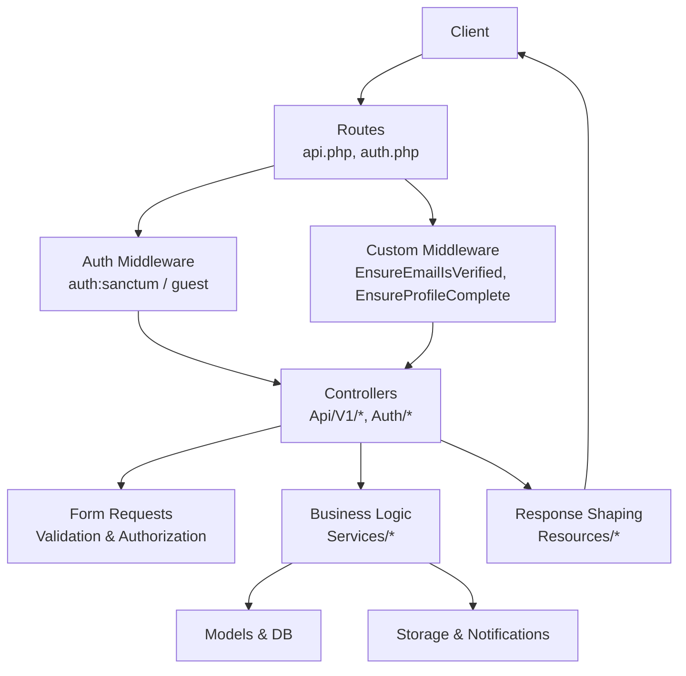
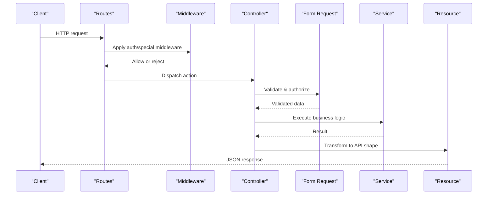
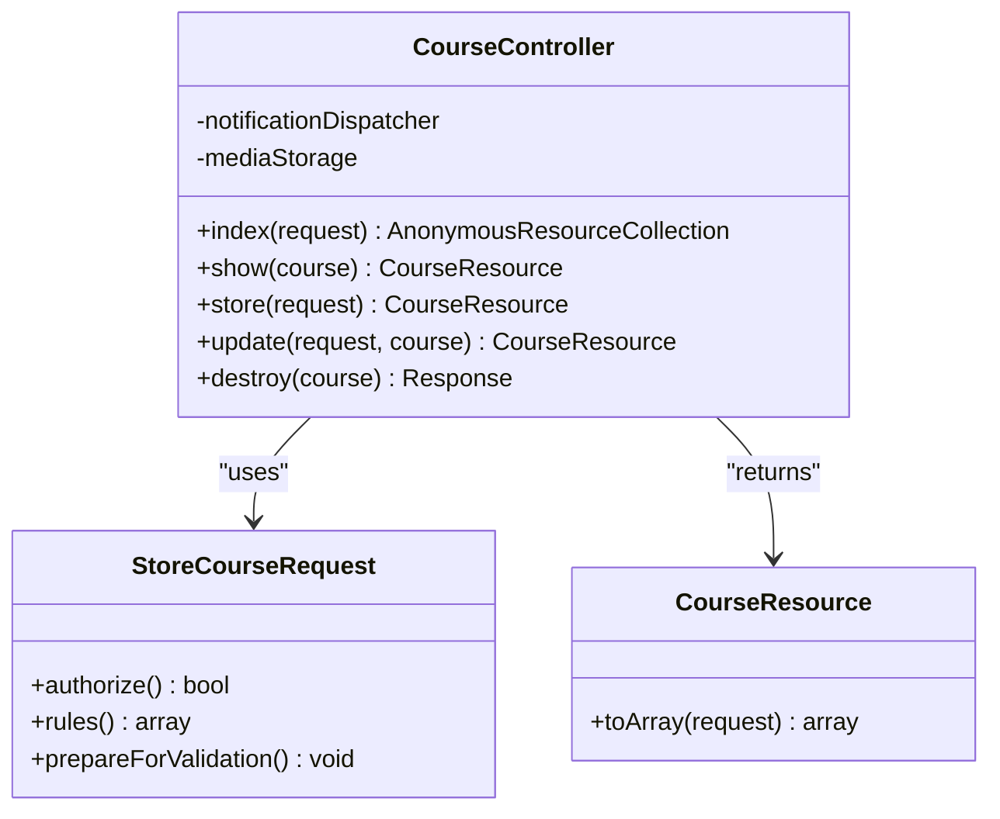
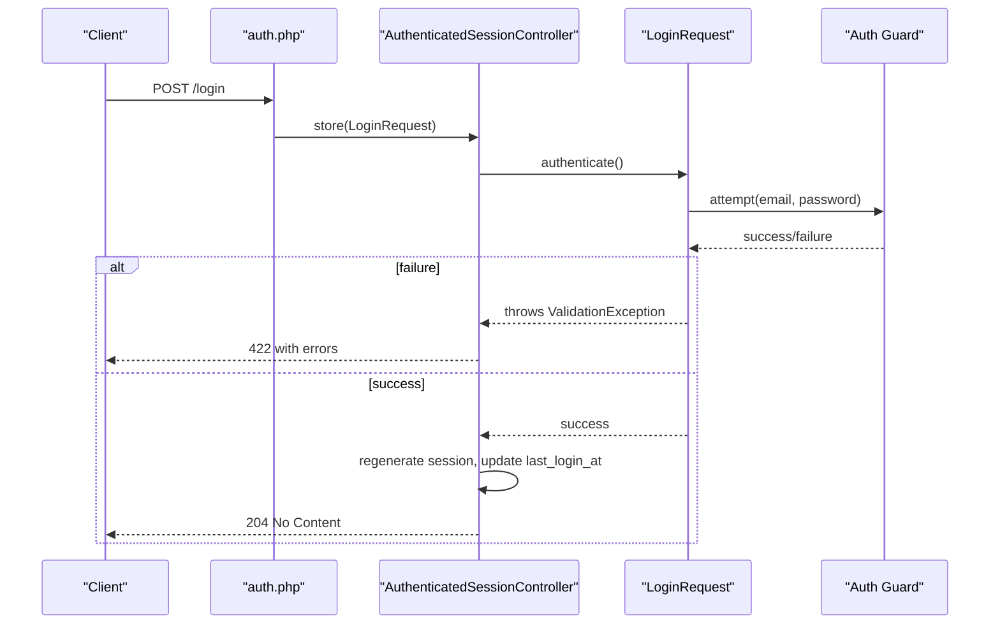
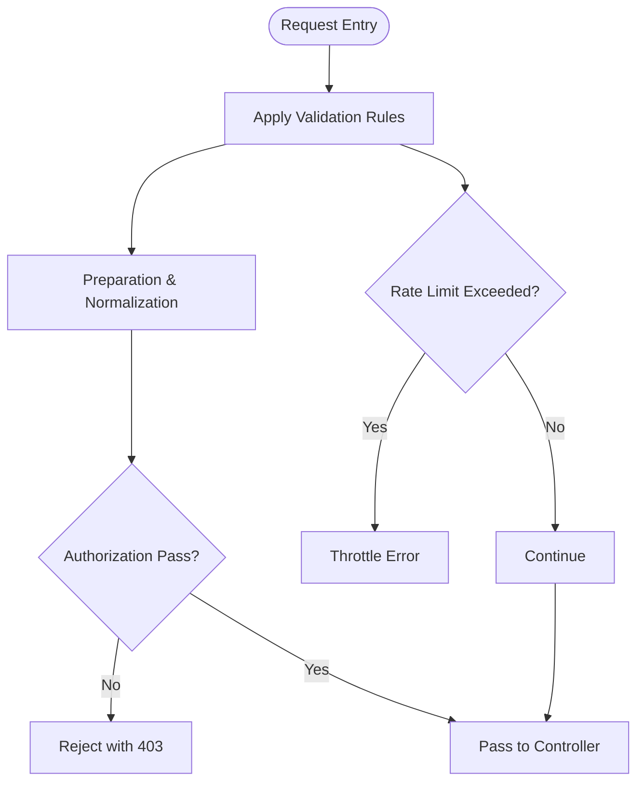
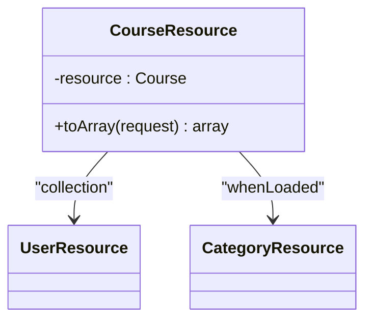
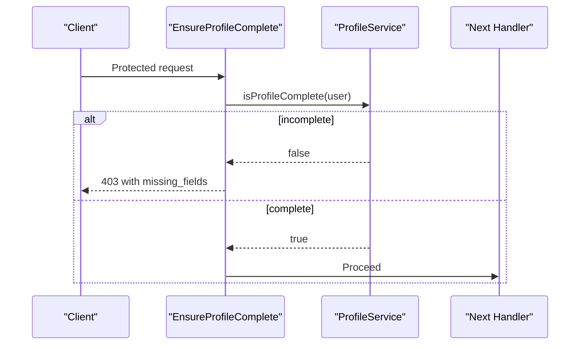
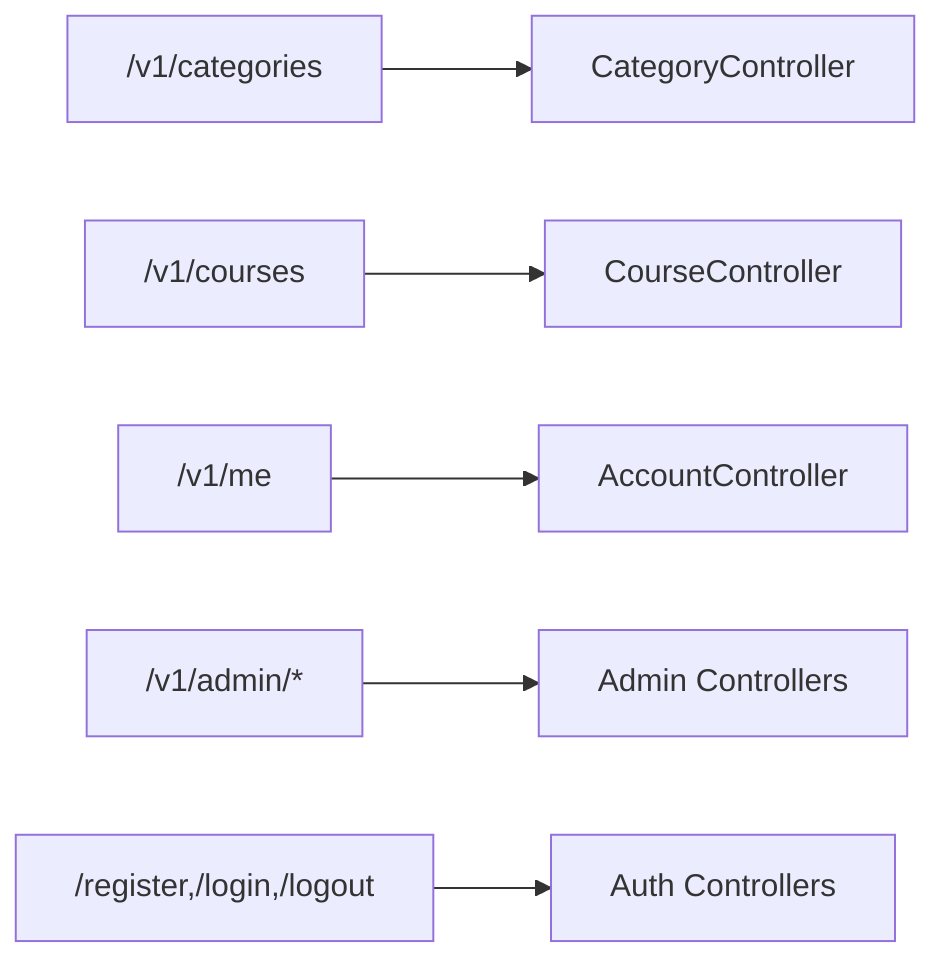
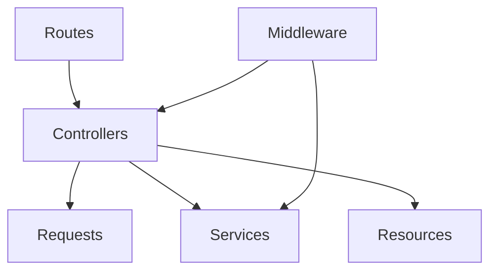
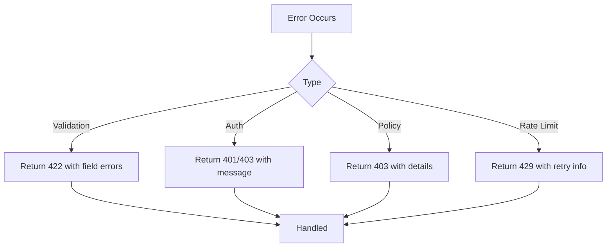

# Controller Layer Design

<cite>
**Referenced Files in This Document**
- [api.php](file://routes/api.php)
- [auth.php](file://routes/auth.php)
- [Controller.php](file://app/Http/Controllers/Controller.php)
- [CourseController.php](file://app/Http/Controllers/Api/V1/CourseController.php)
- [AuthenticatedSessionController.php](file://app/Http/Controllers/Auth/AuthenticatedSessionController.php)
- [StoreCourseRequest.php](file://app/Http/Requests/Api/V1/StoreCourseRequest.php)
- [LoginRequest.php](file://app/Http/Requests/Auth/LoginRequest.php)
- [CourseResource.php](file://app/Http/Resources/CourseResource.php)
- [EnsureEmailIsVerified.php](file://app/Http/Middleware/EnsureEmailIsVerified.php)
- [EnsureProfileComplete.php](file://app/Http/Middleware/EnsureProfileComplete.php)
- [ProfileService.php](file://app/Services/Profile/ProfileService.php)
</cite>

## Table of Contents
1. Introduction
2. Project Structure
3. Core Components
4. Architecture Overview
5. Detailed Component Analysis
6. Dependency Analysis
7. Performance Considerations
8. Troubleshooting Guide
9. Conclusion

## Introduction
This document explains the controller layer design in the Laravel backend with a focus on clear separation between HTTP request handling and business logic delegation to services. It covers:
- RESTful API controllers under app/Http/Controllers/Api/V1/ with versioned routing
- Authentication controllers under app/Http/Controllers/Auth/ for user management flows
- Input validation via Form Request classes in app/Http/Requests/
- Response transformation through Resource classes in app/Http/Resources/
- Middleware integration, error handling patterns, and controller best practices

The goal is to provide both high-level architecture and code-level insights that are accessible to readers with limited technical background.

## Project Structure
The application organizes HTTP concerns into distinct layers:
- Routing defines versioned API endpoints and authentication routes
- Controllers handle HTTP concerns only: parsing requests, delegating to services, and returning responses
- Form Requests encapsulate validation and authorization rules per endpoint
- Resources standardize JSON response shapes
- Middleware enforces cross-cutting concerns like email verification and profile completion
- Services contain business logic (e.g., notifications, storage, profile completeness)

**Diagram sources**
- [api.php:49-241](file://routes/api.php#L49-L241)
- [auth.php:11-37](file://routes/auth.php#L11-L37)
- [EnsureEmailIsVerified.php:17-25](file://app/Http/Middleware/EnsureEmailIsVerified.php#L17-L25)
- [EnsureProfileComplete.php:42-56](file://app/Http/Middleware/EnsureProfileComplete.php#L42-L56)
- [CourseController.php:23-145](file://app/Http/Controllers/Api/V1/CourseController.php#L23-L145)
- [AuthenticatedSessionController.php:13-41](file://app/Http/Controllers/Auth/AuthenticatedSessionController.php#L13-L41)

**Section sources**
- [api.php:49-241](file://routes/api.php#L49-L241)
- [auth.php:11-37](file://routes/auth.php#L11-L37)

## Core Components
- Base controller provides authorization capabilities used across all controllers
- API V1 controllers implement RESTful actions and delegate to services
- Auth controllers manage login, logout, registration, password reset, and email verification
- Form Requests centralize validation and per-request authorization
- Resources define consistent JSON structures returned by controllers
- Middleware enforce security and policy checks before reaching controllers

Key responsibilities:
- Controllers: parse input, call services, return resources or status codes
- Services: implement domain logic (e.g., media storage, notifications, profile completeness)
- Requests: validate inputs and enforce authorization at the boundary
- Resources: transform models into stable API payloads
- Middleware: apply global or route-scoped policies

**Section sources**
- [Controller.php:9-12](file://app/Http/Controllers/Controller.php#L9-L12)
- [CourseController.php:23-145](file://app/Http/Controllers/Api/V1/CourseController.php#L23-L145)
- [AuthenticatedSessionController.php:13-41](file://app/Http/Controllers/Auth/AuthenticatedSessionController.php#L13-L41)
- [StoreCourseRequest.php:17-57](file://app/Http/Requests/Api/V1/StoreCourseRequest.php#L17-L57)
- [LoginRequest.php:20-87](file://app/Http/Requests/Auth/LoginRequest.php#L20-L87)
- [CourseResource.php:11-43](file://app/Http/Resources/CourseResource.php#L11-L43)
- [EnsureEmailIsVerified.php:17-25](file://app/Http/Middleware/EnsureEmailIsVerified.php#L17-L25)
- [EnsureProfileComplete.php:28-56](file://app/Http/Middleware/EnsureProfileComplete.php#L28-L56)

## Architecture Overview
The API follows a layered approach:
- Versioning: All public and authenticated endpoints are grouped under v1
- Authentication: Sanctum-based token guard protects private routes; guest middleware protects public endpoints
- Validation: Each mutating endpoint uses a dedicated Form Request class
- Business Logic: Controllers delegate operations to services (e.g., MediaStorageService, NotificationDispatcher, ProfileService)
- Responses: Controllers return JsonResource instances or collections for consistent output

**Diagram sources**
- [api.php:49-241](file://routes/api.php#L49-L241)
- [auth.php:11-37](file://routes/auth.php#L11-L37)
- [CourseController.php:78-135](file://app/Http/Controllers/Api/V1/CourseController.php#L78-L135)
- [StoreCourseRequest.php:22-57](file://app/Http/Requests/Api/V1/StoreCourseRequest.php#L22-L57)
- [CourseResource.php:16-43](file://app/Http/Resources/CourseResource.php#L16-L43)

## Detailed Component Analysis

### RESTful API Controllers (Api/V1)
- Pattern: Thin controllers that accept validated requests and delegate to services
- Example: CourseController demonstrates filtering, file uploads, versioning changelog, and notification dispatch
- Authorization: Uses policy checks where appropriate (e.g., delete)
- Responses: Returns JsonResource or collection for consistent structure

**Diagram sources**
- [CourseController.php:23-145](file://app/Http/Controllers/Api/V1/CourseController.php#L23-L145)
- [StoreCourseRequest.php:17-57](file://app/Http/Requests/Api/V1/StoreCourseRequest.php#L17-L57)
- [CourseResource.php:11-43](file://app/Http/Resources/CourseResource.php#L11-L43)

**Section sources**
- [CourseController.php:30-145](file://app/Http/Controllers/Api/V1/CourseController.php#L30-L145)
- [StoreCourseRequest.php:17-57](file://app/Http/Requests/Api/V1/StoreCourseRequest.php#L17-L57)
- [CourseResource.php:11-43](file://app/Http/Resources/CourseResource.php#L11-L43)

### Authentication Controllers (Auth)
- Endpoints: register, login, forgot-password, reset-password, verify-email, logout
- Flow: LoginRequest validates credentials, attempts authentication, rate-limits failures, updates last login timestamp, and returns no-content on success
- Logout: Invalidates session and regenerates CSRF token

**Diagram sources**
- [auth.php:15-17](file://routes/auth.php#L15-L17)
- [AuthenticatedSessionController.php:18-27](file://app/Http/Controllers/Auth/AuthenticatedSessionController.php#L18-L27)
- [LoginRequest.php:30-56](file://app/Http/Requests/Auth/LoginRequest.php#L30-L56)

**Section sources**
- [auth.php:11-37](file://routes/auth.php#L11-L37)
- [AuthenticatedSessionController.php:13-41](file://app/Http/Controllers/Auth/AuthenticatedSessionController.php#L13-L41)
- [LoginRequest.php:20-87](file://app/Http/Requests/Auth/LoginRequest.php#L20-L87)

### Request Validation (Form Requests)
- Purpose: Centralize validation rules, authorization checks, and pre-validation transformations
- Examples:
  - StoreCourseRequest: validates course fields, ensures instructor IDs exist, generates slug from title when missing
  - LoginRequest: validates email/password, implements rate limiting and lockout handling

**Diagram sources**
- [StoreCourseRequest.php:22-57](file://app/Http/Requests/Api/V1/StoreCourseRequest.php#L22-L57)
- [LoginRequest.php:30-87](file://app/Http/Requests/Auth/LoginRequest.php#L30-L87)

**Section sources**
- [StoreCourseRequest.php:17-57](file://app/Http/Requests/Api/V1/StoreCourseRequest.php#L17-L57)
- [LoginRequest.php:20-87](file://app/Http/Requests/Auth/LoginRequest.php#L20-L87)

### Response Transformation (Resources)
- Purpose: Provide consistent, versioned API responses independent of model internals
- Example: CourseResource maps model attributes to a stable JSON structure, resolves media URLs, and includes related resources when loaded

**Diagram sources**
- [CourseResource.php:11-43](file://app/Http/Resources/CourseResource.php#L11-L43)

**Section sources**
- [CourseResource.php:11-43](file://app/Http/Resources/CourseResource.php#L11-L43)

### Middleware Integration
- Email verification: Blocks unverified users with a specific error payload
- Profile completion: Enforces required profile fields before allowing sensitive actions (e.g., course applications)

**Diagram sources**
- [EnsureProfileComplete.php:28-56](file://app/Http/Middleware/EnsureProfileComplete.php#L28-L56)
- [ProfileService.php:108-117](file://app/Services/Profile/ProfileService.php#L108-L117)

**Section sources**
- [EnsureEmailIsVerified.php:17-25](file://app/Http/Middleware/EnsureEmailIsVerified.php#L17-L25)
- [EnsureProfileComplete.php:28-56](file://app/Http/Middleware/EnsureProfileComplete.php#L28-L56)
- [ProfileService.php:18-117](file://app/Services/Profile/ProfileService.php#L18-L117)

### Routing and Versioning Strategy
- Versioning: All API endpoints are prefixed with v1 to support future evolution without breaking clients
- Public vs Private: Some endpoints are publicly readable; others require authentication via Sanctum
- Feature grouping: Related features share route groups and middleware stacks for clarity and maintainability

**Diagram sources**
- [api.php:49-241](file://routes/api.php#L49-L241)
- [auth.php:11-37](file://routes/auth.php#L11-L37)

**Section sources**
- [api.php:49-241](file://routes/api.php#L49-L241)
- [auth.php:11-37](file://routes/auth.php#L11-L37)

## Dependency Analysis
- Controllers depend on:
  - Form Requests for validation and authorization
  - Services for business logic (e.g., notifications, storage, profile checks)
  - Resources for response shaping
- Middleware depends on:
  - Services (e.g., ProfileService) for policy decisions
- Routing binds endpoints to controllers and applies middleware stacks

**Diagram sources**
- [api.php:49-241](file://routes/api.php#L49-L241)
- [auth.php:11-37](file://routes/auth.php#L11-L37)
- [CourseController.php:23-145](file://app/Http/Controllers/Api/V1/CourseController.php#L23-L145)
- [EnsureProfileComplete.php:28-56](file://app/Http/Middleware/EnsureProfileComplete.php#L28-L56)

**Section sources**
- [CourseController.php:23-145](file://app/Http/Controllers/Api/V1/CourseController.php#L23-L145)
- [EnsureProfileComplete.php:28-56](file://app/Http/Middleware/EnsureProfileComplete.php#L28-L56)

## Performance Considerations
- Use eager loading in controllers/resources to avoid N+1 queries (e.g., loading category and instructors)
- Paginate large lists to reduce payload size and database load
- Keep controllers thin to minimize processing overhead and improve testability
- Offload heavy work to services/jobs where applicable (e.g., certificate generation, bulk imports)
- Leverage caching for read-heavy endpoints if needed (outside current scope)

[No sources needed since this section provides general guidance]

## Troubleshooting Guide
Common issues and how they are handled:
- Validation failures: Form Requests throw structured validation exceptions with field-specific messages
- Rate limiting on login: LoginRequest enforces throttling and returns descriptive throttle errors
- Unverified email: EnsureEmailIsVerified returns a conflict response with a clear message
- Incomplete profile: EnsureProfileComplete returns a 403 with missing fields to guide users

**Section sources**
- [LoginRequest.php:43-79](file://app/Http/Requests/Auth/LoginRequest.php#L43-L79)
- [EnsureEmailIsVerified.php:17-25](file://app/Http/Middleware/EnsureEmailIsVerified.php#L17-L25)
- [EnsureProfileComplete.php:42-56](file://app/Http/Middleware/EnsureProfileComplete.php#L42-L56)

## Conclusion
The controller layer cleanly separates HTTP concerns from business logic:
- Versioned routing under v1 supports API evolution
- Controllers remain thin, delegating to services and using Form Requests for validation
- Resources ensure consistent API responses
- Middleware enforce critical policies such as email verification and profile completion
This design improves maintainability, testability, and scalability while providing a clear contract for frontend consumers.

[No sources needed since this section summarizes without analyzing specific files]