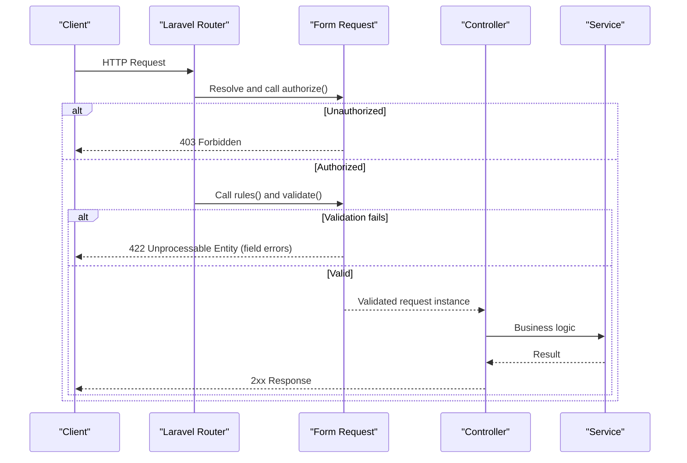
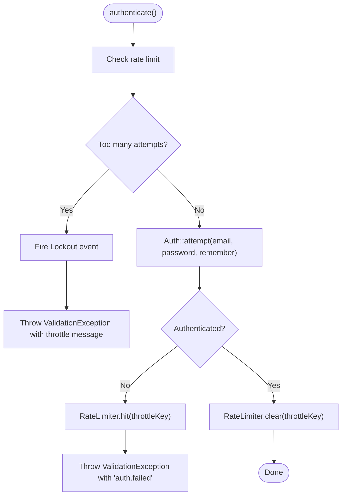
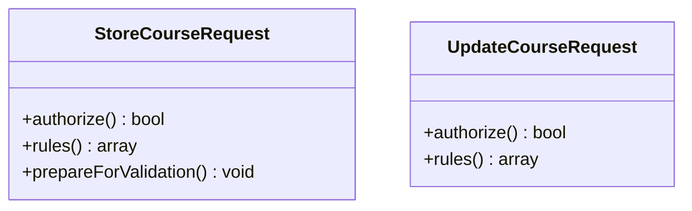
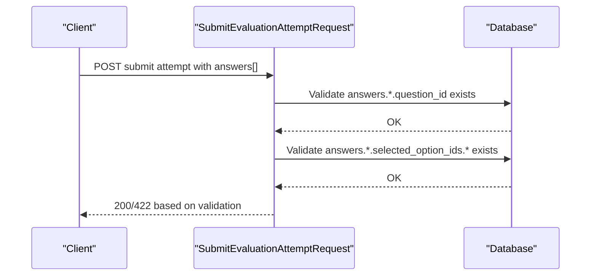
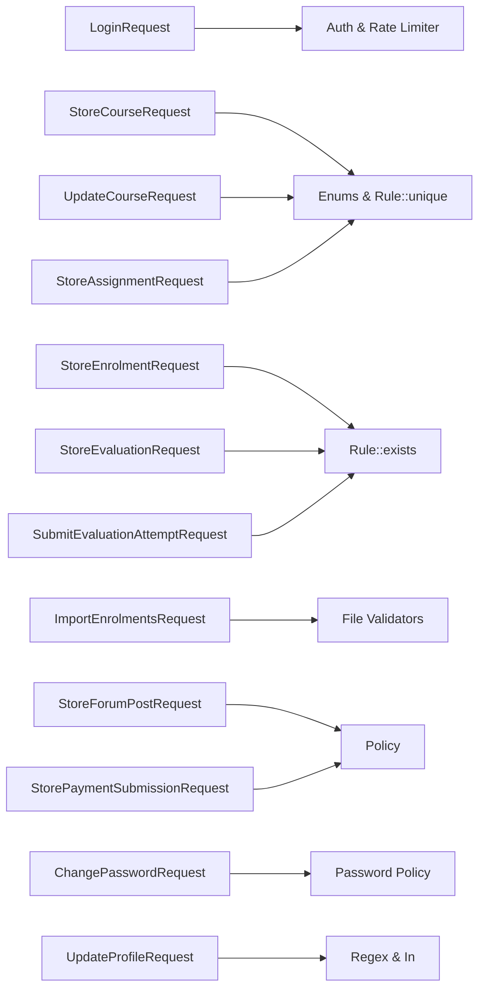

# Request Validation

<cite>
**Referenced Files in This Document**
- [LoginRequest.php](file://app/Http/Requests/Auth/LoginRequest.php)
- [StoreCourseRequest.php](file://app/Http/Requests/Api/V1/StoreCourseRequest.php)
- [UpdateCourseRequest.php](file://app/Http/Requests/Api/V1/UpdateCourseRequest.php)
- [StoreAssignmentRequest.php](file://app/Http/Requests/Api/V1/StoreAssignmentRequest.php)
- [StoreEnrolmentRequest.php](file://app/Http/Requests/Api/V1/StoreEnrolmentRequest.php)
- [ImportEnrolmentsRequest.php](file://app/Http/Requests/Api/V1/ImportEnrolmentsRequest.php)
- [StoreForumPostRequest.php](file://app/Http/Requests/Api/V1/StoreForumPostRequest.php)
- [StoreEvaluationRequest.php](file://app/Http/Requests/Api/V1/StoreEvaluationRequest.php)
- [SubmitEvaluationAttemptRequest.php](file://app/Http/Requests/Api/V1/SubmitEvaluationAttemptRequest.php)
- [StorePaymentSubmissionRequest.php](file://app/Http/Requests/Api/V1/StorePaymentSubmissionRequest.php)
- [ChangePasswordRequest.php](file://app/Http/Requests/Api/V1/ChangePasswordRequest.php)
- [UpdateProfileRequest.php](file://app/Http/Requests/Api/V1/UpdateProfileRequest.php)
</cite>

## Table of Contents
1. Introduction
2. Project Structure
3. Core Components
4. Architecture Overview
5. Detailed Component Analysis
6. Dependency Analysis
7. Performance Considerations
8. Troubleshooting Guide
9. Conclusion

## Introduction
This document explains how the application uses Laravel Form Request classes to validate and sanitize API inputs. It covers validation rules, custom messages where applicable, business rule enforcement boundaries, request typing strategies, conditional validation, and integration with Laravel’s validation pipeline and error responses. The goal is to help developers understand how each endpoint’s input is validated before it reaches controllers and services.

## Project Structure
The validation layer is organized under app/Http/Requests:
- Auth requests for authentication flows
- Api\V1 requests for domain-specific endpoints (courses, assignments, evaluations, enrolments, payments, forums, profile, etc.)

Each request class extends Laravel’s FormRequest and typically implements:
- authorize(): enforces policy-based or route-scoped authorization
- rules(): defines field-level validation rules
- Optional hooks like prepareForValidation() for pre-validation transformations

```mermaid
graph TB
subgraph "Auth"
LR["LoginRequest"]
end
subgraph "API V1"
SC["StoreCourseRequest"]
UC["UpdateCourseRequest"]
SA["StoreAssignmentRequest"]
SE["StoreEnrolmentRequest"]
IE["ImportEnrolmentsRequest"]
SFP["StoreForumPostRequest"]
SV["StoreEvaluationRequest"]
SEA["SubmitEvaluationAttemptRequest"]
SPS["StorePaymentSubmissionRequest"]
CP["ChangePasswordRequest"]
UP["UpdateProfileRequest"]
end
LR --> |"used by"| AuthFlow["Auth Flow"]
SC --> |"used by"| CourseController["Course Controller"]
UC --> |"used by"| CourseController
SA --> |"used by"| AssignmentController["Assignment Controller"]
SE --> |"used by"| EnrolmentController["Enrolment Controller"]
IE --> |"used by"| EnrolmentController
SFP --> |"used by"| ForumController["Forum Controller"]
SV --> |"used by"| EvaluationController["Evaluation Controller"]
SEA --> |"used by"| EvaluationController
SPS --> |"used by"| PaymentController["Payment Controller"]
CP --> |"used by"| AccountController["Account Controller"]
UP --> |"used by"| ProfileController["Profile Controller"]
```

**Diagram sources**
- [LoginRequest.php:15-36](file://app/Http/Requests/Auth/LoginRequest.php#L15-L36)
- [StoreCourseRequest.php:15-50](file://app/Http/Requests/Api/V1/StoreCourseRequest.php#L15-L50)
- [UpdateCourseRequest.php:15-53](file://app/Http/Requests/Api/V1/UpdateCourseRequest.php#L15-L53)
- [StoreAssignmentRequest.php:13-37](file://app/Http/Requests/Api/V1/StoreAssignmentRequest.php#L13-L37)
- [StoreEnrolmentRequest.php:11-28](file://app/Http/Requests/Api/V1/StoreEnrolmentRequest.php#L11-L28)
- [ImportEnrolmentsRequest.php:11-24](file://app/Http/Requests/Api/V1/ImportEnrolmentsRequest.php#L11-L24)
- [StoreForumPostRequest.php:11-26](file://app/Http/Requests/Api/V1/StoreForumPostRequest.php#L11-L26)
- [StoreEvaluationRequest.php:11-35](file://app/Http/Requests/Api/V1/StoreEvaluationRequest.php#L11-L35)
- [SubmitEvaluationAttemptRequest.php:11-30](file://app/Http/Requests/Api/V1/SubmitEvaluationAttemptRequest.php#L11-L30)
- [StorePaymentSubmissionRequest.php:10-33](file://app/Http/Requests/Api/V1/StorePaymentSubmissionRequest.php#L10-L33)
- [ChangePasswordRequest.php:10-23](file://app/Http/Requests/Api/V1/ChangePasswordRequest.php#L10-L23)
- [UpdateProfileRequest.php:9-36](file://app/Http/Requests/Api/V1/UpdateProfileRequest.php#L9-L36)

**Section sources**
- [LoginRequest.php:15-36](file://app/Http/Requests/Auth/LoginRequest.php#L15-L36)
- [StoreCourseRequest.php:15-50](file://app/Http/Requests/Api/V1/StoreCourseRequest.php#L15-L50)
- [UpdateCourseRequest.php:15-53](file://app/Http/Requests/Api/V1/UpdateCourseRequest.php#L15-L53)
- [StoreAssignmentRequest.php:13-37](file://app/Http/Requests/Api/V1/StoreAssignmentRequest.php#L13-L37)
- [StoreEnrolmentRequest.php:11-28](file://app/Http/Requests/Api/V1/StoreEnrolmentRequest.php#L11-L28)
- [ImportEnrolmentsRequest.php:11-24](file://app/Http/Requests/Api/V1/ImportEnrolmentsRequest.php#L11-L24)
- [StoreForumPostRequest.php:11-26](file://app/Http/Requests/Api/V1/StoreForumPostRequest.php#L11-L26)
- [StoreEvaluationRequest.php:11-35](file://app/Http/Requests/Api/V1/StoreEvaluationRequest.php#L11-L35)
- [SubmitEvaluationAttemptRequest.php:11-30](file://app/Http/Requests/Api/V1/SubmitEvaluationAttemptRequest.php#L11-L30)
- [StorePaymentSubmissionRequest.php:10-33](file://app/Http/Requests/Api/V1/StorePaymentSubmissionRequest.php#L10-L33)
- [ChangePasswordRequest.php:10-23](file://app/Http/Requests/Api/V1/ChangePasswordRequest.php#L10-L23)
- [UpdateProfileRequest.php:9-36](file://app/Http/Requests/Api/V1/UpdateProfileRequest.php#L9-L36)

## Core Components
- LoginRequest: Validates email/password and integrates rate limiting and lockout handling during authentication attempts.
- StoreCourseRequest / UpdateCourseRequest: Strongly typed enums for course attributes; unique slug generation; optional fields with sometimes; image and URL thumbnail handling; instructor existence checks.
- StoreAssignmentRequest: Enum-backed submission type; rubric array validation with required-with conditions.
- StoreEnrolmentRequest: Ensures course exists and is published via Rule::exists with a where clause.
- ImportEnrolmentsRequest: File upload validation for CSV/TXT with size limits.
- StoreForumPostRequest: Minimal body validation with route-scoped authorization.
- StoreEvaluationRequest: Numeric pass score bounds; date range validation; question IDs existence checks.
- SubmitEvaluationAttemptRequest: Nested answers array with option and question ID existence checks.
- StorePaymentSubmissionRequest: Amount and receipt file validation; business rules enforced in service layer.
- ChangePasswordRequest: Password confirmation and default password policy.
- UpdateProfileRequest: Conditional phone validation using regex; enum-like allowed values via in; URL validations for profiles.

Key patterns:
- Authorization via authorize() using policies and route model bindings
- Field-level validation via rules()
- Pre-validation transformation via prepareForValidation()
- Use of built-in validators and Rule/Enum helpers
- Separation of concerns: shape validation in requests; business rules in services

**Section sources**
- [LoginRequest.php:15-87](file://app/Http/Requests/Auth/LoginRequest.php#L15-L87)
- [StoreCourseRequest.php:15-57](file://app/Http/Requests/Api/V1/StoreCourseRequest.php#L15-L57)
- [UpdateCourseRequest.php:15-53](file://app/Http/Requests/Api/V1/UpdateCourseRequest.php#L15-L53)
- [StoreAssignmentRequest.php:13-37](file://app/Http/Requests/Api/V1/StoreAssignmentRequest.php#L13-L37)
- [StoreEnrolmentRequest.php:11-28](file://app/Http/Requests/Api/V1/StoreEnrolmentRequest.php#L11-L28)
- [ImportEnrolmentsRequest.php:11-24](file://app/Http/Requests/Api/V1/ImportEnrolmentsRequest.php#L11-L24)
- [StoreForumPostRequest.php:11-26](file://app/Http/Requests/Api/V1/StoreForumPostRequest.php#L11-L26)
- [StoreEvaluationRequest.php:11-35](file://app/Http/Requests/Api/V1/StoreEvaluationRequest.php#L11-L35)
- [SubmitEvaluationAttemptRequest.php:11-30](file://app/Http/Requests/Api/V1/SubmitEvaluationAttemptRequest.php#L11-L30)
- [StorePaymentSubmissionRequest.php:10-33](file://app/Http/Requests/Api/V1/StorePaymentSubmissionRequest.php#L10-L33)
- [ChangePasswordRequest.php:10-23](file://app/Http/Requests/Api/V1/ChangePasswordRequest.php#L10-L23)
- [UpdateProfileRequest.php:9-36](file://app/Http/Requests/Api/V1/UpdateProfileRequest.php#L9-L36)

## Architecture Overview
Form Requests act as the first line of defense for API inputs. They enforce:
- Authorization (authorize)
- Input shape and constraints (rules)
- Pre-processing (prepareForValidation)
- Custom cross-field logic (custom methods when needed)

On failure, Laravel throws a ValidationException which is converted into a standardized JSON response with field errors. On success, the controller receives a fully validated request instance.

**Diagram sources**
- [LoginRequest.php:15-87](file://app/Http/Requests/Auth/LoginRequest.php#L15-L87)
- [StoreCourseRequest.php:15-57](file://app/Http/Requests/Api/V1/StoreCourseRequest.php#L15-L57)
- [UpdateCourseRequest.php:15-53](file://app/Http/Requests/Api/V1/UpdateCourseRequest.php#L15-L53)
- [StoreAssignmentRequest.php:13-37](file://app/Http/Requests/Api/V1/StoreAssignmentRequest.php#L13-L37)
- [StoreEnrolmentRequest.php:11-28](file://app/Http/Requests/Api/V1/StoreEnrolmentRequest.php#L11-L28)
- [ImportEnrolmentsRequest.php:11-24](file://app/Http/Requests/Api/V1/ImportEnrolmentsRequest.php#L11-L24)
- [StoreForumPostRequest.php:11-26](file://app/Http/Requests/Api/V1/StoreForumPostRequest.php#L11-L26)
- [StoreEvaluationRequest.php:11-35](file://app/Http/Requests/Api/V1/StoreEvaluationRequest.php#L11-L35)
- [SubmitEvaluationAttemptRequest.php:11-30](file://app/Http/Requests/Api/V1/SubmitEvaluationAttemptRequest.php#L11-L30)
- [StorePaymentSubmissionRequest.php:10-33](file://app/Http/Requests/Api/V1/StorePaymentSubmissionRequest.php#L10-L33)
- [ChangePasswordRequest.php:10-23](file://app/Http/Requests/Api/V1/ChangePasswordRequest.php#L10-L23)
- [UpdateProfileRequest.php:9-36](file://app/Http/Requests/Api/V1/UpdateProfileRequest.php#L9-L36)

## Detailed Component Analysis

### Authentication Request: LoginRequest
- Authorization: Always allows the request to proceed to validation; rate limiting is handled within the request.
- Rules: Requires email and password.
- Custom logic:
  - authenticate(): Attempts login, hits rate limiter on failure, clears on success, and throws ValidationException with localized messages.
  - ensureIsNotRateLimited(): Checks attempt count, fires Lockout event, and throws ValidationException with throttle message including seconds and minutes.
  - throttleKey(): Builds a key from lowercased email and IP.

**Diagram sources**
- [LoginRequest.php:43-87](file://app/Http/Requests/Auth/LoginRequest.php#L43-L87)

**Section sources**
- [LoginRequest.php:15-87](file://app/Http/Requests/Auth/LoginRequest.php#L15-L87)

### Course Management Requests: StoreCourseRequest and UpdateCourseRequest
- Authorization: Uses policies to allow create/update based on current user and route models.
- Rules:
  - Enums for level and enrolment_policy; status for updates.
  - Slug uniqueness with ignore for updates.
  - Arrays for application questions with length limits.
  - Thumbnail handling supports either URL or uploaded image.
  - Instructor IDs must exist and have the correct role.
- Pre-validation:
  - prepareForValidation(): Auto-generates slug from title if not provided.

**Diagram sources**
- [StoreCourseRequest.php:15-57](file://app/Http/Requests/Api/V1/StoreCourseRequest.php#L15-L57)
- [UpdateCourseRequest.php:15-53](file://app/Http/Requests/Api/V1/UpdateCourseRequest.php#L15-L53)

**Section sources**
- [StoreCourseRequest.php:15-57](file://app/Http/Requests/Api/V1/StoreCourseRequest.php#L15-L57)
- [UpdateCourseRequest.php:15-53](file://app/Http/Requests/Api/V1/UpdateCourseRequest.php#L15-L53)

### Assignment Creation: StoreAssignmentRequest
- Authorization: Policy-based creation scoped to a module route model.
- Rules:
  - Enum-backed submission type.
  - Optional due date and late penalty policy reference.
  - Rubrics array with required-with conditions ensuring criterion and max_points are present when rubrics are provided.

**Section sources**
- [StoreAssignmentRequest.php:13-37](file://app/Http/Requests/Api/V1/StoreAssignmentRequest.php#L13-L37)

### Enrolment Requests: StoreEnrolmentRequest and ImportEnrolmentsRequest
- StoreEnrolmentRequest:
  - Ensures course_id exists and is published via Rule::exists with where clause.
  - Optional section_id reference.
- ImportEnrolmentsRequest:
  - Requires a CSV/TXT file with size limit.

**Section sources**
- [StoreEnrolmentRequest.php:11-28](file://app/Http/Requests/Api/V1/StoreEnrolmentRequest.php#L11-L28)
- [ImportEnrolmentsRequest.php:11-24](file://app/Http/Requests/Api/V1/ImportEnrolmentsRequest.php#L11-L24)

### Forum Post: StoreForumPostRequest
- Authorization: Route-scoped permission check against a thread model.
- Rules: Body is required string.

**Section sources**
- [StoreForumPostRequest.php:11-26](file://app/Http/Requests/Api/V1/StoreForumPostRequest.php#L11-L26)

### Evaluations: StoreEvaluationRequest and SubmitEvaluationAttemptRequest
- StoreEvaluationRequest:
  - Numeric pass score bounded between 0 and 100.
  - Date range validation ensures available_until after available_from.
  - Question IDs validated for existence.
- SubmitEvaluationAttemptRequest:
  - Answers array with nested validation for question_id and selected_option_ids existence.

**Diagram sources**
- [SubmitEvaluationAttemptRequest.php:11-30](file://app/Http/Requests/Api/V1/SubmitEvaluationAttemptRequest.php#L11-L30)

**Section sources**
- [StoreEvaluationRequest.php:11-35](file://app/Http/Requests/Api/V1/StoreEvaluationRequest.php#L11-L35)
- [SubmitEvaluationAttemptRequest.php:11-30](file://app/Http/Requests/Api/V1/SubmitEvaluationAttemptRequest.php#L11-L30)

### Payments: StorePaymentSubmissionRequest
- Authorization: Policy-based permission to submit payment for an order.
- Rules:
  - Amount must be numeric and at least 0.01.
  - Receipt must be an image file with size and MIME constraints.
- Note: Business rules such as “not exceeding remaining balance” and “no pending payment” are enforced in the service layer, not here.

**Section sources**
- [StorePaymentSubmissionRequest.php:10-33](file://app/Http/Requests/Api/V1/StorePaymentSubmissionRequest.php#L10-L33)

### Account and Profile: ChangePasswordRequest and UpdateProfileRequest
- ChangePasswordRequest:
  - Requires current_password and a new password confirmed via password_confirmation.
  - Applies default password policy.
- UpdateProfileRequest:
  - Phone validated conditionally with regex and length constraints.
  - Highest qualification restricted to a set of allowed values.
  - URLs validated for format and length.

**Section sources**
- [ChangePasswordRequest.php:10-23](file://app/Http/Requests/Api/V1/ChangePasswordRequest.php#L10-L23)
- [UpdateProfileRequest.php:9-36](file://app/Http/Requests/Api/V1/UpdateProfileRequest.php#L9-L36)

## Dependency Analysis
Common dependencies across requests:
- Policies and route model bindings for authorization
- Laravel’s Rule and Enum validators for database and enum constraints
- Built-in validators for strings, numbers, arrays, files, dates, and URLs
- Service-layer separation for complex business rules that depend on entity state

**Diagram sources**
- [LoginRequest.php:15-87](file://app/Http/Requests/Auth/LoginRequest.php#L15-L87)
- [StoreCourseRequest.php:15-57](file://app/Http/Requests/Api/V1/StoreCourseRequest.php#L15-L57)
- [UpdateCourseRequest.php:15-53](file://app/Http/Requests/Api/V1/UpdateCourseRequest.php#L15-L53)
- [StoreAssignmentRequest.php:13-37](file://app/Http/Requests/Api/V1/StoreAssignmentRequest.php#L13-L37)
- [StoreEnrolmentRequest.php:11-28](file://app/Http/Requests/Api/V1/StoreEnrolmentRequest.php#L11-L28)
- [ImportEnrolmentsRequest.php:11-24](file://app/Http/Requests/Api/V1/ImportEnrolmentsRequest.php#L11-L24)
- [StoreForumPostRequest.php:11-26](file://app/Http/Requests/Api/V1/StoreForumPostRequest.php#L11-L26)
- [StoreEvaluationRequest.php:11-35](file://app/Http/Requests/Api/V1/StoreEvaluationRequest.php#L11-L35)
- [SubmitEvaluationAttemptRequest.php:11-30](file://app/Http/Requests/Api/V1/SubmitEvaluationAttemptRequest.php#L11-L30)
- [StorePaymentSubmissionRequest.php:10-33](file://app/Http/Requests/Api/V1/StorePaymentSubmissionRequest.php#L10-L33)
- [ChangePasswordRequest.php:10-23](file://app/Http/Requests/Api/V1/ChangePasswordRequest.php#L10-L23)
- [UpdateProfileRequest.php:9-36](file://app/Http/Requests/Api/V1/UpdateProfileRequest.php#L9-L36)

**Section sources**
- [StoreCourseRequest.php:15-57](file://app/Http/Requests/Api/V1/StoreCourseRequest.php#L15-L57)
- [UpdateCourseRequest.php:15-53](file://app/Http/Requests/Api/V1/UpdateCourseRequest.php#L15-L53)
- [StoreEnrolmentRequest.php:11-28](file://app/Http/Requests/Api/V1/StoreEnrolmentRequest.php#L11-L28)
- [SubmitEvaluationAttemptRequest.php:11-30](file://app/Http/Requests/Api/V1/SubmitEvaluationAttemptRequest.php#L11-L30)
- [ChangePasswordRequest.php:10-23](file://app/Http/Requests/Api/V1/ChangePasswordRequest.php#L10-L23)
- [UpdateProfileRequest.php:9-36](file://app/Http/Requests/Api/V1/UpdateProfileRequest.php#L9-L36)

## Performance Considerations
- Prefer Rule::exists with minimal queries; avoid N+1 lookups by validating only necessary fields.
- Use enums to constrain inputs early, reducing downstream branching.
- Keep file uploads constrained by mimes and size to reduce storage and processing overhead.
- Defer expensive business rule checks to services after validation passes.
- For large arrays (e.g., application_questions), enforce reasonable max lengths to prevent abuse.

[No sources needed since this section provides general guidance]

## Troubleshooting Guide
Common issues and resolutions:
- 422 Unprocessable Entity: Indicates validation failures. Inspect the returned field errors to identify missing or invalid fields.
- 403 Forbidden: Authorization failed in authorize(). Verify user permissions and route model bindings.
- Rate-limited login: Excessive attempts trigger throttling. Wait until the cooldown period expires or adjust client retry behavior.
- File upload failures: Ensure MIME types and sizes match expectations. Confirm storage disk configuration if persistence is involved.
- Cross-field validation: If a rule depends on another field, use required_with or custom validator methods.

Error response formatting:
- Laravel converts ValidationException into a JSON response containing field-specific messages.
- Localization keys (e.g., auth.failed, auth.throttle) are used for user-friendly messages.

**Section sources**
- [LoginRequest.php:43-87](file://app/Http/Requests/Auth/LoginRequest.php#L43-L87)

## Conclusion
The Form Request classes provide a robust, consistent foundation for API input validation and sanitization. They combine authorization, strict typing via enums, precise field rules, and selective pre-validation transformations. Complex business rules are intentionally kept out of requests and implemented in services, keeping requests focused on input integrity. This separation improves testability, clarity, and maintainability across the application.

[No sources needed since this section summarizes without analyzing specific files]