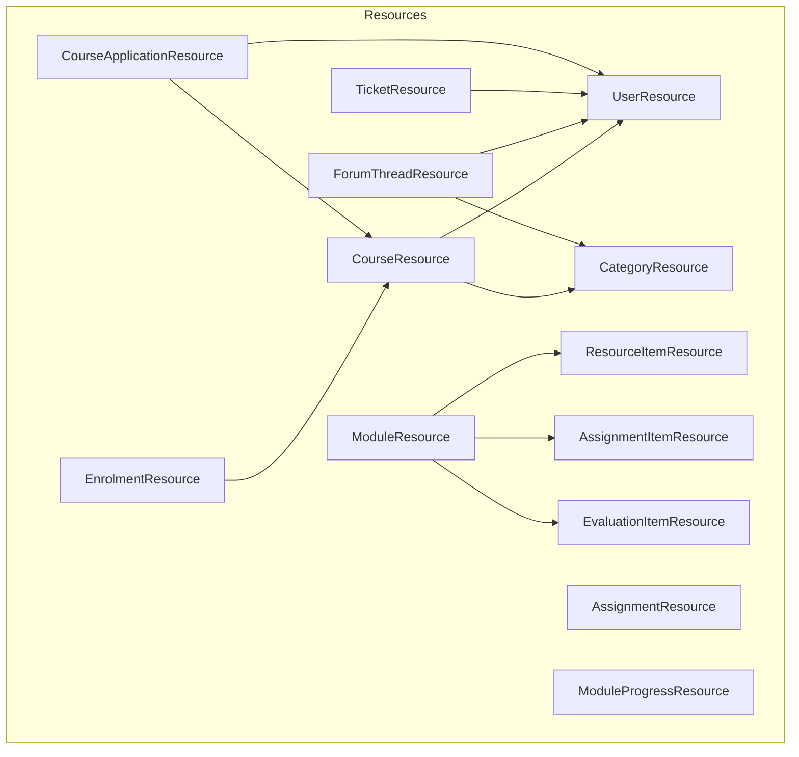
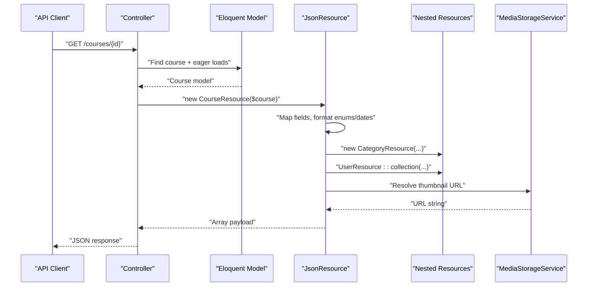
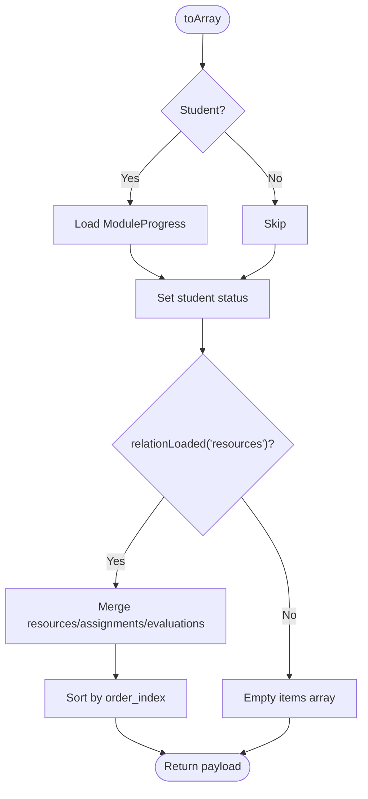
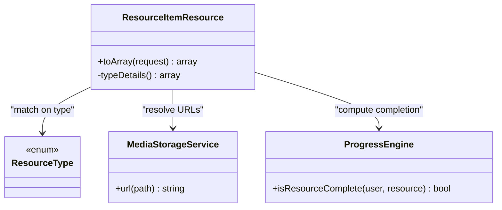
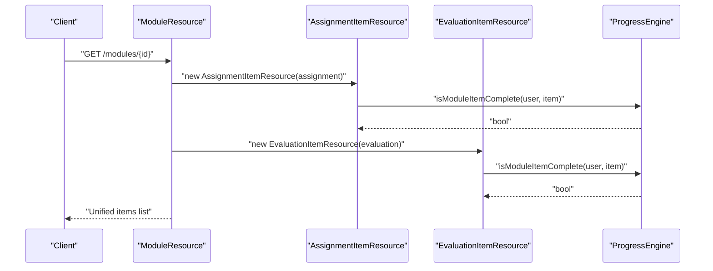
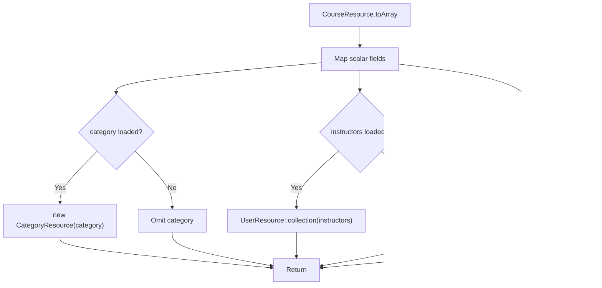
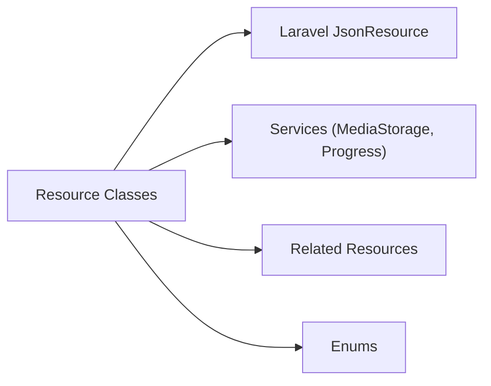

# Response Resources

<cite>
**Referenced Files in This Document**
- [UserResource.php](file://app/Http/Resources/UserResource.php)
- [CourseResource.php](file://app/Http/Resources/CourseResource.php)
- [ModuleResource.php](file://app/Http/Resources/ModuleResource.php)
- [AssignmentResource.php](file://app/Http/Resources/AssignmentResource.php)
- [ResourceItemResource.php](file://app/Http/Resources/ResourceItemResource.php)
- [AssignmentItemResource.php](file://app/Http/Resources/AssignmentItemResource.php)
- [EvaluationItemResource.php](file://app/Http/Resources/EvaluationItemResource.php)
- [CategoryResource.php](file://app/Http/Resources/CategoryResource.php)
- [ModuleProgressResource.php](file://app/Http/Resources/ModuleProgressResource.php)
- [EnrolmentResource.php](file://app/Http/Resources/EnrolmentResource.php)
- [ForumThreadResource.php](file://app/Http/Resources/ForumThreadResource.php)
- [TicketResource.php](file://app/Http/Resources/TicketResource.php)
- [CourseApplicationResource.php](file://app/Http/Resources/CourseApplicationResource.php)
</cite>

## Table of Contents
1. [Introduction](#introduction)
2. [Project Structure](#project-structure)
3. [Core Components](#core-components)
4. [Architecture Overview](#architecture-overview)
5. [Detailed Component Analysis](#detailed-component-analysis)
6. [Dependency Analysis](#dependency-analysis)
7. [Performance Considerations](#performance-considerations)
8. [Troubleshooting Guide](#troubleshooting-guide)
9. [Conclusion](#conclusion)

## Introduction
This document explains how the application uses Laravel API Resource classes to transform Eloquent models into consistent, versioned JSON responses. It covers transformation patterns, field mapping, serialization strategies, handling of relationships and nested data, conditional inclusion, formatting options, and performance optimizations. It also outlines integration with Laravel’s API resource system and practical caching strategies for improved performance.

## Project Structure
The response resources live under app/Http/Resources and follow a one-resource-per-entity pattern. Each class extends JsonResource and implements toArray(Request $request) to define the exact shape of the JSON payload. Resources compose other resources via collection() or single-resource instantiation to represent relationships and nested structures.

**Diagram sources**
- [CourseResource.php:16-42](file://app/Http/Resources/CourseResource.php#L16-L42)
- [ModuleResource.php:21-43](file://app/Http/Resources/ModuleResource.php#L21-L43)
- [ResourceItemResource.php:27-53](file://app/Http/Resources/ResourceItemResource.php#L27-L53)
- [AssignmentItemResource.php:28-72](file://app/Http/Resources/AssignmentItemResource.php#L28-L72)
- [EvaluationItemResource.php:28-75](file://app/Http/Resources/EvaluationItemResource.php#L28-L75)
- [CategoryResource.php:15-24](file://app/Http/Resources/CategoryResource.php#L15-L24)
- [EnrolmentResource.php:15-26](file://app/Http/Resources/EnrolmentResource.php#L15-L26)
- [ForumThreadResource.php:23-50](file://app/Http/Resources/ForumThreadResource.php#L23-L50)
- [TicketResource.php:15-27](file://app/Http/Resources/TicketResource.php#L15-L27)
- [CourseApplicationResource.php:19-40](file://app/Http/Resources/CourseApplicationResource.php#L19-L40)

**Section sources**
- [CourseResource.php:16-42](file://app/Http/Resources/CourseResource.php#L16-L42)
- [ModuleResource.php:21-43](file://app/Http/Resources/ModuleResource.php#L21-L43)

## Core Components
- UserResource: Normalizes user fields, converts enums to values, formats timestamps, and resolves media URLs through a storage service.
- CourseResource: Exposes course metadata, formats dates, maps category and instructors as nested resources, and resolves thumbnail URLs.
- ModuleResource: Computes per-student module status, conditionally includes items by merging three item types (resources, assignments, evaluations), and orders them consistently.
- AssignmentResource: Maps assignment details, derives required/order from ModuleItem, and includes rubrics when loaded.
- ResourceItemResource: Provides a unified envelope for multiple resource types, flattens type-specific details into a details object, computes completion status, and resolves file/media URLs.
- AssignmentItemResource: Presents an assignment summary within a module list, including student-specific submission info and completion state.
- EvaluationItemResource: Presents an evaluation summary with attempts used and best attempt score for students.
- CategoryResource: Lightweight category representation with optional counts.
- ModuleProgressResource: Serializes progress records with human-friendly titles and timestamps.
- EnrolmentResource: Wraps enrolment data with related course and order resources.
- ForumThreadResource: Returns thread metadata, head post, tags, unread flags, and latest participant, excluding heavy reply payloads.
- TicketResource: Summarizes tickets with minimal course snapshot and messages collection.
- CourseApplicationResource: Aggregates application data, recommended courses, and reviewer snapshot.

Key patterns across components:
- Enum normalization: Convert enum instances to scalar values using ->value.
- Timestamp formatting: Use ISO-8601 strings via toIso8601String() or date formatting helpers.
- Conditional inclusion: Use whenLoaded() for eager-loaded relations and when() for computed flags.
- Nested resources: Compose other resources via new XResource(...) or XResource::collection(...).
- Media URL resolution: Delegate to a storage service to produce absolute URLs.
- Student-contextual data: Gate sensitive or personal data behind request->user() role checks.

**Section sources**
- [UserResource.php:16-36](file://app/Http/Resources/UserResource.php#L16-L36)
- [CourseResource.php:16-42](file://app/Http/Resources/CourseResource.php#L16-L42)
- [ModuleResource.php:21-43](file://app/Http/Resources/ModuleResource.php#L21-L43)
- [AssignmentResource.php:16-39](file://app/Http/Resources/AssignmentResource.php#L16-L39)
- [ResourceItemResource.php:27-96](file://app/Http/Resources/ResourceItemResource.php#L27-L96)
- [AssignmentItemResource.php:28-72](file://app/Http/Resources/AssignmentItemResource.php#L28-L72)
- [EvaluationItemResource.php:28-75](file://app/Http/Resources/EvaluationItemResource.php#L28-L75)
- [CategoryResource.php:15-24](file://app/Http/Resources/CategoryResource.php#L15-L24)
- [ModuleProgressResource.php:15-24](file://app/Http/Resources/ModuleProgressResource.php#L15-L24)
- [EnrolmentResource.php:15-26](file://app/Http/Resources/EnrolmentResource.php#L15-L26)
- [ForumThreadResource.php:23-50](file://app/Http/Resources/ForumThreadResource.php#L23-L50)
- [TicketResource.php:15-27](file://app/Http/Resources/TicketResource.php#L15-L27)
- [CourseApplicationResource.php:19-40](file://app/Http/Resources/CourseApplicationResource.php#L19-L40)

## Architecture Overview
The resources act as a presentation layer between domain models and API consumers. They enforce a stable contract regardless of underlying schema changes, encapsulate formatting logic, and centralize relationship shaping.

**Diagram sources**
- [CourseResource.php:16-42](file://app/Http/Resources/CourseResource.php#L16-L42)
- [CategoryResource.php:15-24](file://app/Http/Resources/CategoryResource.php#L15-L24)
- [UserResource.php:16-36](file://app/Http/Resources/UserResource.php#L16-L36)

## Detailed Component Analysis

### ModuleResource: Unified Item List and Progress Status
- Computes per-student status by querying ModuleProgress for the current student.
- Conditionally builds items by merging three relation sets (resources, assignments, evaluations) and sorting by order_index.
- Delegates each item to its specific resource for consistent envelopes.

**Diagram sources**
- [ModuleResource.php:21-43](file://app/Http/Resources/ModuleResource.php#L21-L43)
- [ModuleResource.php:53-70](file://app/Http/Resources/ModuleResource.php#L53-L70)

**Section sources**
- [ModuleResource.php:21-43](file://app/Http/Resources/ModuleResource.php#L21-L43)
- [ModuleResource.php:53-70](file://app/Http/Resources/ModuleResource.php#L53-L70)

### ResourceItemResource: Multi-Type Normalization
- Produces a uniform envelope for seven resource types.
- Flattens type-specific attributes into a details object.
- Computes completion status via a service and resolves media URLs.

**Diagram sources**
- [ResourceItemResource.php:27-96](file://app/Http/Resources/ResourceItemResource.php#L27-L96)

**Section sources**
- [ResourceItemResource.php:27-96](file://app/Http/Resources/ResourceItemResource.php#L27-L96)

### AssignmentItemResource and EvaluationItemResource: Listing Shapes
- Provide compact summaries for module listings.
- Include student-specific data only for authenticated students.
- Compute completion and present latest scores or submissions.

**Diagram sources**
- [ModuleResource.php:53-70](file://app/Http/Resources/ModuleResource.php#L53-L70)
- [AssignmentItemResource.php:28-72](file://app/Http/Resources/AssignmentItemResource.php#L28-L72)
- [EvaluationItemResource.php:28-75](file://app/Http/Resources/EvaluationItemResource.php#L28-L75)

**Section sources**
- [AssignmentItemResource.php:28-72](file://app/Http/Resources/AssignmentItemResource.php#L28-L72)
- [EvaluationItemResource.php:28-75](file://app/Http/Resources/EvaluationItemResource.php#L28-L75)

### CourseResource and CategoryResource: Relationship Mapping
- Embeds category and instructors using whenLoaded to avoid N+1 queries.
- Formats dates and resolves media URLs.

**Diagram sources**
- [CourseResource.php:16-42](file://app/Http/Resources/CourseResource.php#L16-L42)
- [CategoryResource.php:15-24](file://app/Http/Resources/CategoryResource.php#L15-L24)
- [UserResource.php:16-36](file://app/Http/Resources/UserResource.php#L16-L36)

**Section sources**
- [CourseResource.php:16-42](file://app/Http/Resources/CourseResource.php#L16-L42)
- [CategoryResource.php:15-24](file://app/Http/Resources/CategoryResource.php#L15-L24)

### EnrolmentResource, ForumThreadResource, TicketResource, CourseApplicationResource: Nested Structures
- EnrolmentResource nests CourseResource and OrderResource when loaded.
- ForumThreadResource returns lightweight thread data, head post, tags, and unread flag without embedding all replies.
- TicketResource includes minimal course snapshot and messages collection.
- CourseApplicationResource aggregates application data, recommended courses, and reviewer snapshot.

**Section sources**
- [EnrolmentResource.php:15-26](file://app/Http/Resources/EnrolmentResource.php#L15-L26)
- [ForumThreadResource.php:23-50](file://app/Http/Resources/ForumThreadResource.php#L23-L50)
- [TicketResource.php:15-27](file://app/Http/Resources/TicketResource.php#L15-L27)
- [CourseApplicationResource.php:19-40](file://app/Http/Resources/CourseApplicationResource.php#L19-L40)

## Dependency Analysis
- Internal dependencies:
  - Resources depend on Models via Eloquent relations and on Services (e.g., MediaStorageService, ProgressEngine) for cross-cutting concerns like URL generation and progress computation.
  - Resources compose other resources to build nested payloads.
- External dependencies:
  - Laravel’s JsonResource framework provides the base class and helpers (when, whenLoaded, collection).
  - Enum types are normalized to scalar values for stable JSON contracts.

**Diagram sources**
- [UserResource.php:16-36](file://app/Http/Resources/UserResource.php#L16-L36)
- [ResourceItemResource.php:27-96](file://app/Http/Resources/ResourceItemResource.php#L27-L96)
- [ModuleResource.php:21-43](file://app/Http/Resources/ModuleResource.php#L21-L43)

**Section sources**
- [UserResource.php:16-36](file://app/Http/Resources/UserResource.php#L16-L36)
- [ResourceItemResource.php:27-96](file://app/Http/Resources/ResourceItemResource.php#L27-L96)
- [ModuleResource.php:21-43](file://app/Http/Resources/ModuleResource.php#L21-L43)

## Performance Considerations
- Eager loading and conditional nesting:
  - Use whenLoaded() to include nested resources only when explicitly requested, preventing unnecessary joins and reducing payload size.
  - Example patterns: CourseResource embeds category and instructors only when loaded; ForumThreadResource avoids embedding all replies.
- Minimize per-request queries:
  - Avoid per-item queries inside loops. Prefer preloading relations in controllers or services before passing to resources.
  - Where unavoidable (e.g., computing per-student status), gate such logic behind role checks and cache results where appropriate.
- Centralized formatting:
  - Normalize enums and timestamps at the resource layer to keep controllers thin and ensure consistent output.
- Media URL resolution:
  - Resolve URLs via a dedicated service to avoid repeated logic and enable caching at the service level if needed.
- Pagination and filtering:
  - Pair resources with paginated collections to limit payload sizes on list endpoints.
- Caching strategies:
  - Cache expensive computations (e.g., progress calculations) per user and entity for short durations using Laravel’s cache store.
  - Cache serialized resource arrays for read-heavy endpoints with low mutation frequency, invalidating on relevant writes.
  - Use HTTP caching headers (ETag/Last-Modified) derived from resource attributes to leverage browser and CDN caching.

[No sources needed since this section provides general guidance]

## Troubleshooting Guide
- Missing nested data:
  - Ensure the controller or service eager loads relations referenced by whenLoaded(). If not loaded, those fields will be omitted intentionally.
- Unexpected nulls:
  - Verify nullable fields and default fallbacks in resources (e.g., order_index defaults when ModuleItem is absent).
- Inconsistent timestamps:
  - Confirm that attributes are Carbon instances before calling formatting methods; guard against nulls using safe navigation operators.
- Over-fetching:
  - If responses are too large, remove non-essential nested resources or introduce query parameters to toggle inclusion.
- Role-based data exposure:
  - Validate that sensitive fields are gated behind request->user() checks to prevent leaking student-only information to other roles.

**Section sources**
- [AssignmentResource.php:16-39](file://app/Http/Resources/AssignmentResource.php#L16-L39)
- [ResourceItemResource.php:27-53](file://app/Http/Resources/ResourceItemResource.php#L27-L53)
- [AssignmentItemResource.php:28-72](file://app/Http/Resources/AssignmentItemResource.php#L28-L72)
- [EvaluationItemResource.php:28-75](file://app/Http/Resources/EvaluationItemResource.php#L28-L75)

## Conclusion
The resource classes provide a robust, maintainable presentation layer that standardizes API responses, encapsulates formatting and business-aware transformations, and composes nested data efficiently. By leveraging Laravel’s JsonResource features, careful eager loading, and service delegation, the system achieves consistency, clarity, and performance. Adopting the outlined caching and pagination practices further enhances scalability and responsiveness.

[No sources needed since this section summarizes without analyzing specific files]