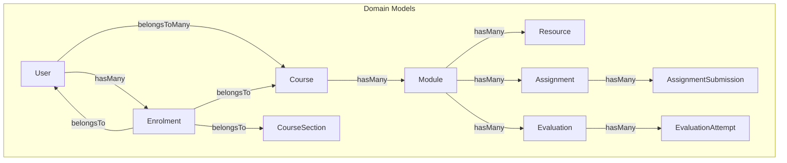
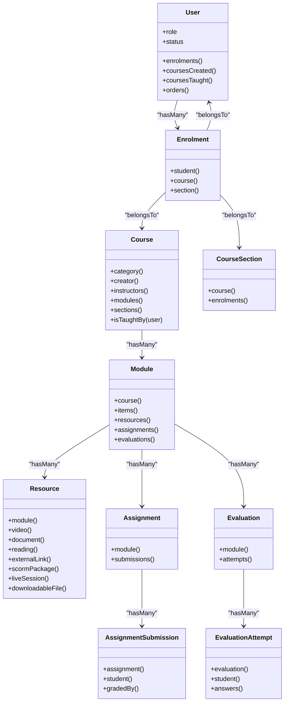
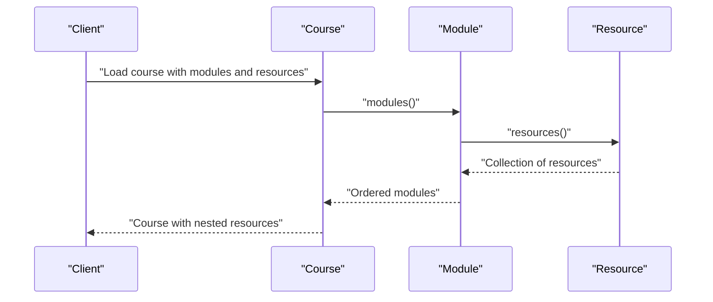
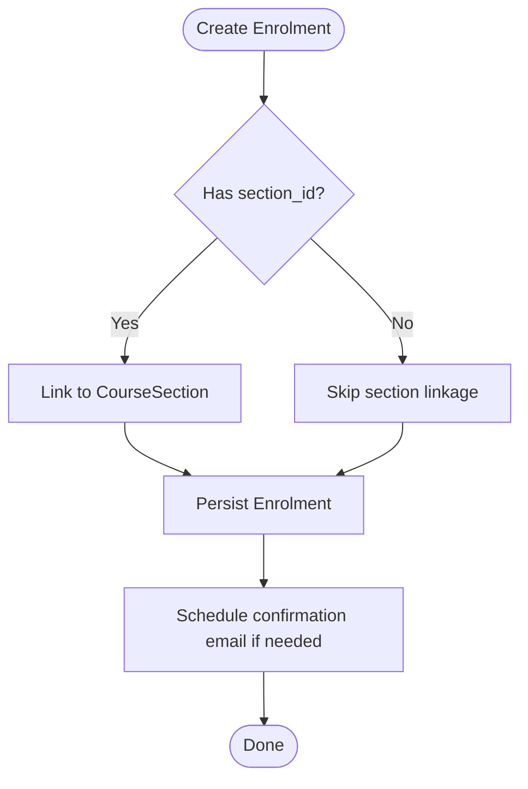
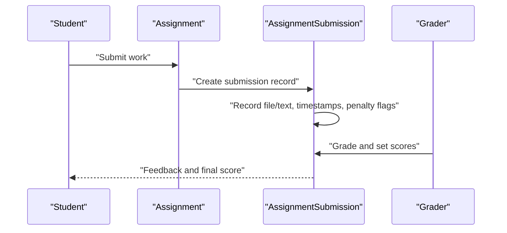
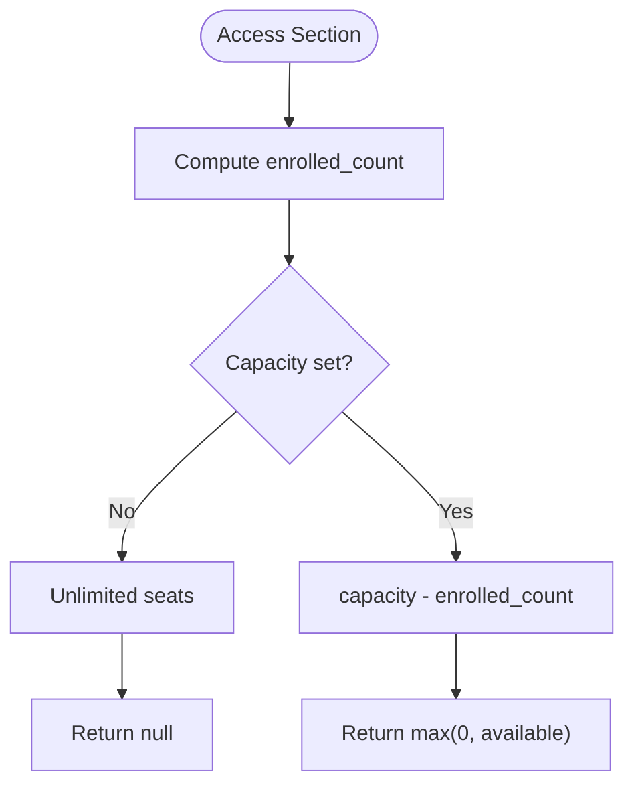
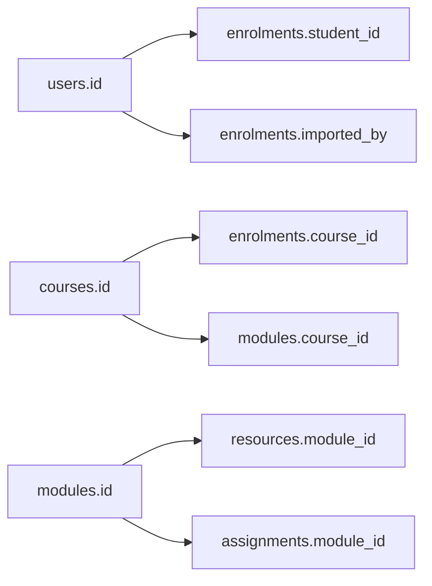

# Model Layer & Eloquent ORM

<cite>
**Referenced Files in This Document**
- [User.php](file://app/Models/User.php)
- [Course.php](file://app/Models/Course.php)
- [Module.php](file://app/Models/Module.php)
- [Resource.php](file://app/Models/Resource.php)
- [Enrolment.php](file://app/Models/Enrolment.php)
- [Assignment.php](file://app/Models/Assignment.php)
- [AssignmentSubmission.php](file://app/Models/AssignmentSubmission.php)
- [Evaluation.php](file://app/Models/Evaluation.php)
- [EvaluationAttempt.php](file://app/Models/EvaluationAttempt.php)
- [CourseSection.php](file://app/Models/CourseSection.php)
- [2024_01_01_000030_create_courses_table.php](file://database/migrations/2024_01_01_000030_create_courses_table.php)
- [2024_01_01_000060_create_enrolments_table.php](file://database/migrations/2024_01_01_000060_create_enrolments_table.php)
- [2024_01_01_000100_create_modules_table.php](file://database/migrations/2024_01_01_000100_create_modules_table.php)
- [2024_01_01_000120_create_resources_table.php](file://database/migrations/2024_01_01_000120_create_resources_table.php)
- [2024_01_01_000132_create_assignments_table.php](file://database/migrations/2024_01_01_000132_create_assignments_table.php)
</cite>

## Table of Contents
1. [Introduction](#introduction)
2. [Project Structure](#project-structure)
3. [Core Components](#core-components)
4. [Architecture Overview](#architecture-overview)
5. [Detailed Component Analysis](#detailed-component-analysis)
6. [Dependency Analysis](#dependency-analysis)
7. [Performance Considerations](#performance-considerations)
8. [Troubleshooting Guide](#troubleshooting-guide)
9. [Conclusion](#conclusion)

## Introduction
This document explains the model layer built with Laravel’s Eloquent ORM for the ResNet Academy application. It covers how database tables map to Eloquent models, primary and foreign key conventions, complex relationships (course-module-resource hierarchy, user-enrollment associations, assessment-submission mappings), attribute casts and accessors, migration strategies for schema evolution, factory usage for testing and development data generation, model events and lifecycle hooks, and performance considerations such as eager loading, query optimization, and caching strategies.

## Project Structure
The model layer is organized under app/Models with corresponding migrations under database/migrations and factories under database/factories. Each domain entity has a dedicated model class that defines:
- Fillable attributes for mass assignment
- Casts for type coercion and enum mapping
- Relationships to other models via Eloquent relation methods
- Optional timestamps behavior and soft deletes where applicable

**Diagram sources**
- [User.php:74-98](file://app/Models/User.php#L74-L98)
- [Course.php:61-169](file://app/Models/Course.php#L61-L169)
- [Module.php:39-84](file://app/Models/Module.php#L39-L84)
- [Resource.php:34-100](file://app/Models/Resource.php#L34-L100)
- [Enrolment.php:45-73](file://app/Models/Enrolment.php#L45-L73)
- [Assignment.php:42-69](file://app/Models/Assignment.php#L42-L69)
- [AssignmentSubmission.php:52-86](file://app/Models/AssignmentSubmission.php#L52-L86)
- [Evaluation.php:42-61](file://app/Models/Evaluation.php#L42-L61)
- [EvaluationAttempt.php:43-62](file://app/Models/EvaluationAttempt.php#L43-L62)
- [CourseSection.php:43-70](file://app/Models/CourseSection.php#L43-L70)

**Section sources**
- [User.php:24-55](file://app/Models/User.php#L24-L55)
- [Course.php:22-56](file://app/Models/Course.php#L22-L56)
- [Module.php:22-34](file://app/Models/Module.php#L22-L34)
- [Resource.php:20-29](file://app/Models/Resource.php#L20-L29)
- [Enrolment.php:22-40](file://app/Models/Enrolment.php#L22-L40)
- [Assignment.php:19-37](file://app/Models/Assignment.php#L19-L37)
- [AssignmentSubmission.php:22-47](file://app/Models/AssignmentSubmission.php#L22-L47)
- [Evaluation.php:19-37](file://app/Models/Evaluation.php#L19-L37)
- [EvaluationAttempt.php:21-38](file://app/Models/EvaluationAttempt.php#L21-L38)
- [CourseSection.php:19-38](file://app/Models/CourseSection.php#L19-L38)

## Core Components
- User: Central identity model with roles, status, OAuth accounts, enrolments, courses created, courses taught, and orders. Uses enums for role and status, datetime casts, and a custom password column name.
- Course: Represents a course with category, creator, instructors (many-to-many), modules, reviews, groups, sections, question banks, announcements, tickets, and helper method to check instructor permission.
- Module: Part of a course with ordering, scheduling, optional group targeting, items, resources, assignments, evaluations; supports soft deletes.
- Resource: Polymorphic-like content container per module with typed variants (video, document, reading, external link, scorm, live session, downloadable file).
- Enrolment: Links students to courses and optionally to course sections; tracks source, applied dates, and confirmation emails.
- Assignment and AssignmentSubmission: Assignments belong to modules and have submissions from students with scoring, penalties, and rubric scores.
- Evaluation and EvaluationAttempt: Assessments composed of questions with attempts, answers, and pass/fail outcomes.
- CourseSection: Time-bounded slices of a course with capacity management and enrollment counting.

Key patterns:
- Enums are used extensively via casts to enforce valid states and types.
- Foreign keys are explicitly declared in migrations and referenced in relationships.
- Timestamps are disabled on append-only or event-driven tables (e.g., AssignmentSubmission, EvaluationAttempt).
- Accessors compute derived values like enrolled count and available seats.

**Section sources**
- [User.php:24-98](file://app/Models/User.php#L24-L98)
- [Course.php:22-178](file://app/Models/Course.php#L22-L178)
- [Module.php:22-84](file://app/Models/Module.php#L22-L84)
- [Resource.php:20-100](file://app/Models/Resource.php#L20-L100)
- [Enrolment.php:22-73](file://app/Models/Enrolment.php#L22-L73)
- [Assignment.php:19-69](file://app/Models/Assignment.php#L19-L69)
- [AssignmentSubmission.php:22-86](file://app/Models/AssignmentSubmission.php#L22-L86)
- [Evaluation.php:19-61](file://app/Models/Evaluation.php#L19-L61)
- [EvaluationAttempt.php:21-62](file://app/Models/EvaluationAttempt.php#L21-L62)
- [CourseSection.php:19-117](file://app/Models/CourseSection.php#L19-L117)

## Architecture Overview
The core learning flow spans Course → Module → Resource/Assignment/Evaluation, with Enrolment tying Users to Courses (and optionally Sections). Assessment results are captured through AssignmentSubmission and EvaluationAttempt.

**Diagram sources**
- [User.php:74-98](file://app/Models/User.php#L74-L98)
- [Course.php:61-169](file://app/Models/Course.php#L61-L169)
- [Module.php:39-84](file://app/Models/Module.php#L39-L84)
- [Resource.php:34-100](file://app/Models/Resource.php#L34-L100)
- [Enrolment.php:45-73](file://app/Models/Enrolment.php#L45-L73)
- [Assignment.php:42-69](file://app/Models/Assignment.php#L42-L69)
- [AssignmentSubmission.php:52-86](file://app/Models/AssignmentSubmission.php#L52-L86)
- [Evaluation.php:42-61](file://app/Models/Evaluation.php#L42-L61)
- [EvaluationAttempt.php:43-62](file://app/Models/EvaluationAttempt.php#L43-L62)
- [CourseSection.php:43-70](file://app/Models/CourseSection.php#L43-L70)

## Detailed Component Analysis

### Course–Module–Resource Hierarchy
- Course owns Modules ordered by index; each Module contains Resources and assessments.
- Resource uses an enum type to differentiate content kinds and exposes typed HasOne relations for concrete details.

**Diagram sources**
- [Course.php:116-121](file://app/Models/Course.php#L116-L121)
- [Module.php:57-68](file://app/Models/Module.php#L57-L68)
- [Resource.php:34-100](file://app/Models/Resource.php#L34-L100)

**Section sources**
- [Course.php:116-121](file://app/Models/Course.php#L116-L121)
- [Module.php:57-68](file://app/Models/Module.php#L57-L68)
- [Resource.php:34-100](file://app/Models/Resource.php#L34-L100)
- [2024_01_01_000100_create_modules_table.php:13-22](file://database/migrations/2024_01_01_000100_create_modules_table.php#L13-L22)
- [2024_01_01_000120_create_resources_table.php:13-19](file://database/migrations/2024_01_01_000120_create_resources_table.php#L13-L19)

### User–Enrollment Associations
- Users enroll in Courses via Enrolment, optionally scoped to a CourseSection.
- Enrolment records track source, applied_at, and email confirmation timing.

**Diagram sources**
- [Enrolment.php:22-40](file://app/Models/Enrolment.php#L22-L40)
- [Enrolment.php:45-73](file://app/Models/Enrolment.php#L45-L73)
- [CourseSection.php:57-70](file://app/Models/CourseSection.php#L57-L70)
- [2024_01_01_000060_create_enrolments_table.php:13-29](file://database/migrations/2024_01_01_000060_create_enrolments_table.php#L13-L29)

**Section sources**
- [Enrolment.php:22-73](file://app/Models/Enrolment.php#L22-L73)
- [CourseSection.php:57-70](file://app/Models/CourseSection.php#L57-L70)
- [2024_01_01_000060_create_enrolments_table.php:13-29](file://database/migrations/2024_01_01_000060_create_enrolments_table.php#L13-L29)

### Assessment–Submission Mappings
- Assignments belong to Modules and collect student submissions with scoring, penalties, and rubric scores.
- Evaluations define assessments with time limits and attempt rules; EvaluationAttempt records per attempt with answers.

**Diagram sources**
- [Assignment.php:42-69](file://app/Models/Assignment.php#L42-L69)
- [AssignmentSubmission.php:22-86](file://app/Models/AssignmentSubmission.php#L22-L86)
- [2024_01_01_000132_create_assignments_table.php:13-24](file://database/migrations/2024_01_01_000132_create_assignments_table.php#L13-L24)

**Section sources**
- [Assignment.php:19-69](file://app/Models/Assignment.php#L19-L69)
- [AssignmentSubmission.php:22-86](file://app/Models/AssignmentSubmission.php#L22-L86)
- [2024_01_01_000132_create_assignments_table.php:13-24](file://database/migrations/2024_01_01_000132_create_assignments_table.php#L13-L24)

### Course Section Capacity and Availability
- CourseSection provides computed attributes for enrolled count and available seats, plus checks for fullness and acceptance windows.

**Diagram sources**
- [CourseSection.php:75-93](file://app/Models/CourseSection.php#L75-L93)

**Section sources**
- [CourseSection.php:75-117](file://app/Models/CourseSection.php#L75-L117)

## Dependency Analysis
- Primary keys: All tables use auto-incrementing id columns.
- Foreign keys: Explicitly defined in migrations using foreignId/constrained with appropriate cascade/null/restrict policies.
- Indexes: Composite indexes support common queries (e.g., course+order_index for modules; course_id for enrolments).
- Unique constraints: e.g., unique slug on courses; unique student-course enrolment pair.

**Diagram sources**
- [2024_01_01_000030_create_courses_table.php:13-31](file://database/migrations/2024_01_01_000030_create_courses_table.php#L13-L31)
- [2024_01_01_000060_create_enrolments_table.php:13-29](file://database/migrations/2024_01_01_000060_create_enrolments_table.php#L13-L29)
- [2024_01_01_000100_create_modules_table.php:13-22](file://database/migrations/2024_01_01_000100_create_modules_table.php#L13-L22)
- [2024_01_01_000120_create_resources_table.php:13-19](file://database/migrations/2024_01_01_000120_create_resources_table.php#L13-L19)
- [2024_01_01_000132_create_assignments_table.php:13-24](file://database/migrations/2024_01_01_000132_create_assignments_table.php#L13-L24)

**Section sources**
- [2024_01_01_000030_create_courses_table.php:13-31](file://database/migrations/2024_01_01_000030_create_courses_table.php#L13-L31)
- [2024_01_01_000060_create_enrolments_table.php:13-29](file://database/migrations/2024_01_01_000060_create_enrolments_table.php#L13-L29)
- [2024_01_01_000100_create_modules_table.php:13-22](file://database/migrations/2024_01_01_000100_create_modules_table.php#L13-L22)
- [2024_01_01_000120_create_resources_table.php:13-19](file://database/migrations/2024_01_01_000120_create_resources_table.php#L13-L19)
- [2024_01_01_000132_create_assignments_table.php:13-24](file://database/migrations/2024_01_01_000132_create_assignments_table.php#L13-L24)

## Performance Considerations
- Eager loading: When retrieving courses with modules and resources, eager load relationships to avoid N+1 queries. For example, load modules and their resources together when rendering course pages.
- Selective columns: Use select() to fetch only required fields for lists and APIs to reduce payload size.
- Index utilization: Queries filtering by course_id, order_index, and status benefit from existing indexes; ensure new filters align with indexed columns.
- Disable unnecessary timestamps: Tables like AssignmentSubmission and EvaluationAttempt disable timestamps to reduce writes and storage overhead.
- Enum casts: Using enum casts reduces validation overhead and ensures consistent state handling.
- Soft deletes: Module uses soft deletes; consider querying with trashed() or withoutSoftDeletes() as appropriate to avoid accidental filtering.
- Caching strategies: Cache expensive read-heavy aggregations (e.g., course listings, module sequences) with short TTLs; invalidate on write operations.
- Batch operations: Use chunking or batch updates for large imports or background jobs to minimize memory usage.

[No sources needed since this section provides general guidance]

## Troubleshooting Guide
- Missing relationships: If accessing related data returns null, verify foreign key names and constraints match the relationship definitions.
- Enum mismatches: Ensure stored values match defined enum values; invalid values will fail casts.
- Soft delete pitfalls: When querying Module, remember deleted records are excluded by default; use withTrashed() when necessary.
- Timestamps disabled: For AssignmentSubmission and EvaluationAttempt, do not expect created_at/updated_at; rely on explicit timestamp fields like submitted_at or started_at.
- Capacity logic: For CourseSection, confirm capacity is set; otherwise available seats are null. Enrollment counts only include confirmed/waitlisted statuses.

**Section sources**
- [Module.php:20-20](file://app/Models/Module.php#L20-L20)
- [AssignmentSubmission.php:20-20](file://app/Models/AssignmentSubmission.php#L20-L20)
- [EvaluationAttempt.php:19-19](file://app/Models/EvaluationAttempt.php#L19-L19)
- [CourseSection.php:75-101](file://app/Models/CourseSection.php#L75-L101)

## Conclusion
The model layer leverages Eloquent’s expressive relationships, strict casting to enums and typed values, and clear migration-defined schemas to represent the academy’s domain accurately. The course-module-resource hierarchy, user-enrollment associations, and assessment-submission mappings form a robust foundation. By applying eager loading, selective queries, and thoughtful indexing, the system remains performant at scale. Factories enable reliable test data generation, while accessors encapsulate business logic for derived attributes.