# Policy-Based Authorization

<cite>
**Referenced Files in This Document**
- [UserRole.php](file://app/Enums/UserRole.php)
- [User.php](file://app/Models/User.php)
- [CoursePolicy.php](file://app/Policies/CoursePolicy.php)
- [ModulePolicy.php](file://app/Policies/ModulePolicy.php)
- [AssignmentPolicy.php](file://app/Policies/AssignmentPolicy.php)
- [AssignmentSubmissionPolicy.php](file://app/Policies/AssignmentSubmissionPolicy.php)
- [EnrolmentPolicy.php](file://app/Policies/EnrolmentPolicy.php)
- [CourseSectionPolicy.php](file://app/Policies/CourseSectionPolicy.php)
- [ResourcePolicy.php](file://app/Policies/ResourcePolicy.php)
- [ForumThreadPolicy.php](file://app/Policies/ForumThreadPolicy.php)
- [CourseController.php](file://app/Http/Controllers/Api/V1/CourseController.php)
- [AssignmentController.php](file://app/Http/Controllers/Api/V1/AssignmentController.php)
- [EnsureEmailIsVerified.php](file://app/Http/Middleware/EnsureEmailIsVerified.php)
- [EnsureProfileComplete.php](file://app/Http/Middleware/EnsureProfileComplete.php)
- [ProtectedRoute.tsx](file://frontend/src/components/layout/ProtectedRoute.tsx)
</cite>

## Table of Contents
1. Introduction
2. Project Structure
3. Core Components
4. Architecture Overview
5. Detailed Component Analysis
6. Dependency Analysis
7. Performance Considerations
8. Troubleshooting Guide
9. Conclusion
10. Appendices

## Introduction
This document explains the policy-based authorization system that enforces fine-grained access control across the application. It covers how policies define rules for different user roles and resources, how role-based access control is implemented via the UserRole enum, and how middleware protects routes and validates prerequisites. It also documents domain-specific policies for User, Course, Module, Assignment, Enrolment, Forum, and other entities, including examples of view, update, delete, and custom checks. Finally, it outlines security considerations and best practices to ensure robust access control.

## Project Structure
Authorization spans three layers:
- Role model and enums: UserRole defines the canonical roles used throughout the system.
- Policies: One policy per resource type encapsulates authorization logic for actions like view, create, update, delete, and custom operations.
- Middleware and controllers: Middleware enforces preconditions (e.g., verified email, complete profile), while controllers invoke policies to gate mutations.

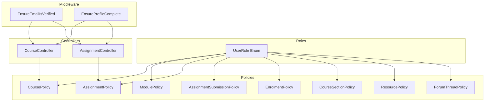

**Diagram sources**
- [UserRole.php:7-12](file://app/Enums/UserRole.php#L7-L12)
- [CoursePolicy.php:11-49](file://app/Policies/CoursePolicy.php#L11-L49)
- [ModulePolicy.php:12-38](file://app/Policies/ModulePolicy.php#L12-L38)
- [AssignmentPolicy.php:13-43](file://app/Policies/AssignmentPolicy.php#L13-L43)
- [AssignmentSubmissionPolicy.php:13-41](file://app/Policies/AssignmentSubmissionPolicy.php#L13-L41)
- [EnrolmentPolicy.php:11-43](file://app/Policies/EnrolmentPolicy.php#L11-L43)
- [CourseSectionPolicy.php:11-49](file://app/Policies/CourseSectionPolicy.php#L11-L49)
- [ResourcePolicy.php:13-43](file://app/Policies/ResourcePolicy.php#L13-L43)
- [ForumThreadPolicy.php:13-50](file://app/Policies/ForumThreadPolicy.php#L13-L50)
- [EnsureEmailIsVerified.php:12-27](file://app/Http/Middleware/EnsureEmailIsVerified.php#L12-L27)
- [EnsureProfileComplete.php:21-57](file://app/Http/Middleware/EnsureProfileComplete.php#L21-L57)
- [CourseController.php:138-145](file://app/Http/Controllers/Api/V1/CourseController.php#L138-L145)
- [AssignmentController.php:39-46](file://app/Http/Controllers/Api/V1/AssignmentController.php#L39-L46)

**Section sources**
- [UserRole.php:7-12](file://app/Enums/UserRole.php#L7-L12)
- [CoursePolicy.php:11-49](file://app/Policies/CoursePolicy.php#L11-L49)
- [ModulePolicy.php:12-38](file://app/Policies/ModulePolicy.php#L12-L38)
- [AssignmentPolicy.php:13-43](file://app/Policies/AssignmentPolicy.php#L13-L43)
- [AssignmentSubmissionPolicy.php:13-41](file://app/Policies/AssignmentSubmissionPolicy.php#L13-L41)
- [EnrolmentPolicy.php:11-43](file://app/Policies/EnrolmentPolicy.php#L11-L43)
- [CourseSectionPolicy.php:11-49](file://app/Policies/CourseSectionPolicy.php#L11-L49)
- [ResourcePolicy.php:13-43](file://app/Policies/ResourcePolicy.php#L13-L43)
- [ForumThreadPolicy.php:13-50](file://app/Policies/ForumThreadPolicy.php#L13-L50)
- [EnsureEmailIsVerified.php:12-27](file://app/Http/Middleware/EnsureEmailIsVerified.php#L12-L27)
- [EnsureProfileComplete.php:21-57](file://app/Http/Middleware/EnsureProfileComplete.php#L21-L57)
- [CourseController.php:138-145](file://app/Http/Controllers/Api/V1/CourseController.php#L138-L145)
- [AssignmentController.php:39-46](file://app/Http/Controllers/Api/V1/AssignmentController.php#L39-L46)

## Core Components
- Roles: The UserRole enum centralizes role values used by policies and models.
- Models: The User model casts its role to UserRole and exposes relationships used by policies (e.g., enrolments).
- Policies: Each policy encapsulates authorization decisions for a specific resource or domain area.
- Middleware: Route-level guards enforce prerequisites such as email verification and profile completeness.
- Controllers: Controllers call authorize() to enforce policies on mutations.

Key patterns observed:
- Admin bypass: Many policies grant full access to admins.
- Instructor scope: Instructors can act only on courses they teach.
- Student scope: Students can perform actions only when enrolled and confirmed.
- Resource scoping: Policies often traverse from a resource to its course to evaluate permissions.

**Section sources**
- [UserRole.php:7-12](file://app/Enums/UserRole.php#L7-L12)
- [User.php:24-55](file://app/Models/User.php#L24-L55)
- [CoursePolicy.php:11-49](file://app/Policies/CoursePolicy.php#L11-L49)
- [ModulePolicy.php:12-38](file://app/Policies/ModulePolicy.php#L12-L38)
- [AssignmentPolicy.php:13-43](file://app/Policies/AssignmentPolicy.php#L13-L43)
- [AssignmentSubmissionPolicy.php:13-41](file://app/Policies/AssignmentSubmissionPolicy.php#L13-L41)
- [EnrolmentPolicy.php:11-43](file://app/Policies/EnrolmentPolicy.php#L11-L43)
- [CourseSectionPolicy.php:11-49](file://app/Policies/CourseSectionPolicy.php#L11-L49)
- [ResourcePolicy.php:13-43](file://app/Policies/ResourcePolicy.php#L13-L43)
- [ForumThreadPolicy.php:13-50](file://app/Policies/ForumThreadPolicy.php#L13-L50)

## Architecture Overview
The authorization flow combines middleware, controller-level policy checks, and policy logic tied to roles and resource ownership.

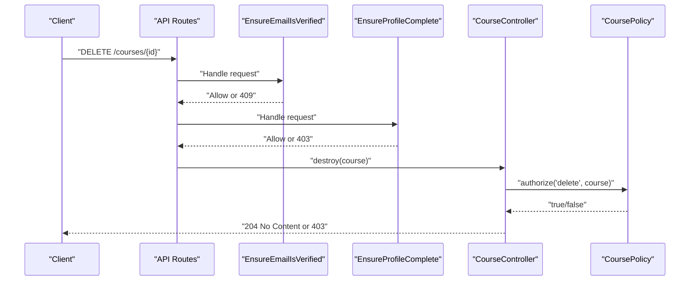

**Diagram sources**
- [EnsureEmailIsVerified.php:12-27](file://app/Http/Middleware/EnsureEmailIsVerified.php#L12-L27)
- [EnsureProfileComplete.php:21-57](file://app/Http/Middleware/EnsureProfileComplete.php#L21-L57)
- [CourseController.php:138-145](file://app/Http/Controllers/Api/V1/CourseController.php#L138-L145)
- [CoursePolicy.php:27-30](file://app/Policies/CoursePolicy.php#L27-L30)

## Detailed Component Analysis

### Role-Based Access Control with UserRole
- UserRole enumerates Admin, Instructor, and Student.
- The User model casts the role attribute to UserRole, enabling consistent comparisons in policies.
- Policies use this enum to implement role-based gates and admin/instructor/student-specific behavior.

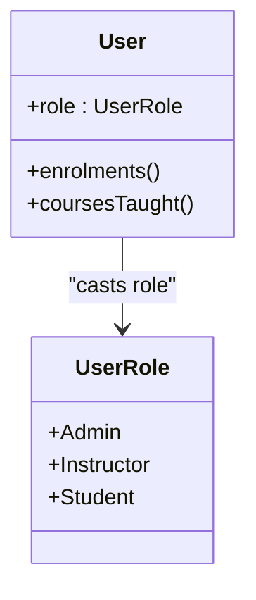

**Diagram sources**
- [UserRole.php:7-12](file://app/Enums/UserRole.php#L7-L12)
- [User.php:24-55](file://app/Models/User.php#L24-L55)

**Section sources**
- [UserRole.php:7-12](file://app/Enums/UserRole.php#L7-L12)
- [User.php:24-55](file://app/Models/User.php#L24-L55)

### Course Policy
- Create: Admin-only.
- Update/Delete: Admin or instructor teaching the course.
- Custom checks: viewGradebook and viewAnalytics restricted to admin or course instructor.

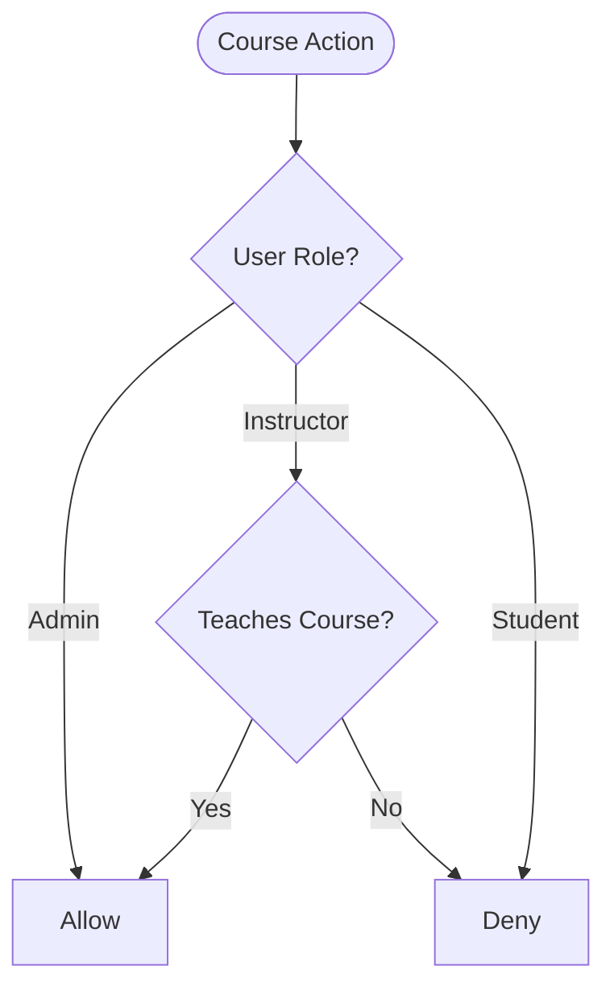

**Diagram sources**
- [CoursePolicy.php:13-48](file://app/Policies/CoursePolicy.php#L13-L48)

**Section sources**
- [CoursePolicy.php:13-48](file://app/Policies/CoursePolicy.php#L13-L48)

### Module Policy
- Create/Update/Delete/Restore: Admin or instructor teaching the module’s course.
- Centralized helper ensures consistent scoping to the course.

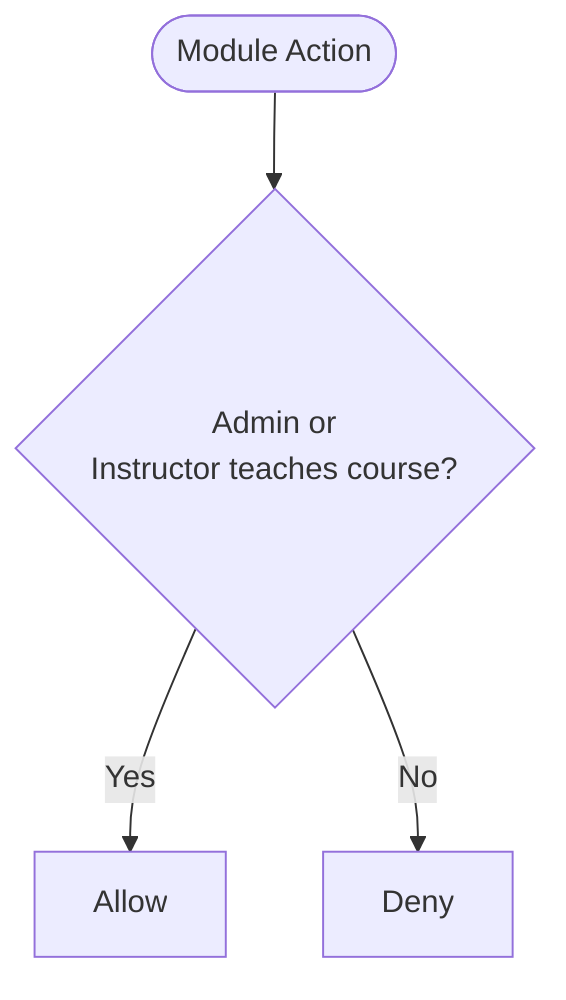

**Diagram sources**
- [ModulePolicy.php:14-37](file://app/Policies/ModulePolicy.php#L14-L37)

**Section sources**
- [ModulePolicy.php:14-37](file://app/Policies/ModulePolicy.php#L14-L37)

### Assignment Policy
- Create/Update/Delete: Admin or instructor teaching the assignment’s course.
- Grade: Same check as managing assignments; instructors can grade submissions for their courses.

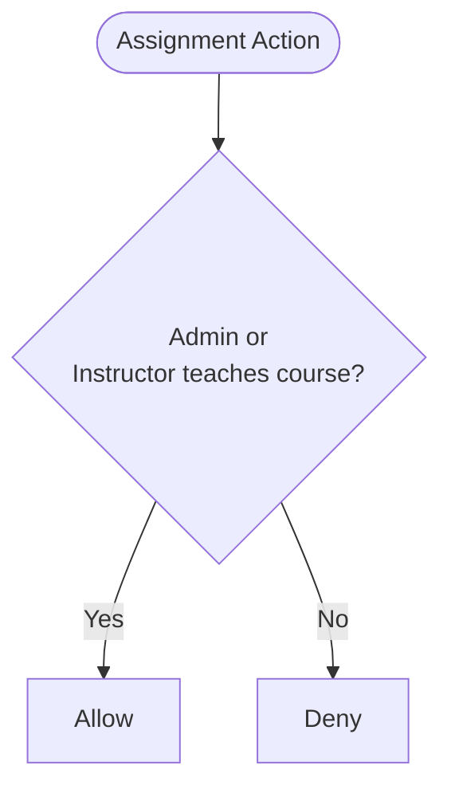

**Diagram sources**
- [AssignmentPolicy.php:15-42](file://app/Policies/AssignmentPolicy.php#L15-L42)

**Section sources**
- [AssignmentPolicy.php:15-42](file://app/Policies/AssignmentPolicy.php#L15-L42)

### Assignment Submission Policy
- Create: Students only if confirmed-enrolled in the assignment’s course.
- View: Admins, submission owner, or instructor teaching the course.

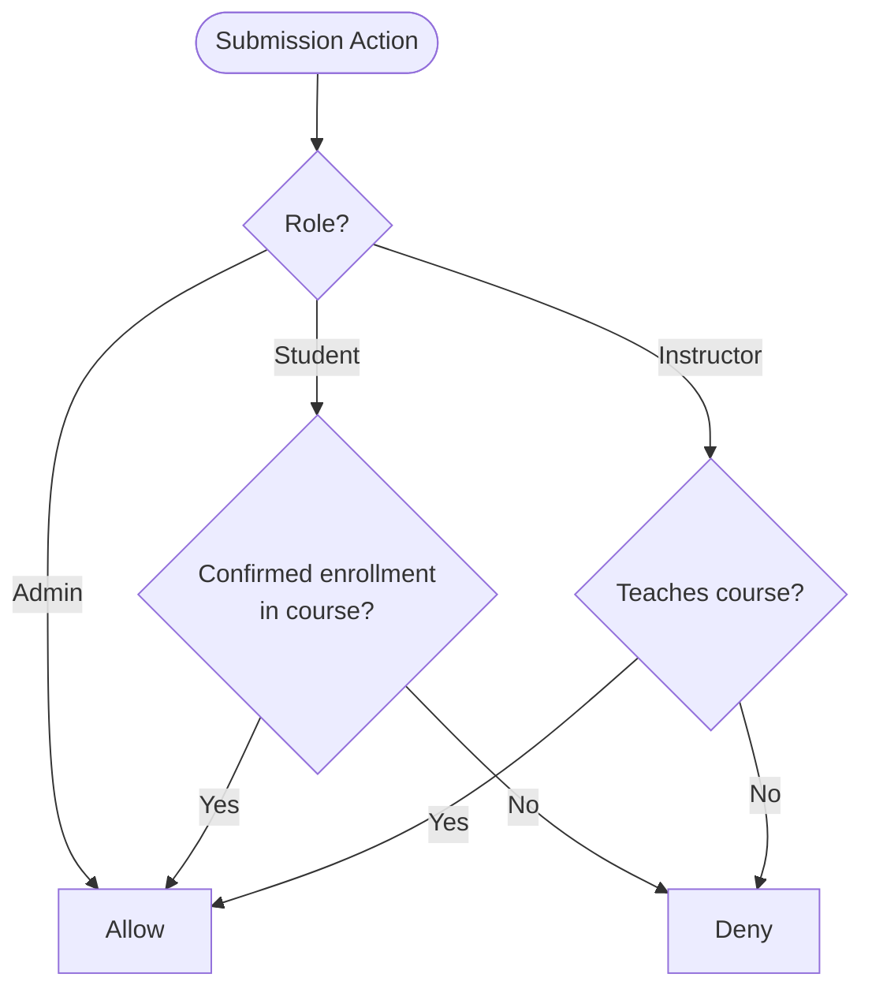

**Diagram sources**
- [AssignmentSubmissionPolicy.php:15-40](file://app/Policies/AssignmentSubmissionPolicy.php#L15-L40)

**Section sources**
- [AssignmentSubmissionPolicy.php:15-40](file://app/Policies/AssignmentSubmissionPolicy.php#L15-L40)

### Enrolment Policy
- Create: Students only.
- View: Admins or the student who owns the enrolment.
- Import: Admin-only bulk import path.
- Withdraw: Admin or the student themselves.

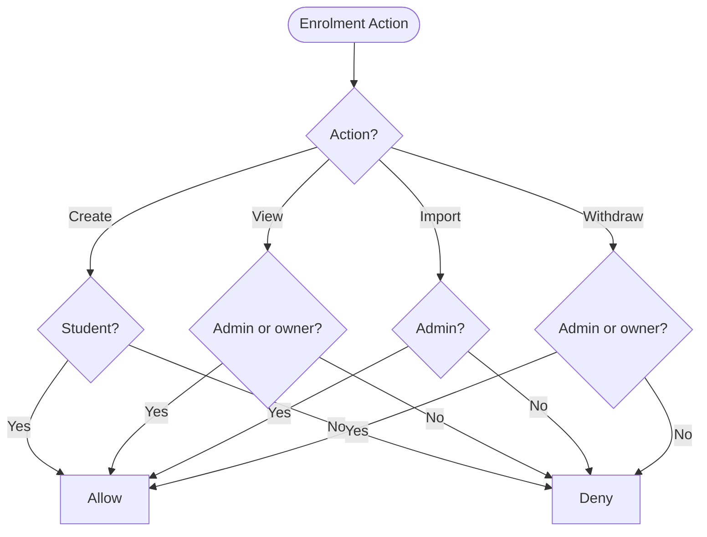

**Diagram sources**
- [EnrolmentPolicy.php:13-42](file://app/Policies/EnrolmentPolicy.php#L13-L42)

**Section sources**
- [EnrolmentPolicy.php:13-42](file://app/Policies/EnrolmentPolicy.php#L13-L42)

### Course Section Policy
- List/Create: Admin or Instructor.
- View/Update/Delete: Admin or instructor teaching the section’s course.

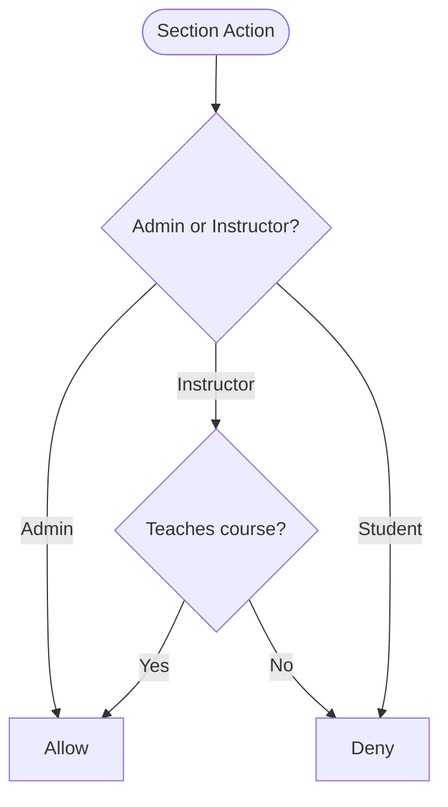

**Diagram sources**
- [CourseSectionPolicy.php:13-48](file://app/Policies/CourseSectionPolicy.php#L13-L48)

**Section sources**
- [CourseSectionPolicy.php:13-48](file://app/Policies/CourseSectionPolicy.php#L13-L48)

### Resource Policy
- Create/Update/Delete: Admin or instructor teaching the resource’s course.
- Custom: viewAttendance limited to the same audience.

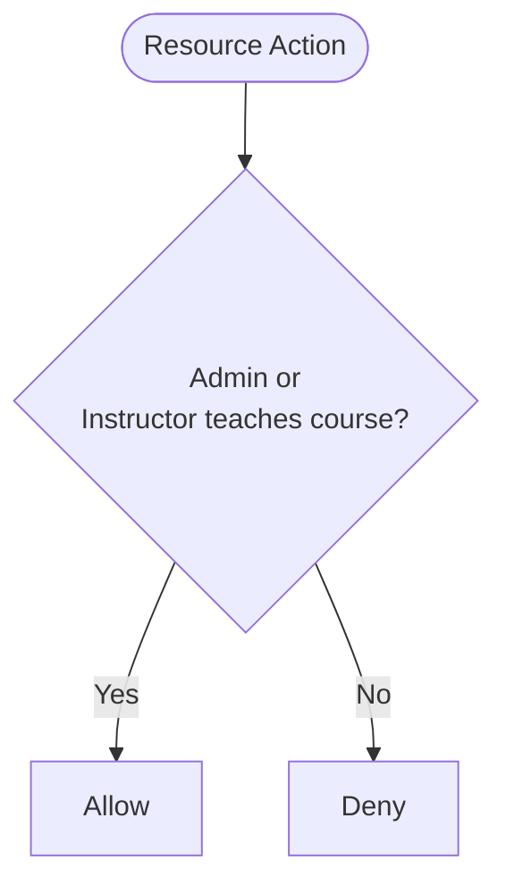

**Diagram sources**
- [ResourcePolicy.php:15-41](file://app/Policies/ResourcePolicy.php#L15-L41)

**Section sources**
- [ResourcePolicy.php:15-41](file://app/Policies/ResourcePolicy.php#L15-L41)

### Forum Thread Policy
- viewAny/create: Admin, instructor teaching the course, or confirmed-enrolled students.
- moderate: Admin or instructor teaching the course.

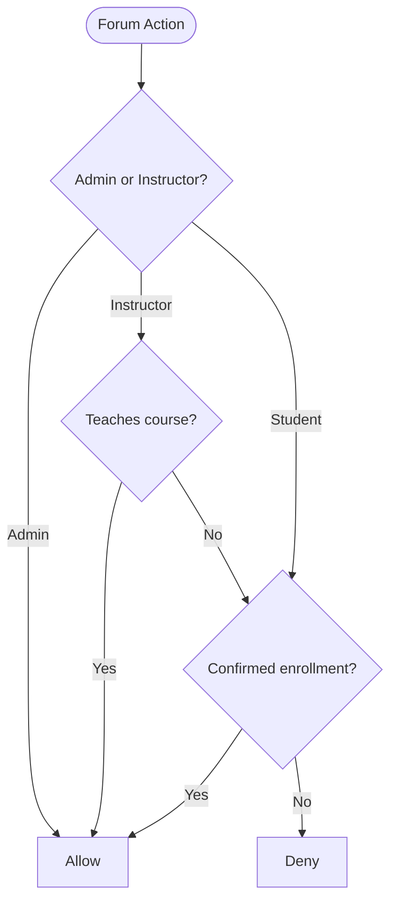

**Diagram sources**
- [ForumThreadPolicy.php:19-49](file://app/Policies/ForumThreadPolicy.php#L19-L49)

**Section sources**
- [ForumThreadPolicy.php:19-49](file://app/Policies/ForumThreadPolicy.php#L19-L49)

### Controller Integration and Middleware Usage
- Controllers explicitly call authorize() to enforce policies before mutations.
- Middleware enforces preconditions:
  - EnsureEmailIsVerified blocks unverified users with a 409 response.
  - EnsureProfileComplete blocks incomplete profiles with a 403 response and missing fields details.
- Frontend ProtectedRoute provides UX gating based on roles but is not the security boundary; backend policies are authoritative.

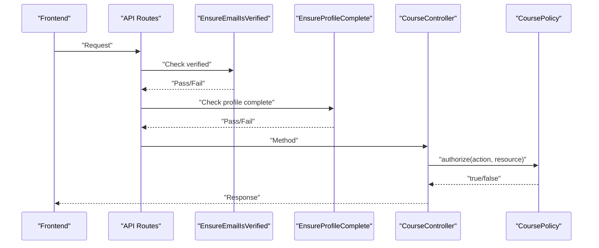

**Diagram sources**
- [EnsureEmailIsVerified.php:12-27](file://app/Http/Middleware/EnsureEmailIsVerified.php#L12-L27)
- [EnsureProfileComplete.php:21-57](file://app/Http/Middleware/EnsureProfileComplete.php#L21-L57)
- [CourseController.php:138-145](file://app/Http/Controllers/Api/V1/CourseController.php#L138-L145)
- [ProtectedRoute.tsx:17-33](file://frontend/src/components/layout/ProtectedRoute.tsx#L17-L33)

**Section sources**
- [CourseController.php:138-145](file://app/Http/Controllers/Api/V1/CourseController.php#L138-L145)
- [AssignmentController.php:39-46](file://app/Http/Controllers/Api/V1/AssignmentController.php#L39-L46)
- [EnsureEmailIsVerified.php:12-27](file://app/Http/Middleware/EnsureEmailIsVerified.php#L12-L27)
- [EnsureProfileComplete.php:21-57](file://app/Http/Middleware/EnsureProfileComplete.php#L21-L57)
- [ProtectedRoute.tsx:17-33](file://frontend/src/components/layout/ProtectedRoute.tsx#L17-L33)

## Dependency Analysis
Policies depend on:
- UserRole enum for role checks.
- Model relationships to determine ownership and scope (e.g., enrolments, courses taught).
- Some policies delegate to shared helpers within the same policy file to avoid duplication.

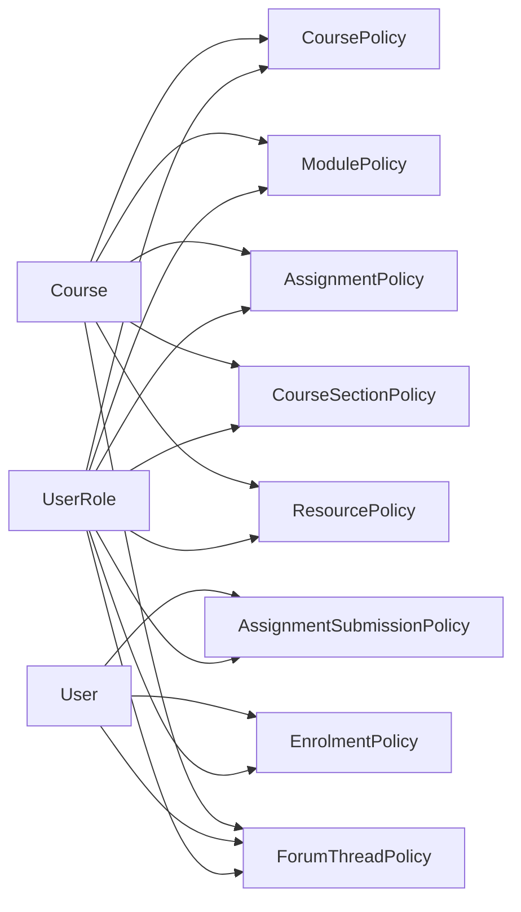

**Diagram sources**
- [UserRole.php:7-12](file://app/Enums/UserRole.php#L7-L12)
- [CoursePolicy.php:11-49](file://app/Policies/CoursePolicy.php#L11-L49)
- [ModulePolicy.php:12-38](file://app/Policies/ModulePolicy.php#L12-L38)
- [AssignmentPolicy.php:13-43](file://app/Policies/AssignmentPolicy.php#L13-L43)
- [AssignmentSubmissionPolicy.php:13-41](file://app/Policies/AssignmentSubmissionPolicy.php#L13-L41)
- [EnrolmentPolicy.php:11-43](file://app/Policies/EnrolmentPolicy.php#L11-L43)
- [CourseSectionPolicy.php:11-49](file://app/Policies/CourseSectionPolicy.php#L11-L49)
- [ResourcePolicy.php:13-43](file://app/Policies/ResourcePolicy.php#L13-L43)
- [ForumThreadPolicy.php:13-50](file://app/Policies/ForumThreadPolicy.php#L13-L50)

**Section sources**
- [UserRole.php:7-12](file://app/Enums/UserRole.php#L7-L12)
- [CoursePolicy.php:11-49](file://app/Policies/CoursePolicy.php#L11-L49)
- [ModulePolicy.php:12-38](file://app/Policies/ModulePolicy.php#L12-L38)
- [AssignmentPolicy.php:13-43](file://app/Policies/AssignmentPolicy.php#L13-L43)
- [AssignmentSubmissionPolicy.php:13-41](file://app/Policies/AssignmentSubmissionPolicy.php#L13-L41)
- [EnrolmentPolicy.php:11-43](file://app/Policies/EnrolmentPolicy.php#L11-L43)
- [CourseSectionPolicy.php:11-49](file://app/Policies/CourseSectionPolicy.php#L11-L49)
- [ResourcePolicy.php:13-43](file://app/Policies/ResourcePolicy.php#L13-L43)
- [ForumThreadPolicy.php:13-50](file://app/Policies/ForumThreadPolicy.php#L13-L50)

## Performance Considerations
- Prefer scoped queries in policies to minimize N+1 issues (e.g., checking enrolment existence efficiently).
- Cache expensive lookups where appropriate (e.g., whether an instructor teaches a course) at higher layers if needed.
- Keep policy methods small and focused to reduce overhead and improve testability.
- Avoid heavy computations inside hot paths like list endpoints; prefer filtering at the query layer when possible.

[No sources needed since this section provides general guidance]

## Troubleshooting Guide
Common issues and resolutions:
- Email not verified: Requests return 409 with a message indicating verification status. Ensure users verify emails before accessing protected features.
- Incomplete profile: Requests return 403 with a structured error including missing fields. Prompt users to complete required profile data.
- Unauthorized mutation: Controllers call authorize(); failures result in 403 responses. Verify the relevant policy allows the action for the current role and resource context.
- Student cannot submit: Confirm the student has a confirmed enrolment in the relevant course before allowing submission creation.

**Section sources**
- [EnsureEmailIsVerified.php:17-25](file://app/Http/Middleware/EnsureEmailIsVerified.php#L17-L25)
- [EnsureProfileComplete.php:42-56](file://app/Http/Middleware/EnsureProfileComplete.php#L42-L56)
- [CourseController.php:138-145](file://app/Http/Controllers/Api/V1/CourseController.php#L138-L145)
- [AssignmentSubmissionPolicy.php:15-25](file://app/Policies/AssignmentSubmissionPolicy.php#L15-L25)

## Conclusion
The application implements a robust, policy-driven authorization system centered around the UserRole enum and per-resource policies. Middleware enforces baseline requirements, while controllers gate mutations through explicit policy checks. Domain-specific policies consistently apply admin bypasses, instructor scoping, and student enrollment constraints. Following the documented patterns and best practices will help maintain secure, scalable access control as the system evolves.

[No sources needed since this section summarizes without analyzing specific files]

## Appendices

### Examples of Policy Methods
- view/update/delete: Standard CRUD checks present in CoursePolicy, ModulePolicy, AssignmentPolicy, ResourcePolicy, CourseSectionPolicy.
- Custom checks:
  - viewGradebook/viewAnalytics in CoursePolicy.
  - grade in AssignmentPolicy.
  - viewAttendance in ResourcePolicy.
  - moderate in ForumThreadPolicy.
  - import/withdraw in EnrolmentPolicy.

**Section sources**
- [CoursePolicy.php:13-48](file://app/Policies/CoursePolicy.php#L13-L48)
- [AssignmentPolicy.php:15-42](file://app/Policies/AssignmentPolicy.php#L15-L42)
- [ResourcePolicy.php:15-41](file://app/Policies/ResourcePolicy.php#L15-L41)
- [ForumThreadPolicy.php:19-49](file://app/Policies/ForumThreadPolicy.php#L19-L49)
- [EnrolmentPolicy.php:13-42](file://app/Policies/EnrolmentPolicy.php#L13-L42)

### Testing Authorization Logic
- Use feature tests to assert allowed/denied actions for each role and resource combination.
- Test middleware behaviors (email verification, profile completeness) to ensure correct HTTP status codes and messages.
- Validate that frontend role gating does not replace backend policy enforcement.

[No sources needed since this section provides general guidance]

### Security Considerations and Best Practices
- Always enforce server-side authorization via policies; frontend role checks are UX only.
- Use explicit authorize() calls in controllers for all mutating endpoints.
- Keep role checks centralized in policies to avoid duplication and inconsistencies.
- Audit sensitive mutations (grades, enrolments, user changes) as indicated by project guidelines.
- Validate and sanitize inputs before processing; never trust client-provided types or sizes for uploads.

**Section sources**
- [ProtectedRoute.tsx:12-16](file://frontend/src/components/layout/ProtectedRoute.tsx#L12-L16)
- [CourseController.php:138-145](file://app/Http/Controllers/Api/V1/CourseController.php#L138-L145)
- [AssignmentController.php:39-46](file://app/Http/Controllers/Api/V1/AssignmentController.php#L39-L46)