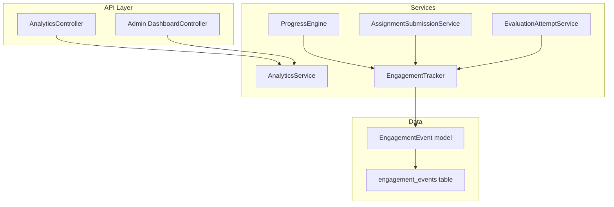
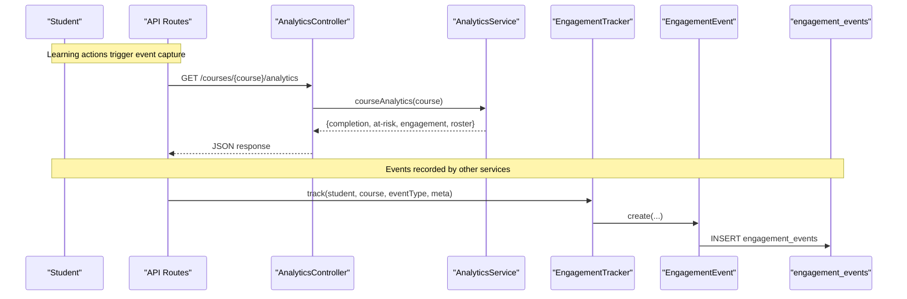
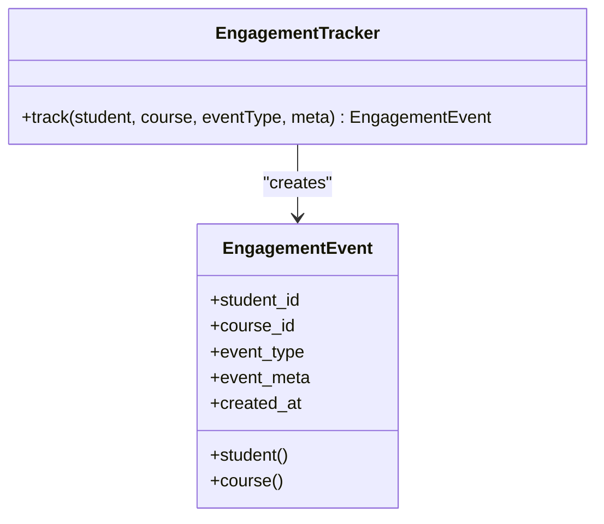
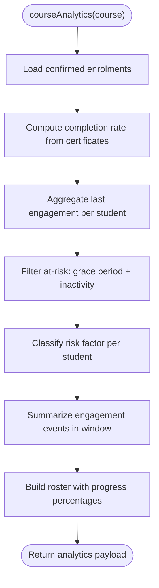
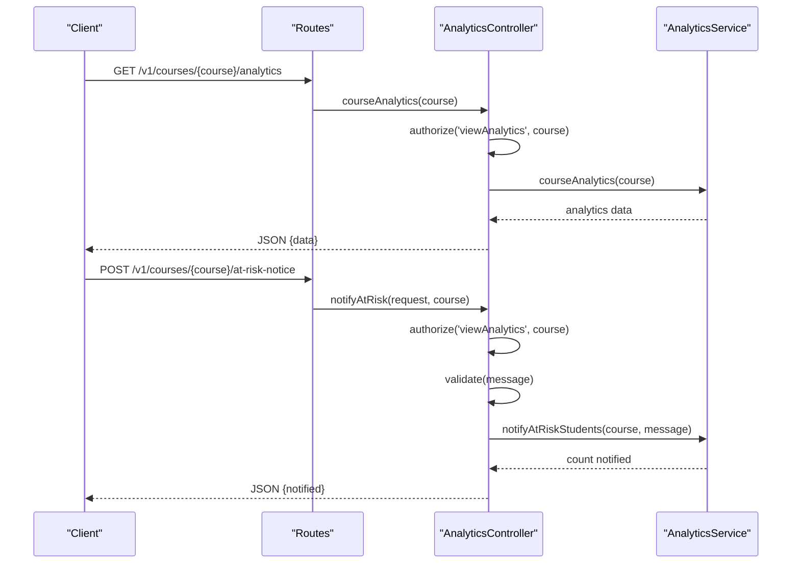
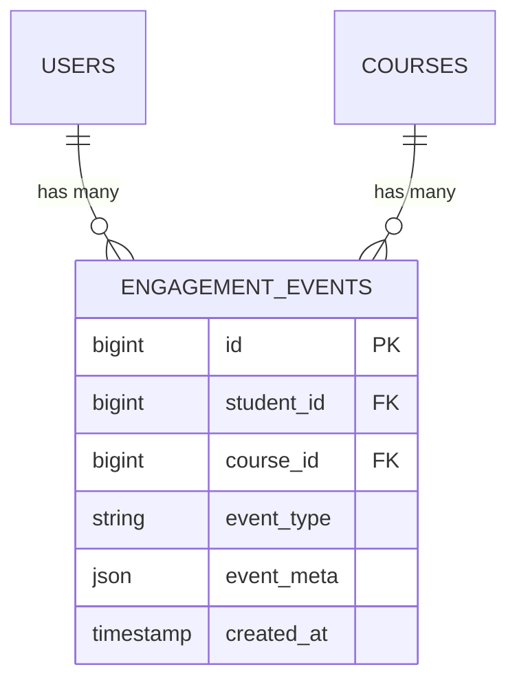
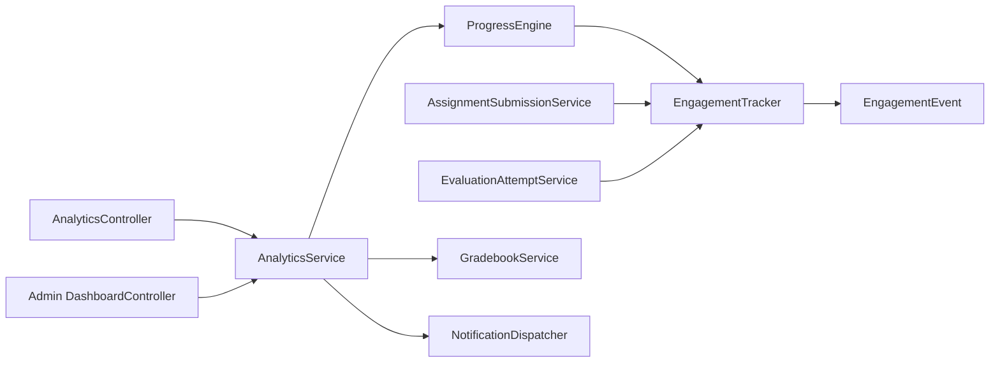

# Analytics Services

<cite>
**Referenced Files in This Document**
- [AnalyticsService.php](file://app/Services/Analytics/AnalyticsService.php)
- [EngagementTracker.php](file://app/Services/Analytics/EngagementTracker.php)
- [EngagementEvent.php](file://app/Models/EngagementEvent.php)
- [AnalyticsController.php](file://app/Http/Controllers/Api/V1/AnalyticsController.php)
- [api.php](file://routes/api.php)
- [2024_01_01_000190_create_engagement_events_table.php](file://database/migrations/2024_01_01_000190_create_engagement_events_table.php)
- [ProgressEngine.php](file://app/Services/Progress/ProgressEngine.php)
- [AssignmentSubmissionService.php](file://app/Services/Assessment/AssignmentSubmissionService.php)
- [EvaluationAttemptService.php](file://app/Services/Assessment/EvaluationAttemptService.php)
- [DashboardController.php](file://app/Http/Controllers/Api/V1/Admin/DashboardController.php)
- [EngagementTrackingTest.php](file://tests/Feature/Analytics/EngagementTrackingTest.php)
- [CourseAnalyticsTest.php](file://tests/Feature/Analytics/CourseAnalyticsTest.php)
- [AdminDashboardSummaryTest.php](file://tests/Feature/Analytics/AdminDashboardSummaryTest.php)
</cite>

## Table of Contents
1. [Introduction](#introduction)
2. [Project Structure](#project-structure)
3. [Core Components](#core-components)
4. [Architecture Overview](#architecture-overview)
5. [Detailed Component Analysis](#detailed-component-analysis)
6. [Dependency Analysis](#dependency-analysis)
7. [Performance Considerations](#performance-considerations)
8. [Troubleshooting Guide](#troubleshooting-guide)
9. [Conclusion](#conclusion)

## Introduction
This document explains the Analytics Services that track student engagement, generate analytics reports, and provide insights into learning patterns. It focuses on:
- How user interactions are captured via EngagementTracker and persisted as EngagementEvent records.
- How AnalyticsService aggregates data to compute completion rates, engagement summaries, at-risk flags, and system-wide metrics.
- How instructors and administrators consume these insights through API endpoints to improve learning outcomes.

The design separates event capture (write path) from analytics computation (read path), enabling scalable reporting over rich behavioral signals.

## Project Structure
The analytics feature spans services, models, controllers, routes, migrations, and tests:
- Event capture is centralized in a single tracker service.
- Analytics computations are encapsulated in a dedicated service with clear read-only responsibilities.
- Controllers expose secure endpoints for course-level analytics and admin dashboards.
- The database schema stores structured engagement events with indexes for efficient aggregation.

**Diagram sources**
- [AnalyticsController.php:17-36](file://app/Http/Controllers/Api/V1/AnalyticsController.php#L17-L36)
- [DashboardController.php:19-25](file://app/Http/Controllers/Api/V1/Admin/DashboardController.php#L19-L25)
- [AnalyticsService.php:47-51](file://app/Services/Analytics/AnalyticsService.php#L47-L51)
- [EngagementTracker.php:26-34](file://app/Services/Analytics/EngagementTracker.php#L26-L34)
- [ProgressEngine.php:241-283](file://app/Services/Progress/ProgressEngine.php#L241-L283)
- [AssignmentSubmissionService.php:62](file://app/Services/Assessment/AssignmentSubmissionService.php#L62)
- [EvaluationAttemptService.php:139](file://app/Services/Assessment/EvaluationAttemptService.php#L139)
- [EngagementEvent.php:19-28](file://app/Models/EngagementEvent.php#L19-L28)
- [2024_01_01_000190_create_engagement_events_table.php:13-23](file://database/migrations/2024_01_01_000190_create_engagement_events_table.php#L13-L23)

**Section sources**
- [AnalyticsController.php:17-36](file://app/Http/Controllers/Api/V1/AnalyticsController.php#L17-L36)
- [AnalyticsService.php:32-51](file://app/Services/Analytics/AnalyticsService.php#L32-L51)
- [EngagementTracker.php:11-34](file://app/Services/Analytics/EngagementTracker.php#L11-L34)
- [EngagementEvent.php:12-44](file://app/Models/EngagementEvent.php#L12-L44)
- [2024_01_01_000190_create_engagement_events_table.php:13-23](file://database/migrations/2024_01_01_000190_create_engagement_events_table.php#L13-L23)

## Core Components
- EngagementTracker: Single write path that records course-scoped engagement events (resource_viewed, assignment_submitted, quiz_attempted).
- AnalyticsService: Read-only analytics engine that computes completion rates, engagement summaries, at-risk flags, roster progress, and system summary metrics.
- EngagementEvent model: Lightweight event record with JSON metadata and relationships to students and courses.
- AnalyticsController: Secure API endpoints for course analytics and mass at-risk notifications.
- Admin DashboardController: Consumes AnalyticsService for system-wide summary.

Key behaviors:
- Event capture is decoupled from analytics; multiple services trigger tracking without knowing about reporting logic.
- At-risk detection uses grace period and inactivity thresholds, excluding completed students.
- Risk factor categorization leverages overdue assignments and submission status to provide actionable insight.

**Section sources**
- [EngagementTracker.php:11-34](file://app/Services/Analytics/EngagementTracker.php#L11-L34)
- [AnalyticsService.php:32-51](file://app/Services/Analytics/AnalyticsService.php#L32-L51)
- [EngagementEvent.php:12-44](file://app/Models/EngagementEvent.php#L12-L44)
- [AnalyticsController.php:17-36](file://app/Http/Controllers/Api/V1/AnalyticsController.php#L17-L36)
- [DashboardController.php:19-25](file://app/Http/Controllers/Api/V1/Admin/DashboardController.php#L19-L25)

## Architecture Overview
The analytics architecture follows a clear separation of concerns:
- Write path: ProgressEngine, AssignmentSubmissionService, and EvaluationAttemptService call EngagementTracker when meaningful learning actions occur.
- Storage: EngagementTracker persists events to the engagement_events table with indexes optimized for course and student queries.
- Read path: AnalyticsService performs aggregated queries to produce course analytics and system summaries.
- Exposure: Controllers enforce authorization and return structured JSON responses.

**Diagram sources**
- [api.php:193-196](file://routes/api.php#L193-L196)
- [AnalyticsController.php:17-36](file://app/Http/Controllers/Api/V1/AnalyticsController.php#L17-L36)
- [AnalyticsService.php:56-117](file://app/Services/Analytics/AnalyticsService.php#L56-L117)
- [EngagementTracker.php:26-34](file://app/Services/Analytics/EngagementTracker.php#L26-L34)
- [EngagementEvent.php:19-28](file://app/Models/EngagementEvent.php#L19-L28)
- [2024_01_01_000190_create_engagement_events_table.php:13-23](file://database/migrations/2024_01_01_000190_create_engagement_events_table.php#L13-L23)

## Detailed Component Analysis

### EngagementTracker
Responsibilities:
- Record course-scoped engagement events with student, course, type, and optional metadata.
- Enforce that only meaningful learning actions are tracked (resource_viewed, assignment_submitted, quiz_attempted).

Integration points:
- ProgressEngine triggers resource_viewed when content is consumed.
- AssignmentSubmissionService triggers assignment_submitted upon successful submission.
- EvaluationAttemptService triggers quiz_attempted when an evaluation attempt is submitted.

Data model:
- Persists to EngagementEvent with JSON metadata cast to array.

**Diagram sources**
- [EngagementTracker.php:26-34](file://app/Services/Analytics/EngagementTracker.php#L26-L34)
- [EngagementEvent.php:19-44](file://app/Models/EngagementEvent.php#L19-L44)

**Section sources**
- [EngagementTracker.php:11-34](file://app/Services/Analytics/EngagementTracker.php#L11-L34)
- [EngagementEvent.php:12-44](file://app/Models/EngagementEvent.php#L12-L44)
- [ProgressEngine.php:241-283](file://app/Services/Progress/ProgressEngine.php#L241-L283)
- [AssignmentSubmissionService.php:62](file://app/Services/Assessment/AssignmentSubmissionService.php#L62)
- [EvaluationAttemptService.php:139](file://app/Services/Assessment/EvaluationAttemptService.php#L139)

### AnalyticsService
Responsibilities:
- Compute per-course analytics: total/completed students, completion rate, engagement summary, at-risk list, and roster progress.
- Identify at-risk students using grace period and inactivity windows, excluding those who have completed the course.
- Provide risk factors based on activity and assignment backlog.
- Send mass at-risk reminders to flagged students.
- Generate system-wide summary for admin dashboard.

Key algorithms:
- Completion rate: ratio of certificate recipients among confirmed enrolments.
- At-risk filter: excludes completed students, recent enrolments within grace period, and recently active students.
- Risk factor classification: “No activity”, “Assignment backlog”, or “Inactive”.

**Diagram sources**
- [AnalyticsService.php:56-117](file://app/Services/Analytics/AnalyticsService.php#L56-L117)
- [AnalyticsService.php:147-188](file://app/Services/Analytics/AnalyticsService.php#L147-L188)
- [AnalyticsService.php:195-213](file://app/Services/Analytics/AnalyticsService.php#L195-L213)
- [AnalyticsService.php:225-244](file://app/Services/Analytics/AnalyticsService.php#L225-L244)

**Section sources**
- [AnalyticsService.php:32-51](file://app/Services/Analytics/AnalyticsService.php#L32-L51)
- [AnalyticsService.php:56-117](file://app/Services/Analytics/AnalyticsService.php#L56-L117)
- [AnalyticsService.php:124-142](file://app/Services/Analytics/AnalyticsService.php#L124-L142)
- [AnalyticsService.php:147-188](file://app/Services/Analytics/AnalyticsService.php#L147-L188)
- [AnalyticsService.php:195-213](file://app/Services/Analytics/AnalyticsService.php#L195-L213)
- [AnalyticsService.php:225-244](file://app/Services/Analytics/AnalyticsService.php#L225-L244)
- [AnalyticsService.php:253-304](file://app/Services/Analytics/AnalyticsService.php#L253-L304)

### AnalyticsController
Responsibilities:
- Expose course analytics endpoint protected by authorization.
- Expose mass at-risk notification endpoint with message validation.

Authorization:
- Uses policy checks to ensure only authorized users (admin or teaching instructor) can access analytics and send notices.

**Diagram sources**
- [api.php:193-196](file://routes/api.php#L193-L196)
- [AnalyticsController.php:17-36](file://app/Http/Controllers/Api/V1/AnalyticsController.php#L17-L36)
- [AnalyticsService.php:124-142](file://app/Services/Analytics/AnalyticsService.php#L124-L142)

**Section sources**
- [AnalyticsController.php:17-36](file://app/Http/Controllers/Api/V1/AnalyticsController.php#L17-L36)
- [api.php:193-196](file://routes/api.php#L193-L196)

### Data Model: EngagementEvent
- Stores student_id, course_id, event_type, event_meta, created_at.
- Provides belongsTo relationships to User and Course.
- Uses JSON casting for event_meta.
- Migration defines indexes on course_id+event_type and student_id for efficient querying.

**Diagram sources**
- [EngagementEvent.php:19-44](file://app/Models/EngagementEvent.php#L19-L44)
- [2024_01_01_000190_create_engagement_events_table.php:13-23](file://database/migrations/2024_01_01_000190_create_engagement_events_table.php#L13-L23)

**Section sources**
- [EngagementEvent.php:12-44](file://app/Models/EngagementEvent.php#L12-L44)
- [2024_01_01_000190_create_engagement_events_table.php:13-23](file://database/migrations/2024_01_01_000190_create_engagement_events_table.php#L13-L23)

## Dependency Analysis
Coupling and cohesion:
- EngagementTracker has low coupling and high cohesion: it only writes events and depends on models.
- AnalyticsService depends on several domain services (GradebookService, ProgressEngine, NotificationDispatcher) but remains cohesive around analytics computation.
- Controllers depend on services and enforce authorization, keeping request handling thin.

External dependencies and integration points:
- ProgressEngine, AssignmentSubmissionService, and EvaluationAttemptService integrate with EngagementTracker to emit events.
- AnalyticsService integrates with GradebookService for final grades and NotificationDispatcher for at-risk reminders.
- Database indexes optimize analytics queries over engagement events.

**Diagram sources**
- [ProgressEngine.php:241-283](file://app/Services/Progress/ProgressEngine.php#L241-L283)
- [AssignmentSubmissionService.php:62](file://app/Services/Assessment/AssignmentSubmissionService.php#L62)
- [EvaluationAttemptService.php:139](file://app/Services/Assessment/EvaluationAttemptService.php#L139)
- [AnalyticsService.php:47-51](file://app/Services/Analytics/AnalyticsService.php#L47-L51)
- [AnalyticsController.php:17-36](file://app/Http/Controllers/Api/V1/AnalyticsController.php#L17-L36)
- [DashboardController.php:19-25](file://app/Http/Controllers/Api/V1/Admin/DashboardController.php#L19-L25)

**Section sources**
- [AnalyticsService.php:47-51](file://app/Services/Analytics/AnalyticsService.php#L47-L51)
- [AnalyticsService.php:56-117](file://app/Services/Analytics/AnalyticsService.php#L56-L117)
- [AnalyticsService.php:253-304](file://app/Services/Analytics/AnalyticsService.php#L253-L304)

## Performance Considerations
- Indexing: The engagement_events table includes indexes on course_id+event_type and student_id to support fast aggregation and filtering used by AnalyticsService.
- Aggregation strategy: AnalyticsService uses grouped queries and selective filters (grace period, inactivity window) to minimize overhead.
- Read-only analytics: Most operations are read-only except for sending notifications, reducing write contention during reporting.
- Batch notifications: Mass at-risk notice iterates only flagged students, limiting notification volume.

[No sources needed since this section provides general guidance]

## Troubleshooting Guide
Common issues and diagnostics:
- Missing engagement events: Verify that ProgressEngine, AssignmentSubmissionService, and EvaluationAttemptService are invoked during relevant actions. Tests assert event creation for resource_viewed and assignment_submitted.
- Incorrect at-risk flags: Ensure enrolment applied_at is backdated appropriately and that engagement timestamps reflect actual activity. At-risk logic excludes recent enrolments and completed students.
- Authorization errors: Confirm that the requesting user has viewAnalytics permission for the course; both analytics and at-risk notice endpoints enforce this policy.
- Admin dashboard anomalies: Validate orders marked paid and ticket statuses; system summary aggregates counts across courses, tickets, reviews, and revenue.

Relevant validations and assertions:
- EngagementTrackingTest verifies event recording for resource_viewed and assignment_submitted flows.
- CourseAnalyticsTest validates completion rate calculation, at-risk flagging rules, risk factor classification, roster progress, and notification behavior.
- AdminDashboardSummaryTest confirms system-wide counts and revenue aggregation.

**Section sources**
- [EngagementTrackingTest.php:21-52](file://tests/Feature/Analytics/EngagementTrackingTest.php#L21-L52)
- [CourseAnalyticsTest.php:29-88](file://tests/Feature/Analytics/CourseAnalyticsTest.php#L29-L88)
- [CourseAnalyticsTest.php:99-157](file://tests/Feature/Analytics/CourseAnalyticsTest.php#L99-L157)
- [CourseAnalyticsTest.php:159-227](file://tests/Feature/Analytics/CourseAnalyticsTest.php#L159-L227)
- [AdminDashboardSummaryTest.php:21-67](file://tests/Feature/Analytics/AdminDashboardSummaryTest.php#L21-L67)

## Conclusion
The Analytics Services provide a robust foundation for understanding student engagement and identifying at-risk learners:
- EngagementTracker centralizes event capture, ensuring consistent, course-scoped behavioral signals.
- AnalyticsService transforms raw events and related data into actionable insights: completion rates, engagement summaries, at-risk flags, and system-wide metrics.
- Controllers expose secure endpoints for instructors and administrators to act on insights, including targeted at-risk notifications.
- Tests validate core behaviors and edge cases, supporting reliability and maintainability.

By leveraging these services, instructors can intervene early with personalized support, and administrators can monitor institutional performance and revenue trends effectively.