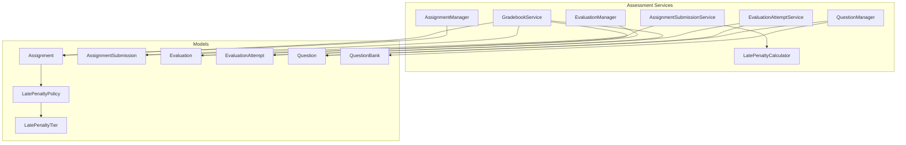
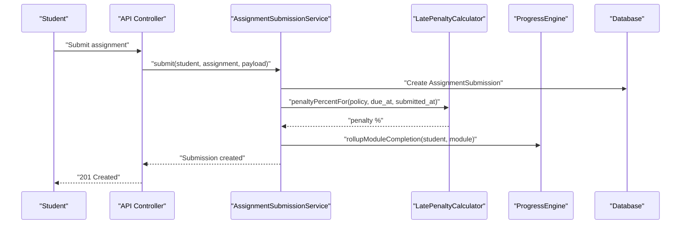
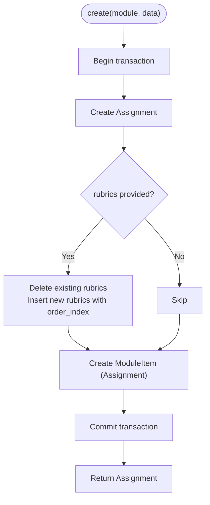
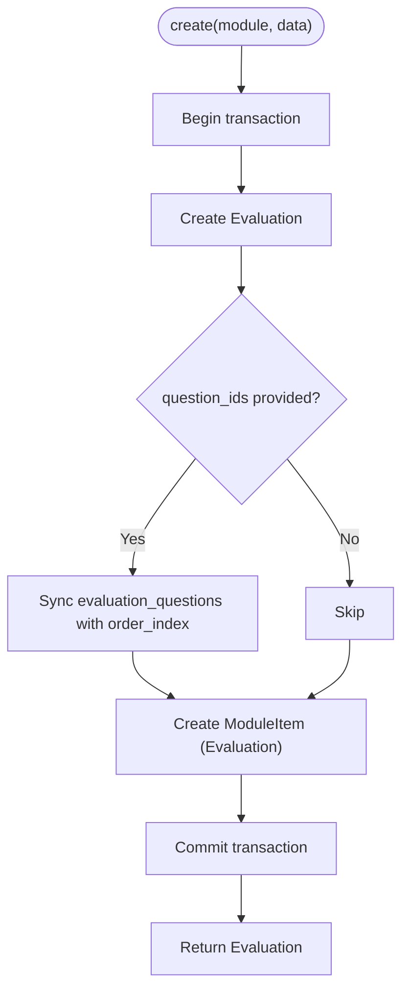
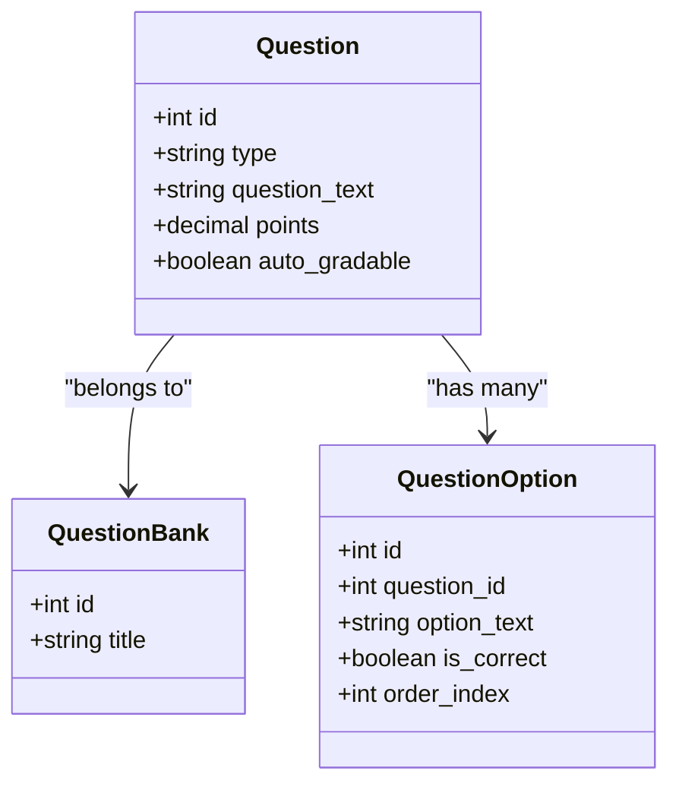
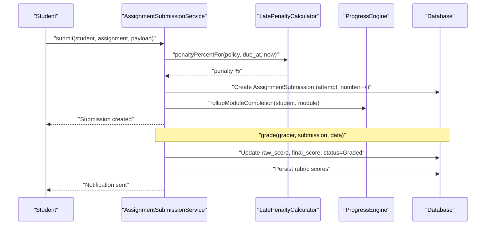
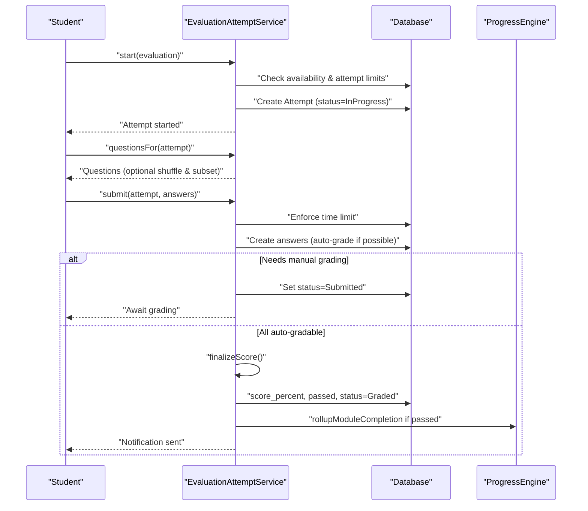
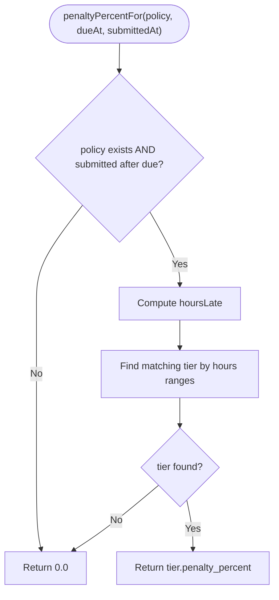
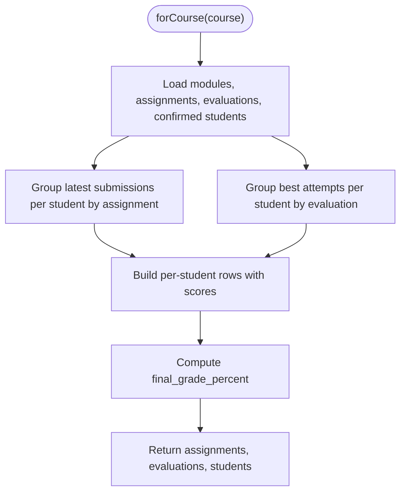
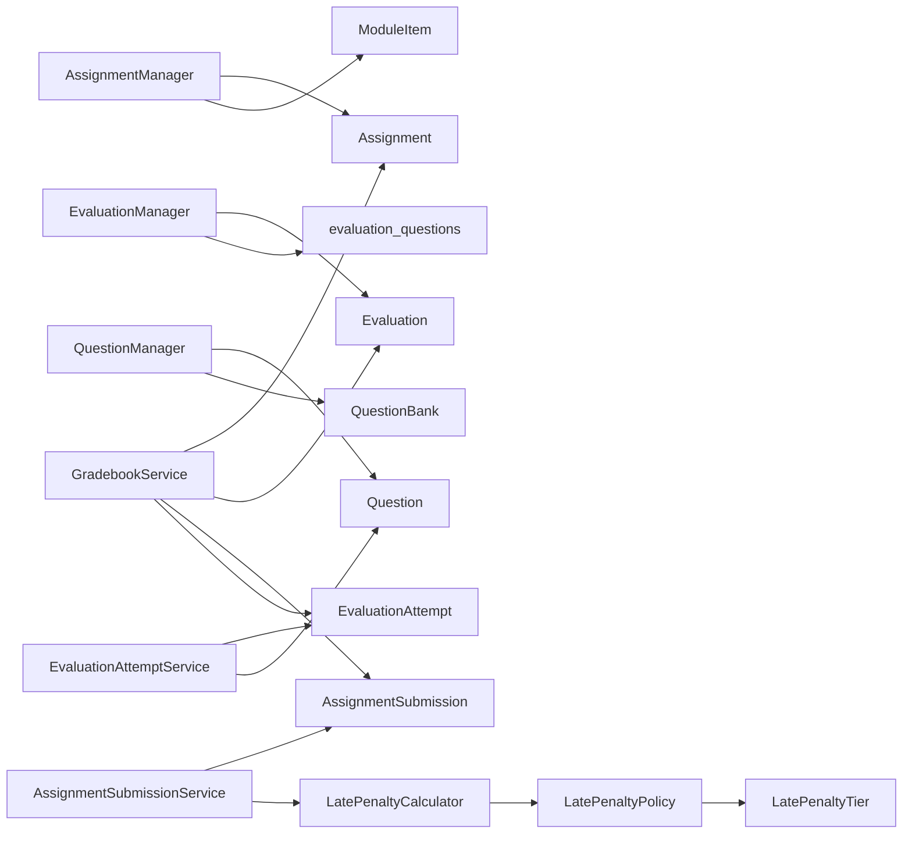

# Assessment Services

<cite>
**Referenced Files in This Document**
- [AssignmentManager.php](file://app/Services/Assessment/AssignmentManager.php)
- [EvaluationManager.php](file://app/Services/Assessment/EvaluationManager.php)
- [QuestionManager.php](file://app/Services/Assessment/QuestionManager.php)
- [AssignmentSubmissionService.php](file://app/Services/Assessment/AssignmentSubmissionService.php)
- [EvaluationAttemptService.php](file://app/Services/Assessment/EvaluationAttemptService.php)
- [LatePenaltyCalculator.php](file://app/Services/Assessment/LatePenaltyCalculator.php)
- [GradebookService.php](file://app/Services/Assessment/GradebookService.php)
- [Assignment.php](file://app/Models/Assignment.php)
- [AssignmentSubmission.php](file://app/Models/AssignmentSubmission.php)
- [Evaluation.php](file://app/Models/Evaluation.php)
- [EvaluationAttempt.php](file://app/Models/EvaluationAttempt.php)
- [Question.php](file://app/Models/Question.php)
- [QuestionBank.php](file://app/Models/QuestionBank.php)
- [LatePenaltyPolicy.php](file://app/Models/LatePenaltyPolicy.php)
- [LatePenaltyTier.php](file://app/Models/LatePenaltyTier.php)
</cite>

## Table of Contents
1. Introduction
2. Project Structure
3. Core Components
4. Architecture Overview
5. Detailed Component Analysis
6. Dependency Analysis
7. Performance Considerations
8. Troubleshooting Guide
9. Conclusion

## Introduction
This document explains the Assessment Services layer that implements all assessment-related business logic. It covers assignment and evaluation lifecycle management, question bank operations, submission processing, grading workflows (including rubric-based scoring), automated scoring for objective questions, late penalty calculations, and grade aggregation for a course gradebook. The services coordinate Eloquent models to enforce consistent rules around attempts, time limits, randomization, pass thresholds, and module completion rollups.

## Project Structure
The Assessment Services are organized under app/Services/Assessment and interact with domain models under app/Models. Managers handle creation/update/delete of assessments and their related items; specialized services orchestrate submissions, attempts, grading, penalties, notifications, audit logging, engagement tracking, and progress rollups. GradebookService aggregates scores across assignments and evaluations per student.

**Diagram sources**
- [AssignmentManager.php:26-49](file://app/Services/Assessment/AssignmentManager.php#L26-L49)
- [EvaluationManager.php:28-48](file://app/Services/Assessment/EvaluationManager.php#L28-L48)
- [QuestionManager.php:24-47](file://app/Services/Assessment/QuestionManager.php#L24-L47)
- [AssignmentSubmissionService.php:37-67](file://app/Services/Assessment/AssignmentSubmissionService.php#L37-L67)
- [EvaluationAttemptService.php:35-78](file://app/Services/Assessment/EvaluationAttemptService.php#L35-L78)
- [LatePenaltyCalculator.php:17-34](file://app/Services/Assessment/LatePenaltyCalculator.php#L17-L34)
- [GradebookService.php:31-119](file://app/Services/Assessment/GradebookService.php#L31-L119)
- [Assignment.php:19-69](file://app/Models/Assignment.php#L19-L69)
- [AssignmentSubmission.php:22-87](file://app/Models/AssignmentSubmission.php#L22-L87)
- [Evaluation.php:19-61](file://app/Models/Evaluation.php#L19-L61)
- [EvaluationAttempt.php:21-62](file://app/Models/EvaluationAttempt.php#L21-L62)
- [Question.php:22-58](file://app/Models/Question.php#L22-L58)
- [QuestionBank.php:20-38](file://app/Models/QuestionBank.php#L20-L38)
- [LatePenaltyPolicy.php:19-36](file://app/Models/LatePenaltyPolicy.php#L19-L36)
- [LatePenaltyTier.php:19-35](file://app/Models/LatePenaltyTier.php#L19-L35)

**Section sources**
- [AssignmentManager.php:26-49](file://app/Services/Assessment/AssignmentManager.php#L26-L49)
- [EvaluationManager.php:28-48](file://app/Services/Assessment/EvaluationManager.php#L28-L48)
- [QuestionManager.php:24-47](file://app/Services/Assessment/QuestionManager.php#L24-L47)
- [AssignmentSubmissionService.php:37-67](file://app/Services/Assessment/AssignmentSubmissionService.php#L37-L67)
- [EvaluationAttemptService.php:35-78](file://app/Services/Assessment/EvaluationAttemptService.php#L35-L78)
- [LatePenaltyCalculator.php:17-34](file://app/Services/Assessment/LatePenaltyCalculator.php#L17-L34)
- [GradebookService.php:31-119](file://app/Services/Assessment/GradebookService.php#L31-L119)

## Core Components
- AssignmentManager: Creates, updates, and deletes assignments while synchronizing rubrics and linking them as module items.
- EvaluationManager: Creates, updates, and deletes evaluations while synchronizing question sets and linking them as module items.
- QuestionManager: Creates questions within a question bank, deriving auto-grading capability from question type and persisting options.
- AssignmentSubmissionService: Handles student submissions, computes late penalties, records rubric scores during grading, triggers notifications, audits changes, and rolls up module completion on submit.
- EvaluationAttemptService: Manages attempt lifecycle (start, questions retrieval, submit), enforces availability windows, attempt limits, time limits, randomization/subsetting, auto-grades objective answers, queues manual grading when needed, finalizes scores, notifies students, and marks module complete on pass.
- LatePenaltyCalculator: Computes tiered late penalty percentages based on configured policy tiers and hours late.
- GradebookService: Aggregates latest assignment scores and best evaluation attempts per student to compute a final grade percentage for the course.

**Section sources**
- [AssignmentManager.php:26-92](file://app/Services/Assessment/AssignmentManager.php#L26-L92)
- [EvaluationManager.php:28-87](file://app/Services/Assessment/EvaluationManager.php#L28-L87)
- [QuestionManager.php:24-53](file://app/Services/Assessment/QuestionManager.php#L24-L53)
- [AssignmentSubmissionService.php:37-115](file://app/Services/Assessment/AssignmentSubmissionService.php#L37-L115)
- [EvaluationAttemptService.php:35-205](file://app/Services/Assessment/EvaluationAttemptService.php#L35-L205)
- [LatePenaltyCalculator.php:17-34](file://app/Services/Assessment/LatePenaltyCalculator.php#L17-L34)
- [GradebookService.php:31-119](file://app/Services/Assessment/GradebookService.php#L31-L119)

## Architecture Overview
The services follow a clear separation of concerns:
- Managers encapsulate CRUD and synchronization of assessment definitions and their relationships to modules and content.
- Submission and attempt services encapsulate workflow logic, integrating cross-cutting concerns like notifications, auditing, engagement tracking, and progress rollups.
- Calculators provide pure functions for scoring and penalties.
- Models define data contracts and relationships used by services.

**Diagram sources**
- [AssignmentSubmissionService.php:37-67](file://app/Services/Assessment/AssignmentSubmissionService.php#L37-L67)
- [LatePenaltyCalculator.php:17-34](file://app/Services/Assessment/LatePenaltyCalculator.php#L17-L34)

## Detailed Component Analysis

### AssignmentManager
Responsibilities:
- Create an assignment within a module, set core fields, synchronize rubrics, and register it as a module item.
- Update assignment fields and optionally replace rubrics; update module item ordering and required flag if provided.
- Delete an assignment by removing its module item and then deleting the assignment.

Key behaviors:
- Rubric sync replaces all rubric rows atomically to avoid diff complexity.
- Module item creation uses order_index defaults to append at the end if not specified.

**Diagram sources**
- [AssignmentManager.php:26-49](file://app/Services/Assessment/AssignmentManager.php#L26-L49)
- [AssignmentManager.php:97-113](file://app/Services/Assessment/AssignmentManager.php#L97-L113)

**Section sources**
- [AssignmentManager.php:26-92](file://app/Services/Assessment/AssignmentManager.php#L26-L92)
- [Assignment.php:19-69](file://app/Models/Assignment.php#L19-L69)

### EvaluationManager
Responsibilities:
- Create an evaluation within a module, set configuration fields, synchronize question associations, and register it as a module item.
- Update evaluation fields and optionally replace the question set; update module item ordering and required flag if provided.
- Delete an evaluation by removing its module item and then deleting the evaluation.

Key behaviors:
- Question sync preserves order via pivot order_index.
- Availability windows and attempt settings are stored on the evaluation model.

**Diagram sources**
- [EvaluationManager.php:28-48](file://app/Services/Assessment/EvaluationManager.php#L28-L48)
- [EvaluationManager.php:93-102](file://app/Services/Assessment/EvaluationManager.php#L93-L102)

**Section sources**
- [EvaluationManager.php:28-87](file://app/Services/Assessment/EvaluationManager.php#L28-L87)
- [Evaluation.php:19-61](file://app/Models/Evaluation.php#L19-L61)

### QuestionManager
Responsibilities:
- Create a question within a question bank, derive auto_gradable from question type, persist options, and return the fresh question.
- Delete a question.

Key behaviors:
- Auto-grading is enforced server-side based on allowed types; client input cannot override this.

**Diagram sources**
- [QuestionManager.php:24-47](file://app/Services/Assessment/QuestionManager.php#L24-L47)
- [Question.php:22-58](file://app/Models/Question.php#L22-L58)
- [QuestionBank.php:20-38](file://app/Models/QuestionBank.php#L20-L38)

**Section sources**
- [QuestionManager.php:24-53](file://app/Services/Assessment/QuestionManager.php#L24-L53)
- [Question.php:22-58](file://app/Models/Question.php#L22-L58)
- [QuestionBank.php:20-38](file://app/Models/QuestionBank.php#L20-L38)

### AssignmentSubmissionService
Responsibilities:
- Submit a student’s assignment, compute late penalty, record attempt number, track engagement, and roll up module completion immediately upon submission.
- Grade a submission: apply late penalty to raw score, persist rubric scores, notify the student, log audit events, and mark status graded.

Grading formula:
- final_score = round(raw_score * (1 - late_penalty_percent / 100), 2)

**Diagram sources**
- [AssignmentSubmissionService.php:37-67](file://app/Services/Assessment/AssignmentSubmissionService.php#L37-L67)
- [AssignmentSubmissionService.php:72-115](file://app/Services/Assessment/AssignmentSubmissionService.php#L72-L115)
- [LatePenaltyCalculator.php:17-34](file://app/Services/Assessment/LatePenaltyCalculator.php#L17-L34)

**Section sources**
- [AssignmentSubmissionService.php:37-115](file://app/Services/Assessment/AssignmentSubmissionService.php#L37-L115)
- [AssignmentSubmission.php:22-87](file://app/Models/AssignmentSubmission.php#L22-L87)

### EvaluationAttemptService
Responsibilities:
- Start an attempt with availability checks, attempt limit enforcement, and duplicate in-progress prevention.
- Retrieve questions with optional randomization and subset selection.
- Submit answers: enforce time limit, auto-grade objective questions, queue manual grading for non-auto-gradable questions, finalize scores, notify students, and mark module complete on pass.
- Grade manual answers and finalize scores.

Scoring and pass logic:
- score_percent = sum(points_awarded) / sum(question.points) * 100
- passed = score_percent >= pass_score

**Diagram sources**
- [EvaluationAttemptService.php:35-78](file://app/Services/Assessment/EvaluationAttemptService.php#L35-L78)
- [EvaluationAttemptService.php:83-97](file://app/Services/Assessment/EvaluationAttemptService.php#L83-L97)
- [EvaluationAttemptService.php:102-149](file://app/Services/Assessment/EvaluationAttemptService.php#L102-L149)
- [EvaluationAttemptService.php:154-181](file://app/Services/Assessment/EvaluationAttemptService.php#L154-L181)
- [EvaluationAttemptService.php:183-205](file://app/Services/Assessment/EvaluationAttemptService.php#L183-L205)

**Section sources**
- [EvaluationAttemptService.php:35-205](file://app/Services/Assessment/EvaluationAttemptService.php#L35-L205)
- [EvaluationAttempt.php:21-62](file://app/Models/EvaluationAttempt.php#L21-L62)
- [Evaluation.php:19-61](file://app/Models/Evaluation.php#L19-L61)
- [Question.php:22-58](file://app/Models/Question.php#L22-L58)

### LatePenaltyCalculator
Responsibilities:
- Compute penalty percentage based on hours late and configured policy tiers. Returns zero if no policy or submission is on time.

Algorithm:
- Determine hours_late = due_at to submitted_at difference in hours.
- Select the highest matching tier where hours_late_from <= hours_late and (hours_late_to is null or > hours_late).
- Return tier.penalty_percent or 0.0.

**Diagram sources**
- [LatePenaltyCalculator.php:17-34](file://app/Services/Assessment/LatePenaltyCalculator.php#L17-L34)

**Section sources**
- [LatePenaltyCalculator.php:17-34](file://app/Services/Assessment/LatePenaltyCalculator.php#L17-L34)
- [LatePenaltyPolicy.php:19-36](file://app/Models/LatePenaltyPolicy.php#L19-L36)
- [LatePenaltyTier.php:19-35](file://app/Models/LatePenaltyTier.php#L19-L35)

### GradebookService
Responsibilities:
- Build a per-course gradebook including all assignments and evaluations, latest submission scores per student, best evaluation attempt scores per student, and a final grade percentage.

Aggregation rules:
- For each student, pick the latest submission per assignment (by attempt_number) with a final_score.
- For each student, pick the best evaluation attempt per evaluation (highest score_percent) that is graded.
- Final grade percent = (sum of assignment final_scores + sum of evaluation best_score_percent) / (sum of assignment max_scores + count(evaluations) * 100).

**Diagram sources**
- [GradebookService.php:31-119](file://app/Services/Assessment/GradebookService.php#L31-L119)

**Section sources**
- [GradebookService.php:31-119](file://app/Services/Assessment/GradebookService.php#L31-L119)

## Dependency Analysis
- AssignmentManager depends on Assignment, AssignmentRubric, Module, ModuleItem.
- EvaluationManager depends on Evaluation, Question (via pivot), Module, ModuleItem.
- QuestionManager depends on Question, QuestionOption, QuestionBank.
- AssignmentSubmissionService depends on AssignmentSubmission, LatePenaltyCalculator, ProgressEngine, NotificationDispatcher, EngagementTracker, AuditLogger.
- EvaluationAttemptService depends on EvaluationAttempt, EvaluationAttemptAnswer, Question, ProgressEngine, NotificationDispatcher, EngagementTracker, AuditLogger.
- LatePenaltyCalculator depends on LatePenaltyPolicy and LatePenaltyTier.
- GradebookService depends on Assignment, AssignmentSubmission, Evaluation, EvaluationAttempt, Course, Enrolment, User.

**Diagram sources**
- [AssignmentManager.php:26-92](file://app/Services/Assessment/AssignmentManager.php#L26-L92)
- [EvaluationManager.php:28-87](file://app/Services/Assessment/EvaluationManager.php#L28-L87)
- [QuestionManager.php:24-53](file://app/Services/Assessment/QuestionManager.php#L24-L53)
- [AssignmentSubmissionService.php:37-115](file://app/Services/Assessment/AssignmentSubmissionService.php#L37-L115)
- [EvaluationAttemptService.php:35-205](file://app/Services/Assessment/EvaluationAttemptService.php#L35-L205)
- [LatePenaltyCalculator.php:17-34](file://app/Services/Assessment/LatePenaltyCalculator.php#L17-L34)
- [GradebookService.php:31-119](file://app/Services/Assessment/GradebookService.php#L31-L119)

**Section sources**
- [AssignmentManager.php:26-92](file://app/Services/Assessment/AssignmentManager.php#L26-L92)
- [EvaluationManager.php:28-87](file://app/Services/Assessment/EvaluationManager.php#L28-L87)
- [QuestionManager.php:24-53](file://app/Services/Assessment/QuestionManager.php#L24-L53)
- [AssignmentSubmissionService.php:37-115](file://app/Services/Assessment/AssignmentSubmissionService.php#L37-L115)
- [EvaluationAttemptService.php:35-205](file://app/Services/Assessment/EvaluationAttemptService.php#L35-L205)
- [LatePenaltyCalculator.php:17-34](file://app/Services/Assessment/LatePenaltyCalculator.php#L17-L34)
- [GradebookService.php:31-119](file://app/Services/Assessment/GradebookService.php#L31-L119)

## Performance Considerations
- Use database transactions for multi-step writes to ensure consistency (assignment/rubric/module item creation; evaluation/question sync; submission grading).
- Prefer batch operations where possible (e.g., syncing rubrics by delete+insert; syncing evaluation questions via pivot sync).
- Avoid N+1 queries in gradebook generation by eager loading relationships and grouping in memory efficiently.
- Keep calculation functions pure and side-effect free (e.g., LatePenaltyCalculator) to enable caching or testing.

[No sources needed since this section provides general guidance]

## Troubleshooting Guide
Common issues and resolutions:
- Evaluation not available: Ensure current time falls within available_from and available_until; otherwise start() will abort with a 403.
- Attempt limit exceeded: If max_attempts is set, further starts will be blocked once reached.
- Time limit exceeded: Submitting answers after the time window results in a validation error.
- Manual grading required: Non-auto-gradable questions leave the attempt in Submitted until graded; ensure graders review and finalize.
- Late penalty not applied: Verify assignment has a late penalty policy and due_at is set; confirm submitted_at is after due_at.
- Rubric scores missing: When grading assignments, ensure rubric_scores are included in the grade request; they replace previous rubric scores.

**Section sources**
- [EvaluationAttemptService.php:35-78](file://app/Services/Assessment/EvaluationAttemptService.php#L35-L78)
- [EvaluationAttemptService.php:102-149](file://app/Services/Assessment/EvaluationAttemptService.php#L102-L149)
- [AssignmentSubmissionService.php:37-67](file://app/Services/Assessment/AssignmentSubmissionService.php#L37-L67)
- [AssignmentSubmissionService.php:72-115](file://app/Services/Assessment/AssignmentSubmissionService.php#L72-L115)
- [LatePenaltyCalculator.php:17-34](file://app/Services/Assessment/LatePenaltyCalculator.php#L17-L34)

## Conclusion
The Assessment Services layer provides a robust, transactional, and extensible foundation for managing assignments, evaluations, questions, submissions, attempts, grading, penalties, and grade aggregation. By separating managers, workflow services, calculators, and models, the system remains maintainable and testable while enforcing key educational policies such as attempt limits, time windows, rubric-based grading, and late penalties.

[No sources needed since this section summarizes without analyzing specific files]