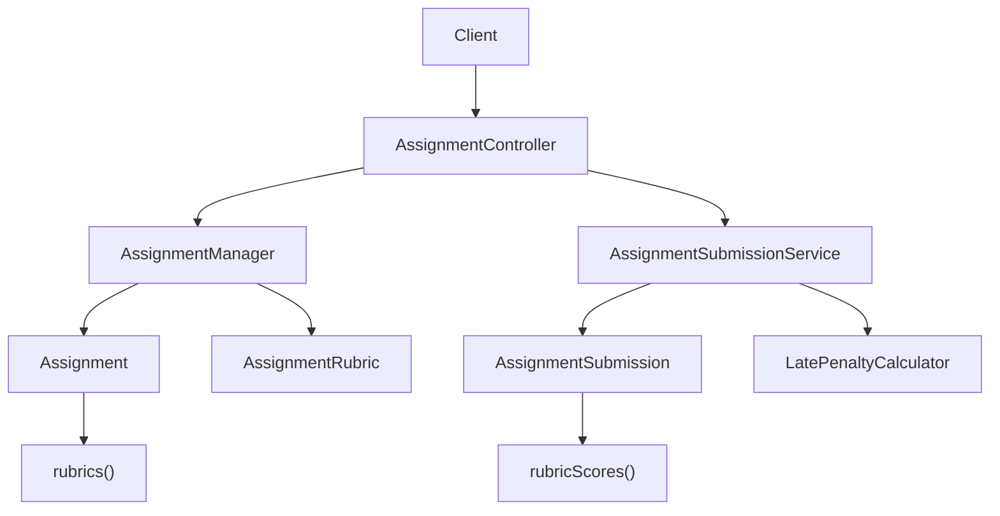
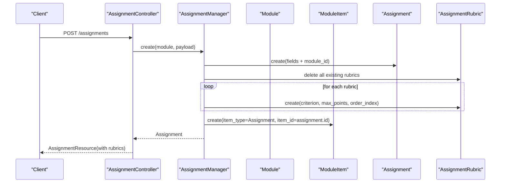
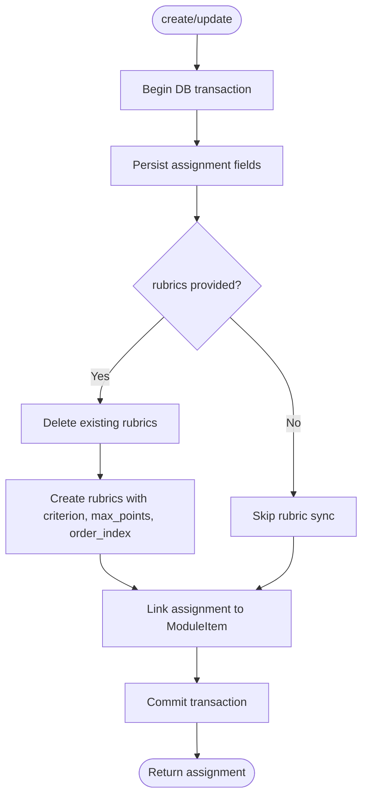
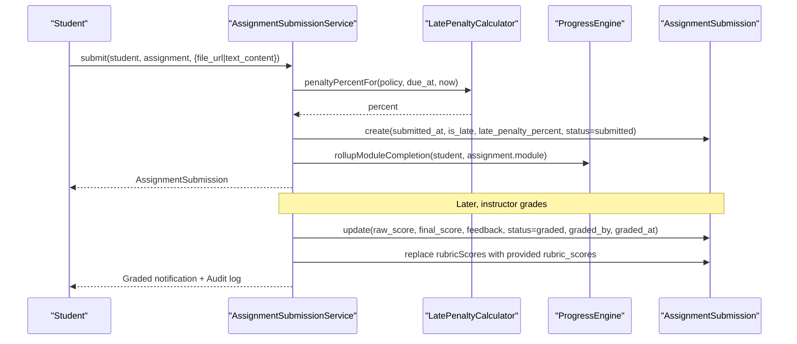
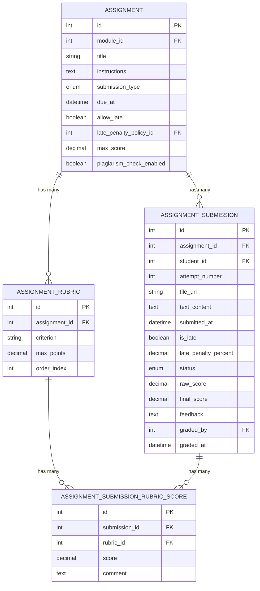
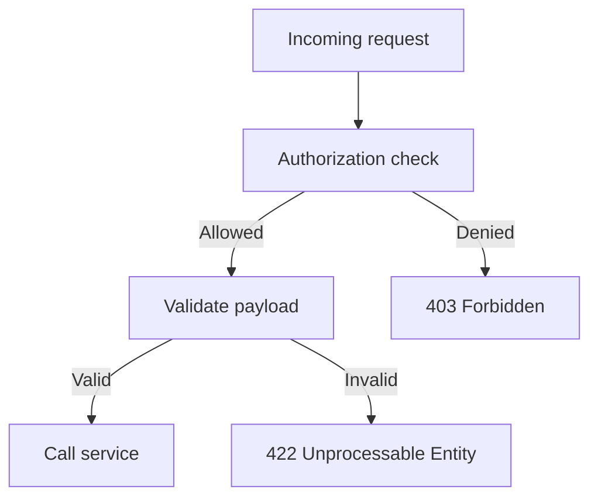
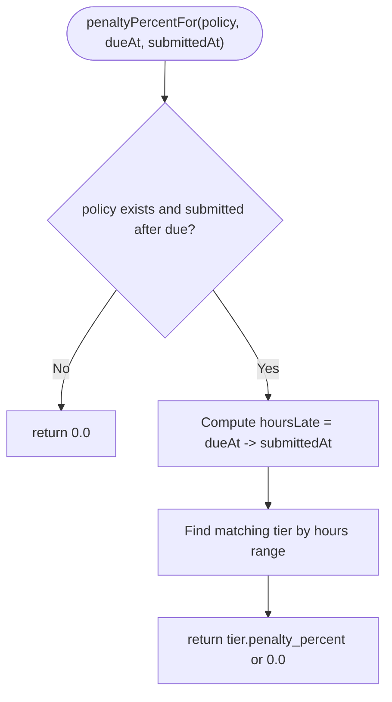
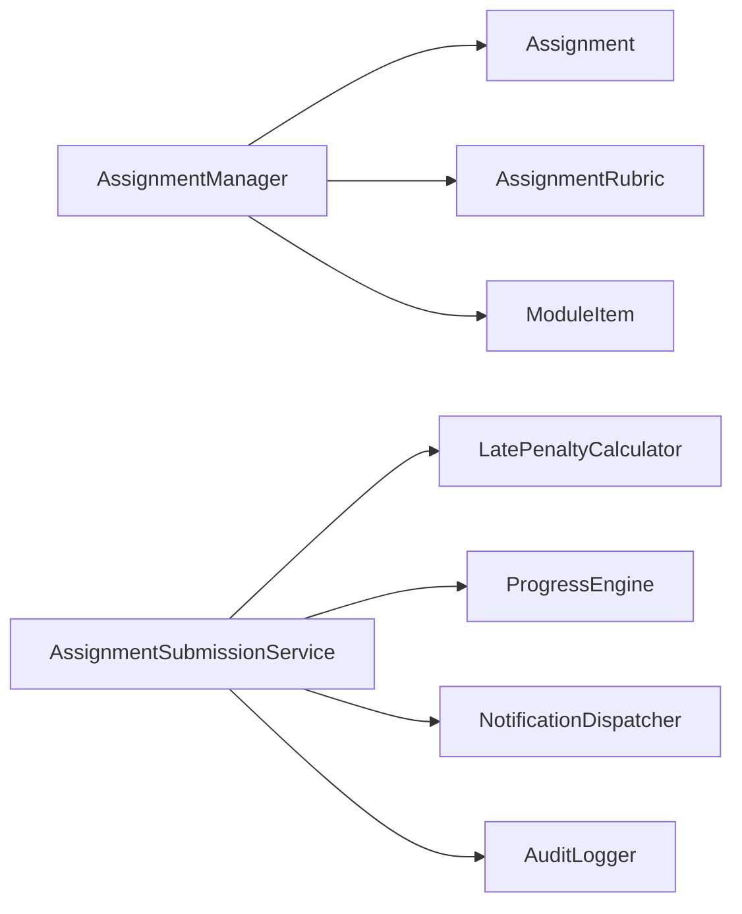

# Assignment Manager

<cite>
**Referenced Files in This Document**
- [AssignmentManager.php](file://app/Services/Assessment/AssignmentManager.php)
- [AssignmentController.php](file://app/Http/Controllers/Api/V1/AssignmentController.php)
- [StoreAssignmentRequest.php](file://app/Http/Requests/Api/V1/StoreAssignmentRequest.php)
- [UpdateAssignmentRequest.php](file://app/Http/Requests/Api/V1/UpdateAssignmentRequest.php)
- [Assignment.php](file://app/Models/Assignment.php)
- [AssignmentRubric.php](file://app/Models/AssignmentRubric.php)
- [AssignmentSubmission.php](file://app/Models/AssignmentSubmission.php)
- [AssignmentSubmissionRubricScore.php](file://app/Models/AssignmentSubmissionRubricScore.php)
- [LatePenaltyCalculator.php](file://app/Services/Assessment/LatePenaltyCalculator.php)
- [LatePenaltyPolicy.php](file://app/Models/LatePenaltyPolicy.php)
- [LatePenaltyTier.php](file://app/Models/LatePenaltyTier.php)
- [AssignmentSubmissionType.php](file://app/Enums/AssignmentSubmissionType.php)
- [SubmissionStatus.php](file://app/Enums/SubmissionStatus.php)
- [AssignmentPolicy.php](file://app/Policies/AssignmentPolicy.php)
</cite>

## Table of Contents
1. [Introduction](#introduction)
2. [Project Structure](#project-structure)
3. [Core Components](#core-components)
4. [Architecture Overview](#architecture-overview)
5. [Detailed Component Analysis](#detailed-component-analysis)
6. [Dependency Analysis](#dependency-analysis)
7. [Performance Considerations](#performance-considerations)
8. [Troubleshooting Guide](#troubleshooting-guide)
9. [Conclusion](#conclusion)

## Introduction
This document explains the AssignmentManager service and its role in managing the full lifecycle of assignments within a course module. It covers how assignments are created, updated, and deleted; how rubrics define grading criteria; how submissions are processed with late penalties; and how status transitions occur from submission to grading. The goal is to provide both high-level understanding and code-level traceability for developers and instructors using the system.

## Project Structure
The assignment feature spans controllers, services, models, enums, policies, and request validators:
- API layer: AssignmentController exposes endpoints for creating, updating, retrieving, and deleting assignments.
- Service layer: AssignmentManager orchestrates assignment persistence and rubric synchronization; AssignmentSubmissionService handles student submissions and instructor grading.
- Data layer: Eloquent models represent assignments, rubrics, submissions, and scoring details.
- Validation and authorization: Request classes validate inputs; policies enforce access control based on user roles and course ownership.
- Business rules: LatePenaltyCalculator applies configurable late penalties based on policy tiers.

**Diagram sources**
- [AssignmentController.php:16-46](file://app/Http/Controllers/Api/V1/AssignmentController.php#L16-L46)
- [AssignmentManager.php:21-113](file://app/Services/Assessment/AssignmentManager.php#L21-L113)
- [AssignmentSubmissionService.php:24-116](file://app/Services/Assessment/AssignmentSubmissionService.php#L24-L116)
- [Assignment.php:14-69](file://app/Models/Assignment.php#L14-L69)
- [AssignmentRubric.php:13-45](file://app/Models/AssignmentRubric.php#L13-L45)
- [AssignmentSubmission.php:15-88](file://app/Models/AssignmentSubmission.php#L15-L88)
- [LatePenaltyCalculator.php:15-35](file://app/Services/Assessment/LatePenaltyCalculator.php#L15-L35)

**Section sources**
- [AssignmentController.php:16-46](file://app/Http/Controllers/Api/V1/AssignmentController.php#L16-L46)
- [AssignmentManager.php:21-113](file://app/Services/Assessment/AssignmentManager.php#L21-L113)
- [AssignmentSubmissionService.php:24-116](file://app/Services/Assessment/AssignmentSubmissionService.php#L24-L116)

## Core Components
- AssignmentManager: Creates, updates, and deletes assignments within a transaction, synchronizes rubrics as a replace-all set, and links assignments to module items.
- AssignmentSubmissionService: Handles student submissions (with late detection and penalty calculation), progress rollups, and instructor grading (final score computation, rubric scores, notifications, audit logging).
- Models: Assignment, AssignmentRubric, AssignmentSubmission, AssignmentSubmissionRubricScore define data structures and relationships.
- Enums: AssignmentSubmissionType and SubmissionStatus constrain input and state transitions.
- Policies: AssignmentPolicy enforces that only admins or course instructors can manage assignments and grade submissions.
- Requests: StoreAssignmentRequest and UpdateAssignmentRequest validate assignment creation and update payloads, including rubric fields.

**Section sources**
- [AssignmentManager.php:21-113](file://app/Services/Assessment/AssignmentManager.php#L21-L113)
- [AssignmentSubmissionService.php:24-116](file://app/Services/Assessment/AssignmentSubmissionService.php#L24-L116)
- [Assignment.php:14-69](file://app/Models/Assignment.php#L14-L69)
- [AssignmentRubric.php:13-45](file://app/Models/AssignmentRubric.php#L13-L45)
- [AssignmentSubmission.php:15-88](file://app/Models/AssignmentSubmission.php#L15-L88)
- [AssignmentSubmissionRubricScore.php:10-40](file://app/Models/AssignmentSubmissionRubricScore.php#L10-L40)
- [AssignmentSubmissionType.php:7-12](file://app/Enums/AssignmentSubmissionType.php#L7-L12)
- [SubmissionStatus.php:7-11](file://app/Enums/SubmissionStatus.php#L7-L11)
- [AssignmentPolicy.php:13-43](file://app/Policies/AssignmentPolicy.php#L13-L43)
- [StoreAssignmentRequest.php:13-38](file://app/Http/Requests/Api/V1/StoreAssignmentRequest.php#L13-L38)
- [UpdateAssignmentRequest.php:12-37](file://app/Http/Requests/Api/V1/UpdateAssignmentRequest.php#L12-L37)

## Architecture Overview
The system follows a layered architecture:
- HTTP layer validates requests and delegates to services.
- Services encapsulate business logic and coordinate domain models.
- Models persist data and express relationships.
- Policies gate operations by role and ownership.
- Supporting services compute late penalties and integrate with progress tracking and notifications.

**Diagram sources**
- [AssignmentController.php:25-30](file://app/Http/Controllers/Api/V1/AssignmentController.php#L25-L30)
- [AssignmentManager.php:26-49](file://app/Services/Assessment/AssignmentManager.php#L26-L49)
- [AssignmentManager.php:97-113](file://app/Services/Assessment/AssignmentManager.php#L97-L113)

## Detailed Component Analysis

### AssignmentManager
Responsibilities:
- Create an assignment within a database transaction, persisting core fields and linking it to a module via a ModuleItem entry.
- Synchronize rubrics atomically: when rubrics are provided, existing rubrics are deleted and replaced with the new set, preserving order via index.
- Update an assignment’s fields and optionally replace rubrics; also update associated ModuleItem flags like required and ordering.
- Delete an assignment by removing its ModuleItem and then the assignment itself.

Key behaviors:
- Rubric sync strategy is “replace-all” to avoid incremental diff complexity and ensure consistency.
- All mutations are wrapped in transactions to maintain data integrity across related tables.

**Diagram sources**
- [AssignmentManager.php:26-49](file://app/Services/Assessment/AssignmentManager.php#L26-L49)
- [AssignmentManager.php:55-79](file://app/Services/Assessment/AssignmentManager.php#L55-L79)
- [AssignmentManager.php:97-113](file://app/Services/Assessment/AssignmentManager.php#L97-L113)

**Section sources**
- [AssignmentManager.php:26-113](file://app/Services/Assessment/AssignmentManager.php#L26-L113)

### AssignmentSubmissionService
Responsibilities:
- Submit: Record a student’s submission, determine if it is late based on due_at, calculate late penalty percentage, set initial status to submitted, track engagement, and roll up module completion.
- Grade: Compute final score applying late penalty, store raw score and feedback, attach per-criterion rubric scores, transition status to graded, notify the student, and log the change.

Business rules:
- Late detection uses assignment.due_at and submission timestamp.
- Penalty percent comes from LatePenaltyCalculator based on the assignment’s policy and time difference.
- Final score = raw_score * (1 - late_penalty_percent/100).
- Rubric scores are replaced on each grade operation to keep a single authoritative set.

**Diagram sources**
- [AssignmentSubmissionService.php:37-67](file://app/Services/Assessment/AssignmentSubmissionService.php#L37-L67)
- [AssignmentSubmissionService.php:72-115](file://app/Services/Assessment/AssignmentSubmissionService.php#L72-L115)
- [LatePenaltyCalculator.php:17-34](file://app/Services/Assessment/LatePenaltyCalculator.php#L17-L34)

**Section sources**
- [AssignmentSubmissionService.php:37-115](file://app/Services/Assessment/AssignmentSubmissionService.php#L37-L115)

### Models and Relationships
- Assignment belongs to Module and LatePenaltyPolicy; has many rubrics and submissions.
- AssignmentRubric belongs to Assignment; has many per-submission rubric scores.
- AssignmentSubmission belongs to Assignment and User (student); has many rubric scores and optional plagiarism report.
- AssignmentSubmissionRubricScore belongs to both AssignmentSubmission and AssignmentRubric.

**Diagram sources**
- [Assignment.php:14-69](file://app/Models/Assignment.php#L14-L69)
- [AssignmentRubric.php:13-45](file://app/Models/AssignmentRubric.php#L13-L45)
- [AssignmentSubmission.php:15-88](file://app/Models/AssignmentSubmission.php#L15-L88)
- [AssignmentSubmissionRubricScore.php:10-40](file://app/Models/AssignmentSubmissionRubricScore.php#L10-L40)

**Section sources**
- [Assignment.php:14-69](file://app/Models/Assignment.php#L14-L69)
- [AssignmentRubric.php:13-45](file://app/Models/AssignmentRubric.php#L13-L45)
- [AssignmentSubmission.php:15-88](file://app/Models/AssignmentSubmission.php#L15-L88)
- [AssignmentSubmissionRubricScore.php:10-40](file://app/Models/AssignmentSubmissionRubricScore.php#L10-L40)

### Validation and Authorization
- StoreAssignmentRequest and UpdateAssignmentRequest enforce field presence, types, ranges, and rubric structure. They also authorize actions against policies.
- AssignmentPolicy ensures only admins or instructors teaching the course can create, update, delete, and grade assignments.

**Diagram sources**
- [StoreAssignmentRequest.php:15-38](file://app/Http/Requests/Api/V1/StoreAssignmentRequest.php#L15-L38)
- [UpdateAssignmentRequest.php:14-37](file://app/Http/Requests/Api/V1/UpdateAssignmentRequest.php#L14-L37)
- [AssignmentPolicy.php:15-43](file://app/Policies/AssignmentPolicy.php#L15-L43)

**Section sources**
- [StoreAssignmentRequest.php:15-38](file://app/Http/Requests/Api/V1/StoreAssignmentRequest.php#L15-L38)
- [UpdateAssignmentRequest.php:14-37](file://app/Http/Requests/Api/V1/UpdateAssignmentRequest.php#L14-L37)
- [AssignmentPolicy.php:15-43](file://app/Policies/AssignmentPolicy.php#L15-L43)

### Late Penalty Calculation
- LatePenaltyCalculator computes penalty percentage based on hours late and configured tiers under a LatePenaltyPolicy. If no policy or submission is not late, penalty is zero.

**Diagram sources**
- [LatePenaltyCalculator.php:17-34](file://app/Services/Assessment/LatePenaltyCalculator.php#L17-L34)
- [LatePenaltyPolicy.php:23-37](file://app/Models/LatePenaltyPolicy.php#L23-L37)
- [LatePenaltyTier.php:19-36](file://app/Models/LatePenaltyTier.php#L19-L36)

**Section sources**
- [LatePenaltyCalculator.php:17-34](file://app/Services/Assessment/LatePenaltyCalculator.php#L17-L34)
- [LatePenaltyPolicy.php:23-37](file://app/Models/LatePenaltyPolicy.php#L23-L37)
- [LatePenaltyTier.php:19-36](file://app/Models/LatePenaltyTier.php#L19-L36)

## Dependency Analysis
AssignmentManager depends on:
- Models: Assignment, AssignmentRubric, Module, ModuleItem.
- Database transactions for atomicity.
- Enum ModuleItemType to link assignments into modules.

AssignmentSubmissionService depends on:
- LatePenaltyCalculator for penalty computation.
- ProgressEngine to update module completion upon submission.
- NotificationDispatcher to inform students of graded submissions.
- AuditLogger to record grading changes.

**Diagram sources**
- [AssignmentManager.php:26-113](file://app/Services/Assessment/AssignmentManager.php#L26-L113)
- [AssignmentSubmissionService.php:26-32](file://app/Services/Assessment/AssignmentSubmissionService.php#L26-L32)
- [AssignmentSubmissionService.php:62-66](file://app/Services/Assessment/AssignmentSubmissionService.php#L62-L66)
- [AssignmentSubmissionService.php:98-113](file://app/Services/Assessment/AssignmentSubmissionService.php#L98-L113)

**Section sources**
- [AssignmentManager.php:26-113](file://app/Services/Assessment/AssignmentManager.php#L26-L113)
- [AssignmentSubmissionService.php:26-115](file://app/Services/Assessment/AssignmentSubmissionService.php#L26-L115)

## Performance Considerations
- Transactional writes: Both AssignmentManager and AssignmentSubmissionService wrap critical operations in transactions to reduce lock contention and ensure consistency.
- Replace-all rubric sync: Deleting and recreating rubrics avoids complex diffs but may cause more writes during frequent rubric edits. Consider batching if rubric sets are large.
- Late penalty calculation: O(n) lookup over tiers per submission; typically small n, so negligible overhead. Indexing policy tiers by hours ranges could further optimize queries if needed.
- Progress rollup: Triggered on every submission; ensure ProgressEngine is efficient and possibly queued for heavy computations.

[No sources needed since this section provides general guidance]

## Troubleshooting Guide
Common issues and resolutions:
- Invalid rubric payload: Ensure rubrics array contains objects with criterion and max_points. Validation will reject missing or invalid fields.
- Unauthorized operations: Only admins or instructors teaching the course can manage assignments or grade submissions. Verify user role and course association.
- Late penalty not applied: Confirm assignment has a due_at and a valid late_penalty_policy with appropriate tiers. If no policy or submission is on time, penalty remains zero.
- Status not transitioning to graded: Ensure grading request includes raw_score and rubric_scores (if used). The service sets status to graded and records graded_by and graded_at.

**Section sources**
- [StoreAssignmentRequest.php:20-38](file://app/Http/Requests/Api/V1/StoreAssignmentRequest.php#L20-L38)
- [UpdateAssignmentRequest.php:19-37](file://app/Http/Requests/Api/V1/UpdateAssignmentRequest.php#L19-L37)
- [AssignmentPolicy.php:15-43](file://app/Policies/AssignmentPolicy.php#L15-L43)
- [LatePenaltyCalculator.php:17-34](file://app/Services/Assessment/LatePenaltyCalculator.php#L17-L34)
- [AssignmentSubmissionService.php:72-115](file://app/Services/Assessment/AssignmentSubmissionService.php#L72-L115)

## Conclusion
AssignmentManager centralizes assignment lifecycle management with robust transactional guarantees and consistent rubric synchronization. Combined with AssignmentSubmissionService, the system supports end-to-end workflows from assignment creation through submission, late penalty application, and grading with detailed rubric-based feedback. Policies and request validation ensure secure and well-formed interactions, while late penalty policies provide flexible enforcement of deadlines.