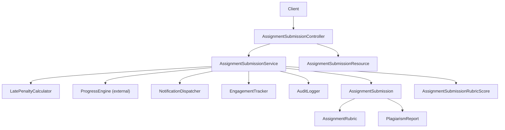
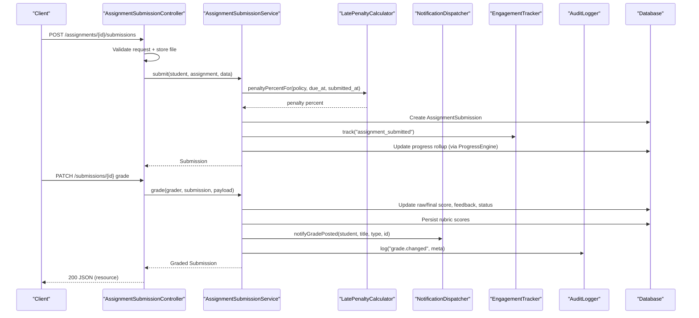
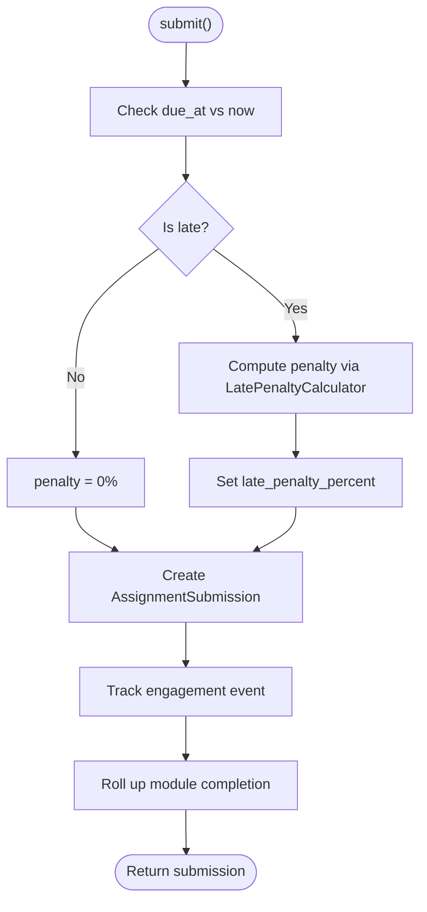
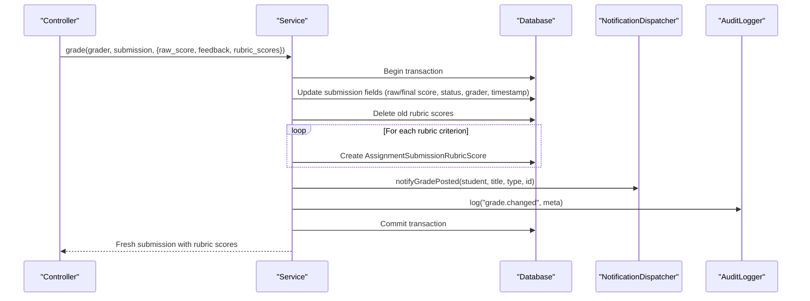
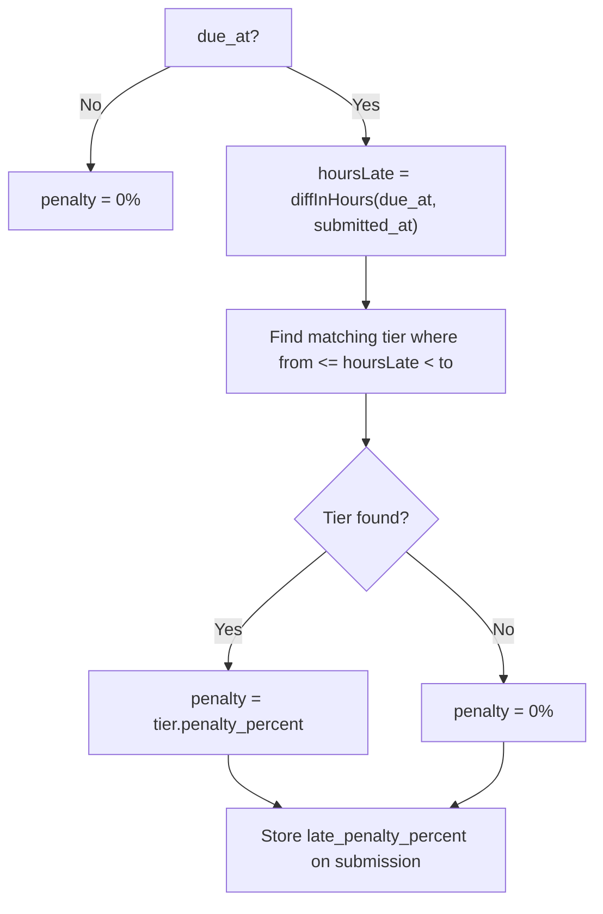
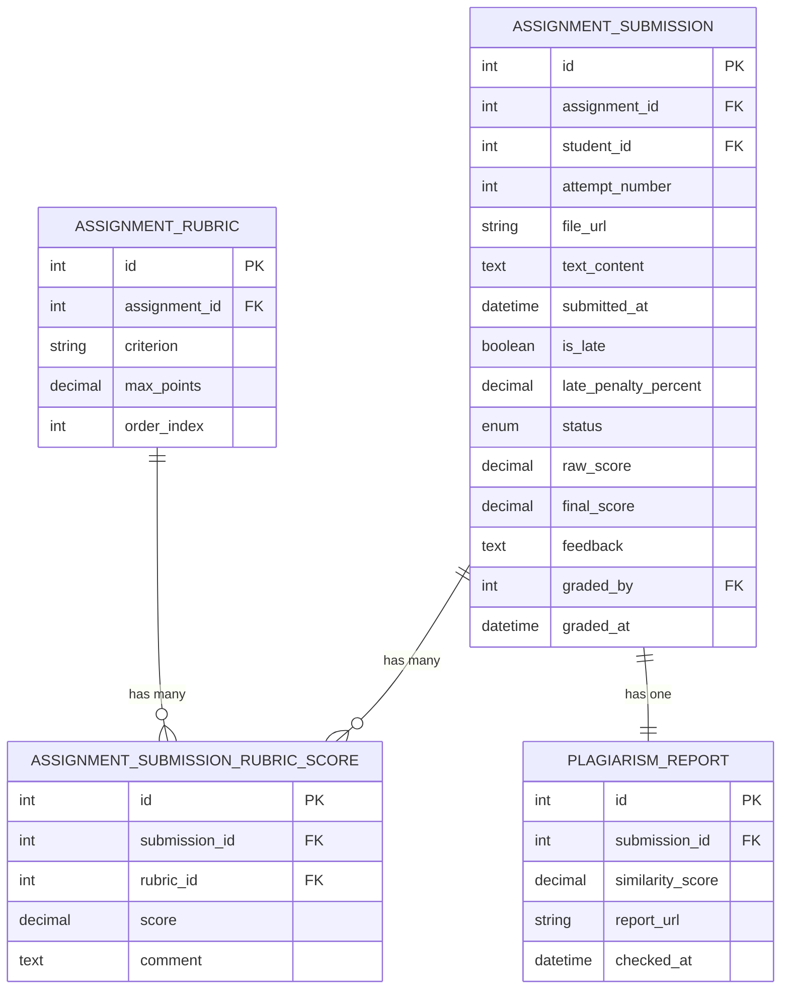
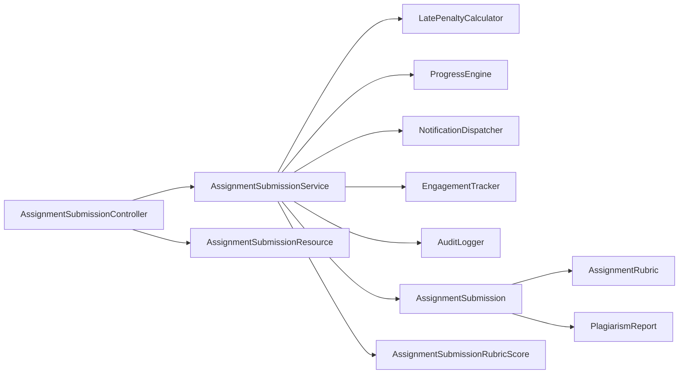

# Assignment Submission Service

<cite>
**Referenced Files in This Document**
- [AssignmentSubmissionService.php](file://app/Services/Assessment/AssignmentSubmissionService.php)
- [AssignmentSubmissionController.php](file://app/Http/Controllers/Api/V1/AssignmentSubmissionController.php)
- [AssignmentSubmission.php](file://app/Models/AssignmentSubmission.php)
- [AssignmentRubric.php](file://app/Models/AssignmentRubric.php)
- [AssignmentSubmissionRubricScore.php](file://app/Models/AssignmentSubmissionRubricScore.php)
- [LatePenaltyCalculator.php](file://app/Services/Assessment/LatePenaltyCalculator.php)
- [LatePenaltyPolicy.php](file://app/Models/LatePenaltyPolicy.php)
- [LatePenaltyTier.php](file://app/Models/LatePenaltyTier.php)
- [PlagiarismReport.php](file://app/Models/PlagiarismReport.php)
- [SubmissionStatus.php](file://app/Enums/SubmissionStatus.php)
- [EngagementTracker.php](file://app/Services/Analytics/EngagementTracker.php)
- [NotificationDispatcher.php](file://app/Services/Notifications/NotificationDispatcher.php)
- [AuditLogger.php](file://app/Services/Audit/AuditLogger.php)
- [AssignmentSubmissionResource.php](file://app/Http/Resources/AssignmentSubmissionResource.php)
- [AssignmentSubmissionRubricScoreResource.php](file://app/Http/Resources/AssignmentSubmissionRubricScoreResource.php)
</cite>

## Table of Contents
1. Introduction
2. Project Structure
3. Core Components
4. Architecture Overview
5. Detailed Component Analysis
6. Dependency Analysis
7. Performance Considerations
8. Troubleshooting Guide
9. Conclusion

## Introduction
This document explains the AssignmentSubmissionService and its role in managing student assignment submissions and grading workflows. It covers how submissions are created, validated at the controller layer, processed through late penalty calculation, graded with rubric-based scoring, and integrated with notifications, analytics, and audit logging. It also documents the data model relationships for rubrics and plagiarism reports, and provides diagrams to visualize key flows.

## Project Structure
The submission workflow spans controllers, services, models, resources, and supporting services:
- API entry points live in the V1 controller for assignments and submissions.
- Business logic is encapsulated in the AssignmentSubmissionService.
- Data persistence and relationships are modeled by Eloquent models.
- Late penalties are computed via a dedicated calculator using policy/tier configuration.
- Notifications, analytics, and audits are handled by specialized services.
- JSON responses are shaped by resource classes.

**Diagram sources**
- [AssignmentSubmissionController.php:19-58](file://app/Http/Controllers/Api/V1/AssignmentSubmissionController.php#L19-L58)
- [AssignmentSubmissionService.php:24-115](file://app/Services/Assessment/AssignmentSubmissionService.php#L24-L115)
- [LatePenaltyCalculator.php:15-34](file://app/Services/Assessment/LatePenaltyCalculator.php#L15-L34)
- [AssignmentSubmission.php:15-87](file://app/Models/AssignmentSubmission.php#L15-L87)
- [AssignmentRubric.php:13-45](file://app/Models/AssignmentRubric.php#L13-L45)
- [AssignmentSubmissionRubricScore.php:10-39](file://app/Models/AssignmentSubmissionRubricScore.php#L10-L39)
- [PlagiarismReport.php:10-32](file://app/Models/PlagiarismReport.php#L10-L32)
- [AssignmentSubmissionResource.php:11-35](file://app/Http/Resources/AssignmentSubmissionResource.php#L11-L35)

**Section sources**
- [AssignmentSubmissionController.php:19-58](file://app/Http/Controllers/Api/V1/AssignmentSubmissionController.php#L19-L58)
- [AssignmentSubmissionService.php:24-115](file://app/Services/Assessment/AssignmentSubmissionService.php#L24-L115)

## Core Components
- AssignmentSubmissionService: Orchestrates submission creation and grading, including late penalty computation, status transitions, rubric score persistence, notifications, analytics, and auditing.
- LatePenaltyCalculator: Determines penalty percentage based on configured policies and tiers relative to due time.
- Models: AssignmentSubmission, AssignmentRubric, AssignmentSubmissionRubricScore, PlagiarismReport define the data structures and relationships.
- Controller: AssignmentSubmissionController handles HTTP requests, authorization, file storage integration, and delegates to the service.
- Resources: Shape JSON responses for submissions and rubric scores.
- Supporting Services: NotificationDispatcher, EngagementTracker, AuditLogger provide cross-cutting concerns.

**Section sources**
- [AssignmentSubmissionService.php:24-115](file://app/Services/Assessment/AssignmentSubmissionService.php#L24-L115)
- [LatePenaltyCalculator.php:15-34](file://app/Services/Assessment/LatePenaltyCalculator.php#L15-L34)
- [AssignmentSubmission.php:15-87](file://app/Models/AssignmentSubmission.php#L15-L87)
- [AssignmentRubric.php:13-45](file://app/Models/AssignmentRubric.php#L13-L45)
- [AssignmentSubmissionRubricScore.php:10-39](file://app/Models/AssignmentSubmissionRubricScore.php#L10-L39)
- [PlagiarismReport.php:10-32](file://app/Models/PlagiarismReport.php#L10-L32)
- [AssignmentSubmissionController.php:19-58](file://app/Http/Controllers/Api/V1/AssignmentSubmissionController.php#L19-L58)
- [AssignmentSubmissionResource.php:11-35](file://app/Http/Resources/AssignmentSubmissionResource.php#L11-L35)
- [AssignmentSubmissionRubricScoreResource.php:10-22](file://app/Http/Resources/AssignmentSubmissionRubricScoreResource.php#L10-L22)

## Architecture Overview
The system follows a layered approach:
- Presentation: API controller validates input, manages files, and returns resources.
- Domain: Service encapsulates business rules for submission and grading.
- Infrastructure: Models persist data; supporting services handle notifications, analytics, and audits.
- External integrations: Progress engine updates module completion upon submission; optional plagiarism report association exists at the model level.

**Diagram sources**
- [AssignmentSubmissionController.php:26-58](file://app/Http/Controllers/Api/V1/AssignmentSubmissionController.php#L26-L58)
- [AssignmentSubmissionService.php:37-115](file://app/Services/Assessment/AssignmentSubmissionService.php#L37-L115)
- [LatePenaltyCalculator.php:17-34](file://app/Services/Assessment/LatePenaltyCalculator.php#L17-L34)
- [NotificationDispatcher.php:158-172](file://app/Services/Notifications/NotificationDispatcher.php#L158-L172)
- [EngagementTracker.php:23-34](file://app/Services/Analytics/EngagementTracker.php#L23-L34)
- [AuditLogger.php:15-27](file://app/Services/Audit/AuditLogger.php#L15-L27)

## Detailed Component Analysis

### Submission Creation Flow
- Input validation and file handling occur in the controller before delegating to the service.
- The service computes whether the submission is late and calculates the penalty percentage using the late penalty policy and tiers.
- A new submission record is created with attempt numbering, content, timestamps, and initial status.
- Analytics event tracking is recorded for engagement metrics.
- Module completion is rolled up immediately upon submission per design.

**Diagram sources**
- [AssignmentSubmissionService.php:37-67](file://app/Services/Assessment/AssignmentSubmissionService.php#L37-L67)
- [LatePenaltyCalculator.php:17-34](file://app/Services/Assessment/LatePenaltyCalculator.php#L17-L34)

**Section sources**
- [AssignmentSubmissionController.php:38-50](file://app/Http/Controllers/Api/V1/AssignmentSubmissionController.php#L38-L50)
- [AssignmentSubmissionService.php:37-67](file://app/Services/Assessment/AssignmentSubmissionService.php#L37-L67)
- [EngagementTracker.php:23-34](file://app/Services/Analytics/EngagementTracker.php#L23-L34)

### Grading Workflow and Rubric-Based Scoring
- The controller authorizes and validates grading input, then calls the service.
- The service updates the submission with raw score, final score (after applying late penalty), feedback, grader identity, and timestamp.
- Existing rubric scores are deleted and replaced with the provided rubric criteria evaluations.
- A notification is dispatched to the student that their grade is ready.
- An audit log entry records the grade change with relevant metadata.

**Diagram sources**
- [AssignmentSubmissionService.php:72-115](file://app/Services/Assessment/AssignmentSubmissionService.php#L72-L115)
- [NotificationDispatcher.php:158-172](file://app/Services/Notifications/NotificationDispatcher.php#L158-L172)
- [AuditLogger.php:15-27](file://app/Services/Audit/AuditLogger.php#L15-L27)

**Section sources**
- [AssignmentSubmissionController.php:52-57](file://app/Http/Controllers/Api/V1/AssignmentSubmissionController.php#L52-L57)
- [AssignmentSubmissionService.php:72-115](file://app/Services/Assessment/AssignmentSubmissionService.php#L72-L115)

### Late Penalty Application
- Late penalty is determined by comparing submission time to the assignment due date.
- If late, the LatePenaltyCalculator selects the applicable tier from the assignment’s policy based on hours late and returns the corresponding penalty percentage.
- The penalty percentage is stored on the submission and used to compute the final score during grading.

**Diagram sources**
- [LatePenaltyCalculator.php:17-34](file://app/Services/Assessment/LatePenaltyCalculator.php#L17-L34)
- [LatePenaltyPolicy.php:23-36](file://app/Models/LatePenaltyPolicy.php#L23-L36)
- [LatePenaltyTier.php:19-28](file://app/Models/LatePenaltyTier.php#L19-L28)

**Section sources**
- [AssignmentSubmissionService.php:39-43](file://app/Services/Assessment/AssignmentSubmissionService.php#L39-L43)
- [LatePenaltyCalculator.php:17-34](file://app/Services/Assessment/LatePenaltyCalculator.php#L17-L34)

### Rubric Model Relationships and Aggregation
- AssignmentRubric defines criteria with max_points and ordering.
- AssignmentSubmissionRubricScore links a submission to a rubric criterion with an evaluated score and optional comment.
- AssignmentSubmission holds many rubric scores and exposes them via a relationship.
- Aggregation into a final score is performed by the service using the raw score and late penalty; rubric scores are persisted alongside but not summed by the service.

**Diagram sources**
- [AssignmentSubmission.php:22-87](file://app/Models/AssignmentSubmission.php#L22-L87)
- [AssignmentRubric.php:20-45](file://app/Models/AssignmentRubric.php#L20-L45)
- [AssignmentSubmissionRubricScore.php:14-39](file://app/Models/AssignmentSubmissionRubricScore.php#L14-L39)
- [PlagiarismReport.php:14-32](file://app/Models/PlagiarismReport.php#L14-L32)

**Section sources**
- [AssignmentSubmission.php:73-87](file://app/Models/AssignmentSubmission.php#L73-L87)
- [AssignmentRubric.php:31-45](file://app/Models/AssignmentRubric.php#L31-L45)
- [AssignmentSubmissionRubricScore.php:25-39](file://app/Models/AssignmentSubmissionRubricScore.php#L25-L39)

### Integration Points
- Progress Engine: Module completion is rolled up immediately upon submission, independent of grading.
- Notifications: Students receive an in-app notification when a grade is posted.
- Analytics: An engagement event is recorded when a submission is made.
- Auditing: Grade changes are logged with actor and metadata.
- Plagiarism Reports: A one-to-one relationship exists between submissions and plagiarism reports for future or external processing.

**Section sources**
- [AssignmentSubmissionService.php:62-65](file://app/Services/Assessment/AssignmentSubmissionService.php#L62-L65)
- [AssignmentSubmissionService.php:98-111](file://app/Services/Assessment/AssignmentSubmissionService.php#L98-L111)
- [EngagementTracker.php:23-34](file://app/Services/Analytics/EngagementTracker.php#L23-L34)
- [NotificationDispatcher.php:158-172](file://app/Services/Notifications/NotificationDispatcher.php#L158-L172)
- [AuditLogger.php:15-27](file://app/Services/Audit/AuditLogger.php#L15-L27)
- [AssignmentSubmission.php:81-87](file://app/Models/AssignmentSubmission.php#L81-L87)

## Dependency Analysis
- AssignmentSubmissionService depends on:
  - LatePenaltyCalculator for penalty computation.
  - ProgressEngine for module completion rollup.
  - NotificationDispatcher for notifying students about grades.
  - EngagementTracker for analytics events.
  - AuditLogger for audit trails.
  - Eloquent models for persistence.
- Controller depends on:
  - Request validators and media storage service.
  - Resource classes for response shaping.
- Models depend on:
  - Related entities (Assignment, User, Rubric, PlagiarismReport).

**Diagram sources**
- [AssignmentSubmissionService.php:24-32](file://app/Services/Assessment/AssignmentSubmissionService.php#L24-L32)
- [AssignmentSubmissionController.php:19-24](file://app/Http/Controllers/Api/V1/AssignmentSubmissionController.php#L19-L24)
- [AssignmentSubmission.php:52-87](file://app/Models/AssignmentSubmission.php#L52-L87)

**Section sources**
- [AssignmentSubmissionService.php:24-32](file://app/Services/Assessment/AssignmentSubmissionService.php#L24-L32)
- [AssignmentSubmissionController.php:19-24](file://app/Http/Controllers/Api/V1/AssignmentSubmissionController.php#L19-L24)

## Performance Considerations
- Database transactions: Grading uses a single transaction to ensure consistency when updating scores and rubric entries.
- Minimal queries: Attempt number calculation uses a simple aggregation query scoped to assignment and student.
- Efficient updates: Rubric scores are cleared and re-inserted in a loop; consider batching if large numbers of criteria exist.
- Avoid N+1: When listing submissions, eager loading of student and rubric scores is used to reduce queries.

[No sources needed since this section provides general guidance]

## Troubleshooting Guide
- Late penalty not applied:
  - Verify assignment has a due date and a valid late penalty policy with appropriate tiers.
  - Confirm submission time is after due time and the calculator finds a matching tier.
- Final score mismatch:
  - Ensure raw score and late penalty percent are set correctly; final score is derived from these values.
- Missing rubric scores:
  - Confirm rubric_scores array is included in grading payload and matches rubric IDs.
- No notification received:
  - Check that notifyGradePosted is invoked and related entity references are correct.
- Audit logs missing:
  - Ensure audit logger is called with proper action, entity type, and actor ID.

**Section sources**
- [LatePenaltyCalculator.php:17-34](file://app/Services/Assessment/LatePenaltyCalculator.php#L17-L34)
- [AssignmentSubmissionService.php:72-115](file://app/Services/Assessment/AssignmentSubmissionService.php#L72-L115)
- [NotificationDispatcher.php:158-172](file://app/Services/Notifications/NotificationDispatcher.php#L158-L172)
- [AuditLogger.php:15-27](file://app/Services/Audit/AuditLogger.php#L15-L27)

## Conclusion
The AssignmentSubmissionService centralizes assignment submission and grading logic, integrating late penalty calculations, rubric-based evaluation, notifications, analytics, and auditing. Its design separates concerns across controllers, services, models, and supporting services, enabling clear workflows and extensibility. While plagiarism detection is represented by a model relationship, automated scoring beyond rubric entries is not implemented within the service.

[No sources needed since this section summarizes without analyzing specific files]