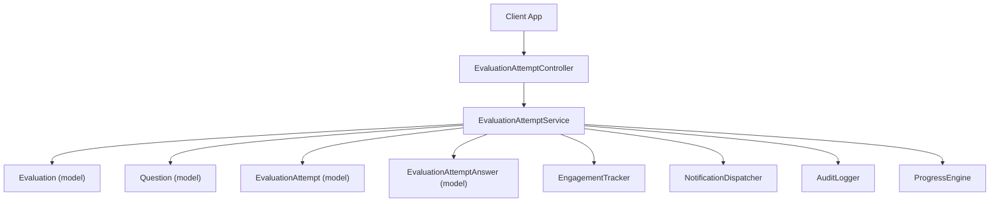
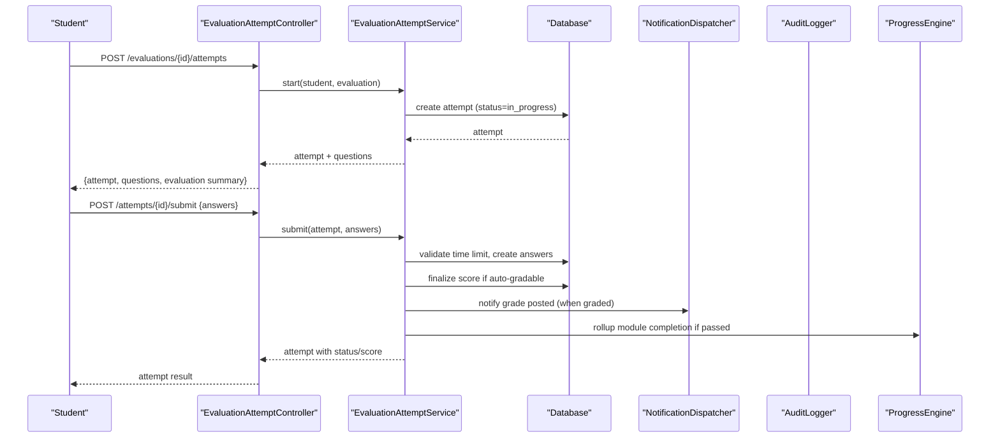
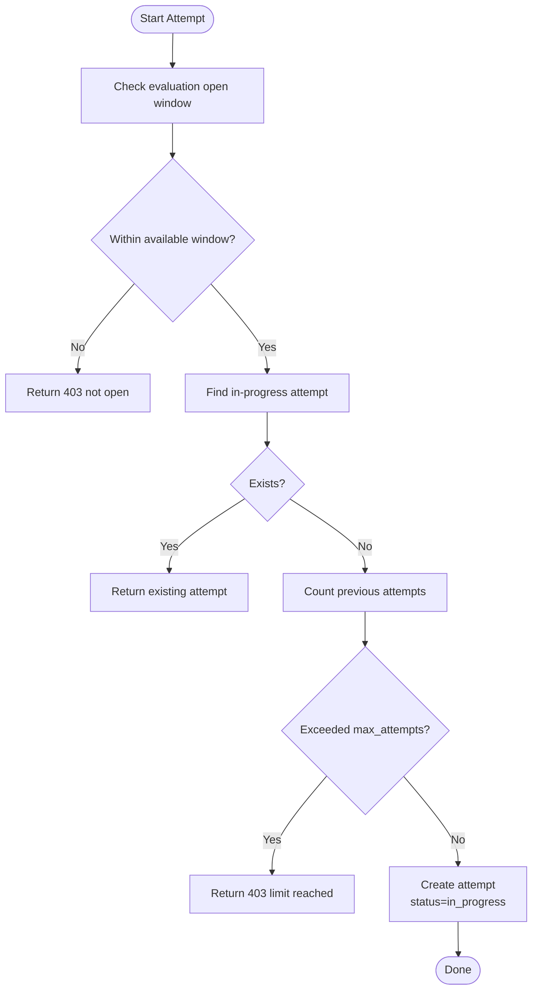
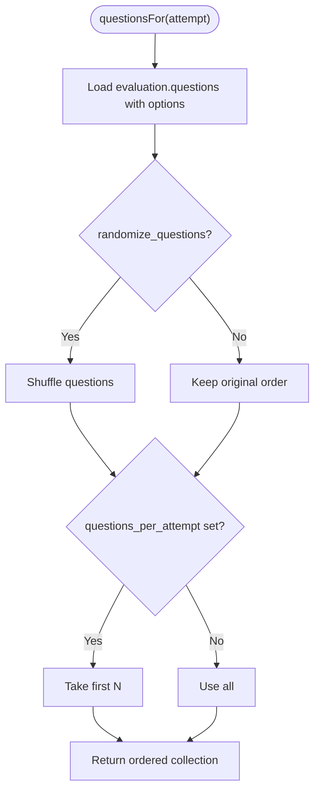
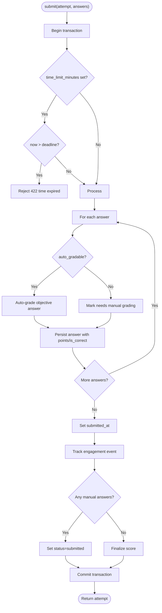
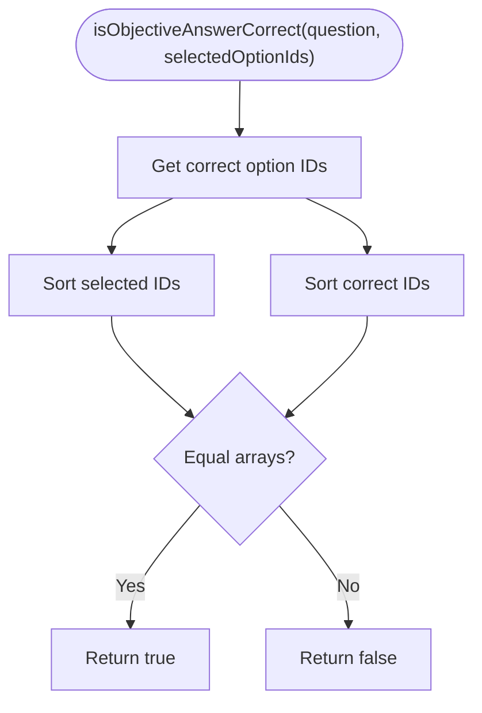
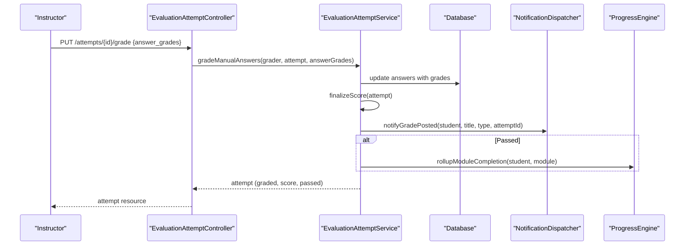
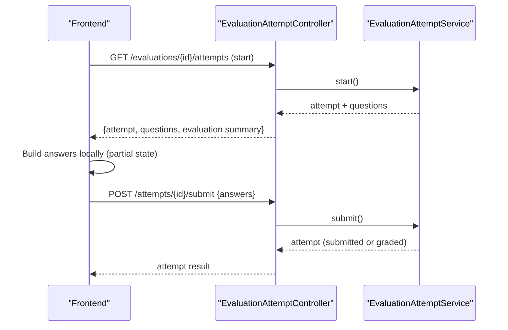
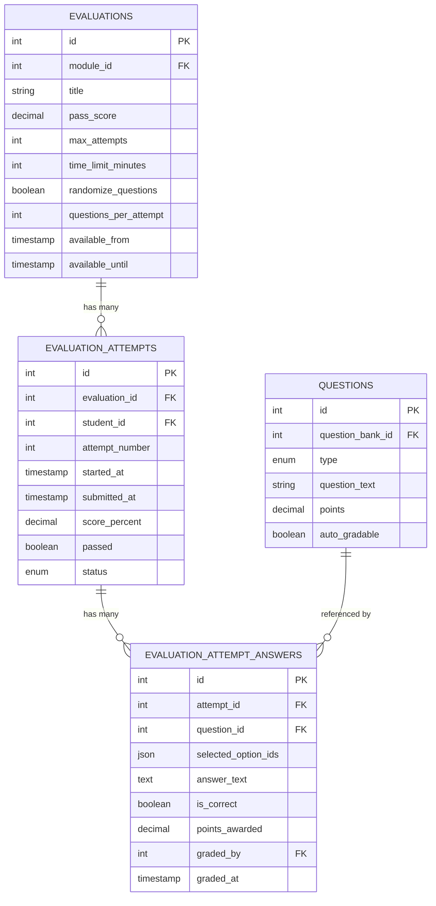
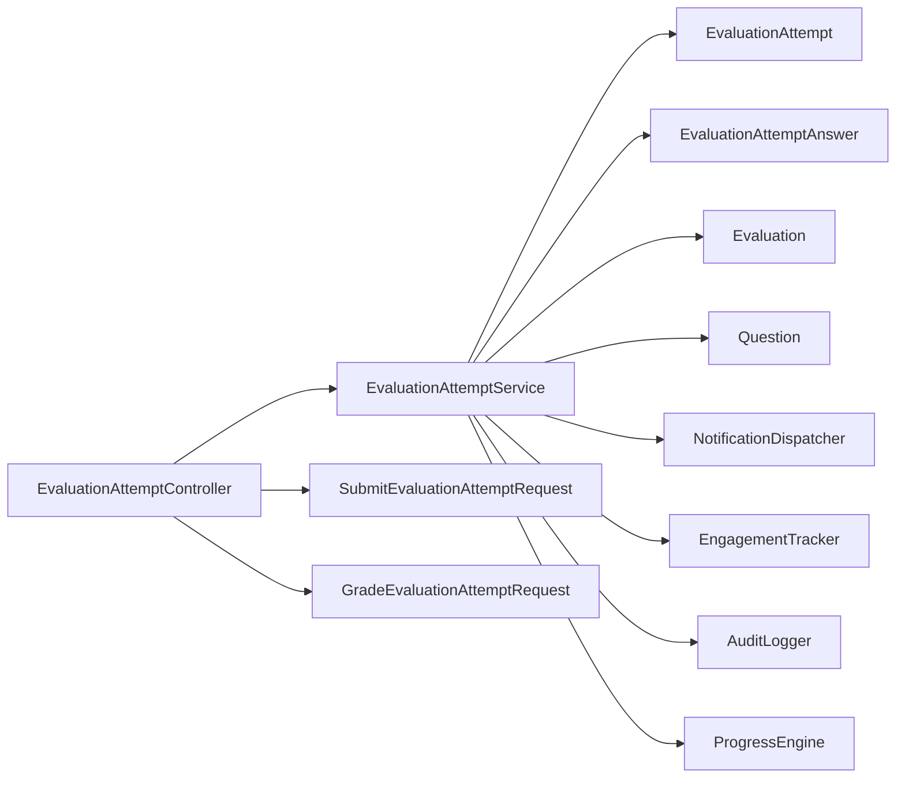

# Evaluation Attempt Service

<cite>
**Referenced Files in This Document**
- [EvaluationAttemptService.php](file://app/Services/Assessment/EvaluationAttemptService.php)
- [EvaluationAttemptController.php](file://app/Http/Controllers/Api/V1/EvaluationAttemptController.php)
- [EvaluationAttempt.php](file://app/Models/EvaluationAttempt.php)
- [EvaluationAttemptAnswer.php](file://app/Models/EvaluationAttemptAnswer.php)
- [Evaluation.php](file://app/Models/Evaluation.php)
- [Question.php](file://app/Models/Question.php)
- [EvaluationAttemptStatus.php](file://app/Enums/EvaluationAttemptStatus.php)
- [SubmitEvaluationAttemptRequest.php](file://app/Http/Requests/Api/V1/SubmitEvaluationAttemptRequest.php)
- [GradeEvaluationAttemptRequest.php](file://app/Http/Requests/Api/V1/GradeEvaluationAttemptRequest.php)
- [EvaluationAttemptPolicy.php](file://app/Policies/EvaluationAttemptPolicy.php)
- [2024_01_01_000145_create_evaluation_attempts_table.php](file://database/migrations/2024_01_01_000145_create_evaluation_attempts_table.php)
- [2024_01_01_000146_create_evaluation_attempt_answers_table.php](file://database/migrations/2024_01_01_000146_create_evaluation_attempt_answers_table.php)
- [EvaluationAttemptTest.php](file://tests/Feature/Assessment/EvaluationAttemptTest.php)
</cite>

## Table of Contents
1. Introduction
2. Project Structure
3. Core Components
4. Architecture Overview
5. Detailed Component Analysis
6. Dependency Analysis
7. Performance Considerations
8. Troubleshooting Guide
9. Conclusion

## Introduction
This document explains how the EvaluationAttemptService manages student evaluation attempts and answer tracking across the system. It covers attempt initiation, real-time answer recording and validation, completion and grading flows, time limits, attempt restrictions, and anti-cheating safeguards. It also documents partial answer saving via the frontend workflow and how module completion is updated when a student passes.

## Project Structure
The evaluation attempt feature spans controllers, services, models, requests, policies, migrations, and tests:
- Controller exposes REST endpoints to start, view, submit, and grade attempts.
- Service encapsulates business logic for starting attempts, validating answers, scoring, and finalizing results.
- Models represent attempts, answers, evaluations, and questions with relationships and casts.
- Requests enforce input validation and authorization for submission and grading.
- Policies restrict who can view or grade attempts.
- Migrations define database schema for attempts and answers.
- Tests validate auto-grading, pass/fail behavior, attempt limits, and security constraints.

**Diagram sources**
- [EvaluationAttemptController.php:20-82](file://app/Http/Controllers/Api/V1/EvaluationAttemptController.php#L20-L82)
- [EvaluationAttemptService.php:28-206](file://app/Services/Assessment/EvaluationAttemptService.php#L28-L206)

**Section sources**
- [EvaluationAttemptController.php:20-82](file://app/Http/Controllers/Api/V1/EvaluationAttemptController.php#L20-L82)
- [EvaluationAttemptService.php:28-206](file://app/Services/Assessment/EvaluationAttemptService.php#L28-L206)

## Core Components
- EvaluationAttemptService: Orchestrates attempt lifecycle, question selection, answer submission, manual grading, scoring, notifications, engagement tracking, audit logging, and progress rollup.
- EvaluationAttemptController: Authorizes and routes HTTP requests to service methods; returns resources that hide sensitive data like answer keys.
- Models: EvaluationAttempt, EvaluationAttemptAnswer, Evaluation, Question define entities and relationships used by the service.
- Requests: Validate inputs for submission and grading and enforce ownership/permissions.
- Policy: Controls who can view an attempt based on role and course context.
- Migrations: Define persistent state for attempts and answers including status, timestamps, scores, and grading metadata.

Key responsibilities:
- Start/resume attempts with availability checks and attempt limits.
- Provide question sets with optional randomization and subsetting.
- Submit answers with time limit enforcement, auto-grading for objective questions, and manual grading queue for text-based answers.
- Finalize scores, set pass/fail, update status, notify students, and mark module completion when passed.
- Support instructor grading of manual answers and log changes.

**Section sources**
- [EvaluationAttemptService.php:35-206](file://app/Services/Assessment/EvaluationAttemptService.php#L35-L206)
- [EvaluationAttemptController.php:27-82](file://app/Http/Controllers/Api/V1/EvaluationAttemptController.php#L27-L82)
- [EvaluationAttempt.php:14-63](file://app/Models/EvaluationAttempt.php#L14-L63)
- [EvaluationAttemptAnswer.php:10-55](file://app/Models/EvaluationAttemptAnswer.php#L10-L55)
- [Evaluation.php:14-62](file://app/Models/Evaluation.php#L14-L62)
- [Question.php:15-59](file://app/Models/Question.php#L15-L59)
- [EvaluationAttemptStatus.php:7-12](file://app/Enums/EvaluationAttemptStatus.php#L7-L12)
- [SubmitEvaluationAttemptRequest.php:11-31](file://app/Http/Requests/Api/V1/SubmitEvaluationAttemptRequest.php#L11-L31)
- [GradeEvaluationAttemptRequest.php:11-30](file://app/Http/Requests/Api/V1/GradeEvaluationAttemptRequest.php#L11-L30)
- [EvaluationAttemptPolicy.php:11-27](file://app/Policies/EvaluationAttemptPolicy.php#L11-L27)
- [2024_01_01_000145_create_evaluation_attempts_table.php:11-30](file://database/migrations/2024_01_01_000145_create_evaluation_attempts_table.php#L11-L30)
- [2024_01_01_000146_create_evaluation_attempt_answers_table.php:11-29](file://database/migrations/2024_01_01_000146_create_evaluation_attempt_answers_table.php#L11-L29)

## Architecture Overview
The controller delegates to the service for all core operations. The service uses Eloquent models to persist attempts and answers, enforces rules from the Evaluation configuration, and integrates with external services for notifications, analytics, auditing, and progress updates.

**Diagram sources**
- [EvaluationAttemptController.php:40-74](file://app/Http/Controllers/Api/V1/EvaluationAttemptController.php#L40-L74)
- [EvaluationAttemptService.php:35-206](file://app/Services/Assessment/EvaluationAttemptService.php#L35-L206)

## Detailed Component Analysis

### Attempt Initiation
- Availability checks: Enforces available_from and available_until windows.
- Resume support: Returns existing in-progress attempt if one exists for the same evaluation and student.
- Attempt limits: Counts prior attempts and blocks new ones if max_attempts reached.
- Creates attempt with incremented attempt_number, started_at timestamp, and status set to in_progress.

**Diagram sources**
- [EvaluationAttemptService.php:35-78](file://app/Services/Assessment/EvaluationAttemptService.php#L35-L78)

**Section sources**
- [EvaluationAttemptService.php:35-78](file://app/Services/Assessment/EvaluationAttemptService.php#L35-L78)

### Question Selection
- Loads questions linked to the evaluation with options.
- Optional randomization of question order per attempt.
- Optional subsetting to a configured number of questions per attempt.

**Diagram sources**
- [EvaluationAttemptService.php:83-97](file://app/Services/Assessment/EvaluationAttemptService.php#L83-L97)

**Section sources**
- [EvaluationAttemptService.php:83-97](file://app/Services/Assessment/EvaluationAttemptService.php#L83-L97)

### Answer Submission and Validation
- Validates request payload: ensures answers array, valid question IDs, option IDs, and optional text answers.
- Time limit enforcement: calculates deadline from attempt.started_at plus evaluation.time_limit_minutes and rejects late submissions.
- Per-answer processing:
  - For auto-gradable questions: compares selected options against correct options and awards points accordingly.
  - For non-auto-gradable questions: marks for manual grading and defers scoring until graded.
- Persists answers and records submitted_at.
- Tracks engagement event for quiz attempted.
- If any answer requires manual grading, sets status to submitted; otherwise finalizes score immediately.

**Diagram sources**
- [EvaluationAttemptService.php:102-149](file://app/Services/Assessment/EvaluationAttemptService.php#L102-L149)
- [SubmitEvaluationAttemptRequest.php:21-30](file://app/Http/Requests/Api/V1/SubmitEvaluationAttemptRequest.php#L21-L30)

**Section sources**
- [EvaluationAttemptService.php:102-149](file://app/Services/Assessment/EvaluationAttemptService.php#L102-L149)
- [SubmitEvaluationAttemptRequest.php:21-30](file://app/Http/Requests/Api/V1/SubmitEvaluationAttemptRequest.php#L21-L30)

### Objective Answer Correctness Logic
- Compares sorted selected option IDs with sorted correct option IDs for exact match.
- Ensures multi-select correctness only when all correct options are selected and no extras.

**Diagram sources**
- [EvaluationAttemptService.php:211-217](file://app/Services/Assessment/EvaluationAttemptService.php#L211-L217)

**Section sources**
- [EvaluationAttemptService.php:211-217](file://app/Services/Assessment/EvaluationAttemptService.php#L211-L217)

### Manual Grading and Finalization
- Instructor grades manual answers by updating is_correct, points_awarded, graded_by, and graded_at.
- After grading, finalizes score:
  - Computes total possible points and earned points.
  - Calculates score_percent and determines passed based on evaluation.pass_score.
  - Updates attempt status to graded and persists score/pass fields.
  - Notifies student about grade posting.
  - If passed, rolls up module completion via ProgressEngine.

**Diagram sources**
- [EvaluationAttemptController.php:77-82](file://app/Http/Controllers/Api/V1/EvaluationAttemptController.php#L77-L82)
- [EvaluationAttemptService.php:154-206](file://app/Services/Assessment/EvaluationAttemptService.php#L154-L206)

**Section sources**
- [EvaluationAttemptService.php:154-206](file://app/Services/Assessment/EvaluationAttemptService.php#L154-L206)
- [EvaluationAttemptController.php:77-82](file://app/Http/Controllers/Api/V1/EvaluationAttemptController.php#L77-L82)

### Real-Time Answer Tracking and Partial Saving
- Frontend maintains local answer state while the student answers questions.
- On submit, the client sends all collected answers at once; there is no server-side partial save endpoint in this implementation.
- Time countdown is enforced client-side and validated server-side upon submission.
- The controller returns a safe attempt summary without exposing answer keys to students.

**Diagram sources**
- [EvaluationAttemptController.php:40-74](file://app/Http/Controllers/Api/V1/EvaluationAttemptController.php#L40-L74)
- [EvaluationAttemptService.php:35-149](file://app/Services/Assessment/EvaluationAttemptService.php#L35-L149)

**Section sources**
- [EvaluationAttemptController.php:40-74](file://app/Http/Controllers/Api/V1/EvaluationAttemptController.php#L40-L74)
- [EvaluationAttemptService.php:35-149](file://app/Services/Assessment/EvaluationAttemptService.php#L35-L149)

### Data Model Relationships

**Diagram sources**
- [2024_01_01_000145_create_evaluation_attempts_table.php:11-30](file://database/migrations/2024_01_01_000145_create_evaluation_attempts_table.php#L11-L30)
- [2024_01_01_000146_create_evaluation_attempt_answers_table.php:11-29](file://database/migrations/2024_01_01_000146_create_evaluation_attempt_answers_table.php#L11-L29)
- [Evaluation.php:14-62](file://app/Models/Evaluation.php#L14-L62)
- [Question.php:15-59](file://app/Models/Question.php#L15-L59)
- [EvaluationAttempt.php:14-63](file://app/Models/EvaluationAttempt.php#L14-L63)
- [EvaluationAttemptAnswer.php:10-55](file://app/Models/EvaluationAttemptAnswer.php#L10-L55)

**Section sources**
- [2024_01_01_000145_create_evaluation_attempts_table.php:11-30](file://database/migrations/2024_01_01_000145_create_evaluation_attempts_table.php#L11-L30)
- [2024_01_01_000146_create_evaluation_attempt_answers_table.php:11-29](file://database/migrations/2024_01_01_000146_create_evaluation_attempt_answers_table.php#L11-L29)
- [Evaluation.php:14-62](file://app/Models/Evaluation.php#L14-L62)
- [Question.php:15-59](file://app/Models/Question.php#L15-L59)
- [EvaluationAttempt.php:14-63](file://app/Models/EvaluationAttempt.php#L14-L63)
- [EvaluationAttemptAnswer.php:10-55](file://app/Models/EvaluationAttemptAnswer.php#L10-L55)

## Dependency Analysis
- Controller depends on service for business logic and on request classes for validation and authorization.
- Service depends on models for persistence and on external services for notifications, analytics, auditing, and progress rollups.
- Policies gate access to view attempts; requests gate access to submit and grade.
- Migrations define the underlying schema ensuring referential integrity and indexing.

**Diagram sources**
- [EvaluationAttemptController.php:20-82](file://app/Http/Controllers/Api/V1/EvaluationAttemptController.php#L20-L82)
- [EvaluationAttemptService.php:28-206](file://app/Services/Assessment/EvaluationAttemptService.php#L28-L206)
- [SubmitEvaluationAttemptRequest.php:11-31](file://app/Http/Requests/Api/V1/SubmitEvaluationAttemptRequest.php#L11-L31)
- [GradeEvaluationAttemptRequest.php:11-30](file://app/Http/Requests/Api/V1/GradeEvaluationAttemptRequest.php#L11-L30)

**Section sources**
- [EvaluationAttemptController.php:20-82](file://app/Http/Controllers/Api/V1/EvaluationAttemptController.php#L20-L82)
- [EvaluationAttemptService.php:28-206](file://app/Services/Assessment/EvaluationAttemptService.php#L28-L206)
- [SubmitEvaluationAttemptRequest.php:11-31](file://app/Http/Requests/Api/V1/SubmitEvaluationAttemptRequest.php#L11-L31)
- [GradeEvaluationAttemptRequest.php:11-30](file://app/Http/Requests/Api/V1/GradeEvaluationAttemptRequest.php#L11-L30)

## Performance Considerations
- Batch operations: Answer creation and score finalization occur within a single database transaction to reduce round trips and ensure consistency.
- Efficient queries: Questions are loaded with options in a single eager load; sorting and slicing are performed in memory after retrieval.
- Indexing: Student index on attempts supports quick lookup for resuming in-progress attempts.
- Minimal exposure: Controllers return minimal data to clients, reducing payload size and preventing leakage of answer keys.

[No sources needed since this section provides general guidance]

## Troubleshooting Guide
Common issues and resolutions:
- Attempt blocked due to availability window: Ensure current time falls between available_from and available_until.
- Max attempts exceeded: Verify evaluation.max_attempts and count of prior attempts; adjust policy if needed.
- Late submission: Confirm time_limit_minutes and that submitted_at is recorded before deadline; client should prevent submission after expiry.
- Manual grading required: If any answer is non-auto-gradable, status will be submitted until an instructor grades it; check answer_grades payload format and permissions.
- Unauthorized actions: Ensure user roles and course associations satisfy EvaluationAttemptPolicy and request authorizations.

Validation and authorization references:
- Submission payload must include valid question IDs and option IDs; text answers are optional.
- Grading payload must reference existing answer IDs and provide numeric points_awarded; is_correct is optional for manual adjustments.
- View access is restricted to admins, the student themselves, or instructors teaching the course.

**Section sources**
- [EvaluationAttemptService.php:35-149](file://app/Services/Assessment/EvaluationAttemptService.php#L35-L149)
- [SubmitEvaluationAttemptRequest.php:21-30](file://app/Http/Requests/Api/V1/SubmitEvaluationAttemptRequest.php#L21-L30)
- [GradeEvaluationAttemptRequest.php:21-29](file://app/Http/Requests/Api/V1/GradeEvaluationAttemptRequest.php#L21-L29)
- [EvaluationAttemptPolicy.php:13-26](file://app/Policies/EvaluationAttemptPolicy.php#L13-L26)

## Conclusion
The EvaluationAttemptService provides a robust, secure, and extensible foundation for managing evaluation attempts. It enforces time limits and attempt restrictions, supports both automatic and manual grading, tracks engagement and audits changes, and integrates with progress systems to reflect student achievement. The controller layer ensures safe data exposure and clear separation of concerns, while models and migrations maintain consistent and efficient data storage.

[No sources needed since this section summarizes without analyzing specific files]