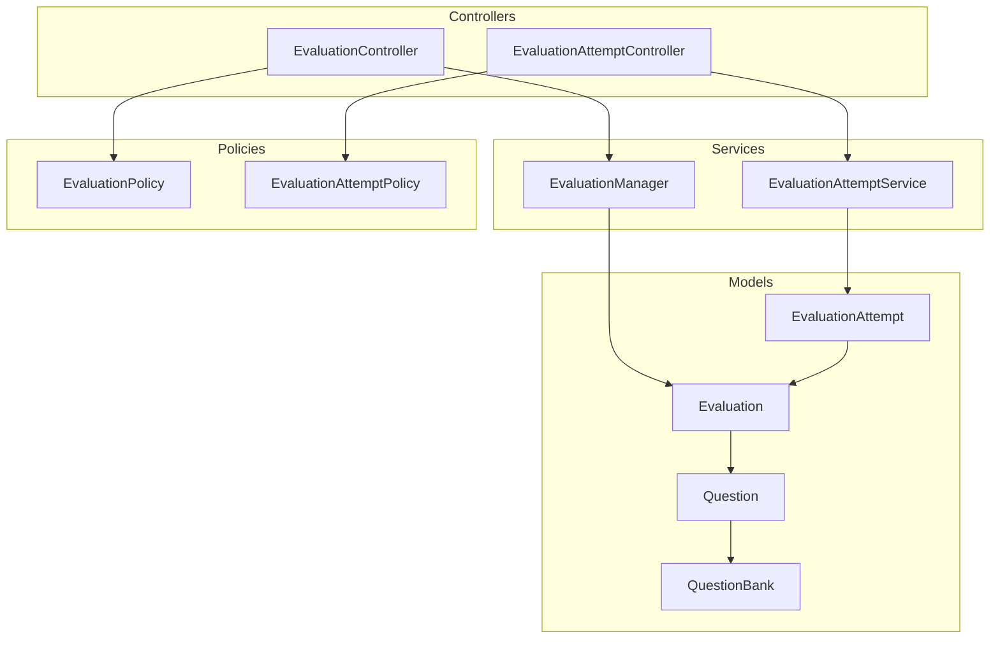
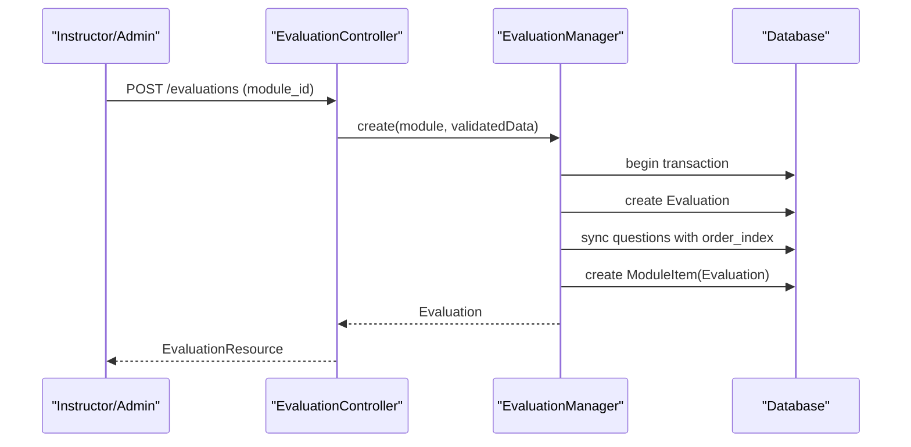
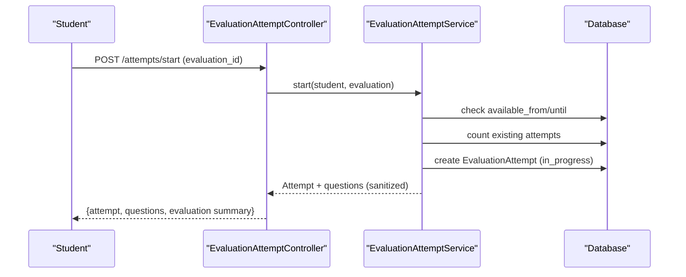
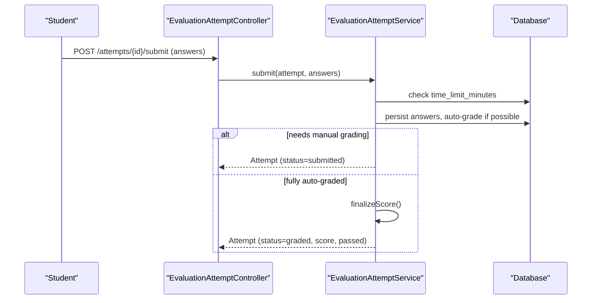
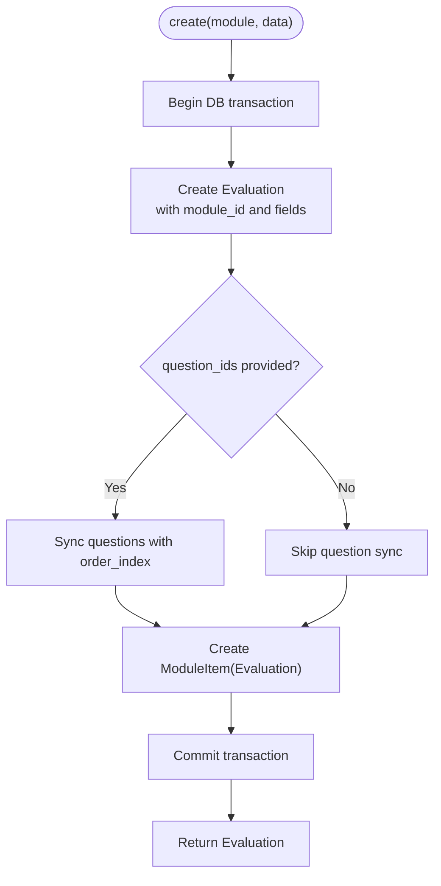
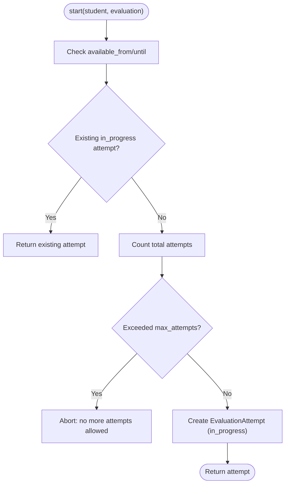
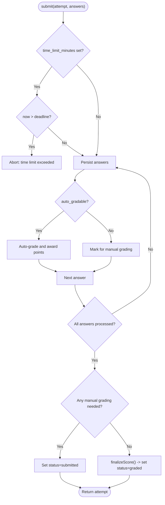
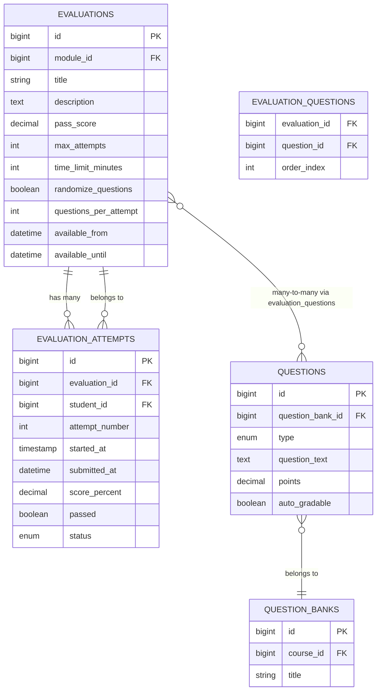
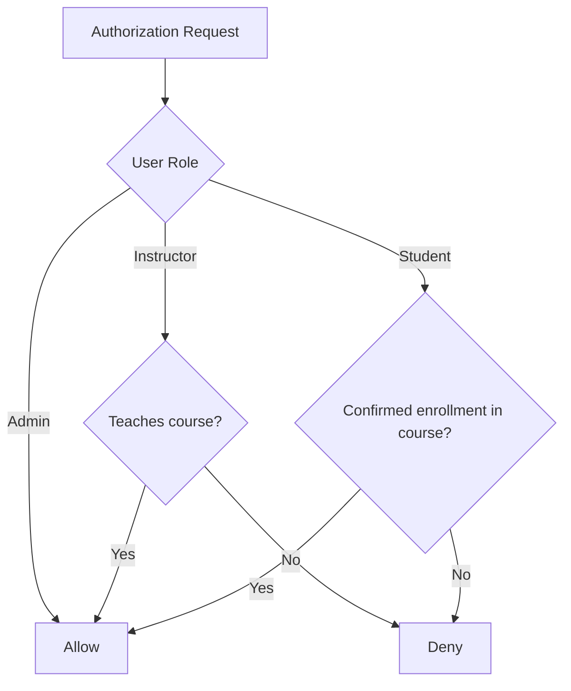
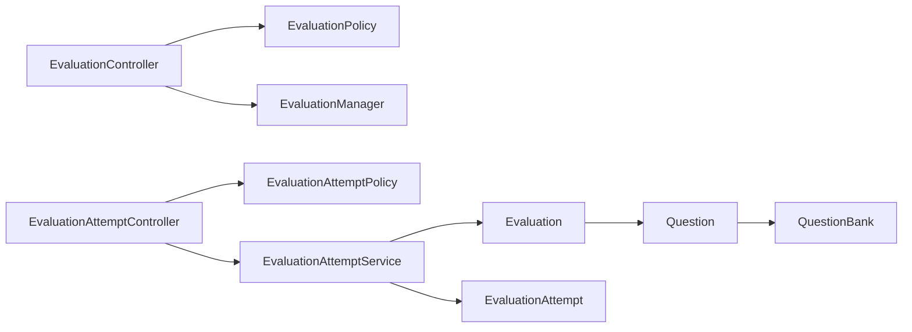

# Evaluation Manager

<cite>
**Referenced Files in This Document**
- [EvaluationManager.php](file://app/Services/Assessment/EvaluationManager.php)
- [EvaluationAttemptService.php](file://app\Services\Assessment\EvaluationAttemptService.php)
- [EvaluationController.php](file://app\Http\Controllers\Api\V1\EvaluationController.php)
- [EvaluationAttemptController.php](file://app\Http\Controllers\Api\V1\EvaluationAttemptController.php)
- [StoreEvaluationRequest.php](file://app\Http\Requests\Api\V1\StoreEvaluationRequest.php)
- [Evaluation.php](file://app\Models\Evaluation.php)
- [EvaluationAttempt.php](file://app\Models\EvaluationAttempt.php)
- [Question.php](file://app\Models\Question.php)
- [QuestionBank.php](file://app\Models\QuestionBank.php)
- [EvaluationPolicy.php](file://app\Policies\EvaluationPolicy.php)
- [EvaluationAttemptPolicy.php](file://app\Policies\EvaluationAttemptPolicy.php)
- [2024_01_01_000143_create_evaluations_table.php](file://database/migrations/2024_01_01_000143_create_evaluations_table.php)
- [2024_01_01_000145_create_evaluation_attempts_table.php](file://database/migrations/2024_01_01_000145_create_evaluation_attempts_table.php)
</cite>

## Table of Contents
1. Introduction
2. Project Structure
3. Core Components
4. Architecture Overview
5. Detailed Component Analysis
6. Dependency Analysis
7. Performance Considerations
8. Troubleshooting Guide
9. Conclusion

## Introduction
This document explains the Evaluation Manager service and its ecosystem for creating, configuring, publishing, and attempting evaluations (quizzes/tests). It covers how evaluations are linked to question banks, how questions are selected and randomized per attempt, and how business rules such as time limits, pass scores, and attempt restrictions are enforced. It also documents the end-to-end workflows for evaluation creation, question bank management, and student attempts including submission and grading.

## Project Structure
The evaluation feature spans controllers, services, models, policies, and database migrations:
- Controllers expose REST endpoints for managing evaluations and handling attempts.
- Services encapsulate business logic for evaluation lifecycle and attempt processing.
- Models define data structures and relationships between evaluations, attempts, questions, and question banks.
- Policies enforce authorization for viewing, editing, attempting, and grading evaluations.
- Migrations define the schema for evaluations and attempts.

**Diagram sources**
- [EvaluationController.php:1-50](file://app/Http/Controllers/Api/V1/EvaluationController.php#L1-L50)
- [EvaluationAttemptController.php:1-84](file://app/Http/Controllers/Api/V1/EvaluationAttemptController.php#L1-L84)
- [EvaluationManager.php:1-104](file://app/Services/Assessment/EvaluationManager.php#L1-L104)
- [EvaluationAttemptService.php:1-219](file://app/Services/Assessment/EvaluationAttemptService.php#L1-L219)
- [Evaluation.php:1-63](file://app/Models/Evaluation.php#L1-L63)
- [EvaluationAttempt.php:1-64](file://app/Models/EvaluationAttempt.php#L1-L64)
- [Question.php:1-60](file://app/Models/Question.php#L1-L60)
- [QuestionBank.php:1-41](file://app/Models/QuestionBank.php#L1-L41)
- [EvaluationPolicy.php:1-63](file://app/Policies/EvaluationPolicy.php#L1-L63)
- [EvaluationAttemptPolicy.php:1-28](file://app/Policies/EvaluationAttemptPolicy.php#L1-L28)

**Section sources**
- [EvaluationController.php:1-50](file://app/Http/Controllers/Api/V1/EvaluationController.php#L1-L50)
- [EvaluationAttemptController.php:1-84](file://app/Http/Controllers/Api/V1/EvaluationAttemptController.php#L1-L84)
- [EvaluationManager.php:1-104](file://app/Services/Assessment/EvaluationManager.php#L1-L104)
- [EvaluationAttemptService.php:1-219](file://app/Services/Assessment/EvaluationAttemptService.php#L1-L219)
- [Evaluation.php:1-63](file://app/Models/Evaluation.php#L1-L63)
- [EvaluationAttempt.php:1-64](file://app/Models/EvaluationAttempt.php#L1-L64)
- [Question.php:1-60](file://app/Models/Question.php#L1-L60)
- [QuestionBank.php:1-41](file://app/Models/QuestionBank.php#L1-L41)
- [EvaluationPolicy.php:1-63](file://app/Policies/EvaluationPolicy.php#L1-L63)
- [EvaluationAttemptPolicy.php:1-28](file://app/Policies/EvaluationAttemptPolicy.php#L1-L28)

## Core Components
- EvaluationManager: Creates, updates, and deletes evaluations within a module, and synchronizes linked questions with ordering.
- EvaluationAttemptService: Manages attempt lifecycle, enforces availability windows, attempt limits, time limits, randomization/subsetting, auto-grading, manual grading, scoring, and completion roll-up.
- Models: Evaluation, EvaluationAttempt, Question, QuestionBank define entities and relationships.
- Policies: Control who can create/view/update/delete evaluations, start attempts, and grade submissions.
- Requests: Validate inputs for creating evaluations.

Key responsibilities:
- Evaluation creation ties an Evaluation to a ModuleItem slot and persists linked questions with order.
- Attempt start validates availability and attempt limits; returns sanitized questions without answer keys.
- Submission enforces time limits, records answers, auto-grades objective questions, queues manual grading when needed, and finalizes scores.
- Randomization and subset selection occur at attempt time based on evaluation settings.

**Section sources**
- [EvaluationManager.php:1-104](file://app/Services/Assessment/EvaluationManager.php#L1-L104)
- [EvaluationAttemptService.php:1-219](file://app/Services/Assessment/EvaluationAttemptService.php#L1-L219)
- [Evaluation.php:1-63](file://app/Models/Evaluation.php#L1-L63)
- [EvaluationAttempt.php:1-64](file://app/Models/EvaluationAttempt.php#L1-L64)
- [Question.php:1-60](file://app/Models/Question.php#L1-L60)
- [QuestionBank.php:1-41](file://app/Models/QuestionBank.php#L1-L41)
- [EvaluationPolicy.php:1-63](file://app/Policies/EvaluationPolicy.php#L1-L63)
- [EvaluationAttemptPolicy.php:1-28](file://app/Policies/EvaluationAttemptPolicy.php#L1-L28)
- [StoreEvaluationRequest.php:1-37](file://app/Http/Requests/Api/V1/StoreEvaluationRequest.php#L1-L37)

## Architecture Overview
The system separates authoring from taking:
- Instructors/admins use EvaluationController to create/update/delete evaluations and view full details (including answer keys).
- Students use EvaluationAttemptController to start and submit attempts; they receive only safe question views without answer keys.
- Business rules are centralized in services; policies gate access by role and enrollment status.

**Diagram sources**
- [EvaluationController.php:20-32](file://app/Http/Controllers/Api/V1/EvaluationController.php#L20-L32)
- [EvaluationManager.php:28-49](file://app/Services/Assessment/EvaluationManager.php#L28-L49)
- [StoreEvaluationRequest.php:18-34](file://app/Http/Requests/Api/V1/StoreEvaluationRequest.php#L18-L34)

**Diagram sources**
- [EvaluationAttemptController.php:40-61](file://app/Http/Controllers/Api/V1/EvaluationAttemptController.php#L40-L61)
- [EvaluationAttemptService.php:35-78](file://app/Services/Assessment/EvaluationAttemptService.php#L35-L78)

**Diagram sources**
- [EvaluationAttemptController.php:70-75](file://app/Http/Controllers/Api/V1/EvaluationAttemptController.php#L70-L75)
- [EvaluationAttemptService.php:102-149](file://app/Services/Assessment/EvaluationAttemptService.php#L102-L149)
- [EvaluationAttemptService.php:183-206](file://app/Services/Assessment/EvaluationAttemptService.php#L183-L206)

## Detailed Component Analysis

### EvaluationManager
Responsibilities:
- Create: Persists an Evaluation within a Module, syncs linked questions with explicit order, and creates a corresponding ModuleItem slot.
- Update: Updates evaluation fields, optionally re-syncs questions, and adjusts ModuleItem properties like required flag and order.
- Delete: Removes the ModuleItem association and then deletes the Evaluation.
- Sync Questions: Uses a many-to-many pivot to store question order via order_index.

**Diagram sources**
- [EvaluationManager.php:28-49](file://app/Services/Assessment/EvaluationManager.php#L28-L49)
- [EvaluationManager.php:93-102](file://app/Services/Assessment/EvaluationManager.php#L93-L102)

**Section sources**
- [EvaluationManager.php:28-88](file://app/Services/Assessment/EvaluationManager.php#L28-L88)
- [EvaluationManager.php:93-102](file://app/Services/Assessment/EvaluationManager.php#L93-L102)

### EvaluationAttemptService
Responsibilities:
- Start: Validates availability window, prevents duplicate in-progress attempts, enforces max_attempts, and creates an attempt.
- Questions For: Loads evaluation questions with options, applies randomization and optional subset size.
- Submit: Enforces time limit, records answers, auto-grades objective questions, sets status to submitted or graded accordingly.
- Grade Manual Answers: Allows instructors to grade non-auto-gradable answers and finalize scoring.
- Finalize Score: Computes percentage, determines pass/fail, notifies students, and rolls up module completion on pass.

**Diagram sources**
- [EvaluationAttemptService.php:35-78](file://app/Services/Assessment/EvaluationAttemptService.php#L35-L78)

**Diagram sources**
- [EvaluationAttemptService.php:102-149](file://app/Services/Assessment/EvaluationAttemptService.php#L102-L149)
- [EvaluationAttemptService.php:183-206](file://app/Services/Assessment/EvaluationAttemptService.php#L183-L206)

**Section sources**
- [EvaluationAttemptService.php:35-78](file://app/Services/Assessment/EvaluationAttemptService.php#L35-L78)
- [EvaluationAttemptService.php:83-97](file://app/Services/Assessment/EvaluationAttemptService.php#L83-L97)
- [EvaluationAttemptService.php:102-149](file://app/Services/Assessment/EvaluationAttemptService.php#L102-L149)
- [EvaluationAttemptService.php:154-181](file://app/Services/Assessment/EvaluationAttemptService.php#L154-L181)
- [EvaluationAttemptService.php:183-206](file://app/Services/Assessment/EvaluationAttemptService.php#L183-L206)

### Models and Relationships
- Evaluation belongs to Module, has many Attempts, and links to Questions via a pivot that stores order_index.
- EvaluationAttempt belongs to Evaluation and User (student), has many Answers.
- Question belongs to QuestionBank and has many Options; it is linked to Evaluations through the same pivot.

**Diagram sources**
- [2024_01_01_000143_create_evaluations_table.php:11-26](file://database/migrations/2024_01_01_000143_create_evaluations_table.php#L11-L26)
- [2024_01_01_000145_create_evaluation_attempts_table.php:11-24](file://database/migrations/2024_01_01_000145_create_evaluation_attempts_table.php#L11-L24)
- [Evaluation.php:42-61](file://app/Models/Evaluation.php#L42-L61)
- [EvaluationAttempt.php:40-62](file://app/Models/EvaluationAttempt.php#L40-L62)
- [Question.php:36-58](file://app/Models/Question.php#L36-L58)
- [QuestionBank.php:25-39](file://app/Models/QuestionBank.php#L25-L39)

**Section sources**
- [Evaluation.php:19-61](file://app/Models/Evaluation.php#L19-L61)
- [EvaluationAttempt.php:21-62](file://app/Models/EvaluationAttempt.php#L21-L62)
- [Question.php:22-58](file://app/Models/Question.php#L22-L58)
- [QuestionBank.php:20-39](file://app/Models/QuestionBank.php#L20-L39)

### Authorization and Access Control
- EvaluationPolicy:
  - create/update/delete/view require instructor/admin rights over the evaluation’s course.
  - attempt requires the user to be a student with confirmed enrollment in the evaluation’s course.
- EvaluationAttemptPolicy:
  - view allows admin, the student who owns the attempt, or an instructor teaching the course.

**Diagram sources**
- [EvaluationPolicy.php:16-61](file://app/Policies/EvaluationPolicy.php#L16-L61)
- [EvaluationAttemptPolicy.php:13-26](file://app/Policies/EvaluationAttemptPolicy.php#L13-L26)

**Section sources**
- [EvaluationPolicy.php:16-61](file://app/Policies/EvaluationPolicy.php#L16-L61)
- [EvaluationAttemptPolicy.php:13-26](file://app/Policies/EvaluationAttemptPolicy.php#L13-L26)

## Dependency Analysis
- Controllers depend on Services for business logic and on Policies for authorization.
- Services depend on Models for persistence and on other services (e.g., ProgressEngine, NotificationDispatcher, EngagementTracker, AuditLogger) for side effects.
- Models define relationships that enable efficient loading of related data (questions, attempts, options).

**Diagram sources**
- [EvaluationController.php:1-50](file://app/Http/Controllers/Api/V1/EvaluationController.php#L1-L50)
- [EvaluationAttemptController.php:1-84](file://app/Http/Controllers/Api/V1/EvaluationAttemptController.php#L1-L84)
- [EvaluationManager.php:1-104](file://app/Services/Assessment/EvaluationManager.php#L1-L104)
- [EvaluationAttemptService.php:1-219](file://app/Services/Assessment/EvaluationAttemptService.php#L1-L219)
- [Evaluation.php:1-63](file://app/Models/Evaluation.php#L1-L63)
- [EvaluationAttempt.php:1-64](file://app/Models/EvaluationAttempt.php#L1-L64)
- [Question.php:1-60](file://app/Models/Question.php#L1-L60)
- [QuestionBank.php:1-41](file://app/Models/QuestionBank.php#L1-L41)
- [EvaluationPolicy.php:1-63](file://app/Policies/EvaluationPolicy.php#L1-L63)
- [EvaluationAttemptPolicy.php:1-28](file://app/Policies/EvaluationAttemptPolicy.php#L1-L28)

**Section sources**
- [EvaluationController.php:1-50](file://app/Http/Controllers/Api/V1/EvaluationController.php#L1-L50)
- [EvaluationAttemptController.php:1-84](file://app/Http/Controllers/Api/V1/EvaluationAttemptController.php#L1-L84)
- [EvaluationManager.php:1-104](file://app/Services/Assessment/EvaluationManager.php#L1-L104)
- [EvaluationAttemptService.php:1-219](file://app/Services/Assessment/EvaluationAttemptService.php#L1-L219)
- [Evaluation.php:1-63](file://app/Models/Evaluation.php#L1-L63)
- [EvaluationAttempt.php:1-64](file://app/Models/EvaluationAttempt.php#L1-L64)
- [Question.php:1-60](file://app/Models/Question.php#L1-L60)
- [QuestionBank.php:1-41](file://app/Models/QuestionBank.php#L1-L41)
- [EvaluationPolicy.php:1-63](file://app/Policies/EvaluationPolicy.php#L1-L63)
- [EvaluationAttemptPolicy.php:1-28](file://app/Policies/EvaluationAttemptPolicy.php#L1-L28)

## Performance Considerations
- Use eager loading for related data in read paths to reduce N+1 queries (e.g., load questions and options when serving evaluation details).
- Keep transactions short and focused around write operations (creation, update, submission) to minimize lock contention.
- Avoid unnecessary shuffling or large subsets when randomize_questions is disabled or when questions_per_attempt equals the total number of questions.
- Indexes on frequently filtered columns (e.g., student_id in attempts) improve query performance during attempt listing and validation.

[No sources needed since this section provides general guidance]

## Troubleshooting Guide
Common issues and resolutions:
- Cannot start evaluation before open date: Ensure current time is after available_from; otherwise the request is rejected.
- Cannot start evaluation after close date: Ensure current time is before available_until; otherwise the request is rejected.
- Max attempts reached: If max_attempts is set and the student has already used all attempts, starting a new attempt is blocked.
- Time limit exceeded on submit: If time_limit_minutes is configured and the attempt duration exceeds the limit, submission is rejected.
- Manual grading required: Non-auto-gradable questions result in status “submitted” until an instructor grades them; verify answer_grades were provided.
- Not authorized to view/edit: Confirm user role and enrollment status; instructors must teach the course, students must have confirmed enrollment.

**Section sources**
- [EvaluationAttemptService.php:35-78](file://app/Services/Assessment/EvaluationAttemptService.php#L35-L78)
- [EvaluationAttemptService.php:102-149](file://app/Services/Assessment/EvaluationAttemptService.php#L102-L149)
- [EvaluationPolicy.php:16-61](file://app/Policies/EvaluationPolicy.php#L16-L61)
- [EvaluationAttemptPolicy.php:13-26](file://app/Policies/EvaluationAttemptPolicy.php#L13-L26)

## Conclusion
The Evaluation Manager provides a robust framework for building assessments with flexible configuration, secure access control, and reliable attempt handling. Evaluations link to question banks via shared questions, enabling reuse and consistent content management. The system supports deterministic and randomized question selection, strict time and attempt controls, and both automatic and manual grading flows. Policies ensure that only authorized users can manage or take evaluations, while services centralize complex business logic for consistency and maintainability.