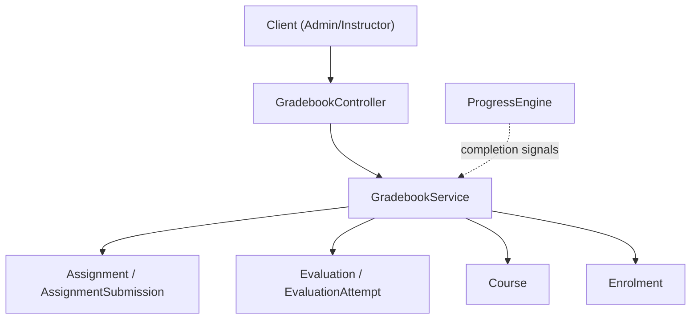
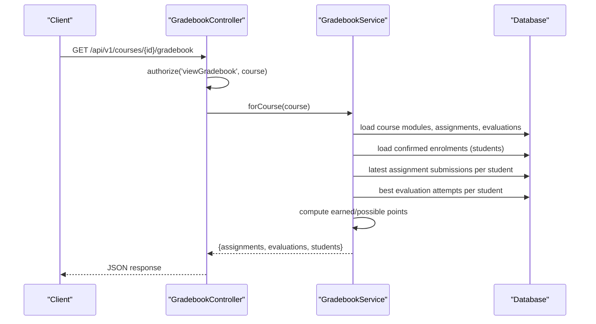
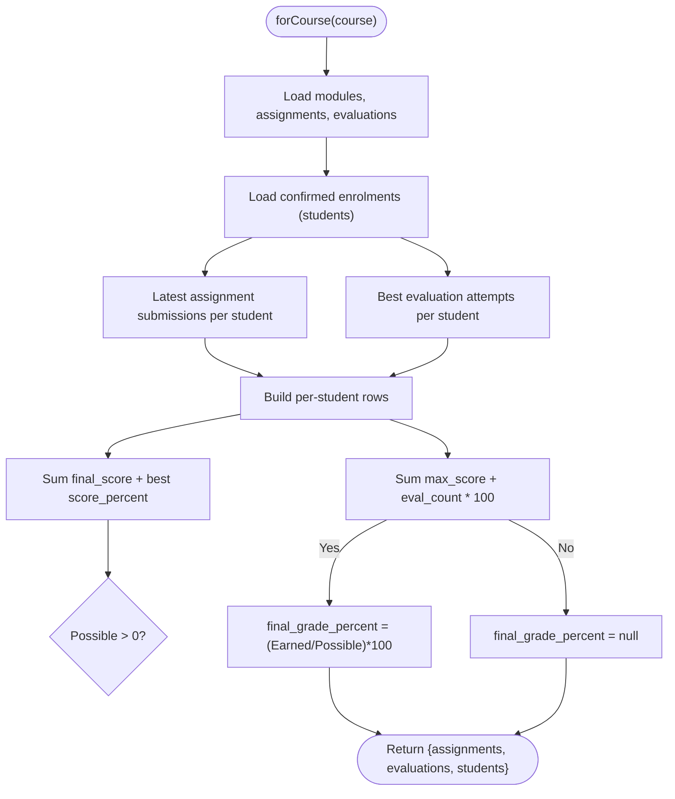
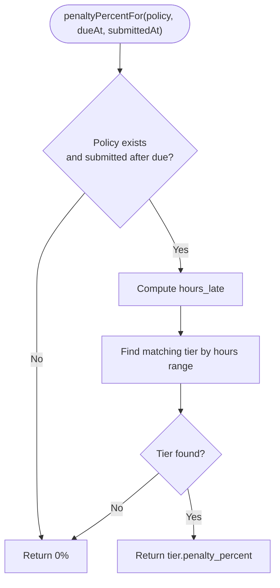
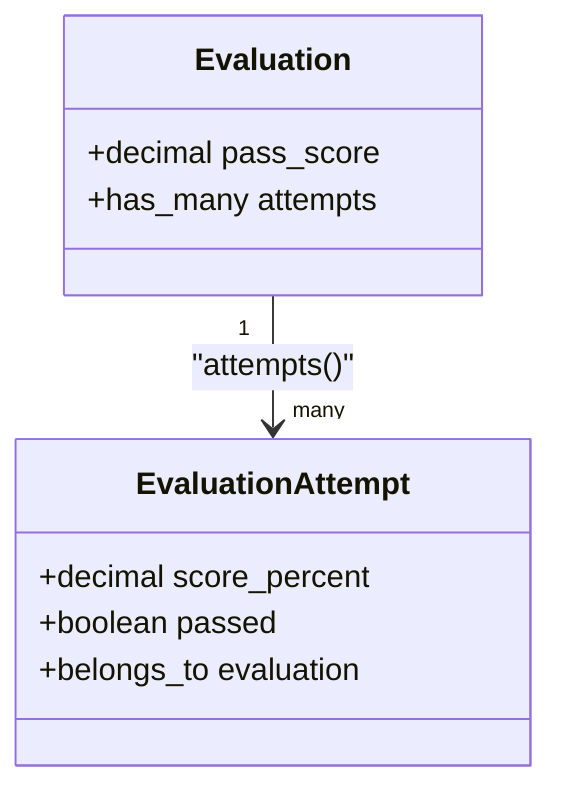
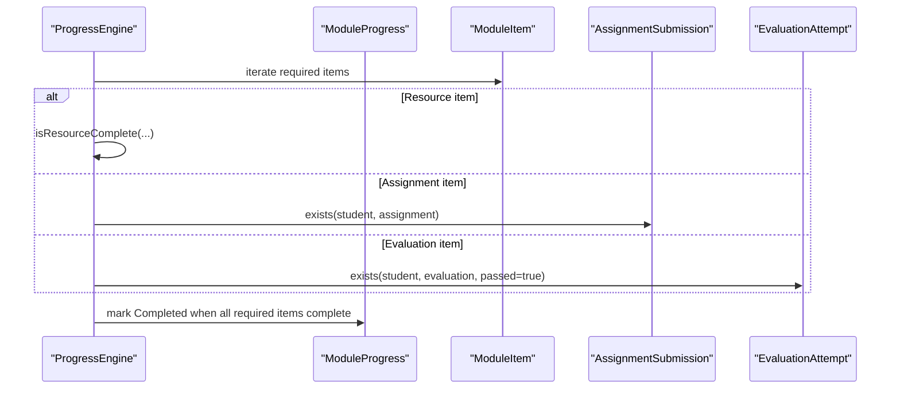
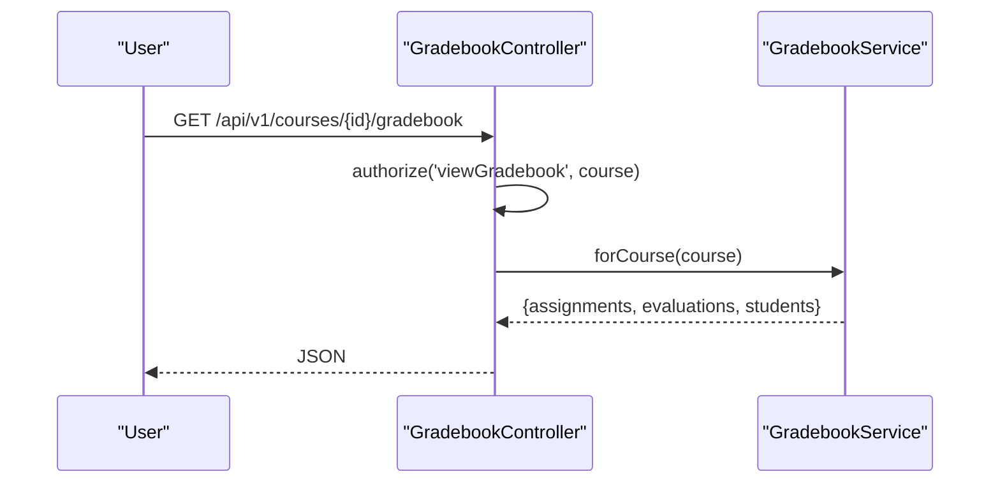
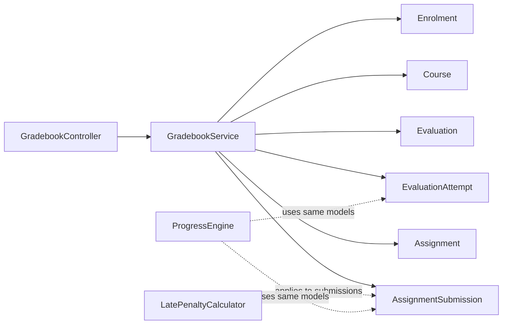

# Gradebook Service

<cite>
**Referenced Files in This Document**
- [GradebookService.php](file://app/Services/Assessment/GradebookService.php)
- [GradebookController.php](file://app/Http/Controllers/Api/V1/GradebookController.php)
- [Assignment.php](file://app/Models/Assignment.php)
- [AssignmentSubmission.php](file://app/Models/AssignmentSubmission.php)
- [Evaluation.php](file://app/Models/Evaluation.php)
- [EvaluationAttempt.php](file://app/Models/EvaluationAttempt.php)
- [LatePenaltyCalculator.php](file://app/Services/Assessment/LatePenaltyCalculator.php)
- [ProgressEngine.php](file://app/Services/Progress/ProgressEngine.php)
- [ModuleProgress.php](file://app/Models/ModuleProgress.php)
- [ResourceProgress.php](file://app/Models/ResourceProgress.php)
- [GradebookTest.php](file://tests/Feature/Assessment/GradebookTest.php)
</cite>

## Table of Contents
1. [Introduction](#introduction)
2. [Project Structure](#project-structure)
3. [Core Components](#core-components)
4. [Architecture Overview](#architecture-overview)
5. [Detailed Component Analysis](#detailed-component-analysis)
6. [Dependency Analysis](#dependency-analysis)
7. [Performance Considerations](#performance-considerations)
8. [Troubleshooting Guide](#troubleshooting-guide)
9. [Conclusion](#conclusion)

## Introduction
This document explains the GradebookService, which aggregates and calculates overall grades for students across all assessments within a course. It covers how grades are computed from assignments and evaluations, the weighting model used by the service, and how it integrates with module completion tracking and course performance metrics. It also provides examples of grade calculation workflows, weighted averages, and grade boundary definitions as implemented in the codebase.

## Project Structure
The gradebook feature is centered around:
- A controller that exposes an API endpoint to retrieve a course’s gradebook data.
- A service that computes per-student scores and final percentages.
- Models representing assignments, submissions, evaluations, and attempts.
- Supporting services for late penalties and progress tracking.

**Diagram sources**
- [GradebookController.php:16-21](file://app/Http/Controllers/Api/V1/GradebookController.php#L16-L21)
- [GradebookService.php:31-119](file://app/Services/Assessment/GradebookService.php#L31-L119)
- [ProgressEngine.php:120-167](file://app/Services/Progress/ProgressEngine.php#L120-L167)

**Section sources**
- [GradebookController.php:1-23](file://app/Http/Controllers/Api/V1/GradebookController.php#L1-L23)
- [GradebookService.php:1-121](file://app/Services/Assessment/GradebookService.php#L1-L121)

## Core Components
- GradebookController: Authorizes access and returns the gradebook payload via the service.
- GradebookService: Aggrades assignment and evaluation results per student and computes a final percentage using a simple additive weighting model.
- Assignment and AssignmentSubmission: Represent graded work with max_score and final_score fields.
- Evaluation and EvaluationAttempt: Represent quizzes/tests with score_percent and pass status.
- LatePenaltyCalculator: Computes late submission deductions applied before final_score is recorded.
- ProgressEngine: Tracks module/resource completion; assessment completion influences unlocking and certification but does not alter gradebook math directly.

Key responsibilities:
- Fetch modules under a course.
- Collect assignments and evaluations scoped to those modules.
- Identify confirmed enrolments (students).
- For each student, pick the latest assignment submission and best evaluation attempt.
- Compute earned vs possible points and derive final_grade_percent.

**Section sources**
- [GradebookController.php:16-21](file://app/Http/Controllers/Api/V1/GradebookController.php#L16-L21)
- [GradebookService.php:31-119](file://app/Services/Assessment/GradebookService.php#L31-L119)
- [Assignment.php:19-37](file://app/Models/Assignment.php#L19-L37)
- [AssignmentSubmission.php:22-47](file://app/Models/AssignmentSubmission.php#L22-L47)
- [Evaluation.php:19-37](file://app/Models/Evaluation.php#L19-L37)
- [EvaluationAttempt.php:21-38](file://app/Models/EvaluationAttempt.php#L21-L38)
- [LatePenaltyCalculator.php:17-34](file://app/Services/Assessment/LatePenaltyCalculator.php#L17-L34)
- [ProgressEngine.php:120-167](file://app/Services/Progress/ProgressEngine.php#L120-L167)

## Architecture Overview
The gradebook flow starts at the API controller, delegates to the service, which queries models and enums to build a per-student view including assignment and evaluation scores and a final percentage.

**Diagram sources**
- [GradebookController.php:16-21](file://app/Http/Controllers/Api/V1/GradebookController.php#L16-L21)
- [GradebookService.php:31-119](file://app/Services/Assessment/GradebookService.php#L31-L119)

## Detailed Component Analysis

### GradebookService: Weighting Model and Aggregation Algorithm
- Weighting model:
  - Each evaluation contributes a fixed nominal weight of 100 points (its score_percent).
  - Assignments contribute their configured max_score.
  - There is no explicit per-assignment or per-evaluation weighting field; weights come from assignment max_score and equal per-evaluation weight.
- Aggregation algorithm:
  - For each student:
    - Sum final_score values from their latest assignment submissions.
    - Sum best score_percent values from their graded evaluation attempts.
    - Possible points = sum of assignment max_scores + number of evaluations × 100.
    - Final grade percent = (earned_points / possible_points) × 100, rounded to two decimals when possible points > 0.
- Data selection:
  - Latest assignment submission per student per assignment (by attempt_number).
  - Best evaluation attempt per student per evaluation (highest score_percent among graded attempts).

**Diagram sources**
- [GradebookService.php:31-119](file://app/Services/Assessment/GradebookService.php#L31-L119)

**Section sources**
- [GradebookService.php:20-26](file://app/Services/Assessment/GradebookService.php#L20-L26)
- [GradebookService.php:49-105](file://app/Services/Assessment/GradebookService.php#L49-L105)

### Assignment Scoring and Late Penalties
- Assignment scoring:
  - The service uses the submission’s final_score, which already reflects any late penalty application.
- Late penalty computation:
  - LatePenaltyCalculator determines the deduction percentage based on hours late and policy tiers.
  - The resulting penalty is typically applied when recording raw_score to produce final_score prior to aggregation.

**Diagram sources**
- [LatePenaltyCalculator.php:17-34](file://app/Services/Assessment/LatePenaltyCalculator.php#L17-L34)

**Section sources**
- [AssignmentSubmission.php:22-47](file://app/Models/AssignmentSubmission.php#L22-L47)
- [LatePenaltyCalculator.php:17-34](file://app/Services/Assessment/LatePenaltyCalculator.php#L17-L34)

### Evaluation Scoring and Pass Boundaries
- Evaluation attempts store score_percent and passed flags.
- The service selects the best graded attempt per evaluation per student.
- Pass boundaries are defined per evaluation via pass_score on the Evaluation model; passing is recorded on the attempt.

**Diagram sources**
- [Evaluation.php:19-37](file://app/Models/Evaluation.php#L19-L37)
- [EvaluationAttempt.php:21-38](file://app/Models/EvaluationAttempt.php#L21-L38)

**Section sources**
- [Evaluation.php:19-37](file://app/Models/Evaluation.php#L19-L37)
- [EvaluationAttempt.php:21-38](file://app/Models/EvaluationAttempt.php#L21-L38)

### Integration with Module Completion Tracking
- ProgressEngine defines what completes a module item:
  - Resource items complete based on resource type (e.g., video ≥90%, documents marked read, links opened, live session attendance).
  - Assignment items complete when a submission exists for the student.
  - Evaluation items complete when a passed attempt exists for the student.
- While ProgressEngine drives unlocks and certification, the GradebookService independently aggregates numeric scores for reporting.

**Diagram sources**
- [ProgressEngine.php:120-167](file://app/Services/Progress/ProgressEngine.php#L120-L167)

**Section sources**
- [ProgressEngine.php:120-167](file://app/Services/Progress/ProgressEngine.php#L120-L167)
- [ModuleProgress.php:15-27](file://app/Models/ModuleProgress.php#L15-L27)
- [ResourceProgress.php:15-31](file://app/Models/ResourceProgress.php#L15-L31)

### Example Workflows and Calculations

#### Workflow: Retrieve Course Gradebook
- An authorized user calls the gradebook endpoint for a course.
- The controller authorizes access and delegates to the service.
- The service builds the aggregated result and returns it.

**Diagram sources**
- [GradebookController.php:16-21](file://app/Http/Controllers/Api/V1/GradebookController.php#L16-L21)
- [GradebookService.php:31-119](file://app/Services/Assessment/GradebookService.php#L31-L119)

#### Calculation: Weighted Average Across Assessments
- Inputs:
  - Assignments with max_score values.
  - Evaluations where each counts as 100 points.
- Process:
  - Sum student’s final_score across assignments.
  - Sum student’s best score_percent across evaluations.
  - Divide total earned by total possible (sum of assignment max_scores + evaluations × 100).
  - Multiply by 100 to get percentage.

Example scenario (from tests):
- One assignment with max_score 100 and final_score 80.
- One evaluation with best score_percent 60.
- Final grade percent = (80 + 60) / (100 + 100) × 100 = 70%.

**Section sources**
- [GradebookService.php:95-104](file://app/Services/Assessment/GradebookService.php#L95-L104)
- [GradebookTest.php:17-55](file://tests/Feature/Assessment/GradebookTest.php#L17-L55)

#### Grade Boundary Definitions
- Evaluation pass/fail thresholds are set per evaluation via pass_score.
- Passing is recorded on the evaluation attempt and used by progress logic to mark evaluation items complete.

**Section sources**
- [Evaluation.php:19-37](file://app/Models/Evaluation.php#L19-L37)
- [EvaluationAttempt.php:21-38](file://app/Models/EvaluationAttempt.php#L21-L38)

## Dependency Analysis
- GradebookController depends on:
  - Authorization policies for viewing gradebooks.
  - GradebookService for computation.
- GradebookService depends on:
  - Models: Course, Assignment, AssignmentSubmission, Evaluation, EvaluationAttempt, User, Enrolment.
  - Enums: EnrolmentStatus, EvaluationAttemptStatus.
- LatePenaltyCalculator is used upstream to compute penalties before final_score is stored; it does not affect the gradebook aggregation directly.
- ProgressEngine is independent of gradebook math but shares domain concepts (assignments, evaluations) for completion tracking.

**Diagram sources**
- [GradebookController.php:16-21](file://app/Http/Controllers/Api/V1/GradebookController.php#L16-L21)
- [GradebookService.php:31-119](file://app/Services/Assessment/GradebookService.php#L31-L119)
- [LatePenaltyCalculator.php:17-34](file://app/Services/Assessment/LatePenaltyCalculator.php#L17-L34)
- [ProgressEngine.php:120-167](file://app/Services/Progress/ProgressEngine.php#L120-L167)

**Section sources**
- [GradebookService.php:31-119](file://app/Services/Assessment/GradebookService.php#L31-L119)
- [LatePenaltyCalculator.php:17-34](file://app/Services/Assessment/LatePenaltyCalculator.php#L17-L34)
- [ProgressEngine.php:120-167](file://app/Services/Progress/ProgressEngine.php#L120-L167)

## Performance Considerations
- Query efficiency:
  - The service loads only necessary columns for assignments and evaluations.
  - Uses pluck and groupBy to minimize client-side processing.
- N+1 risk:
  - Student mapping uses eager loading of student details through enrolments.
- Scalability tips:
  - Consider caching the assignments/evaluations list per course if frequently accessed.
  - Indexes on assignment_id, student_id, evaluation_id, and student_id for faster grouping.
- Rounding:
  - Final percentage is rounded to two decimals to avoid floating-point display issues.

[No sources needed since this section provides general guidance]

## Troubleshooting Guide
- Forbidden access:
  - If a student attempts to view the gradebook, authorization will deny access.
- Missing data:
  - If a student has no submissions or attempts, their scores will be null; final_grade_percent may be null if there are no possible points.
- Unexpected final grade:
  - Verify that assignment submissions have non-null final_score and that evaluation attempts are graded and selected by highest score_percent.
- Late penalty effects:
  - Ensure late penalties were applied when recording final_score; check the late penalty policy and tiers.

**Section sources**
- [GradebookTest.php:57-65](file://tests/Feature/Assessment/GradebookTest.php#L57-L65)
- [GradebookService.php:49-105](file://app/Services/Assessment/GradebookService.php#L49-L105)
- [LatePenaltyCalculator.php:17-34](file://app/Services/Assessment/LatePenaltyCalculator.php#L17-L34)

## Conclusion
The GradebookService provides a clear, deterministic method for aggregating grades across assignments and evaluations within a course. It uses a straightforward additive weighting model where assignments contribute their max_score and evaluations contribute a fixed 100-point weight. Late penalties are applied upstream to final_score, and module completion tracking is handled separately by the ProgressEngine. The implementation is test-backed and suitable for extension should more granular weighting or additional assessment types be introduced.