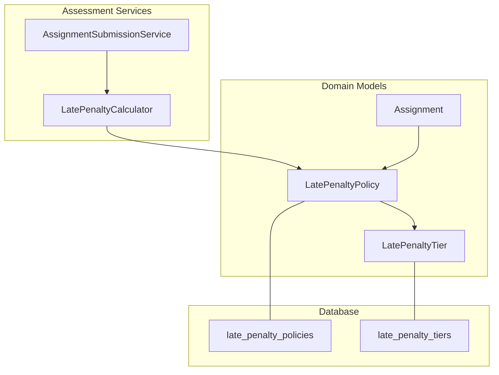
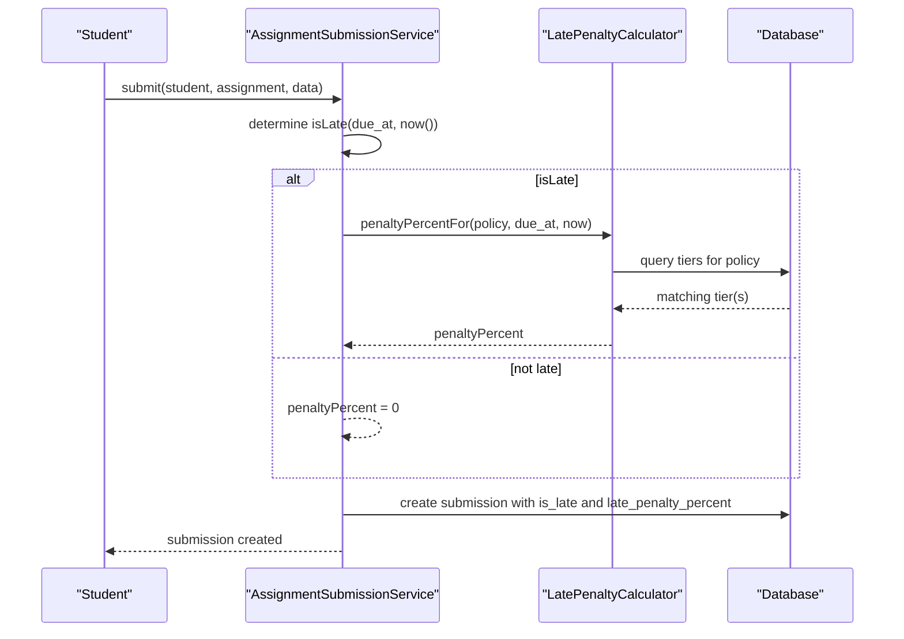
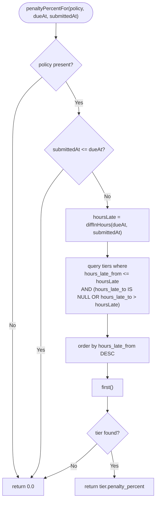
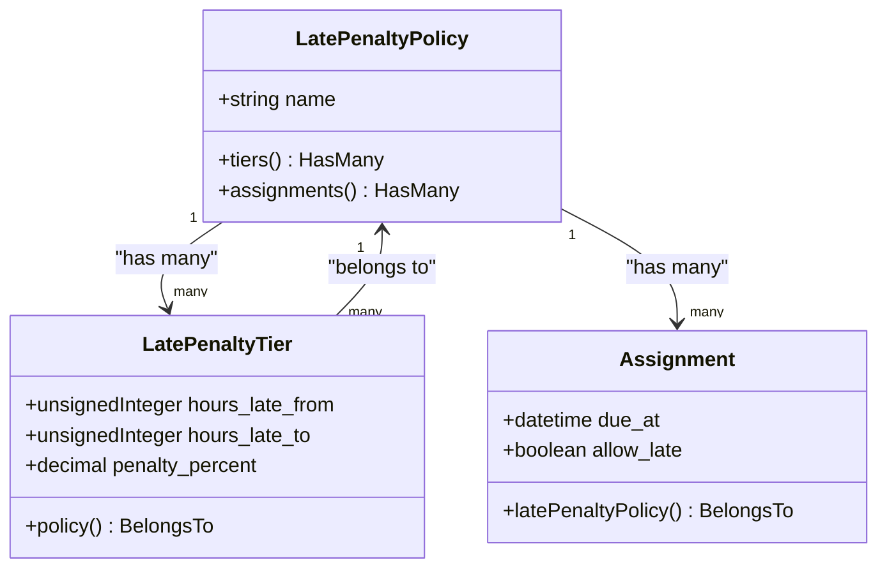
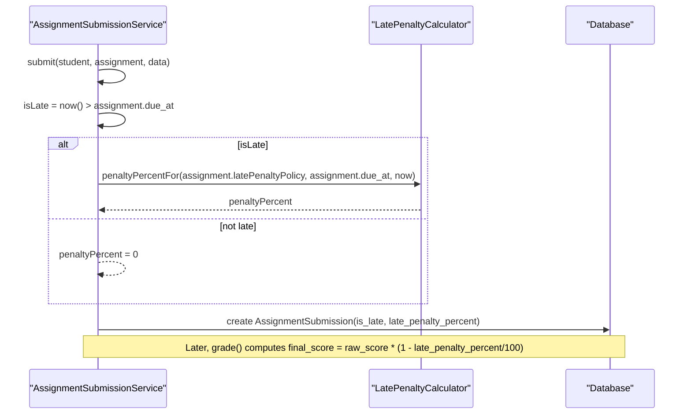
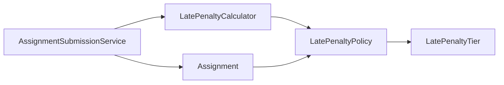

# Late Penalty Calculator

<cite>
**Referenced Files in This Document**
- [LatePenaltyCalculator.php](file://app/Services/Assessment/LatePenaltyCalculator.php)
- [LatePenaltyPolicy.php](file://app/Models/LatePenaltyPolicy.php)
- [LatePenaltyTier.php](file://app/Models/LatePenaltyTier.php)
- [AssignmentSubmissionService.php](file://app/Services/Assessment/AssignmentSubmissionService.php)
- [Assignment.php](file://app/Models/Assignment.php)
- [2024_01_01_000130_create_late_penalty_policies_table.php](file://database/migrations/2024_01_01_000130_create_late_penalty_policies_table.php)
- [2024_01_01_000131_create_late_penalty_tiers_table.php](file://database/migrations/2024_01_01_000131_create_late_penalty_tiers_table.php)
- [LatePenaltyCalculatorTest.php](file://tests/Feature/Assessment/LatePenaltyCalculatorTest.php)
- [LatePenaltyPolicyFactory.php](file://database/factories/LatePenaltyPolicyFactory.php)
- [LatePenaltyTierFactory.php](file://database/factories/LatePenaltyTierFactory.php)
</cite>

## Table of Contents
1. [Introduction](#introduction)
2. [Project Structure](#project-structure)
3. [Core Components](#core-components)
4. [Architecture Overview](#architecture-overview)
5. [Detailed Component Analysis](#detailed-component-analysis)
6. [Dependency Analysis](#dependency-analysis)
7. [Performance Considerations](#performance-considerations)
8. [Troubleshooting Guide](#troubleshooting-guide)
9. [Conclusion](#conclusion)
10. [Appendices](#appendices)

## Introduction
This document explains the LatePenaltyCalculator service and its surrounding components that implement automatic late submission penalties for assignments. It covers how penalty policies are structured, how tiered deductions are configured, how grace periods are handled, and how calculations integrate with assignment due dates and submission timestamps. It also provides examples of policy setup, tier configuration, and expected calculation results based on tests.

## Project Structure
The late penalty feature is implemented as a small, focused service with supporting models and database tables:
- Service: LatePenaltyCalculator computes the penalty percentage based on a policy and time delta.
- Models: LatePenaltyPolicy defines a named policy; LatePenaltyTier defines time bands and their associated penalty percentages.
- Integration: AssignmentSubmissionService uses the calculator when submitting an assignment and applies the stored penalty during grading.
- Schema: Migrations define the policy and tier tables.
- Tests: Feature tests validate behavior across on-time, early, and various late scenarios.

**Diagram sources**
- [LatePenaltyCalculator.php:15-34](file://app/Services/Assessment/LatePenaltyCalculator.php#L15-L34)
- [LatePenaltyPolicy.php:12-38](file://app/Models/LatePenaltyPolicy.php#L12-L38)
- [LatePenaltyTier.php:12-37](file://app/Models/LatePenaltyTier.php#L12-L37)
- [AssignmentSubmissionService.php:24-67](file://app/Services/Assessment/AssignmentSubmissionService.php#L24-L67)
- [Assignment.php:14-53](file://app/Models/Assignment.php#L14-L53)
- [2024_01_01_000130_create_late_penalty_policies_table.php:11-18](file://database/migrations/2024_01_01_000130_create_late_penalty_policies_table.php#L11-L18)
- [2024_01_01_000131_create_late_penalty_tiers_table.php:11-19](file://database/migrations/2024_01_01_000131_create_late_penalty_tiers_table.php#L11-L19)

**Section sources**
- [LatePenaltyCalculator.php:15-34](file://app/Services/Assessment/LatePenaltyCalculator.php#L15-L34)
- [AssignmentSubmissionService.php:24-67](file://app/Services/Assessment/AssignmentSubmissionService.php#L24-L67)
- [LatePenaltyPolicy.php:12-38](file://app/Models/LatePenaltyPolicy.php#L12-L38)
- [LatePenaltyTier.php:12-37](file://app/Models/LatePenaltyTier.php#L12-L37)
- [Assignment.php:14-53](file://app/Models/Assignment.php#L14-L53)
- [2024_01_01_000130_create_late_penalty_policies_table.php:11-18](file://database/migrations/2024_01_01_000130_create_late_penalty_policies_table.php#L11-L18)
- [2024_01_01_000131_create_late_penalty_tiers_table.php:11-19](file://database/migrations/2024_01_01_000131_create_late_penalty_tiers_table.php#L11-L19)

## Core Components
- LatePenaltyCalculator: Computes the applicable penalty percentage for a given policy, due date, and submission timestamp. Returns zero if there is no policy or if the submission is not late.
- LatePenaltyPolicy: A named grouping of tiers that can be attached to assignments.
- LatePenaltyTier: Defines a time band (hours_late_from to hours_late_to) and the corresponding penalty_percent. The upper bound can be null to represent “unbounded” (e.g., 48h+).
- AssignmentSubmissionService: Orchestrates submission flow, calculates whether a submission is late, invokes the calculator, persists the penalty percent, and later applies it when grading.

Key behaviors:
- Grace period handling: If submitted_at is less than or equal to due_at, penalty is zero.
- Tier selection: Uses hours_late_from <= hoursLate and (hours_late_to is null OR hours_late_to > hoursLate), ordered by highest from-bound first to pick the most specific matching tier.
- Percentage application: During grading, final_score = raw_score * (1 - late_penalty_percent / 100).

**Section sources**
- [LatePenaltyCalculator.php:17-34](file://app/Services/Assessment/LatePenaltyCalculator.php#L17-L34)
- [LatePenaltyPolicy.php:19-38](file://app/Models/LatePenaltyPolicy.php#L19-L38)
- [LatePenaltyTier.php:19-37](file://app/Models/LatePenaltyTier.php#L19-L37)
- [AssignmentSubmissionService.php:37-77](file://app/Services/Assessment/AssignmentSubmissionService.php#L37-L77)

## Architecture Overview
The late penalty system integrates at two points:
- Submission time: Determine if the submission is late and compute the penalty percentage using the assigned policy’s tiers.
- Grading time: Apply the stored penalty percentage to the raw score to produce the final score.

**Diagram sources**
- [AssignmentSubmissionService.php:37-67](file://app/Services/Assessment/AssignmentSubmissionService.php#L37-L67)
- [LatePenaltyCalculator.php:17-34](file://app/Services/Assessment/LatePenaltyCalculator.php#L17-L34)
- [2024_01_01_000131_create_late_penalty_tiers_table.php:13-19](file://database/migrations/2024_01_01_000131_create_late_penalty_tiers_table.php#L13-L19)

## Detailed Component Analysis

### LatePenaltyCalculator
Responsibilities:
- Accepts an optional LatePenaltyPolicy, due date, and submission timestamp.
- Returns 0.0 if no policy exists or if submission is on or before the due date.
- Calculates hoursLate via hour difference between due and submitted times.
- Selects the correct tier by:
  - Filtering tiers where hours_late_from <= hoursLate
  - Ensuring hours_late_to is either null or greater than hoursLate
  - Ordering by hours_late_from descending to prefer the highest lower bound
- Returns the matched tier’s penalty_percent cast to float.

Complexity:
- Time complexity is O(n) over the number of tiers for the policy, dominated by the filtered query and ordering.
- Space complexity is minimal (constant extra space beyond query result set).

Edge cases:
- No policy: returns 0.0.
- On-time or early submission: returns 0.0.
- Unbounded last tier (hours_late_to is null): correctly matches any hoursLate above the last threshold.

**Diagram sources**
- [LatePenaltyCalculator.php:17-34](file://app/Services/Assessment/LatePenaltyCalculator.php#L17-L34)

**Section sources**
- [LatePenaltyCalculator.php:17-34](file://app/Services/Assessment/LatePenaltyCalculator.php#L17-L34)

### LatePenaltyPolicy and LatePenaltyTier
Data model:
- Policy: stores a human-readable name and relates to many tiers and assignments.
- Tier: stores policy_id, hours_late_from, nullable hours_late_to, and penalty_percent (decimal precision).

Relationships:
- Policy hasMany Tier.
- Tier belongsTo Policy.
- Assignment belongsTo Policy via late_penalty_policy_id.

**Diagram sources**
- [LatePenaltyPolicy.php:12-38](file://app/Models/LatePenaltyPolicy.php#L12-L38)
- [LatePenaltyTier.php:12-37](file://app/Models/LatePenaltyTier.php#L12-L37)
- [Assignment.php:14-53](file://app/Models/Assignment.php#L14-L53)

**Section sources**
- [LatePenaltyPolicy.php:12-38](file://app/Models/LatePenaltyPolicy.php#L12-L38)
- [LatePenaltyTier.php:12-37](file://app/Models/LatePenaltyTier.php#L12-L37)
- [Assignment.php:14-53](file://app/Models/Assignment.php#L14-L53)

### Integration with Assignment Submission and Grading
Flow:
- On submission, the service determines if the submission is late by comparing current time to assignment.due_at.
- If late, it calls LatePenaltyCalculator to get the penalty percentage based on the assignment’s policy.
- The submission record stores is_late and late_penalty_percent.
- During grading, the final score is computed by applying the stored penalty percentage to the raw score.

**Diagram sources**
- [AssignmentSubmissionService.php:37-77](file://app/Services/Assessment/AssignmentSubmissionService.php#L37-L77)
- [LatePenaltyCalculator.php:17-34](file://app/Services/Assessment/LatePenaltyCalculator.php#L17-L34)

**Section sources**
- [AssignmentSubmissionService.php:37-77](file://app/Services/Assessment/AssignmentSubmissionService.php#L37-L77)

### Example Scenarios and Expected Results
Based on the test suite, a typical policy might define three tiers:
- 0–24 hours late: 10% penalty
- 24–48 hours late: 25% penalty
- 48+ hours late: 50% penalty

Expected outcomes:
- On-time or early submission: 0% penalty.
- 1 hour late: 10% penalty.
- 23 hours 59 minutes late: 10% penalty.
- Exactly 24 hours late: 25% penalty.
- 47 hours late: 25% penalty.
- Exactly 48 hours late: 50% penalty.
- Any time beyond 48 hours: 50% penalty.

These expectations demonstrate boundary behavior and confirm that the unbounded last tier works as intended.

**Section sources**
- [LatePenaltyCalculatorTest.php:9-51](file://tests/Feature/Assessment/LatePenaltyCalculatorTest.php#L9-L51)

## Dependency Analysis
Coupling and cohesion:
- LatePenaltyCalculator depends only on LatePenaltyPolicy and Carbon for time math. It is cohesive and stateless.
- AssignmentSubmissionService depends on LatePenaltyCalculator, ProgressEngine, NotificationDispatcher, EngagementTracker, and AuditLogger. It orchestrates submission and grading workflows.
- Models encapsulate relationships cleanly: Policy owns tiers and assignments; Tier belongs to Policy.

External dependencies:
- Database tables defined by migrations provide persistent storage for policies and tiers.
- Carbon handles timezone-aware datetime arithmetic.

Potential circular dependencies:
- None observed. Relationships are one-directional from Assignment to Policy and Policy to Tiers.

**Diagram sources**
- [AssignmentSubmissionService.php:24-67](file://app/Services/Assessment/AssignmentSubmissionService.php#L24-L67)
- [LatePenaltyCalculator.php:15-34](file://app/Services/Assessment/LatePenaltyCalculator.php#L15-L34)
- [LatePenaltyPolicy.php:12-38](file://app/Models/LatePenaltyPolicy.php#L12-L38)
- [LatePenaltyTier.php:12-37](file://app/Models/LatePenaltyTier.php#L12-L37)
- [Assignment.php:14-53](file://app/Models/Assignment.php#L14-L53)

**Section sources**
- [AssignmentSubmissionService.php:24-67](file://app/Services/Assessment/AssignmentSubmissionService.php#L24-L67)
- [LatePenaltyCalculator.php:15-34](file://app/Services/Assessment/LatePenaltyCalculator.php#L15-L34)
- [LatePenaltyPolicy.php:12-38](file://app/Models/LatePenaltyPolicy.php#L12-L38)
- [LatePenaltyTier.php:12-37](file://app/Models/LatePenaltyTier.php#L12-L37)
- [Assignment.php:14-53](file://app/Models/Assignment.php#L14-L53)

## Performance Considerations
- Tier lookup is linear in the number of tiers per policy. For typical policies with a small number of tiers, this is negligible.
- To optimize at scale:
  - Ensure indexes on hours_late_from and hours_late_to columns in the tiers table to speed up filtering and ordering.
  - Cache frequently accessed policies and their tiers if the same policy is evaluated repeatedly within a request.
- Timezone safety: Use consistent timezone-aware datetimes (Carbon) to avoid off-by-one-hour issues around daylight saving transitions.

[No sources needed since this section provides general guidance]

## Troubleshooting Guide
Common issues and resolutions:
- Zero penalty despite being late:
  - Verify that the assignment has a valid late_penalty_policy_id and that the policy contains appropriate tiers.
  - Confirm that due_at is set and that submitted_at is indeed after due_at.
- Unexpected tier selection:
  - Check that hours_late_from and hours_late_to values form non-overlapping, contiguous bands.
  - Ensure the last tier has hours_late_to set to null to cover all later times.
- Boundary edge cases:
  - Confirm behavior at exact boundaries (e.g., exactly 24 hours late should fall into the next tier).
  - Validate timezone settings so that diffInHours behaves as expected.

Relevant code paths:
- Penalty calculation logic and tier selection: [LatePenaltyCalculator.php:17-34](file://app/Services/Assessment/LatePenaltyCalculator.php#L17-L34)
- Submission flow and persistence of penalty: [AssignmentSubmissionService.php:37-67](file://app/Services/Assessment/AssignmentSubmissionService.php#L37-L67)
- Grading application of penalty: [AssignmentSubmissionService.php:72-77](file://app/Services/Assessment/AssignmentSubmissionService.php#L72-L77)

**Section sources**
- [LatePenaltyCalculator.php:17-34](file://app/Services/Assessment/LatePenaltyCalculator.php#L17-L34)
- [AssignmentSubmissionService.php:37-77](file://app/Services/Assessment/AssignmentSubmissionService.php#L37-L77)

## Conclusion
The LatePenaltyCalculator provides a clean, configurable mechanism for enforcing late submission penalties through tiered policies. Its integration with AssignmentSubmissionService ensures that penalties are calculated at submission time and applied consistently during grading. The design supports flexible policy definitions, clear boundary behavior, and straightforward extensibility for new penalty strategies.

[No sources needed since this section summarizes without analyzing specific files]

## Appendices

### Database Schema Summary
- late_penalty_policies: id, name, created_at
- late_penalty_tiers: id, policy_id (FK), hours_late_from, hours_late_to (nullable), penalty_percent

**Section sources**
- [2024_01_01_000130_create_late_penalty_policies_table.php:11-18](file://database/migrations/2024_01_01_000130_create_late_penalty_policies_table.php#L11-L18)
- [2024_01_01_000131_create_late_penalty_tiers_table.php:11-19](file://database/migrations/2024_01_01_000131_create_late_penalty_tiers_table.php#L11-L19)

### Factory Defaults
- LatePenaltyPolicyFactory creates a default policy named “Standard tiered penalty”.
- LatePenaltyTierFactory creates a default tier with a 0–24 hour band and 10% penalty.

**Section sources**
- [LatePenaltyPolicyFactory.php:17-22](file://database/factories/LatePenaltyPolicyFactory.php#L17-L22)
- [LatePenaltyTierFactory.php:18-25](file://database/factories/LatePenaltyTierFactory.php#L18-L25)