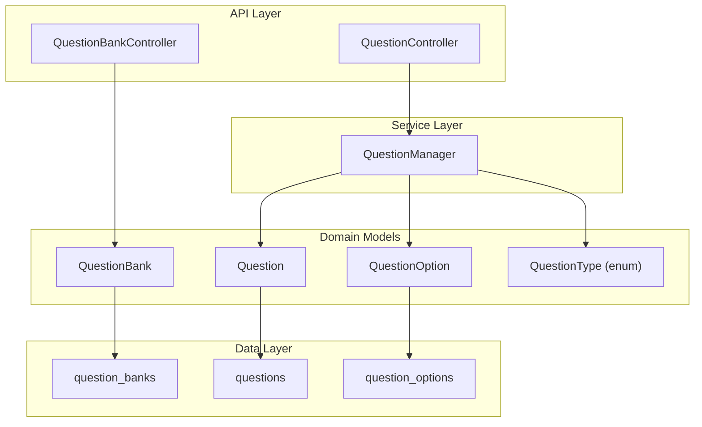
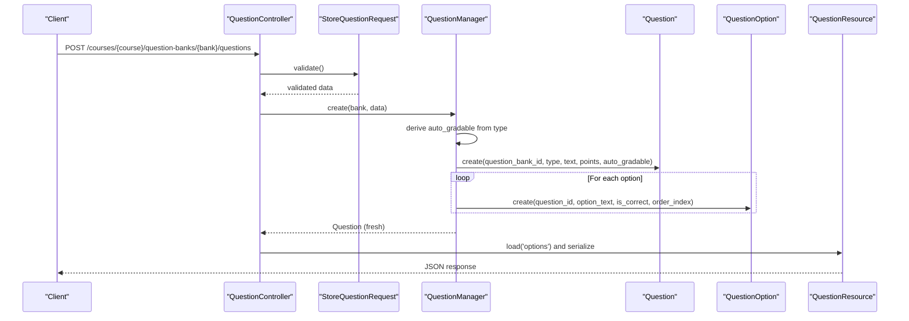
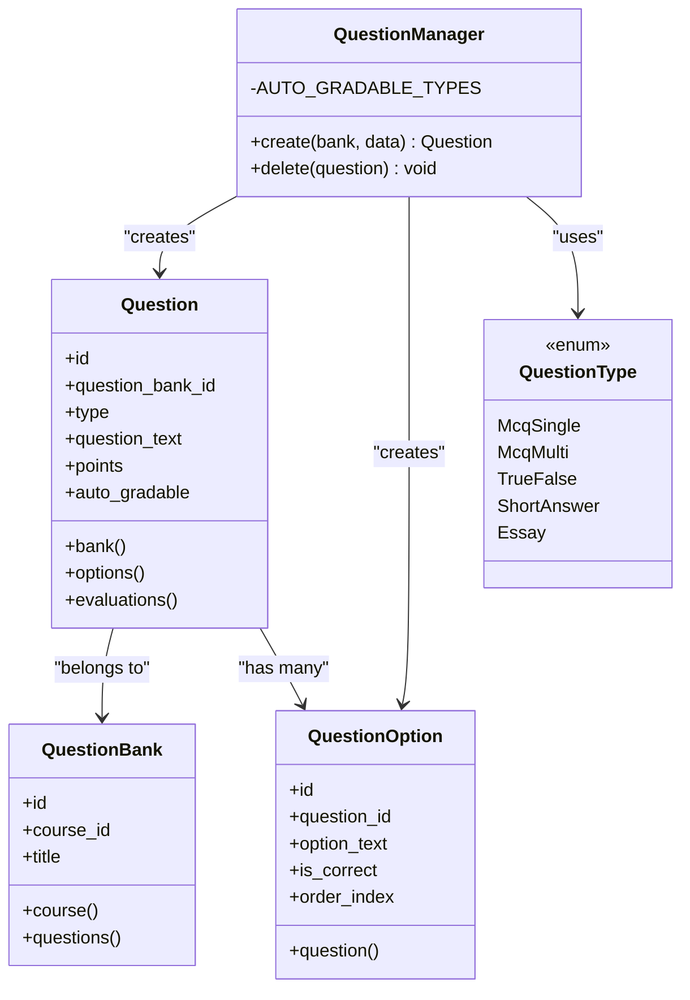
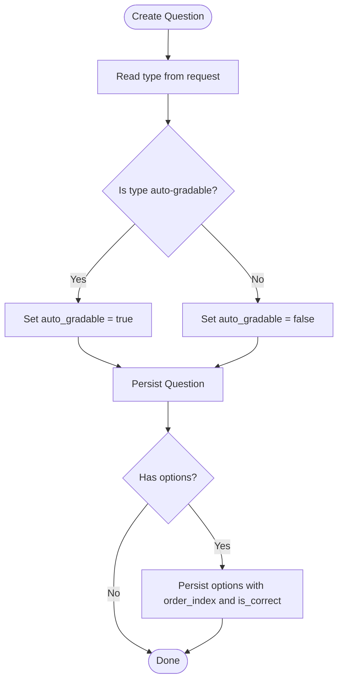
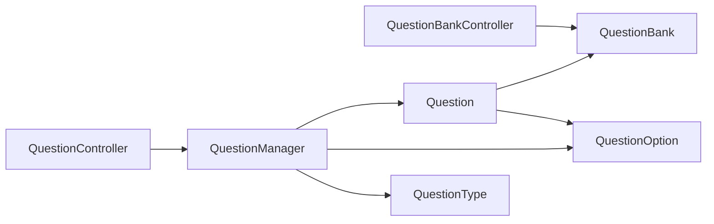

# Question Manager

<cite>
**Referenced Files in This Document**
- [QuestionManager.php](file://app/Services/Assessment/QuestionManager.php)
- [QuestionType.php](file://app/Enums/QuestionType.php)
- [Question.php](file://app/Models/Question.php)
- [QuestionOption.php](file://app/Models/QuestionOption.php)
- [QuestionBank.php](file://app/Models/QuestionBank.php)
- [QuestionController.php](file://app/Http/Controllers/Api/V1/QuestionController.php)
- [QuestionBankController.php](file://app/Http/Controllers/Api/V1/QuestionBankController.php)
- [StoreQuestionRequest.php](file://app/Http/Requests/Api/V1/StoreQuestionRequest.php)
- [StoreQuestionBankRequest.php](file://app/Http/Requests/Api/V1/StoreQuestionBankRequest.php)
- [QuestionResource.php](file://app/Http/Resources/QuestionResource.php)
- [QuestionOptionResource.php](file://app/Http/Resources/QuestionOptionResource.php)
- [QuestionBankResource.php](file://app/Http/Resources/QuestionBankResource.php)
- [2024_01_01_000140_create_question_banks_table.php](file://database/migrations/2024_01_01_000140_create_question_banks_table.php)
- [2024_01_01_000141_create_questions_table.php](file://database/migrations/2024_01_01_000141_create_questions_table.php)
- [2024_01_01_000142_create_question_options_table.php](file://database/migrations/2024_01_01_000142_create_question_options_table.php)
</cite>

## Table of Contents
1. Introduction
2. Project Structure
3. Core Components
4. Architecture Overview
5. Detailed Component Analysis
6. Dependency Analysis
7. Performance Considerations
8. Troubleshooting Guide
9. Conclusion

## Introduction
This document explains the Question Manager subsystem that manages questions, question options, and question bank organization. It covers supported question types, validation rules, option management, categorization within question banks, and the business logic around auto-grading and metadata such as points. It also provides practical workflows for creating questions, managing options, and organizing question banks.

## Project Structure
The Question Manager spans services, models, enums, HTTP controllers, request validators, resources, and database migrations:
- Service layer encapsulates creation and deletion of questions with transactional safety.
- Models define relationships between QuestionBank, Question, and QuestionOption.
- Enums define supported question types.
- Controllers expose API endpoints for question banks and questions.
- Request classes validate incoming data.
- Resources shape API responses.
- Migrations define the schema for question banks, questions, and options.

**Diagram sources**
- [QuestionBankController.php:15-39](file://app/Http/Controllers/Api/V1/QuestionBankController.php#L15-L39)
- [QuestionController.php:15-34](file://app/Http/Controllers/Api/V1/QuestionController.php#L15-L34)
- [QuestionManager.php:17-53](file://app/Services/Assessment/QuestionManager.php#L17-L53)
- [QuestionBank.php:13-39](file://app/Models/QuestionBank.php#L13-L39)
- [Question.php:15-58](file://app/Models/Question.php#L15-L58)
- [QuestionOption.php:12-36](file://app/Models/QuestionOption.php#L12-L36)
- [QuestionType.php:7-14](file://app/Enums/QuestionType.php#L7-L14)
- [2024_01_01_000140_create_question_banks_table.php:11-19](file://database/migrations/2024_01_01_000140_create_question_banks_table.php#L11-L19)
- [2024_01_01_000141_create_questions_table.php:11-21](file://database/migrations/2024_01_01_000141_create_questions_table.php#L11-L21)
- [2024_01_01_000142_create_question_options_table.php:11-19](file://database/migrations/2024_01_01_000142_create_question_options_table.php#L11-L19)

**Section sources**
- [QuestionManager.php:17-53](file://app/Services/Assessment/QuestionManager.php#L17-L53)
- [QuestionController.php:15-34](file://app/Http/Controllers/Api/V1/QuestionController.php#L15-L34)
- [QuestionBankController.php:15-39](file://app/Http/Controllers/Api/V1/QuestionBankController.php#L15-L39)
- [Question.php:15-58](file://app/Models/Question.php#L15-L58)
- [QuestionOption.php:12-36](file://app/Models/QuestionOption.php#L12-L36)
- [QuestionBank.php:13-39](file://app/Models/QuestionBank.php#L13-L39)
- [QuestionType.php:7-14](file://app/Enums/QuestionType.php#L7-L14)
- [2024_01_01_000140_create_question_banks_table.php:11-19](file://database/migrations/2024_01_01_000140_create_question_banks_table.php#L11-L19)
- [2024_01_01_000141_create_questions_table.php:11-21](file://database/migrations/2024_01_01_000141_create_questions_table.php#L11-L21)
- [2024_01_01_000142_create_question_options_table.php:11-19](file://database/migrations/2024_01_01_000142_create_question_options_table.php#L11-L19)

## Core Components
- QuestionManager: Orchestrates creation and deletion of questions within a transaction, sets auto-grading based on type, and persists options.
- Models:
  - QuestionBank: Groups questions by course; has many questions.
  - Question: Belongs to a bank; has many options; belongs to evaluations via pivot.
  - QuestionOption: Stores selectable answers with correctness flags and order.
- Enums:
  - QuestionType: Defines mcq_single, mcq_multi, true_false, short_answer, essay.
- API Layer:
  - QuestionBankController: Lists, creates, deletes question banks scoped to a course.
  - QuestionController: Creates and deletes questions within a bank.
- Validation:
  - StoreQuestionRequest: Validates type, text, points, and options for MCQ/TrueFalse.
  - StoreQuestionBankRequest: Validates title for new banks.
- Resources:
  - QuestionBankResource, QuestionResource, QuestionOptionResource: Shape API payloads.

Key behaviors:
- Auto-grading is derived from type; only mcq_single, mcq_multi, true_false are auto-gradable.
- Options are required for mcq_single, mcq_multi, true_false and must be at least two items.
- Points default to 1 when not provided and must be non-negative.

**Section sources**
- [QuestionManager.php:17-53](file://app/Services/Assessment/QuestionManager.php#L17-L53)
- [QuestionType.php:7-14](file://app/Enums/QuestionType.php#L7-L14)
- [Question.php:15-58](file://app/Models/Question.php#L15-L58)
- [QuestionOption.php:12-36](file://app/Models/QuestionOption.php#L12-L36)
- [QuestionBank.php:13-39](file://app/Models/QuestionBank.php#L13-L39)
- [StoreQuestionRequest.php:12-33](file://app/Http/Requests/Api/V1/StoreQuestionRequest.php#L12-L33)
- [StoreQuestionBankRequest.php:10-23](file://app/Http/Requests/Api/V1/StoreQuestionBankRequest.php#L10-L23)
- [QuestionResource.php:10-27](file://app/Http/Resources/QuestionResource.php#L10-L27)
- [QuestionOptionResource.php:15-29](file://app/Http/Resources/QuestionOptionResource.php#L15-L29)
- [QuestionBankResource.php:10-24](file://app/Http/Resources/QuestionBankResource.php#L10-L24)

## Architecture Overview
The system follows a layered architecture:
- Controllers receive requests, enforce authorization, and delegate to services.
- Services perform domain operations with transactions and type-based logic.
- Models manage persistence and relationships.
- Requests validate inputs before reaching services.
- Resources serialize outputs consistently.

**Diagram sources**
- [QuestionController.php:19-24](file://app/Http/Controllers/Api/V1/QuestionController.php#L19-L24)
- [StoreQuestionRequest.php:22-33](file://app/Http/Requests/Api/V1/StoreQuestionRequest.php#L22-L33)
- [QuestionManager.php:24-47](file://app/Services/Assessment/QuestionManager.php#L24-L47)
- [Question.php:22-34](file://app/Models/Question.php#L22-L34)
- [QuestionOption.php:19-28](file://app/Models/QuestionOption.php#L19-L28)
- [QuestionResource.php:15-26](file://app/Http/Resources/QuestionResource.php#L15-L26)

## Detailed Component Analysis

### QuestionManager
Responsibilities:
- Create questions within a bank using a database transaction.
- Derive auto_gradable strictly from the question type enum.
- Persist options with correct ordering and correctness flags.
- Delete questions.

Business rules:
- Auto-grading is enabled only for mcq_single, mcq_multi, true_false.
- Points default to 1 if omitted; must be numeric and non-negative per request validation.
- Options are mandatory for mcq_single, mcq_multi, true_false and must have at least two entries.

Complexity:
- Creation is O(n) over number of options due to one insert per option.
- Transaction ensures atomicity of question and options creation.

Error handling:
- Relies on framework validation and database constraints for invalid input or integrity errors.

Optimization opportunities:
- Batch-insert options if performance becomes critical.
- Add explicit validation for minimum correct options per type if needed.

**Section sources**
- [QuestionManager.php:17-53](file://app/Services/Assessment/QuestionManager.php#L17-L53)
- [QuestionType.php:7-14](file://app/Enums/QuestionType.php#L7-L14)

#### Class Diagram

**Diagram sources**
- [QuestionManager.php:17-53](file://app/Services/Assessment/QuestionManager.php#L17-L53)
- [Question.php:15-58](file://app/Models/Question.php#L15-L58)
- [QuestionOption.php:12-36](file://app/Models/QuestionOption.php#L12-L36)
- [QuestionBank.php:13-39](file://app/Models/QuestionBank.php#L13-L39)
- [QuestionType.php:7-14](file://app/Enums/QuestionType.php#L7-L14)

### Question Model
- Attributes: id, question_bank_id, type, question_text, points, auto_gradable.
- Relationships:
  - bank(): belongs to QuestionBank.
  - options(): has many QuestionOption.
  - evaluations(): belongsToMany Evaluation via evaluation_questions pivot with order_index.
- Casts: type to QuestionType, points decimal, auto_gradable boolean.

Notes:
- No updated_at; created_at is managed by migration defaults.

**Section sources**
- [Question.php:15-58](file://app/Models/Question.php#L15-L58)
- [2024_01_01_000141_create_questions_table.php:11-21](file://database/migrations/2024_01_01_000141_create_questions_table.php#L11-L21)

### QuestionOption Model
- Attributes: id, question_id, option_text, is_correct, order_index.
- Relationship: question() belongs to Question.
- Notes: No timestamps; order_index preserves display order.

**Section sources**
- [QuestionOption.php:12-36](file://app/Models/QuestionOption.php#L12-L36)
- [2024_01_01_000142_create_question_options_table.php:11-19](file://database/migrations/2024_01_01_000142_create_question_options_table.php#L11-L19)

### QuestionBank Model and Controller
- Model:
  - Attributes: id, course_id, title.
  - Relationships: course(), questions().
- Controller:
  - index(): lists banks for a course with questions and options loaded.
  - store(): creates a bank under a course.
  - destroy(): deletes a bank with authorization.

**Section sources**
- [QuestionBank.php:13-39](file://app/Models/QuestionBank.php#L13-L39)
- [QuestionBankController.php:15-39](file://app/Http/Controllers/Api/V1/QuestionBankController.php#L15-L39)
- [2024_01_01_000140_create_question_banks_table.php:11-19](file://database/migrations/2024_01_01_000140_create_question_banks_table.php#L11-L19)

### API Endpoints and Validation

- Create Question
  - Endpoint: POST /courses/{course}/question-banks/{bank}/questions
  - Authorization: user must be able to update the bank.
  - Validation:
    - type: required, must be one of the QuestionType values.
    - question_text: required string.
    - points: optional numeric >= 0.
    - options: required for mcq_single, mcq_multi, true_false; array with at least two items; each option_text required string <= 500 chars; is_correct optional boolean.
  - Response: QuestionResource including options when loaded.

- Delete Question
  - Endpoint: DELETE /questions/{question}
  - Authorization: user must be able to update the question’s bank.
  - Response: 204 No Content.

- Manage Question Banks
  - List: GET /courses/{course}/question-banks
  - Create: POST /courses/{course}/question-banks
  - Delete: DELETE /question-banks/{bank}
  - Validation: title required string <= 200 chars.

**Section sources**
- [QuestionController.php:15-34](file://app/Http/Controllers/Api/V1/QuestionController.php#L15-L34)
- [StoreQuestionRequest.php:12-33](file://app/Http/Requests/Api/V1/StoreQuestionRequest.php#L12-L33)
- [QuestionBankController.php:15-39](file://app/Http/Controllers/Api/V1/QuestionBankController.php#L15-L39)
- [StoreQuestionBankRequest.php:10-23](file://app/Http/Requests/Api/V1/StoreQuestionBankRequest.php#L10-L23)
- [QuestionResource.php:15-26](file://app/Http/Resources/QuestionResource.php#L15-L26)

### Question Type Handling and Auto-Grading
- Supported types: mcq_single, mcq_multi, true_false, short_answer, essay.
- Auto-grading:
  - Enabled for mcq_single, mcq_multi, true_false.
  - Disabled for short_answer and essay (manual grading).
- Options:
  - Required for mcq_single, mcq_multi, true_false.
  - Not required for short_answer and essay.

**Diagram sources**
- [QuestionManager.php:24-47](file://app/Services/Assessment/QuestionManager.php#L24-L47)
- [QuestionType.php:7-14](file://app/Enums/QuestionType.php#L7-L14)

**Section sources**
- [QuestionManager.php:17-53](file://app/Services/Assessment/QuestionManager.php#L17-L53)
- [QuestionType.php:7-14](file://app/Enums/QuestionType.php#L7-L14)

### Option Management
- Each option includes:
  - option_text: displayed choice.
  - is_correct: marks correct answer(s).
  - order_index: preserves sequence.
- Validation enforces:
  - Minimum two options for MCQ and True/False.
  - Text length limit and required presence.
- Resource exposure:
  - Admin/instructor-facing responses include is_correct.
  - Student-facing flows do not expose answer keys.

**Section sources**
- [StoreQuestionRequest.php:22-33](file://app/Http/Requests/Api/V1/StoreQuestionRequest.php#L22-L33)
- [QuestionOption.php:19-28](file://app/Models/QuestionOption.php#L19-L28)
- [QuestionOptionResource.php:15-29](file://app/Http/Resources/QuestionOptionResource.php#L15-L29)

### Categorization Within Question Banks
- QuestionBank groups questions by course via course_id.
- Questions belong to a single bank through question_bank_id.
- Listing a bank returns its questions and options for easy authoring and review.

**Section sources**
- [QuestionBank.php:13-39](file://app/Models/QuestionBank.php#L13-L39)
- [Question.php:22-34](file://app/Models/Question.php#L22-L34)
- [QuestionBankController.php:17-22](file://app/Http/Controllers/Api/V1/QuestionBankController.php#L17-L22)

### Business Logic Summary
- Auto-grading is enforced server-side based on type; never trusted from client input.
- Points default to 1 when not provided; must be non-negative.
- Options are mandatory for objective question types and must meet minimum count and content rules.
- Authorization is enforced at controller/request level for both banks and questions.

**Section sources**
- [QuestionManager.php:13-16](file://app/Services/Assessment/QuestionManager.php#L13-L16)
- [QuestionManager.php:24-47](file://app/Services/Assessment/QuestionManager.php#L24-L47)
- [StoreQuestionRequest.php:22-33](file://app/Http/Requests/Api/V1/StoreQuestionRequest.php#L22-L33)

## Dependency Analysis
- Controllers depend on services and models; services depend on models and enums; models depend on migrations for schema.
- Tight coupling exists between QuestionManager and QuestionType for auto-grading decisions.
- Loose coupling via Eloquent relationships enables flexible querying and serialization.

**Diagram sources**
- [QuestionController.php:15-34](file://app/Http/Controllers/Api/V1/QuestionController.php#L15-L34)
- [QuestionBankController.php:15-39](file://app/Http/Controllers/Api/V1/QuestionBankController.php#L15-L39)
- [QuestionManager.php:17-53](file://app/Services/Assessment/QuestionManager.php#L17-L53)
- [Question.php:15-58](file://app/Models/Question.php#L15-L58)
- [QuestionOption.php:12-36](file://app/Models/QuestionOption.php#L12-L36)
- [QuestionBank.php:13-39](file://app/Models/QuestionBank.php#L13-L39)
- [QuestionType.php:7-14](file://app/Enums/QuestionType.php#L7-L14)

**Section sources**
- [QuestionController.php:15-34](file://app/Http/Controllers/Api/V1/QuestionController.php#L15-L34)
- [QuestionBankController.php:15-39](file://app/Http/Controllers/Api/V1/QuestionBankController.php#L15-L39)
- [QuestionManager.php:17-53](file://app/Services/Assessment/QuestionManager.php#L17-L53)
- [Question.php:15-58](file://app/Models/Question.php#L15-L58)
- [QuestionOption.php:12-36](file://app/Models/QuestionOption.php#L12-L36)
- [QuestionBank.php:13-39](file://app/Models/QuestionBank.php#L13-L39)
- [QuestionType.php:7-14](file://app/Enums/QuestionType.php#L7-L14)

## Performance Considerations
- Use transactions for question+options creation to avoid partial writes.
- Avoid N+1 queries by eager-loading options when listing banks or returning questions.
- Consider batching option inserts if large numbers of options are added per question.
- Keep option_text within limits to reduce storage overhead.

[No sources needed since this section provides general guidance]

## Troubleshooting Guide
Common issues and resolutions:
- Missing options for MCQ/TrueFalse:
  - Ensure options array contains at least two items with option_text when type is mcq_single, mcq_multi, or true_false.
- Invalid question type:
  - Validate type against QuestionType enum values.
- Negative or non-numeric points:
  - Ensure points is numeric and >= 0; otherwise validation will fail.
- Authorization failures:
  - Confirm the authenticated user has permission to update the target question bank.
- Unexpected auto-grading behavior:
  - Remember auto_gradable is derived from type; it cannot be set by client input.

**Section sources**
- [StoreQuestionRequest.php:22-33](file://app/Http/Requests/Api/V1/StoreQuestionRequest.php#L22-L33)
- [QuestionManager.php:13-16](file://app/Services/Assessment/QuestionManager.php#L13-L16)
- [QuestionController.php:26-33](file://app/Http/Controllers/Api/V1/QuestionController.php#L26-L33)

## Conclusion
The Question Manager provides a robust foundation for managing assessments across courses. It enforces strict validation, derives auto-grading capabilities from question types, and organizes content via question banks. The design separates concerns across controllers, services, models, and resources, enabling clear maintenance and extensibility. Future enhancements can focus on advanced validation rules per type, bulk operations, and richer metadata while preserving current guarantees around auto-grading and data integrity.