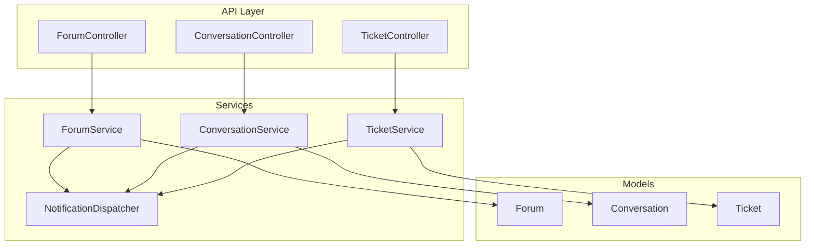
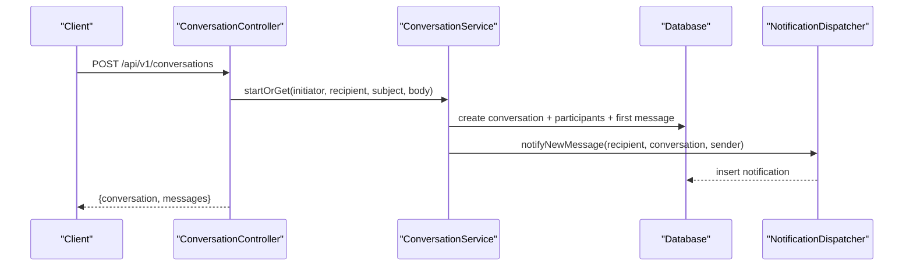
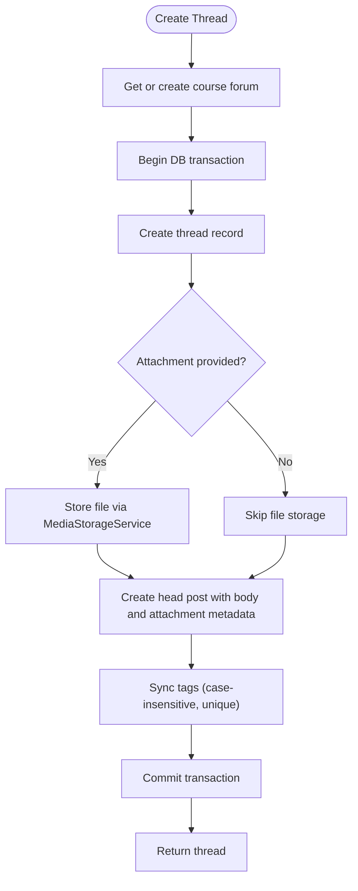
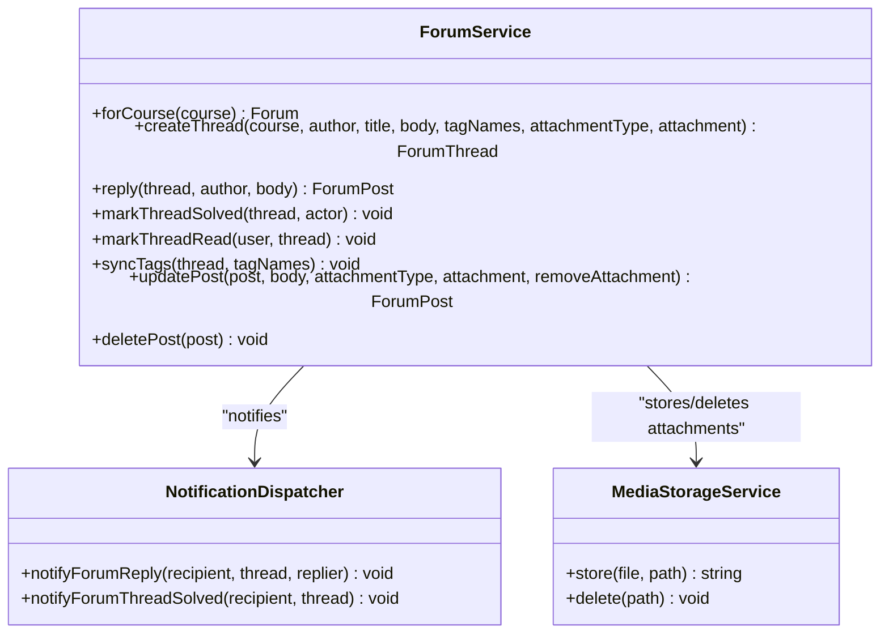
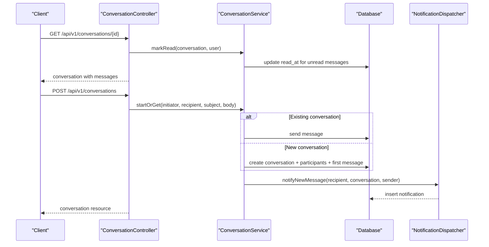
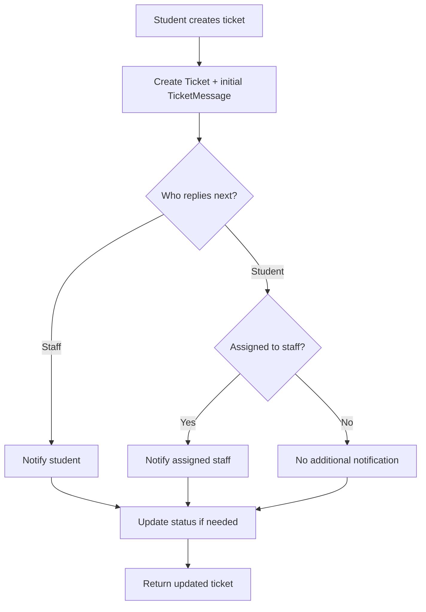
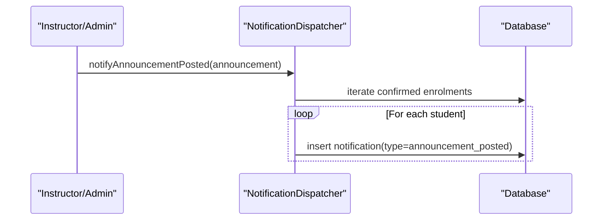
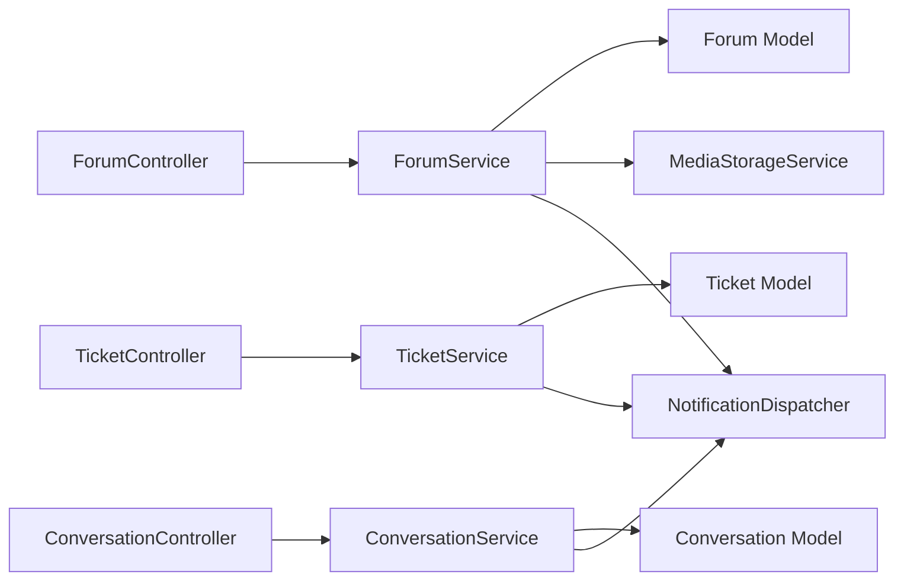

# Communication Services

<cite>
**Referenced Files in This Document**
- [ForumService.php](file://app/Services/Communication/ForumService.php)
- [ConversationService.php](file://app/Services/Communication/ConversationService.php)
- [TicketService.php](file://app/Services/Communication/TicketService.php)
- [NotificationDispatcher.php](file://app/Services/Notifications/NotificationDispatcher.php)
- [ForumController.php](file://app/Http/Controllers/Api/V1/ForumController.php)
- [ConversationController.php](file://app/Http/Controllers/Api/V1/ConversationController.php)
- [TicketController.php](file://app/Http/Controllers/Api/V1/TicketController.php)
- [ForumThreadPolicy.php](file://app/Policies/ForumThreadPolicy.php)
- [ForumPostReportPolicy.php](file://app/Policies/ForumPostReportPolicy.php)
- [Forum.php](file://app/Models/Forum.php)
- [Conversation.php](file://app/Models/Conversation.php)
- [Ticket.php](file://app/Models/Ticket.php)
</cite>

## Table of Contents
1. [Introduction](#introduction)
2. [Project Structure](#project-structure)
3. [Core Components](#core-components)
4. [Architecture Overview](#architecture-overview)
5. [Detailed Component Analysis](#detailed-component-analysis)
6. [Dependency Analysis](#dependency-analysis)
7. [Performance Considerations](#performance-considerations)
8. [Troubleshooting Guide](#troubleshooting-guide)
9. [Conclusion](#conclusion)

## Introduction
This document explains the Communication Services that power forum discussions, direct messaging, support ticketing, and announcement broadcasting. It focuses on three core services:
- ForumService: threaded course forums with tagging, attachments, read tracking, and staff moderation actions.
- ConversationService: 1:1 messaging between allowed user pairs with read receipts and recipient discovery.
- TicketService: student support tickets with replies and status management.

It also covers how these services integrate with a central NotificationDispatcher to deliver in-app notifications for replies, ticket updates, forum thread resolution, announcements, and more. The design emphasizes clear boundaries between features (forums vs. tickets), role-based access control via policies, and transactional data integrity.

## Project Structure
The communication subsystem is organized by feature under app/Services/Communication, with shared notification delivery centralized in app/Services/Notifications. Controllers expose REST endpoints that delegate business logic to services. Policies enforce authorization rules per domain model. Models define relationships and casts for enums and timestamps.

**Diagram sources**
- [ForumController.php](file://app/Http/Controllers/Api/V1/ForumController.php)
- [ConversationController.php](file://app/Http/Controllers/Api/V1/ConversationController.php)
- [TicketController.php](file://app/Http/Controllers/Api/V1/TicketController.php)
- [ForumService.php](file://app/Services/Communication/ForumService.php)
- [ConversationService.php](file://app/Services/Communication/ConversationService.php)
- [TicketService.php](file://app/Services/Communication/TicketService.php)
- [NotificationDispatcher.php](file://app/Services/Notifications/NotificationDispatcher.php)
- [Forum.php](file://app/Models/Forum.php)
- [Conversation.php](file://app/Models/Conversation.php)
- [Ticket.php](file://app/Models/Ticket.php)

**Section sources**
- [ForumController.php](file://app/Http/Controllers/Api/V1/ForumController.php)
- [ConversationController.php](file://app/Http/Controllers/Api/V1/ConversationController.php)
- [TicketController.php](file://app/Http/Controllers/Api/V1/TicketController.php)
- [ForumService.php](file://app/Services/Communication/ForumService.php)
- [ConversationService.php](file://app/Services/Communication/ConversationService.php)
- [TicketService.php](file://app/Services/Communication/TicketService.php)
- [NotificationDispatcher.php](file://app/Services/Notifications/NotificationDispatcher.php)
- [Forum.php](file://app/Models/Forum.php)
- [Conversation.php](file://app/Models/Conversation.php)
- [Ticket.php](file://app/Models/Ticket.php)

## Core Components
- ForumService: Creates or retrieves a course-scoped forum; creates threads with optional attachments; handles replies, marking threads solved, and read tracking; syncs tags; updates/deletes posts with attachment lifecycle management.
- ConversationService: Enforces who can message whom based on roles and enrollment; reuses existing 1:1 conversations; sends messages and notifies recipients; marks messages as read; discovers contactable users per role.
- TicketService: Creates tickets with an initial message; handles replies with appropriate notifications to student or assigned staff; updates status and assignment, setting resolved timestamp when applicable.
- NotificationDispatcher: Centralized in-app notification writer with typed methods for new messages, ticket replies, forum replies, thread solved, announcements, grades, module unlocks, and at-risk reminders.

Key cross-cutting concerns:
- Authorization via policies (forum view/create/moderate, report moderation).
- Transactional writes for multi-step operations (thread creation, conversation start, ticket creation).
- Read tracking for forums and messages to support unread counts and read receipts.
- Role-based scoping for visibility and actions across all three domains.

**Section sources**
- [ForumService.php](file://app/Services/Communication/ForumService.php)
- [ConversationService.php](file://app/Services/Communication/ConversationService.php)
- [TicketService.php](file://app/Services/Communication/TicketService.php)
- [NotificationDispatcher.php](file://app/Services/Notifications/NotificationDispatcher.php)
- [ForumThreadPolicy.php](file://app/Policies/ForumThreadPolicy.php)
- [ForumPostReportPolicy.php](file://app/Policies/ForumPostReportPolicy.php)

## Architecture Overview
The system follows a layered approach:
- API controllers handle HTTP requests and delegate to services.
- Services encapsulate business rules, orchestrate models, and trigger notifications.
- Models represent domain entities with relationships and casts.
- Policies enforce authorization constraints.

**Diagram sources**
- [ConversationController.php](file://app/Http/Controllers/Api/V1/ConversationController.php)
- [ConversationService.php](file://app/Services/Communication/ConversationService.php)
- [NotificationDispatcher.php](file://app/Services/Notifications/NotificationDispatcher.php)

**Section sources**
- [ConversationController.php](file://app/Http/Controllers/Api/V1/ConversationController.php)
- [ConversationService.php](file://app/Services/Communication/ConversationService.php)
- [NotificationDispatcher.php](file://app/Services/Notifications/NotificationDispatcher.php)

## Detailed Component Analysis

### ForumService
Responsibilities:
- Course-scoped forum retrieval or lazy creation.
- Thread creation with optional attachments and tag synchronization.
- Reply handling with last activity update and creator notification.
- Staff-only mark-as-solved action with notification.
- Read tracking for threads.
- Post updates with attachment lifecycle (store/delete/toggle article mode).
- Post deletion cascading to thread if head post is removed.

Data flow highlights:
- Attachments are stored via MediaStorageService and persisted alongside posts.
- Tags are normalized and synced case-insensitively.
- Notifications are dispatched only when relevant parties change (e.g., not self-replies).

**Diagram sources**
- [ForumService.php](file://app/Services/Communication/ForumService.php)

Authorization and moderation:
- View/create restricted to admins, instructors teaching the course, or confirmed-enrolled students.
- Moderation actions (pin/lock/report queue) limited to admins and course instructors.

**Diagram sources**
- [ForumService.php](file://app/Services/Communication/ForumService.php)
- [NotificationDispatcher.php](file://app/Services/Notifications/NotificationDispatcher.php)

**Section sources**
- [ForumService.php](file://app/Services/Communication/ForumService.php)
- [ForumThreadPolicy.php](file://app/Policies/ForumThreadPolicy.php)
- [ForumPostReportPolicy.php](file://app/Policies/ForumPostReportPolicy.php)

### ConversationService
Responsibilities:
- Enforce conversational permissions based on roles and enrollment.
- Reuse existing 1:1 conversations between two users.
- Send messages and notify non-sender participants.
- Mark messages as read for the reader.
- Provide a list of contactable users per role.

Business rules:
- Student-to-student messaging is excluded (use forums instead).
- Admins can message any user.
- Instructors can message their enrolled students.
- Students can message admins and their instructors.

**Diagram sources**
- [ConversationController.php](file://app/Http/Controllers/Api/V1/ConversationController.php)
- [ConversationService.php](file://app/Services/Communication/ConversationService.php)
- [NotificationDispatcher.php](file://app/Services/Notifications/NotificationDispatcher.php)

**Section sources**
- [ConversationService.php](file://app/Services/Communication/ConversationService.php)
- [ConversationController.php](file://app/Http/Controllers/Api/V1/ConversationController.php)

### TicketService
Responsibilities:
- Create support tickets with an initial message from the student.
- Handle replies from either student or staff, notifying the other party.
- Update ticket status and assignment; set resolved timestamp when resolved/closed.

Workflow:
- Student creates a ticket with subject and body; optionally scoped to a course.
- Staff replies to move toward resolution; student can reply to continue the thread.
- Status transitions may set resolved_at automatically.

**Diagram sources**
- [TicketService.php](file://app/Services/Communication/TicketService.php)
- [NotificationDispatcher.php](file://app/Services/Notifications/NotificationDispatcher.php)

**Section sources**
- [TicketService.php](file://app/Services/Communication/TicketService.php)
- [TicketController.php](file://app/Http/Controllers/Api/V1/TicketController.php)

### Announcement Broadcasting (via NotificationDispatcher)
Announcements are broadcast to all confirmed-enrolled students in a course through the same notification pipeline used by other events. This ensures consistent delivery and future extensibility to email/SMS/push.

**Diagram sources**
- [NotificationDispatcher.php](file://app/Services/Notifications/NotificationDispatcher.php)

**Section sources**
- [NotificationDispatcher.php](file://app/Services/Notifications/NotificationDispatcher.php)

## Dependency Analysis
- Controllers depend on services for business logic and on policies for authorization.
- Services depend on models for persistence and on NotificationDispatcher for side effects.
- ForumService additionally depends on MediaStorageService for attachments.
- Policies enforce role-based access across forum-related actions.

**Diagram sources**
- [ForumController.php](file://app/Http/Controllers/Api/V1/ForumController.php)
- [ConversationController.php](file://app/Http/Controllers/Api/V1/ConversationController.php)
- [TicketController.php](file://app/Http/Controllers/Api/V1/TicketController.php)
- [ForumService.php](file://app/Services/Communication/ForumService.php)
- [ConversationService.php](file://app/Services/Communication/ConversationService.php)
- [TicketService.php](file://app/Services/Communication/TicketService.php)
- [NotificationDispatcher.php](file://app/Services/Notifications/NotificationDispatcher.php)
- [Forum.php](file://app/Models/Forum.php)
- [Conversation.php](file://app/Models/Conversation.php)
- [Ticket.php](file://app/Models/Ticket.php)

**Section sources**
- [ForumService.php](file://app/Services/Communication/ForumService.php)
- [ConversationService.php](file://app/Services/Communication/ConversationService.php)
- [TicketService.php](file://app/Services/Communication/TicketService.php)
- [NotificationDispatcher.php](file://app/Services/Notifications/NotificationDispatcher.php)

## Performance Considerations
- Use database transactions for multi-step writes to ensure consistency (thread creation, conversation start, ticket creation).
- Avoid N+1 queries by eager-loading related data in controllers where possible.
- Keep notification fan-out efficient; consider queuing for large audiences in future phases.
- Attachment storage should use object storage to avoid bloating primary databases.
- Read tracking uses targeted updates to minimize overhead.

[No sources needed since this section provides general guidance]

## Troubleshooting Guide
Common issues and resolutions:
- Unauthorized access to forums or tickets: verify role and enrollment status; check policy enforcement for view/create/moderate actions.
- Missing notifications: ensure NotificationDispatcher is invoked on relevant service methods and that related entity IDs are correctly passed.
- Attachment errors: confirm MediaStorageService paths and permissions; validate that delete operations run before replacing attachments.
- Read receipts not updating: ensure markRead is called when viewing conversations and that filters exclude the reader’s own messages.

**Section sources**
- [ForumThreadPolicy.php](file://app/Policies/ForumThreadPolicy.php)
- [ForumPostReportPolicy.php](file://app/Policies/ForumPostReportPolicy.php)
- [ConversationService.php](file://app/Services/Communication/ConversationService.php)
- [ForumService.php](file://app/Services/Communication/ForumService.php)
- [TicketService.php](file://app/Services/Communication/TicketService.php)
- [NotificationDispatcher.php](file://app/Services/Notifications/NotificationDispatcher.php)

## Conclusion
The Communication Services provide a cohesive foundation for discussion forums, direct messaging, support tickets, and announcements. They enforce clear role-based boundaries, maintain data integrity via transactions, and centralize notifications for consistent user experiences. Future enhancements can extend real-time delivery and content filtering while preserving the current modular architecture.

[No sources needed since this section summarizes without analyzing specific files]