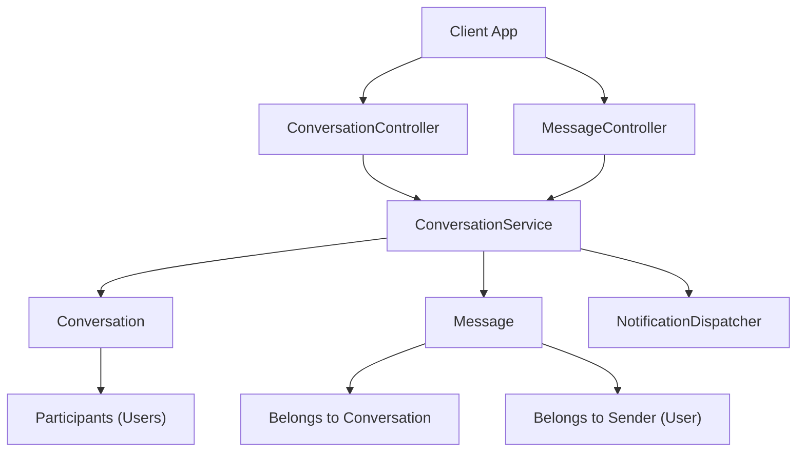
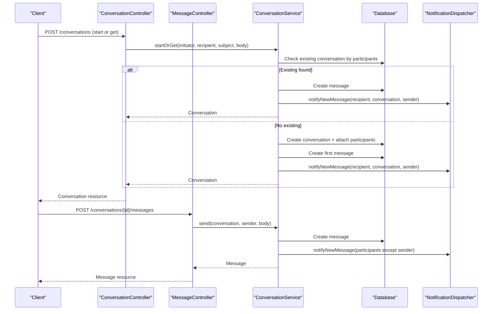
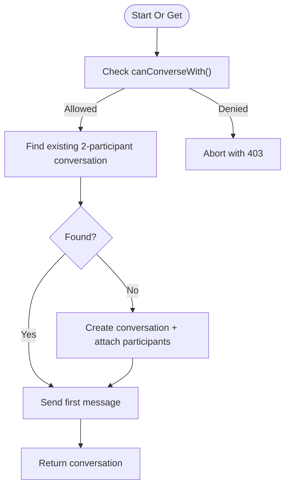
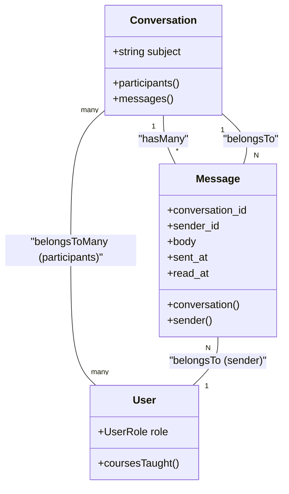
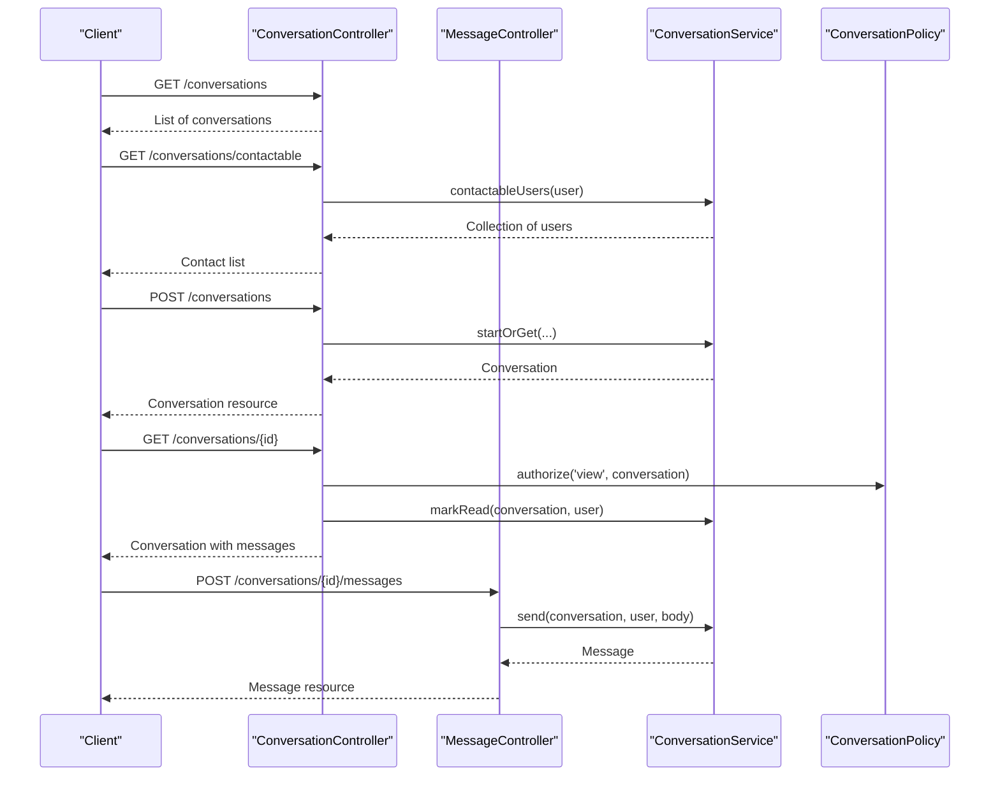
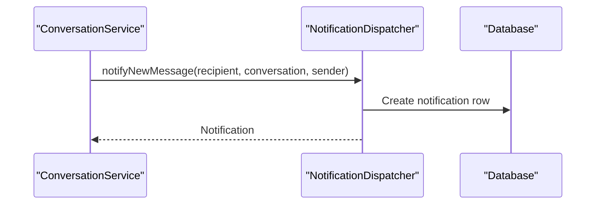
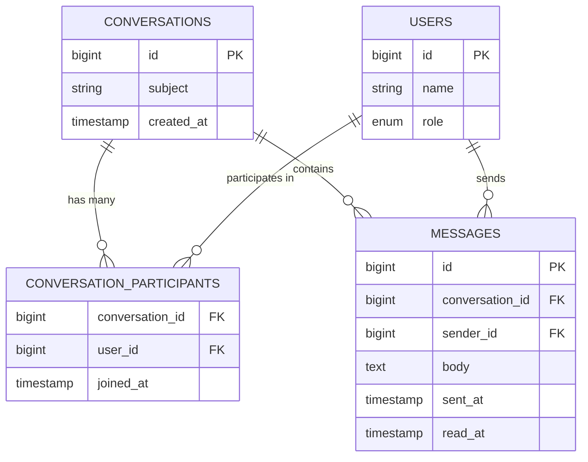
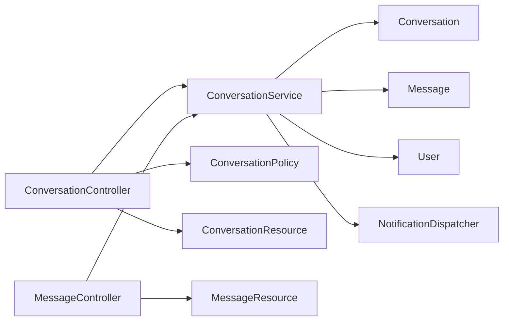

# Conversation Service

<cite>
**Referenced Files in This Document**
- [ConversationService.php](file://app/Services/Communication/ConversationService.php)
- [ConversationController.php](file://app/Http/Controllers/Api/V1/ConversationController.php)
- [MessageController.php](file://app/Http/Controllers/Api/V1/MessageController.php)
- [Conversation.php](file://app/Models/Conversation.php)
- [Message.php](file://app/Models/Message.php)
- [User.php](file://app/Models/User.php)
- [ConversationPolicy.php](file://app/Policies/ConversationPolicy.php)
- [NotificationDispatcher.php](file://app/Services/Notifications/NotificationDispatcher.php)
- [StoreConversationRequest.php](file://app/Http/Requests/Api/V1/StoreConversationRequest.php)
- [StoreMessageRequest.php](file://app/Http/Requests/Api/V1/StoreMessageRequest.php)
- [ConversationResource.php](file://app/Http/Resources/ConversationResource.php)
- [MessageResource.php](file://app/Http/Resources/MessageResource.php)
- [2024_01_01_000170_create_conversations_table.php](file://database/migrations/2024_01_01_000170_create_conversations_table.php)
- [2024_01_01_000171_create_conversation_participants_table.php](file://database/migrations/2024_01_01_000171_create_conversation_participants_table.php)
- [2024_01_01_000172_create_messages_table.php](file://database/migrations/2024_01_01_000172_create_messages_table.php)
</cite>

## Table of Contents
1. [Introduction](#introduction)
2. [Project Structure](#project-structure)
3. [Core Components](#core-components)
4. [Architecture Overview](#architecture-overview)
5. [Detailed Component Analysis](#detailed-component-analysis)
6. [Dependency Analysis](#dependency-analysis)
7. [Performance Considerations](#performance-considerations)
8. [Troubleshooting Guide](#troubleshooting-guide)
9. [Conclusion](#conclusion)
10. [Appendices](#appendices)

## Introduction
This document explains the Conversation Service that orchestrates direct messaging between users, conversation threading, and notification integration. It covers one-to-one conversations, message delivery, read receipts, participant management, persistence, and API usage patterns for creating conversations, sending messages, handling status updates, and listing contactable users. The service enforces role-based permissions to ensure only allowed user pairs can converse (Admin–Instructor, Admin–Student, Instructor–Student), with Student–Student messaging intentionally excluded in favor of forums.

## Project Structure
The conversation feature spans controllers, services, models, policies, requests, resources, and database migrations:
- Controllers expose REST endpoints for listing conversations, fetching contactable users, starting a conversation, viewing a conversation, and sending messages.
- The ConversationService encapsulates business logic: permission checks, conversation reuse, message creation, read receipt marking, and contact resolution.
- Models define entities and relationships for conversations, participants, and messages.
- Policies enforce view authorization; request classes validate inputs.
- Resources shape JSON responses including unread counts and last messages.
- Migrations define the schema for conversations, participants, and messages.

**Diagram sources**
- [ConversationController.php:21-61](file://app/Http/Controllers/Api/V1/ConversationController.php#L21-L61)
- [MessageController.php:17-22](file://app/Http/Controllers/Api/V1/MessageController.php#L17-L22)
- [ConversationService.php:27-111](file://app/Services/Communication/ConversationService.php#L27-L111)
- [Conversation.php:27-38](file://app/Models/Conversation.php#L27-L38)
- [Message.php:35-46](file://app/Models/Message.php#L35-L46)
- [NotificationDispatcher.php:81-91](file://app/Services/Notifications/NotificationDispatcher.php#L81-L91)

**Section sources**
- [ConversationController.php:21-61](file://app/Http/Controllers/Api/V1/ConversationController.php#L21-L61)
- [MessageController.php:17-22](file://app/Http/Controllers/Api/V1/MessageController.php#L17-L22)
- [ConversationService.php:27-111](file://app/Services/Communication/ConversationService.php#L27-L111)
- [Conversation.php:27-38](file://app/Models/Conversation.php#L27-L38)
- [Message.php:35-46](file://app/Models/Message.php#L35-L46)
- [NotificationDispatcher.php:81-91](file://app/Services/Notifications/NotificationDispatcher.php#L81-L91)

## Core Components
- ConversationService: Central orchestration for conversation lifecycle and messaging.
- Conversation and Message models: Define data structures and relationships.
- NotificationDispatcher: Creates in-app notifications for new messages.
- Controllers and Requests: Expose APIs and validate inputs.
- Policies: Enforce access control on conversations.
- Resources: Shape API responses with unread counts and last messages.

Key responsibilities:
- Validate whether two users can converse based on roles and enrollment relationships.
- Reuse existing one-to-one conversations between the same pair of users.
- Persist messages and notify recipients via in-app notifications.
- Mark messages as read per conversation and user.
- Provide lists of contactable users for composing messages.

**Section sources**
- [ConversationService.php:27-111](file://app/Services/Communication/ConversationService.php#L27-L111)
- [Conversation.php:20-38](file://app/Models/Conversation.php#L20-L38)
- [Message.php:19-46](file://app/Models/Message.php#L19-L46)
- [NotificationDispatcher.php:81-91](file://app/Services/Notifications/NotificationDispatcher.php#L81-L91)
- [ConversationPolicy.php:12-25](file://app/Policies/ConversationPolicy.php#L12-L25)
- [StoreConversationRequest.php:18-24](file://app/Http/Requests/Api/V1/StoreConversationRequest.php#L18-L24)
- [StoreMessageRequest.php:20-24](file://app/Http/Requests/Api/V1/StoreMessageRequest.php#L20-L24)
- [ConversationResource.php:19-38](file://app/Http/Resources/ConversationResource.php#L19-L38)
- [MessageResource.php:15-24](file://app/Http/Resources/MessageResource.php#L15-L24)

## Architecture Overview
The system follows a layered architecture:
- HTTP layer: Controllers handle requests and delegate to services.
- Service layer: Business rules live in ConversationService.
- Data layer: Eloquent models interact with the database.
- Notifications: In-app notifications are created for message events.

**Diagram sources**
- [ConversationController.php:40-52](file://app/Http/Controllers/Api/V1/ConversationController.php#L40-L52)
- [MessageController.php:17-22](file://app/Http/Controllers/Api/V1/MessageController.php#L17-L22)
- [ConversationService.php:50-97](file://app/Services/Communication/ConversationService.php#L50-L97)
- [NotificationDispatcher.php:81-91](file://app/Services/Notifications/NotificationDispatcher.php#L81-L91)

## Detailed Component Analysis

### ConversationService
Responsibilities:
- Permission enforcement: Ensures only allowed role pairs can converse.
- Conversation reuse: Finds an existing two-participant conversation between the same users.
- Message delivery: Persists messages and notifies all non-sender participants.
- Read receipts: Marks unread messages from others as read when a user views the conversation.
- Contact resolution: Returns users eligible for messaging based on roles and enrollments.

Implementation highlights:
- Role-based gating prevents self-messaging and disallows student-to-student conversations.
- Transactional creation ensures conversation, participants, and initial message are persisted atomically.
- Notification fan-out occurs after message creation for each non-sender participant.
- Read receipt update targets messages not sent by the reader and not yet marked read.

**Diagram sources**
- [ConversationService.php:27-79](file://app/Services/Communication/ConversationService.php#L27-L79)

**Section sources**
- [ConversationService.php:27-111](file://app/Services/Communication/ConversationService.php#L27-L111)

### Conversation and Message Models
- Conversation:
  - Has many messages.
  - Many-to-many relationship with Users through conversation_participants, tracking joined_at.
  - Updated timestamp disabled to simplify append-only semantics.
- Message:
  - Belongs to a Conversation and a Sender (User).
  - Tracks sent_at and optional read_at for read receipts.
  - Timestamps disabled; uses explicit sent_at/read_at fields.

**Diagram sources**
- [Conversation.php:20-38](file://app/Models/Conversation.php#L20-L38)
- [Message.php:19-46](file://app/Models/Message.php#L19-L46)
- [User.php:89-93](file://app/Models/User.php#L89-L93)

**Section sources**
- [Conversation.php:20-38](file://app/Models/Conversation.php#L20-L38)
- [Message.php:19-46](file://app/Models/Message.php#L19-L46)

### API Layer: Controllers and Requests
- ConversationController:
  - Lists conversations for the authenticated user.
  - Provides contactable users for composing messages.
  - Starts or retrieves a conversation and sends the first message.
  - Shows a conversation and marks messages as read.
- MessageController:
  - Sends a message into an existing conversation.
- Request validation:
  - StoreConversationRequest validates recipient_id, subject, and body.
  - StoreMessageRequest validates body and authorizes via conversation policy.

**Diagram sources**
- [ConversationController.php:21-61](file://app/Http/Controllers/Api/V1/ConversationController.php#L21-L61)
- [MessageController.php:17-22](file://app/Http/Controllers/Api/V1/MessageController.php#L17-L22)
- [StoreConversationRequest.php:18-24](file://app/Http/Requests/Api/V1/StoreConversationRequest.php#L18-L24)
- [StoreMessageRequest.php:20-24](file://app/Http/Requests/Api/V1/StoreMessageRequest.php#L20-L24)
- [ConversationPolicy.php:12-25](file://app/Policies/ConversationPolicy.php#L12-L25)

**Section sources**
- [ConversationController.php:21-61](file://app/Http/Controllers/Api/V1/ConversationController.php#L21-L61)
- [MessageController.php:17-22](file://app/Http/Controllers/Api/V1/MessageController.php#L17-L22)
- [StoreConversationRequest.php:18-24](file://app/Http/Requests/Api/V1/StoreConversationRequest.php#L18-L24)
- [StoreMessageRequest.php:20-24](file://app/Http/Requests/Api/V1/StoreMessageRequest.php#L20-L24)
- [ConversationPolicy.php:12-25](file://app/Policies/ConversationPolicy.php#L12-L25)

### Notification Integration
- New message notifications are created for every participant except the sender.
- Notifications are in-app only at this stage, stored in the notifications table with type, title, body, and related entity references.

**Diagram sources**
- [ConversationService.php:81-97](file://app/Services/Communication/ConversationService.php#L81-L97)
- [NotificationDispatcher.php:81-91](file://app/Services/Notifications/NotificationDispatcher.php#L81-L91)

**Section sources**
- [NotificationDispatcher.php:81-91](file://app/Services/Notifications/NotificationDispatcher.php#L81-L91)

### Persistence Schema
- Conversations: id, subject, created_at.
- Conversation participants: composite primary key (conversation_id, user_id), joined_at.
- Messages: id, conversation_id, sender_id, body, sent_at, read_at; indexed by conversation_id and sent_at.

**Diagram sources**
- [2024_01_01_000170_create_conversations_table.php:13-17](file://database/migrations/2024_01_01_000170_create_conversations_table.php#L13-L17)
- [2024_01_01_000171_create_conversation_participants_table.php:13-17](file://database/migrations/2024_01_01_000171_create_conversation_participants_table.php#L13-L17)
- [2024_01_01_000172_create_messages_table.php:13-21](file://database/migrations/2024_01_01_000172_create_messages_table.php#L13-L21)

**Section sources**
- [2024_01_01_000170_create_conversations_table.php:13-17](file://database/migrations/2024_01_01_000170_create_conversations_table.php#L13-L17)
- [2024_01_01_000171_create_conversation_participants_table.php:13-17](file://database/migrations/2024_01_01_000171_create_conversation_participants_table.php#L13-L17)
- [2024_01_01_000172_create_messages_table.php:13-21](file://database/migrations/2024_01_01_000172_create_messages_table.php#L13-L21)

## Dependency Analysis
- Controllers depend on ConversationService for business logic.
- ConversationService depends on:
  - Models: Conversation, Message, User, Enrolment.
  - NotificationDispatcher for in-app notifications.
  - Database transactions for atomic operations.
- Policies gate view access to conversations.
- Resources format responses and compute derived values like unread_count and last_message.

**Diagram sources**
- [ConversationController.php:21-61](file://app/Http/Controllers/Api/V1/ConversationController.php#L21-L61)
- [MessageController.php:17-22](file://app/Http/Controllers/Api/V1/MessageController.php#L17-L22)
- [ConversationService.php:27-111](file://app/Services/Communication/ConversationService.php#L27-L111)
- [ConversationPolicy.php:12-25](file://app/Policies/ConversationPolicy.php#L12-L25)
- [ConversationResource.php:19-38](file://app/Http/Resources/ConversationResource.php#L19-L38)
- [MessageResource.php:15-24](file://app/Http/Resources/MessageResource.php#L15-L24)

**Section sources**
- [ConversationService.php:27-111](file://app/Services/Communication/ConversationService.php#L27-L111)
- [ConversationController.php:21-61](file://app/Http/Controllers/Api/V1/ConversationController.php#L21-L61)
- [MessageController.php:17-22](file://app/Http/Controllers/Api/V1/MessageController.php#L17-L22)
- [ConversationPolicy.php:12-25](file://app/Policies/ConversationPolicy.php#L12-L25)
- [ConversationResource.php:19-38](file://app/Http/Resources/ConversationResource.php#L19-L38)
- [MessageResource.php:15-24](file://app/Http/Resources/MessageResource.php#L15-L24)

## Performance Considerations
- Conversation lookup uses eager loading and count filters to avoid N+1 queries when reusing existing threads.
- Message indexing on conversation_id and sent_at supports efficient retrieval and ordering.
- Read receipt marking performs a single bulk update per conversation and user, minimizing round trips.
- Contactable user queries leverage joins through enrolments and courses taught to limit result sets appropriately per role.

[No sources needed since this section provides general guidance]

## Troubleshooting Guide
Common issues and resolutions:
- Forbidden when starting a conversation: Ensure both users satisfy role-pair rules; Student–Student is not allowed.
- Missing notifications: Verify that the recipient is not the sender and that notifications are enabled for in-app channels.
- Read receipts not updating: Confirm the user is a participant and that messages were sent by another user and are still unread.
- Authorization errors: Ensure the user is a participant to view or send messages in a conversation.

Operational checks:
- Validate request payloads using StoreConversationRequest and StoreMessageRequest.
- Inspect conversation participants and message timestamps to diagnose state inconsistencies.
- Review notification records for new_message entries linked to the conversation.

**Section sources**
- [ConversationService.php:27-44](file://app/Services/Communication/ConversationService.php#L27-L44)
- [ConversationService.php:81-111](file://app/Services/Communication/ConversationService.php#L81-L111)
- [ConversationPolicy.php:12-25](file://app/Policies/ConversationPolicy.php#L12-L25)
- [StoreConversationRequest.php:18-24](file://app/Http/Requests/Api/V1/StoreConversationRequest.php#L18-L24)
- [StoreMessageRequest.php:20-24](file://app/Http/Requests/Api/V1/StoreMessageRequest.php#L20-L24)

## Conclusion
The Conversation Service provides a robust foundation for one-to-one direct messaging with clear role-based permissions, reliable persistence, and integrated in-app notifications. It supports conversation reuse, message delivery, read receipts, and participant management through well-defined models and controllers. While group conversations are not part of this MVP, the design cleanly isolates business rules and leaves room for future extensions such as real-time delivery and advanced search capabilities.

[No sources needed since this section summarizes without analyzing specific files]

## Appendices

### API Usage Examples
- Create or retrieve a conversation and send the first message:
  - Endpoint: POST /api/v1/conversations
  - Payload: recipient_id, subject (optional), body
  - Behavior: If a two-participant conversation exists between initiator and recipient, it is reused and the first message is appended; otherwise, a new conversation is created with both participants and the first message.
  - Response: Conversation resource with participants and messages.

- Send a message to an existing conversation:
  - Endpoint: POST /api/v1/conversations/{conversation}/messages
  - Payload: body
  - Behavior: Creates a message and notifies all non-sender participants.
  - Response: Message resource with sender details.

- List conversations for the current user:
  - Endpoint: GET /api/v1/conversations
  - Response: Collection of conversations with participants and last message.

- Fetch contactable users for composing messages:
  - Endpoint: GET /api/v1/conversations/contactable
  - Response: Collection of users eligible to message based on roles and enrollments.

- View a conversation and mark messages as read:
  - Endpoint: GET /api/v1/conversations/{conversation}
  - Behavior: Authorizes view access and marks unread messages from others as read.
  - Response: Conversation resource with messages and sender details.

**Section sources**
- [ConversationController.php:21-61](file://app/Http/Controllers/Api/V1/ConversationController.php#L21-L61)
- [MessageController.php:17-22](file://app/Http/Controllers/Api/V1/MessageController.php#L17-L22)
- [StoreConversationRequest.php:18-24](file://app/Http/Requests/Api/V1/StoreConversationRequest.php#L18-L24)
- [StoreMessageRequest.php:20-24](file://app/Http/Requests/Api/V1/StoreMessageRequest.php#L20-L24)
- [ConversationResource.php:19-38](file://app/Http/Resources/ConversationResource.php#L19-L38)
- [MessageResource.php:15-24](file://app/Http/Resources/MessageResource.php#L15-L24)