# Forum Service

<cite>
**Referenced Files in This Document**
- [ForumService.php](file://app/Services/Communication/ForumService.php)
- [ForumThreadController.php](file://app/Http/Controllers/Api/V1/ForumThreadController.php)
- [ForumPostController.php](file://app/Http/Controllers/Api/V1/ForumPostController.php)
- [ForumController.php](file://app/Http/Controllers/Api/V1/ForumController.php)
- [ForumTagController.php](file://app/Http/Controllers/Api/V1/ForumTagController.php)
- [ForumThreadPolicy.php](file://app/Policies/ForumThreadPolicy.php)
- [ForumPostPolicy.php](file://app/Policies/ForumPostPolicy.php)
- [NotificationDispatcher.php](file://app/Services/Notifications/NotificationDispatcher.php)
- [Forum.php](file://app/Models/Forum.php)
- [ForumThread.php](file://app/Models/ForumThread.php)
- [ForumPost.php](file://app/Models/ForumPost.php)
- [ForumTag.php](file://app/Models/ForumTag.php)
- [ForumPostReport.php](file://app/Models/ForumPostReport.php)
- [ForumPostReportController.php](file://app/Http/Controllers/Api/V1/ForumPostReportController.php)
- [ForumPostAttachmentType.php](file://app/Enums/ForumPostAttachmentType.php)
</cite>

## Table of Contents
1. [Introduction](#introduction)
2. [Project Structure](#project-structure)
3. [Core Components](#core-components)
4. [Architecture Overview](#architecture-overview)
5. [Detailed Component Analysis](#detailed-component-analysis)
6. [Dependency Analysis](#dependency-analysis)
7. [Performance Considerations](#performance-considerations)
8. [Troubleshooting Guide](#troubleshooting-guide)
9. [Conclusion](#conclusion)

## Introduction
This document explains the ForumService and its surrounding system for managing forum discussions, threads, posts, tags, moderation, and user interactions within courses. It covers how threads are created, replies posted, attachments handled, tags synchronized, read status tracked, and notifications dispatched. It also documents permission enforcement via policies, reporting workflows, and search/filtering capabilities exposed by the API controllers.

## Project Structure
The forum feature is implemented as a layered service:
- Controllers expose REST endpoints for listing forums, threads, posts, tags, and handling reports.
- The ForumService encapsulates business logic for creating threads, replying, updating/deleting posts, marking threads solved, syncing tags, and storing/removing attachments.
- Policies enforce permissions for viewing, posting, editing, deleting, and moderating content.
- Models define entities (Forum, ForumThread, ForumPost, ForumTag) and relationships.
- NotificationDispatcher records in-app notifications for forum activity.
- Enums define attachment types.

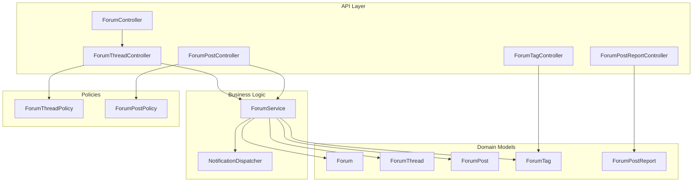

**Diagram sources**
- [ForumController.php:1-100](file://app/Http/Controllers/Api/V1/ForumController.php#L1-L100)
- [ForumThreadController.php:1-115](file://app/Http/Controllers/Api/V1/ForumThreadController.php#L1-L115)
- [ForumPostController.php:1-70](file://app/Http/Controllers/Api/V1/ForumPostController.php#L1-L70)
- [ForumTagController.php:1-24](file://app/Http/Controllers/Api/V1/ForumTagController.php#L1-L24)
- [ForumPostReportController.php:1-54](file://app/Http/Controllers/Api/V1/ForumPostReportController.php#L1-L54)
- [ForumService.php:1-223](file://app/Services/Communication/ForumService.php#L1-L223)
- [NotificationDispatcher.php:1-206](file://app/Services/Notifications/NotificationDispatcher.php#L1-L206)
- [Forum.php:1-41](file://app/Models/Forum.php#L1-L41)
- [ForumThread.php:1-94](file://app/Models/ForumThread.php#L1-L94)
- [ForumPost.php:1-56](file://app/Models/ForumPost.php#L1-L56)
- [ForumTag.php:1-32](file://app/Models/ForumTag.php#L1-L32)
- [ForumPostReport.php:1-47](file://app/Models/ForumPostReport.php#L1-L47)
- [ForumThreadPolicy.php:1-51](file://app/Policies/ForumThreadPolicy.php#L1-L51)
- [ForumPostPolicy.php:1-43](file://app/Policies/ForumPostPolicy.php#L1-L43)

**Section sources**
- [ForumService.php:1-223](file://app/Services/Communication/ForumService.php#L1-L223)
- [ForumThreadController.php:1-115](file://app/Http/Controllers/Api/V1/ForumThreadController.php#L1-L115)
- [ForumPostController.php:1-70](file://app/Http/Controllers/Api/V1/ForumPostController.php#L1-L70)
- [ForumController.php:1-100](file://app/Http/Controllers/Api/V1/ForumController.php#L1-L100)
- [ForumTagController.php:1-24](file://app/Http/Controllers/Api/V1/ForumTagController.php#L1-L24)
- [ForumPostReportController.php:1-54](file://app/Http/Controllers/Api/V1/ForumPostReportController.php#L1-L54)
- [ForumThreadPolicy.php:1-51](file://app/Policies/ForumThreadPolicy.php#L1-L51)
- [ForumPostPolicy.php:1-43](file://app/Policies/ForumPostPolicy.php#L1-L43)
- [NotificationDispatcher.php:1-206](file://app/Services/Notifications/NotificationDispatcher.php#L1-L206)
- [Forum.php:1-41](file://app/Models/Forum.php#L1-L41)
- [ForumThread.php:1-94](file://app/Models/ForumThread.php#L1-L94)
- [ForumPost.php:1-56](file://app/Models/ForumPost.php#L1-L56)
- [ForumTag.php:1-32](file://app/Models/ForumTag.php#L1-L32)
- [ForumPostReport.php:1-47](file://app/Models/ForumPostReport.php#L1-L47)

## Core Components
- ForumService: Central orchestrator for thread creation, replies, post updates/deletions, tag synchronization, read tracking, and solving threads. Integrates with storage and notifications.
- Controllers: Provide REST APIs for forums, threads, posts, tags, and reports; apply authorization and delegate to services.
- Policies: Enforce who can view, create, edit, delete, or moderate forum content based on enrollment, role, and thread state.
- Models: Represent Forum, ForumThread, ForumPost, ForumTag, and ForumPostReport with relationships and casts.
- NotificationDispatcher: Creates in-app notifications for forum replies and solved threads.
- Enum: Defines allowed attachment types for posts.

**Section sources**
- [ForumService.php:1-223](file://app/Services/Communication/ForumService.php#L1-L223)
- [ForumThreadController.php:1-115](file://app/Http/Controllers/Api/V1/ForumThreadController.php#L1-L115)
- [ForumPostController.php:1-70](file://app/Http/Controllers/Api/V1/ForumPostController.php#L1-L70)
- [ForumController.php:1-100](file://app/Http/Controllers/Api/V1/ForumController.php#L1-L100)
- [ForumTagController.php:1-24](file://app/Http/Controllers/Api/V1/ForumTagController.php#L1-L24)
- [ForumPostReportController.php:1-54](file://app/Http/Controllers/Api/V1/ForumPostReportController.php#L1-L54)
- [ForumThreadPolicy.php:1-51](file://app/Policies/ForumThreadPolicy.php#L1-L51)
- [ForumPostPolicy.php:1-43](file://app/Policies/ForumPostPolicy.php#L1-L43)
- [NotificationDispatcher.php:1-206](file://app/Services/Notifications/NotificationDispatcher.php#L1-L206)
- [ForumPostAttachmentType.php:1-14](file://app/Enums/ForumPostAttachmentType.php#L1-L14)

## Architecture Overview
The forum system follows a clean separation of concerns:
- HTTP layer (controllers) validates requests, enforces policies, and delegates to services.
- Business logic (ForumService) handles domain rules, transactions, storage integration, and notifications.
- Data access (Eloquent models) defines entities and relationships.
- Authorization (policies) centralizes permission checks.
- Notifications (NotificationDispatcher) persist in-app messages for relevant events.

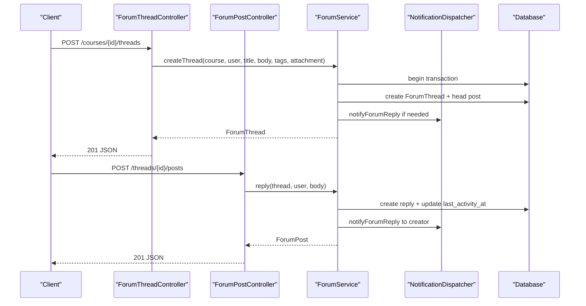

**Diagram sources**
- [ForumThreadController.php:71-84](file://app/Http/Controllers/Api/V1/ForumThreadController.php#L71-L84)
- [ForumPostController.php:41-46](file://app/Http/Controllers/Api/V1/ForumPostController.php#L41-L46)
- [ForumService.php:50-107](file://app/Services/Communication/ForumService.php#L50-L107)
- [NotificationDispatcher.php:113-122](file://app/Services/Notifications/NotificationDispatcher.php#L113-L122)

## Detailed Component Analysis

### ForumService
Responsibilities:
- Ensure a per-course forum exists (lazy creation).
- Create threads with an initial post and optional attachments; sync tags.
- Allow users to reply to threads; update thread activity; notify thread creator.
- Staff-only mark-as-solved with notification to thread creator.
- Track per-user read status for threads.
- Update posts with optional new attachments or removal; toggle article mode without file.
- Delete posts; deleting head post removes entire thread.

Key behaviors:
- Transactions protect thread and head post creation.
- Tag synchronization creates or reuses tags case-insensitively and syncs relations.
- Attachment lifecycle managed via MediaStorageService.

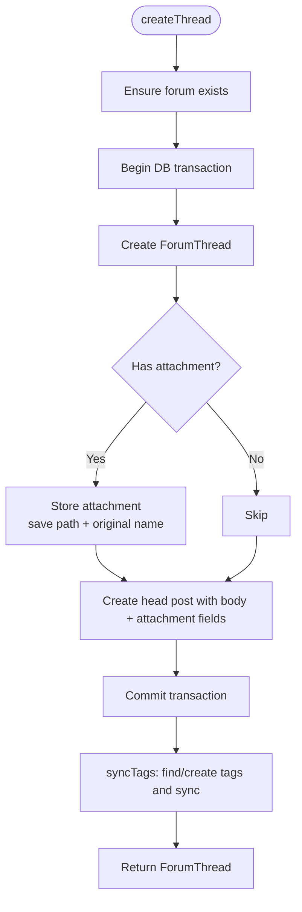

**Diagram sources**
- [ForumService.php:50-86](file://app/Services/Communication/ForumService.php#L50-L86)
- [ForumService.php:136-153](file://app/Services/Communication/ForumService.php#L136-L153)

**Section sources**
- [ForumService.php:39-86](file://app/Services/Communication/ForumService.php#L39-L86)
- [ForumService.php:92-107](file://app/Services/Communication/ForumService.php#L92-L107)
- [ForumService.php:113-128](file://app/Services/Communication/ForumService.php#L113-L128)
- [ForumService.php:155-185](file://app/Services/Communication/ForumService.php#L155-L185)
- [ForumService.php:191-221](file://app/Services/Communication/ForumService.php#L191-L221)

### ForumThreadController
Capabilities:
- List threads with search (title or full-text post body), filters (mine, tags), sorting (latest_activity, newest, most_replies), and pagination.
- Create threads via service.
- Show thread details and mark as read.
- Moderate threads (pin, lock, solve) with policy enforcement.

Search and filtering:
- Title match uses LIKE; post bodies use full-text search mode.
- Tags filter by any provided tag IDs.
- Read status merged into response for viewer context.

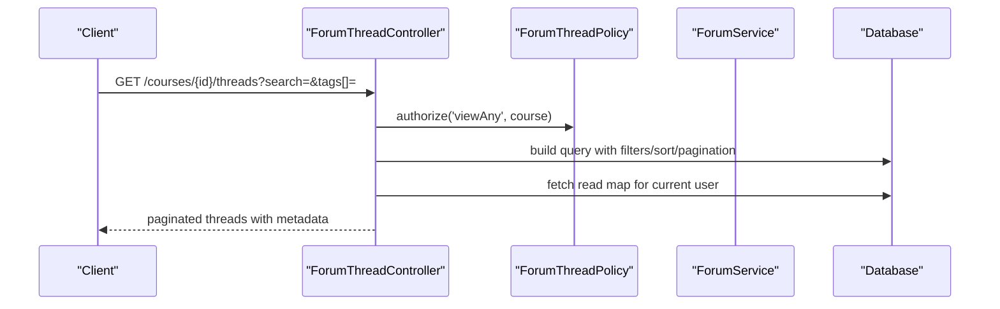

**Diagram sources**
- [ForumThreadController.php:30-69](file://app/Http/Controllers/Api/V1/ForumThreadController.php#L30-L69)
- [ForumThreadPolicy.php:19-29](file://app/Policies/ForumThreadPolicy.php#L19-L29)

**Section sources**
- [ForumThreadController.php:30-113](file://app/Http/Controllers/Api/V1/ForumThreadController.php#L30-L113)
- [ForumThreadPolicy.php:19-49](file://app/Policies/ForumThreadPolicy.php#L19-L49)

### ForumPostController
Capabilities:
- List replies excluding the head post, oldest-first, paginated.
- Create replies via service.
- Update posts with optional attachment changes or article mode toggling.
- Delete posts with policy check; deleting head post removes thread.

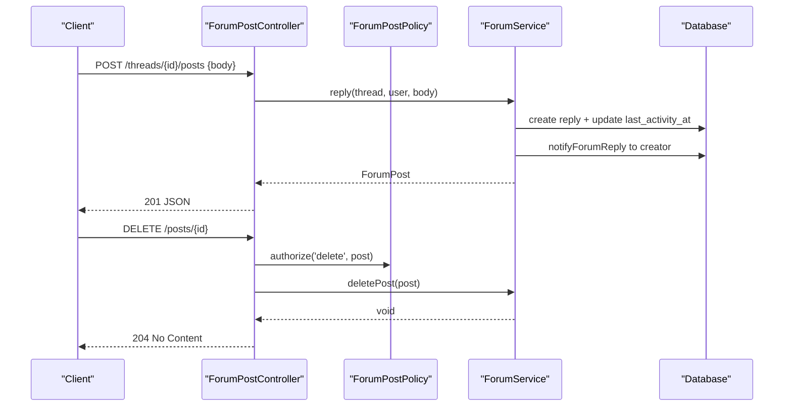

**Diagram sources**
- [ForumPostController.php:26-68](file://app/Http/Controllers/Api/V1/ForumPostController.php#L26-L68)
- [ForumPostPolicy.php:14-32](file://app/Policies/ForumPostPolicy.php#L14-L32)
- [ForumService.php:92-107](file://app/Services/Communication/ForumService.php#L92-L107)
- [ForumService.php:191-202](file://app/Services/Communication/ForumService.php#L191-L202)

**Section sources**
- [ForumPostController.php:26-68](file://app/Http/Controllers/Api/V1/ForumPostController.php#L26-L68)
- [ForumPostPolicy.php:14-41](file://app/Policies/ForumPostPolicy.php#L14-L41)
- [ForumService.php:92-107](file://app/Services/Communication/ForumService.php#L92-L107)
- [ForumService.php:191-202](file://app/Services/Communication/ForumService.php#L191-L202)

### ForumController
Provides a unified list of all forums accessible to the authenticated user across enrolled courses, including recent activity and unread counts.

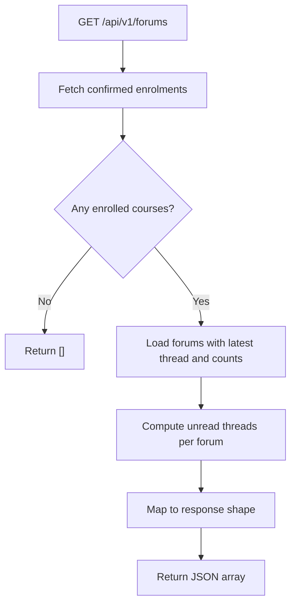

**Diagram sources**
- [ForumController.php:32-97](file://app/Http/Controllers/Api/V1/ForumController.php#L32-L97)

**Section sources**
- [ForumController.php:32-97](file://app/Http/Controllers/Api/V1/ForumController.php#L32-L97)

### ForumTagController
Exposes global tags for autocomplete used by the composer.

**Section sources**
- [ForumTagController.php:19-22](file://app/Http/Controllers/Api/V1/ForumTagController.php#L19-L22)

### Reporting and Moderation
Users can report posts; staff can review reports within a course scope.

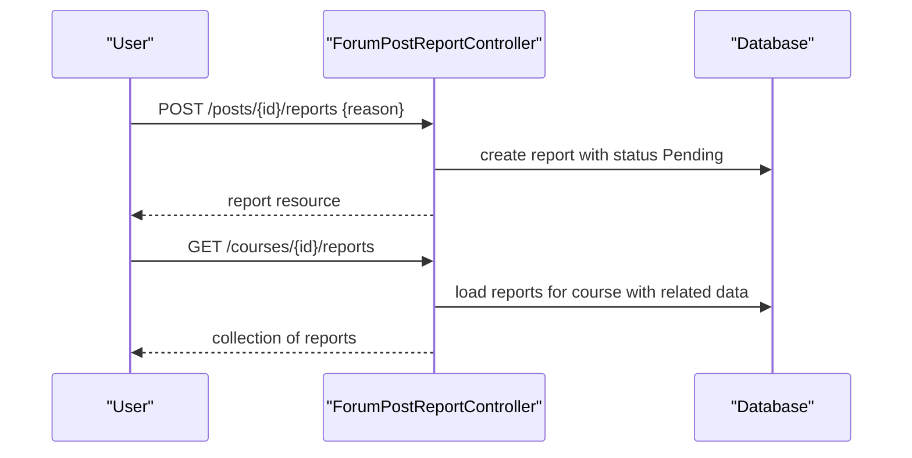

**Diagram sources**
- [ForumPostReportController.php:19-52](file://app/Http/Controllers/Api/V1/ForumPostReportController.php#L19-L52)

**Section sources**
- [ForumPostReportController.php:19-52](file://app/Http/Controllers/Api/V1/ForumPostReportController.php#L19-L52)
- [ForumPostReport.php:13-47](file://app/Models/ForumPostReport.php#L13-L47)

### Data Model Relationships
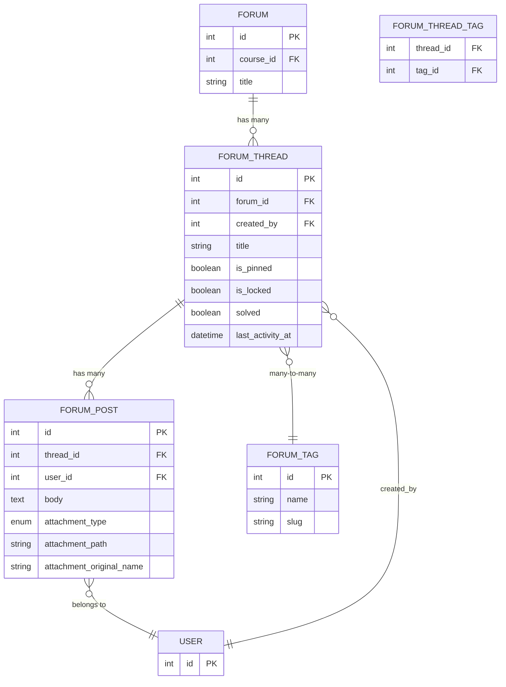

**Diagram sources**
- [Forum.php:20-39](file://app/Models/Forum.php#L20-L39)
- [ForumThread.php:22-92](file://app/Models/ForumThread.php#L22-L92)
- [ForumPost.php:19-54](file://app/Models/ForumPost.php#L19-L54)
- [ForumTag.php:19-30](file://app/Models/ForumTag.php#L19-L30)

**Section sources**
- [Forum.php:20-39](file://app/Models/Forum.php#L20-L39)
- [ForumThread.php:22-92](file://app/Models/ForumThread.php#L22-L92)
- [ForumPost.php:19-54](file://app/Models/ForumPost.php#L19-L54)
- [ForumTag.php:19-30](file://app/Models/ForumTag.php#L19-L30)

### Permission Model
- View/Create: Confirmed-enrolled students, instructors teaching the course, or admins.
- Edit Posts: Author only.
- Delete Posts: Author or staff (instructor/admin of the course).
- Moderate Threads: Instructors/admins only (pin, lock, solve).

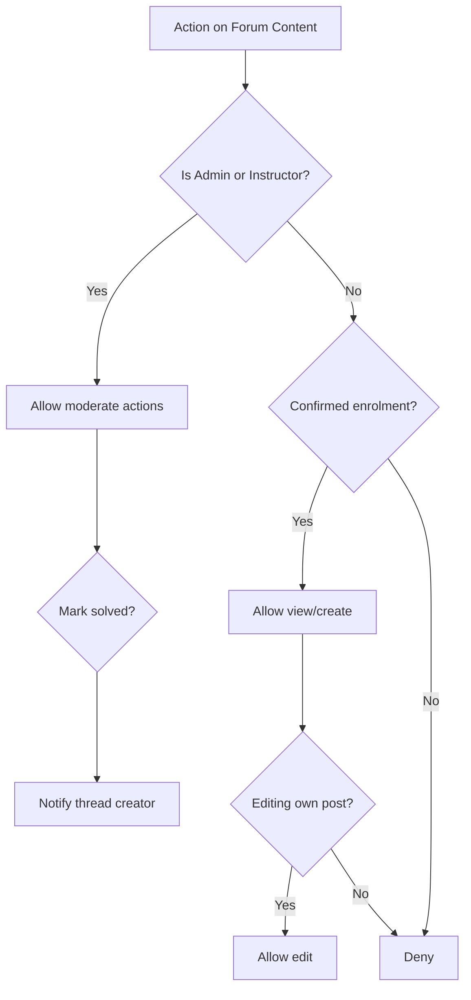

**Diagram sources**
- [ForumThreadPolicy.php:19-49](file://app/Policies/ForumThreadPolicy.php#L19-L49)
- [ForumPostPolicy.php:14-41](file://app/Policies/ForumPostPolicy.php#L14-L41)
- [ForumService.php:113-120](file://app/Services/Communication/ForumService.php#L113-L120)

**Section sources**
- [ForumThreadPolicy.php:19-49](file://app/Policies/ForumThreadPolicy.php#L19-L49)
- [ForumPostPolicy.php:14-41](file://app/Policies/ForumPostPolicy.php#L14-L41)

### Notification Integration
- On reply: notifies the thread creator unless the replier is the creator.
- On mark solved: notifies the thread creator unless the actor is the creator.
- Notifications are persisted in-app with type, title, body, and related entity references.

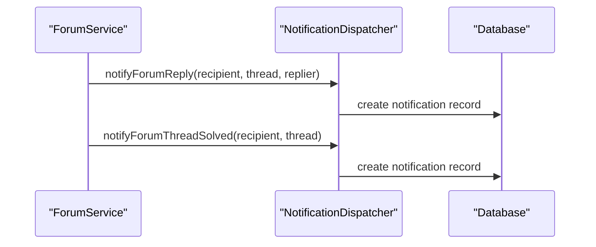

**Diagram sources**
- [ForumService.php:102-119](file://app/Services/Communication/ForumService.php#L102-L119)
- [NotificationDispatcher.php:113-136](file://app/Services/Notifications/NotificationDispatcher.php#L113-L136)

**Section sources**
- [ForumService.php:102-119](file://app/Services/Communication/ForumService.php#L102-L119)
- [NotificationDispatcher.php:113-136](file://app/Services/Notifications/NotificationDispatcher.php#L113-L136)

### Search and Filtering
- Thread listing supports:
  - Text search across thread titles and post bodies using full-text index on post bodies.
  - Filter by tags (any of provided tag IDs).
  - Scope to current user’s threads.
  - Sorting by latest activity, newest, or most replies; pinned threads always first.
- Unread calculation considers missing read records or last activity after last read timestamp.

**Section sources**
- [ForumThreadController.php:30-69](file://app/Http/Controllers/Api/V1/ForumThreadController.php#L30-L69)
- [ForumController.php:57-76](file://app/Http/Controllers/Api/V1/ForumController.php#L57-L76)

## Dependency Analysis
- ForumService depends on:
  - Models: Forum, ForumThread, ForumPost, ForumTag.
  - Services: NotificationDispatcher, MediaStorageService.
  - Database transactions for atomic operations.
- Controllers depend on:
  - ForumService for business logic.
  - Policies for authorization.
  - Resources for response shaping.
- Models define relationships that drive queries and eager loading.

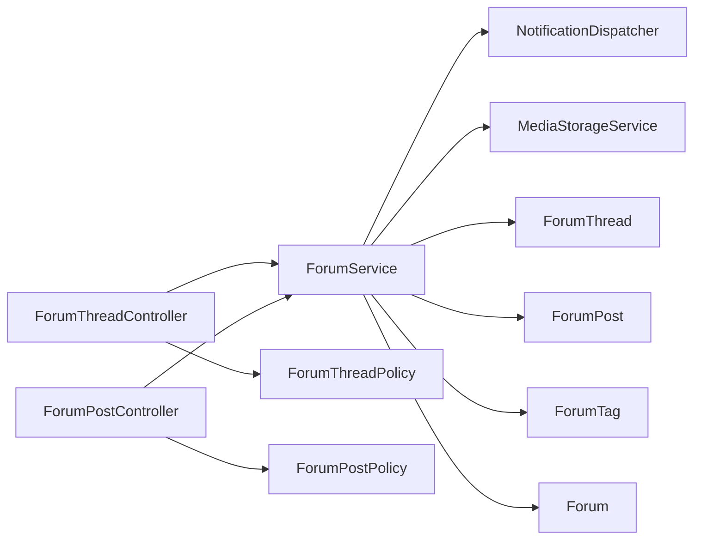

**Diagram sources**
- [ForumService.php:34-37](file://app/Services/Communication/ForumService.php#L34-L37)
- [ForumThreadController.php:21-21](file://app/Http/Controllers/Api/V1/ForumThreadController.php#L21-L21)
- [ForumPostController.php:20-20](file://app/Http/Controllers/Api/V1/ForumPostController.php#L20-L20)
- [ForumThreadPolicy.php:13-49](file://app/Policies/ForumThreadPolicy.php#L13-L49)
- [ForumPostPolicy.php:12-41](file://app/Policies/ForumPostPolicy.php#L12-L41)

**Section sources**
- [ForumService.php:34-37](file://app/Services/Communication/ForumService.php#L34-L37)
- [ForumThreadController.php:21-21](file://app/Http/Controllers/Api/V1/ForumThreadController.php#L21-L21)
- [ForumPostController.php:20-20](file://app/Http/Controllers/Api/V1/ForumPostController.php#L20-L20)
- [ForumThreadPolicy.php:13-49](file://app/Policies/ForumThreadPolicy.php#L13-L49)
- [ForumPostPolicy.php:12-41](file://app/Policies/ForumPostPolicy.php#L12-L41)

## Performance Considerations
- Use full-text search on post bodies for efficient content discovery.
- Paginate thread lists and replies to limit payload size.
- Eager-load necessary relations (creator, head/post users, tags) to avoid N+1 queries.
- Compute unread counts efficiently using raw SQL conditions against read table.
- Keep transactions small and focused around critical writes (thread creation).

[No sources needed since this section provides general guidance]

## Troubleshooting Guide
Common issues and resolutions:
- Cannot create thread:
  - Verify user has viewAny permission on the course (enrolled/instructor/admin).
  - Ensure forum exists or is lazily created.
- Reply fails:
  - Check thread is not locked; policy prevents posting to locked threads.
  - Confirm body validation passes.
- Post cannot be edited:
  - Only the author can edit their posts; staff can delete but not rewrite others’ posts.
- Deleting post does not remove thread:
  - Deleting non-head posts only removes the reply; deleting head post removes entire thread.
- Notifications not received:
  - Ensure NotificationDispatcher is invoked for replies and solved events; verify recipient is not the same as actor where applicable.
- Reports not visible:
  - Moderation queue requires instructor/admin of the course; ensure correct authorization.

**Section sources**
- [ForumThreadPolicy.php:19-49](file://app/Policies/ForumThreadPolicy.php#L19-L49)
- [ForumPostPolicy.php:14-41](file://app/Policies/ForumPostPolicy.php#L14-L41)
- [ForumService.php:92-107](file://app/Services/Communication/ForumService.php#L92-L107)
- [ForumService.php:191-202](file://app/Services/Communication/ForumService.php#L191-L202)
- [ForumPostReportController.php:34-45](file://app/Http/Controllers/Api/V1/ForumPostReportController.php#L34-L45)

## Conclusion
The ForumService provides a robust foundation for course-scoped discussion forums with clear separation between API, business logic, and data layers. It supports rich features such as threaded discussions, attachments, tagging, read tracking, moderation, reporting, and notifications. Permissions are enforced consistently through policies, and search/filtering capabilities enable efficient community interaction. Future enhancements can extend moderation workflows, spam detection, and advanced search indexing while maintaining the current modular architecture.