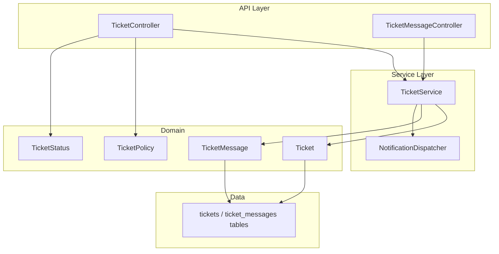
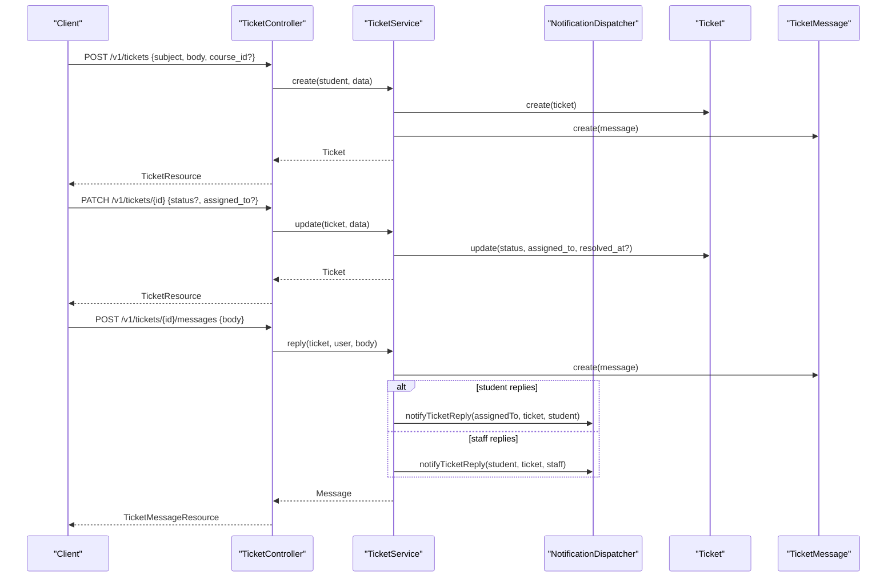
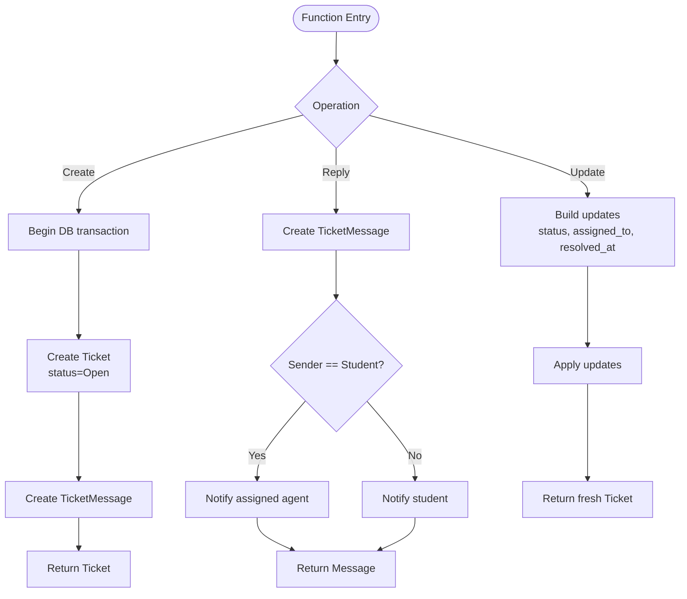
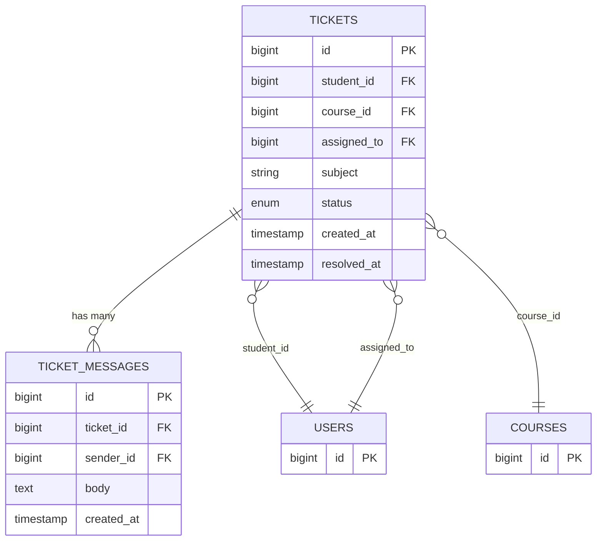
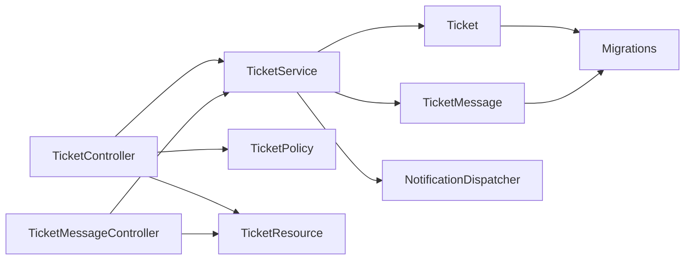

# Ticket Service

<cite>
**Referenced Files in This Document**
- [TicketService.php](file://app/Services/Communication/TicketService.php)
- [TicketController.php](file://app/Http/Controllers/Api/V1/TicketController.php)
- [TicketMessageController.php](file://app/Http/Controllers/Api/V1/TicketMessageController.php)
- [Ticket.php](file://app/Models/Ticket.php)
- [TicketMessage.php](file://app/Models/TicketMessage.php)
- [TicketStatus.php](file://app/Enums/TicketStatus.php)
- [NotificationDispatcher.php](file://app/Services/Notifications/NotificationDispatcher.php)
- [TicketPolicy.php](file://app/Policies/TicketPolicy.php)
- [StoreTicketRequest.php](file://app/Http/Requests/Api/V1/StoreTicketRequest.php)
- [UpdateTicketRequest.php](file://app/Http/Requests/Api/V1/UpdateTicketRequest.php)
- [TicketResource.php](file://app/Http/Resources/TicketResource.php)
- [2024_01_01_000173_create_tickets_table.php](file://database/migrations/2024_01_01_000173_create_tickets_table.php)
- [2024_01_01_000174_create_ticket_messages_table.php](file://database/migrations/2024_01_01_000174_create_ticket_messages_table.php)
- [api.php](file://routes/api.php)
</cite>

## Table of Contents
1. [Introduction](#introduction)
2. [Project Structure](#project-structure)
3. [Core Components](#core-components)
4. [Architecture Overview](#architecture-overview)
5. [Detailed Component Analysis](#detailed-component-analysis)
6. [Dependency Analysis](#dependency-analysis)
7. [Performance Considerations](#performance-considerations)
8. [Troubleshooting Guide](#troubleshooting-guide)
9. [Conclusion](#conclusion)
10. [Appendices](#appendices)

## Introduction
This document explains the Ticket Service that manages student support tickets, including creation, messaging, assignment, status transitions, and resolution tracking. It covers how tickets are created by students, replied to by both students and staff, assigned to instructors or admins, and updated with status changes that record resolution timestamps. It also documents integration points for notifications and outlines where email, analytics, and automated responses can be extended.

## Project Structure
The ticketing feature spans controllers, a service layer, models, enums, policies, requests, resources, and database migrations:
- Controllers expose REST endpoints for listing, creating, viewing, updating tickets and adding messages.
- The service encapsulates business logic for creating tickets, replying, and updating assignments/status.
- Models define entities and relationships (ticket, message, sender, student, course, assignee).
- Enums define allowed statuses.
- Policies enforce role-based access control.
- Requests validate inputs.
- Resources shape API responses.
- Migrations define schema for tickets and messages.

**Diagram sources**
- [TicketController.php:1-63](file://app/Http/Controllers/Api/V1/TicketController.php#L1-L63)
- [TicketMessageController.php:1-24](file://app/Http/Controllers/Api/V1/TicketMessageController.php#L1-L24)
- [TicketService.php:1-88](file://app/Services/Communication/TicketService.php#L1-L88)
- [NotificationDispatcher.php:1-206](file://app/Services/Notifications/NotificationDispatcher.php#L1-L206)
- [Ticket.php:1-67](file://app/Models/Ticket.php#L1-L67)
- [TicketMessage.php:1-41](file://app/Models/TicketMessage.php#L1-L41)
- [TicketStatus.php:1-14](file://app/Enums/TicketStatus.php#L1-L14)
- [TicketPolicy.php:1-41](file://app/Policies/TicketPolicy.php#L1-L41)
- [2024_01_01_000173_create_tickets_table.php:1-30](file://database/migrations/2024_01_01_000173_create_tickets_table.php#L1-L30)
- [2024_01_01_000174_create_ticket_messages_table.php:1-27](file://database/migrations/2024_01_01_000174_create_ticket_messages_table.php#L1-L27)

**Section sources**
- [TicketController.php:1-63](file://app/Http/Controllers/Api/V1/TicketController.php#L1-L63)
- [TicketMessageController.php:1-24](file://app/Http/Controllers/Api/V1/TicketMessageController.php#L1-L24)
- [TicketService.php:1-88](file://app/Services/Communication/TicketService.php#L1-L88)
- [Ticket.php:1-67](file://app/Models/Ticket.php#L1-L67)
- [TicketMessage.php:1-41](file://app/Models/TicketMessage.php#L1-L41)
- [TicketStatus.php:1-14](file://app/Enums/TicketStatus.php#L1-L14)
- [TicketPolicy.php:1-41](file://app/Policies/TicketPolicy.php#L1-L41)
- [2024_01_01_000173_create_tickets_table.php:1-30](file://database/migrations/2024_01_01_000173_create_tickets_table.php#L1-L30)
- [2024_01_01_000174_create_ticket_messages_table.php:1-27](file://database/migrations/2024_01_01_000174_create_ticket_messages_table.php#L1-L27)

## Core Components
- TicketService: Orchestrates ticket lifecycle operations (create, reply, update), handles transactional writes, and triggers notifications.
- Ticket and TicketMessage models: Define entities, relationships, casts, and fillable fields.
- TicketStatus enum: Enumerates open, in_progress, resolved, closed states.
- NotificationDispatcher: Creates in-app notifications for ticket replies.
- Controllers and Requests: Expose REST endpoints and validate inputs.
- Policies: Enforce authorization for create/view/manage actions.
- Resources: Shape JSON responses for tickets and messages.
- Migrations: Persist tickets and messages with appropriate constraints and indexes.

Key responsibilities:
- Creation: Create a ticket and an initial message atomically.
- Messaging: Append messages and notify the other party.
- Assignment and status updates: Assign agents and transition statuses; set resolution timestamp when resolving/closing.
- Notifications: Emit in-app notifications on replies.

**Section sources**
- [TicketService.php:22-86](file://app/Services/Communication/TicketService.php#L22-L86)
- [Ticket.php:14-66](file://app/Models/Ticket.php#L14-L66)
- [TicketMessage.php:12-40](file://app/Models/TicketMessage.php#L12-L40)
- [TicketStatus.php:7-13](file://app/Enums/TicketStatus.php#L7-L13)
- [NotificationDispatcher.php:93-107](file://app/Services/Notifications/NotificationDispatcher.php#L93-L107)
- [TicketController.php:21-61](file://app/Http/Controllers/Api/V1/TicketController.php#L21-L61)
- [TicketMessageController.php:13-23](file://app/Http/Controllers/Api/V1/TicketMessageController.php#L13-L23)
- [StoreTicketRequest.php:11-26](file://app/Http/Requests/Api/V1/StoreTicketRequest.php#L11-L26)
- [UpdateTicketRequest.php:13-30](file://app/Http/Requests/Api/V1/UpdateTicketRequest.php#L13-L30)
- [TicketPolicy.php:11-40](file://app/Policies/TicketPolicy.php#L11-L40)
- [TicketResource.php:10-29](file://app/Http/Resources/TicketResource.php#L10-L29)

## Architecture Overview
The ticketing flow is request-driven through API controllers, delegated to the service layer for business rules, persisted via Eloquent models, and augmented with notifications. Authorization is enforced by policies, and input validation by request classes. Responses are serialized via resources.

**Diagram sources**
- [TicketController.php:42-61](file://app/Http/Controllers/Api/V1/TicketController.php#L42-L61)
- [TicketMessageController.php:17-22](file://app/Http/Controllers/Api/V1/TicketMessageController.php#L17-L22)
- [TicketService.php:25-62](file://app/Services/Communication/TicketService.php#L25-L62)
- [NotificationDispatcher.php:98-107](file://app/Services/Notifications/NotificationDispatcher.php#L98-L107)
- [Ticket.php:21-33](file://app/Models/Ticket.php#L21-L33)
- [TicketMessage.php:19-23](file://app/Models/TicketMessage.php#L19-L23)

## Detailed Component Analysis

### TicketService
Responsibilities:
- Create: Opens a DB transaction, creates a ticket with default status Open, and appends the first message from the student.
- Reply: Appends a message and notifies the counterpart (student or assigned agent).
- Update: Supports changing status and assignment; sets resolved_at when moving to Resolved or Closed.

Behavior highlights:
- Transactional creation ensures consistency between ticket and initial message.
- Automatic resolved_at timestamping aligns with SLA metrics.
- Notification dispatch is conditional based on who sent the reply.

**Diagram sources**
- [TicketService.php:25-86](file://app/Services/Communication/TicketService.php#L25-L86)

**Section sources**
- [TicketService.php:22-86](file://app/Services/Communication/TicketService.php#L22-L86)

### Models and Data Schema
- Ticket: Tracks student, optional course, assigned agent, subject, status, and resolution time. Relationships include student, course, assignedTo, and messages.
- TicketMessage: Links to ticket and sender, stores message body.
- Migrations define foreign keys and constraints, ensuring referential integrity and efficient queries.

**Diagram sources**
- [2024_01_01_000173_create_tickets_table.php:11-22](file://database/migrations/2024_01_01_000173_create_tickets_table.php#L11-L22)
- [2024_01_01_000174_create_ticket_messages_table.php:11-19](file://database/migrations/2024_01_01_000174_create_ticket_messages_table.php#L11-L19)
- [Ticket.php:21-66](file://app/Models/Ticket.php#L21-L66)
- [TicketMessage.php:19-40](file://app/Models/TicketMessage.php#L19-L40)

**Section sources**
- [Ticket.php:14-66](file://app/Models/Ticket.php#L14-L66)
- [TicketMessage.php:12-40](file://app/Models/TicketMessage.php#L12-L40)
- [2024_01_01_000173_create_tickets_table.php:11-22](file://database/migrations/2024_01_01_000173_create_tickets_table.php#L11-L22)
- [2024_01_01_000174_create_ticket_messages_table.php:11-19](file://database/migrations/2024_01_01_000174_create_ticket_messages_table.php#L11-L19)

### API Endpoints and Request Validation
- List tickets: Role-aware filtering (students see own, instructors see assigned or their courses, admins see all).
- Create ticket: Validates subject, body, optional course_id; delegates to service.
- Show ticket: Authorizes via policy; returns enriched resource.
- Update ticket: Validates status and assignment; delegates to service.
- Add message: Validates body; delegates to service.

Validation and authorization:
- StoreTicketRequest enforces required fields and optional course existence.
- UpdateTicketRequest validates status enum and optional assignment.
- TicketPolicy controls create/view/manage permissions based on roles and ownership.

**Section sources**
- [TicketController.php:21-61](file://app/Http/Controllers/Api/V1/TicketController.php#L21-L61)
- [TicketMessageController.php:13-23](file://app/Http/Controllers/Api/V1/TicketMessageController.php#L13-L23)
- [StoreTicketRequest.php:11-26](file://app/Http/Requests/Api/V1/StoreTicketRequest.php#L11-L26)
- [UpdateTicketRequest.php:13-30](file://app/Http/Requests/Api/V1/UpdateTicketRequest.php#L13-L30)
- [TicketPolicy.php:11-40](file://app/Policies/TicketPolicy.php#L11-L40)

### Notifications Integration
- On any reply, the system emits an in-app notification to the counterpart:
  - If the student replies, the assigned agent is notified.
  - If staff replies, the student is notified.
- Notifications are stored in the notifications table with type ticket_reply and related entity references.

Extensibility:
- Email/SMS/push fan-out can be added within NotificationDispatcher while preserving the single write path.

**Section sources**
- [TicketService.php:45-62](file://app/Services/Communication/TicketService.php#L45-L62)
- [NotificationDispatcher.php:93-107](file://app/Services/Notifications/NotificationDispatcher.php#L93-L107)

### Status Management and Resolution Tracking
- Allowed statuses: open, in_progress, resolved, closed.
- When status is set to resolved or closed, resolved_at is automatically recorded at update time.
- This supports SLA calculations and reporting.

**Section sources**
- [TicketStatus.php:7-13](file://app/Enums/TicketStatus.php#L7-L13)
- [TicketService.php:67-86](file://app/Services/Communication/TicketService.php#L67-L86)

### Examples of Common Workflows
- Creating a ticket:
  - Send a POST request with subject, body, and optional course_id.
  - The service creates a ticket with status open and records the first message.
- Assigning to an agent:
  - Send a PATCH request with assigned_to to reassign the ticket.
- Adding internal notes:
  - Send a POST to the ticket’s messages endpoint with the note content.
  - If staff posts, the student receives a notification; if student posts, the assigned agent is notified.
- Resolving an issue:
  - Send a PATCH request with status set to resolved or closed; resolved_at is set automatically.

[No sources needed since this section provides usage guidance without analyzing specific files]

## Dependency Analysis
- Controllers depend on services for business logic and on policies/requests for authorization/validation.
- Services depend on models for persistence and on NotificationDispatcher for side effects.
- Models depend on enums for typed state and on migrations for schema.
- Resources depend on models for serialization.

**Diagram sources**
- [TicketController.php:1-63](file://app/Http/Controllers/Api/V1/TicketController.php#L1-L63)
- [TicketMessageController.php:1-24](file://app/Http/Controllers/Api/V1/TicketMessageController.php#L1-L24)
- [TicketService.php:1-88](file://app/Services/Communication/TicketService.php#L1-L88)
- [Ticket.php:1-67](file://app/Models/Ticket.php#L1-L67)
- [TicketMessage.php:1-41](file://app/Models/TicketMessage.php#L1-L41)
- [NotificationDispatcher.php:1-206](file://app/Services/Notifications/NotificationDispatcher.php#L1-L206)
- [TicketPolicy.php:1-41](file://app/Policies/TicketPolicy.php#L1-L41)
- [TicketResource.php:1-30](file://app/Http/Resources/TicketResource.php#L1-L30)
- [2024_01_01_000173_create_tickets_table.php:1-30](file://database/migrations/2024_01_01_000173_create_tickets_table.php#L1-L30)
- [2024_01_01_000174_create_ticket_messages_table.php:1-27](file://database/migrations/2024_01_01_000174_create_ticket_messages_table.php#L1-L27)

**Section sources**
- [TicketController.php:1-63](file://app/Http/Controllers/Api/V1/TicketController.php#L1-L63)
- [TicketMessageController.php:1-24](file://app/Http/Controllers/Api/V1/TicketMessageController.php#L1-L24)
- [TicketService.php:1-88](file://app/Services/Communication/TicketService.php#L1-L88)
- [Ticket.php:1-67](file://app/Models/Ticket.php#L1-L67)
- [TicketMessage.php:1-41](file://app/Models/TicketMessage.php#L1-L41)
- [NotificationDispatcher.php:1-206](file://app/Services/Notifications/NotificationDispatcher.php#L1-L206)
- [TicketPolicy.php:1-41](file://app/Policies/TicketPolicy.php#L1-L41)
- [TicketResource.php:1-30](file://app/Http/Resources/TicketResource.php#L1-L30)
- [2024_01_01_000173_create_tickets_table.php:1-30](file://database/migrations/2024_01_01_000173_create_tickets_table.php#L1-L30)
- [2024_01_01_000174_create_ticket_messages_table.php:1-27](file://database/migrations/2024_01_01_000174_create_ticket_messages_table.php#L1-L27)

## Performance Considerations
- Use transactions for atomic ticket creation and initial message insertion to avoid partial writes.
- Keep list queries efficient by leveraging existing indexes on foreign keys and sorting by latest id.
- Defer heavy work (e.g., email sending, PDF generation) to background jobs if added later.
- Avoid N+1 queries by eager loading relationships in list/show endpoints where necessary.

[No sources needed since this section provides general guidance]

## Troubleshooting Guide
Common issues and resolutions:
- Unauthorized access:
  - Ensure the user has the correct role and ownership per TicketPolicy. Students can create tickets; only admins, assigned agents, or course instructors can manage tickets.
- Validation errors:
  - Confirm subject and body are provided for creation; ensure status values match the TicketStatus enum for updates.
- Missing notifications:
  - Verify NotificationDispatcher is invoked on replies and that the recipient exists.
- Inconsistent state:
  - Check that updates to status set resolved_at appropriately when transitioning to resolved or closed.

**Section sources**
- [TicketPolicy.php:11-40](file://app/Policies/TicketPolicy.php#L11-L40)
- [StoreTicketRequest.php:11-26](file://app/Http/Requests/Api/V1/StoreTicketRequest.php#L11-L26)
- [UpdateTicketRequest.php:13-30](file://app/Http/Requests/Api/V1/UpdateTicketRequest.php#L13-L30)
- [TicketService.php:45-86](file://app/Services/Communication/TicketService.php#L45-L86)

## Conclusion
The Ticket Service provides a focused, secure, and extensible foundation for support ticket workflows. It centralizes business logic, enforces authorization and validation, tracks resolution times, and integrates with the notification system. Future enhancements such as email delivery, advanced categorization, priority handling, escalation automation, and analytics tracking can be layered atop this service using the established patterns.

[No sources needed since this section summarizes without analyzing specific files]

## Appendices

### API Reference Summary
- Create ticket: POST /v1/tickets
  - Body: subject, body, course_id (optional)
  - Behavior: Creates ticket with status open and initial message
- List tickets: GET /v1/tickets
  - Behavior: Role-aware filtering and includes relationships
- Show ticket: GET /v1/tickets/{id}
  - Behavior: Authorized view with relationships
- Update ticket: PATCH /v1/tickets/{id}
  - Body: status (enum), assigned_to (optional)
  - Behavior: Updates assignment and status; sets resolved_at when resolved/closed
- Add message: POST /v1/tickets/{id}/messages
  - Body: body
  - Behavior: Adds message and notifies counterpart

[No sources needed since this section provides high-level reference without analyzing specific files]