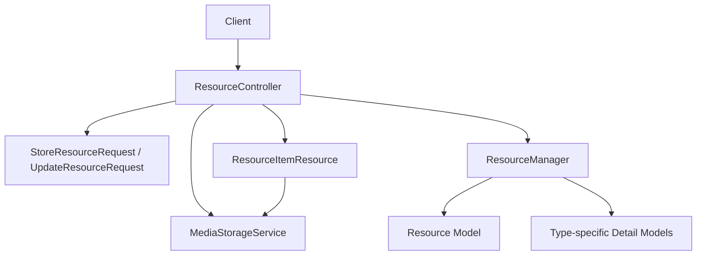
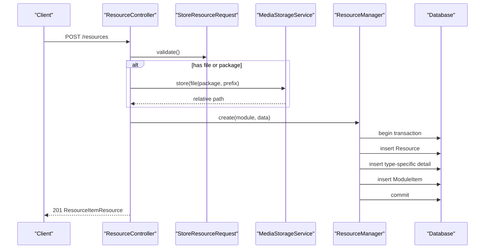
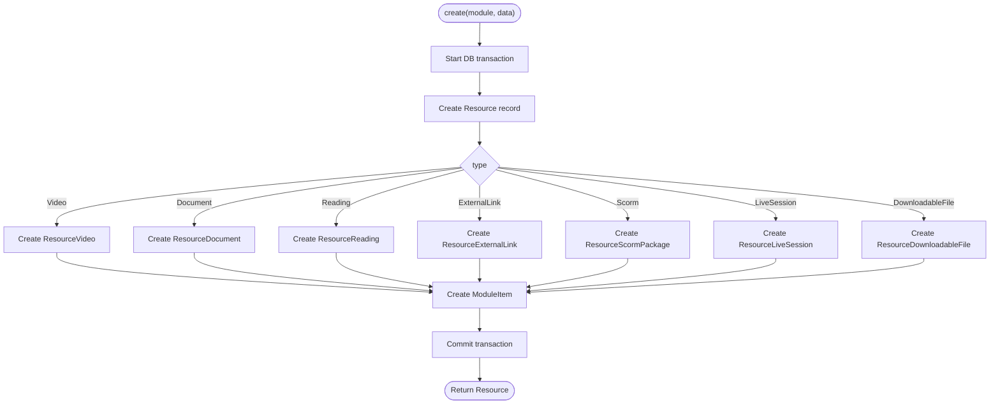
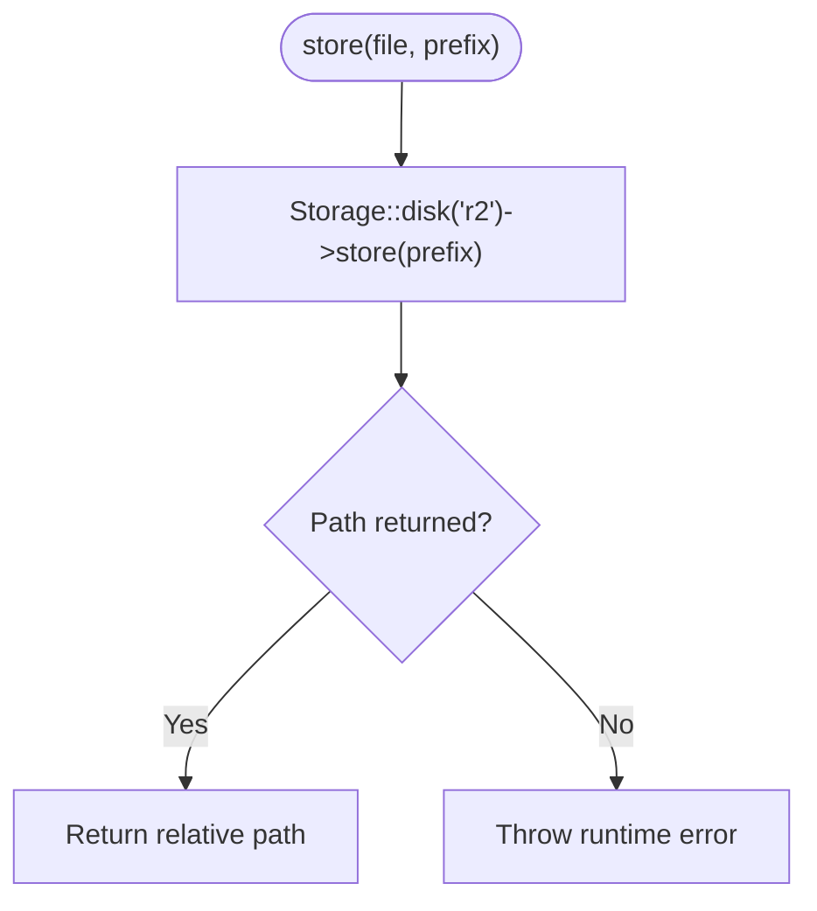
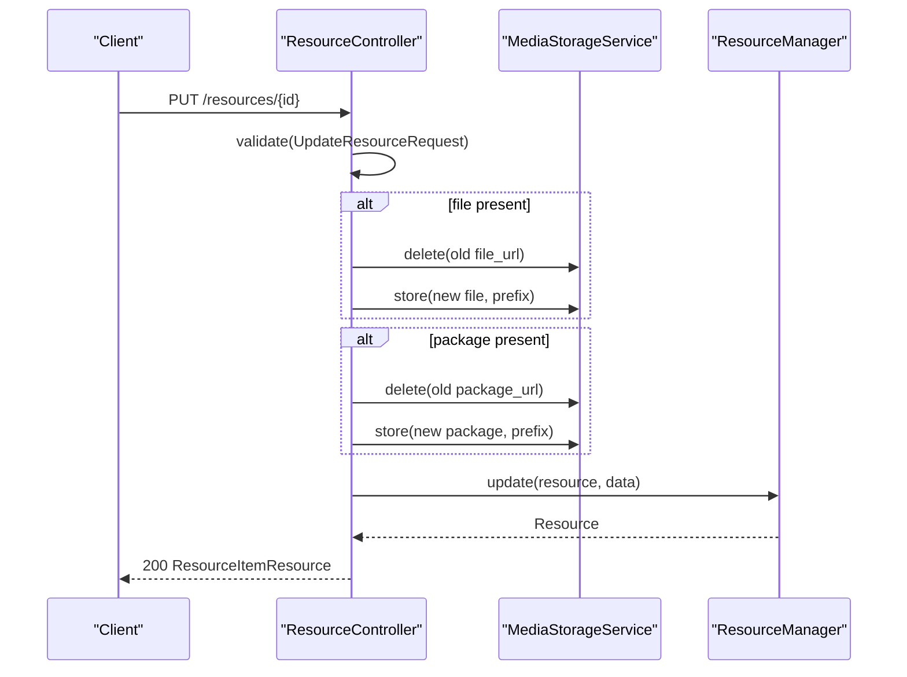
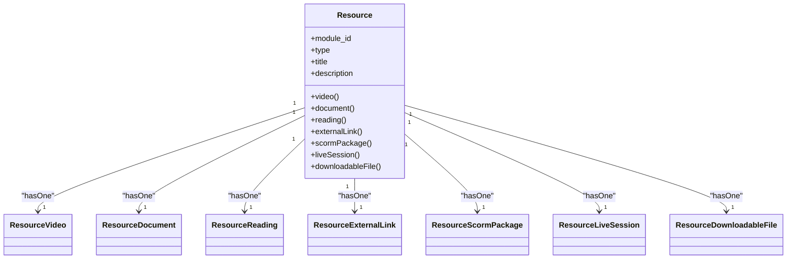
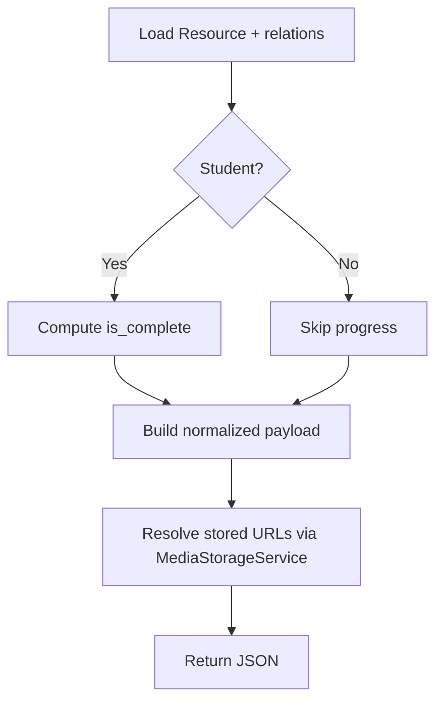
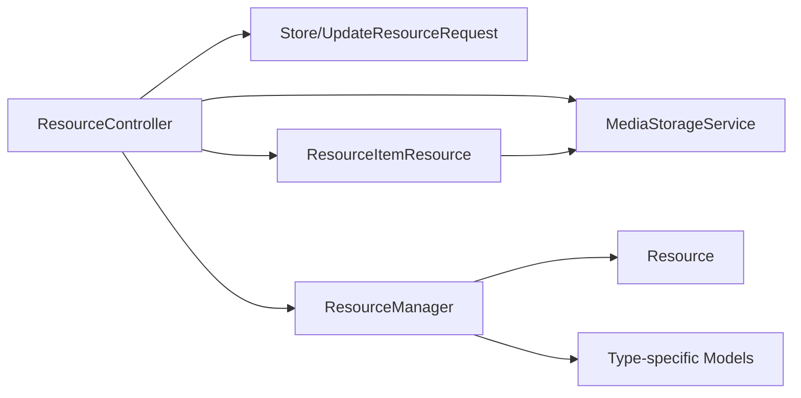

# Content Services

<cite>
**Referenced Files in This Document**
- [ResourceManager.php](file://app/Services/Content/ResourceManager.php)
- [ResourceController.php](file://app/Http/Controllers/Api/V1/ResourceController.php)
- [MediaStorageService.php](file://app/Services/Storage/MediaStorageService.php)
- [ResourceItemResource.php](file://app/Http/Resources/ResourceItemResource.php)
- [Resource.php](file://app/Models/Resource.php)
- [ResourceVideo.php](file://app/Models/ResourceVideo.php)
- [ResourceDocument.php](file://app/Models/ResourceDocument.php)
- [ResourceReading.php](file://app/Models/ResourceReading.php)
- [ResourceExternalLink.php](file://app/Models/ResourceExternalLink.php)
- [ResourceScormPackage.php](file://app/Models/ResourceScormPackage.php)
- [ResourceLiveSession.php](file://app/Models/ResourceLiveSession.php)
- [ResourceDownloadableFile.php](file://app/Models/ResourceDownloadableFile.php)
- [StoreResourceRequest.php](file://app/Http/Requests/Api/V1/StoreResourceRequest.php)
- [UpdateResourceRequest.php](file://app/Http/Requests/Api/V1/UpdateResourceRequest.php)
- [ResourcePolicy.php](file://app/Policies/ResourcePolicy.php)
- [ResourceType.php](file://app/Enums/ResourceType.php)
</cite>

## Table of Contents
1. [Introduction](#introduction)
2. [Project Structure](#project-structure)
3. [Core Components](#core-components)
4. [Architecture Overview](#architecture-overview)
5. [Detailed Component Analysis](#detailed-component-analysis)
6. [Dependency Analysis](#dependency-analysis)
7. [Performance Considerations](#performance-considerations)
8. [Troubleshooting Guide](#troubleshooting-guide)
9. [Conclusion](#conclusion)

## Introduction
This document explains the Content Services that manage course content, resources, and media assets. It focuses on the ResourceManager, which coordinates creation, updates, and deletion of diverse resource types (videos, documents, readings, external links, SCORM packages, live sessions, downloadable files). It also covers how uploads are handled via a centralized storage service, how validation enforces type-specific rules, and how access control ensures only authorized users can manage resources. The goal is to provide a clear understanding of how the system delivers learning materials while preserving integrity and security.

## Project Structure
The content management feature spans controllers, services, models, requests, policies, and resources:
- Controller: API endpoints for listing, creating, updating, and deleting resources.
- Service: Centralized orchestration of resource lifecycle and subtype persistence.
- Storage: Single seam for file uploads, URL resolution, and deletions.
- Models: Polymorphic-like structure with one Resource model and multiple type-specific detail models.
- Requests: Strongly-typed validation per resource type.
- Policies: Authorization based on user role and course ownership.
- Resources: Normalized JSON responses that flatten type-specific details into a consistent envelope.

**Diagram sources**
- [ResourceController.php:20-84](file://app/Http/Controllers/Api/V1/ResourceController.php#L20-L84)
- [StoreResourceRequest.php:20-63](file://app/Http/Requests/Api/V1/StoreResourceRequest.php#L20-L63)
- [UpdateResourceRequest.php:16-54](file://app/Http/Requests/Api/V1/UpdateResourceRequest.php#L16-L54)
- [MediaStorageService.php:24-84](file://app/Services/Storage/MediaStorageService.php#L24-L84)
- [ResourceManager.php:28-178](file://app/Services/Content/ResourceManager.php#L28-L178)
- [Resource.php:15-102](file://app/Models/Resource.php#L15-L102)
- [ResourceItemResource.php:22-99](file://app/Http/Resources/ResourceItemResource.php#L22-L99)

**Section sources**
- [ResourceController.php:20-84](file://app/Http/Controllers/Api/V1/ResourceController.php#L20-L84)
- [ResourceManager.php:28-178](file://app/Services/Content/ResourceManager.php#L28-L178)
- [MediaStorageService.php:24-84](file://app/Services/Storage/MediaStorageService.php#L24-L84)
- [ResourceItemResource.php:22-99](file://app/Http/Resources/ResourceItemResource.php#L22-L99)

## Core Components
- ResourceManager: Orchestrates create/update/delete across the central Resource model and its type-specific detail tables within database transactions. It also keeps ModuleItem ordering and required flags synchronized with the resource.
- MediaStorageService: Centralizes upload, raw writes, URL resolution, and deletion against a configured disk. It transparently handles both relative paths and external URLs.
- ResourceController: Exposes REST endpoints, delegates validation to request classes, handles file uploads, and returns normalized responses.
- Request Classes: Enforce type-specific validation rules and authorization checks before any business logic runs.
- Policy: Restricts resource management to administrators or instructors teaching the relevant course.
- Models: A single Resource model with one-to-one relationships to type-specific detail models (video, document, reading, external link, scorm package, live session, downloadable file).
- Resource Item Response: Flattens type-specific fields into a unified JSON shape and resolves public URLs for stored assets.

**Section sources**
- [ResourceManager.php:28-178](file://app/Services/Content/ResourceManager.php#L28-L178)
- [MediaStorageService.php:24-84](file://app/Services/Storage/MediaStorageService.php#L24-L84)
- [ResourceController.php:20-84](file://app/Http/Controllers/Api/V1/ResourceController.php#L20-L84)
- [StoreResourceRequest.php:20-63](file://app/Http/Requests/Api/V1/StoreResourceRequest.php#L20-L63)
- [UpdateResourceRequest.php:16-54](file://app/Http/Requests/Api/V1/UpdateResourceRequest.php#L16-L54)
- [ResourcePolicy.php:13-43](file://app/Policies/ResourcePolicy.php#L13-L43)
- [Resource.php:15-102](file://app/Models/Resource.php#L15-L102)
- [ResourceItemResource.php:22-99](file://app/Http/Resources/ResourceItemResource.php#L22-L99)

## Architecture Overview
The system uses a layered architecture:
- Presentation layer: Controllers handle HTTP requests and return JSON resources.
- Validation and authorization: Request classes validate inputs; policies enforce permissions.
- Domain service: ResourceManager encapsulates business rules for resource lifecycle and consistency.
- Infrastructure: MediaStorageService abstracts storage operations and URL generation.
- Data layer: Eloquent models represent resources and their type-specific details.

**Diagram sources**
- [ResourceController.php:30-46](file://app/Http/Controllers/Api/V1/ResourceController.php#L30-L46)
- [StoreResourceRequest.php:20-63](file://app/Http/Requests/Api/V1/StoreResourceRequest.php#L20-L63)
- [MediaStorageService.php:32-41](file://app/Services/Storage/MediaStorageService.php#L32-L41)
- [ResourceManager.php:33-58](file://app/Services/Content/ResourceManager.php#L33-L58)

## Detailed Component Analysis

### ResourceManager
Responsibilities:
- Create: Persists a Resource and its type-specific detail within a transaction, then creates a corresponding ModuleItem entry with ordering and required flag.
- Update: Updates title/description and type-specific fields; adjusts ModuleItem order and required flag if provided.
- Delete: Removes ModuleItem and Resource atomically.
- Dispatching: Uses an enum-based match to route to the correct subtype table for create/update.

Key behaviors:
- Transactional integrity ensures resource and module item stay in sync.
- Type safety via ResourceType enum.
- Minimal field updates using allowlists per subtype.

**Diagram sources**
- [ResourceManager.php:33-58](file://app/Services/Content/ResourceManager.php#L33-L58)
- [ResourceManager.php:101-142](file://app/Services/Content/ResourceManager.php#L101-L142)

**Section sources**
- [ResourceManager.php:33-96](file://app/Services/Content/ResourceManager.php#L33-L96)
- [ResourceManager.php:101-178](file://app/Services/Content/ResourceManager.php#L101-L178)

### MediaStorageService
Responsibilities:
- Store uploaded files under a prefix and return relative paths.
- Write raw bytes for server-generated files.
- Delete files safely, ignoring nulls, empty strings, and external URLs.
- Resolve public URLs for stored paths while passing through external URLs unchanged.

Design notes:
- Single disk abstraction simplifies configuration changes.
- External URL passthrough enables coexistence of legacy URLs and new uploads without migrations.

**Diagram sources**
- [MediaStorageService.php:32-41](file://app/Services/Storage/MediaStorageService.php#L32-L41)

**Section sources**
- [MediaStorageService.php:24-84](file://app/Services/Storage/MediaStorageService.php#L24-L84)

### ResourceController
Responsibilities:
- Show: Loads all type-specific relations and returns a normalized response.
- Store: Validates input, stores uploaded files/packages, delegates creation to ResourceManager.
- Update: Validates input, replaces old files when new ones are uploaded, delegates update to ResourceManager.
- Destroy: Authorizes deletion and delegates to ResourceManager.

Upload handling:
- For documents/downloadable files: either paste a URL or upload a file; uploaded file takes precedence.
- For SCORM packages: same choice between URL and zip upload.

**Diagram sources**
- [ResourceController.php:48-66](file://app/Http/Controllers/Api/V1/ResourceController.php#L48-L66)
- [MediaStorageService.php:55-62](file://app/Services/Storage/MediaStorageService.php#L55-L62)
- [ResourceManager.php:64-83](file://app/Services/Content/ResourceManager.php#L64-L83)

**Section sources**
- [ResourceController.php:20-84](file://app/Http/Controllers/Api/V1/ResourceController.php#L20-L84)

### Validation and Authorization
Validation:
- StoreResourceRequest enforces required fields per resource type and validates file constraints and allowed values.
- UpdateResourceRequest allows partial updates with “sometimes” rules and restricts changes to existing type fields.

Authorization:
- ResourcePolicy restricts create/update/delete to administrators or instructors who teach the course associated with the resource’s module.

**Section sources**
- [StoreResourceRequest.php:20-63](file://app/Http/Requests/Api/V1/StoreResourceRequest.php#L20-L63)
- [UpdateResourceRequest.php:16-54](file://app/Http/Requests/Api/V1/UpdateResourceRequest.php#L16-L54)
- [ResourcePolicy.php:13-43](file://app/Policies/ResourcePolicy.php#L13-L43)

### Data Model and Relationships
The Resource model acts as the central entity with one-to-one relationships to type-specific detail models. Each detail model uses resource_id as its primary key and belongs to Resource.

**Diagram sources**
- [Resource.php:34-102](file://app/Models/Resource.php#L34-L102)
- [ResourceVideo.php:10-29](file://app/Models/ResourceVideo.php#L10-L29)
- [ResourceDocument.php:11-34](file://app/Models/ResourceDocument.php#L11-L34)
- [ResourceReading.php:10-28](file://app/Models/ResourceReading.php#L10-L28)
- [ResourceExternalLink.php:10-28](file://app/Models/ResourceExternalLink.php#L10-L28)
- [ResourceScormPackage.php:11-34](file://app/Models/ResourceScormPackage.php#L11-L34)
- [ResourceLiveSession.php:11-37](file://app/Models/ResourceLiveSession.php#L11-L37)
- [ResourceDownloadableFile.php:10-29](file://app/Models/ResourceDownloadableFile.php#L10-L29)

**Section sources**
- [Resource.php:15-102](file://app/Models/Resource.php#L15-L102)
- [ResourceVideo.php:10-29](file://app/Models/ResourceVideo.php#L10-L29)
- [ResourceDocument.php:11-34](file://app/Models/ResourceDocument.php#L11-L34)
- [ResourceReading.php:10-28](file://app/Models/ResourceReading.php#L10-L28)
- [ResourceExternalLink.php:10-28](file://app/Models/ResourceExternalLink.php#L10-L28)
- [ResourceScormPackage.php:11-34](file://app/Models/ResourceScormPackage.php#L11-L34)
- [ResourceLiveSession.php:11-37](file://app/Models/ResourceLiveSession.php#L11-L37)
- [ResourceDownloadableFile.php:10-29](file://app/Models/ResourceDownloadableFile.php#L10-L29)

### API Response Normalization
ResourceItemResource flattens type-specific details into a consistent envelope:
- Includes common fields like id, module_id, type, title, description, is_required, order_index, and completion status for students.
- Provides a details object containing only the fields relevant to the resource type.
- Resolves stored file URLs to public URLs via MediaStorageService.

**Diagram sources**
- [ResourceItemResource.php:27-99](file://app/Http/Resources/ResourceItemResource.php#L27-L99)
- [MediaStorageService.php:68-79](file://app/Services/Storage/MediaStorageService.php#L68-L79)

**Section sources**
- [ResourceItemResource.php:27-99](file://app/Http/Resources/ResourceItemResource.php#L27-L99)

## Dependency Analysis
High-level dependencies:
- ResourceController depends on StoreResourceRequest/UpdateResourceRequest for validation, MediaStorageService for uploads, and ResourceManager for persistence.
- ResourceManager depends on Resource and type-specific models, plus ModuleItem for ordering and required flags.
- ResourceItemResource depends on MediaStorageService to resolve URLs and optionally on ProgressEngine to compute completion.

**Diagram sources**
- [ResourceController.php:20-84](file://app/Http/Controllers/Api/V1/ResourceController.php#L20-L84)
- [ResourceManager.php:28-178](file://app/Services/Content/ResourceManager.php#L28-L178)
- [ResourceItemResource.php:22-99](file://app/Http/Resources/ResourceItemResource.php#L22-L99)

**Section sources**
- [ResourceController.php:20-84](file://app/Http/Controllers/Api/V1/ResourceController.php#L20-L84)
- [ResourceManager.php:28-178](file://app/Services/Content/ResourceManager.php#L28-L178)
- [ResourceItemResource.php:22-99](file://app/Http/Resources/ResourceItemResource.php#L22-L99)

## Performance Considerations
- Transactions: ResourceManager wraps create/update/delete in database transactions to ensure consistency between Resource, subtype tables, and ModuleItem.
- Eager loading: The show endpoint loads all possible relations to avoid N+1 queries when building the response.
- Selective updates: Update flows use allowlists to minimize write scope and reduce contention.
- Storage abstraction: MediaStorageService centralizes disk calls, enabling efficient reuse and future caching strategies at the disk level.

[No sources needed since this section provides general guidance]

## Troubleshooting Guide
Common issues and resolutions:
- Upload failures: If storing a file fails, a runtime exception is thrown by the storage service. Verify disk configuration and permissions.
- Missing subtype fields: Validation errors will indicate missing required fields for the selected resource type. Ensure the request includes the correct fields for the chosen type.
- Authorization errors: Only administrators or instructors teaching the course can manage resources. Confirm user roles and course membership.
- Orphaned ModuleItem: Deletion removes both ModuleItem and Resource atomically. If inconsistencies occur, check transaction boundaries and logs around delete operations.
- URL resolution: Stored paths are converted to public URLs; external URLs pass through unchanged. If links appear broken, verify the storage disk base URL configuration.

**Section sources**
- [MediaStorageService.php:32-41](file://app/Services/Storage/MediaStorageService.php#L32-L41)
- [StoreResourceRequest.php:20-63](file://app/Http/Requests/Api/V1/StoreResourceRequest.php#L20-L63)
- [ResourcePolicy.php:13-43](file://app/Policies/ResourcePolicy.php#L13-L43)
- [ResourceManager.php:86-96](file://app/Services/Content/ResourceManager.php#L86-L96)

## Conclusion
The Content Services provide a robust, type-safe, and secure way to manage diverse learning materials. ResourceManager ensures atomicity and consistency across related records, while MediaStorageService centralizes storage operations and URL resolution. Validation and policies enforce correctness and access control. Together, these components deliver a scalable foundation for managing videos, documents, readings, external links, SCORM packages, live sessions, and downloadable files within courses.

[No sources needed since this section summarizes without analyzing specific files]