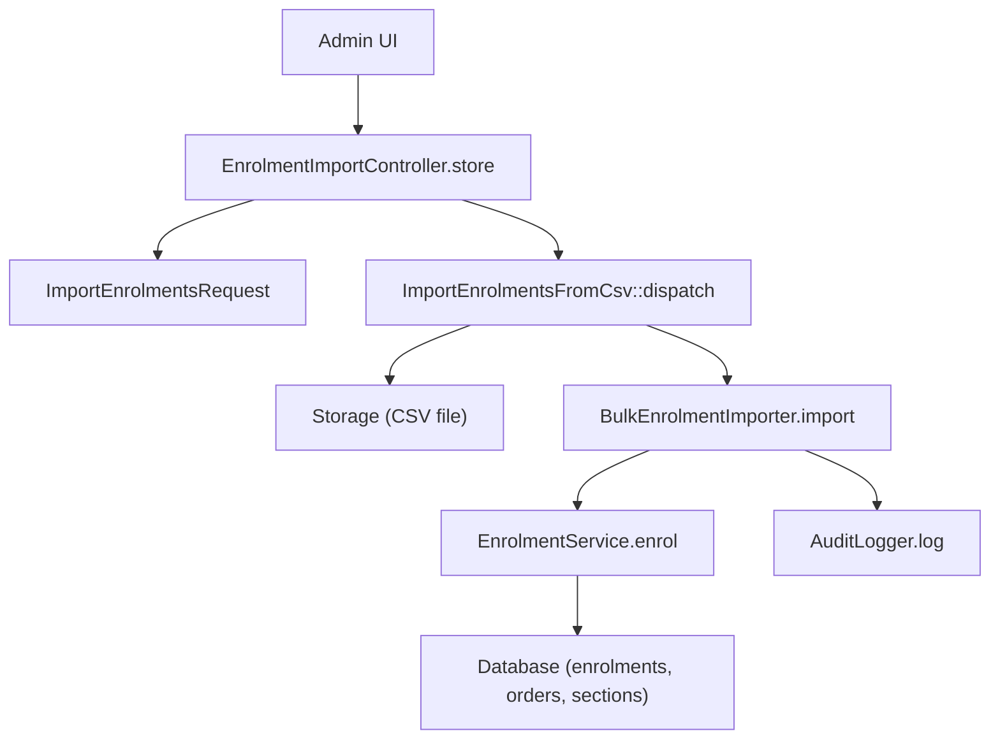
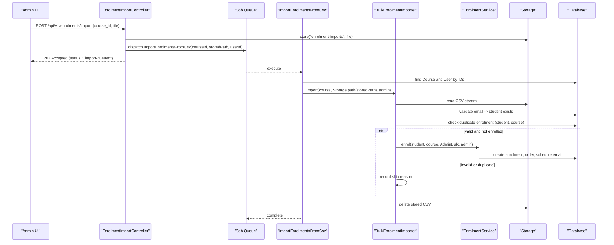
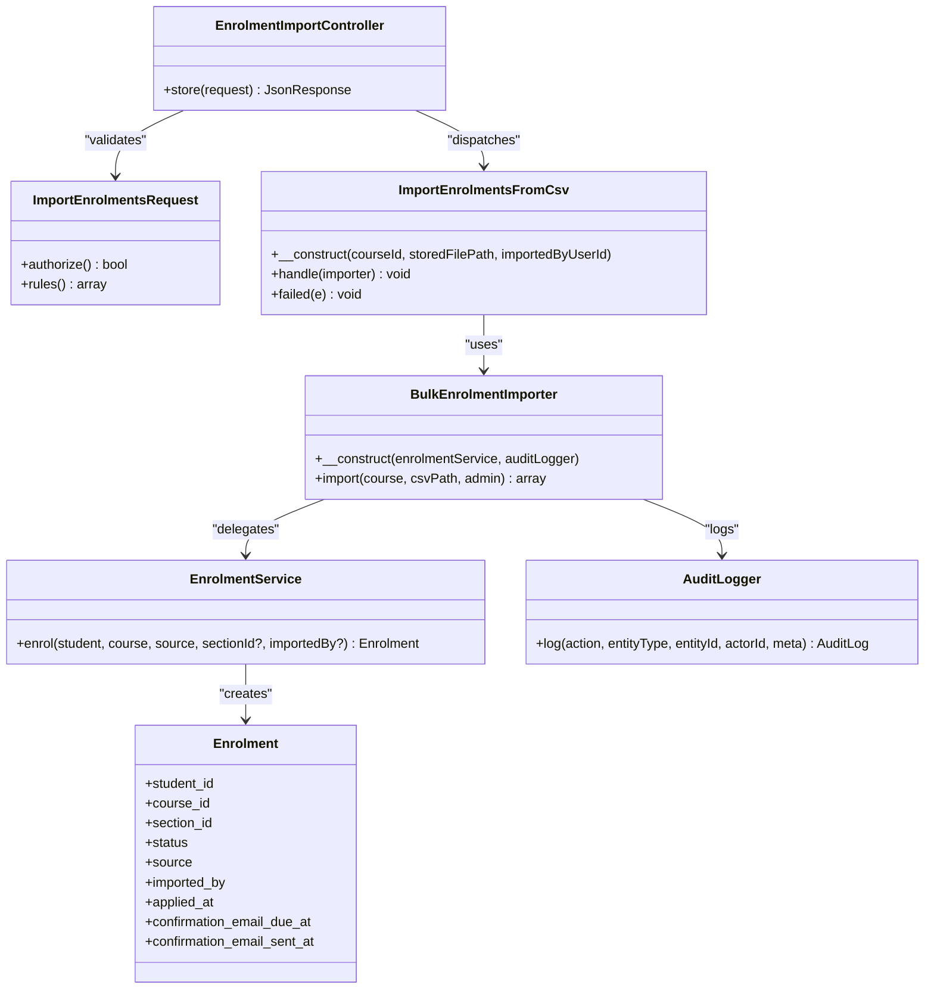
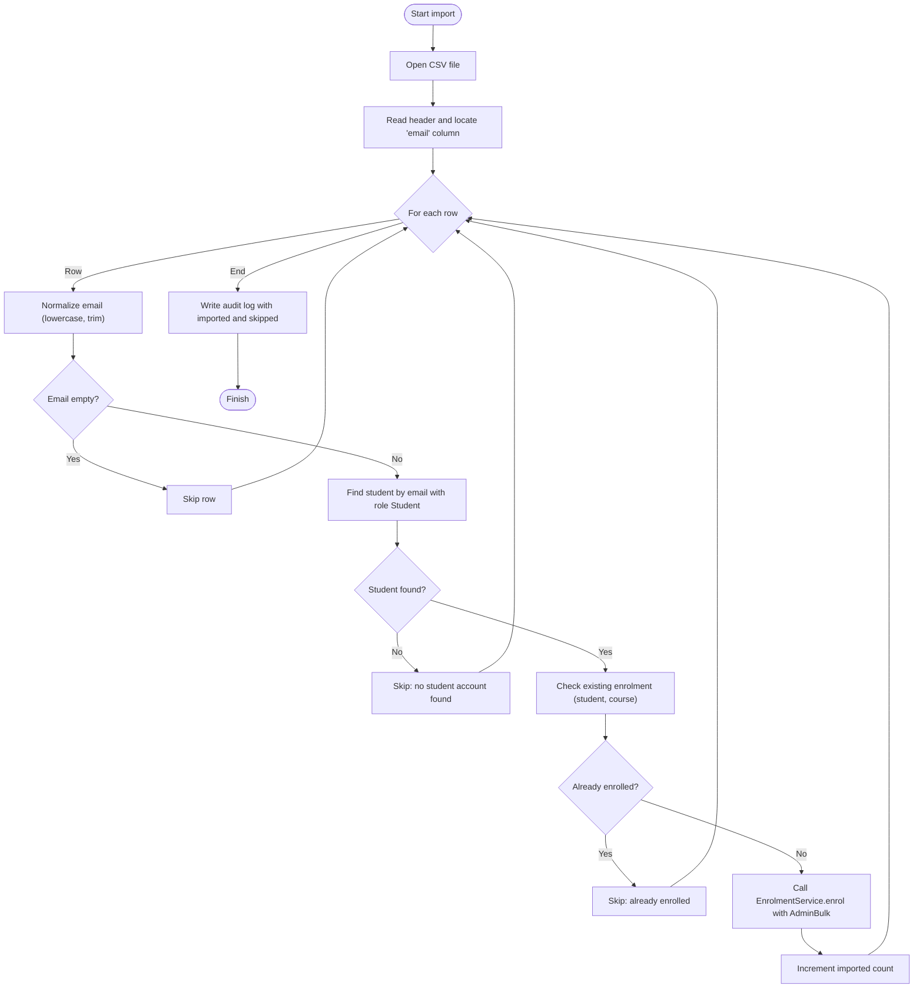
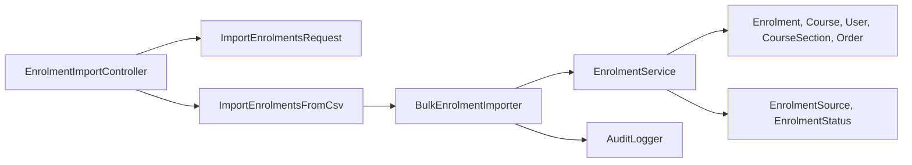

# BulkEnrolmentImporter

<cite>
**Referenced Files in This Document**
- [BulkEnrolmentImporter.php](file://app/Services/Enrolment/BulkEnrolmentImporter.php)
- [ImportEnrolmentsFromCsv.php](file://app/Jobs/ImportEnrolmentsFromCsv.php)
- [EnrolmentImportController.php](file://app/Http/Controllers/Api/V1/EnrolmentImportController.php)
- [ImportEnrolmentsRequest.php](file://app/Http/Requests/Api/V1/ImportEnrolmentsRequest.php)
- [EnrolmentService.php](file://app/Services/Enrolment/EnrolmentService.php)
- [Enrolment.php](file://app/Models/Enrolment.php)
- [EnrolmentSource.php](file://app/Enums/EnrolmentSource.php)
- [UserRole.php](file://app/Enums/UserRole.php)
- [AuditLogger.php](file://app/Services/Audit/AuditLogger.php)
- [create_enrolments_table.php](file://database/migrations/2024_01_01_000060_create_enrolments_table.php)
- [BulkImportTest.php](file://tests/Feature/Enrolment/BulkImportTest.php)
</cite>

## Table of Contents
1. [Introduction](#introduction)
2. [Project Structure](#project-structure)
3. [Core Components](#core-components)
4. [Architecture Overview](#architecture-overview)
5. [Detailed Component Analysis](#detailed-component-analysis)
6. [Dependency Analysis](#dependency-analysis)
7. [Performance Considerations](#performance-considerations)
8. [Troubleshooting Guide](#troubleshooting-guide)
9. [Conclusion](#conclusion)
10. [Appendices](#appendices)

## Introduction
This document explains the BulkEnrolmentImporter feature that enables administrators to import large-scale course enrollments from CSV files asynchronously via background jobs. It covers file parsing, data validation, duplicate handling, batch processing behavior, error handling, and reporting through audit logs. It also describes integration with the queue system for non-blocking imports and provides examples of CSV formats, validation rules, and common error scenarios.

## Project Structure
The bulk enrollment import spans several layers:
- API layer accepts a CSV upload and enqueues a job.
- Job layer reads the stored CSV and delegates to the importer service.
- Service layer parses CSV rows, validates students and duplicates, and creates enrollments.
- Models and enums define data contracts and constraints.
- Audit logging records import actions and results.

**Diagram sources**
- [EnrolmentImportController.php:18-29](file://app/Http/Controllers/Api/V1/EnrolmentImportController.php#L18-L29)
- [ImportEnrolmentsRequest.php:18-24](file://app/Http/Requests/Api/V1/ImportEnrolmentsRequest.php#L18-L24)
- [ImportEnrolmentsFromCsv.php:27-41](file://app/Jobs/ImportEnrolmentsFromCsv.php#L27-L41)
- [BulkEnrolmentImporter.php:29-84](file://app/Services/Enrolment/BulkEnrolmentImporter.php#L29-L84)
- [EnrolmentService.php:44-147](file://app/Services/Enrolment/EnrolmentService.php#L44-L147)
- [AuditLogger.php:18-27](file://app/Services/Audit/AuditLogger.php#L18-L27)

**Section sources**
- [EnrolmentImportController.php:18-29](file://app/Http/Controllers/Api/V1/EnrolmentImportController.php#L18-L29)
- [ImportEnrolmentsRequest.php:18-24](file://app/Http/Requests/Api/V1/ImportEnrolmentsRequest.php#L18-L24)
- [ImportEnrolmentsFromCsv.php:27-41](file://app/Jobs/ImportEnrolmentsFromCsv.php#L27-L41)
- [BulkEnrolmentImporter.php:29-84](file://app/Services/Enrolment/BulkEnrolmentImporter.php#L29-L84)
- [EnrolmentService.php:44-147](file://app/Services/Enrolment/EnrolmentService.php#L44-L147)
- [AuditLogger.php:18-27](file://app/Services/Audit/AuditLogger.php#L18-L27)

## Core Components
- EnrolmentImportController: Accepts multipart form uploads, validates inputs, stores the CSV, and dispatches a background job. Returns an immediate queued status.
- ImportEnrolmentsFromCsv: Background job that resolves course and admin, invokes the importer, and deletes the uploaded CSV after processing. Logs failures.
- BulkEnrolmentImporter: Parses CSV, validates each row, checks for existing student accounts and duplicate enrollments, then calls EnrolmentService to create enrollments. Tracks imported and skipped counts and writes audit logs.
- EnrolmentService: Creates enrollments within database transactions, handles section capacity and waitlisting, creates orders for confirmed enrollments, schedules confirmation emails, and updates progress unlocks.
- Enrolment model and related enums: Define fields, casts, relationships, and source/status values used during import.
- AuditLogger: Centralized audit log writer for sensitive mutations including bulk imports.

Key responsibilities and interactions are illustrated below.

**Section sources**
- [EnrolmentImportController.php:18-29](file://app/Http/Controllers/Api/V1/EnrolmentImportController.php#L18-L29)
- [ImportEnrolmentsFromCsv.php:27-49](file://app/Jobs/ImportEnrolmentsFromCsv.php#L27-L49)
- [BulkEnrolmentImporter.php:29-84](file://app/Services/Enrolment/BulkEnrolmentImporter.php#L29-L84)
- [EnrolmentService.php:44-147](file://app/Services/Enrolment/EnrolmentService.php#L44-L147)
- [Enrolment.php:22-40](file://app/Models/Enrolment.php#L22-L40)
- [EnrolmentSource.php:7-11](file://app/Enums/EnrolmentSource.php#L7-L11)
- [UserRole.php:7-12](file://app/Enums/UserRole.php#L7-L12)
- [AuditLogger.php:18-27](file://app/Services/Audit/AuditLogger.php#L18-L27)

## Architecture Overview
The import flow is asynchronous to avoid blocking HTTP requests during large CSV processing. The controller queues a job; the job performs the actual work and cleans up storage. The importer uses streaming CSV reads and per-row validation to handle large datasets efficiently. Duplicate detection ensures idempotency.

**Diagram sources**
- [EnrolmentImportController.php:18-29](file://app/Http/Controllers/Api/V1/EnrolmentImportController.php#L18-L29)
- [ImportEnrolmentsFromCsv.php:27-41](file://app/Jobs/ImportEnrolmentsFromCsv.php#L27-L41)
- [BulkEnrolmentImporter.php:29-84](file://app/Services/Enrolment/BulkEnrolmentImporter.php#L29-L84)
- [EnrolmentService.php:44-147](file://app/Services/Enrolment/EnrolmentService.php#L44-L147)

## Detailed Component Analysis

### API Layer: EnrolmentImportController
- Validates request using ImportEnrolmentsRequest.
- Stores the uploaded CSV to private storage under enrolment-imports.
- Dispatches ImportEnrolmentsFromCsv with course ID, stored path, and importing user ID.
- Returns 202 Accepted immediately to unblock the client.

Validation rules enforced at the request level:
- course_id must exist in courses table.
- file must be present, a file, CSV or TXT mime type, and max size limit applied.

Authorization:
- Requires permission to import Enrolment resources.

**Section sources**
- [EnrolmentImportController.php:18-29](file://app/Http/Controllers/Api/V1/EnrolmentImportController.php#L18-L29)
- [ImportEnrolmentsRequest.php:13-24](file://app/Http/Requests/Api/V1/ImportEnrolmentsRequest.php#L13-L24)

### Job Layer: ImportEnrolmentsFromCsv
- Resolves Course and User by IDs.
- Calls BulkEnrolmentImporter.import with the absolute path from Storage.
- Deletes the temporary CSV file after successful processing.
- Logs errors on failure.

Retry policy:
- Configured with one attempt; failures are logged centrally.

**Section sources**
- [ImportEnrolmentsFromCsv.php:27-49](file://app/Jobs/ImportEnrolmentsFromCsv.php#L27-L49)

### Service Layer: BulkEnrolmentImporter
Parsing:
- Opens CSV in binary mode and reads header to locate the email column. If no explicit header match is found, defaults to the first column.
- Iterates rows using streaming reads to minimize memory usage.

Validation and business rules:
- Normalizes email to lowercase and trims whitespace.
- Skips empty email rows.
- Looks up a student by email with role Student; skips if not found.
- Checks for existing enrolment for the same student and course; skips if already enrolled.
- Delegates creation to EnrolmentService with source set to AdminBulk and records the importing admin.

Reporting:
- Counts imported rows and collects skip reasons.
- Writes an audit log entry capturing imported count and skipped list.

Idempotency:
- Duplicate detection prevents re-enrollment and avoids duplicate notifications.

**Section sources**
- [BulkEnrolmentImporter.php:29-84](file://app/Services/Enrolment/BulkEnrolmentImporter.php#L29-L84)
- [EnrolmentSource.php:7-11](file://app/Enums/EnrolmentSource.php#L7-L11)
- [UserRole.php:7-12](file://app/Enums/UserRole.php#L7-L12)
- [AuditLogger.php:18-27](file://app/Services/Audit/AuditLogger.php#L18-L27)

### Enrollment Creation: EnrolmentService
Transaction safety:
- All enrollment operations run inside a database transaction.

Section-aware enrollment:
- When a section is provided, it locks the section row to prevent race conditions and checks capacity.
- If capacity is reached, enrollment is created as Waitlisted; otherwise Confirmed.
- If no section is provided but the course requires sections, enrollment is rejected unless a valid section is supplied.

Duplicate prevention:
- Prevents duplicate self-paced confirmed enrollments when no section is specified.

Side effects for confirmed enrollments:
- Increments section seats_taken when applicable.
- Creates an Order with pending status.
- Schedules a delayed confirmation email based on course settings.
- Evaluates course unlocks via ProgressEngine.

Audit logging:
- Logs confirmed and waitlisted events with relevant metadata.

**Section sources**
- [EnrolmentService.php:44-147](file://app/Services/Enrolment/EnrolmentService.php#L44-L147)
- [create_enrolments_table.php:13-29](file://database/migrations/2024_01_01_000060_create_enrolments_table.php#L13-L29)

### Data Model: Enrolment
- Fields include student_id, course_id, section_id, status, source, imported_by, applied_at, and email timestamps.
- Casts ensure proper types for status, source, and datetime fields.
- Relationships link to User (student), Course, CourseSection, and Order.
- Unique constraint on (student_id, course_id) enforces uniqueness at the database level.

**Section sources**
- [Enrolment.php:22-40](file://app/Models/Enrolment.php#L22-L40)
- [create_enrolments_table.php:13-29](file://database/migrations/2024_01_01_000060_create_enrolments_table.php#L13-L29)

### Class Diagram

**Diagram sources**
- [EnrolmentImportController.php:18-29](file://app/Http/Controllers/Api/V1/EnrolmentImportController.php#L18-L29)
- [ImportEnrolmentsRequest.php:13-24](file://app/Http/Requests/Api/V1/ImportEnrolmentsRequest.php#L13-L24)
- [ImportEnrolmentsFromCsv.php:27-49](file://app/Jobs/ImportEnrolmentsFromCsv.php#L27-L49)
- [BulkEnrolmentImporter.php:21-84](file://app/Services/Enrolment/BulkEnrolmentImporter.php#L21-L84)
- [EnrolmentService.php:44-147](file://app/Services/Enrolment/EnrolmentService.php#L44-L147)
- [Enrolment.php:22-40](file://app/Models/Enrolment.php#L22-L40)
- [AuditLogger.php:18-27](file://app/Services/Audit/AuditLogger.php#L18-L27)

### Flowchart: CSV Processing Logic

**Diagram sources**
- [BulkEnrolmentImporter.php:29-84](file://app/Services/Enrolment/BulkEnrolmentImporter.php#L29-L84)

## Dependency Analysis
- Controller depends on request validation and job dispatching.
- Job depends on storage access and importer service.
- Importer depends on EnrolmentService and AuditLogger.
- EnrolmentService depends on models, enums, and external services (progress engine, notification dispatcher).
- Database schema enforces unique constraints and indexes for performance and integrity.

**Diagram sources**
- [EnrolmentImportController.php:18-29](file://app/Http/Controllers/Api/V1/EnrolmentImportController.php#L18-L29)
- [ImportEnrolmentsFromCsv.php:27-41](file://app/Jobs/ImportEnrolmentsFromCsv.php#L27-L41)
- [BulkEnrolmentImporter.php:29-84](file://app/Services/Enrolment/BulkEnrolmentImporter.php#L29-L84)
- [EnrolmentService.php:44-147](file://app/Services/Enrolment/EnrolmentService.php#L44-L147)
- [Enrolment.php:22-40](file://app/Models/Enrolment.php#L22-L40)
- [EnrolmentSource.php:7-11](file://app/Enums/EnrolmentSource.php#L7-L11)

**Section sources**
- [EnrolmentImportController.php:18-29](file://app/Http/Controllers/Api/V1/EnrolmentImportController.php#L18-L29)
- [ImportEnrolmentsFromCsv.php:27-41](file://app/Jobs/ImportEnrolmentsFromCsv.php#L27-L41)
- [BulkEnrolmentImporter.php:29-84](file://app/Services/Enrolment/BulkEnrolmentImporter.php#L29-L84)
- [EnrolmentService.php:44-147](file://app/Services/Enrolment/EnrolmentService.php#L44-L147)
- [Enrolment.php:22-40](file://app/Models/Enrolment.php#L22-L40)
- [EnrolmentSource.php:7-11](file://app/Enums/EnrolmentSource.php#L7-L11)

## Performance Considerations
- Streaming CSV reads: The importer opens the file once and iterates rows without loading the entire file into memory, suitable for large rosters.
- Minimal queries per row: Each row triggers a student lookup and a duplicate check; consider indexing email and role columns for faster lookups.
- Transactional enrollment: EnrolmentService wraps enrollment in a transaction to ensure consistency and reduce lock contention.
- Section locking: Uses pessimistic locking on section rows to prevent race conditions during capacity checks.
- Asynchronous processing: Queuing offloads heavy work from the request thread, improving responsiveness.

[No sources needed since this section provides general guidance]

## Troubleshooting Guide
Common issues and resolutions:
- File upload rejected: Ensure the file is CSV or TXT and within the allowed size limit. Validate course_id exists.
- No student account found: Verify the email corresponds to a user with role Student.
- Already enrolled: The importer skips duplicates; confirm whether the student should be enrolled in another course or section.
- Section capacity full: Enrollment may be created as Waitlisted; review section capacity and consider opening more seats.
- Import job failed: Check application logs for error messages from the job’s failure handler.

Verification via tests:
- Tests assert that repeated imports do not create duplicates and that the import is queued rather than executed inline.
- Authorization tests ensure only authorized users can trigger imports.

**Section sources**
- [BulkImportTest.php:16-65](file://tests/Feature/Enrolment/BulkImportTest.php#L16-L65)
- [ImportEnrolmentsRequest.php:18-24](file://app/Http/Requests/Api/V1/ImportEnrolmentsRequest.php#L18-L24)
- [ImportEnrolmentsFromCsv.php:43-49](file://app/Jobs/ImportEnrolmentsFromCsv.php#L43-L49)

## Conclusion
The BulkEnrolmentImporter provides a robust, idempotent, and auditable mechanism for importing large-scale enrollments from CSV files. It integrates seamlessly with the queue system to avoid blocking requests, enforces data validation and duplicate prevention, and leverages transactional enrollment logic to maintain consistency. Administrators receive immediate feedback that the import is queued, while detailed outcomes are recorded in audit logs for traceability.

[No sources needed since this section summarizes without analyzing specific files]

## Appendices

### CSV Format Examples
- Header: A single column named email.
- Rows: One email per row. Example content:
  - email
  - someone@resnet.test

Notes:
- Emails are normalized to lowercase and trimmed before processing.
- Empty rows are skipped automatically.

**Section sources**
- [BulkEnrolmentImporter.php:40-49](file://app/Services/Enrolment/BulkEnrolmentImporter.php#L40-L49)
- [create_enrolments_table.php:13-29](file://database/migrations/2024_01_01_000060_create_enrolments_table.php#L13-L29)

### Validation Rules Summary
- Request-level:
  - course_id required and must exist in courses.
  - file required, must be CSV or TXT, max size limit enforced.
- Import-level:
  - Email must correspond to a Student role user.
  - Duplicate enrollment for the same student and course is skipped.
  - Section capacity respected; waitlist if full.

**Section sources**
- [ImportEnrolmentsRequest.php:18-24](file://app/Http/Requests/Api/V1/ImportEnrolmentsRequest.php#L18-L24)
- [BulkEnrolmentImporter.php:44-68](file://app/Services/Enrolment/BulkEnrolmentImporter.php#L44-L68)
- [EnrolmentService.php:51-93](file://app/Services/Enrolment/EnrolmentService.php#L51-L93)

### Error Scenarios
- Unable to open CSV file: Throws runtime exception during import.
- Missing student account: Row skipped with reason recorded.
- Already enrolled: Row skipped with reason recorded.
- Section closed or draft: Enrollment rejected with validation message.
- Course requires sections but none provided: Enrollment rejected with validation message.

**Section sources**
- [BulkEnrolmentImporter.php:34-38](file://app/Services/Enrolment/BulkEnrolmentImporter.php#L34-L38)
- [BulkEnrolmentImporter.php:51-68](file://app/Services/Enrolment/BulkEnrolmentImporter.php#L51-L68)
- [EnrolmentService.php:58-80](file://app/Services/Enrolment/EnrolmentService.php#L58-L80)

### Integration with Background Jobs
- Controller returns 202 Accepted immediately after queuing.
- Job executes asynchronously, processes CSV, and deletes the temporary file.
- Failures are logged with context for debugging.

**Section sources**
- [EnrolmentImportController.php:18-29](file://app/Http/Controllers/Api/V1/EnrolmentImportController.php#L18-L29)
- [ImportEnrolmentsFromCsv.php:27-49](file://app/Jobs/ImportEnrolmentsFromCsv.php#L27-L49)