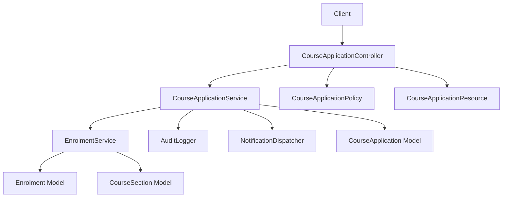
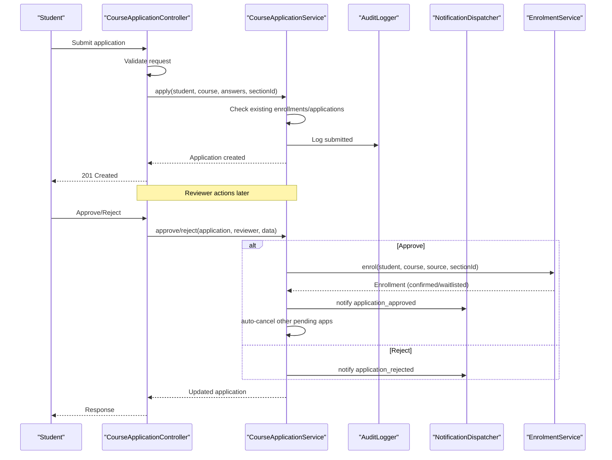
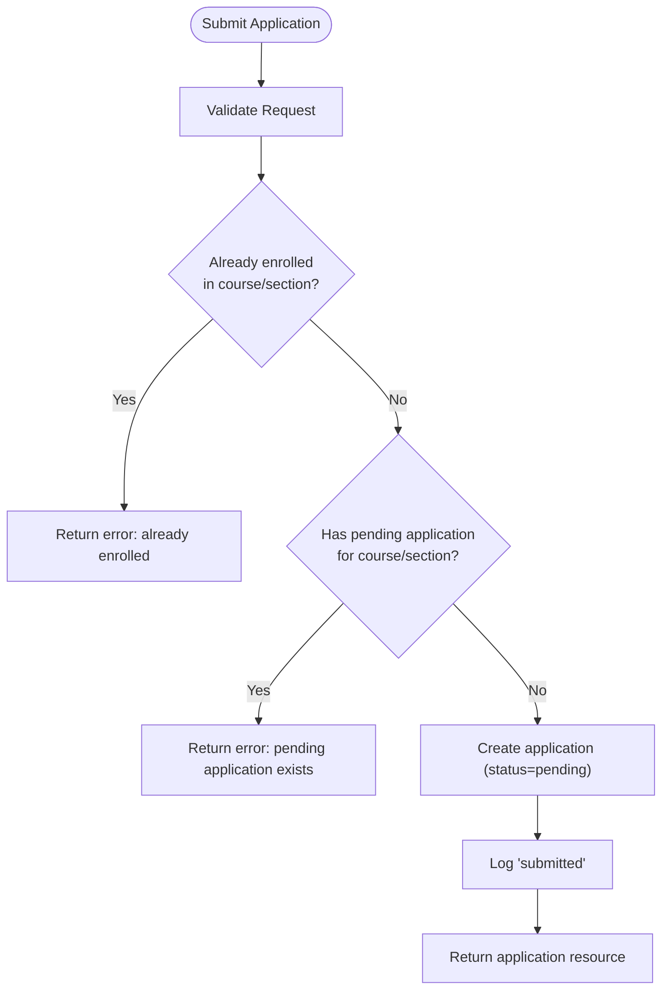
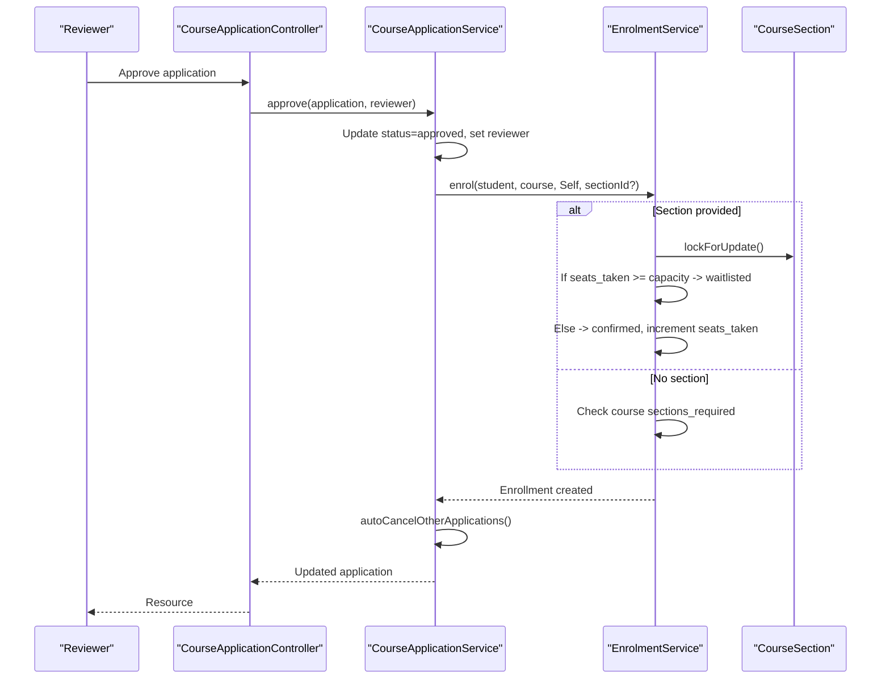
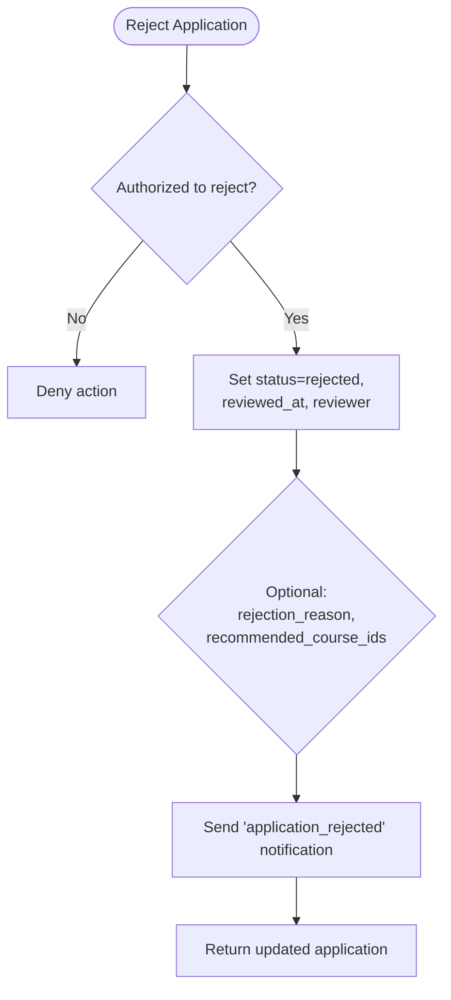
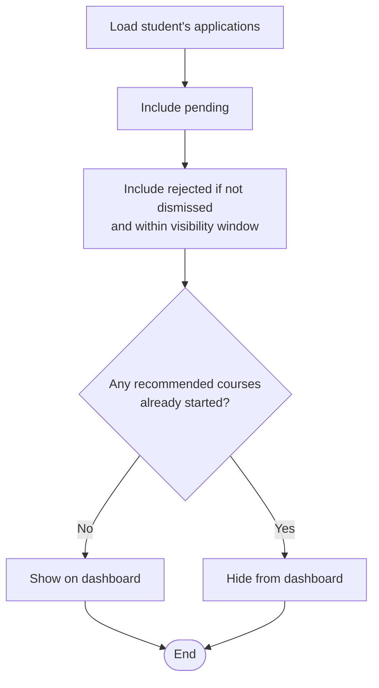
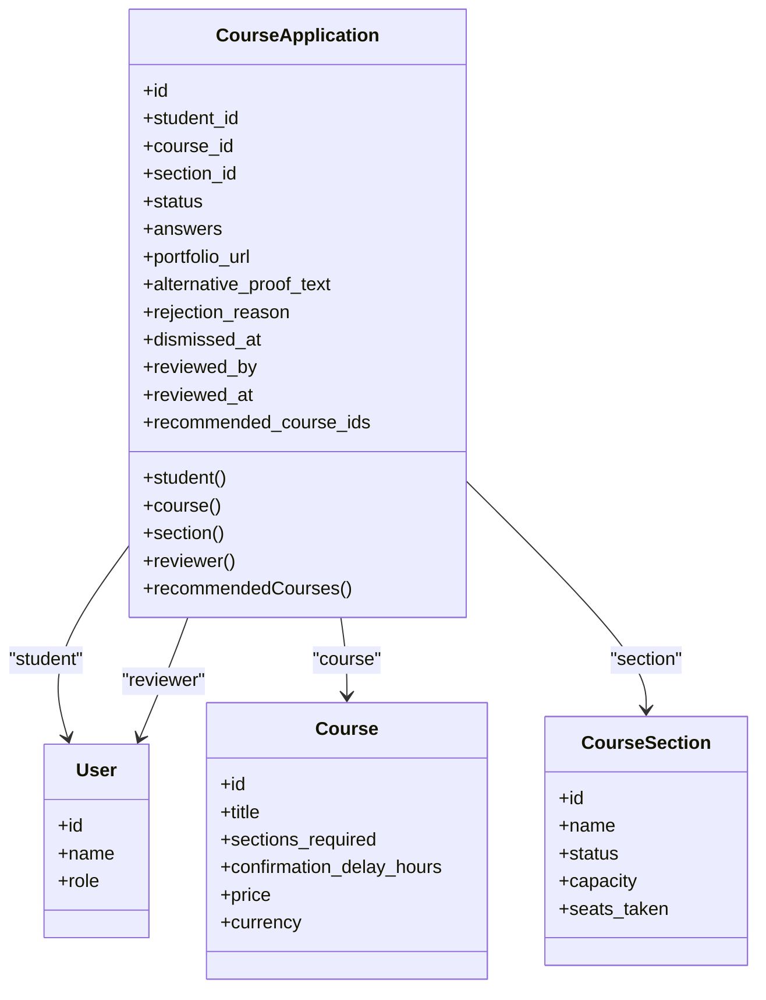
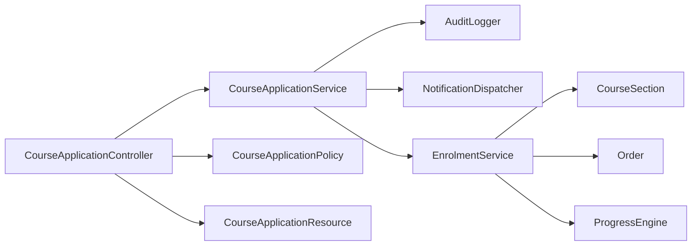

# CourseApplicationService

<cite>
**Referenced Files in This Document**
- [CourseApplicationService.php](file://app/Services/Enrolment/CourseApplicationService.php)
- [CourseApplication.php](file://app/Models/CourseApplication.php)
- [CourseApplicationStatus.php](file://app/Enums/CourseApplicationStatus.php)
- [CourseApplicationController.php](file://app/Http/Controllers/Api/V1/CourseApplicationController.php)
- [StoreCourseApplicationRequest.php](file://app/Http/Requests/Api/V1/StoreCourseApplicationRequest.php)
- [RejectCourseApplicationRequest.php](file://app/Http/Requests/Api/V1/RejectCourseApplicationRequest.php)
- [CourseApplicationResource.php](file://app/Http/Resources/CourseApplicationResource.php)
- [CourseApplicationPolicy.php](file://app/Policies/CourseApplicationPolicy.php)
- [EnrolmentService.php](file://app/Services/Enrolment/EnrolmentService.php)
- [EnrolmentStatus.php](file://app/Enums/EnrolmentStatus.php)
- [2026_07_29_040000_create_course_applications_table.php](file://database/migrations/2026_07_29_040000_create_course_applications_table.php)
- [2026_08_04_010000_add_rejection_reason_to_course_applications_table.php](file://database/migrations/2026_08_04_010000_add_rejection_reason_to_course_applications_table.php)
- [2026_08_10_030000_add_section_id_to_course_applications_table.php](file://database/migrations/2026_08_10_030000_add_section_id_to_course_applications_table.php)
</cite>

## Table of Contents
1. [Introduction](#introduction)
2. [Project Structure](#project-structure)
3. [Core Components](#core-components)
4. [Architecture Overview](#architecture-overview)
5. [Detailed Component Analysis](#detailed-component-analysis)
6. [Dependency Analysis](#dependency-analysis)
7. [Performance Considerations](#performance-considerations)
8. [Troubleshooting Guide](#troubleshooting-guide)
9. [Conclusion](#conclusion)

## Introduction
This document explains the end-to-end course application workflow managed by CourseApplicationService. It covers how applications are created, validated, reviewed, and decided (approved or rejected), including waitlist handling, capacity planning for sections, and integration with cohort management via section-based enrollments. It also documents application states, review workflows, and dashboard visibility rules.

## Project Structure
The application workflow spans controllers, services, models, policies, requests, resources, and database migrations:
- API layer: CourseApplicationController exposes endpoints to submit, list, approve, reject, and dismiss applications.
- Service layer: CourseApplicationService implements business logic for application lifecycle and decisions.
- Data layer: CourseApplication model and related enums define state and relationships.
- Policy layer: CourseApplicationPolicy enforces authorization for actions like approve/reject/dismiss.
- Validation: StoreCourseApplicationRequest and RejectCourseApplicationRequest validate inputs.
- Resources: CourseApplicationResource serializes responses.
- Enrolment integration: EnrolmentService handles enrollment creation, waitlisting, promotions, and capacity updates when applications are approved.
- Schema: Migrations define the course_applications table and its fields, including section support and rejection metadata.

**Diagram sources**
- [CourseApplicationController.php:23-102](file://app/Http/Controllers/Api/V1/CourseApplicationController.php#L23-L102)
- [CourseApplicationService.php:21-289](file://app/Services/Enrolment/CourseApplicationService.php#L21-L289)
- [EnrolmentService.php:24-249](file://app/Services/Enrolment/EnrolmentService.php#L24-L249)
- [CourseApplicationPolicy.php:12-54](file://app/Policies/CourseApplicationPolicy.php#L12-L54)
- [CourseApplicationResource.php:14-43](file://app/Http/Resources/CourseApplicationResource.php#L14-L43)

**Section sources**
- [CourseApplicationController.php:23-102](file://app/Http/Controllers/Api/V1/CourseApplicationController.php#L23-L102)
- [CourseApplicationService.php:21-289](file://app/Services/Enrolment/CourseApplicationService.php#L21-L289)
- [EnrolmentService.php:24-249](file://app/Services/Enrolment/EnrolmentService.php#L24-L249)
- [CourseApplicationPolicy.php:12-54](file://app/Policies/CourseApplicationPolicy.php#L12-L54)
- [CourseApplicationResource.php:14-43](file://app/Http/Resources/CourseApplicationResource.php#L14-L43)

## Core Components
- CourseApplicationService: Orchestrates application submission, approval, rejection, dashboard visibility, and dismissal. Integrates with audit logging, notifications, and enrollment processing.
- CourseApplication model: Represents an application record with status, answers, portfolio URL, alternative proof text, reviewer info, recommended courses, and timestamps.
- CourseApplicationStatus enum: Defines pending, approved, and rejected states.
- CourseApplicationController: Exposes REST endpoints for listing, submitting, approving, rejecting, and dismissing applications; applies policy checks and resource serialization.
- Policies and Requests: Enforce role-based access and input validation for students and reviewers.
- EnrolmentService: Creates enrollments on approval, manages section capacity, waitlisting, promotions, orders, and confirmation emails.
- Database schema: Stores applications with optional section association and decision metadata.

**Section sources**
- [CourseApplicationService.php:21-289](file://app/Services/Enrolment/CourseApplicationService.php#L21-L289)
- [CourseApplication.php:14-89](file://app/Models/CourseApplication.php#L14-L89)
- [CourseApplicationStatus.php:7-13](file://app/Enums/CourseApplicationStatus.php#L7-L13)
- [CourseApplicationController.php:19-104](file://app/Http/Controllers/Api/V1/CourseApplicationController.php#L19-L104)
- [StoreCourseApplicationRequest.php:11-30](file://app/Http/Requests/Api/V1/StoreCourseApplicationRequest.php#L11-L30)
- [RejectCourseApplicationRequest.php:10-26](file://app/Http/Requests/Api/V1/RejectCourseApplicationRequest.php#L10-L26)
- [EnrolmentService.php:24-249](file://app/Services/Enrolment/EnrolmentService.php#L24-L249)
- [2026_07_29_040000_create_course_applications_table.php:9-41](file://database/migrations/2026_07_29_040000_create_course_applications_table.php#L9-L41)
- [2026_08_04_010000_add_rejection_reason_to_course_applications_table.php:9-25](file://database/migrations/2026_08_04_010000_add_rejection_reason_to_course_applications_table.php#L9-L25)
- [2026_08_10_030000_add_section_id_to_course_applications_table.php:9-34](file://database/migrations/2026_08_10_030000_add_section_id_to_course_applications_table.php#L9-L34)

## Architecture Overview
The workflow begins with a student submitting an application for a course that requires admission. The controller validates input and delegates to the service. The service ensures no duplicate pending applications or confirmed enrollments exist for the same course/section, creates the application, logs the action, and returns it. Reviewers can then approve or reject. On approval, the service calls the enrollment service to create an enrollment, which may be confirmed or waitlisted based on section capacity. Rejections can include recommended courses and reasons. Dashboard visibility filters pending and recent rejected applications unless dismissed or acted upon.

**Diagram sources**
- [CourseApplicationController.php:56-102](file://app/Http/Controllers/Api/V1/CourseApplicationController.php#L56-L102)
- [CourseApplicationService.php:44-233](file://app/Services/Enrolment/CourseApplicationService.php#L44-L233)
- [EnrolmentService.php:44-148](file://app/Services/Enrolment/EnrolmentService.php#L44-L148)

## Detailed Component Analysis

### Application Submission Flow
- Input validation: Ensures course is published and exists, optional section exists, answers are strings, and optional portfolio URL and alternative proof text are valid.
- Business checks: Prevents applying if already enrolled (section-aware) or has a pending application for the same course/section.
- Creation: Persists application with status pending, captures answers, portfolio URL, alternative proof text, and optional section ID.
- Audit and response: Logs submission and returns the created application resource.

**Diagram sources**
- [StoreCourseApplicationRequest.php:18-28](file://app/Http/Requests/Api/V1/StoreCourseApplicationRequest.php#L18-L28)
- [CourseApplicationService.php:44-99](file://app/Services/Enrolment/CourseApplicationService.php#L44-L99)
- [CourseApplicationController.php:56-72](file://app/Http/Controllers/Api/V1/CourseApplicationController.php#L56-L72)

**Section sources**
- [StoreCourseApplicationRequest.php:18-28](file://app/Http/Requests/Api/V1/StoreCourseApplicationRequest.php#L18-L28)
- [CourseApplicationService.php:44-99](file://app/Services/Enrolment/CourseApplicationService.php#L44-L99)
- [CourseApplicationController.php:56-72](file://app/Http/Controllers/Api/V1/CourseApplicationController.php#L56-L72)

### Approval Workflow and Capacity Planning
- Authorization: Only admins or instructors teaching the course can approve.
- State transition: Pending becomes approved; records reviewer and timestamp.
- Enrollment creation: Delegates to EnrolmentService::enrol with source Self and optional section.
- Section capacity: If section is full, enrollment is waitlisted; otherwise confirmed. Confirmed enrollments increment seats_taken, create orders, queue confirmation email, and evaluate course unlocks. Waitlisted enrollments log promotion eligibility.
- Auto-cancellation: After approval, any other pending applications for the same course are rejected automatically to prevent multiple enrollments across sections.
- Notifications: Students receive an application_approved notification.

**Diagram sources**
- [CourseApplicationController.php:74-81](file://app/Http/Controllers/Api/V1/CourseApplicationController.php#L74-L81)
- [CourseApplicationService.php:108-154](file://app/Services/Enrolment/CourseApplicationService.php#L108-L154)
- [EnrolmentService.php:44-148](file://app/Services/Enrolment/EnrolmentService.php#L44-L148)

**Section sources**
- [CourseApplicationPolicy.php:23-31](file://app/Policies/CourseApplicationPolicy.php#L23-L31)
- [CourseApplicationService.php:108-190](file://app/Services/Enrolment/CourseApplicationService.php#L108-L190)
- [EnrolmentService.php:44-148](file://app/Services/Enrolment/EnrolmentService.php#L44-L148)

### Rejection Workflow and Recommendations
- Authorization: Only admins or instructors teaching the course can reject.
- State transition: Pending becomes rejected; records reviewer, timestamp, optional rejection reason, and optional recommended course IDs.
- Notifications: Students receive an application_rejected notification; if recommendations are provided, the message guides them to build up to the target course.
- Dashboard filtering: Rejected applications remain visible for a limited window unless dismissed or if the student has already started any recommended courses.

**Diagram sources**
- [CourseApplicationController.php:83-93](file://app/Http/Controllers/Api/V1/CourseApplicationController.php#L83-L93)
- [CourseApplicationService.php:195-233](file://app/Services/Enrolment/CourseApplicationService.php#L195-L233)
- [RejectCourseApplicationRequest.php:17-23](file://app/Http/Requests/Api/V1/RejectCourseApplicationRequest.php#L17-L23)

**Section sources**
- [CourseApplicationPolicy.php:28-31](file://app/Policies/CourseApplicationPolicy.php#L28-L31)
- [CourseApplicationService.php:195-233](file://app/Services/Enrolment/CourseApplicationService.php#L195-L233)
- [RejectCourseApplicationRequest.php:17-23](file://app/Http/Requests/Api/V1/RejectCourseApplicationRequest.php#L17-L23)

### Dashboard Visibility and Dismissal
- Visible applications: Includes all pending applications and rejected ones within a visibility window after decision, unless dismissed.
- Recommendation filtering: If a rejected application includes recommended courses and the student has already started any of those, the application is hidden from the dashboard.
- Dismissal: Students can mark a rejected application as dismissed; this sets a timestamp and hides it from the dashboard.

**Diagram sources**
- [CourseApplicationService.php:243-272](file://app/Services/Enrolment/CourseApplicationService.php#L243-L272)
- [CourseApplicationController.php:49-54](file://app/Http/Controllers/Api/V1/CourseApplicationController.php#L49-L54)

**Section sources**
- [CourseApplicationService.php:243-287](file://app/Services/Enrolment/CourseApplicationService.php#L243-L287)
- [CourseApplicationController.php:49-54](file://app/Http/Controllers/Api/V1/CourseApplicationController.php#L49-L54)

### Data Model and Relationships
- CourseApplication fields: student, course, optional section, status, answers, portfolio_url, alternative_proof_text, rejection_reason, dismissed_at, reviewed_by, reviewed_at, recommended_course_ids.
- Relationships: BelongsTo user (student), course, section, reviewer; helper method loads recommended courses by IDs.
- Enums: Status transitions between pending, approved, rejected; enrollment statuses include confirmed, withdrawn, waitlisted.

**Diagram sources**
- [CourseApplication.php:14-89](file://app/Models/CourseApplication.php#L14-L89)
- [CourseApplicationStatus.php:7-13](file://app/Enums/CourseApplicationStatus.php#L7-L13)
- [EnrolmentStatus.php:7-13](file://app/Enums/EnrolmentStatus.php#L7-L13)

**Section sources**
- [CourseApplication.php:14-89](file://app/Models/CourseApplication.php#L14-L89)
- [CourseApplicationStatus.php:7-13](file://app/Enums/CourseApplicationStatus.php#L7-L13)
- [EnrolmentStatus.php:7-13](file://app/Enums/EnrolmentStatus.php#L7-L13)

## Dependency Analysis
- CourseApplicationController depends on CourseApplicationService for business logic and CourseApplicationPolicy for authorization.
- CourseApplicationService depends on AuditLogger, NotificationDispatcher, and EnrolmentService for side effects and enrollment processing.
- EnrolmentService interacts with CourseSection for capacity checks and promotions, and with Order and ProgressEngine for post-enrollment setup.
- CourseApplicationResource serializes model data into API responses.

**Diagram sources**
- [CourseApplicationController.php:19-104](file://app/Http/Controllers/Api/V1/CourseApplicationController.php#L19-L104)
- [CourseApplicationService.php:21-289](file://app/Services/Enrolment/CourseApplicationService.php#L21-L289)
- [EnrolmentService.php:24-249](file://app/Services/Enrolment/EnrolmentService.php#L24-L249)

**Section sources**
- [CourseApplicationController.php:19-104](file://app/Http/Controllers/Api/V1/CourseApplicationController.php#L19-L104)
- [CourseApplicationService.php:21-289](file://app/Services/Enrolment/CourseApplicationService.php#L21-L289)
- [EnrolmentService.php:24-249](file://app/Services/Enrolment/EnrolmentService.php#L24-L249)

## Performance Considerations
- Section capacity checks use pessimistic locking to avoid race conditions during concurrent approvals.
- Queries for dashboard visibility load necessary relations efficiently and filter at the service level to reduce UI overhead.
- Auto-cancellation of other pending applications occurs after approval to maintain consistency without blocking the main flow.
- Confirmation emails are queued with configurable delays to avoid synchronous I/O during enrollment.

[No sources needed since this section provides general guidance]

## Troubleshooting Guide
- Duplicate application errors: Occur when a student already has a pending application for the same course/section or is already enrolled. Validate inputs and check existing records before submission.
- Section requirements: If a course requires sections, ensure a valid section_id is provided; otherwise, enrollment will fail.
- Capacity issues: When section capacity is reached, enrollments become waitlisted; monitor waitlist promotions when seats open.
- Authorization failures: Ensure the reviewer is admin or an instructor teaching the course; otherwise, approve/reject actions will be denied.
- Dashboard visibility: Rejected applications may disappear if dismissed or if recommended courses have been started; verify dismissed_at and recommendation status.

**Section sources**
- [CourseApplicationService.php:44-99](file://app/Services/Enrolment/CourseApplicationService.php#L44-L99)
- [EnrolmentService.php:52-93](file://app/Services/Enrolment/EnrolmentService.php#L52-L93)
- [CourseApplicationPolicy.php:23-52](file://app/Policies/CourseApplicationPolicy.php#L23-L52)
- [CourseApplicationService.php:243-287](file://app/Services/Enrolment/CourseApplicationService.php#L243-L287)

## Conclusion
CourseApplicationService provides a robust, audited, and notification-enabled workflow for managing course applications from submission through decision and enrollment. It integrates tightly with section-based capacity management and cohort enrollment processes, ensuring consistent state transitions, clear visibility for students, and controlled access for reviewers. The design supports flexible admission criteria, waitlist handling, and automated follow-ups, making it suitable for scalable course delivery environments.