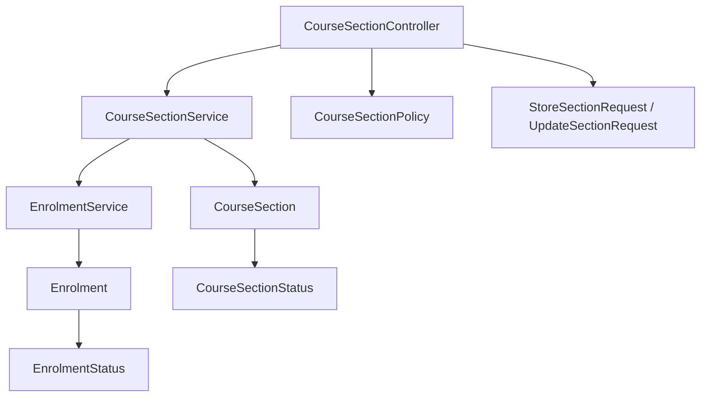
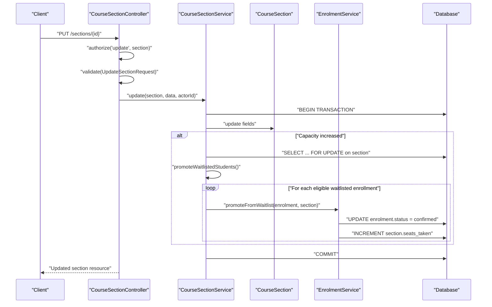
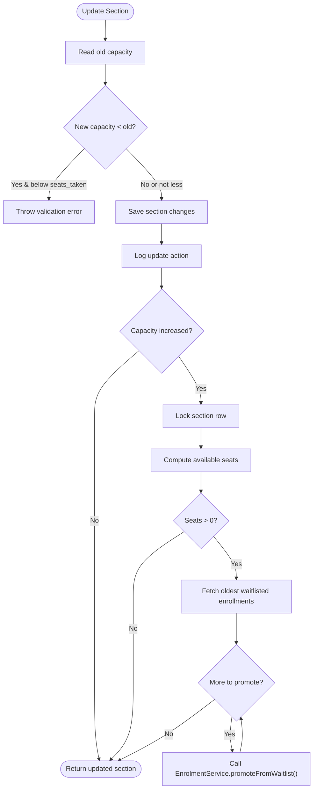
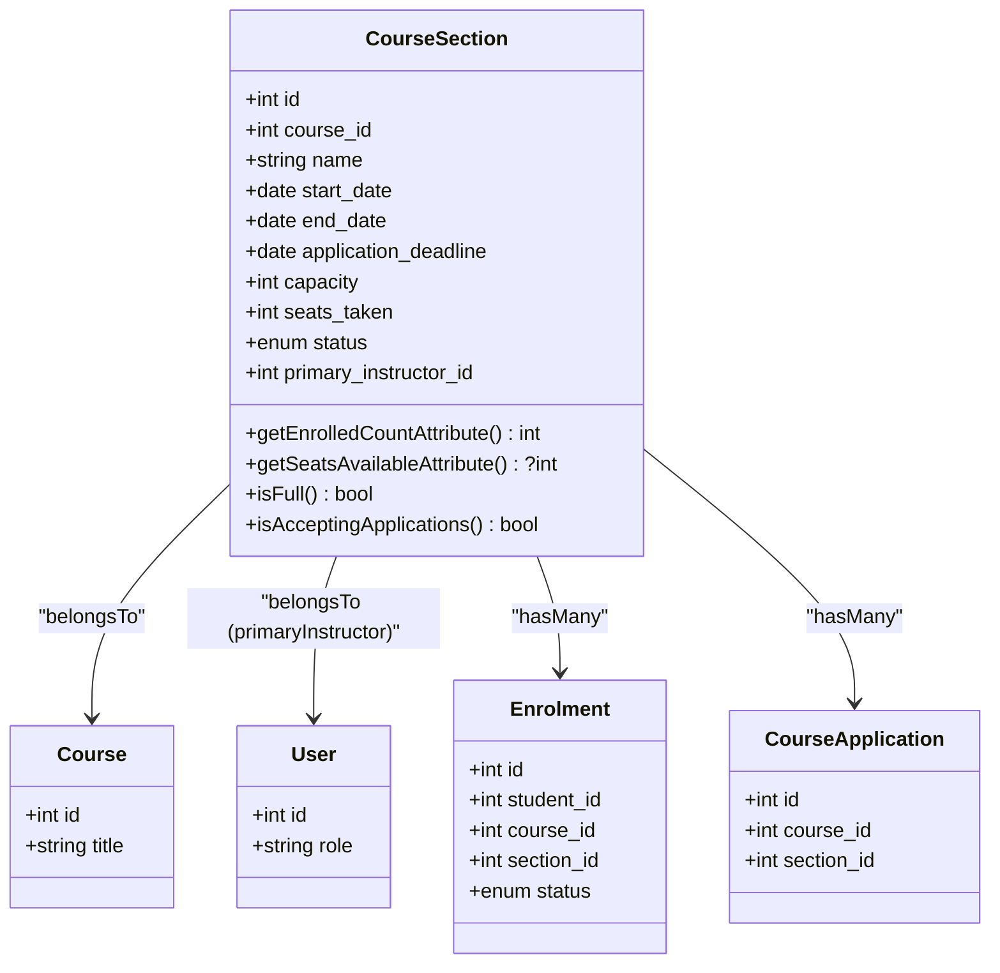
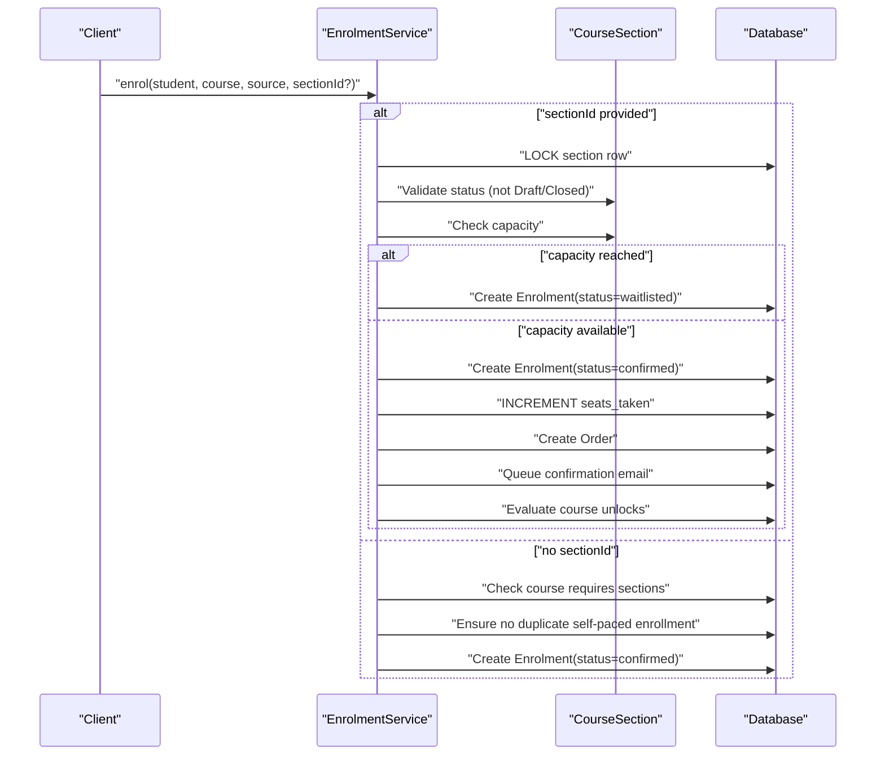
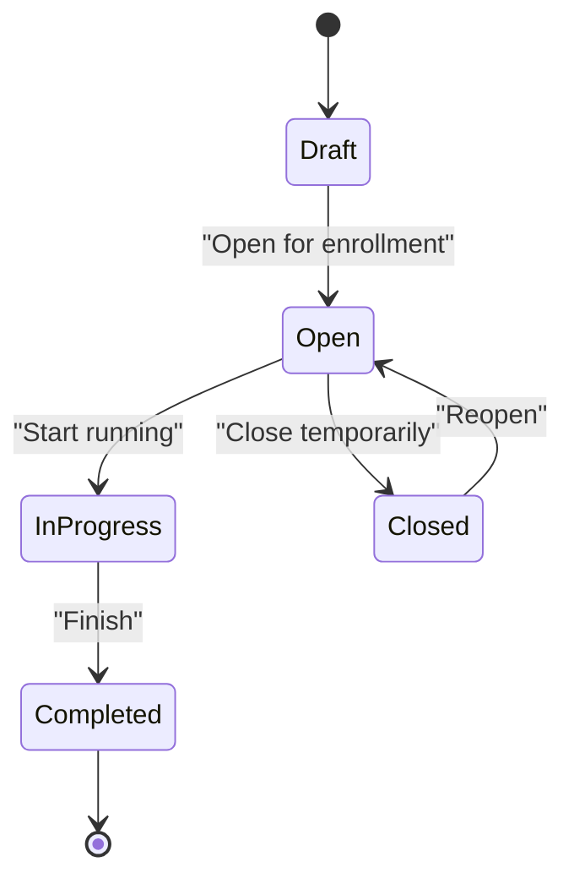
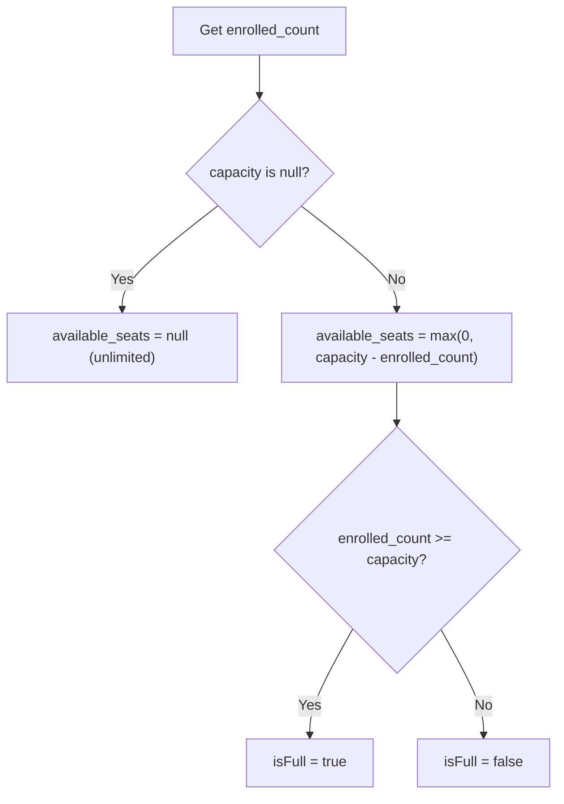
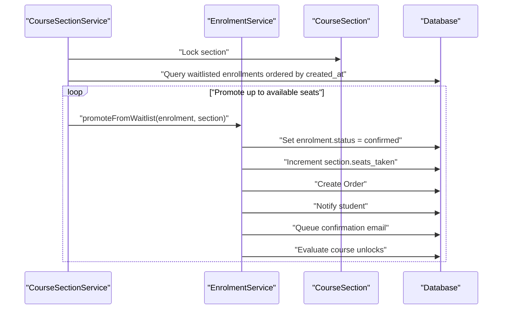
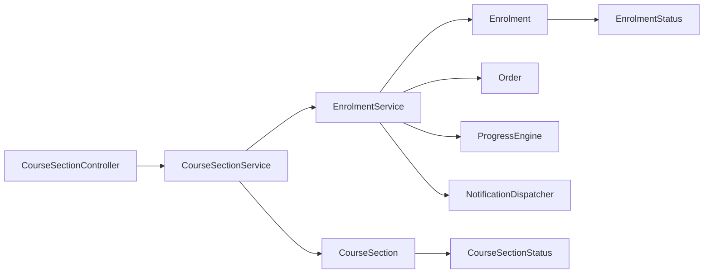

# CourseSectionService

<cite>
**Referenced Files in This Document**
- [CourseSectionService.php](file://app/Services/Enrolment/CourseSectionService.php)
- [CourseSectionController.php](file://app/Http/Controllers/Api/V1/CourseSectionController.php)
- [CourseSection.php](file://app/Models/CourseSection.php)
- [EnrolmentService.php](file://app/Services/Enrolment/EnrolmentService.php)
- [Enrolment.php](file://app/Models/Enrolment.php)
- [CourseSectionStatus.php](file://app/Enums/CourseSectionStatus.php)
- [EnrolmentStatus.php](file://app/Enums/EnrolmentStatus.php)
- [StoreSectionRequest.php](file://app/Http/Requests/Api/V1/StoreSectionRequest.php)
- [UpdateSectionRequest.php](file://app/Http/Requests/Api/V1/UpdateSectionRequest.php)
- [CourseSectionPolicy.php](file://app/Policies/CourseSectionPolicy.php)
- [2026_08_10_010000_create_course_sections_table.php](file://database/migrations/2026_08_10_010000_create_course_sections_table.php)
- [2026_08_10_040000_add_section_id_to_enrolments_table.php](file://database/migrations/2026_08_10_040000_add_section_id_to_enrolments_table.php)
- [2026_08_10_050000_add_waitlisted_to_enrolments_status_enum.php](file://database/migrations/2026_08_10_050000_add_waitlisted_to_enrolments_status_enum.php)
</cite>

## Table of Contents
1. Introduction
2. Project Structure
3. Core Components
4. Architecture Overview
5. Detailed Component Analysis
6. Dependency Analysis
7. Performance Considerations
8. Troubleshooting Guide
9. Conclusion

## Introduction
This document explains how the CourseSectionService manages cohort-based learning sections within courses. It covers section creation, capacity management, enrollment limits, waitlist handling, and lifecycle operations. It also details how student assignments are coordinated with the EnrolmentService to support cohort scenarios such as capacity-limited runs, automatic waitlist promotion, and status-driven enrollment policies.

## Project Structure
The course section feature spans controllers, services, models, enums, requests, policies, and database migrations:
- API layer: CourseSectionController exposes endpoints for listing, creating, updating, and deleting sections.
- Business logic: CourseSectionService encapsulates section lifecycle and capacity-related workflows.
- Data layer: CourseSection model represents cohorts; Enrolment model tracks per-student enrollments including waitlist state.
- Policies and requests: CourseSectionPolicy enforces authorization; StoreSectionRequest and UpdateSectionRequest validate inputs and enforce status transitions.
- Database schema: Migrations define the course_sections table and extend enrolments to support section-specific enrollments and a waitlisted status.

**Diagram sources**
- [CourseSectionController.php:17-148](file://app/Http/Controllers/Api/V1/CourseSectionController.php#L17-L148)
- [CourseSectionService.php:19-163](file://app/Services/Enrolment/CourseSectionService.php#L19-L163)
- [CourseSection.php:14-118](file://app/Models/CourseSection.php#L14-L118)
- [EnrolmentService.php:30-249](file://app/Services/Enrolment/EnrolmentService.php#L30-L249)
- [Enrolment.php:15-76](file://app/Models/Enrolment.php#L15-L76)
- [CourseSectionStatus.php:7-14](file://app/Enums/CourseSectionStatus.php#L7-L14)
- [EnrolmentStatus.php:7-12](file://app/Enums/EnrolmentStatus.php#L7-L12)

**Section sources**
- [CourseSectionController.php:17-148](file://app/Http/Controllers/Api/V1/CourseSectionController.php#L17-L148)
- [CourseSectionService.php:19-163](file://app/Services/Enrolment/CourseSectionService.php#L19-L163)
- [CourseSection.php:14-118](file://app/Models/CourseSection.php#L14-L118)
- [EnrolmentService.php:30-249](file://app/Services/Enrolment/EnrolmentService.php#L30-L249)
- [Enrolment.php:15-76](file://app/Models/Enrolment.php#L15-L76)
- [CourseSectionStatus.php:7-14](file://app/Enums/CourseSectionStatus.php#L7-L14)
- [EnrolmentStatus.php:7-12](file://app/Enums/EnrolmentStatus.php#L7-L12)

## Core Components
- CourseSectionService: Orchestrates section creation, updates (including capacity changes), deletion guards, and waitlist promotions when capacity increases.
- CourseSection model: Represents a cohort with dates, capacity, seats_taken, and status; provides computed attributes for enrolled count, available seats, fullness checks, and application acceptance.
- EnrolmentService: Handles enrollment into courses and sections, including waitlisting when capacity is reached, withdrawal with seat release and promotion, and promotion from waitlist to confirmed.
- CourseSectionController: Exposes REST endpoints that delegate to the service and apply policy checks and request validation.
- Policies and Requests: Enforce role-based access and validate inputs, including strict status transition rules for updates.

Key responsibilities:
- Section lifecycle: create, update, delete with safety checks.
- Capacity management: prevent invalid reductions, compute available seats, and promote waitlisted students on capacity increase.
- Enrollment coordination: ensure enrollments respect section status and capacity, and manage waitlist queues.

**Section sources**
- [CourseSectionService.php:29-163](file://app/Services/Enrolment/CourseSectionService.php#L29-L163)
- [CourseSection.php:19-118](file://app/Models/CourseSection.php#L19-L118)
- [EnrolmentService.php:44-249](file://app/Services/Enrolment/EnrolmentService.php#L44-L249)
- [CourseSectionController.php:17-148](file://app/Http/Controllers/Api/V1/CourseSectionController.php#L17-L148)
- [CourseSectionPolicy.php:11-49](file://app/Policies/CourseSectionPolicy.php#L11-L49)
- [StoreSectionRequest.php:12-44](file://app/Http/Requests/Api/V1/StoreSectionRequest.php#L12-L44)
- [UpdateSectionRequest.php:11-87](file://app/Http/Requests/Api/V1/UpdateSectionRequest.php#L11-L87)

## Architecture Overview
The system follows a layered architecture:
- Controllers handle HTTP requests, authorize via policies, and validate via request classes.
- Services implement business logic and coordinate domain models and other services.
- Models encapsulate data relationships and computed attributes.
- Migrations define the relational schema and constraints.

**Diagram sources**
- [CourseSectionController.php:115-126](file://app/Http/Controllers/Api/V1/CourseSectionController.php#L115-L126)
- [CourseSectionService.php:54-89](file://app/Services/Enrolment/CourseSectionService.php#L54-L89)
- [CourseSectionService.php:134-162](file://app/Services/Enrolment/CourseSectionService.php#L134-L162)
- [EnrolmentService.php:208-249](file://app/Services/Enrolment/EnrolmentService.php#L208-L249)

## Detailed Component Analysis

### CourseSectionService
Responsibilities:
- Create sections with initial seats_taken set to zero and audit logging.
- Update sections with validation to prevent reducing capacity below current enrollment and to trigger waitlist promotion when capacity increases.
- Delete sections only if there are no enrollments or applications, preserving history by encouraging closure instead of deletion.
- Promote waitlisted students using pessimistic locking and delegation to EnrolmentService.

Key behaviors:
- Capacity decrease guard: prevents setting capacity below seats_taken.
- Automatic promotion: when capacity increases, oldest waitlisted enrollments are promoted up to available seats.
- Audit logging: all create/update/delete actions are logged with context.

**Diagram sources**
- [CourseSectionService.php:54-89](file://app/Services/Enrolment/CourseSectionService.php#L54-L89)
- [CourseSectionService.php:134-162](file://app/Services/Enrolment/CourseSectionService.php#L134-L162)

**Section sources**
- [CourseSectionService.php:29-163](file://app/Services/Enrolment/CourseSectionService.php#L29-L163)

### CourseSection Model
Attributes and relationships:
- Belongs to Course and User (primary instructor).
- Has many Enrolment and CourseApplication records.
- Casts for dates, integer capacity/seats_taken, and enum status.

Computed behavior:
- Enrolled count includes both confirmed and waitlisted enrollments.
- Available seats calculated as capacity minus enrolled count (null capacity means unlimited).
- Fullness check compares enrolled count against capacity.
- Application acceptance depends on status being Open and deadline not passed.

**Diagram sources**
- [CourseSection.php:14-118](file://app/Models/CourseSection.php#L14-L118)

**Section sources**
- [CourseSection.php:14-118](file://app/Models/CourseSection.php#L14-L118)

### EnrolmentService Coordination
Enrollment flow:
- When enrolling with a section_id, the service locks the section row and validates status (Draft/Closed disallowed).
- If capacity is reached, the enrollment is created as Waitlisted; otherwise Confirmed and seats_taken incremented.
- On withdrawal of a confirmed enrollment, seats_taken decremented and oldest waitlisted enrollment promoted.
- Promotion creates an order, logs the action, notifies the student, queues confirmation email, and evaluates course unlocks.

**Diagram sources**
- [EnrolmentService.php:44-148](file://app/Services/Enrolment/EnrolmentService.php#L44-L148)

**Section sources**
- [EnrolmentService.php:44-249](file://app/Services/Enrolment/EnrolmentService.php#L44-L249)

### Status Transitions and Policies
Allowed transitions enforced at the request layer:
- Draft → Open
- Open → InProgress or Closed
- InProgress → Completed
- Closed → Open (reopening allowed)
- Completed is terminal

Authorization:
- Admins can view/create/update/delete sections.
- Instructors can manage sections for courses they teach.

**Diagram sources**
- [UpdateSectionRequest.php:68-85](file://app/Http/Requests/Api/V1/UpdateSectionRequest.php#L68-L85)
- [CourseSectionStatus.php:7-14](file://app/Enums/CourseSectionStatus.php#L7-L14)

**Section sources**
- [UpdateSectionRequest.php:11-87](file://app/Http/Requests/Api/V1/UpdateSectionRequest.php#L11-L87)
- [CourseSectionPolicy.php:11-49](file://app/Policies/CourseSectionPolicy.php#L11-L49)
- [CourseSectionStatus.php:7-14](file://app/Enums/CourseSectionStatus.php#L7-L14)

### Capacity Calculations and Enrollment Limits
- Enrolled count includes both confirmed and waitlisted enrollments.
- Available seats equals capacity minus enrolled count; null capacity implies unlimited.
- A section is considered full when capacity is set and enrolled count meets or exceeds it.
- Enrollment respects section status and capacity; waitlisted enrollments are queued until seats open.

**Diagram sources**
- [CourseSection.php:75-101](file://app/Models/CourseSection.php#L75-L101)

**Section sources**
- [CourseSection.php:75-101](file://app/Models/CourseSection.php#L75-L101)
- [EnrolmentService.php:52-70](file://app/Services/Enrolment/EnrolmentService.php#L52-L70)

### Student Assignments and Waitlist Management
- Students are assigned to sections through enrollment; if capacity is full, they are placed on the waitlist.
- Withdrawals free a seat and automatically promote the oldest waitlisted student.
- Capacity increases trigger batch promotion of waitlisted students up to newly available seats.
- Promotions create orders, send notifications, queue confirmation emails, and evaluate course unlocks.

**Diagram sources**
- [CourseSectionService.php:134-162](file://app/Services/Enrolment/CourseSectionService.php#L134-L162)
- [EnrolmentService.php:208-249](file://app/Services/Enrolment/EnrolmentService.php#L208-L249)

**Section sources**
- [CourseSectionService.php:134-162](file://app/Services/Enrolment/CourseSectionService.php#L134-L162)
- [EnrolmentService.php:157-249](file://app/Services/Enrolment/EnrolmentService.php#L157-L249)

## Dependency Analysis
- CourseSectionController depends on CourseSectionService, policies, and request validators.
- CourseSectionService depends on CourseSection model, EnrolmentService, and AuditLogger.
- EnrolmentService depends on CourseSection, Enrolment, Order, ProgressEngine, NotificationDispatcher, and AuditLogger.
- Models depend on enums for status casting and relationships.

**Diagram sources**
- [CourseSectionController.php:17-148](file://app/Http/Controllers/Api/V1/CourseSectionController.php#L17-L148)
- [CourseSectionService.php:19-163](file://app/Services/Enrolment/CourseSectionService.php#L19-L163)
- [EnrolmentService.php:30-249](file://app/Services/Enrolment/EnrolmentService.php#L30-L249)
- [CourseSection.php:14-118](file://app/Models/CourseSection.php#L14-L118)
- [Enrolment.php:15-76](file://app/Models/Enrolment.php#L15-L76)
- [CourseSectionStatus.php:7-14](file://app/Enums/CourseSectionStatus.php#L7-L14)
- [EnrolmentStatus.php:7-12](file://app/Enums/EnrolmentStatus.php#L7-L12)

**Section sources**
- [CourseSectionController.php:17-148](file://app/Http/Controllers/Api/V1/CourseSectionController.php#L17-L148)
- [CourseSectionService.php:19-163](file://app/Services/Enrolment/CourseSectionService.php#L19-L163)
- [EnrolmentService.php:30-249](file://app/Services/Enrolment/EnrolmentService.php#L30-L249)

## Performance Considerations
- Pessimistic locking: Section rows are locked during enrollment and promotion to avoid race conditions on capacity checks and increments.
- Batch promotions: When capacity increases, multiple waitlisted enrollments are promoted in a single transactional flow, minimizing repeated queries.
- Efficient counting: Enrolled count uses targeted queries over specific statuses to avoid unnecessary joins.
- Avoid heavy loads: Public listing uses selective loading and counts to reduce payload size.

[No sources needed since this section provides general guidance]

## Troubleshooting Guide
Common issues and resolutions:
- Cannot reduce capacity below current enrollment: Ensure seats_taken does not exceed new capacity; adjust enrollment or use closed status for historical sections.
- Cannot delete section with history: Use “Closed” status instead of deletion when enrollments or applications exist.
- Enrollment blocked due to section status: Verify section is not Draft or Closed; only Open or InProgress allow enrollment.
- Duplicate self-paced enrollment: Remove existing confirmed self-paced enrollment before enrolling without a section.
- Waitlist not promoting: Confirm capacity was increased or a confirmed enrollment was withdrawn; verify lock and transaction boundaries.

**Section sources**
- [CourseSectionService.php:54-128](file://app/Services/Enrolment/CourseSectionService.php#L54-L128)
- [EnrolmentService.php:52-93](file://app/Services/Enrolment/EnrolmentService.php#L52-L93)
- [EnrolmentService.php:157-200](file://app/Services/Enrolment/EnrolmentService.php#L157-L200)

## Conclusion
CourseSectionService provides robust management of cohort-based learning sections with clear lifecycle controls, capacity enforcement, and automated waitlist promotion. Through tight coordination with EnrolmentService and strong validation/policy layers, it ensures consistent enrollment behavior across different scenarios while maintaining data integrity and auditability.

[No sources needed since this section summarizes without analyzing specific files]