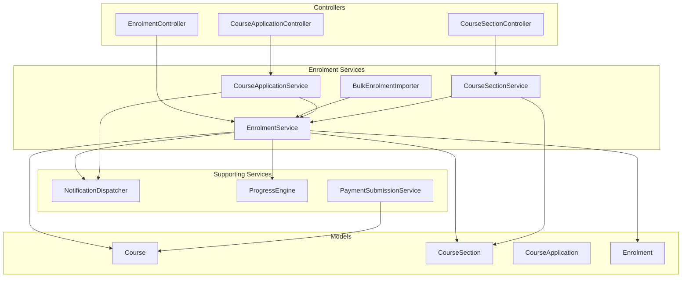
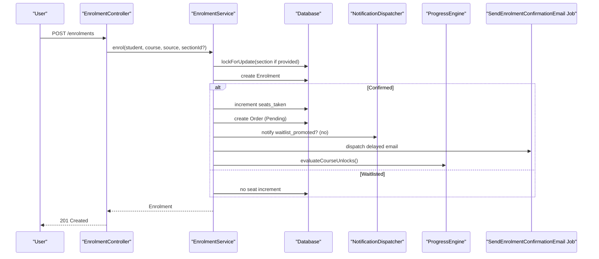
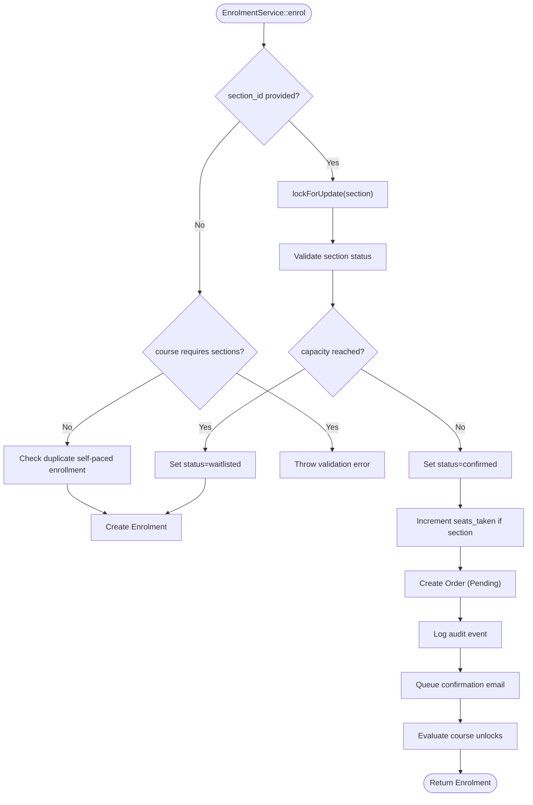
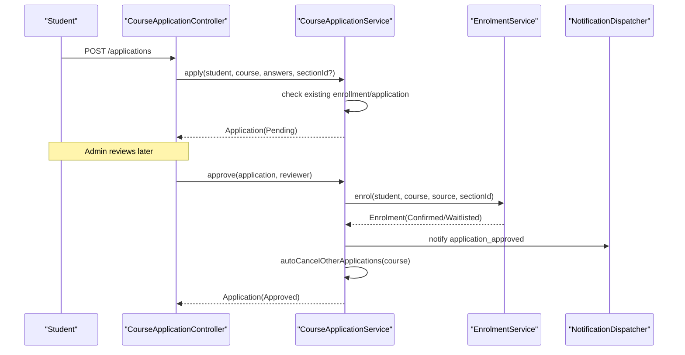
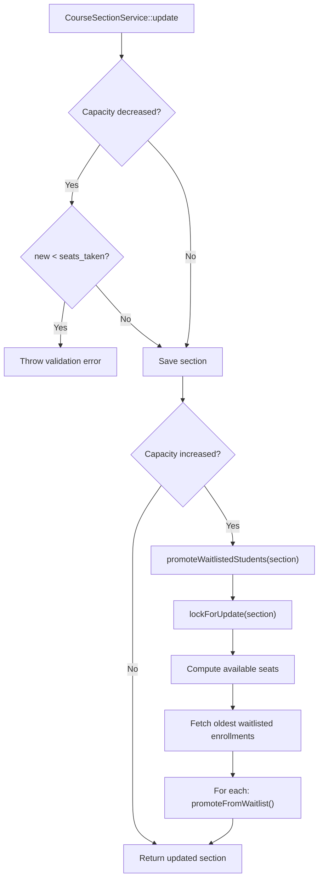
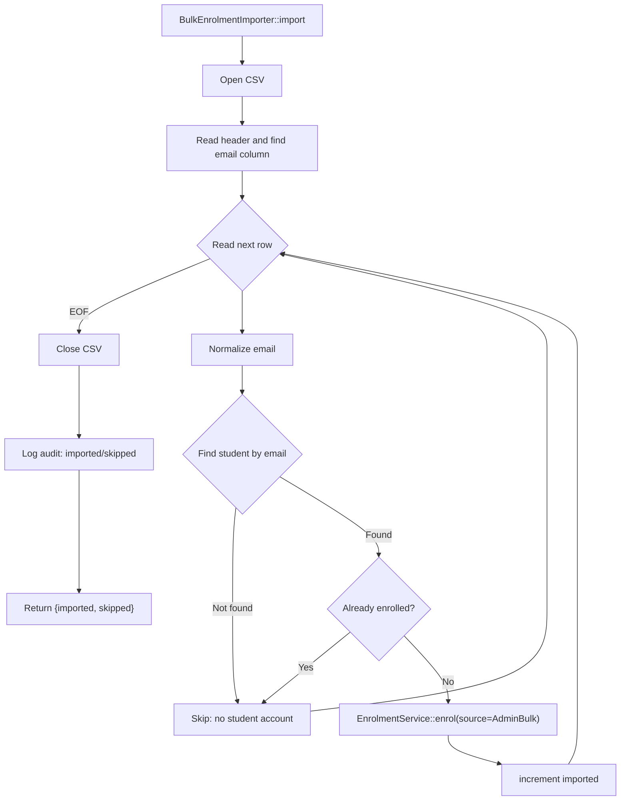
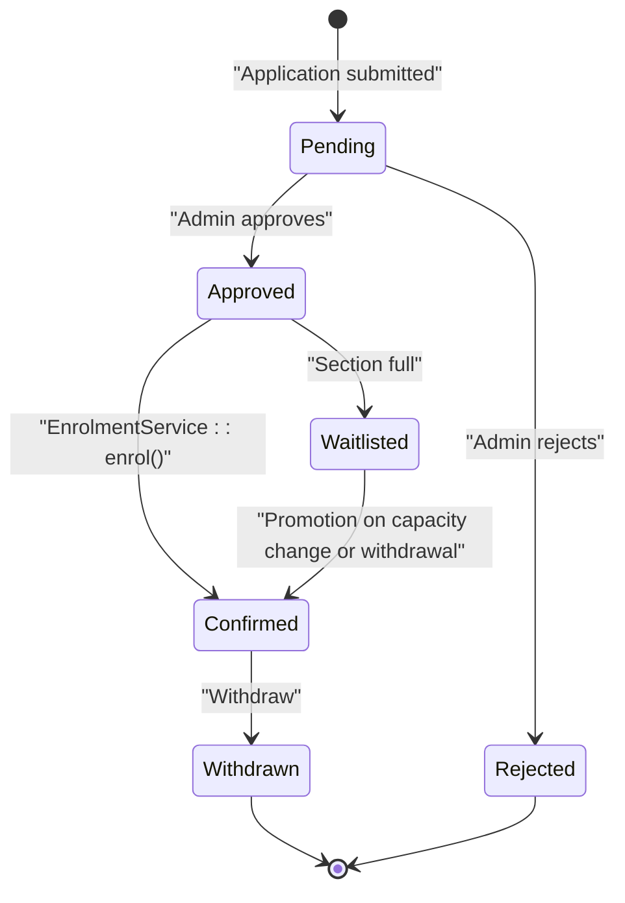
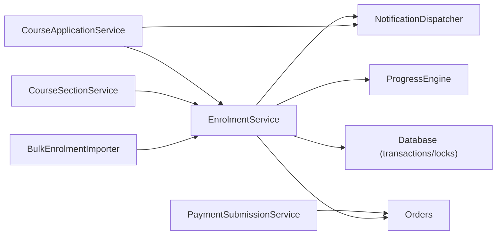

# Enrolment Services

<cite>
**Referenced Files in This Document**
- [EnrolmentService.php](file://app/Services/Enrolment/EnrolmentService.php)
- [CourseApplicationService.php](file://app/Services/Enrolment/CourseApplicationService.php)
- [CourseSectionService.php](file://app/Services/Enrolment/CourseSectionService.php)
- [BulkEnrolmentImporter.php](file://app/Services/Enrolment/BulkEnrolmentImporter.php)
- [EnrolmentController.php](file://app/Http/Controllers/Api/V1/EnrolmentController.php)
- [CourseApplicationController.php](file://app/Http/Controllers/Api/V1/CourseApplicationController.php)
- [CourseSectionController.php](file://app/Http/Controllers/Api/V1/CourseSectionController.php)
- [Enrolment.php](file://app/Models/Enrolment.php)
- [CourseApplication.php](file://app/Models/CourseApplication.php)
- [CourseSection.php](file://app/Models/CourseSection.php)
- [Course.php](file://app/Models/Course.php)
- [EnrolmentStatus.php](file://app/Enums/EnrolmentStatus.php)
- [CourseEnrolmentPolicy.php](file://app/Enums/CourseEnrolmentPolicy.php)
- [NotificationDispatcher.php](file://app/Services/Notifications/NotificationDispatcher.php)
- [ProgressEngine.php](file://app/Services/Progress/ProgressEngine.php)
- [SendEnrolmentConfirmationEmail.php](file://app/Jobs/SendEnrolmentConfirmationEmail.php)
- [PaymentSubmissionService.php](file://app/Services/Payments/PaymentSubmissionService.php)
</cite>

## Table of Contents
1. Introduction
2. Project Structure
3. Core Components
4. Architecture Overview
5. Detailed Component Analysis
6. Dependency Analysis
7. Performance Considerations
8. Troubleshooting Guide
9. Conclusion

## Introduction
This document explains the Enrolment Services that manage course enrollment workflows, cohort (section) management, application processing, and waitlist handling. It focuses on:
- EnrolmentService: core enrollment logic with policy enforcement, capacity checks, order creation, notifications, and progress initialization.
- CourseApplicationService: application lifecycle for courses requiring applications, including approval, rejection, and auto-cancellation of competing applications.
- CourseSectionService: cohort operations including capacity changes and automatic waitlist promotion.
- BulkEnrolmentImporter: admin-driven CSV import path that reuses enrollment services while ensuring idempotency.

It also documents how these services coordinate with payment processing, notification systems, and progress tracking to deliver seamless enrollment experiences.

## Project Structure
The enrolment domain is implemented as a set of cohesive services under app/Services/Enrolment, backed by Eloquent models and coordinated through API controllers. Supporting services handle notifications, progress unlocking, and payments.

**Diagram sources**
- [EnrolmentController.php:20-76](file://app/Http/Controllers/Api/V1/EnrolmentController.php#L20-L76)
- [CourseApplicationController.php:19-104](file://app/Http/Controllers/Api/V1/CourseApplicationController.php#L19-L104)
- [CourseSectionController.php:17-148](file://app/Http/Controllers/Api/V1/CourseSectionController.php#L17-L148)
- [EnrolmentService.php:24-249](file://app/Services/Enrolment/EnrolmentService.php#L24-L249)
- [CourseApplicationService.php:21-289](file://app/Services/Enrolment/CourseApplicationService.php#L21-L289)
- [CourseSectionService.php:15-164](file://app/Services/Enrolment/CourseSectionService.php#L15-L164)
- [BulkEnrolmentImporter.php:14-87](file://app/Services/Enrolment/BulkEnrolmentImporter.php#L14-L87)
- [NotificationDispatcher.php:19-206](file://app/Services/Notifications/NotificationDispatcher.php#L19-L206)
- [ProgressEngine.php:27-288](file://app/Services/Progress/ProgressEngine.php#L27-L288)
- [PaymentSubmissionService.php:16-109](file://app/Services/Payments/PaymentSubmissionService.php#L16-L109)
- [Course.php:17-180](file://app/Models/Course.php#L17-L180)
- [CourseSection.php:14-119](file://app/Models/CourseSection.php#L14-L119)
- [CourseApplication.php:14-89](file://app/Models/CourseApplication.php#L14-L89)
- [Enrolment.php:15-76](file://app/Models/Enrolment.php#L15-L76)

**Section sources**
- [EnrolmentController.php:20-76](file://app/Http/Controllers/Api/V1/EnrolmentController.php#L20-L76)
- [CourseApplicationController.php:19-104](file://app/Http/Controllers/Api/V1/CourseApplicationController.php#L19-L104)
- [CourseSectionController.php:17-148](file://app/Http/Controllers/Api/V1/CourseSectionController.php#L17-L148)
- [EnrolmentService.php:24-249](file://app/Services/Enrolment/EnrolmentService.php#L24-L249)
- [CourseApplicationService.php:21-289](file://app/Services/Enrolment/CourseApplicationService.php#L21-L289)
- [CourseSectionService.php:15-164](file://app/Services/Enrolment/CourseSectionService.php#L15-L164)
- [BulkEnrolmentImporter.php:14-87](file://app/Services/Enrolment/BulkEnrolmentImporter.php#L14-L87)
- [NotificationDispatcher.php:19-206](file://app/Services/Notifications/NotificationDispatcher.php#L19-L206)
- [ProgressEngine.php:27-288](file://app/Services/Progress/ProgressEngine.php#L27-L288)
- [PaymentSubmissionService.php:16-109](file://app/Services/Payments/PaymentSubmissionService.php#L16-L109)
- [Course.php:17-180](file://app/Models/Course.php#L17-L180)
- [CourseSection.php:14-119](file://app/Models/CourseSection.php#L14-L119)
- [CourseApplication.php:14-89](file://app/Models/CourseApplication.php#L14-L89)
- [Enrolment.php:15-76](file://app/Models/Enrolment.php#L15-L76)

## Core Components
- EnrolmentService: Handles self-enrollment and section-aware enrollment, enforces course policies, manages capacity via pessimistic locking, creates orders, queues confirmation emails, logs audit events, notifies users, and initializes module unlocks. Also supports withdrawal and waitlist promotion.
- CourseApplicationService: Manages application submission, validation against existing enrollments/applications, approval flow (delegates to EnrolmentService), rejection with recommendations, dashboard visibility rules, and auto-cancellation of other pending applications upon approval.
- CourseSectionService: Creates, updates, and deletes sections; validates capacity changes; promotes waitlisted students when capacity increases; integrates with EnrolmentService for promotions.
- BulkEnrolmentImporter: Reads CSV, finds student accounts, skips duplicates or missing accounts, and delegates enrollment to EnrolmentService with an admin bulk source flag.

Key data structures:
- Enrolment: links student, course, optional section, status, source, timestamps, and related order.
- CourseApplication: stores answers, portfolio/proof fields, status, review metadata, and recommended courses.
- CourseSection: cohort metadata, capacity, seats_taken, status, dates, and relations to enrolments/applications.

Complexity notes:
- Enrollment uses database transactions and row-level locks to avoid race conditions on capacity.
- Waitlist promotion queries are ordered by created_at and limited to available seats.
- Application visibility filters combine multiple conditions efficiently.

**Section sources**
- [EnrolmentService.php:24-249](file://app/Services/Enrolment/EnrolmentService.php#L24-L249)
- [CourseApplicationService.php:21-289](file://app/Services/Enrolment/CourseApplicationService.php#L21-L289)
- [CourseSectionService.php:15-164](file://app/Services/Enrolment/CourseSectionService.php#L15-L164)
- [BulkEnrolmentImporter.php:14-87](file://app/Services/Enrolment/BulkEnrolmentImporter.php#L14-L87)
- [Enrolment.php:15-76](file://app/Models/Enrolment.php#L15-L76)
- [CourseApplication.php:14-89](file://app/Models/CourseApplication.php#L14-L89)
- [CourseSection.php:14-119](file://app/Models/CourseSection.php#L14-L119)

## Architecture Overview
The enrollment architecture separates concerns across controllers, services, and supporting domains:
- Controllers validate requests and delegate to services.
- Services enforce business rules, coordinate cross-cutting concerns (audit, notifications, progress).
- Models encapsulate relationships and computed attributes (e.g., enrolled_count, seats_available).
- Jobs queue asynchronous tasks like confirmation emails.

**Diagram sources**
- [EnrolmentController.php:43-61](file://app/Http/Controllers/Api/V1/EnrolmentController.php#L43-L61)
- [EnrolmentService.php:44-147](file://app/Services/Enrolment/EnrolmentService.php#L44-L147)
- [SendEnrolmentConfirmationEmail.php:22-58](file://app/Jobs/SendEnrolmentConfirmationEmail.php#L22-L58)
- [ProgressEngine.php:50-81](file://app/Services/Progress/ProgressEngine.php#L50-L81)

## Detailed Component Analysis

### EnrolmentService
Responsibilities:
- Self-enrollment and section-aware enrollment with policy enforcement.
- Capacity checks using pessimistic locking; waitlisting when full.
- Order creation for confirmed enrollments.
- Audit logging, notifications, and progress initialization.
- Withdrawal with waitlist promotion.
- Public promotion method used by section updates.

Key behaviors:
- Section validation ensures only open/in_progress sections accept enrollments.
- Duplicate prevention for self-paced enrollments.
- Delayed confirmation email queued based on course settings.
- Promotion from waitlist increments seats, creates order, notifies, queues email, and evaluates unlocks.

**Diagram sources**
- [EnrolmentService.php:44-147](file://app/Services/Enrolment/EnrolmentService.php#L44-L147)

**Section sources**
- [EnrolmentService.php:44-249](file://app/Services/Enrolment/EnrolmentService.php#L44-L249)

### CourseApplicationService
Responsibilities:
- Application submission with duplication checks per course/section.
- Approval flow delegating to EnrolmentService and notifying students.
- Rejection with optional recommended courses and notifications.
- Dashboard visibility filtering including dismissal and expiry windows.
- Auto-cancellation of other pending applications upon approval.

Key behaviors:
- Prevents applying when already enrolled or having a pending application for the same course/section.
- On approval, triggers enrollment which may be confirmed or waitlisted depending on capacity.
- Ensures students do not hold multiple pending applications for the same course after approval.

**Diagram sources**
- [CourseApplicationController.php:56-93](file://app/Http/Controllers/Api/V1/CourseApplicationController.php#L56-L93)
- [CourseApplicationService.php:44-153](file://app/Services/Enrolment/CourseApplicationService.php#L44-L153)
- [EnrolmentService.php:44-147](file://app/Services/Enrolment/EnrolmentService.php#L44-L147)

**Section sources**
- [CourseApplicationService.php:44-289](file://app/Services/Enrolment/CourseApplicationService.php#L44-L289)
- [CourseApplicationController.php:56-104](file://app/Http/Controllers/Api/V1/CourseApplicationController.php#L56-L104)

### CourseSectionService
Responsibilities:
- Create/update/delete sections with validations.
- Capacity increase triggers automatic promotion of oldest waitlisted students.
- Deletion restricted to sections without history (enrollments/applications).

Key behaviors:
- Validates capacity cannot drop below current enrollment count.
- Uses pessimistic locking during promotion to ensure consistency.
- Calls EnrolmentService::promoteFromWaitlist for each promoted student.

**Diagram sources**
- [CourseSectionService.php:54-164](file://app/Services/Enrolment/CourseSectionService.php#L54-L164)

**Section sources**
- [CourseSectionService.php:29-164](file://app/Services/Enrolment/CourseSectionService.php#L29-L164)

### BulkEnrolmentImporter
Responsibilities:
- Parse CSV and import enrollments for a given course.
- Idempotent behavior: skip if student exists but already enrolled.
- Use EnrolmentService with admin bulk source to reuse all enrollment logic.

Key behaviors:
- Normalizes email and locates student account.
- Skips rows with missing emails or unknown students.
- Logs import results with counts and skipped reasons.

**Diagram sources**
- [BulkEnrolmentImporter.php:29-85](file://app/Services/Enrolment/BulkEnrolmentImporter.php#L29-L85)

**Section sources**
- [BulkEnrolmentImporter.php:29-85](file://app/Services/Enrolment/BulkEnrolmentImporter.php#L29-L85)

### Conceptual Overview
The enrollment system supports three primary flows:
- Direct enrollment for open/advisory courses with optional section selection and capacity-based waitlisting.
- Application-based enrollment where admins/instructors review and approve, triggering enrollment and notifications.
- Bulk enrollment via CSV for administrative overrides, ensuring idempotency and consistent auditing.

[No sources needed since this diagram shows conceptual workflow, not actual code structure]

## Dependency Analysis
- EnrolmentService depends on:
  - AuditLogger for mutation logging.
  - ProgressEngine to unlock modules upon enrollment.
  - NotificationDispatcher to send in-app notifications.
  - Database transactions and pessimistic locks for concurrency safety.
- CourseApplicationService depends on:
  - EnrolmentService for finalizing enrollment post-approval.
  - NotificationDispatcher for applicant notifications.
  - Course model to check policies and relations.
- CourseSectionService depends on:
  - EnrolmentService for waitlist promotions.
  - AuditLogger for section mutations.
- BulkEnrolmentImporter depends on:
  - EnrolmentService to reuse enrollment logic consistently.
  - AuditLogger for import audits.

External integrations:
- PaymentSubmissionService interacts with Orders created by EnrolmentService to track payments and statuses.
- SendEnrolmentConfirmationEmail job sends delayed emails tied to enrollment records.

**Diagram sources**
- [EnrolmentService.php:32-36](file://app/Services/Enrolment/EnrolmentService.php#L32-L36)
- [CourseApplicationService.php:35-39](file://app/Services/Enrolment/CourseApplicationService.php#L35-L39)
- [CourseSectionService.php:21-24](file://app/Services/Enrolment/CourseSectionService.php#L21-L24)
- [BulkEnrolmentImporter.php:21-24](file://app/Services/Enrolment/BulkEnrolmentImporter.php#L21-L24)
- [PaymentSubmissionService.php:22-25](file://app/Services/Payments/PaymentSubmissionService.php#L22-L25)

**Section sources**
- [EnrolmentService.php:32-36](file://app/Services/Enrolment/EnrolmentService.php#L32-L36)
- [CourseApplicationService.php:35-39](file://app/Services/Enrolment/CourseApplicationService.php#L35-L39)
- [CourseSectionService.php:21-24](file://app/Services/Enrolment/CourseSectionService.php#L21-L24)
- [BulkEnrolmentImporter.php:21-24](file://app/Services/Enrolment/BulkEnrolmentImporter.php#L21-L24)
- [PaymentSubmissionService.php:22-25](file://app/Services/Payments/PaymentSubmissionService.php#L22-L25)

## Performance Considerations
- Use of pessimistic locking (SELECT ... FOR UPDATE) on section rows prevents race conditions during capacity checks and seat increments.
- Transactions wrap enrollment and promotion paths to ensure atomicity.
- Queued jobs for confirmation emails decouple email delivery from request latency and include uniqueness to prevent duplicates.
- Efficient queries for waitlist promotion limit results to available seats and order by created_at for fairness.
- Avoid N+1 queries in controllers by eager loading necessary relations (e.g., category, instructors, enrolments, applications).

[No sources needed since this section provides general guidance]

## Troubleshooting Guide
Common issues and resolutions:
- Section closed or draft: Enrollment fails with validation errors indicating section status constraints. Ensure section status allows enrollment.
- Course requires specific section: Enrollment without section_id fails when course has active sections. Provide a valid section_id.
- Duplicate self-paced enrollment: Attempting to enroll again in a self-paced course returns a validation error. Verify existing confirmed enrollment.
- Capacity exceeded: Enrollment becomes waitlisted; monitor capacity changes or withdrawals to trigger promotions.
- Application conflicts: Existing pending or confirmed enrollment for the same course/section blocks new applications. Resolve by withdrawing or waiting for decision.
- Payment submissions: Cannot submit if there is a pending submission or order fully paid. Adjust amount or await admin review.

Relevant service behaviors:
- EnrolmentService throws validation exceptions for invalid states and duplicates.
- CourseApplicationService enforces single pending application per course/section and cancels others upon approval.
- CourseSectionService prevents reducing capacity below current enrollment and restricts deletion of sections with history.
- PaymentSubmissionService guards against duplicate or overpayments.

**Section sources**
- [EnrolmentService.php:58-93](file://app/Services/Enrolment/EnrolmentService.php#L58-L93)
- [CourseApplicationService.php:50-79](file://app/Services/Enrolment/CourseApplicationService.php#L50-L79)
- [CourseSectionService.php:61-67](file://app/Services/Enrolment/CourseSectionService.php#L61-L67)
- [PaymentSubmissionService.php:27-44](file://app/Services/Payments/PaymentSubmissionService.php#L27-L44)

## Conclusion
The Enrolment Services provide a robust, auditable, and scalable foundation for managing course enrollments, cohorts, applications, and waitlists. By leveraging transactions, pessimistic locking, and clear separation of concerns, the system ensures correctness under concurrency and clarity in business rules. Integration with notifications, progress tracking, and payment processing delivers a cohesive user experience from application to enrollment completion.

[No sources needed since this section summarizes without analyzing specific files]