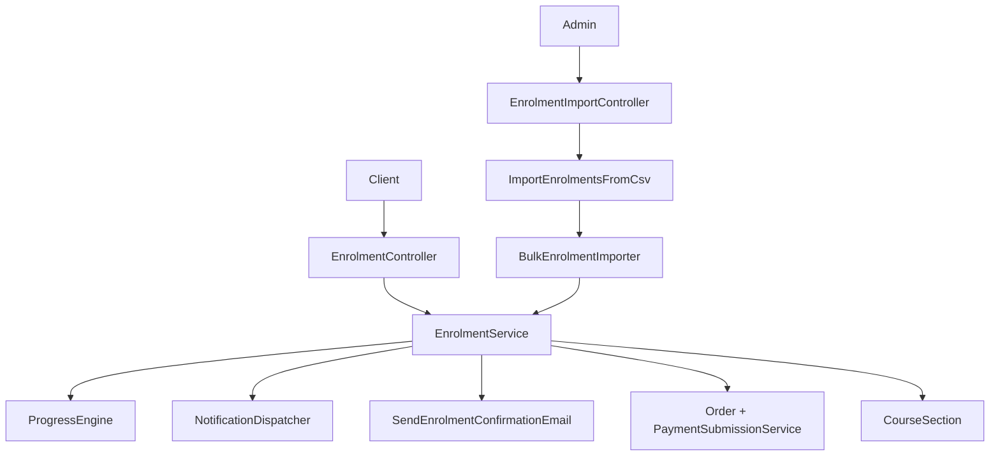
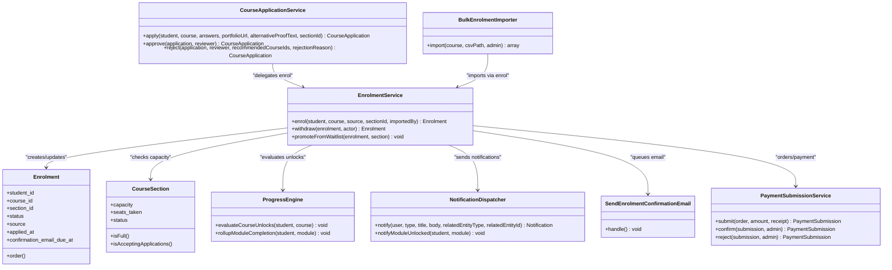
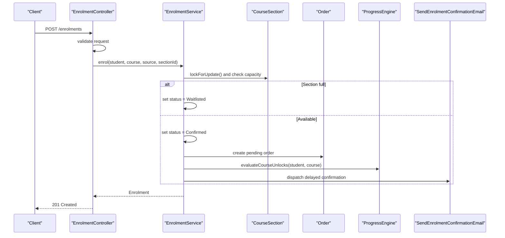
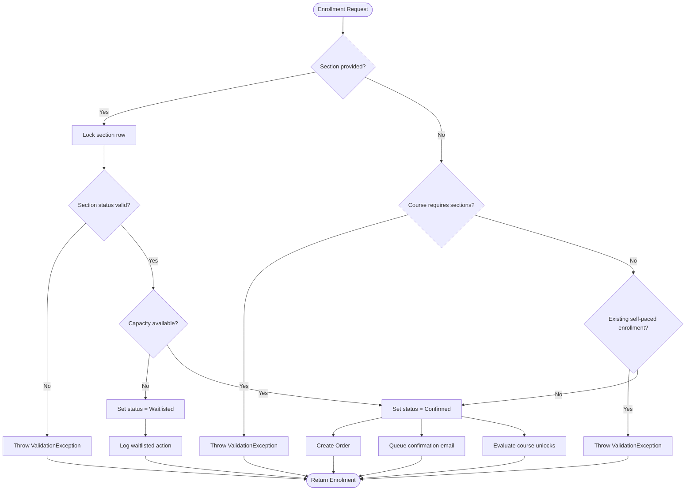
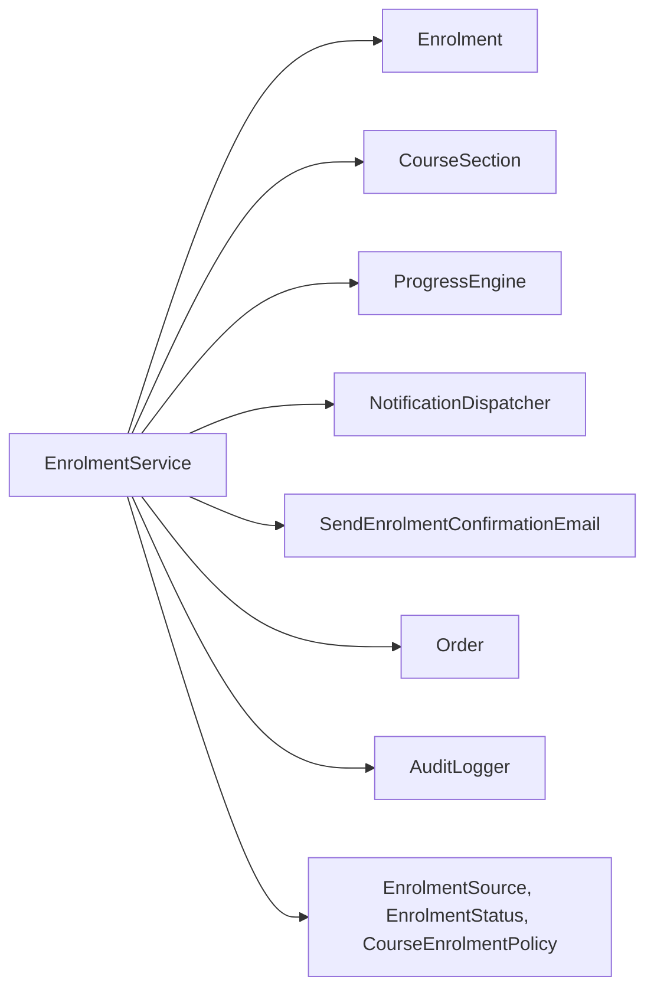

# EnrolmentService

<cite>
**Referenced Files in This Document**
- [EnrolmentService.php](file://app/Services/Enrolment/EnrolmentService.php)
- [Enrolment.php](file://app/Models/Enrolment.php)
- [CourseSection.php](file://app/Models/CourseSection.php)
- [EnrolmentController.php](file://app/Http/Controllers/Api/V1/EnrolmentController.php)
- [EnrolmentImportController.php](file://app/Http/Controllers/Api/V1/EnrolmentImportController.php)
- [BulkEnrolmentImporter.php](file://app/Services/Enrolment/BulkEnrolmentImporter.php)
- [CourseApplicationService.php](file://app/Services/Enrolment/CourseApplicationService.php)
- [ProgressEngine.php](file://app/services/Progress/ProgressEngine.php)
- [NotificationDispatcher.php](file://app/Services/Notifications/NotificationDispatcher.php)
- [PaymentSubmissionService.php](file://app/Services/Payments/PaymentSubmissionService.php)
- [SendEnrolmentConfirmationEmail.php](file://app/Jobs/SendEnrolmentConfirmationEmail.php)
- [EnrolmentSource.php](file://app/Enums/EnrolmentSource.php)
- [EnrolmentStatus.php](file://app/Enums/EnrolmentStatus.php)
- [CourseEnrolmentPolicy.php](file://app/Enums/CourseEnrolmentPolicy.php)
</cite>

## Table of Contents
1. [Introduction](#introduction)
2. [Project Structure](#project-structure)
3. [Core Components](#core-components)
4. [Architecture Overview](#architecture-overview)
5. [Detailed Component Analysis](#detailed-component-analysis)
6. [Dependency Analysis](#dependency-analysis)
7. [Performance Considerations](#performance-considerations)
8. [Troubleshooting Guide](#troubleshooting-guide)
9. [Conclusion](#conclusion)
10. [Appendices](#appendices)

## Introduction
This document provides comprehensive documentation for the EnrolmentService, which is the central orchestrator for course enrollment operations. It covers creating enrollments, managing enrollment statuses (confirmed, waitlisted, withdrawn), handling multiple enrollment sources (self, admin bulk, application approvals), and coordinating with payment processing, notification systems, and progress tracking. It also includes workflow diagrams, error handling patterns, and integration points with other services.

## Project Structure
The enrollment system spans several layers:
- API layer: Controllers expose endpoints for self-enrollment, withdrawal, and bulk import.
- Service layer: Core business logic resides in EnrolmentService, supported by CourseApplicationService and BulkEnrolmentImporter.
- Domain models: Enrolment and CourseSection define data and relationships.
- Cross-cutting services: ProgressEngine, NotificationDispatcher, PaymentSubmissionService, and queued jobs handle side effects like unlocking modules, sending emails, and managing payments.

**Diagram sources**
- [EnrolmentController.php:20-76](file://app/Http/Controllers/Api/V1/EnrolmentController.php#L20-L76)
- [EnrolmentImportController.php:16-31](file://app/Http/Controllers/Api/V1/EnrolmentImportController.php#L16-L31)
- [EnrolmentService.php:30-249](file://app/Services/Enrolment/EnrolmentService.php#L30-L249)
- [BulkEnrolmentImporter.php:19-87](file://app/Services/Enrolment/BulkEnrolmentImporter.php#L19-L87)
- [ProgressEngine.php:33-81](file://app/Services/Progress/ProgressEngine.php#L33-L81)
- [NotificationDispatcher.php:25-39](file://app/Services/Notifications/NotificationDispatcher.php#L25-L39)
- [SendEnrolmentConfirmationEmail.php:22-58](file://app/Jobs/SendEnrolmentConfirmationEmail.php#L22-L58)
- [PaymentSubmissionService.php:20-109](file://app/Services/Payments/PaymentSubmissionService.php#L20-L109)
- [CourseSection.php:14-119](file://app/Models/CourseSection.php#L14-L119)

**Section sources**
- [EnrolmentController.php:20-76](file://app/Http/Controllers/Api/V1/EnrolmentController.php#L20-L76)
- [EnrolmentService.php:30-249](file://app/Services/Enrolment/EnrolmentService.php#L30-L249)
- [CourseApplicationService.php:21-289](file://app/Services/Enrolment/CourseApplicationService.php#L21-L289)
- [BulkEnrolmentImporter.php:19-87](file://app/Services/Enrolment/BulkEnrolmentImporter.php#L19-L87)

## Core Components
- EnrolmentService: Orchestrates enrollment creation, withdrawal, and waitlist promotion; coordinates with progress engine, notifications, audit logging, and order creation.
- Enrolment model: Represents a student’s enrollment in a course or section, including status, source, timestamps, and relationships to user, course, section, and order.
- CourseSection: Manages capacity, seats_taken, and availability; used during enrollment to enforce capacity and waitlisting rules.
- CourseApplicationService: Handles application-based enrollment flows for courses requiring applications; delegates final enrollment to EnrolmentService.
- BulkEnrolmentImporter: Processes CSV imports for admin bulk enrollments; idempotent on student/course pairs.
- ProgressEngine: Evaluates module unlocks and completion based on enrollment and activity signals; invoked after enrollment confirmation.
- NotificationDispatcher: Centralized in-app notifications; used for promotions, course updates, and module unlocks.
- PaymentSubmissionService: Manages payment submissions tied to orders created upon enrollment confirmation.
- SendEnrolmentConfirmationEmail: Queued job that sends confirmation emails at configured delay times per course.

**Section sources**
- [EnrolmentService.php:30-249](file://app/Services/Enrolment/EnrolmentService.php#L30-L249)
- [Enrolment.php:15-76](file://app/Models/Enrolment.php#L15-L76)
- [CourseSection.php:14-119](file://app/Models/CourseSection.php#L14-L119)
- [CourseApplicationService.php:21-289](file://app/Services/Enrolment/CourseApplicationService.php#L21-L289)
- [BulkEnrolmentImporter.php:19-87](file://app/Services/Enrolment/BulkEnrolmentImporter.php#L19-L87)
- [ProgressEngine.php:33-288](file://app/Services/Progress/ProgressEngine.php#L33-L288)
- [NotificationDispatcher.php:25-206](file://app/Services/Notifications/NotificationDispatcher.php#L25-L206)
- [PaymentSubmissionService.php:20-109](file://app/Services/Payments/PaymentSubmissionService.php#L20-L109)
- [SendEnrolmentConfirmationEmail.php:22-58](file://app/Jobs/SendEnrolmentConfirmationEmail.php#L22-L58)

## Architecture Overview
The enrollment architecture centers around EnrolmentService as the single source of truth for enrollment state changes. It enforces policies via enums and validates inputs through controllers and requests. Side effects are handled by dedicated services and jobs to keep the core flow focused and testable.

**Diagram sources**
- [EnrolmentService.php:30-249](file://app/Services/Enrolment/EnrolmentService.php#L30-L249)
- [Enrolment.php:15-76](file://app/Models/Enrolment.php#L15-L76)
- [CourseSection.php:14-119](file://app/Models/CourseSection.php#L14-L119)
- [CourseApplicationService.php:21-289](file://app/Services/Enrolment/CourseApplicationService.php#L21-L289)
- [BulkEnrolmentImporter.php:19-87](file://app/Services/Enrolment/BulkEnrolmentImporter.php#L19-L87)
- [ProgressEngine.php:33-288](file://app/Services/Progress/ProgressEngine.php#L33-L288)
- [NotificationDispatcher.php:25-206](file://app/Services/Notifications/NotificationDispatcher.php#L25-L206)
- [PaymentSubmissionService.php:20-109](file://app/Services/Payments/PaymentSubmissionService.php#L20-L109)
- [SendEnrolmentConfirmationEmail.php:22-58](file://app/Jobs/SendEnrolmentConfirmationEmail.php#L22-L58)

## Detailed Component Analysis

### EnrolmentService
Responsibilities:
- Create enrollments with policy checks (open/advisory/application), section requirements, and capacity constraints.
- Manage enrollment lifecycle transitions: confirmed, waitlisted, withdrawn.
- Coordinate side effects: create orders, queue confirmation emails, evaluate module unlocks, log audits, send notifications.

Key methods:
- enrol: Validates section status and capacity; creates enrollment; handles waitlisting; creates order; queues email; evaluates unlocks.
- withdraw: Updates status to withdrawn; decrements seats if applicable; promotes oldest waitlisted enrollment if needed.
- promoteFromWaitlist: Confirms waitlisted enrollment; increments seats; creates order; notifies student; queues email; evaluates unlocks.

Error handling:
- ValidationException thrown for invalid section states, duplicate self-paced enrollments, and missing required sections.
- Transactional boundaries ensure consistency across enrollment, order creation, and seat updates.

Integration points:
- ProgressEngine.evaluateCourseUnlocks for unlocking modules post-enrollment.
- NotificationDispatcher.notify for waitlist promotions.
- SendEnrolmentConfirmationEmail queued with delay based on course configuration.
- AuditLogger logs all sensitive mutations.

**Diagram sources**
- [EnrolmentController.php:43-61](file://app/Http/Controllers/Api/V1/EnrolmentController.php#L43-L61)
- [EnrolmentService.php:44-147](file://app/Services/Enrolment/EnrolmentService.php#L44-L147)
- [CourseSection.php:14-119](file://app/Models/CourseSection.php#L14-L119)
- [SendEnrolmentConfirmationEmail.php:22-58](file://app/Jobs/SendEnrolmentConfirmationEmail.php#L22-L58)
- [ProgressEngine.php:33-81](file://app/Services/Progress/ProgressEngine.php#L33-L81)

**Section sources**
- [EnrolmentService.php:44-249](file://app/Services/Enrolment/EnrolmentService.php#L44-L249)
- [EnrolmentController.php:20-76](file://app/Http/Controllers/Api/V1/EnrolmentController.php#L20-L76)

### Enrollment Sources
Sources tracked via EnrolmentSource enum:
- Self: Direct student enrollment via API.
- AdminBulk: Bulk import by administrators using CSV.

Flow differences:
- Self-enrollment goes through EnrolmentController.store and EnrolmentService.enrol.
- AdminBulk uses BulkEnrolmentImporter.import, which calls EnrolmentService.enrol with AdminBulk source and tracks skipped entries.

Idempotency:
- Bulk importer skips students already enrolled in the same course to prevent duplicates.

**Section sources**
- [EnrolmentSource.php:7-12](file://app/Enums/EnrolmentSource.php#L7-L12)
- [BulkEnrolmentImporter.php:29-85](file://app/Services/Enrolment/BulkEnrolmentImporter.php#L29-L85)
- [EnrolmentController.php:43-61](file://app/Http/Controllers/Api/V1/EnrolmentController.php#L43-L61)

### Enrollment Policies
CourseEnrolmentPolicy enum defines three policies:
- Open: Students can self-enroll directly.
- Advisory: Similar to open but may imply guidance; still allows self-enrollment.
- Application: Requires CourseApplicationService.apply and admin approval before enrollment.

Policy enforcement:
- EnrolmentController.store rejects direct enrollment for Application-policy courses.
- CourseApplicationService.apply ensures only Application-policy courses accept applications.

**Section sources**
- [CourseEnrolmentPolicy.php:7-27](file://app/Enums/CourseEnrolmentPolicy.php#L7-L27)
- [EnrolmentController.php:43-61](file://app/Http/Controllers/Api/V1/EnrolmentController.php#L43-L61)
- [CourseApplicationService.php:44-100](file://app/Services/Enrolment/CourseApplicationService.php#L44-L100)

### Status Management
EnrolmentStatus enum supports:
- Confirmed: Active enrollment; triggers order creation, email queuing, and progress evaluation.
- Waitlisted: Capacity reached; enrollment queued for promotion when seats open.
- Withdrawn: Student dropped out; triggers seat decrement and potential waitlist promotion.

Transitions:
- enrol: Creates Confirmed or Waitlisted based on capacity.
- withdraw: Sets status to Withdrawn; manages waitlist promotion.
- promoteFromWaitlist: Moves from Waitlisted to Confirmed; creates order and notifies.

**Diagram sources**
- [EnrolmentService.php:44-147](file://app/Services/Enrolment/EnrolmentService.php#L44-L147)

**Section sources**
- [EnrolmentStatus.php:7-13](file://app/Enums/EnrolmentStatus.php#L7-L13)
- [EnrolmentService.php:44-249](file://app/Services/Enrolment/EnrolmentService.php#L44-L249)

### Coordination with Payment Processing
Orders are created automatically upon enrollment confirmation with pending status. PaymentSubmissionService manages subsequent payment submissions:
- submit: Validates remaining balance and stores receipt; creates pending submission.
- confirm: Applies payment to order; updates order status and amount_paid; logs audit.
- reject: Marks submission as rejected; logs audit.

Integration:
- EnrolmentService creates Order instances linked to Enrolment.
- PaymentSubmissionService operates independently but ties back to orders created by enrollment.

**Section sources**
- [EnrolmentService.php:107-134](file://app/Services/Enrolment/EnrolmentService.php#L107-L134)
- [PaymentSubmissionService.php:27-109](file://app/Services/Payments/PaymentSubmissionService.php#L27-L109)

### Coordination with Notification Systems
NotificationDispatcher centralizes in-app notifications:
- Used for waitlist promotions, course updates, module unlocks, announcements, and more.
- EnrolmentService.notify is called during waitlist promotion to inform students.

Email coordination:
- SendEnrolmentConfirmationEmail is queued with delay based on course configuration; ensures idempotency via unique job IDs.

**Section sources**
- [NotificationDispatcher.php:25-206](file://app/Services/Notifications/NotificationDispatcher.php#L25-L206)
- [SendEnrolmentConfirmationEmail.php:22-58](file://app/Jobs/SendEnrolmentConfirmationEmail.php#L22-L58)
- [EnrolmentService.php:208-248](file://app/Services/Enrolment/EnrolmentService.php#L208-L248)

### Coordination with Progress Tracking
ProgressEngine evaluates module unlocks and completion:
- evaluateCourseUnlocks: Unlocks modules based on schedule and previous completion; notifies students.
- rollupModuleCompletion: Marks modules complete when all required items are done; issues certificates for last module.

Enrollment triggers:
- EnrolmentService calls evaluateCourseUnlocks after confirmation or promotion to ensure modules unlock appropriately.

**Section sources**
- [ProgressEngine.php:33-288](file://app/Services/Progress/ProgressEngine.php#L33-L288)
- [EnrolmentService.php:131-134](file://app/Services/Enrolment/EnrolmentService.php#L131-L134)
- [EnrolmentService.php:242-248](file://app/Services/Enrolment/EnrolmentService.php#L242-L248)

## Dependency Analysis
EnrolmentService depends on:
- Models: Enrolment, CourseSection, User, Course, Order.
- Services: AuditLogger, ProgressEngine, NotificationDispatcher.
- Jobs: SendEnrolmentConfirmationEmail.
- Enums: EnrolmentSource, EnrolmentStatus, CourseEnrolmentPolicy.

Coupling:
- Tight coupling with ProgressEngine and NotificationDispatcher for side effects.
- Loose coupling with PaymentSubmissionService via Order creation; payment flow is independent.

Potential circular dependencies:
- None detected; services are unidirectional with clear responsibilities.

External integrations:
- Database transactions for consistency.
- Queued jobs for email delivery.
- In-app notifications via NotificationDispatcher.

**Diagram sources**
- [EnrolmentService.php:30-249](file://app/Services/Enrolment/EnrolmentService.php#L30-L249)
- [Enrolment.php:15-76](file://app/Models/Enrolment.php#L15-L76)
- [CourseSection.php:14-119](file://app/Models/CourseSection.php#L14-L119)
- [ProgressEngine.php:33-288](file://app/Services/Progress/ProgressEngine.php#L33-L288)
- [NotificationDispatcher.php:25-206](file://app/Services/Notifications/NotificationDispatcher.php#L25-L206)
- [SendEnrolmentConfirmationEmail.php:22-58](file://app/Jobs/SendEnrolmentConfirmationEmail.php#L22-L58)
- [EnrolmentSource.php:7-12](file://app/Enums/EnrolmentSource.php#L7-L12)
- [EnrolmentStatus.php:7-13](file://app/Enums/EnrolmentStatus.php#L7-L13)
- [CourseEnrolmentPolicy.php:7-27](file://app/Enums/CourseEnrolmentPolicy.php#L7-L27)

**Section sources**
- [EnrolmentService.php:30-249](file://app/Services/Enrolment/EnrolmentService.php#L30-L249)

## Performance Considerations
- Pessimistic locking: Section rows are locked during enrollment to prevent race conditions on capacity checks.
- Transactions: All enrollment operations are wrapped in DB transactions to ensure atomicity.
- Queued jobs: Confirmation emails are dispatched asynchronously to avoid blocking requests.
- Idempotency: Email job uses unique IDs to prevent duplicate sends; bulk importer skips duplicates.
- Efficient queries: Use of exists() and firstOrFail() reduces overhead in validation paths.

[No sources needed since this section provides general guidance]

## Troubleshooting Guide
Common issues and resolutions:
- Duplicate enrollment errors: Occur when attempting self-enrollment into a course already enrolled; check existing confirmed enrollments.
- Section not open/closed: Ensure section status is valid; draft or closed sections block enrollment.
- Missing section requirement: Courses requiring sections must provide a valid section_id; otherwise, validation fails.
- Payment submission conflicts: Pending submissions prevent new submissions; resolve by confirming or rejecting existing submissions.
- Email delivery failures: Check job queue and logs; SendEnrolmentConfirmationEmail retries up to 3 times with backoff.

Audit logging:
- All enrollment status changes and promotions are logged with actor context and metadata for traceability.

**Section sources**
- [EnrolmentService.php:58-92](file://app/Services/Enrolment/EnrolmentService.php#L58-L92)
- [EnrolmentService.php:157-199](file://app/Services/Enrolment/EnrolmentService.php#L157-L199)
- [PaymentSubmissionService.php:27-54](file://app/Services/Payments/PaymentSubmissionService.php#L27-L54)
- [SendEnrolmentConfirmationEmail.php:37-58](file://app/Jobs/SendEnrolmentConfirmationEmail.php#L37-L58)

## Conclusion
EnrolmentService serves as the central coordinator for enrollment operations, enforcing policies, managing lifecycle transitions, and integrating with payment, notification, and progress systems. Its design emphasizes transactional integrity, idempotency, and clear separation of concerns through dedicated services and jobs. The system supports flexible enrollment sources and robust error handling, making it suitable for scalable educational platforms.

[No sources needed since this section summarizes without analyzing specific files]

## Appendices

### Enrollment Workflow Examples
- Self-enrollment: Student submits request via API; service validates policy and capacity; creates enrollment; queues email; evaluates unlocks.
- Application-based enrollment: Student applies; admin approves; service creates enrollment; notifies student; cancels other pending applications.
- Bulk enrollment: Admin uploads CSV; importer processes rows; service creates enrollments; logs results.

**Section sources**
- [EnrolmentController.php:43-61](file://app/Http/Controllers/Api/V1/EnrolmentController.php#L43-L61)
- [CourseApplicationService.php:108-154](file://app/Services/Enrolment/CourseApplicationService.php#L108-L154)
- [BulkEnrolmentImporter.php:29-85](file://app/Services/Enrolment/BulkEnrolmentImporter.php#L29-L85)