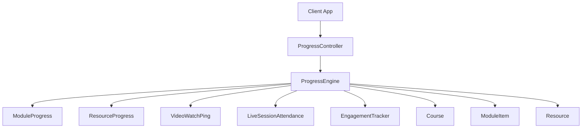
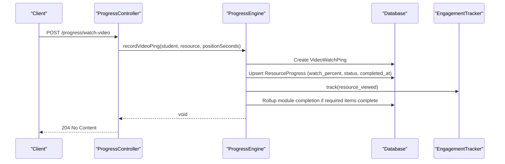
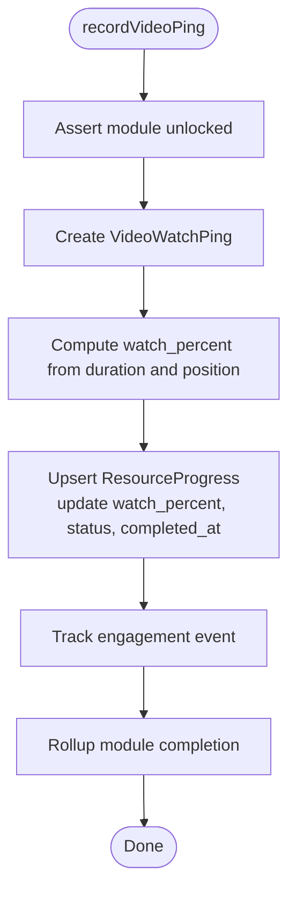
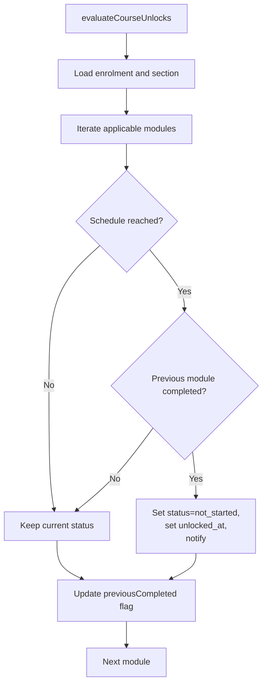
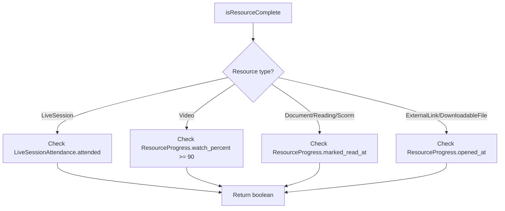
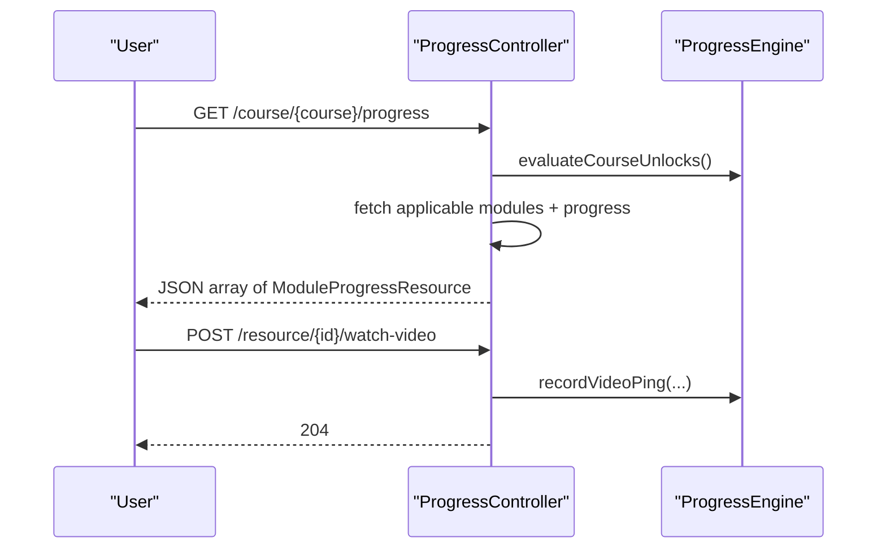
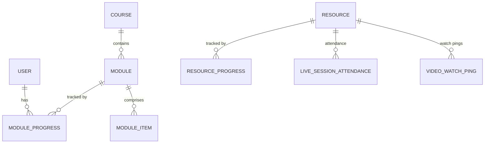
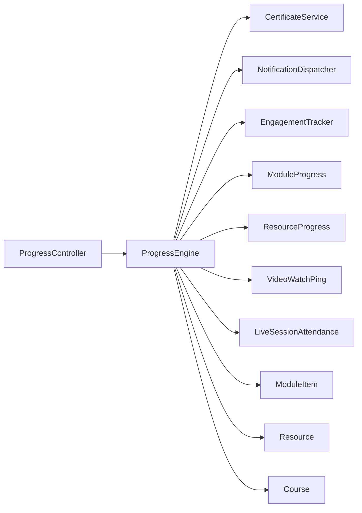

# Progress Services

<cite>
**Referenced Files in This Document**
- [ProgressEngine.php](file://app/Services/Progress/ProgressEngine.php)
- [ProgressController.php](file://app/Http/Controllers/Api/V1/ProgressController.php)
- [ModuleProgress.php](file://app/Models/ModuleProgress.php)
- [ResourceProgress.php](file://app/Models/ResourceProgress.php)
- [VideoWatchPing.php](file://app/Models/VideoWatchPing.php)
- [LiveSessionAttendance.php](file://app/Models/LiveSessionAttendance.php)
- [ModuleItem.php](file://app/Models/ModuleItem.php)
- [Resource.php](file://app/Models/Resource.php)
- [Course.php](file://app/Models/Course.php)
- [EngagementTracker.php](file://app/Services/Analytics/EngagementTracker.php)
- [ModuleProgressStatus.php](file://app/Enums/ModuleProgressStatus.php)
- [ResourceProgressStatus.php](file://app/Enums/ResourceProgressStatus.php)
- [ResourceType.php](file://app/Enums/ResourceType.php)
- [ModuleItemType.php](file://app/Enums/ModuleItemType.php)
</cite>

## Table of Contents
1. [Introduction](#introduction)
2. [Project Structure](#project-structure)
3. [Core Components](#core-components)
4. [Architecture Overview](#architecture-overview)
5. [Detailed Component Analysis](#detailed-component-analysis)
6. [Dependency Analysis](#dependency-analysis)
7. [Performance Considerations](#performance-considerations)
8. [Troubleshooting Guide](#troubleshooting-guide)
9. [Conclusion](#conclusion)

## Introduction
This document explains the Progress Services that calculate and track student progress through courses, modules, and resources. It focuses on the ProgressEngine, which centralizes completion algorithms, module unlocking logic, and progress aggregation across resource types. The service coordinates with video watch tracking, attendance monitoring, and completion status updates to provide accurate progress reporting and enable adaptive learning paths.

## Project Structure
The progress subsystem is organized around a single service (ProgressEngine), a thin API controller (ProgressController), domain models for progress state (ModuleProgress, ResourceProgress, VideoWatchPing, LiveSessionAttendance), and supporting enums and analytics.

**Diagram sources**
- [ProgressController.php:44-60](file://app/Http/Controllers/Api/V1/ProgressController.php#L44-L60)
- [ProgressEngine.php:50-81](file://app/Services/Progress/ProgressEngine.php#L50-L81)
- [ProgressEngine.php:126-152](file://app/Services/Progress/ProgressEngine.php#L126-L152)
- [ProgressEngine.php:180-205](file://app/Services/Progress/ProgressEngine.php#L180-L205)
- [ProgressEngine.php:218-244](file://app/Services/Progress/ProgressEngine.php#L218-L244)
- [ProgressEngine.php:246-286](file://app/Services/Progress/ProgressEngine.php#L246-L286)

**Section sources**
- [ProgressController.php:44-149](file://app/Http/Controllers/Api/V1/ProgressController.php#L44-L149)
- [ProgressEngine.php:33-286](file://app/Services/Progress/ProgressEngine.php#L33-L286)

## Core Components
- ProgressEngine: Central authority for unlocking modules, computing completion per item/resource type, rolling up module completion, issuing certificates, and recording engagement events.
- ProgressController: Thin HTTP layer delegating all write operations to ProgressEngine and exposing course progress and dashboard endpoints.
- Models:
  - ModuleProgress: Tracks per-student per-module status, unlock time, and completion time.
  - ResourceProgress: Tracks per-student per-resource progress including watch percentage, read/open timestamps, and completion.
  - VideoWatchPing: Records granular video watch pings used to compute watch percentage.
  - LiveSessionAttendance: Records attendance for live session resources.
  - ModuleItem: Links modules to resources, assignments, or evaluations and marks items as required.
  - Resource: Represents content items with typed extensions (video, document, reading, external link, SCORM, live session, downloadable file).
  - Course: Provides modules and enrollment context for section-based scheduling.
- Enums:
  - ModuleProgressStatus: locked, not_started, in_progress, completed.
  - ResourceProgressStatus: not_started, in_progress, completed.
  - ResourceType: video, document, reading, external_link, scorm, live_session, downloadable_file.
  - ModuleItemType: resource, assignment, evaluation.

**Section sources**
- [ProgressEngine.php:33-286](file://app/Services/Progress/ProgressEngine.php#L33-L286)
- [ProgressController.php:32-149](file://app/Http/Controllers/Api/V1/ProgressController.php#L32-L149)
- [ModuleProgress.php:11-44](file://app/Models/ModuleProgress.php#L11-L44)
- [ResourceProgress.php:11-48](file://app/Models/ResourceProgress.php#L11-L48)
- [VideoWatchPing.php:10-35](file://app/Models/VideoWatchPing.php#L10-L35)
- [LiveSessionAttendance.php:12-57](file://app/Models/LiveSessionAttendance.php#L12-L57)
- [ModuleItem.php:17-51](file://app/Models/ModuleItem.php#L17-L51)
- [Resource.php:15-102](file://app/Models/Resource.php#L15-L102)
- [Course.php:17-180](file://app/Models/Course.php#L17-L180)
- [ModuleProgressStatus.php:7-13](file://app/Enums/ModuleProgressStatus.php#L7-L13)
- [ResourceProgressStatus.php:7-12](file://app/Enums/ResourceProgressStatus.php#L7-L12)
- [ResourceType.php:7-16](file://app/Enums/ResourceType.php#L7-L16)
- [ModuleItemType.php:7-12](file://app/Enums/ModuleItemType.php#L7-L12)

## Architecture Overview
The system follows a clear separation of concerns:
- Controllers expose REST endpoints but do not implement business rules.
- ProgressEngine encapsulates all progression logic: unlocking, completion checks, rollups, and side effects (notifications, certificates, analytics).
- Models persist state and relationships; enums constrain states and types.
- EngagementTracker records consumption events for analytics.

**Diagram sources**
- [ProgressController.php:123-128](file://app/Http/Controllers/Api/V1/ProgressController.php#L123-L128)
- [ProgressEngine.php:218-244](file://app/Services/Progress/ProgressEngine.php#L218-L244)
- [ProgressEngine.php:126-152](file://app/Services/Progress/ProgressEngine.php#L126-L152)
- [EngagementTracker.php:21-35](file://app/Services/Analytics/EngagementTracker.php#L21-L35)

## Detailed Component Analysis

### ProgressEngine: Unlocking and Completion Aggregation
- Module unlocking:
  - Evaluates applicable modules for a student within a course, considering group membership and order.
  - Determines schedule reachability using either section-relative offsets or absolute scheduled start dates.
  - Unlocks modules when prerequisites are met and notifies students.
- Completion rollup:
  - Checks required module items (resources, assignments, evaluations) and marks the module completed when all are satisfied.
  - Triggers certificate issuance upon final module completion.
- Resource completion rules:
  - Video: completion at ≥90% watched based on ResourceProgress.watch_percent derived from VideoWatchPing positions.
  - Documents/readings: marked read timestamp indicates completion.
  - External links/downloadable files: opened timestamp indicates completion.
  - Live sessions: attendance recorded as attended.
- Guards:
  - All write actions assert the module is unlocked before recording progress.

**Diagram sources**
- [ProgressEngine.php:218-244](file://app/Services/Progress/ProgressEngine.php#L218-L244)

**Section sources**
- [ProgressEngine.php:50-99](file://app/Services/Progress/ProgressEngine.php#L50-L99)
- [ProgressEngine.php:126-168](file://app/Services/Progress/ProgressEngine.php#L126-L168)
- [ProgressEngine.php:180-205](file://app/Services/Progress/ProgressEngine.php#L180-L205)
- [ProgressEngine.php:211-216](file://app/Services/Progress/ProgressEngine.php#L211-L216)

### Module Unlocking Logic
- Applicable modules are filtered by group membership and ordered by index.
- Schedule reachability:
  - If enrolled in a section and module has an unlock offset, use section start date plus offset.
  - Otherwise, rely on module scheduled_start_at.
- When unlocked, set status to not_started and record unlock timestamp; notify student.

**Diagram sources**
- [ProgressEngine.php:50-81](file://app/Services/Progress/ProgressEngine.php#L50-L81)
- [ProgressEngine.php:89-99](file://app/Services/Progress/ProgressEngine.php#L89-L99)
- [ProgressEngine.php:109-118](file://app/Services/Progress/ProgressEngine.php#L109-L118)

**Section sources**
- [ProgressEngine.php:50-118](file://app/Services/Progress/ProgressEngine.php#L50-L118)

### Resource Completion Rules
- Video: watch_percent computed from ping positions; completion at ≥90%.
- Documents/readings/SCORM: completion when marked_read_at is present.
- External links/downloadable files: completion when opened_at is present.
- Live sessions: completion when attendance.attended is true.

**Diagram sources**
- [ProgressEngine.php:180-205](file://app/Services/Progress/ProgressEngine.php#L180-L205)

**Section sources**
- [ProgressEngine.php:180-205](file://app/Services/Progress/ProgressEngine.php#L180-L205)

### ProgressController Endpoints
- Course progress: evaluates unlocks on-demand and returns ordered module progress list.
- Dashboard: aggregates per-enrolment course-level status and percent complete, includes certificate info.
- Write endpoints:
  - watchVideo: delegates to ProgressEngine.recordVideoPing.
  - markRead/markOpened: update ResourceProgress and roll up completion.
  - markAttendance: records attendance for live sessions.
  - attendanceRoster: lists attendance for a live session resource.

**Diagram sources**
- [ProgressController.php:44-60](file://app/Http/Controllers/Api/V1/ProgressController.php#L44-L60)
- [ProgressController.php:67-121](file://app/Http/Controllers/Api/V1/ProgressController.php#L67-L121)
- [ProgressController.php:123-149](file://app/Http/Controllers/Api/V1/ProgressController.php#L123-L149)

**Section sources**
- [ProgressController.php:44-149](file://app/Http/Controllers/Api/V1/ProgressController.php#L44-L149)

### Data Model Relationships

**Diagram sources**
- [ModuleProgress.php:32-43](file://app/Models/ModuleProgress.php#L32-L43)
- [ResourceProgress.php:36-47](file://app/Models/ResourceProgress.php#L36-L47)
- [VideoWatchPing.php:26-34](file://app/Models/VideoWatchPing.php#L26-L34)
- [LiveSessionAttendance.php:37-56](file://app/Models/LiveSessionAttendance.php#L37-L56)
- [Resource.php:34-101](file://app/Models/Resource.php#L34-L101)
- [Course.php:118-121](file://app/Models/Course.php#L118-L121)

## Dependency Analysis
- ProgressEngine depends on:
  - CertificateService and NotificationDispatcher for side effects on completion/unlock.
  - EngagementTracker to log consumption events.
  - Models for persistence and queries.
  - Enums for state/type constraints.
- ProgressController depends on ProgressEngine and MediaStorageService for certificate URLs.
- Models depend on each other via Eloquent relationships.

**Diagram sources**
- [ProgressController.php:34-37](file://app/Http/Controllers/Api/V1/ProgressController.php#L34-L37)
- [ProgressEngine.php:35-39](file://app/Services/Progress/ProgressEngine.php#L35-L39)
- [ProgressEngine.php:126-152](file://app/Services/Progress/ProgressEngine.php#L126-L152)
- [EngagementTracker.php:21-35](file://app/Services/Analytics/EngagementTracker.php#L21-L35)

**Section sources**
- [ProgressController.php:32-149](file://app/Http/Controllers/Api/V1/ProgressController.php#L32-L149)
- [ProgressEngine.php:33-286](file://app/Services/Progress/ProgressEngine.php#L33-L286)

## Performance Considerations
- Idempotent unlock evaluation: evaluateCourseUnlocks can be called repeatedly without side effects beyond notifications when conditions change.
- Efficient queries:
  - Filter applicable modules once and reuse IDs for progress retrieval.
  - Use firstOrCreate/updateOrCreate to minimize writes.
- Batch-friendly rollups:
  - RollupModuleCompletion runs only when a completing signal arrives, avoiding constant recomputation.
- Watch percent calculation:
  - Derived from stored duration and latest ping position; avoid heavy computations by keeping ResourceProgress.watch_percent updated incrementally.

[No sources needed since this section provides general guidance]

## Troubleshooting Guide
- Module remains locked:
  - Verify schedule reachability (section offset vs scheduled_start_at) and that the previous module is completed.
  - Ensure the module is applicable to the student (group membership).
- Resource not marking complete:
  - For videos, ensure watch_percent reaches ≥90% via sufficient pings.
  - For documents/readings, confirm mark-read action sets marked_read_at.
  - For external links/downloadable files, confirm opened_at is set.
  - For live sessions, verify attendance.attended is true.
- Progress not reflected in dashboard:
  - Confirm courseProgress endpoint triggers evaluateCourseUnlocks and loads applicable modules.
  - Check that ModuleProgress rows exist for the student and modules.
- Attendance roster issues:
  - Ensure resource type is live_session and user has permission to view attendance.

**Section sources**
- [ProgressEngine.php:50-99](file://app/Services/Progress/ProgressEngine.php#L50-L99)
- [ProgressEngine.php:180-205](file://app/Services/Progress/ProgressEngine.php#L180-L205)
- [ProgressController.php:44-60](file://app/Http/Controllers/Api/V1/ProgressController.php#L44-L60)
- [ProgressController.php:155-181](file://app/Http/Controllers/Api/V1/ProgressController.php#L155-L181)

## Conclusion
The Progress Services centralize all progression logic behind ProgressEngine, ensuring consistent unlocking, completion, and reporting across diverse resource types. The thin controller layer keeps APIs simple while the engine handles complex rules, side effects, and analytics integration. This design supports accurate progress reporting and enables adaptive learning paths driven by real-time signals such as video watch pings, attendance, and assessment outcomes.