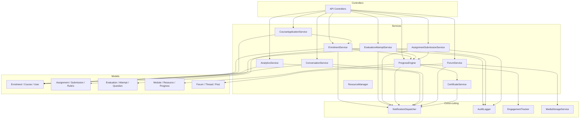
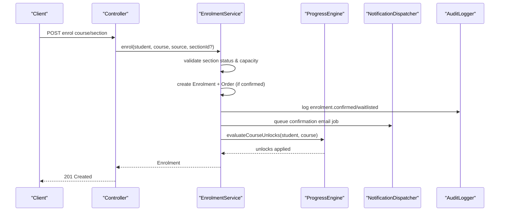
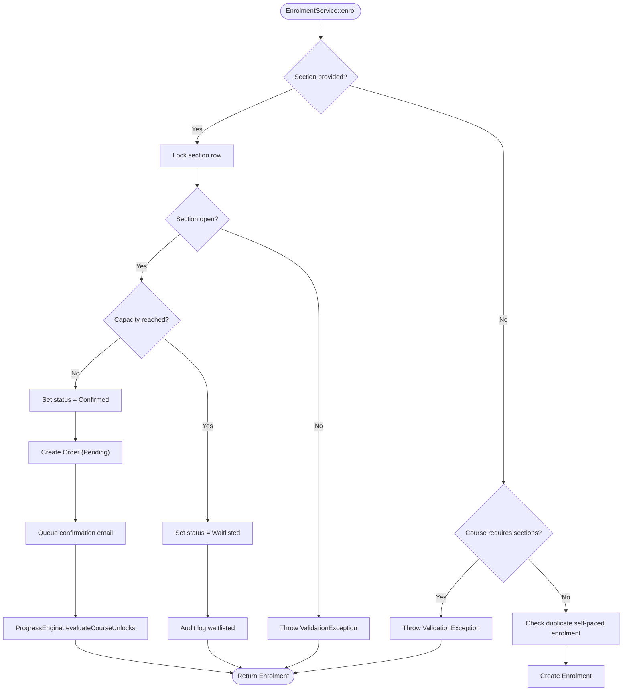
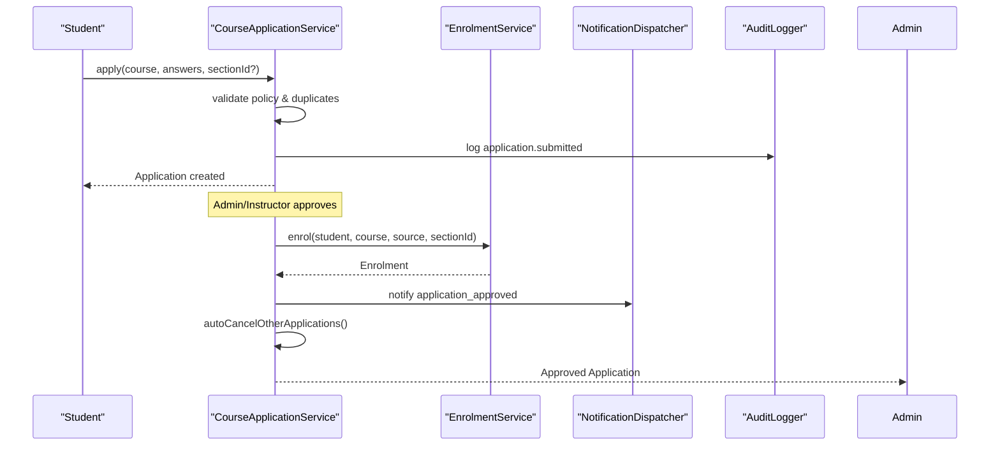
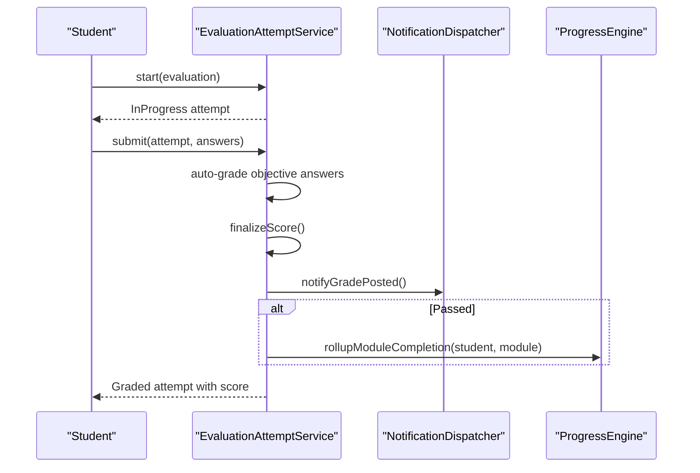
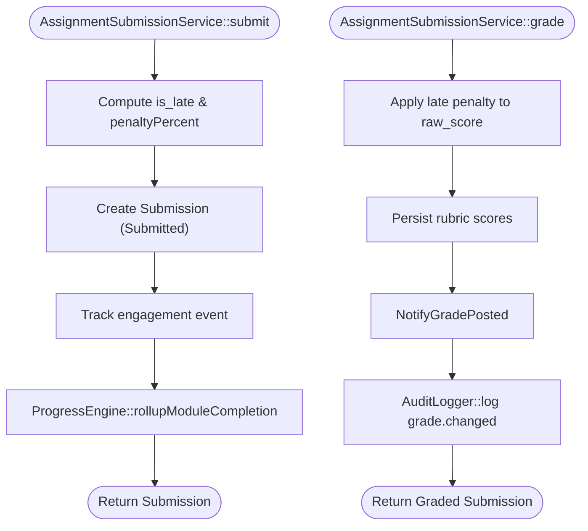
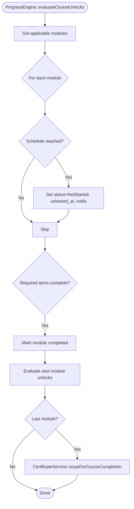
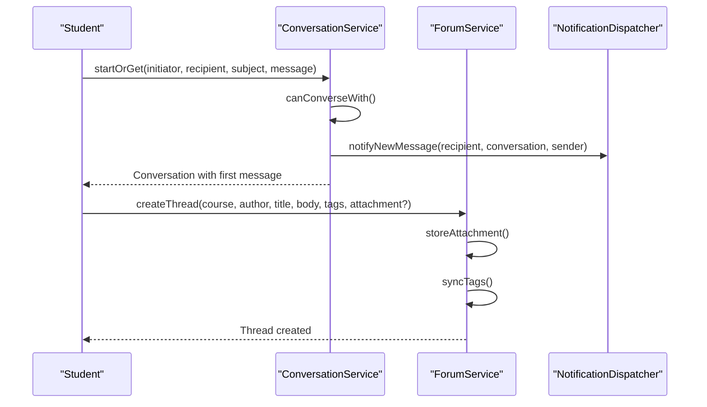
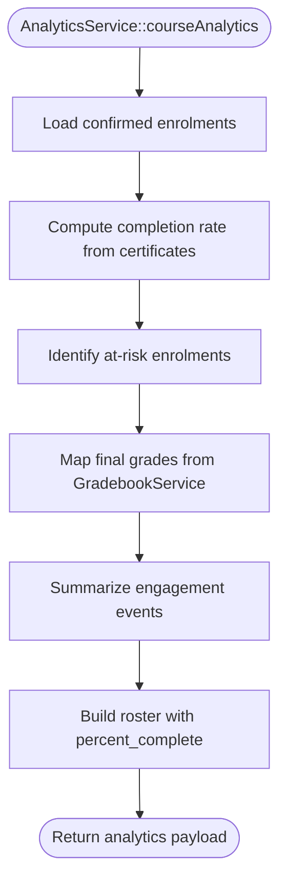
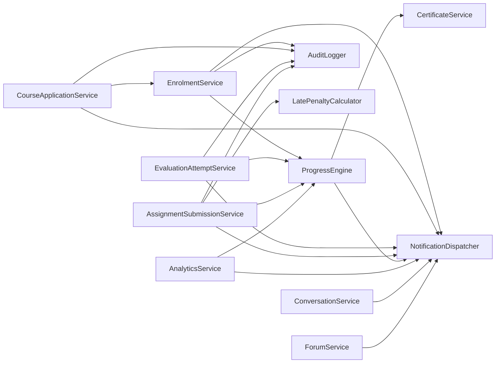

# Service Layer Architecture

<cite>
**Referenced Files in This Document**
- [EnrolmentService.php](file://app/Services/Enrolment/EnrolmentService.php)
- [CourseApplicationService.php](file://app/Services/Enrolment/CourseApplicationService.php)
- [EvaluationAttemptService.php](file://app/Services/Assessment/EvaluationAttemptService.php)
- [AssignmentSubmissionService.php](file://app/Services/Assessment/AssignmentSubmissionService.php)
- [LatePenaltyCalculator.php](file://app/Services/Assessment/LatePenaltyCalculator.php)
- [ProgressEngine.php](file://app/Services/Progress/ProgressEngine.php)
- [AnalyticsService.php](file://app/Services/Analytics/AnalyticsService.php)
- [ConversationService.php](file://app/Services/Communication/ConversationService.php)
- [ForumService.php](file://app/Services/Communication/ForumService.php)
- [NotificationDispatcher.php](file://app/Services/Notifications/NotificationDispatcher.php)
- [AuditLogger.php](file://app/Services/Audit/AuditLogger.php)
- [CertificateService.php](file://app/Services/Certification/CertificateService.php)
- [ResourceManager.php](file://app/Services/Content/ResourceManager.php)
</cite>

## Table of Contents
1. Introduction
2. Project Structure
3. Core Components
4. Architecture Overview
5. Detailed Component Analysis
6. Dependency Analysis
7. Performance Considerations
8. Troubleshooting Guide
9. Conclusion

## Introduction
This document explains the service layer architecture in the Laravel backend, focusing on how business logic is encapsulated in dedicated service classes under app/Services/. It documents the separation of concerns where HTTP controllers handle requests and validation while services orchestrate domain workflows, coordinate models, and integrate with external systems such as notifications, analytics, and storage. The documentation covers domain-specific service organization across Assessment, Communication, Enrolment, Progress, and Analytics, and illustrates complex business workflows like enrollment processing, assessment grading, and progress calculation.

## Project Structure
The service layer is organized by domain:
- Enrolment: course application and enrolment lifecycle, including waitlist handling and order creation
- Assessment: assignment submissions, evaluation attempts, grading, and late penalties
- Progress: module unlocking, resource completion rules, and roll-up to module/course completion
- Communication: 1:1 conversations, forums, tickets, and announcements
- Analytics: dashboards, at-risk detection, engagement metrics, and mass notices
- Cross-cutting: notifications, audit logging, certification, content management, and storage

**Diagram sources**
- [EnrolmentService.php:32-36](file://app/Services/Enrolment/EnrolmentService.php#L32-L36)
- [CourseApplicationService.php:35-39](file://app/Services/Enrolment/CourseApplicationService.php#L35-L39)
- [EvaluationAttemptService.php:28-33](file://app/Services/Assessment/EvaluationAttemptService.php#L28-L33)
- [AssignmentSubmissionService.php:26-32](file://app/Services/Assessment/AssignmentSubmissionService.php#L26-L32)
- [ProgressEngine.php:35-39](file://app/Services/Progress/ProgressEngine.php#L35-L39)
- [AnalyticsService.php:47-51](file://app/Services/Analytics/AnalyticsService.php#L47-L51)
- [ConversationService.php:25-25](file://app/Services/Communication/ConversationService.php#L25-L25)
- [ForumService.php:34-37](file://app/Services/Communication/ForumService.php#L34-L37)
- [NotificationDispatcher.php:25-25](file://app/Services/Notifications/NotificationDispatcher.php#L25-L25)
- [AuditLogger.php:13-13](file://app/Services/Audit/AuditLogger.php#L13-L13)
- [CertificateService.php:21-21](file://app/Services/Certification/CertificateService.php#L21-L21)
- [ResourceManager.php:28-28](file://app/Services/Content/ResourceManager.php#L28-L28)

**Section sources**
- [EnrolmentService.php:32-36](file://app/Services/Enrolment/EnrolmentService.php#L32-L36)
- [CourseApplicationService.php:35-39](file://app/Services/Enrolment/CourseApplicationService.php#L35-L39)
- [EvaluationAttemptService.php:28-33](file://app/Services/Assessment/EvaluationAttemptService.php#L28-L33)
- [AssignmentSubmissionService.php:26-32](file://app/Services/Assessment/AssignmentSubmissionService.php#L26-L32)
- [ProgressEngine.php:35-39](file://app/Services/Progress/ProgressEngine.php#L35-L39)
- [AnalyticsService.php:47-51](file://app/Services/Analytics/AnalyticsService.php#L47-L51)
- [ConversationService.php:25-25](file://app/Services/Communication/ConversationService.php#L25-L25)
- [ForumService.php:34-37](file://app/Services/Communication/ForumService.php#L34-L37)
- [NotificationDispatcher.php:25-25](file://app/Services/Notifications/NotificationDispatcher.php#L25-L25)
- [AuditLogger.php:13-13](file://app/Services/Audit/AuditLogger.php#L13-L13)
- [CertificateService.php:21-21](file://app/Services/Certification/CertificateService.php#L21-L21)
- [ResourceManager.php:28-28](file://app/Services/Content/ResourceManager.php#L28-L28)

## Core Components
- EnrolmentService: Orchestrates student enrolment into courses and sections, handles capacity checks, waitlisting, order creation, confirmation emails, and progress initialization.
- CourseApplicationService: Manages application lifecycles (apply, approve, reject), enforces policy constraints, and delegates final enrolment to EnrolmentService.
- EvaluationAttemptService: Handles attempt lifecycle, question selection, auto-grading for objective questions, manual grading queues, score finalization, and progress roll-up on pass.
- AssignmentSubmissionService: Accepts submissions, computes late penalties, records rubric scores during grading, notifies students, and triggers progress roll-up on submission.
- ProgressEngine: Central authority for module unlocking and completion; evaluates schedules, required items, per-resource completion rules, and triggers certificate issuance on course completion.
- AnalyticsService: Aggregates read-only analytics (completion rates, at-risk flags, engagement summaries) and supports mass notifications to at-risk students.
- ConversationService and ForumService: Provide communication features with role-based permissions, thread management, tagging, attachments, and notifications.
- NotificationDispatcher: Single write path for in-app notifications, used by all services to notify users about events.
- AuditLogger: Centralized audit trail for sensitive mutations.
- CertificateService: Issues certificates upon course completion and dispatches PDF generation asynchronously.
- ResourceManager: Creates/updates resources across multiple subtype tables and keeps module item metadata consistent.

**Section sources**
- [EnrolmentService.php:44-147](file://app/Services/Enrolment/EnrolmentService.php#L44-L147)
- [CourseApplicationService.php:44-153](file://app/Services/Enrolment/CourseApplicationService.php#L44-L153)
- [EvaluationAttemptService.php:35-206](file://app/Services/Assessment/EvaluationAttemptService.php#L35-L206)
- [AssignmentSubmissionService.php:37-115](file://app/Services/Assessment/AssignmentSubmissionService.php#L37-L115)
- [ProgressEngine.php:50-286](file://app/Services/Progress/ProgressEngine.php#L50-L286)
- [AnalyticsService.php:56-304](file://app/Services/Analytics/AnalyticsService.php#L56-L304)
- [ConversationService.php:27-162](file://app/Services/Communication/ConversationService.php#L27-L162)
- [ForumService.php:39-221](file://app/Services/Communication/ForumService.php#L39-L221)
- [NotificationDispatcher.php:27-204](file://app/Services/Notifications/NotificationDispatcher.php#L27-L204)
- [AuditLogger.php:18-27](file://app/Services/Audit/AuditLogger.php#L18-L27)
- [CertificateService.php:23-45](file://app/Services/Certification/CertificateService.php#L23-L45)
- [ResourceManager.php:33-178](file://app/Services/Content/ResourceManager.php#L33-L178)

## Architecture Overview
The service layer follows a clear separation of concerns:
- Controllers receive and validate HTTP requests, then delegate to services
- Services encapsulate business rules, coordinate models, and call cross-cutting services
- Cross-cutting services provide notifications, auditing, analytics tracking, and storage
- Models represent domain entities; services enforce invariants and orchestrate transactions

**Diagram sources**
- [EnrolmentService.php:44-147](file://app/Services/Enrolment/EnrolmentService.php#L44-L147)
- [ProgressEngine.php:50-81](file://app/Services/Progress/ProgressEngine.php#L50-L81)
- [NotificationDispatcher.php:27-39](file://app/Services/Notifications/NotificationDispatcher.php#L27-L39)
- [AuditLogger.php:18-27](file://app/Services/Audit/AuditLogger.php#L18-L27)

## Detailed Component Analysis

### Enrolment Workflow
- Validates section availability and capacity using pessimistic locking
- Creates enrolment with appropriate status (Confirmed or Waitlisted)
- For confirmed enrolments: creates an order, logs audit, queues confirmation email, and initializes progress
- On withdrawal: decrements seats and promotes oldest waitlisted enrolment if applicable

**Diagram sources**
- [EnrolmentService.php:44-147](file://app/Services/Enrolment/EnrolmentService.php#L44-L147)

**Section sources**
- [EnrolmentService.php:44-147](file://app/Services/Enrolment/EnrolmentService.php#L44-L147)

### Course Application Flow
- Applies only when course requires applications
- Prevents duplicate pending applications per course/section
- Approve delegates to EnrolmentService to perform enrolment (confirmed or waitlisted)
- Rejects update state and notify student; auto-cancels other pending applications for same course

**Diagram sources**
- [CourseApplicationService.php:44-153](file://app/Services/Enrolment/CourseApplicationService.php#L44-L153)
- [EnrolmentService.php:44-147](file://app/Services/Enrolment/EnrolmentService.php#L44-L147)

**Section sources**
- [CourseApplicationService.php:44-153](file://app/Services/Enrolment/CourseApplicationService.php#L44-L153)

### Assessment Grading Workflow
- Starts an attempt with availability and attempt limit checks
- Retrieves questions with optional randomization and subset selection
- Submits answers: auto-grade objective questions, mark others for manual grading
- Finalizes score: compute percentage, set passed based on threshold, notify student, and roll up module completion if passed

**Diagram sources**
- [EvaluationAttemptService.php:35-206](file://app/Services/Assessment/EvaluationAttemptService.php#L35-L206)

**Section sources**
- [EvaluationAttemptService.php:35-206](file://app/Services/Assessment/EvaluationAttemptService.php#L35-L206)

### Assignment Submission and Late Penalty
- Records submission with late detection and penalty percent from configured tiers
- Triggers progress roll-up immediately on submission
- Grading applies late penalty to raw score, persists rubric scores, notifies student, and audits grade changes

**Diagram sources**
- [AssignmentSubmissionService.php:37-115](file://app/Services/Assessment/AssignmentSubmissionService.php#L37-L115)
- [LatePenaltyCalculator.php:17-34](file://app/Services/Assessment/LatePenaltyCalculator.php#L17-L34)

**Section sources**
- [AssignmentSubmissionService.php:37-115](file://app/Services/Assessment/AssignmentSubmissionService.php#L37-L115)
- [LatePenaltyCalculator.php:17-34](file://app/Services/Assessment/LatePenaltyCalculator.php#L17-L34)

### Progress Calculation and Module Unlocking
- Evaluates course modules per student considering schedule and group membership
- Determines unlock conditions using either absolute scheduled_start_at or section-relative unlock_offset_days
- Computes completion per resource type (video watch percent, mark-as-read, opened, attendance)
- Rolls up module completion when all required items are complete and unlocks next modules
- Issues certificate on last module completion

**Diagram sources**
- [ProgressEngine.php:50-151](file://app/Services/Progress/ProgressEngine.php#L50-L151)
- [CertificateService.php:23-35](file://app/Services/Certification/CertificateService.php#L23-L35)

**Section sources**
- [ProgressEngine.php:50-286](file://app/Services/Progress/ProgressEngine.php#L50-L286)
- [CertificateService.php:23-35](file://app/Services/Certification/CertificateService.php#L23-L35)

### Communication Services
- ConversationService enforces role-based permissions for messaging and reuses existing 1:1 conversations
- ForumService manages threads, posts, tags, attachments, and staff moderation actions
- Both rely on NotificationDispatcher to notify relevant users

**Diagram sources**
- [ConversationService.php:27-97](file://app/Services/Communication/ConversationService.php#L27-L97)
- [ForumService.php:39-86](file://app/Services/Communication/ForumService.php#L39-L86)
- [NotificationDispatcher.php:81-91](file://app/Services/Notifications/NotificationDispatcher.php#L81-L91)

**Section sources**
- [ConversationService.php:27-162](file://app/Services/Communication/ConversationService.php#L27-L162)
- [ForumService.php:39-221](file://app/Services/Communication/ForumService.php#L39-L221)

### Analytics Services
- Reads aggregated data from EngagementEvent, ModuleProgress, Certificates, Orders, and other sources
- Identifies at-risk students based on grace period and inactivity windows
- Supports sending mass reminders to flagged students via NotificationDispatcher

**Diagram sources**
- [AnalyticsService.php:56-117](file://app/Services/Analytics/AnalyticsService.php#L56-L117)

**Section sources**
- [AnalyticsService.php:56-304](file://app/Services/Analytics/AnalyticsService.php#L56-L304)

## Dependency Analysis
Services compose dependencies through constructor injection:
- EnrolmentService depends on AuditLogger, ProgressEngine, NotificationDispatcher
- CourseApplicationService depends on AuditLogger, NotificationDispatcher, EnrolmentService
- EvaluationAttemptService depends on ProgressEngine, NotificationDispatcher, EngagementTracker, AuditLogger
- AssignmentSubmissionService depends on LatePenaltyCalculator, ProgressEngine, NotificationDispatcher, EngagementTracker, AuditLogger
- ProgressEngine depends on CertificateService, NotificationDispatcher, EngagementTracker
- AnalyticsService depends on GradebookService, ProgressEngine, NotificationDispatcher
- ConversationService and ForumService depend on NotificationDispatcher and MediaStorageService
- All services use models directly for persistence

**Diagram sources**
- [EnrolmentService.php:32-36](file://app/Services/Enrolment/EnrolmentService.php#L32-L36)
- [CourseApplicationService.php:35-39](file://app/Services/Enrolment/CourseApplicationService.php#L35-L39)
- [EvaluationAttemptService.php:28-33](file://app/Services/Assessment/EvaluationAttemptService.php#L28-L33)
- [AssignmentSubmissionService.php:26-32](file://app/Services/Assessment/AssignmentSubmissionService.php#L26-L32)
- [ProgressEngine.php:35-39](file://app/Services/Progress/ProgressEngine.php#L35-L39)
- [AnalyticsService.php:47-51](file://app/Services/Analytics/AnalyticsService.php#L47-L51)
- [ConversationService.php:25-25](file://app/Services/Communication/ConversationService.php#L25-L25)
- [ForumService.php:34-37](file://app/Services/Communication/ForumService.php#L34-L37)

**Section sources**
- [EnrolmentService.php:32-36](file://app/Services/Enrolment/EnrolmentService.php#L32-L36)
- [CourseApplicationService.php:35-39](file://app/Services/Enrolment/CourseApplicationService.php#L35-L39)
- [EvaluationAttemptService.php:28-33](file://app/Services/Assessment/EvaluationAttemptService.php#L28-L33)
- [AssignmentSubmissionService.php:26-32](file://app/Services/Assessment/AssignmentSubmissionService.php#L26-L32)
- [ProgressEngine.php:35-39](file://app/Services/Progress/ProgressEngine.php#L35-L39)
- [AnalyticsService.php:47-51](file://app/Services/Analytics/AnalyticsService.php#L47-L51)
- [ConversationService.php:25-25](file://app/Services/Communication/ConversationService.php#L25-L25)
- [ForumService.php:34-37](file://app/Services/Communication/ForumService.php#L34-L37)

## Performance Considerations
- Use database transactions for multi-step writes to ensure consistency (e.g., enrolment creation, order creation, waitlist promotion)
- Pessimistic locking on section rows prevents race conditions during capacity checks and promotions
- Avoid N+1 queries by eager loading related data where needed (e.g., module items, evaluations, questions)
- Keep analytics queries efficient with grouped aggregations and selective columns
- Offload heavy tasks (PDF generation, email delivery) to jobs to keep request cycles fast
- Reuse shared services (ProgressEngine, NotificationDispatcher) to centralize logic and reduce duplication

[No sources needed since this section provides general guidance]

## Troubleshooting Guide
Common issues and resolutions:
- Section not open or closed: EnrolmentService throws validation errors; verify section status before enrolment
- Duplicate self-paced enrolment: EnrolmentService prevents multiple confirmed enrolments without section_id; check existing enrolments
- Time limit exceeded for evaluation: EvaluationAttemptService rejects submissions past deadline; ensure client respects time limits
- Manual grading required: Non-auto-gradable questions require instructor grading; confirm grading workflow is triggered
- Module locked: ProgressEngine asserts module unlock before recording progress; verify schedule and prerequisites
- At-risk identification: AnalyticsService uses grace period and inactivity thresholds; adjust constants if policies change

**Section sources**
- [EnrolmentService.php:58-92](file://app/Services/Enrolment/EnrolmentService.php#L58-L92)
- [EvaluationAttemptService.php:107-110](file://app/Services/Assessment/EvaluationAttemptService.php#L107-L110)
- [ProgressEngine.php:211-216](file://app/Services/Progress/ProgressEngine.php#L211-L216)
- [AnalyticsService.php:172-187](file://app/Services/Analytics/AnalyticsService.php#L172-L187)

## Conclusion
The service layer cleanly separates HTTP concerns from business logic, providing robust, testable, and maintainable workflows across enrolment, assessment, progress, communication, and analytics. Services coordinate models and cross-cutting concerns consistently, ensuring reliable state transitions, comprehensive auditing, and timely user notifications. This architecture supports scalable growth and clear ownership of domain responsibilities.

[No sources needed since this section summarizes without analyzing specific files]