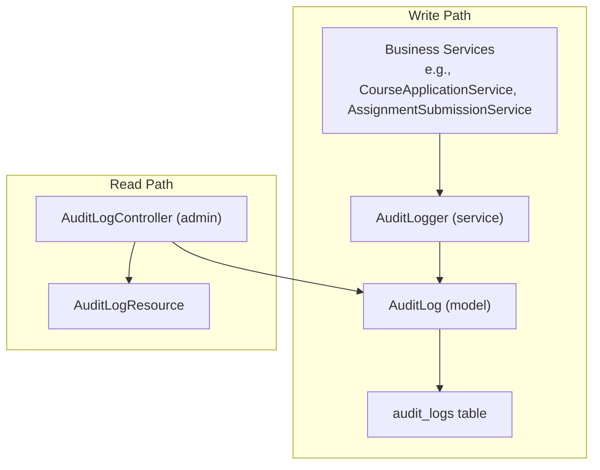
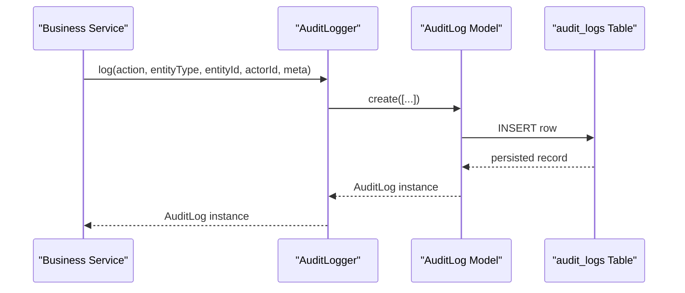
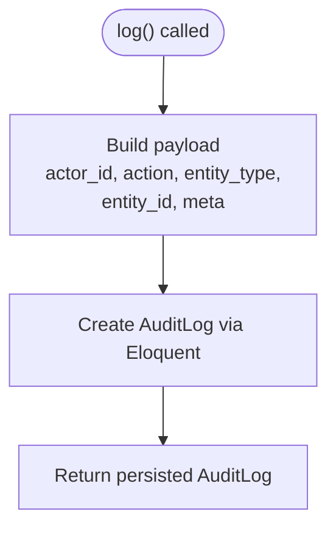
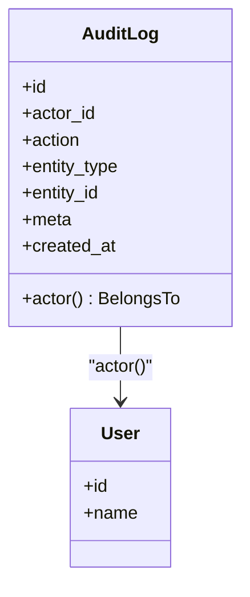
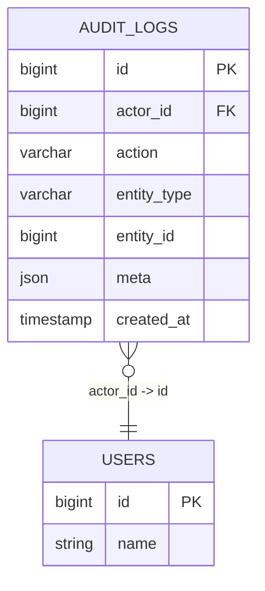
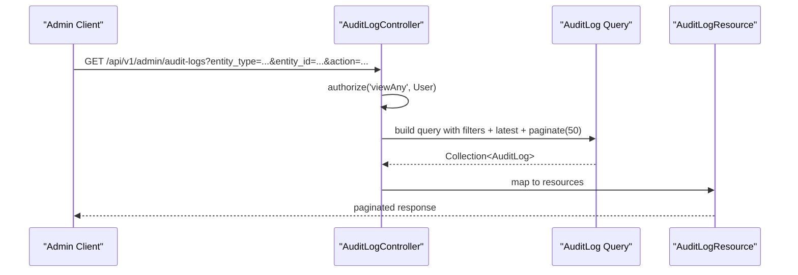
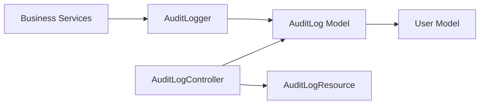

# Audit Logging Service

<cite>
**Referenced Files in This Document**
- [AuditLogger.php](file://app/Services/Audit/AuditLogger.php)
- [AuditLog.php](file://app/Models/AuditLog.php)
- [2024_01_01_000191_create_audit_logs_table.php](file://database/migrations/2024_01_01_000191_create_audit_logs_table.php)
- [AuditLogResource.php](file://app/Http/Resources/AuditLogResource.php)
- [AuditLogController.php](file://app/Http/Controllers/Api/V1/Admin/AuditLogController.php)
- [CourseApplicationService.php](file://app/Services/Enrolment/CourseApplicationService.php)
- [AssignmentSubmissionService.php](file://app/Services/Assessment/AssignmentSubmissionService.php)
- [AuditLogFactory.php](file://database/factories/AuditLogFactory.php)
- [AuditLogTest.php](file://tests/Feature/Audit/AuditLogTest.php)
</cite>

## Table of Contents
1. [Introduction](#introduction)
2. [Project Structure](#project-structure)
3. [Core Components](#core-components)
4. [Architecture Overview](#architecture-overview)
5. [Detailed Component Analysis](#detailed-component-analysis)
6. [Dependency Analysis](#dependency-analysis)
7. [Performance Considerations](#performance-considerations)
8. [Troubleshooting Guide](#troubleshooting-guide)
9. [Conclusion](#conclusion)
10. [Appendices](#appendices)

## Introduction
This document explains the Audit Logging Service that records system activities and user actions across the application. It covers how the service captures events, the data model and database schema, query patterns for retrieving audit trails, examples of logging different event types, filtering logs by user or action type, implementing custom audit loggers for business operations, and performance considerations for high-volume scenarios.

## Project Structure
The audit logging feature spans a small set of focused components:
- A single write path service to record audit entries
- An Eloquent model representing audit records
- A migration defining the database schema
- A resource for API responses
- An admin controller exposing read-only endpoints with filtering
- Business services that call the logger at key mutation points
- Tests validating behavior and access control

**Diagram sources**
- [AuditLogger.php:18-27](file://app/Services/Audit/AuditLogger.php#L18-L27)
- [AuditLog.php:12-38](file://app/Models/AuditLog.php#L12-L38)
- [2024_01_01_000191_create_audit_logs_table.php:11-23](file://database/migrations/2024_01_01_000191_create_audit_logs_table.php#L11-L23)
- [AuditLogController.php:20-33](file://app/Http/Controllers/Api/V1/Admin/AuditLogController.php#L20-L33)
- [AuditLogResource.php:15-26](file://app/Http/Resources/AuditLogResource.php#L15-L26)

**Section sources**
- [AuditLogger.php:1-29](file://app/Services/Audit/AuditLogger.php#L1-L29)
- [AuditLog.php:1-39](file://app/Models/AuditLog.php#L1-L39)
- [2024_01_01_000191_create_audit_logs_table.php:1-31](file://database/migrations/2024_01_01_000191_create_audit_logs_table.php#L1-L31)
- [AuditLogController.php:1-35](file://app/Http/Controllers/Api/V1/Admin/AuditLogController.php#L1-L35)
- [AuditLogResource.php:1-28](file://app/Http/Resources/AuditLogResource.php#L1-L28)

## Core Components
- AuditLogger service: Centralized write entry point for all audit events. Accepts action, entity type, entity id, actor id, and optional metadata.
- AuditLog model: Eloquent representation of an audit record with fillable fields, JSON casting for metadata, and a relationship to the actor user.
- Database schema: Defines columns for actor, action, entity identification, metadata, and timestamp; includes an index for efficient queries by entity.
- AuditLogResource: Serializes audit records for API responses, including actor when loaded.
- AuditLogController: Read-only endpoint for admins to list audit logs with filters and pagination.

Key responsibilities:
- Enforce a single write path for audit logs to ensure consistency and compliance
- Provide structured, queryable records for who did what, when, and on which entity
- Expose filtered retrieval for auditing and reporting

**Section sources**
- [AuditLogger.php:9-27](file://app/Services/Audit/AuditLogger.php#L9-L27)
- [AuditLog.php:17-37](file://app/Models/AuditLog.php#L17-L37)
- [2024_01_01_000191_create_audit_logs_table.php:13-23](file://database/migrations/2024_01_01_000191_create_audit_logs_table.php#L13-L23)
- [AuditLogResource.php:15-26](file://app/Http/Resources/AuditLogResource.php#L15-L26)
- [AuditLogController.php:20-33](file://app/Http/Controllers/Api/V1/Admin/AuditLogController.php#L20-L33)

## Architecture Overview
The architecture separates writing and reading concerns:
- Writing: Business services invoke AuditLogger at critical mutation points to record immutable audit entries.
- Reading: Admin controllers expose read-only endpoints to retrieve and filter audit logs.

**Diagram sources**
- [AuditLogger.php:18-27](file://app/Services/Audit/AuditLogger.php#L18-L27)
- [AuditLog.php:19-29](file://app/Models/AuditLog.php#L19-L29)
- [2024_01_01_000191_create_audit_logs_table.php:13-23](file://database/migrations/2024_01_01_000191_create_audit_logs_table.php#L13-L23)

## Detailed Component Analysis

### AuditLogger Service
- Purpose: Single write path for audit logs to ensure every sensitive mutation is recorded consistently.
- Inputs:
  - action: machine-readable event identifier (e.g., enrolment.confirmed, grade.changed)
  - entityType: domain entity type (e.g., enrolment, assignment_submission)
  - entityId: primary key of the affected entity
  - actorId: optional user id performing the action; null for system/automated actions
  - meta: optional structured context (e.g., from/to status, scores)
- Output: Persisted AuditLog instance

Usage examples in codebase:
- Course application lifecycle: submission, approval, rejection, dismissal
- Grading changes: capturing raw and final scores
- User management: role/status changes
- Module operations: creation and updates

**Diagram sources**
- [AuditLogger.php:18-27](file://app/Services/Audit/AuditLogger.php#L18-L27)

**Section sources**
- [AuditLogger.php:9-27](file://app/Services/Audit/AuditLogger.php#L9-L27)
- [CourseApplicationService.php:91-97](file://app/Services/Enrolment/CourseApplicationService.php#L91-L97)
- [CourseApplicationService.php:128-139](file://app/Services/Enrolment/CourseApplicationService.php#L128-L139)
- [CourseApplicationService.php:177-188](file://app/Services/Enrolment/CourseApplicationService.php#L177-L188)
- [CourseApplicationService.php:209-219](file://app/Services/Enrolment/CourseApplicationService.php#L209-L219)
- [CourseApplicationService.php:278-284](file://app/Services/Enrolment/CourseApplicationService.php#L278-L284)
- [AssignmentSubmissionService.php:105-111](file://app/Services/Assessment/AssignmentSubmissionService.php#L105-L111)

### AuditLog Model
- Fields: actor_id, action, entity_type, entity_id, meta, created_at
- Casting: meta stored as JSON and cast to array
- Relationship: belongsTo User via actor_id
- Updated at: disabled to preserve immutability semantics

**Diagram sources**
- [AuditLog.php:12-38](file://app/Models/AuditLog.php#L12-L38)

**Section sources**
- [AuditLog.php:17-37](file://app/Models/AuditLog.php#L17-L37)

### Database Schema
- Columns:
  - id: primary key
  - actor_id: nullable foreign key to users (system actions can be null)
  - action: string describing the event
  - entity_type: string identifying the affected domain entity
  - entity_id: unsigned integer referencing the entity’s primary key
  - meta: JSON column for flexible context
  - created_at: timestamp of the event
- Indexes:
  - Composite index on (entity_type, entity_id) to optimize lookups per entity

**Diagram sources**
- [2024_01_01_000191_create_audit_logs_table.php:13-23](file://database/migrations/2024_01_01_000191_create_audit_logs_table.php#L13-L23)

**Section sources**
- [2024_01_01_000191_create_audit_logs_table.php:11-23](file://database/migrations/2024_01_01_000191_create_audit_logs_table.php#L11-L23)

### API Access and Filtering
- Endpoint: Admin-only GET listing audit logs
- Authorization: Requires permission to view any user (enforced via policy)
- Filters:
  - entity_type: exact match
  - entity_id: exact match
  - action: exact match
- Ordering: newest first by id
- Pagination: fixed page size
- Response: collection of AuditLogResource including actor when loaded

**Diagram sources**
- [AuditLogController.php:20-33](file://app/Http/Controllers/Api/V1/Admin/AuditLogController.php#L20-L33)
- [AuditLogResource.php:15-26](file://app/Http/Resources/AuditLogResource.php#L15-L26)

**Section sources**
- [AuditLogController.php:14-33](file://app/Http/Controllers/Api/V1/Admin/AuditLogController.php#L14-L33)
- [AuditLogResource.php:10-26](file://app/Http/Resources/AuditLogResource.php#L10-L26)

### Examples of Logging Different Event Types
- Course application submitted:
  - Action: course_application.submitted
  - Entity: course_application
  - Meta: course_id, section_id
- Course application approved:
  - Action: course_application.approved
  - Entity: course_application
  - Meta: course_id, section_id, student_id, decided_by_role
- Course application auto-cancelled due to enrollment:
  - Action: course_application.auto_cancelled_on_enrollment
  - Entity: course_application
  - Meta: course_id, section_id, approved_application_id, approved_section_id
- Course application rejected:
  - Action: course_application.rejected
  - Entity: course_application
  - Meta: course_id, student_id, decided_by_role
- Course application dismissed:
  - Action: course_application.dismissed
  - Entity: course_application
  - Meta: course_id
- Grade changed:
  - Action: grade.changed
  - Entity: assignment_submission
  - Meta: raw_score, final_score

These examples demonstrate how to capture both the “who” (actor), “what” (action), “on what” (entity), and “context” (meta).

**Section sources**
- [CourseApplicationService.php:91-97](file://app/Services/Enrolment/CourseApplicationService.php#L91-L97)
- [CourseApplicationService.php:128-139](file://app/Services/Enrolment/CourseApplicationService.php#L128-L139)
- [CourseApplicationService.php:177-188](file://app/Services/Enrolment/CourseApplicationService.php#L177-L188)
- [CourseApplicationService.php:209-219](file://app/Services/Enrolment/CourseApplicationService.php#L209-L219)
- [CourseApplicationService.php:278-284](file://app/Services/Enrolment/CourseApplicationService.php#L278-L284)
- [AssignmentSubmissionService.php:105-111](file://app/Services/Assessment/AssignmentSubmissionService.php#L105-L111)

### Filtering Audit Logs by User or Action Type
- By entity type: pass entity_type query parameter to the admin endpoint
- By specific entity: pass entity_id along with entity_type
- By action: pass action query parameter
- Actor-based filtering: not exposed directly via query params; you can filter by entity_type/entity_id and then inspect actor in the response, or extend the controller to support actor_id filtering if needed

Tests demonstrate:
- Filtering by entity_type returns only matching logs
- Access control denies non-admin users from viewing audit logs

**Section sources**
- [AuditLogController.php:24-30](file://app/Http/Controllers/Api/V1/Admin/AuditLogController.php#L24-L30)
- [AuditLogTest.php:91-101](file://tests/Feature/Audit/AuditLogTest.php#L91-L101)
- [AuditLogTest.php:83-89](file://tests/Feature/Audit/AuditLogTest.php#L83-L89)

### Implementing Custom Audit Loggers for Specific Business Operations
- Use the existing AuditLogger::log method in your service methods where state changes occur
- Choose a stable, namespaced action string (e.g., module.created, module.updated)
- Set entityType to the relevant domain entity
- Capture meaningful meta for context (e.g., old/new values, IDs, roles)
- If you need specialized formatting or batching, wrap calls to AuditLogger in a higher-level helper within your service while keeping the single write path principle

Example integration points in this codebase:
- Course application lifecycle
- Grading workflow
- User management operations

**Section sources**
- [AuditLogger.php:18-27](file://app/Services/Audit/AuditLogger.php#L18-L27)
- [CourseApplicationService.php:91-97](file://app/Services/Enrolment/CourseApplicationService.php#L91-L97)
- [AssignmentSubmissionService.php:105-111](file://app/Services/Assessment/AssignmentSubmissionService.php#L105-L111)

## Dependency Analysis
- AuditLogger depends on AuditLog model to persist records
- AuditLog model depends on User for actor relationship
- AuditLogController depends on AuditLog model for querying and AuditLogResource for serialization
- Business services depend on AuditLogger to record events

**Diagram sources**
- [AuditLogger.php:7-27](file://app/Services/Audit/AuditLogger.php#L7-L27)
- [AuditLog.php:7-37](file://app/Models/AuditLog.php#L7-L37)
- [AuditLogController.php:7-33](file://app/Http/Controllers/Api/V1/Admin/AuditLogController.php#L7-L33)
- [AuditLogResource.php:7-26](file://app/Http/Resources/AuditLogResource.php#L7-L26)

**Section sources**
- [AuditLogger.php:1-29](file://app/Services/Audit/AuditLogger.php#L1-L29)
- [AuditLog.php:1-39](file://app/Models/AuditLog.php#L1-L39)
- [AuditLogController.php:1-35](file://app/Http/Controllers/Api/V1/Admin/AuditLogController.php#L1-L35)
- [AuditLogResource.php:1-28](file://app/Http/Resources/AuditLogResource.php#L1-L28)

## Performance Considerations
- Write path simplicity: The logger performs a single insert per event, minimizing overhead in hot paths.
- Indexing: The composite index on (entity_type, entity_id) supports efficient per-entity lookups.
- Pagination: The admin endpoint paginates results to limit memory usage and network payload.
- N+1 avoidance: The controller eager-loads actor to avoid additional queries per record.
- High-volume strategies:
  - Batch inserts: For bulk operations, consider batching multiple AuditLog inserts to reduce transaction overhead.
  - Asynchronous writes: Offload audit logging to background jobs to decouple from request latency.
  - Partitioning or archival: For long-term retention, partition by time or archive older logs to cheaper storage.
  - Sampling: For extremely high-frequency events, consider sampling strategies while retaining critical mutations.
  - Denormalization: Add frequently queried derived columns if necessary, but prefer indexed queries first.

[No sources needed since this section provides general guidance]

## Troubleshooting Guide
- Missing audit entries:
  - Verify that the business service invokes the logger at the correct mutation points
  - Check that actor_id is set appropriately; system actions may have null actor_id
- Incorrect filters:
  - Ensure query parameters match the expected keys: entity_type, entity_id, action
  - Confirm that entity_type and entity_id are correctly passed from callers
- Authorization errors:
  - Only authorized users (e.g., admins) can access audit logs; verify policies and roles
- Performance issues:
  - Large result sets without pagination can degrade performance; use pagination
  - Avoid excessive joins; rely on indexes and eager loading

Validation references:
- Tests confirm that grading changes produce audit logs with correct actor and entity
- Tests confirm enrolment withdrawal logs include from/to status in meta
- Tests enforce authorization for audit log access

**Section sources**
- [AuditLogTest.php:18-38](file://tests/Feature/Audit/AuditLogTest.php#L18-L38)
- [AuditLogTest.php:40-54](file://tests/Feature/Audit/AuditLogTest.php#L40-L54)
- [AuditLogTest.php:83-89](file://tests/Feature/Audit/AuditLogTest.php#L83-L89)

## Conclusion
The Audit Logging Service provides a robust, centralized mechanism to record who performed what actions on which entities, with rich contextual metadata. Its design emphasizes a single write path, clear separation between write and read concerns, and efficient querying through indexing and pagination. By integrating logging at key business operations and using the provided admin endpoints, teams can maintain comprehensive audit trails suitable for compliance, debugging, and operational insights.

## Appendices

### Data Retention Policies
- Current implementation does not define automatic retention or deletion of audit logs
- Recommended practices:
  - Define retention windows based on compliance requirements
  - Implement scheduled jobs to archive or purge older logs
  - Separate active and archived storage tiers for cost efficiency

[No sources needed since this section provides general guidance]

### Factory and Testing
- AuditLogFactory provides default values for tests and seeding
- Feature tests validate logging behavior and access controls

**Section sources**
- [AuditLogFactory.php:18-26](file://database/factories/AuditLogFactory.php#L18-L26)
- [AuditLogTest.php:18-101](file://tests/Feature/Audit/AuditLogTest.php#L18-L101)