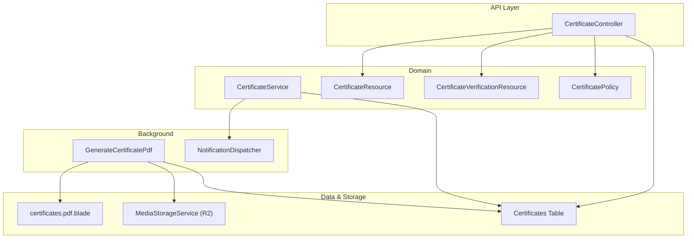
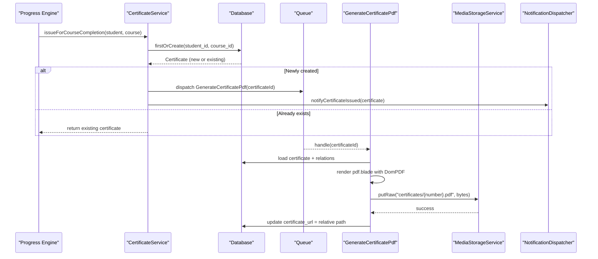
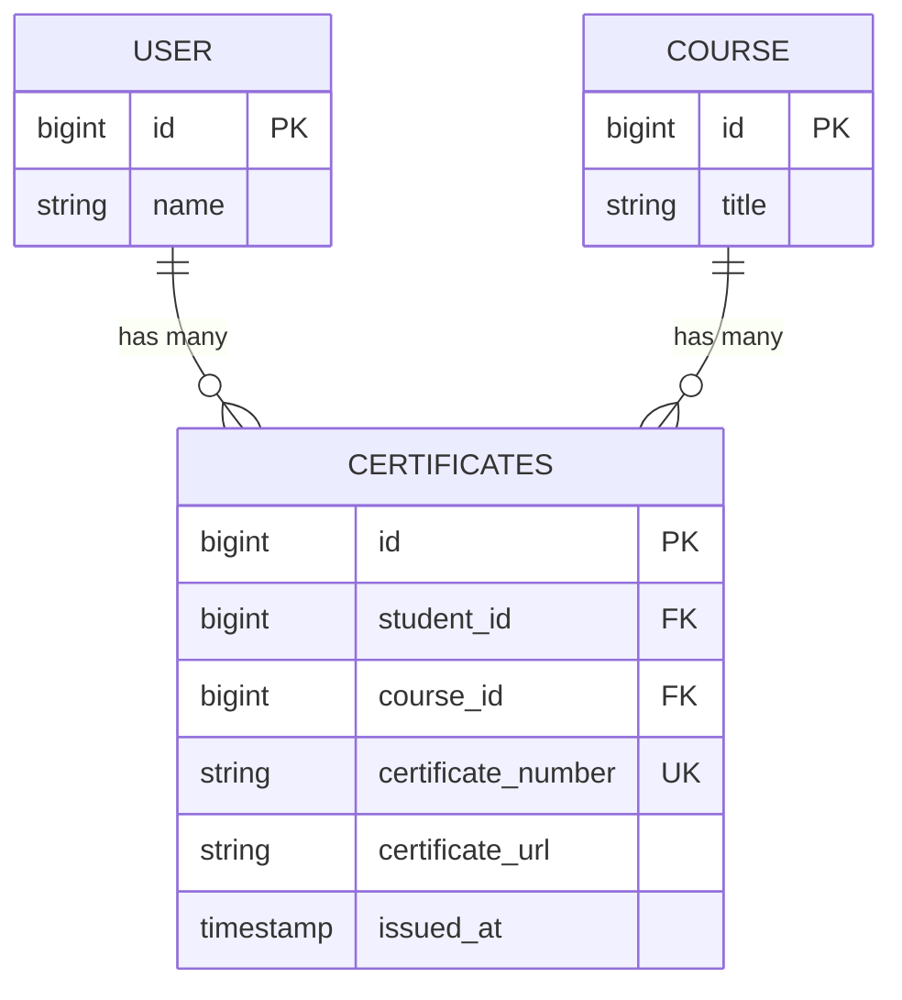
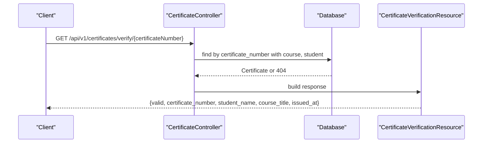
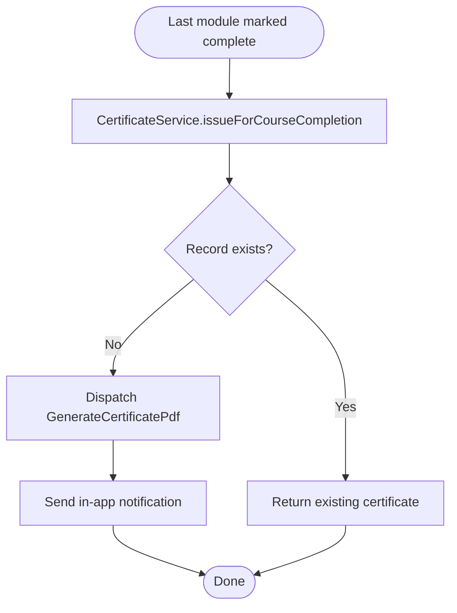
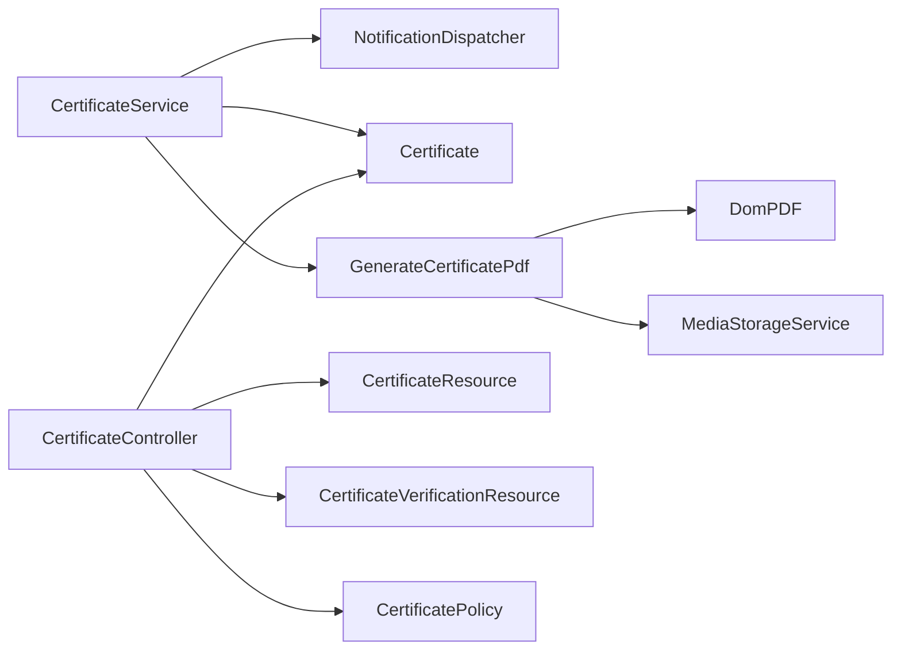

# Certificate Generation Service

<cite>
**Referenced Files in This Document**
- [CertificateService.php](file://app/Services/Certification/CertificateService.php)
- [Certificate.php](file://app/Models/Certificate.php)
- [CertificateController.php](file://app/Http/Controllers/Api/V1/CertificateController.php)
- [GenerateCertificatePdf.php](file://app/Jobs/GenerateCertificatePdf.php)
- [pdf.blade.php](file://resources/views/certificates/pdf.blade.php)
- [CertificateResource.php](file://app/Http/Resources/CertificateResource.php)
- [CertificateVerificationResource.php](file://app/Http/Resources/CertificateVerificationResource.php)
- [CertificatePolicy.php](file://app/Policies/CertificatePolicy.php)
- [api.php](file://routes/api.php)
- [2024_01_01_000160_create_certificates_table.php](file://database/migrations/2024_01_01_000160_create_certificates_table.php)
- [NotificationDispatcher.php](file://app/Services/Notifications/NotificationDispatcher.php)
- [CertificateIssuanceTest.php](file://tests/Feature/Certification/CertificateIssuanceTest.php)
- [CertificateVerificationTest.php](file://tests/Feature/Certification/CertificateVerificationTest.php)
</cite>

## Table of Contents
1. Introduction
2. Project Structure
3. Core Components
4. Architecture Overview
5. Detailed Component Analysis
6. Dependency Analysis
7. Performance Considerations
8. Troubleshooting Guide
9. Conclusion
10. Appendices

## Introduction
This document explains the Certificate Generation Service that issues certificates upon course completion, renders PDFs asynchronously, and exposes public verification endpoints. It covers the CertificateService implementation, certificate template management via a Blade view rendered with DomPDF, storage strategies for generated PDFs, and the verification flow. It also provides examples for generating certificates for course completions, customizing templates, handling revocation concepts, and implementing public verification URLs, along with security considerations to ensure authenticity and anti-tampering.

## Project Structure
The certificate feature spans models, services, jobs, controllers, resources, policies, routes, views, migrations, and tests:
- Model: Certificate defines data shape and relationships to User and Course.
- Service: CertificateService orchestrates issuance and notifications.
- Job: GenerateCertificatePdf renders and stores the PDF off the request cycle.
- Controller: CertificateController exposes authenticated listing/show and a public verify endpoint.
- Resources: CertificateResource and CertificateVerificationResource shape API responses.
- Policy: CertificatePolicy enforces access control.
- Routes: Public verify route and authenticated certificate routes under v1.
- View: Blade template used by DomPDF to render the certificate.
- Migration: Database schema for certificates table with unique constraints.
- Tests: Feature tests covering issuance, idempotency, storage, and verification.

**Diagram sources**
- [CertificateController.php:14-46](file://app/Http/Controllers/Api/V1/CertificateController.php#L14-L46)
- [CertificateService.php:23-35](file://app/Services/Certification/CertificateService.php#L23-L35)
- [GenerateCertificatePdf.php:36-56](file://app/Jobs/GenerateCertificatePdf.php#L36-L56)
- [CertificateResource.php:16-28](file://app/Http/Resources/CertificateResource.php#L16-L28)
- [CertificateVerificationResource.php:20-28](file://app/Http/Resources/CertificateVerificationResource.php#L20-L28)
- [CertificatePolicy.php:13-16](file://app/Policies/CertificatePolicy.php#L13-L16)
- [pdf.blade.php:1-28](file://resources/views/certificates/pdf.blade.php#L1-L28)
- [2024_01_01_000160_create_certificates_table.php:13-22](file://database/migrations/2024_01_01_000160_create_certificates_table.php#L13-L22)

**Section sources**
- [CertificateController.php:14-46](file://app/Http/Controllers/Api/V1/CertificateController.php#L14-L46)
- [api.php:64-66](file://routes/api.php#L64-L66)
- [api.php:156-157](file://routes/api.php#L156-L157)
- [2024_01_01_000160_create_certificates_table.php:13-22](file://database/migrations/2024_01_01_000160_create_certificates_table.php#L13-L22)

## Core Components
- CertificateService: Issues certificates on course completion using firstOrCreate to guarantee exactly one per student/course pair; dispatches PDF generation job and sends an in-app notification.
- GenerateCertificatePdf: Renders the Blade template to PDF using DomPDF, stores the file path via MediaStorageService, and updates the certificate record.
- Certificate model: Defines fillable fields, casts, and belongsTo relationships to User and Course.
- CertificateController: Provides authenticated index/show and a public verify endpoint returning minimal verification data.
- Resources: CertificateResource resolves stored paths to full URLs; CertificateVerificationResource returns a minimal, safe verification payload.
- Policy: Restricts viewing to owners or admins.
- Routes: Public GET /api/v1/certificates/verify/{certificateNumber} and authenticated GET /api/v1/certificates and /api/v1/certificates/{certificate}.
- Migration: Creates certificates table with unique constraints on certificate_number and (student_id, course_id).

**Section sources**
- [CertificateService.php:23-45](file://app/Services/Certification/CertificateService.php#L23-L45)
- [GenerateCertificatePdf.php:36-56](file://app/Jobs/GenerateCertificatePdf.php#L36-L56)
- [Certificate.php:19-45](file://app/Models/Certificate.php#L19-L45)
- [CertificateController.php:16-46](file://app/Http/Controllers/Api/V1/CertificateController.php#L16-L46)
- [CertificateResource.php:16-28](file://app/Http/Resources/CertificateResource.php#L16-L28)
- [CertificateVerificationResource.php:20-28](file://app/Http/Resources/CertificateVerificationResource.php#L20-L28)
- [CertificatePolicy.php:13-16](file://app/Policies/CertificatePolicy.php#L13-L16)
- [api.php:64-66](file://routes/api.php#L64-L66)
- [api.php:156-157](file://routes/api.php#L156-L157)
- [2024_01_01_000160_create_certificates_table.php:13-22](file://database/migrations/2024_01_01_000160_create_certificates_table.php#L13-L22)

## Architecture Overview
The system separates concerns across layers:
- Issuance is triggered when a student completes all required modules. The service creates a certificate row synchronously and queues PDF rendering.
- Rendering uses DomPDF to convert a Blade template into a PDF, which is then uploaded to cloud storage via MediaStorageService. The stored relative path is persisted back to the certificate record.
- API endpoints expose certificate listings (authenticated), individual certificate details (policy-gated), and a public verification endpoint that returns only necessary fields.

**Diagram sources**
- [CertificateService.php:23-35](file://app/Services/Certification/CertificateService.php#L23-L35)
- [GenerateCertificatePdf.php:36-56](file://app/Jobs/GenerateCertificatePdf.php#L36-L56)
- [NotificationDispatcher.php:66-76](file://app/Services/Notifications/NotificationDispatcher.php#L66-L76)

## Detailed Component Analysis

### CertificateService
Responsibilities:
- Ensures exactly one certificate per student/course pair using firstOrCreate.
- Generates a unique certificate number prefixed with CERT-.
- Dispatches the PDF generation job only when a new certificate is created.
- Sends an in-app notification to the student.

Key behaviors:
- Idempotent issuance: calling multiple times does not duplicate records or jobs.
- Asynchronous PDF rendering: keeps issuance fast and non-blocking.

**Section sources**
- [CertificateService.php:23-45](file://app/Services/Certification/CertificateService.php#L23-L45)
- [NotificationDispatcher.php:66-76](file://app/Services/Notifications/NotificationDispatcher.php#L66-L76)

### GenerateCertificatePdf Job
Responsibilities:
- Loads the certificate with related student and course.
- Skips if already processed or missing.
- Renders the Blade template to PDF using DomPDF.
- Stores the PDF via MediaStorageService and persists the relative path to certificate_url.
- Implements ShouldBeUnique keyed by certificateId to prevent duplicates on retries.

Error handling:
- Logs failures with context for observability.

**Section sources**
- [GenerateCertificatePdf.php:36-65](file://app/Jobs/GenerateCertificatePdf.php#L36-L65)

### Certificate Model
- Fields: student_id, course_id, certificate_number, certificate_url, issued_at.
- Relationships: belongsTo User (student) and Course.
- Timestamps disabled; issued_at set automatically.

**Section sources**
- [Certificate.php:19-45](file://app/Models/Certificate.php#L19-L45)

### API Endpoints and Resources
- GET /api/v1/certificates: Lists current user’s certificates with course info.
- GET /api/v1/certificates/{certificate}: Shows a single certificate after policy authorization.
- GET /api/v1/certificates/verify/{certificateNumber}: Public verification returning minimal data.

Resources:
- CertificateResource: Returns id, certificate_number, resolved certificate_url, issued_at, course, and optionally student.
- CertificateVerificationResource: Returns valid flag, certificate_number, student_name, course_title, issued_at.

Authorization:
- CertificatePolicy allows admin or owner to view a certificate.

**Section sources**
- [CertificateController.php:16-46](file://app/Http/Controllers/Api/V1/CertificateController.php#L16-L46)
- [CertificateResource.php:16-28](file://app/Http/Resources/CertificateResource.php#L16-L28)
- [CertificateVerificationResource.php:20-28](file://app/Http/Resources/CertificateVerificationResource.php#L20-L28)
- [CertificatePolicy.php:13-16](file://app/Policies/CertificatePolicy.php#L13-L16)
- [api.php:64-66](file://routes/api.php#L64-L66)
- [api.php:156-157](file://routes/api.php#L156-L157)

### Template Management (DomPDF)
- The Blade view at resources/views/certificates/pdf.blade.php defines the certificate layout and injects student name, course title, certificate number, and issued date.
- Customization points include styling, content order, and additional metadata fields.

Rendering flow:
- Job loads the view with variables and outputs PDF bytes to storage.

**Section sources**
- [pdf.blade.php:1-28](file://resources/views/certificates/pdf.blade.php#L1-L28)
- [GenerateCertificatePdf.php:44-49](file://app/Jobs/GenerateCertificatePdf.php#L44-L49)

### Data Model and Relationships

**Diagram sources**
- [2024_01_01_000160_create_certificates_table.php:13-22](file://database/migrations/2024_01_01_000160_create_certificates_table.php#L13-L22)
- [Certificate.php:31-45](file://app/Models/Certificate.php#L31-L45)

### Verification Flow

**Diagram sources**
- [CertificateController.php:38-46](file://app/Http/Controllers/Api/V1/CertificateController.php#L38-L46)
- [CertificateVerificationResource.php:20-28](file://app/Http/Resources/CertificateVerificationResource.php#L20-L28)

### Storage Strategy
- PDFs are stored under a namespaced path certificates/{certificate_number}.pdf.
- The relative path is saved in certificate_url; full URLs are resolved at read time via MediaStorageService::url() in CertificateResource.
- This aligns with other uploads in the application and ensures consistent URL resolution.

**Section sources**
- [GenerateCertificatePdf.php:51-56](file://app/Jobs/GenerateCertificatePdf.php#L51-L56)
- [CertificateResource.php:21-21](file://app/Http/Resources/CertificateResource.php#L21-L21)

### Example Workflows

#### Generate a certificate for course completion
- Triggered by the Progress Engine when the last required module is completed.
- CertificateService issues the certificate, dispatches PDF generation, and notifies the student.

**Section sources**
- [CertificateService.php:23-35](file://app/Services/Certification/CertificateService.php#L23-L35)
- [CertificateIssuanceTest.php:24-41](file://tests/Feature/Certification/CertificateIssuanceTest.php#L24-L41)

#### Customize certificate templates
- Edit resources/views/certificates/pdf.blade.php to change layout, fonts, colors, and content fields.
- Variables available: studentName, courseTitle, certificateNumber, issuedAt.

**Section sources**
- [pdf.blade.php:1-28](file://resources/views/certificates/pdf.blade.php#L1-L28)

#### Handle certificate revocation
- Current design does not include a revocation field or status. To add revocation:
  - Add a revoked_at column to the certificates table.
  - Update the public verification resource to reflect validity based on revoked_at.
  - Adjust the verification endpoint to return invalid when revoked.
  - Provide an admin endpoint to mark certificates as revoked.

[No sources needed since this section proposes future changes]

#### Implement public verification URLs
- Use GET /api/v1/certificates/verify/{certificateNumber} without authentication.
- Response includes minimal fields suitable for public display.

**Section sources**
- [api.php:64-66](file://routes/api.php#L64-L66)
- [CertificateController.php:38-46](file://app/Http/Controllers/Api/V1/CertificateController.php#L38-L46)
- [CertificateVerificationResource.php:20-28](file://app/Http/Resources/CertificateVerificationResource.php#L20-L28)

## Dependency Analysis
- CertificateService depends on NotificationDispatcher and generates a queue job.
- GenerateCertificatePdf depends on DomPDF and MediaStorageService.
- CertificateController depends on Certificate model, resources, and policy.
- Routes wire controller actions to HTTP endpoints.
- Tests validate behavior including idempotency, storage, and verification.

**Diagram sources**
- [CertificateService.php:23-35](file://app/Services/Certification/CertificateService.php#L23-L35)
- [GenerateCertificatePdf.php:36-56](file://app/Jobs/GenerateCertificatePdf.php#L36-L56)
- [CertificateController.php:16-46](file://app/Http/Controllers/Api/V1/CertificateController.php#L16-L46)

**Section sources**
- [CertificateService.php:23-35](file://app/Services/Certification/CertificateService.php#L23-L35)
- [GenerateCertificatePdf.php:36-56](file://app/Jobs/GenerateCertificatePdf.php#L36-L56)
- [CertificateController.php:16-46](file://app/Http/Controllers/Api/V1/CertificateController.php#L16-L46)

## Performance Considerations
- Asynchronous PDF rendering prevents blocking requests during issuance.
- Unique job keying avoids duplicate renders on retries.
- Storing relative paths reduces payload size; URLs are resolved lazily.
- Minimal verification response reduces bandwidth and exposure of sensitive data.

[No sources needed since this section provides general guidance]

## Troubleshooting Guide
Common issues and diagnostics:
- Missing PDF URL: Ensure the job ran successfully and certificate_url was updated. Check logs for job failures.
- Duplicate issuance: Verify firstOrCreate logic and unique constraints on (student_id, course_id).
- Verification failures: Confirm certificate_number uniqueness and correct routing for the public endpoint.
- Storage errors: Validate MediaStorageService configuration and permissions for writing to the certificates directory.

Relevant checks:
- Job failure logging captures certificate_id and error message.
- Tests demonstrate expected behavior for issuance, idempotency, storage, and verification.

**Section sources**
- [GenerateCertificatePdf.php:59-65](file://app/Jobs/GenerateCertificatePdf.php#L59-L65)
- [CertificateIssuanceTest.php:72-95](file://tests/Feature/Certification/CertificateIssuanceTest.php#L72-L95)
- [CertificateVerificationTest.php:8-25](file://tests/Feature/Certification/CertificateVerificationTest.php#L8-L25)

## Conclusion
The Certificate Generation Service provides a robust, scalable approach to issuing and verifying certificates. It leverages asynchronous processing for PDF generation, secure and minimal public verification, and clear separation of concerns across service, job, controller, and resource layers. With well-defined storage strategies and policy-based access control, it supports customization and extensibility for future features such as revocation and enhanced branding.

[No sources needed since this section summarizes without analyzing specific files]

## Appendices

### Security Considerations
- Public verification endpoint exposes only necessary fields to minimize information leakage.
- Access to detailed certificate data is protected by policy enforcement.
- Certificate numbers are unique and randomly generated to prevent enumeration attacks.
- PDFs are stored with predictable but non-trivial paths; consider adding server-side access controls if direct file access is exposed.
- For stronger anti-tampering:
  - Sign certificate payloads (e.g., HMAC over certificate_number, student_name, course_title, issued_at) and verify signatures on the public endpoint.
  - Include a tamper-evident QR code linking to the verification endpoint.
  - Store a cryptographic hash of the PDF content and compare on retrieval to detect modifications.

[No sources needed since this section provides general guidance]